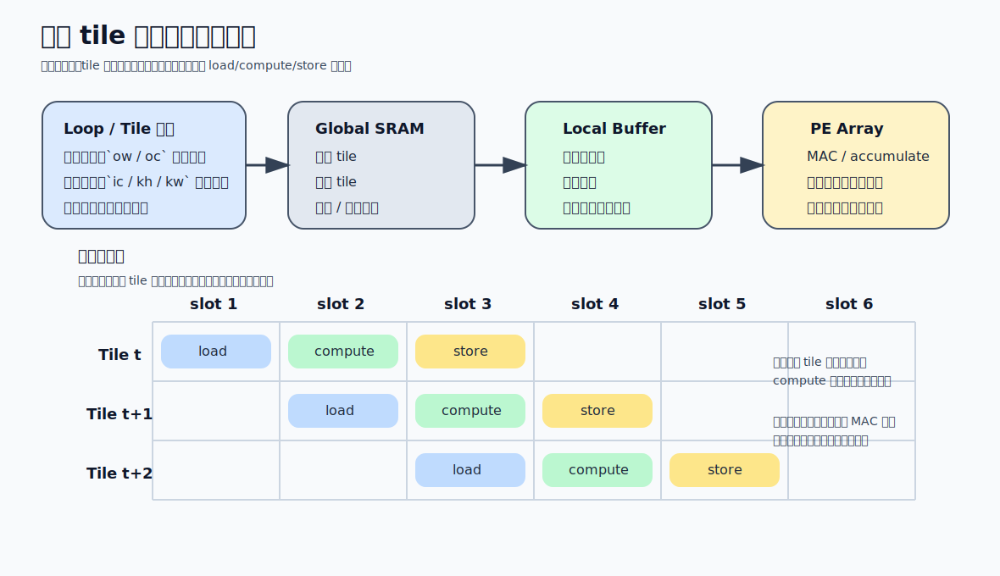

# 04 数据流、硬件循环、片上存储

上一卷把计算核心拆到了 `MAC / PE / 阵列 / 数据路径 / 精度 / 控制` 六个维度。这一卷继续往下压，讨论真正决定可持续吞吐的部分：`数据怎样复用`、`循环怎样展开`、`片上存储怎样分层`、`DMA 怎样把搬运和计算重叠起来`。

同样规模的阵列，效率可以差很多，根源通常不在乘法器，而在这一整条链没有对齐。

## 1. 为什么这卷比“再加一点算力”更重要

神经网络工作负载里，阵列规模经常不是第一个瓶颈，原因有三个：

- 外存带宽跟不上，阵列在等数据
- 片上 buffer 放不下合适的 tile，导致本应复用的数据反复搬运
- 执行顺序没有组织成稳定流水，计算、DMA、回写互相打断

所以真正的高效 NPU，不是先问“放多少 MAC”，而是先问：

1. 哪类数据最贵。
2. 哪类数据最值得留在片上。
3. 用什么循环组织才能让这类数据被反复利用。
4. 用什么搬运机制把供数和计算重叠起来。

这一整套回答，就是数据流和硬件循环设计。

## 2. 先看三类数据，再决定数据流

任何主要算子，最关键的三类数据都是：

- `权重`
- `激活`
- `部分和`

设计数据流时，本质上是在决定三件事：

- 谁尽量不动
- 谁沿阵列流动
- 谁在本地累积

因此常见的数据流分类并不是术语游戏，而是复用方向的直接表达：

| 数据流 | 保持相对静止的对象 | 主要收益 | 常见代价 |
| --- | --- | --- | --- |
| `Weight Stationary` | 权重 | 权重读入一次后可反复使用 | 激活或部分和路径可能更重 |
| `Output Stationary` | 部分和 | 减少部分和回写与重读 | 需要局部累加资源 |
| `Activation/Input Stationary` | 激活 | 适合输入复用强的模式 | 权重搬运压力更高 |
| `Row/Column Stationary` 等变种 | 局部窗口或局部方向 | 细化特定卷积或阵列方向的复用 | 软件映射更复杂 |

判断哪种数据流更合适，不能只看名字，必须看工作负载的三个关键维度：

- `归约维 K` 有多长
- `输出空间` 有多大
- `权重/激活/部分和` 各自复用多少次

例如卷积里，输入窗口和卷积核都可能被重复使用；而在 GEMM 里，A 和 B 的复用方式又不同。数据流设计要做的，就是把复用最高、搬运最贵的那部分数据尽量留在便宜层级。

## 3. 数据流不是抽象概念，而是循环嵌套的物理化

软件里一个卷积常被写成多重循环：

`for n, oc, oh, ow, ic, kh, kw`

硬件不会真的按“软件循环”逐条解释执行，而会把它变成：

- 哪些循环映射到空间并行
- 哪些循环映射到时间展开
- 哪些循环变成 tile
- 哪些循环由 DMA 负责供数

所以一个数据流方案，本质上就是在回答：

- `空间映射`：哪个维度铺到阵列
- `时间映射`：哪个维度按批次推进
- `存储映射`：哪一级 buffer 保存哪一类 tile

把这三件事一起固定下来，循环嵌套就不再是抽象程序结构，而是物理执行节奏。

## 4. 硬件循环的作用：把规则重复工作交给专用控制

如果每处理一个 tile、每做一次小块归约，都要由通用控制器重新取指、解码、分支，那么阵列很难保持高利用率。硬件循环的价值就是把这种`高度规则、反复出现的循环结构`沉到专用控制逻辑里。

一个典型硬件循环单元会负责：

- 计数器更新
- loop bound 判断
- 地址生成
- 与 DMA / buffer / 阵列握手
- 在 loop 结束时切换下一层 tile 或下一阶段状态

它本质上在做两类事：

1. `消除控制开销`
   - 不需要每次都重新走完整指令路径。
2. `稳定执行节拍`
   - 让计算、搬运、回写形成预测性很强的流水。

所以硬件循环不是“循环语法的硬件版”，而是`专门为规则张量计算设计的执行模板控制器`。

## 5. Loop Tiling、Unrolling、Pipelining 为什么总成套出现

### 5.1 Tiling：把问题切到片上能吃得下

不做 tiling，很多层根本放不进片上 buffer。做 tiling 以后，设计才开始真正出现复用。

一个 tile 切得对不对，至少要同时满足：

- 权重 tile 放得下
- 激活 tile 放得下
- 部分和 tile 放得下
- 阵列可以持续吃这个 tile
- DMA 能在下一个 tile 到来前供完数据

tile 过小，DMA 和边界开销占比会高；tile 过大，片上放不下或并发不足。tile 选择不是纯数学问题，而是被 SRAM 容量、bank 数、阵列宽度和 DMA 粒度共同约束的。

### 5.2 Unrolling：把独立迭代摊到更多硬件上

循环展开会提高并行度，但副作用也很直接：

- 需要更多寄存器或局部 buffer
- 数据端口压力更大
- 可能放大访存冲突

所以“能展开多少”不是只看阵列空位，而要看供数链路扛不扛得住。

### 5.3 Pipelining：让不同阶段重叠起来

理想状态下，一个 tile 的读取、计算、回写不应串行排队，而应重叠进行。硬件流水化要解决的就是：

- 阶段之间的握手
- 依赖与冒险
- 资源冲突
- 回压传播

真正的吞吐提升，很多时候来自“把等待重叠掉”，不是来自“多放一点算力”。

把几种常见 loop 变换压成硬件视角，可以更快判断它们为什么重要：

| 变换 | 直接改变什么 | 想换来的收益 | 常见副作用 |
| --- | --- | --- | --- |
| `Tiling` | 工作集大小与复用边界 | 数据留在片上更久 | tile 太小会放大边界和 DMA 开销 |
| `Unrolling` | 同时活跃的计算实例数 | 拉高并行度 | 端口、寄存器、带宽压力增大 |
| `Pipelining` | 阶段重叠程度 | 隐藏等待，稳住吞吐 | 冒险与回压处理更复杂 |
| `Fusion` | 中间结果是否落回更高层级存储 | 减少中间张量搬运 | 调度与资源耦合更紧 |

这张图把 `loop/tile 选择 -> 存储层级 -> load/compute/store` 三件事放到一个画面里。后面读 DMA、双缓冲和有效吞吐时，先用它判断：阵列是在做 MAC，还是其实一直在等下一块 tile。

## 6. 片上存储层级：不是越大越好，而是角色要清楚

在 NPU 里，片上存储通常至少分成几层：

| 层级 | 主要保存什么 | 设计重点 |
| --- | --- | --- |
| `Register File / 累加寄存器` | 当前正在计算的数据和部分和 | 低延迟、多端口、紧贴 PE |
| `PE 局部 buffer` | 小范围复用的数据块 | 就地复用、降低共享访问压力 |
| `Global Buffer / SRAM` | tile 级工作集 | 容量、bank、仲裁、带宽 |
| `片外内存` | 大模型参数和大批量特征图 | 带宽、突发访问、调度 |

每层都应该有明确角色：

- `RF` 解决单周期或短窗口内的高频访问
- `局部 buffer` 解决局部复用
- `全局 SRAM` 解决 tile 级工作集缓存
- `外存` 只解决容量，不该承担频繁往返

如果某层角色模糊，就很容易出现：

- 本该留在 RF 的部分和被频繁写回 SRAM
- 本该留在 SRAM 的权重被频繁从外存重取
- 本该局部交换的数据都挤到共享总线

## 7. 一个卷积 tile 的真实成本怎么看

可以把一个 tile 粗略理解为：

- 输入激活块：`T_h x T_w x C_in`
- 权重块：`K_h x K_w x C_in x C_out_tile`
- 输出块：`T_oh x T_ow x C_out_tile`

写系统设计时，至少要问三遍：

1. 这三块数据分别占多少字节。
2. 哪些数据能跨多个输出点复用。
3. 部分和是在本地累积完再写回，还是中途会溢出回写。

真正决定带宽需求的不是“总算量”，而是：

`总搬运字节 / 可接受执行时间`

如果这个数已经超过片上或片外带宽上限，再好的阵列也喂不饱。

## 8. DMA 的职责：把“搬”从主控里剥离出去

DMA 的本质是让数据搬运脱离 CPU 或主控逐项干预，形成可编排的批量传输。

在 NPU 场景里，DMA 至少承担三类任务：

- 从片外内存搬 tile 到片上 SRAM
- 把计算结果从片上回写到外存
- 在多块 buffer、多个阶段之间做重叠调度

这使 DMA 不只是“搬运工具”，而是吞吐设计的一部分。一个不够好的 DMA 方案会直接让阵列变成“有算力、没粮吃”的状态。

评估 DMA 时至少看：

- 是否支持突发传输
- 是否支持描述符链或批量任务
- 是否能和计算阶段重叠
- 是否有多通道和优先级控制

很多系统的真实瓶颈不在阵列，而在 DMA 不能稳定形成高效数据管道。

## 9. 双缓冲、乒乓缓冲、预取：目标都是把等待藏起来

这几种技术名字不同，目标高度一致：`把下一份数据准备时间藏到当前计算时间里`。

### 9.1 双缓冲 / 乒乓缓冲

基本思想：

- Buffer A 供当前 tile 计算
- Buffer B 同时预装下一个 tile
- 当前 tile 算完后，A/B 角色交换

它解决的是“读下一块数据时阵列必须停下来”的问题。

### 9.2 预取

预取解决的是更早一步的问题：

- 能不能在真正需要数据之前，提前根据访存模式把它拉近
- 预取多早合适，过早会污染 buffer，过晚又来不及

### 9.3 三重流水线

真正成熟的设计往往不是简单双缓冲，而是把阶段拆成：

- `load`
- `compute`
- `store`

然后让这三者并行存在于不同 tile 上。只有这样，片上阵列、DMA、回写链路才可能同时工作。

## 10. 数据布局与访问模式会直接改写有效带宽

同一批数据，layout 不同，有效带宽可能完全不是一个量级。

必须特别注意：

- `NCHW` vs `NHWC`
- 地址对齐
- 跨步访问
- bank 冲突
- 向量 load/store 是否合并

一个常见错误是：理论外存带宽足够，但因为访问模式离散、跨步大、对齐差，实际有效带宽远低于峰值。

所以带宽分析不能只算总线位宽和频率，还要问：

- 访问是否连续
- burst 是否够长
- 数据块是否与阵列消费粒度匹配
- layout 转换要不要额外搬一次

## 11. 判断这一卷设计是否过关的五个问题

1. `数据流是否围绕复用而不是围绕命名`
   - 能不能说清权重、激活、部分和谁留谁动。
2. `硬件循环是否真正降低了控制成本`
   - 是否把规则循环沉成了稳定状态机和地址生成逻辑。
3. `tile 是否和片上存储层级匹配`
   - 不是只“切小”，而是切到恰好可复用、可供数、可累加。
4. `DMA/双缓冲/预取是否形成了重叠`
   - load、compute、store 是否真的并发。
5. `带宽预算是否做过有效带宽而不是峰值带宽分析`
   - 访问模式、layout、对齐、burst 是否被纳入考虑。

如果这五个问题里有两个以上回答不清，系统大概率会在真实层上掉吞吐。

## 12. 常见误区

- 误区：`数据流就是给架构起个名字`
  - 修正：数据流决定的是三类数据的驻留与流动，是复用策略的核心表达。
- 误区：`tiling 只是为了把大矩阵切小`
  - 修正：tiling 的真正目的是把复用、容量、带宽和阵列粒度对齐。
- 误区：`双缓冲一开，吞吐自然就高`
  - 修正：如果 tile 粒度、DMA 带宽、回写路径不匹配，双缓冲也只是多占一份 buffer。
- 误区：`理论峰值带宽够，供数一定没问题`
  - 修正：layout、跨步、burst、bank 冲突都会让有效带宽大幅下滑。
- 误区：`硬件循环只是控制器里的小优化`
  - 修正：它经常决定了阵列能否以稳定节拍连续吃到正确形状的数据。

这一卷真正要建立的不是术语表，而是一种因果链：`数据复用 -> loop/tile -> buffer 层级 -> DMA/预取 -> 实际吞吐`。后面讲量化、稀疏和算子融合时，所有“省计算、省存储、省带宽”的收益，都要回到这条链上判断。

下一卷会沿着同一条链继续推进，但把重点从“怎么搬、怎么存、怎么排”切到“怎么用更少位宽、更少非零和更少中间结果，把这条链整体压缩下来”。
