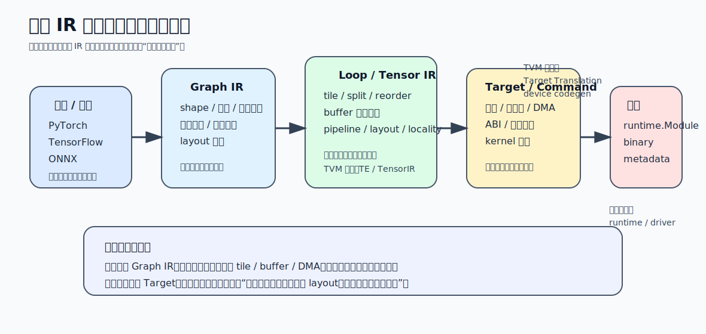

# 06 编译器、图优化、后端生成

前两卷从硬件角度讲清了两条链：

- `数据复用 -> loop/tile -> buffer -> DMA -> 吞吐`
- `少位宽 / 少非零 / 少中间结果 -> 少搬运 / 少存储 / 少无效计算`

这一卷开始回答软件侧最关键的问题：`这些硬件偏好怎么被稳定地翻译成真正可执行的计划`。没有编译器，模型只是一张计算图；没有后端生成，NPU 看到的只是“还没被拆成目标执行单元的意图”。

## 1. 为什么 NPU 比 CPU/GPU 更依赖编译器

CPU 的通用性高，很多决定可以在运行时晚一点做；GPU 也有相对稳定的线程执行模型。NPU 不一样，它经常要求更早、更明确地知道：

- 哪些算子能上 NPU
- tile 怎么切
- 数据流怎么选
- buffer 怎么分配
- 哪些算子能融合
- 哪些部分要回退到 CPU 或别的加速器

所以 NPU 编译器的任务不是“把模型格式转一下”，而是把一张高层图拆成一组和硬件强相关的执行计划。

真正的 NPU 软件栈里，编译器是连接下面两层的桥：

- 上层：模型、框架、算子语义
- 下层：阵列、内存层级、DMA、指令或命令流、runtime 接口

## 2. 一张模型图怎样变成 NPU 真正能执行的东西

可以把整条链压成八步：

1. `图导入`
   - 从 PyTorch、TensorFlow、ONNX 等表示进入编译器。
2. `高层图规范化`
   - 把模型转成统一 IR，消除框架差异。
3. `图级优化`
   - 常量折叠、算子融合、死代码删除、layout 调整。
4. `子图划分`
   - 哪些部分交给 NPU，哪些部分保留在 CPU/GPU。
5. `算子映射`
   - 把高层算子翻译成目标 NPU 支持的原语或复合模式。
6. `内存规划`
   - 决定缓冲区、生命周期、复用、对齐、DMA 需求。
7. `调度与 lowering`
   - 把高层算子逐步压成 loop/tile/kernel/command 级表示。
8. `代码生成与打包`
   - 产生目标代码、命令流、描述符、runtime 模块或二进制工件。

编译器真正困难的地方，是这八步彼此耦合：

- 融合会改内存规划
- 内存规划会反过来限制调度
- 调度会改变 codegen 形状
- 硬件能力又会反过来影响子图划分

实际定位问题时，可以先问自己卡在哪一层：

| 症状 | 优先怀疑哪层 | 为什么 |
| --- | --- | --- |
| 算子根本上不了 NPU | 子图划分 / 算子映射 | 可能没被识别、没被支持，或约束不满足 |
| 功能对但很慢 | 调度 / 内存规划 | 常见是 tile、layout、buffer、DMA 没对齐 |
| 生成结果能跑但经常 fallback | 图优化 / codegen / runtime 边界 | 某些模式没吃到高效路径 |
| 动态 shape 下问题多 | 子图划分 / runtime 边界 | 静态假设被运行时形状破坏 |

## 3. 为什么一定需要多级 IR，而不是“一次翻到指令”

NPU 编译器几乎都需要多级 IR，因为不同阶段关心的问题完全不同。

### 3.1 图级 IR

关注的是：

- 算子语义
- 张量 shape
- 数据依赖
- 可融合模式

它适合做：

- 图简化
- 子图划分
- 融合和常量传播

### 3.2 Loop / Tensor 级 IR

关注的是：

- 循环结构
- tile
- layout
- 调度
- 内存访问模式

它适合做：

- split / fuse / reorder / pipeline
- 与阵列、dataflow、buffer 相关的优化

### 3.3 Target / Command 级 IR

关注的是：

- 目标指令或命令描述符
- DMA 配置
- kernel 边界
- runtime 需要的打包格式

它适合做：

- 最终 codegen
- 与驱动/runtime 的接口拼接

把 TVM 官方架构放进这三层会更具体。它把 `Model Constructor -> Relax/Relay -> Tensor Expression/TensorIR -> Target Translation -> runtime.Module -> Graph Executor / VM` 组织成一条连续流水。上层 IR 保留图语义，中层 IR 暴露张量程序和调度空间，到了 `Target Translation` 才分别把 host 侧代码交给 LLVM 等后端，把 device 侧 kernel 交给目标 codegen。这样再看“多级 IR”，它不是抽象上的层次美观，而是每往下一层就多引入一层硬件承诺。

如果跳过中间层，编译器要么看不懂高层语义，要么无法表达底层执行细节。

这张图要回答的不是“层名怎么背”，而是每层到底多承诺了什么。真正排查 NPU 编译问题时，先定位自己卡在图语义、tile/调度，还是已经掉到 target/command 与 `runtime.Module` 的边界上。

## 4. 图优化不是“让图更漂亮”，而是让硬件更容易吃

NPU 图优化的核心目标只有两个：

- 减少无意义的数据搬运
- 把计算重组为硬件喜欢的模式

典型图优化包括：

- `常量折叠`
  - 提前把可计算常量固化掉
- `算子融合`
  - 减少中间张量落地
- `layout 调整`
  - 让访存模式更符合阵列和 DMA 粒度
- `算子重写`
  - 把高层复杂算子改写为目标 NPU 更容易支持的组合

所以图优化不只是通用编译器手段，它在 NPU 上往往直接决定：

- 数据流能否成立
- buffer 能否放下
- 某段子图是否值得留在 NPU 上

## 5. 子图划分：不是所有算子都应该上 NPU

很多编译问题的关键，不是“怎么让一个算子跑更快”，而是“它值不值得上 NPU”。

子图划分时至少要看：

- 算子是否被目标 NPU 支持
- shape 和 layout 是否落在高效区间
- 是否能与前后算子形成融合块
- 上下文切换和数据回传成本是否超过收益

这也是为什么像 TVM BYOC、OpenVINO 插件、ACL 这类体系都强调：

- 分区
- delegate / backend / plugin
- heterogeneous execution

因为真实系统里，NPU 往往只是异构系统中的一个执行目标，不是唯一目标。

以 TVM BYOC 为例，官方给出的不是“某个算子注册一个回调”这么简单，而是 `annotate candidates -> partition graph -> 把每个子图交给 backend codegen -> 返回 runtime.Module -> 与剩余图一起链接`。这个流程说明三件事：

- BYOC 的基本单位是子图，不是单个 API 钩子
- partition 一旦做错，后面 codegen 和 runtime 只是在被动吃结果
- heterogeneous execution 不是补丁，而是编译期结构化决策

## 6. 算子映射：从语义算子到硬件原语

编译器在做算子映射时，常见三种情况：

| 类型 | 含义 | 典型例子 |
| --- | --- | --- |
| `一对一映射` | 高层算子直接对应硬件原语 | 简单卷积、elementwise |
| `一对多映射` | 一个高层算子被拆成多个目标算子 | 复杂归一化、特殊激活 |
| `多对一/复合映射` | 多个高层算子融合成一个目标块 | Conv + BN + ReLU |

映射策略真正困难的地方是：

- 高层算子语义丰富，但硬件原语有限
- 同一算子在不同 shape、精度和 layout 下，最优映射未必一样
- 某些融合块虽然理论可行，但一旦 buffer 放不下就不值得

所以“支持某个算子”不等于问题结束，真正要问的是：`在什么条件下，编译器能把它映成高效路径`

## 7. 内存规划：NPU 编译器最容易被低估的一层

前面讲硬件时已经看到，很多性能差距不是出在 MAC，而是出在 buffer、tile 和 DMA。编译器的内存规划就是把这些硬件约束真正落实到执行计划中。

需要同时决定：

- 哪些张量常驻
- 哪些张量可复用同一块内存
- 哪些 tile 需要双缓冲
- 哪些缓冲区必须按特定粒度对齐
- DMA 描述符和命令流如何配套

常见方法包括：

- 生命周期分析
- 内存复用
- arena / pool 分配
- 对齐和 bank-aware 分配

如果内存规划做得差，就算调度本身合理，也可能因为：

- buffer 冲突
- 多余回写
- 频繁 re-layout
- DMA 粒度不匹配

把吞吐重新拉低。

## 8. 调度：把硬件偏好写进执行顺序

调度的本质不是“把循环排一下”，而是把目标硬件的偏好固化成执行顺序。

对 NPU 来说，调度通常至少要决定：

- split 的粒度
- 哪个维度空间展开、哪个维度时间推进
- buffer 在何时填充与回收
- 哪些阶段 pipeline 重叠
- 哪些数据布局转换值得保留或提前做掉

这也是 TVM 这类体系里 schedule 为什么重要：

- 它是把高层计算变成低层高效实现的关键接口
- 它直接控制数据局部性和硬件映射质量

没有调度，只有“功能正确”；有了调度，才开始接近“体系结构友好”。

所以编译器优化里最危险的一种错觉是：

- IR 变短了
- pass 变多了
- 日志看起来更“聪明”了

但真实 tile、buffer、DMA 和回退路径没有变。这种情况下，优化通常只是停留在编译器内部，没有传导到系统吞吐。

## 9. Lowering 与 Codegen：从抽象计划变成目标工件

Lowering 的作用是逐层剥掉抽象语义，把它压成更接近硬件的表示。到了 codegen 阶段，编译器要真正产出目标工件，例如：

- 目标指令流
- DMA 描述符
- kernel 二进制
- runtime 模块
- 供驱动加载的元数据

对 NPU 来说，codegen 通常不是简单“吐汇编”，而是要同时考虑：

- 指令和命令配置
- buffer 地址与 offset
- 数据格式和 layout
- 与 runtime/driver 的 ABI

所以 codegen 是后端生成，但它的输入质量取决于前面几层有没有把硬件约束真正吃透。

## 10. 编译器与 runtime 的边界必须说清

很多系统问题都出在边界含混。一个实用划分是：

- `编译器`
  - 决定计划：怎么切、怎么映、怎么分配、怎么生成
- `runtime`
  - 执行计划：怎么装载、调度、同步、回收、处理异常

两者会在这些地方交汇：

- memory plan 的落地方式
- command buffer / binary 的装载格式
- dynamic shape 或多 stream 下的调度策略
- profile 与 debug 数据回传

以 TVM 官方架构为例，编译器最后交出的不只是“某段代码”，而是一组可装载工件：target-specific module、host 侧代码和 `runtime.Module`。而 `Graph Executor / VM` 已经属于运行期执行层。把这条线分清，才能解释为什么 `target translation / external codegen` 属于编译阶段，而 `module load / execute / profile` 属于 runtime 阶段。

边界划不清时，最容易出现两类问题：

- 编译器假设 runtime 会做更多事，结果实际没有
- runtime 被迫在运行时补做本该静态决定的事，开销陡增

这些工件进入系统后的装载、缓存和驱动边界，放到 [07_Runtime_驱动_系统集成/01_Runtime_驱动_系统集成.md](../07_Runtime_驱动_系统集成/01_Runtime_驱动_系统集成.md) 再展开。

## 11. NPU 编译器真正难的地方：不是会不会写 pass，而是收益能否闭环

一个优化 pass 值不值，不该只看它在 IR 上做了什么，而要看它有没有传导到真实收益：

- 图融合是否真的减少了中间搬运
- memory plan 是否真的避免了 buffer 冲突
- schedule 是否真的提高了局部性和阵列利用率
- codegen 是否真的生成了硬件高效路径，而不是退化 fallback

所以编译器验证不能只看功能正确，还必须看：

- profile
- 带宽统计
- 算子/子图回退率
- 阵列利用率
- 最终端到端延迟和吞吐

实际 bring-up 时，一条更稳的顺序通常是：

1. 先保证子图划分和算子映射功能正确。
2. 再把最小 memory plan 和 codegen 跑通。
3. 然后做 tile、layout、schedule 和融合优化。
4. 最后再缩 fallback、补动态 shape、多流和异构协同。

顺序不是绝对规则，但如果最小闭环还没稳定，先堆复杂 pass 往往只会让定位更难。

## 12. 判断这一卷设计是否过关的五个问题

1. `多级 IR 是否各司其职`
   - 图级看语义，loop 级看调度，target 级看工件。
2. `子图划分是否考虑了系统成本`
   - 不只是“能跑”，还要看切换和回传是否值。
3. `算子映射是否说明了条件约束`
   - 不是笼统说“支持某算子”，而是说清高效区间。
4. `内存规划是否和上一卷的数据流链连起来`
   - tile、buffer、DMA、对齐、复用必须一起看。
5. `codegen 是否和 runtime/driver 接口闭环`
   - 最终工件能否被系统稳定装载和执行。

## 13. 常见误区

- 误区：`编译器的工作就是模型格式转换`
  - 修正：真正困难的是划分、映射、调度、内存规划和目标生成。
- 误区：`图优化做完，性能问题就差不多了`
  - 修正：没有 loop 级调度和 memory plan，图优化很难兑现为硬件收益。
- 误区：`只要算子被后端支持，就一定有收益`
  - 修正：shape、layout、tile、buffer、fallback 条件都会改变结果。
- 误区：`runtime 只是把编译好的结果跑一下`
  - 修正：装载、同步、异常、动态形状、多 stream 等都可能反过来影响编译边界设计。
- 误区：`NPU 编译器问题主要是框架 API 问题`
  - 修正：真正本质始终是如何把硬件约束编排进执行计划。

这一卷建立的是第三条系统因果链：`图语义 -> 子图划分 -> 算子映射 -> 内存规划 -> 调度/lowering -> codegen/runtime 工件 -> 真实执行收益`。后面进入 runtime 与系统集成时，就不再讨论“怎么生成计划”，而是讨论“计划进入系统后怎样被稳定执行、同步和维护”。
