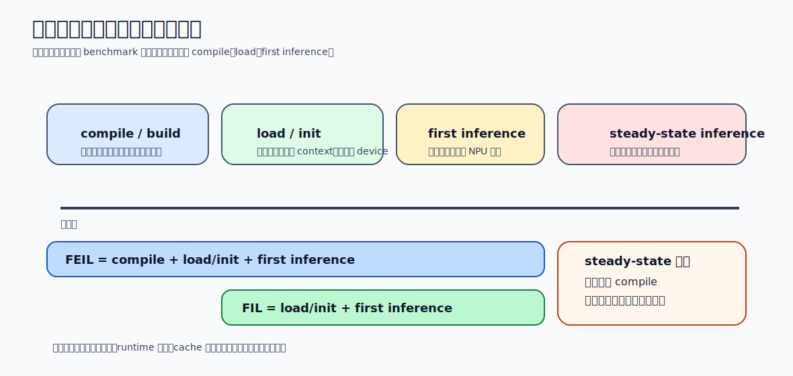

# 08 性能、功耗、安全、多核、Chiplet

前面七卷主要在回答“怎样把单个 NPU 核与执行链设计顺”。这一卷开始面对更现实的系统问题：就算单核、数据流、编译器、runtime 都设计得不错，系统仍然可能因为性能边界、功耗壳、安全要求、多核协同和封装约束而被迫改变形态。

所以这一卷的核心不是再讲新模块，而是建立一个更高层的判断：`系统级约束会反过来重塑架构与执行策略`。

## 1. 先统一一个视角：系统不是追单指标，而是追可持续最优点

NPU 系统真正优化的不是某个孤立峰值，而是一组互相拉扯的目标：

- 吞吐
- 单请求延迟
- 功耗与热
- 面积与成本
- 安全与隔离
- 可扩展性

这意味着：

- 再加一个阵列，可能提升峰值，却压垮热和供电
- 再加多核，可能提升总吞吐，却让互联和同步变成新瓶颈
- 再加安全隔离，可能提升可信度，却增加延迟和复杂度
- 再做 Chiplet，可能缓解大芯片制造难题，却引入新的封装和带宽成本

所以系统级设计不是“把所有优点都叠上去”，而是找一组场景约束下最稳的折中点。

## 2. 性能分析：先分清峰值、有效值和端到端值

看 NPU 性能，至少要区分三种指标：

| 指标 | 问的是什么 |
| --- | --- |
| `峰值算力` | 理论上阵列满载时一秒能做多少操作 |
| `有效硬件吞吐` | 真实层执行时阵列、DMA、buffer 协同后能达到多少 |
| `端到端性能` | 连同 runtime、驱动、预后处理、同步一起看，系统一秒能交付多少任务 |

很多性能误判都来自把这三者混成一个数。

真正分析性能时，至少要同时看：

- 计算受限还是带宽受限
- 算子级热点在哪里
- 多久在等数据
- 多久在等同步
- 多久花在非 NPU 计算上

所以性能评测不只是跑 benchmark，更是分层定位。

官方 benchmark 页面最容易被误读。以 Coral 的 Edge TPU benchmark 为例，官方明确提醒了三件事：

- 不同模型的 demand 不同，同一颗 Edge TPU 不会给所有网络同样的收益
- 如果是 USB Accelerator，结果还会受到 host CPU、USB 速率和其他系统资源影响
- 表里的数字只统计模型执行本身，不包含输入预处理，而且公开 Python 脚本会因为语言开销慢于 C++ benchmark

也就是说，benchmark 的第一职责不是证明“平台有多强”，而是先钉住测试边界。边界没写清，平台对比很容易失真。

## 3. Benchmark、PMC、Timeline：工具不是配套，而是设计闭环的一部分

成熟的性能分析通常靠三类工具闭环：

### 3.1 Benchmark

负责回答：

- 单算子性能怎样
- 模型端到端性能怎样
- 不同输入 shape、batch、精度下变化怎样

但 benchmark 还必须分清冷启动和热启动。OpenVINO NPU 官方文档把这件事直接拆成两种指标：

- `FEIL`
  - 首次编译、装载、初始化并跑出第一次推理的总时延
- `FIL`
  - 对已经编译好的模型，只统计装载、初始化和第一次推理

如果 benchmark 不区分这两者，就会把 compile、cache 命中和 steady-state latency 混成一个数，进而误判 runtime 优化是否真的有效。

看 benchmark 表时，先用这张图问一句：这个数字到底包不包含 `compile`、`load/init`、`first inference`。边界没写清，平台对比、cache 收益和 runtime 优化效果都可能被说错。

### 3.2 PMC（性能计数器）

负责回答：

- 阵列忙不忙
- DMA 忙不忙
- cache/buffer 命中与冲突怎样
- stall 原因主要是什么

### 3.3 Timeline / Trace

负责回答：

- CPU、runtime、DMA、NPU、回调之间谁在等谁
- pipeline 是否真的重叠
- 多 stream 是否互相打断

没有这三类信息，系统优化很容易沦为“改了很多参数，但不知道收益来自哪里”。

实际定位时，可以先按症状分层：

| 症状 | 优先怀疑哪类约束 |
| --- | --- |
| 峰值高、实测低 | 带宽 / 同步 / runtime / 调度 |
| 跑久了降频或掉吞吐 | 功耗 / 热 / 电源管理 |
| 多核扩展不线性 | 通信 / 负载均衡 / 串行部分 |
| 某些部署场景必须关掉调试或 profile | 安全边界 / 权限模型 |
| 单片难以继续放大 | 良率 / 封装 / 互联 / 热 |

## 4. 功耗：不是执行完才看表，而是从架构第一天就要建模

NPU 功耗通常可以粗分成：

- `动态功耗`
  - 开关活动带来的消耗，和频率、切换率、位宽、访存强相关
- `静态功耗`
  - 泄漏相关，工艺和温度影响大

最关键的不是把两类名词背下来，而是认识到：

- 阵列越大，切换活动越难压
- 存储层级越重，访存相关能耗越显著
- 同样工作负载，dataflow 不同，功耗分布也会变

所以低功耗不是“后面再门控一下”，而是和数据流、内存层级、执行策略一起决定的。

## 5. DVFS、时钟门控、电源门控：三种常见节能杠杆

### 5.1 DVFS

通过动态调电压和频率，在不同负载下寻找性能/功耗折中点。

适合：

- 负载波动明显
- 峰值性能只偶尔需要

问题在于：

- 切换延迟
- 调节策略复杂
- 和调度器、温控、QoS 联动强

### 5.2 Clock Gating

本质是让不工作的模块少切换。

优点：

- 对功能影响小
- 动态功耗收益直接

### 5.3 Power Gating

本质是让不工作的模块真正断电。

优点：

- 静态功耗收益更明显

代价：

- 唤醒成本
- 状态保存与恢复复杂

所以系统级电源管理常常需要分层：

- 系统级模式切换
- 模块级 gating
- 细粒度局部控制

## 6. 性能和功耗不能分开看，它们常被同一瓶颈同时支配

一个常见误区是把性能优化和功耗优化看成对立面。实际上在很多 NPU 场景里，它们经常被同一件事同时决定：

- 如果外存反复搬运，性能差，功耗也高
- 如果 tile 不合适，阵列空转，性能差，单位有效计算能耗也差
- 如果同步粒度过细，CPU 和 NPU 都忙于等待，吞吐和能效一起下降

所以很多真正有价值的系统优化，往往同时提升：

- 有效吞吐
- TOPS/W
- 温度稳定性

这也是为什么前面讲的数据流、量化、融合和这一卷的功耗管理本质上连在一起。

## 7. 安全：不是“外加壳”，而是决定系统可信边界

NPU 一旦进入手机、汽车、边缘设备或云端多租户环境，安全就不是附属话题。

必须考虑的风险至少包括：

- 模型与数据被窃取
- 命令流或固件被篡改
- 侧信道泄露
- 故障注入
- 权限边界被绕过

这就要求系统从设计上明确：

- 哪些内容必须在可信环境中执行
- 固件和模型如何做完整性校验
- 调试与生产接口如何隔离
- 错误和异常是否会泄露敏感状态

所以安全不是在 NPU 外面包一层 TEE 就结束，而是贯穿工件、runtime、驱动、硬件接口的系统约束。

## 8. TEE、Root of Trust、Secure/Normal World：安全边界怎么落地

从系统实现角度看，几个关键点最常见：

- `Root of Trust`
  - 给启动链和关键身份提供可信根。
- `Secure World / Normal World`
  - 把可信执行与普通执行环境隔开。
- `Secure Monitor`
  - 管理世界切换和关键资源访问。

这些机制在 NPU 场景里常影响：

- 模型是否能在普通世界明文驻留
- 命令缓冲区是否需要校验
- 固件升级与加载链是否可信
- 性能计数器、调试接口、trace 是否可能泄露敏感信息

因此安全不只是“防攻击”，还会改变：

- 内存映射方式
- 上下文切换成本
- 调试能力
- runtime 权限模型

## 9. 多核 NPU：吞吐上去了，调度和互联也变重了

单核设计走到一定规模后，系统常会改成多核 NPU。但多核不是“把单核复制 N 份”这么简单，因为问题会立刻转移到：

- 任务如何切
- 数据如何分
- 核间如何同步
- 共享资源如何仲裁

常见并行方式包括：

- `数据并行`
  - 不同核处理不同数据块
- `任务并行`
  - 不同核处理不同子任务
- `流水线并行`
  - 不同核负责不同阶段

没有一种方式总是最好，关键要看：

- 工作负载独立性
- 中间数据交换量
- 延迟目标
- 核间互联成本

## 10. 静态、动态、混合调度：多核效率的核心分水岭

### 10.1 静态调度

优点：

- 决定早，开销低
- 可预测性强

缺点：

- 对动态负载适应差

### 10.2 动态调度

优点：

- 更能适应负载波动与不均衡

缺点：

- 调度器和同步开销更大

### 10.3 混合调度

现实里常见做法是：

- 大框架静态决定
- 局部任务动态平衡

因为纯静态容易浪费核，纯动态又容易把控制成本拉高。

所以多核调度真正要问的是：`多出来的吞吐，是否足以覆盖多出来的调度和同步开销`

把三种调度策略压成表，更容易形成工程判断：

| 调度方式 | 优点 | 代价 | 适合什么场景 |
| --- | --- | --- | --- |
| `静态` | 开销低、可预测 | 适应性差 | 负载稳定、实时性强 |
| `动态` | 适应波动强 | 控制开销高 | 负载不均、任务变化大 |
| `混合` | 兼顾稳定和弹性 | 设计更复杂 | 大多数真实多核系统 |

## 11. Amdahl、负载均衡、通信：多核扩展的现实天花板

多核 NPU 的扩展效率不会线性增长，最常见的限制来自：

- 串行部分无法并行
- 核间通信与同步
- 共享内存和互联带宽
- 负载不均衡

所以系统级分析必须盯住：

- 哪部分是并行热点
- 哪部分是不可并行控制或汇总
- 数据切分后通信是否压过计算

这也是为什么“多核总算力翻倍”不等于“任务吞吐翻倍”。

## 12. Chiplet：不是白拿更大芯片，而是用封装换可扩展性

当单片越来越大、制造成本和良率压力越来越高时，Chiplet 会成为自然选择。但它解决的是部分问题，也引入新的系统成本。

Chiplet 的主要吸引力：

- 更好的制造和良率折中
- 更灵活的模块复用
- 不同工艺节点混搭
- 更容易往更高总算力扩展

它带来的新问题：

- 片间互联延迟和带宽
- 一致性和同步
- 电源与热管理
- 封装与测试复杂度

所以 Chiplet 不是“更大芯片的免费版本”，而是把部分问题从片上互联转移成片间互联、封装和系统建模问题。

## 13. 为什么 Chiplet、功耗、多核、安全常常一起出现

因为它们本质上都在问同一件事：`系统边界在哪里，边界之外的代价如何传回到架构内部`

例如：

- 多核会放大互联与同步问题
- Chiplet 会放大片间传输和热问题
- 安全会放大上下文切换、隔离和可观测性问题
- 功耗和温度会限制多核和 Chiplet 的长期稳定点

所以系统架构师不应该把这几件事分开决策，而应统一看：

- 目标场景下最硬的约束是什么
- 哪个约束最先成为系统天花板
- 其余设计是否都在围绕这个天花板让路

一个更稳的系统诊断顺序通常是：

1. 先确认端到端性能瓶颈在算力、带宽、同步还是软件栈。
2. 再看功耗和热是否让这个最优点无法长期维持。
3. 再确认安全边界是否改变了可观测性、调试性和执行路径。
4. 最后再判断多核或 Chiplet 是否真能突破当前天花板，而不是把问题搬到别处。

## 14. 判断这一卷设计是否过关的五个问题

1. `性能分析是否区分了峰值、有效值和端到端值`
   - 不能只报一个 TOPS 或 FPS。
2. `功耗管理是否和数据流、执行策略联动`
   - 不能把功耗当成最后再修的表层参数。
3. `安全是否被建模为系统边界问题`
   - 不能只停留在“有 TEE 就安全”。
4. `多核扩展是否解释了调度与通信代价`
   - 不能只写“支持多核并行”。
5. `Chiplet 是否同时讨论了互联、热、测试与封装`
   - 不能只把它当成更大的算力容器。

## 15. 常见误区

- 误区：`性能问题就是算力不够`
  - 修正：很多性能问题实际来自带宽、同步、runtime 和调度边界。
- 误区：`低功耗就是把频率降下来`
  - 修正：真正有效的低功耗设计必须和数据流、门控策略、负载模式一起建模。
- 误区：`安全会拖慢系统，所以后面再补`
  - 修正：可信边界、模型保护和工件完整性一开始就会改变接口与执行方式。
- 误区：`多核一定更划算`
  - 修正：调度、通信和共享资源可能很快吃掉理论扩展收益。
- 误区：`Chiplet 就是先进封装话题，和 NPU 软件栈无关`
  - 修正：一旦变成多 die 系统，内存、同步、调度、热和可测试性都会反过来影响软件与系统策略。

这一卷建立的是第五条系统因果链：`性能/功耗/安全/扩展约束 -> 架构与执行策略取舍 -> 多核/Chiplet 系统形态 -> 真实可持续系统上限`。接下来进入案例卷时，就要用前面五条因果链去拆不同平台到底把预算押在了哪里。
