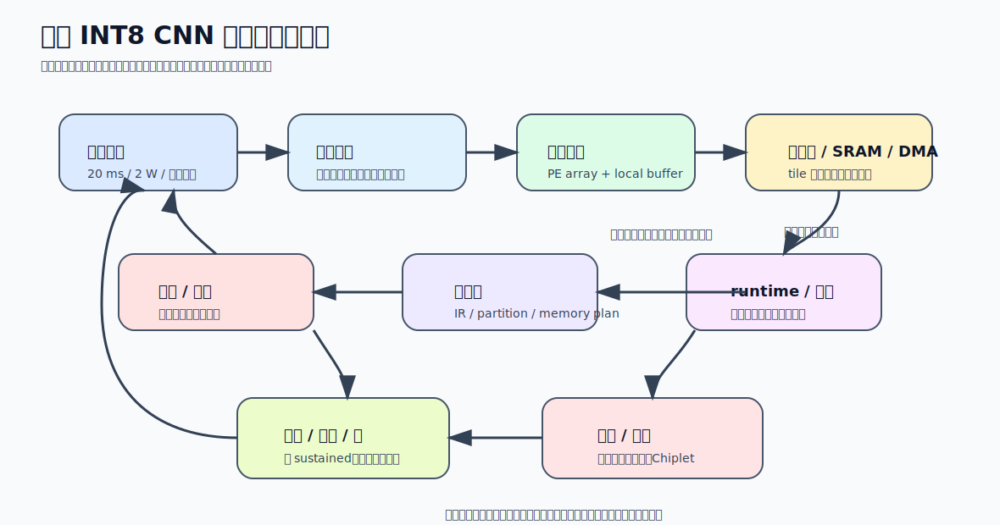

# 10 从模型到系统的闭环案例

前九卷已经把 NPU 设计拆成若干层：工作负载、计算核心、数据流、量化、编译器、runtime、系统约束、平台案例。最后这一卷的任务不是再加新知识，而是把这些层重新串起来，证明它们在真实工程里是一条连续链，而不是十个独立专题。

这里选一个足够典型、又不会被细节噪声淹没的案例：

> 在边缘端做一个小型图像分类模型推理，目标是单帧低延迟、低功耗、可持续运行，并且软件栈能够稳定部署。

这个案例不是为了代表所有模型，而是为了说明：`从工作负载到系统落地，每一层设计如何互相约束`

## 1. 先把问题定义清楚

假设目标场景如下：

- 输入：`224 x 224 x 3` 图像
- 模型：小型 CNN 分类网络
- 精度目标：INT8 推理，允许轻微精度损失
- 延迟目标：单帧 `20 ms` 级
- 功耗目标：边缘设备 `2 W` 级约束
- 系统形态：CPU + 单核 NPU + 外部内存

这一定义一旦确定，很多架构选择就已经被收窄了：

- 不需要大规模训练能力
- 更重视单帧延迟和持续能效
- INT8 有明确价值
- 软件栈必须支持稳定的模型转换和部署

所以这个案例天然更接近边缘推理型 NPU，而不是面向大模型训练的超大吞吐平台。

## 2. 先拆工作负载：真正重的是哪部分

把这个小型 CNN 拆开，会发现主负载通常集中在：

- 多层卷积
- 少量激活和池化
- 末端小型全连接或分类头

这意味着系统真正重视的不是：

- 极复杂控制流
- 超大动态 shape
- 大量长序列依赖

而是：

- 规则乘加
- 卷积窗口复用
- 中间特征图搬运

从第一天起，这个案例的关键瓶颈就不是“有没有足够复杂的控制器”，而是“卷积和中间特征图怎么高效地算和搬”。

## 3. 计算核心怎么选：为什么不会选成 GPU 风格线程海

既然主负载是规则卷积推理，那么计算核心最自然的选择就是：

- 以 MAC/PE 阵列为主
- 配合局部缓存和权重/激活缓存
- 有一定向量单元处理边界和轻量算子

这对应前面建立的判断：

- 工作负载规则
- 数据复用机会清楚
- 精度可压到 INT8

因此最合理的核心组织通常不是大规模线程模型，而是：

`张量阵列 + 局部缓存 + 简化控制 + 向量辅助单元`

因为这样更容易在低功耗下维持稳定有效吞吐。

## 4. 数据流怎么定：为什么卷积推理最怕搬运失控

对这个案例，卷积层占大头，所以数据流设计必须围绕三类数据来定：

- 权重
- 激活
- 部分和

一个常见合理选择是：

- 让部分和尽量本地累积
- 让权重和激活按 tile 进入阵列
- 通过局部缓存和共享 SRAM 提高输入窗口复用

为什么这样选：

- 卷积的归约很明显，部分和频繁回写代价高
- 输入特征图大，中间层激活搬运压力重
- 权重相对更规则，适合预装入缓存并多次使用

所以这个案例里，关键不是“理论 MAC 数够不够”，而是 `tile 和 buffer 是否让卷积的数据复用真的成立`。

## 5. Tile、SRAM、DMA：吞吐能否成立的三件事

进入实现后，系统要做的第一件大事不是写驱动，而是把卷积 tile 切对。

至少要同时满足：

- 输入 tile 放得进 SRAM
- 权重 tile 放得进权重缓存
- 部分和在本地累积时不会溢出
- DMA 能在当前 tile 计算期间把下一 tile 搬进来

这会自然推导出一条执行链：

1. 外存中的权重和激活按 tile 被 DMA 拉入片上
2. 阵列在局部缓存支持下完成卷积乘加
3. 部分和在本地保持到归约完成
4. 输出按需要写回共享 SRAM 或直接进入下一个融合算子

如果这里没有双缓冲或预取，单帧延迟往往会立刻被外存等待拉高。

## 6. 量化和融合为什么在这个案例里几乎是必选项

边缘端 `2 W` 级功耗壳下，如果继续保留高精度、层层回写中间张量，系统很难同时满足：

- 单帧低延迟
- 低功耗
- 可持续运行

所以这类案例里常见的一组组合拳是：

- `INT8 量化`
  - 降低带宽和存储压力
- `Conv + BN + ReLU 融合`
  - 降少中间张量搬运
- 局部敏感层保留更高精度
  - 在精度和效率之间找平衡

这说明量化和融合在这里不是“高级优化”，而是主路径设计的一部分。没有它们，数据流链很可能从一开始就超出功耗和带宽预算。

## 7. 编译器怎样把模型变成这个 NPU 喜欢的计划

到编译器层，任务就变成：

1. 把模型导入统一 IR
2. 识别可上 NPU 的卷积、激活、池化块
3. 做融合和 layout 调整
4. 计算每层 tile
5. 规划中间 buffer 复用
6. 生成 command buffer / kernel / descriptor

对这个案例来说，编译器最重要的不是支持很多花哨 pass，而是把下面几件事做稳：

- 卷积块高效上 NPU
- 融合模式真实落地
- INT8 路径稳定
- memory plan 不反复制造回写

如果编译器在这些点上不稳定，最终系统会出现：

- 某些层 fallback 到 CPU
- 中间张量意外落回外存
- 单帧延迟抖动很大

于是原本正确的硬件选择也会被软件栈抵消。

但“边缘 INT8”并不自动等于同一条软件路径。若走 Edge TPU 一类平台，编译前提是 `fully-int8 TFLite + edgetpu_compiler`，不满足约束的层可能留在 CPU；若走 OpenVINO NPU 一类平台，关键则变成 `compile_model("NPU") + model cache + driver/plugin/compiler` 的闭环，以及 static-shape 等平台边界。也就是说，综合案例里的“编译成功”必须具体到平台语境，不能只写成泛泛的 codegen 成功。

## 8. Runtime 和驱动如何把一次推理跑通

编译器产物准备好以后，runtime 和驱动的最小闭环大致是：

1. 初始化 device / context / stream
2. 装载模型工件
3. 准备输入输出 tensor 和缓冲区
4. 提交 command buffer
5. 由驱动完成内存映射、硬件启动、中断处理
6. 等待完成或异步回调
7. 取回输出并交给后处理

这也是为什么同样叫“模型装载”，不同平台差异会非常大：有的平台装载的是 Edge TPU compiled TFLite，有的平台装载的是 OpenVINO compiled / imported model。前者约束更强但链路短，后者接口统一但更受 cache、driver 和版本边界影响。

这个案例里一个很实用的优化点是：

- 输入预处理、NPU 计算、输出后处理能否形成简单流水

如果做不到，CPU 和 NPU 会交替空闲，端到端吞吐不会好看。

## 9. 性能和功耗如何一起判断

这个案例中，系统真正要盯的不是单一指标，而是：

- 单帧 latency
- 持续运行下的 FPS
- 外存带宽占用
- 功耗与温升
- 阵列有效利用率

一个常见现象是：

- 首帧性能看起来很好
- 连续跑一段时间后降频、掉吞吐

这说明问题不再只是调度，而是：

- 热设计不够
- DVFS 和工作模式切换不合理
- 数据流导致外存与片上频繁切换，能耗过高

所以性能验证必须带持续运行视角，不能只看冷启动结果。

## 10. 安全在这个案例里怎么体现

即使是边缘端小型分类模型，也不意味着安全可以忽略。至少要考虑：

- 模型工件是否允许明文暴露
- 调试接口是否会泄露中间数据
- runtime / 驱动接口是否有权限边界
- 固件和命令流是否可能被篡改

如果场景涉及：

- 私有模型
- 敏感图像
- 可远程更新设备

那么安全边界会直接影响：

- 工件装载方式
- profile 能力
- 调试与日志策略

所以安全不是额外附加项，而是部署条件的一部分。

## 11. 如果把这个案例扩到多核或 Chiplet，会发生什么

假设后续希望把吞吐继续做高，系统自然会考虑：

- 多核 NPU
- 更大的片上缓存
- 甚至 Chiplet

但这时问题不再只是“复制更多阵列”：

- 多核会引入任务划分与同步
- 共享内存与互联会变重
- Chiplet 会带来片间带宽、热和封装问题

也就是说，当前这个边缘单核案例之所以成立，是因为它的目标约束还允许把复杂度控制在单核闭环内。目标一变，系统最优点也会跟着变。

## 12. 这个案例真正说明了什么

把整条链收起来，可以看到一个非常稳定的顺序：

1. 先由场景定义延迟、功耗、成本边界。
2. 再由工作负载决定核心计算骨架。
3. 再由数据流和片上存储决定吞吐能否成立。
4. 再由量化和融合把数据路径整体压轻。
5. 再由编译器把这些偏好落实成静态计划。
6. 再由 runtime 和驱动把计划稳定执行。
7. 最后由性能、功耗、安全和扩展约束决定系统是否可持续。

这张图的作用是把前九卷压成一条会反压回前面的闭环。实际做方案时，若性能、功耗或安全测出来不对，通常不是只改最后一层，而是会一路回退到数据流、量化乃至目标定义本身。

把这条闭环压成一张表，会更容易拿去套别的场景：

| 层 | 本案例里的关键输出 | 下一层最关心什么 |
| --- | --- | --- |
| 目标定义 | `20 ms` 级延迟、`2 W` 级功耗、边缘单核推理 | 哪种架构和精度路线值得考虑 |
| 工作负载分析 | 卷积为主、规则乘加、特征图搬运重 | 阵列和数据流如何组织 |
| 数据流与存储 | tile、局部缓存、双缓冲、DMA 重叠 | 带宽和片上容量是否够 |
| 数值优化 | INT8 + 融合 + 局部高精度保留 | 数据路径是否整体变轻 |
| 编译器 | 融合、映射、memory plan、codegen | runtime 能否稳定装载和执行 |
| runtime/驱动 | 上下文、缓冲区、命令提交、同步 | 端到端性能和稳定性是否成立 |
| 系统约束 | 功耗、热、安全、扩展边界 | 是否需要改到多核或不同平台 |

如果这七步里任何一层和上下层脱节，系统就会出现一种典型症状：

- 硬件强但软件喂不动
- 编译器聪明但 runtime 执行不稳
- 单次跑得快但长期功耗压不住
- 模型能跑但部署条件不满足

所以 NPU 设计从来不是“某一层最优”问题，而是“全链条对齐”问题。

## 13. 用这套案例反推前九卷

这一卷结束后，最好能把每一卷都重新定位：

- `01/02`：定义场景和问题边界
- `03/04`：保证阵列和数据流成立
- `05`：把数据与无效计算压缩掉
- `06/07`：把计划生成并稳定执行
- `08`：确认系统上限和长期可持续性
- `09`：理解不同平台为什么做出不同取舍

如果能做到这一步，说明你看到的已经不是一堆专题，而是一套真正闭环的 NPU 设计方法。

如果把这个案例换成 Transformer 或更大模型，最先变化的通常不是最后的 runtime，而是更前面的几层：

- 工作负载结构从卷积主导变成矩阵乘与带宽更敏感的注意力主导
- 数据流和 tile 策略会重新设计
- 量化、KV cache、内存规划和多核扩展的重要性会上升

这正说明综合案例的价值不在于固定答案，而在于告诉你：场景一变，应该先回到哪一层重新做判断。

## 14. 常见误区

- 误区：`综合案例就是把前面知识点串成一篇复习稿`
  - 修正：综合案例的价值在于展示约束如何逐层传导，而不是回顾概念。
- 误区：`只要模型能跑通，这个案例就成立`
  - 修正：真正成立的标准是性能、功耗、部署和可维护性一起过关。
- 误区：`综合案例应该尽量复杂`
  - 修正：一个边界清楚的小案例，往往比一个混杂太多变量的大案例更能说明问题。

这一卷真正要留下的是方法：面对任何新场景，都能从 `目标约束 -> 工作负载 -> 核心架构 -> 数据流 -> 数值优化 -> 编译 -> runtime -> 系统上限` 这条链一路推到可执行方案。只要这条链能走通，NPU 设计就不再是碎片知识，而是可重复的方法论。
