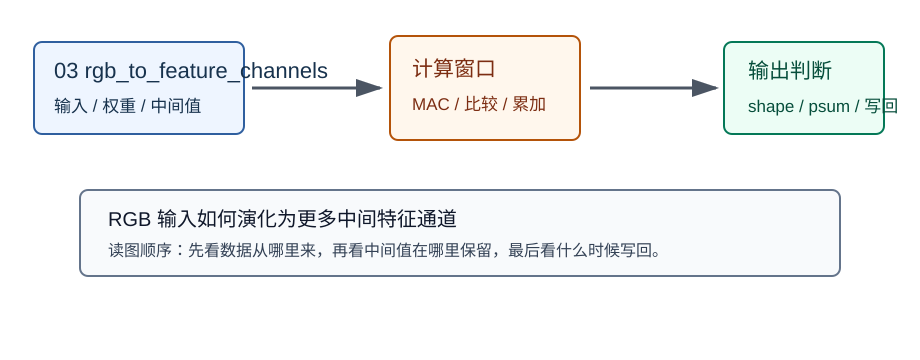
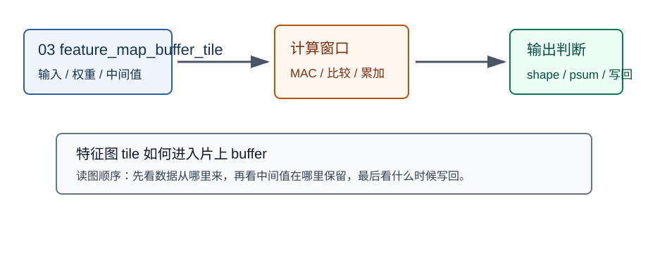

# 03 图像、特征图、通道

> 章节等级：A  
> 状态：重组样稿
> 来源映射：`chapter_source_map.csv` 中的 03 章；本章主要承接 SRC16，参考 SRC03、SRC06。

## 本章知识全景图

### 1. 一眼看懂本章在讲什么

- 本章主题：把“图片”改写成 NPU 能处理的带通道数字张量。
- 核心概念：pixel、channel、feature map、activation、shape、layout、tile。
- 逻辑主线：图像不是语义对象，而是按高度、宽度、通道排列的数字；卷积把这些数字变成新的响应表，通道数和空间尺寸会直接变成 MAC 次数、buffer 压力和 DMA 访问方式。
- 最小学习路径：先看像素怎样变成通道向量，再手算一个局部响应，最后把 `H*W*C` 连接到 NPU 的数据搬运和片上存储。

### 2. 概念地图

| 概念层级 | 核心概念 | 前置知识 | 延伸到 NPU 的位置 |
| --- | --- | --- | --- |
| 输入对象 | pixel / 灰度值 / RGB | shape、axis | 输入激活张量 |
| 通道结构 | channel 是同一位置的并列数值层 | `[C,H,W]` 或 `[H,W,C]` | DMA 连续读取方向、layout 转换 |
| 中间结果 | feature map / activation map | 卷积窗口、响应值 | 输出激活、部分和、下一层输入 |
| 规模代价 | `H*W*C` 与 `C_in*R*S` | 乘加、窗口、通道累加 | MAC 数、buffer 容量、tile 切分 |
| 排错线索 | 通道错位、shape 错、layout 错 | 索引、地址、哨兵值 | bring-up 小张量验证 |


### 3. 阅读顺序 / 处理顺序

- 先建立什么直觉：先把“图像_特征图_通道”落到一个可观察、可手算或可追踪的对象上。
- 再形式化什么定义或流程：围绕“图像进入模型前先变成有形状的数字”和“通道不是颜色标签，而是同一位置的并列描述”整理概念边界、输入输出和约束。
- 最后通过什么例子、操作或推导固化：用“feature map 是响应表，不是原图缩略图”进入复现链，再回到 NPU 的 MAC、buffer、DMA、PE、编译器或 runtime 判断。
## 1. 图像进入模型前先变成有形状的数字

图像对 NPU 来说不是“猫、车、人脸”，而是一段按 shape 排列的数值激活。

一张灰度图可以看成二维表，每个格子是亮度数字：

```text
10 20 30
40 50 60
```

一张 RGB 图在同一个空间位置有 3 个数字。例如左上角像素可以写成：

```text
[R,G,B] = [10, 20, 30]
```

这不是 3 个像素，而是同一个 `(h,w)` 位置上的 3 个通道值。把整张图放进模型时，常见逻辑形状可以是 `[C,H,W]`，也可以是 `[H,W,C]`；二者元素数量相同，但内存相邻方向不同。这个差别到第 12 章会变成 NCHW/NHWC 的 layout 问题，在 NPU 上会影响 DMA 是否能连续读、PE 是否能顺畅取数。

本章需要先钉住几个词：

| 术语 | 本章用法 | 容易错的地方 |
| --- | --- | --- |
| pixel | 图像中的空间采样位置 | 不等于一个通道值 |
| 灰度值 | 一个位置上的亮度数字 | 可能是 0-255，也可能归一化到 0-1 |
| channel | 同一位置上的一类数值层 | 不只 RGB，中间层可有 8/64/256 个通道 |
| feature map | 某层输出的空间响应表 | 不保证能被人类直接命名 |
| activation | 某层输出的数值 | feature map 里的每个格子都是 activation |

## 2. 通道不是颜色标签，而是同一位置的并列描述

通道的关键不是“红绿蓝”，而是“同一个空间位置可以有多种数值描述”。

在原始图像里，这些描述常常是 RGB。进入神经网络后，通道含义会变成某组权重计算出的响应：某个通道可能对竖边强，另一个通道可能对横边强，也可能是人类难以命名的纹理组合。NPU 不理解这些名字，只读取数值并执行乘加。

考虑一张很小的 RGB 图，形状 `[C,H,W] = [3,2,2]`：

```text
R 通道：
1 2
3 4

G 通道：
5 6
7 8

B 通道：
9  10
11 12
```

访问位置 `(行=1, 列=0)` 时，三个通道的值是：

```text
R = 3
G = 7
B = 11
```

这个位置的像素向量就是 `[3,7,11]`。如果某个卷积核给 R 通道较大权重、给 G/B 通道较小或负权重，它检测的不是“红色”这个词，而是按权重组合出来的局部数值差异。


## 3. feature map 是响应表，不是原图缩略图

feature map 的本质是“某一组权重在所有空间位置上的响应值排成表”。

假设某层网络输出 2 个通道，每个通道 2 行 2 列：

```text
输出通道 0：
0 1
2 3

输出通道 1：
4 5
6 7
```

这表示同一张输入图被两个不同模式检测器处理后，得到两张响应表。通道 0 可能更像边缘响应，通道 1 可能更像纹理响应；具体含义来自模型训练，不是硬件写死的。

用一个 2x2 窗口可以把“响应”算出来。窗口为：

```text
0 1
0 1
```

一个偏向检测“右侧亮、左侧暗”的核是：

```text
-1 1
-1 1
```

逐项相乘并求和：

```text
0*(-1) + 1*1 + 0*(-1) + 1*1 = 2
```

如果窗口变成左右都亮：

```text
1 1
1 1
```

响应变成：

```text
1*(-1) + 1*1 + 1*(-1) + 1*1 = 0
```

这个核不是“懂边缘”，而是通过正负权重让某种局部差异得到高响应。输出 feature map 就是把这个核在不同位置得到的响应排成表。如果同一层有两个核，就会产生两个输出通道：

```text
核 A：更关注左右差异 -> 输出通道 A
核 B：更关注上下差异 -> 输出通道 B
```

下一层会把这些输出通道继续当作输入通道读取。中间层通道不是视觉装饰，而是下一层计算量的乘数。

## 4. 通道增长会同时放大权重、MAC 和 buffer 压力

通道数一旦从 RGB 的 3 增到 32、64 或 256，硬件压力不是线性“多几张图”那么简单，而是空间、输入通道、输出通道和卷积核尺寸一起相乘。

若输入是 `C=3,H=5,W=5`，3x3 卷积产生 `C_out=8`，不考虑 padding 时输出空间是 `3x3`。每个输出位置、每个输出通道需要：

```text
C_in * R * S = 3 * 3 * 3 = 27 次乘法
```

整层乘法数是：

```text
C_out * OH * OW * C_in * R * S = 8 * 3 * 3 * 27 = 1944
```

如果下一层输入通道变成 8，同样是 3x3、输出 16 通道，单个输出位置、单个输出通道就需要：

```text
8 * 3 * 3 = 72 次乘法
```

通道增长会同时放大三类对象：

| 对象 | 增长方式 | NPU 后果 |
| --- | --- | --- |
| 输入激活 | `H*W*C_in` | 输入 tile 更大，DMA 搬运更多 |
| 权重 | `C_out*C_in*R*S` | 权重 buffer 压力上升 |
| 输出激活 | `C_out*OH*OW` | 输出 buffer 和写回流量上升 |
| 部分和 | `C_in` 方向累加 | psum 保留时间更长，int32 容量更敏感 |



## 5. 从 feature map 到 NPU 执行，要看 tile、layout 和复用

NPU 处理 feature map 时通常不会把整张中间结果都常驻片上 SRAM，而是取一块空间区域、若干输入通道和若干输出通道的权重，在片上完成一批输出，再换下一块。



判断一个 feature map tile 是否合理，要看四件事：

1. 输入窗口是否能复用：相邻输出位置会共享输入像素，重复从 DRAM 搬会浪费带宽。
2. 通道块是否匹配阵列：`C_in` 太小会让 PE 空等，太大又可能让片上 buffer 放不下。
3. 部分和是否能留在片上：跨通道累加没完成前，过早写回会制造额外带宽。
4. layout 是否支持连续读取：NCHW、NHWC 或 blocked layout 决定 DMA stride 和 PE 取数顺序。

### 用 1x1 卷积看通道怎样混成输出通道

1x1 卷积最适合用来理解通道，因为它不看相邻像素，只在同一个 `(h,w)` 位置上混合通道值。设输入是 `[C,H,W] = [3,2,2]`，某个位置的 RGB 向量为：

```text
x(h,w) = [R,G,B] = [10,20,30]
```

现在用 2 个 1x1 kernel 生成 2 个输出通道：

```text
kernel 0 = [1,0,0]      -> 只读取 R
kernel 1 = [0,1,1]      -> 读取 G+B
```

这个位置的输出是：

```text
y0(h,w) = 10*1 + 20*0 + 30*0 = 10
y1(h,w) = 10*0 + 20*1 + 30*1 = 50
```

如果整张输入空间是 `2x2`，则输出 shape 是 `[C_out,H,W] = [2,2,2]`。总 MAC 数不是 2，也不是 4，而是：

```text
H * W * C_out * C_in = 2 * 2 * 2 * 3 = 24
```

这个例子把三个常被混淆的边界压到同一张小账上：

| 边界 | 正确理解 | NPU 落点 |
| --- | --- | --- |
| 同一位置的通道 | `[R,G,B]` 是一个位置的 3 个输入值 | 输入 buffer 要能取齐这个位置的通道块 |
| 输出通道 | 每个输出通道对应一组独立权重 | weight buffer 保存 `C_out*C_in` 个 1x1 权重 |
| MAC 次数 | 每个输出位置、每个输出通道都要跨 `C_in` 做点积 | PE 执行 `C_in` 次 MAC 后得到一个输出值 |
| 部分和 | `y0/y1` 分别有自己的 accumulator | psum 不能在不同输出通道之间混用 |

这也是为什么“通道只是颜色层”这个理解不够用。到中间层以后，通道数可能远大于 3，1x1 卷积可以在不改变空间尺寸的情况下重新混合通道，既常用于降维/升维，也常用于把特征重新组合成后续层更好用的表示。对 NPU 来说，它的空间复用不强，但通道方向的权重读取和 accumulator 管理非常清楚，适合用来检查通道、权重和输出通道的对应关系。

### layout 决定同一组通道值是不是连续送到 PE

同样的 `[3,2,2]` 小张量，如果按 NCHW 存，内存通常先放完 R 平面，再放 G 平面，再放 B 平面；如果按 NHWC 存，同一个空间位置的 `[R,G,B]` 更可能相邻。对上面的 1x1 卷积来说，NHWC 读一个位置的 3 个通道可能更连续；但对某些卷积循环或向量化后端，NCHW 或 blocked layout 可能更适合按通道块、输出通道块做 tile。

判断 layout 是否合适，不能只问“框架默认是什么”，而要问当前 PE 阵列一次需要哪一组数：

| PE 当前需要 | 连续性更关键的方向 | 错误信号 |
| --- | --- | --- |
| 同一位置的多个输入通道 | `C_in` 连续或可按块读取 | 1x1 conv 频繁跳地址 |
| 相邻空间位置的同一通道 | `W/H` 连续 | 3x3 窗口搬运出现大量 stride gap |
| 多个输出通道的权重 | `C_out` 或 blocked OC 连续 | 权重广播跟不上 PE 阵列 |
| 部分和保留 | 输出通道和空间 tile 边界清楚 | psum 被写到错误输出通道 |

因此，feature map 的硬件问题不是“有一张特征图”这么简单，而是这张表按什么顺序放、一次取哪一块、哪一块会被复用、哪一块必须留在 accumulator 里继续累加。后面的 tile、dataflow、DMA、编译器 lowering，其实都在回答这几件事。

把这一点落到调试记录里，至少要写清五个字段：`shape`、`layout`、`dtype`、`value range`、`producer/consumer`。`shape` 告诉你有多少数；`layout` 告诉你这些数在内存里怎么排；`dtype` 和 `value range` 告诉你量化后是否有截断、饱和或全 0；`producer/consumer` 告诉你这张 feature map 是上一层写出来的，还是下一层正要读取的。缺任何一个字段，NPU bring-up 都容易变成猜谜：输出错了，可能是通道顺序错、量化尺度错、上一层没有写完、下一层读错 layout，也可能只是可视化工具按错误轴解释了同一段内存。

一个合格的 feature map 检查点应该能回答这样的问题：这块 tile 对应原张量的哪个空间范围？包含哪些输入通道？输出通道从哪一组权重来？psum 是新清零还是接着上一块累加？DMA 是连续搬，还是按 stride 搬？这些问题看起来琐碎，但它们正是模型图和硬件任务之间最容易断开的地方。

这里的工程边界要说清：可并行不等于值得并行。很多输出位置和输出通道在数学上互相独立，但硬件是否能并行，还要看数据是否能同时到达、buffer 是否放得下、片上端口是否够、输出写回是否冲突。若数据供给跟不上，增加 PE 数只会让空等更明显。

## 6. 用哨兵值检查通道错位

通道错位最适合用小张量暴露，直接跑大模型反而会把错误埋在后处理和精度波动里。

构造一个 3 通道输入：

```text
通道 0：全填 10
通道 1：全填 20
通道 2：全填 30
```

再使用一个 1x1 卷积核，让某个输出通道只读取第 1 个输入通道，权重为 1，其余权重为 0。正确输出应全部为 20。若输出混入 10 或 30，说明通道顺序、layout 或权重读取发生了错位。

这个实验能同时检查三个层次：

| 检查项 | 应记录内容 | 不合格信号 |
| --- | --- | --- |
| shape | 输入、权重、输出的完整维度 | 只写总元素数 |
| 访问 | 连续读取方向、stride、tile 大小 | 地址跳跃但没有解释 |
| 中间值 | psum、窗口、tile 的保存位置 | 中间值过早写回外存 |
| 硬件连接 | MAC、PE、buffer、DMA 或 runtime 落点 | 只停留在数学公式 |

bring-up 阶段优先用这类小样例，是因为它能让每个轴可识别：哪个值代表通道，哪个值代表空间位置，哪个值代表输出通道。只要小样例错位，后面谈特征提取、数据复用或分类精度都没有意义。

## 7. 常见误区与判断线索

| 误区 | 为什么错 | 正确模型 | 工程后果 | 判断线索 |
| --- | --- | --- | --- | --- |
| NPU 直接理解图片内容 | NPU 接收的是数字张量，语义来自模型结构、权重和后处理 | 硬件只做数值计算 | 部署结果不对时可能误查显示或标签，漏查输入归一化、通道顺序和首层输出 | 调试记录若没有输入范围、通道顺序和首层输出，就还没进入可定位状态 |
| 通道只等于 RGB | 中间层通道可为 8、32、256，表示不同特征响应 | 通道是一组并列数值层 | 低估中间层 MAC、权重和 buffer 压力 | shape 中 `C` 远大于 3，或权重为 `C_out*C_in*R*S` |
| feature map 都能解释成人类可见物体 | 很多通道是模型内部特征组合 | feature map 是响应数字表 | 把量化误差、layout 错误或激活截断误判成“语义异常” | 可视化异常伴随范围突变、通道错位或整通道全 0 时，先查计算链路 |
| 图像大小只影响显示 | 高度、宽度、通道数直接决定乘加和搬运 | shape 是计算量和访存量来源 | 分辨率升高后延迟、外存流量、activation buffer 同时超预算 | `H*W*C` 增大后，早期层耗时和 DMA 字节数同步上升 |
| feature map 是原图缩略图 | 输出通道来自卷积核响应，不是简单缩放 | 它是下一层继续读取的中间激活 | 下一层输入维度误判，导致权重 shape、layout 或 tile 设计错误 | 下一层的 `C_in` 应等于上一层 `C_out`，不是原始 RGB 的 3 |

## 8. 最后速记

### 本章最该记住的结论

- 图像进入 NPU 后是带 shape 和 layout 的数字张量，不是语义图片。
- channel 是同一空间位置的并列数值层；RGB 只是最直观的三通道例子。
- feature map 是某组权重在空间位置上的响应表，不是原图缩略图。
- 通道增长会同时放大权重、MAC、buffer 和 DMA 压力。
- 1x1 卷积能把“同一位置的通道混合”和“输出通道独立权重”讲清楚。
- 调试通道和 layout 时，优先用哨兵值小张量，不要直接上大模型。

### 复现 / 复习清单

- 能写出 `[3,2,2]` RGB 小图在指定 `(h,w)` 位置的三通道值。
- 能手算 2x2 窗口和 `[-1,1;-1,1]` 核的响应。
- 能用 `C_out*OH*OW*C_in*R*S` 估算卷积乘法数。
- 能用 1x1 卷积手算同一位置的输入通道怎样变成多个输出通道。
- 能解释为什么上一层 `C_out` 会成为下一层 `C_in`。
- 能判断 NCHW/NHWC/blocked layout 对某个小 tile 的连续读取方向有什么影响。
- 能设计一个 1x1 卷积哨兵实验检查通道错位。

### 自测题

1. 什么是 pixel？它和 channel value 有什么区别？
2. `[3,224,224]` 和 `[224,224,3]` 元素数量相同，为什么在 NPU 上仍可能性能不同？
3. feature map 和 activation map 的关系是什么？
4. 三通道 3x3 窗口有多少个输入数字？
5. 输入 `C_in=8`、输出 `C_out=16`、3x3 卷积、输出空间 `3x3` 时，总乘法数是多少？
6. 为什么中间层通道数可以不是 3？
7. 对 `[R,G,B]=[10,20,30]`，1x1 kernel `[0,1,1]` 的输出是多少？
8. 为什么同样是 `[3,2,2]`，NCHW 和 NHWC 会让 DMA 连续读取方向不同？
9. 为什么通道错位适合用哨兵值检查？
10. 当图像分辨率升高后，NPU 的哪些资源会最先感受到压力？

答题口径：第 5 题应算出 `16*3*3*8*3*3 = 10368` 次乘法；第 7 题应得到 `50`；第 9 题必须说出哨兵值能让每个通道可识别，从而快速区分通道顺序、layout 和权重读取错误。

## 来源与核对

- 本地来源：SRC18《NPU神经网络编译器TVM NPU后端从入门到精通》，路径 `C:\Users\11035\Desktop\ic\npu\14、NPU\《NPU神经网络编译器TVM NPU后端从入门到精通》\03.html` line 357，说明卷积中的权重、输入数据存在空间/通道复用；SRC16《NPU模型量化与算子融合优化从入门到精通》，路径 `C:\Users\11035\Desktop\ic\npu\14、NPU\《NPU模型量化与算子融合优化从入门到精通》\01.html` line 204、line 228，把 NPU 优化对象落到矩阵乘加、卷积和激活。
- 外部来源：CS231n Convolutional Networks `https://cs231n.github.io/convolutional-networks/` 支撑 volume、channel、filter、activation map 术语；ONNX Conv `https://onnx.ai/onnx/operators/onnx__Conv.html` 支撑输入 X、权重 W、输出 Y 的张量角色；MLIR Linalg `https://mlir.llvm.org/docs/Dialects/Linalg/` 支撑从张量索引到循环映射的解释。
- 本章来源落点：CS231n 用于图像、特征图和通道定义；ONNX 用于约束 Conv 张量角色；本地 SRC18/SRC16 用于把特征图通道连接到复用、buffer 和 NPU 算子执行。
