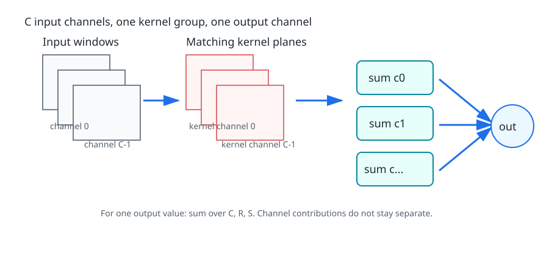
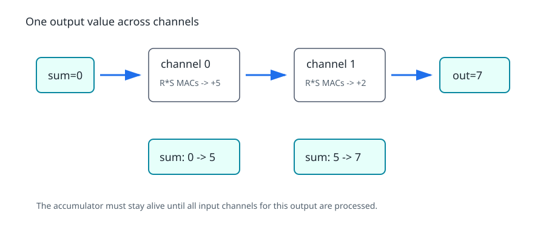
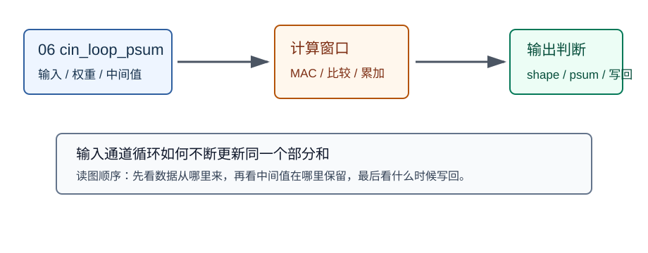
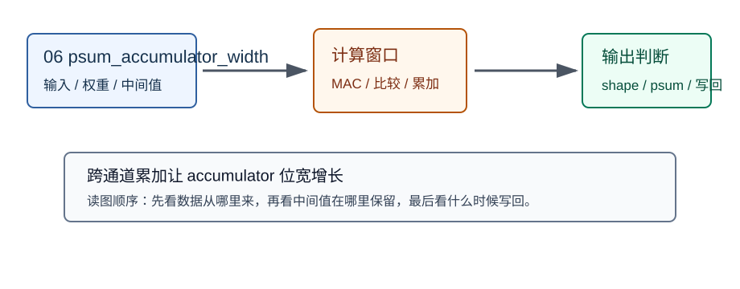

# 06 多通道卷积

> 章节等级：A
> 状态：重组候选
> 来源映射：`chapter_source_map.csv` 中的 06 章；本章主要承接 SRC17、SRC16，参考 SRC01。

## 本章知识全景图

### 1. 一眼看懂本章在讲什么

- 本章主题：把单通道卷积扩展成跨输入通道累加。
- 核心概念：C_in / multi-channel kernel / cross-channel accumulation / partial sum / weight volume
- 逻辑主线：多通道卷积不是每个通道各自产生输出，而是同一个输出值要把所有输入通道窗口的乘加结果累到一起。
- 最小学习路径：单通道窗口 -> 多通道窗口 -> 跨通道累加 -> partial sum -> 通道块 tile。

### 2. 概念地图

| 概念层级 | 核心概念 | 前置知识 | 延伸到 NPU 的位置 |
| --- | --- | --- | --- |
| 输入结构 | 多个输入通道 | 03 特征图通道 | 输入 activation tile |
| 权重结构 | `C_in*R*S` 权重体 | 04 单通道 kernel | 权重 buffer |
| 计算规则 | 跨通道乘加归约 | MAC | psum 累加路径 |
| 硬件代价 | 通道块、psum、带宽 | 05 输出尺寸 | PE 阵列和片上 SRAM |



### 3. 阅读顺序 / 处理顺序

- 先建立什么直觉：先把“多通道卷积”落到一个可观察、可手算或可追踪的对象上。
- 再形式化什么定义或流程：围绕“多通道卷积的输出值来自所有输入通道”和“卷积核从二维表变成三维权重体”整理概念边界、输入输出和约束。
- 最后通过什么例子、操作或推导固化：用“手算跨通道窗口和部分和”进入复现链，再回到 NPU 的 MAC、buffer、DMA、PE、编译器或 runtime 判断。
## 1. 多通道卷积的输出值来自所有输入通道

输入有多个通道时，一个输出值不是选一个通道算，而是跨所有输入通道做窗口乘加并归约。

本章承接第 03 章的通道概念、第 04 章的单通道卷积、第 05 章的 stride、padding 和输出尺寸。为了聚焦“跨通道累加”，本章默认 stride=1、padding=0，并且先只讲一个卷积核生成一个输出通道。多个卷积核生成多个输出通道会放到第 07 章。

你可以把本章看成把第 04 章的单通道卷积重复了多次：输入有几个通道，就有几张输入平面；卷积核也必须有同样数量的通道平面；每个通道各算一个窗口乘加结果，最后再把这些结果加起来。

假设你在判断一道菜好不好吃。你不会只看盐够不够，还会看甜度、酸度、香味和口感。每一项都可以给一个分数，最后综合成一个总分。

多通道卷积也像这样。单通道卷积只看一张二维表；多通道卷积在同一个空间位置要看多个通道上的窗口。每个通道都有自己的一片权重，先得到一个通道贡献值，再把所有通道贡献相加，形成这个输出位置的最终响应。

RGB 图像是最容易理解的入口。一个位置不只有灰度值，而有 R、G、B 三个通道。卷积核如果想检测某种颜色边缘，就不能只看 R，也不能只看 G 或 B；它要同时给三个通道各自的权重，再综合三者。

## 2. 卷积核从二维表变成三维权重体

多通道 kernel 的深度必须等于输入通道数，否则权重无法和输入窗口逐项对齐。

第 04 章的单通道卷积可以写成：

```text
一个窗口 * 一个 2D 核 -> 一个输出值
```

多通道卷积变成：

```text
通道 0 的窗口 * 通道 0 的核 -> 贡献 0
通道 1 的窗口 * 通道 1 的核 -> 贡献 1
通道 2 的窗口 * 通道 2 的核 -> 贡献 2
...
所有贡献相加 -> 一个输出值
```

关键点是：**输入通道不会自动变成输出通道**。如果只有一个卷积核组，即使输入有 3 个通道，输出也仍然只有 1 个通道。输入通道数决定每个输出值要跨多少层输入做累加；输出通道数由卷积核组的数量决定，这一点下一章再展开。

用两个通道举例。输入同一位置附近有两张 2x2 窗口：

```text
通道 0 窗口：        通道 1 窗口：
1 2                 0 1
3 4                 2 1
```

卷积核也有两个通道平面：

```text
通道 0 核：          通道 1 核：
1 0                 2 1
0 1                 0 1
```

通道 0 贡献：

```text
1*1 + 2*0 + 3*0 + 4*1 = 5
```

通道 1 贡献：

```text
0*2 + 1*1 + 2*0 + 1*1 = 2
```

最终输出值：

```text
5 + 2 = 7
```

多通道卷积的直觉就是：同一个空间位置，跨多个通道收集证据，最后汇总成一个响应。



设输入特征图形状为：

```text
C x H x W
```

其中 `C` 是输入通道数，`H` 是高度，`W` 是宽度。一个卷积核组的形状为：

```text
C x R x S
```

注意核的输入通道数必须等于输入特征图的通道数。否则每个输入通道找不到对应权重，或者权重通道没有输入可以相乘。

在 stride=1、padding=0 时，输出空间大小仍然是：

```text
OH = H - R + 1
OW = W - S + 1
```

单个输出位置 `(oh, ow)` 的计算是：

```text
out[oh][ow] =
  sum over c,r,s of input[c][oh+r][ow+s] * kernel[c][r][s]
```

展开看，就是三层求和：

1. 在每个输入通道内，对 `R x S` 窗口做单通道卷积。
2. 得到每个通道的贡献。
3. 把所有通道贡献相加，形成一个输出值。

如果带 stride 和 padding，只是窗口起点从上一章的规则来：

```text
input_h = oh * T - P + r
input_w = ow * T - P + s
```

本章先不展开这个变体，重点放在通道维度的累加。

## 3. 手算跨通道窗口和部分和

输入有 2 个通道，每个通道只取一个 2x2 窗口：

```text
输入通道 0：
1 0
2 1

输入通道 1：
0 2
1 3
```

卷积核也有 2 个通道：

```text
核通道 0：
1 1
0 1

核通道 1：
2 0
1 0
```

先算通道 0：

```text
1*1 + 0*1 + 2*0 + 1*1
= 1 + 0 + 0 + 1
= 2
```

再算通道 1：

```text
0*2 + 2*0 + 1*1 + 3*0
= 0 + 0 + 1 + 0
= 1
```

最后跨通道相加：

```text
2 + 1 = 3
```

所以这个位置的输出值是 `3`。这就是多通道卷积最小动作：通道内乘加，通道间累加。

现在手算一个完整输出特征图。输入有 2 个通道，每个通道 3x3：

```text
输入通道 0：
1 0 2
0 1 3
2 1 0

输入通道 1：
0 1 1
2 0 1
1 3 2
```

卷积核有 2 个通道，每个 2x2：

```text
核通道 0：
1 0
0 1

核通道 1：
0 1
1 0
```

stride=1、padding=0，因此输出大小是：

```text
OH = 3 - 2 + 1 = 2
OW = 3 - 2 + 1 = 2
```

输出位置 `(0,0)`：

```text
通道 0 窗口：
1 0
0 1

通道 0 贡献 = 1*1 + 0*0 + 0*0 + 1*1 = 2

通道 1 窗口：
0 1
2 0

通道 1 贡献 = 0*0 + 1*1 + 2*1 + 0*0 = 3

输出 = 2 + 3 = 5
```

输出位置 `(0,1)`：

```text
通道 0 窗口：
0 2
1 3

通道 0 贡献 = 0*1 + 2*0 + 1*0 + 3*1 = 3

通道 1 窗口：
1 1
0 1

通道 1 贡献 = 1*0 + 1*1 + 0*1 + 1*0 = 1

输出 = 3 + 1 = 4
```

输出位置 `(1,0)`：

```text
通道 0 窗口：
0 1
2 1

通道 0 贡献 = 0*1 + 1*0 + 2*0 + 1*1 = 1

通道 1 窗口：
2 0
1 3

通道 1 贡献 = 2*0 + 0*1 + 1*1 + 3*0 = 1

输出 = 1 + 1 = 2
```

输出位置 `(1,1)`：

```text
通道 0 窗口：
1 3
1 0

通道 0 贡献 = 1*1 + 3*0 + 1*0 + 0*1 = 1

通道 1 窗口：
0 1
3 2

通道 1 贡献 = 0*0 + 1*1 + 3*1 + 2*0 = 4

输出 = 1 + 4 = 5
```

最终输出特征图是：

```text
5 4
2 5
```

这个例子里，每个输出值需要：

```text
C * R * S = 2 * 2 * 2 = 8
```

次乘法。输出有 4 个位置，因此总乘法次数是：

```text
4 * 8 = 32
```

如果输入通道从 2 增加到 64，核仍然是 3x3，那么单个输出值就需要：

```text
64 * 3 * 3 = 576
```

次乘法。多通道是卷积计算量迅速变大的第一个关键原因。

## 4. 跨通道累加如何压到 psum、buffer 和 PE 阵列

多通道卷积给 NPU 带来的压力有三类。

第一类是计算压力。单通道 3x3 卷积一个输出值只需要 9 次乘法；64 通道 3x3 卷积一个输出值需要 576 次乘法。PE 阵列必须把这些乘加安排到时间和空间上执行。

第二类是读取压力。每个输出位置要读取多个通道的输入窗口，还要读取多个通道的权重。如果 layout 让同一位置的通道值连续，跨通道读取可能更方便；如果 layout 让同一通道的空间窗口连续，空间滑动可能更方便。具体采用哪种，要看后续执行计划和硬件偏好。

第三类是累加压力。单个输出值不是一个通道贡献，而是所有通道贡献的总和。硬件要保存正在累加的中间和，直到所有输入通道都处理完，才能得到最终输出。如果中间和频繁写到外部内存，会浪费带宽和能耗；如果能留在 PE 内部寄存器或片上 buffer 附近，就更高效。

可以用一个小型执行顺序理解：

```text
输出位置 (oh, ow):
  sum = 0
  处理通道 0 的 R*S 个乘加 -> sum
  处理通道 1 的 R*S 个乘加 -> sum
  ...
  处理通道 C-1 的 R*S 个乘加 -> sum
  写出最终 out[oh][ow]
```

这个顺序不一定是实际硬件唯一顺序。有的硬件会并行处理多个通道，有的会并行处理多个空间位置。但无论怎么调度，数学上都必须把这些通道贡献累到同一个输出值里。

因此，第 06 章是后面硬件章节的桥梁：它第一次让你看到“一个输出值内部的累加深度”不只来自卷积核大小，还来自输入通道数。

### 终稿候选补强：跨通道累加的真实代价

多通道卷积的核心动作是：同一个输出位置、同一个输出通道，要遍历所有输入通道，把每个通道的局部卷积结果累加到同一个部分和里。它不是“每个通道各自生成一张输出图后全部保留”，而是跨通道合成一个输出响应。



图中 `cin=0,1,2` 三轮都写向同一个 `psum`。这对硬件有两个要求：第一，部分和在所有输入通道累加完成前不能被当作最终输出写回；第二，累加器必须覆盖跨通道、跨核窗口的数值范围。若每个输入通道结束就写回外部内存，再读回来加下一通道，会把带宽浪费在中间值上。

位宽问题比单通道更突出。若每个乘积最大约为 16k，一个 3x3、`C_in=32` 的输出要累加 `32*9=288` 项。即使实际数据不会总取最大，硬件设计和量化策略也必须说明 accumulator 用多宽、何时缩放、是否饱和、是否舍入。否则 int8 卷积的最终数值会在边界案例中漂移。



一个工程判断例子：`C_in=3` 的第一层卷积可以把一个输出的 27 次乘法很快算完；`C_in=128` 的中间层同样 3x3 核则需要 1152 次乘法才得到一个输出位置。此时瓶颈可能从单个窗口计算变成通道块调度、权重块搬运和部分和保存。NPU 往往会按输入通道分块，把若干通道的权重和输入 tile 放进片上，算出一段部分和，再处理下一段。

判断多通道卷积是否讲清楚，要看能否回答：`C_in` 决定每个输出值累加多少项；`C_out` 决定有多少套这样的输出响应；`R*S` 决定每个输入通道窗口内有多少空间项。三者相乘才是计算量主干。

### 终稿候选复核例题：分通道块累加

设输入通道 `C_in=16`，3x3 核，某个 NPU 一次只能在片上放下 4 个输入通道对应的输入 tile 和权重 tile。此时一个输出位置需要分 4 轮完成：第 1 轮累加通道 0-3，第 2 轮累加通道 4-7，第 3 轮累加通道 8-11，第 4 轮累加通道 12-15。四轮结束前，输出只是部分和，不是最终值。

这个例子说明 partial sum 的生命期跨越多个 tile。若部分和存在 PE 寄存器中，速度快但容量有限；存在片上 SRAM 中，容量较大但需要读写端口；写到外部内存，容量不再紧张但带宽和能耗代价最大。NPU 数据流设计中的 output-stationary、weight-stationary、row-stationary 等思路，本质上都在权衡输入、权重和部分和谁更应该停在片上。

常见 bug 是在每个通道块结束后误做 requantize 或激活。正确顺序通常是先完成所有输入通道的累加，再加 bias，再做 scale/round/saturate，再进入激活或写回。如果中途把部分和压回 int8，误差会被后续通道继续放大。

### 发布前可复现实验：跨通道部分和

本章进入发布候选前，必须能用一个很小的实验把核心机制跑通。推荐实验形态是 `C_in=16,R=S=3, channel tile=4`。实验不追求真实模型规模，而是让读者能逐项核对输入、输出、中间值和硬件含义。若小实验都说不清，放到真实 NPU 上只会把错误隐藏在更大的日志里。

实验记录至少写四项。第一，逻辑 shape：每个维度代表什么，谁是 batch，谁是通道，谁是空间或矩阵公共维。第二，数据顺序：内存里相邻元素是谁，DMA 能否连续读取，是否需要 layout 转换。第三，中间状态：部分和、窗口、旁路张量或 tile 在哪里暂存，什么时候清零，什么时候变成最终输出。第四，失败信号：若输出不对，先查 shape 和边界，再查 layout 和地址，最后查量化、饱和或写回顺序。

对本章来说，实验的重点是 通道块累加、psum 保存、requantize 时机。这三个词必须落到具体数字。例如不要只说“复用输入”，而要说明哪一个输入值被几个输出使用；不要只说“部分和变宽”，而要列出单次乘积范围和累加项数；不要只说“layout 更快”，而要指出连续读取的是通道、空间行，还是 blocked 通道组。这样的记录才能让后续章节复用，而不是变成一句抽象经验。

论文或学习笔记中可以把这个实验写成一个短表：

| 检查项 | 应填写内容 | 不合格信号 |
|---|---|---|
| shape | 输入、权重、输出的完整维度 | 只写总元素数 |
| 访问 | 连续读取方向、stride、tile 大小 | 地址跳跃但没有解释 |
| 中间值 | psum/窗口/旁路/tile 的保存位置 | 中间值过早写回外存 |
| 硬件连接 | MAC、PE、buffer、DMA 或 runtime 中的落点 | 只停留在数学公式 |

本章最应避免的错误是：每个通道块结束就量化写回。它的工程后果通常不是“文字不严谨”，而是性能或数值直接出问题：PE 空等、外存带宽暴涨、输出 shape 与参考框架不一致、量化误差扩大，或者编译器无法选择合理 tile。发布候选不是把概念讲顺，而是让这些失败能被读者提前识别。

最后给出一个自检口径：合上正文后，读者应能独立画出数据从输入到输出的路径，并指出至少一个复用点、一个边界条件和一个失败信号。若只能背定义，说明本章还停在知识点层；若能用小实验解释硬件后果，才算真正支撑后续 NPU 设计章节。

### 术语边界与失败排查：输入通道、跨通道累加、partial sum

发布前还要把本章术语边界钉住，因为很多 NPU 错误不是公式不会算，而是把相邻术语混在一起。`输入通道、跨通道累加、partial sum` 这些词在数学、模型图、编译器和硬件里各有落点。读者必须能说出每个词对应的数据对象、循环边界和硬件位置，否则后续章节会在 PE、buffer、DMA、dataflow 处反复断线。

第一条边界是“数学对象”和“存储对象”的区别。数学对象说明这个量应该怎样参与计算，存储对象说明这个量在内存里怎样排列。一个矩阵在公式中有行列，在内存中可能是 row-major、column-major 或 blocked；一个特征张量在模型图中有 N/C/H/W，在硬件中可能被切成空间 tile、通道 tile 或输出通道 tile。写教材时不能只停在数学对象，也不能直接跳到硬件术语，中间必须给出存储和访问口径。

第二条边界是“最终输出”和“中间状态”的区别。NPU 最容易出错的地方往往是中间状态：部分和还没累加完、窗口还没覆盖完、旁路张量还没对齐、tile 还没完成 K 方向归约。若把中间状态提前当成最终输出，就会造成数值错误；若把中间状态频繁写回外存，就会造成性能和能耗问题。正文中的每个例题都应说明中间值在哪里、何时有效、何时失效。

第三条边界是“可并行”和“值得并行”的区别。很多输出位置、输出通道或矩阵元素在数学上相互独立，可以并行；但硬件是否值得并行，还要看数据供给、buffer 容量、片上互连、端口冲突和写回顺序。若并行度超过数据供给能力，PE 数增加只会让空等更明显。讲 NPU 时，凡是出现“可以同时算”，都应接一句“前提是数据能同时到达并且中间值能放得下”。

本章最常见误解是：把多通道卷积误解为多个单通道输出并排保留。它的排查方法是把一个小样例拆成三张表：输入表列出每个元素的索引和内存位置；计算表列出每一步乘、加、比较或选择；输出表列出最终写回的 shape 和地址。三张表对不上时，不要先怀疑模型，而要先查术语边界是否混乱。

工程失败信号集中在：psum 提前量化、通道块写回外存、累加项数漏算。这些信号出现时，报告里应写清“错在定义、错在地址、错在调度，还是错在量化”。如果只是写“性能不佳”或“结果不对”，读者无法复现，也无法连接到后续硬件章节。终稿候选的最低要求，是每个失败都能被追溯到一个术语边界和一个可执行检查。

最后给一个复习口令：先问对象是谁，再问形状是什么，再问存在内存哪里，再问谁复用它，再问什么时候写回。这个顺序能贯穿本书前 9 章。它把零基础读者从“看懂概念”推进到“能检查 NPU 执行计划”，也是基础篇进入微架构篇前必须建立的共同语言。

## 5. 常见误区与判断线索

### 误区 1：输入有几个通道，输出就一定有几个通道

- 错误说法：RGB 有 3 个输入通道，所以卷积输出也一定是 3 个通道。
- 为什么错：本章只有一个卷积核组时，多个输入通道会被累加成一个输出通道。
- 正确理解：输入通道数决定每个卷积核组要看多少层输入；输出通道数由卷积核组数量决定。
- 工程后果：混淆输入通道和输出通道会直接写错权重 shape，NPU 端可能读少权重、读错通道，或让输出 tensor 的 `C_out` 和后续层不匹配。
- 判断线索：看到权重 shape 时先找 `C_out` 和 `C_in` 两个维度；若输出通道数量被写成输入通道数量，就说明概念混淆已经进入实现。

### 误区 2：多通道卷积就是对每个通道单独做卷积后分别保留

- 错误说法：通道 0 算出一张图，通道 1 算出一张图，然后它们都是输出。
- 为什么错：标准卷积会把同一个输出通道对应的各输入通道贡献相加。
- 正确理解：先得到通道贡献，再跨通道求和，形成一个输出通道的一个位置。
- 工程后果：如果把每个输入通道贡献都当最终输出，会多出错误通道；如果跨通道部分和过早写回，也会造成带宽浪费和数值截断。
- 判断线索：检查一个输出位置时，应看到 `cin=0..C_in-1` 都更新同一个 `psum`；如果每个 `cin` 都生成独立输出，说明实现不是标准卷积口径。

### 误区 3：卷积核只有二维大小

- 错误说法：卷积核就是 3x3 或 5x5。
- 为什么错：多通道卷积里，一个卷积核组还包含输入通道维度，形状是 `C x R x S`。
- 正确理解：3x3 只是空间大小；还要乘上输入通道数。
- 工程后果：漏掉 `C_in` 会严重低估权重数量、MAC 数和 buffer 占用，tile 规划也会少算通道循环。
- 判断线索：如果单个输出值的乘法数只写成 `R*S`，没有乘 `C_in`，就说明多通道成本被漏算。

### 误区 4：通道越多只影响参数量，不影响计算过程

- 错误说法：通道数只是模型文件变大。
- 为什么错：每个输出位置要跨更多通道做乘加和累加，计算量和读取量都会增加。
- 正确理解：输入通道数直接进入 `C*R*S`，是单个输出值 MAC 次数的一部分。
- 工程后果：通道数上升会让部分和累加更长、accumulator 位宽压力更大，也会让输入 tile 和权重 tile 更难同时放进片上。
- 判断线索：当 `C_in` 增大后，如果 MAC 数、权重读取和部分和位宽需求没有同步更新，说明性能或数值估算缺了一维。

### 误区 5：所有通道贡献都同等重要

- 错误说法：每个通道对输出影响一样。
- 为什么错：不同通道有不同权重，贡献可能为正、为负或为零。
- 正确理解：卷积核通过各通道权重决定哪些输入通道和局部模式更影响输出。
- 工程后果：假设通道贡献相同会破坏剪枝、量化和调度判断，可能把重要通道裁掉，或把稀疏通道当成同等带宽对象处理。
- 判断线索：如果通道贡献统计、权重量级或激活范围差异很大，就不能用平均通道成本和平均通道重要性直接下结论。

## 6. 最后速记

### 本章最该记住的结论

- 多通道卷积的核心是跨输入通道归约，不是把每个通道独立保留下来。
- `C_in` 会同时放大权重数量、单个输出 MAC 数和 psum 保留压力。
- 通道块切分必须保证 partial sum 在所有输入通道累完后才成为最终输出。
- 调试多通道错误时，优先查通道顺序、权重 shape、psum 清零和写回时机。

### 复现 / 复习清单

完成本章后应能做到：

- 解释多通道卷积不是“每个通道各自输出一张图”，而是先对每个输入通道做窗口乘加，再把通道结果累加成一个输出值。
- 手算 2 个输入通道、2x2 卷积核生成一个输出特征图的全过程。
- 写出多通道卷积中输入通道数、卷积核通道数和输出尺寸之间的关系。
- 说明多通道累加为什么会增加 MAC 次数、输入读取量、权重读取量和中间累加压力。

### 自测题

### 题目

1. 多通道卷积中，卷积核的输入通道数必须和什么相等？
2. 输入形状 `C=3,H=5,W=5`，核形状 `C=3,R=3,S=3`，stride=1、padding=0，输出空间大小是多少？
3. 上题中，单个输出值需要多少次乘法？
4. 2 个输入通道、2x2 核，一个输出值需要多少次乘法？
5. 为什么多通道卷积需要跨通道累加？
6. 输入通道数和输出通道数是同一个概念吗？
7. 如果一个通道贡献是 5，另一个通道贡献是 -2，最终贡献是多少？
8. 多通道卷积会给 NPU 带来哪三类压力？
9. 为什么中间累加和最好不要频繁写回外部内存？
10. 本章为什么还不展开多个输出通道？

### 答案或评分点

1. 必须和输入特征图的通道数相等。
2. `OH=5-3+1=3`，`OW=3`。
3. `3*3*3=27` 次乘法。
4. `2*2*2=8` 次乘法。
5. 因为一个输出值要综合同一空间位置附近多个输入通道的信息。
6. 不是。输入通道数决定每个核看多少输入层；输出通道数由核组数量决定。
7. `5 + (-2) = 3`。
8. 计算压力、读取压力、累加压力。
9. 外部内存访问慢且耗能高，会占用带宽并让计算单元等待。
10. 为了先把“一个核组如何跨输入通道累加”讲清楚，多个核组生成多个输出通道放到第 07 章。

## 来源与核对

- 本地来源：SRC18《NPU神经网络编译器TVM NPU后端从入门到精通》，路径 `C:\Users\11035\Desktop\ic\npu\14、NPU\《NPU神经网络编译器TVM NPU后端从入门到精通》\03.html` line 357，说明卷积中权重和输入数据在空间/通道维度复用；SRC01《NPU Andes NPU IP核设计从入门到精通》，路径 `C:\Users\11035\Desktop\ic\npu\14、NPU\《NPU Andes NPU IP核设计从入门到精通》\02.html` line 262 到 line 273、line 336 到 line 340，说明 PE Array 执行 MAC，SRAM/DMA 负责权重和输入特征图供给。
- 外部来源：ONNX Conv `https://onnx.ai/onnx/operators/onnx__Conv.html` 支撑输入 X、权重 W、bias B、输出 Y 的张量角色；CS231n Convolutional Networks `https://cs231n.github.io/convolutional-networks/` 支撑 filter 贯穿输入深度和通道累加；MLIR Linalg `https://mlir.llvm.org/docs/Dialects/Linalg/` 支撑把多通道卷积看成带归约维度的结构化循环。
- 本章来源落点：ONNX/CS231n 用于核对多通道卷积的 shape 和累加方向；MLIR 用于解释输入通道归约；本地 SRC18/SRC01 用于把通道循环、部分和和片上供数连接到硬件。
