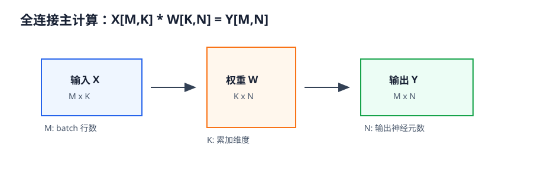
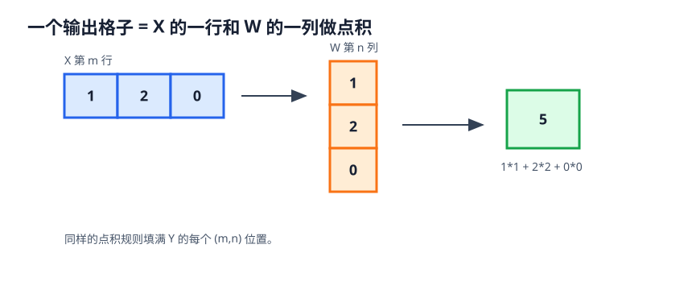
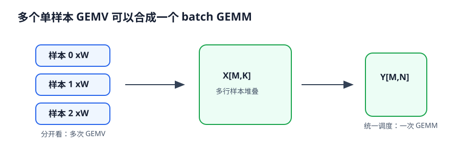
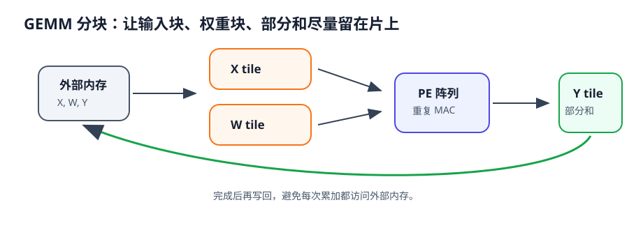

# 09 全连接、GEMM

> 章节等级：A
> 状态：重组候选
> 来源映射：`chapter_source_map.csv` 中的 09 章；本章主要承接 SRC17、SRC18，参考 SRC01。

## 本章知识全景图

### 1. 一眼看懂本章在讲什么

- 本章主题：把全连接层从公式还原成矩阵乘和 GEMM 工作负载。
- 核心概念：fully connected / flatten / GEMV / GEMM / batch / weight matrix
- 逻辑主线：全连接层本质上是矩阵乘；当 batch 或多输出一起处理时，它会变成 NPU 更喜欢的 GEMM 形态。
- 最小学习路径：向量点积 -> 矩阵乘向量 -> batch GEMM -> tile 和复用。

### 2. 概念地图

| 概念层级 | 核心概念 | 前置知识 | 延伸到 NPU 的位置 |
| --- | --- | --- | --- |
| 模型语义 | 全连接、权重矩阵 | 向量/矩阵 | 分类头或投影层 |
| 计算形态 | GEMV、GEMM | MAC | 矩阵乘阵列 |
| 批量扩展 | batch、M/N/K | shape | tile 规划 |
| 硬件映射 | 权重复用、输入复用 | buffer | PE 阵列和 GEMM kernel |



### 3. 阅读顺序 / 处理顺序

- 先建立什么直觉：先把“全连接_GEMM”落到一个可观察、可手算或可追踪的对象上。
- 再形式化什么定义或流程：围绕“全连接层是很多条点积组成的矩阵乘”和“GEMM 把全连接变成可复用的硬件工作负载”整理概念边界、输入输出和约束。
- 最后通过什么例子、操作或推导固化：用“从单个输出手算到矩阵乘”进入复现链，再回到 NPU 的 MAC、buffer、DMA、PE、编译器或 runtime 判断。
## 1. 全连接层是很多条点积组成的矩阵乘

全连接不是每个神经元的神秘连接，而是输入向量和权重矩阵的规则乘加。

本章需要你理解 01 章的向量点积、矩阵乘向量和矩阵乘矩阵，也需要知道 02-03 章里的张量 shape。你不需要先学 BLAS 库或高性能矩阵乘实现；本章只把 GEMM 当成“把很多点积整齐排成一个矩阵乘任务”的工作定义。

上一章讲的激活、池化、残差常常夹在卷积或全连接之后。本章先聚焦全连接的主计算：输入数字和权重数字如何产生输出数字。激活函数可以接在全连接之后，但不是本章 GEMM 的核心。

假设你要给一批学生做综合评价。每个学生有 3 个指标：作业、考试、项目。你有 2 套评价规则：一套偏重考试，一套偏重项目。对每个学生、每套规则，都要做一次“指标乘权重再相加”。

一个学生对一套规则的分数是点积。一批学生对多套规则的分数，就是很多点积排成一张表。全连接层也是这样：一个输入向量和很多组权重分别做点积，得到很多输出神经元；如果一次处理多个样本，就得到一个输出矩阵。

NPU 喜欢这种结构，因为它规则、密集、重复。只要把输入矩阵、权重矩阵和输出矩阵的形状整理好，就可以让大量 MAC 持续运行。

## 2. GEMM 把全连接变成可复用的硬件工作负载

当多个样本或多个输出一起算时，点积会组织成矩阵乘，复用和并行机会才明显。

全连接层的名字容易让人误会。它不是说硬件里真的有很多线把所有东西永久焊在一起，而是说在数学计算上，每个输出神经元都看见全部输入元素。若输入向量长度是 `K`，输出神经元数量是 `N`，那么每个输出都需要 `K` 个权重，整个全连接层需要 `K*N` 个权重。

对一个样本来说，全连接层是矩阵乘向量：

```text
输入 x: 1 x K
权重 W: K x N
输出 y: 1 x N
```

对一批样本来说，把多个输入向量按行堆起来：

```text
输入 X: M x K
权重 W: K x N
输出 Y: M x N
```

这里 `M` 是 batch 里的样本数，`K` 是每个样本的输入长度，`N` 是输出神经元数量。于是全连接层的主计算就变成：

```text
Y = X * W + b
```

其中 `b` 是 bias，通常对每一行输出重复加同一组偏置。



GEMM 的直觉是：不要把每个输出神经元分开算，也不要把每个样本分开算；把它们组成一个统一矩阵乘任务，一次调度一大片 MAC。后续讲 tile、数据复用和 dataflow 时，都会围绕 `M x N x K` 这个三维循环空间展开。

- **全连接层 fully connected layer / dense layer**：每个输出元素都由输入向量的所有元素加权求和得到，通常再加 bias。
- **输入维度 K**：一个样本向量里的元素数量。
- **输出维度 N**：输出神经元数量，也就是权重矩阵的列数。
- **batch 维度 M**：一次一起处理的样本数量。
- **权重矩阵 W**：形状通常写成 `K x N`，其中 `W[k][n]` 表示第 `k` 个输入元素对第 `n` 个输出的权重。
- **bias b**：长度为 `N` 的偏置向量，常对每个样本的输出行广播相加。
- **GEMV**：General Matrix-Vector Multiply，矩阵乘向量。单样本全连接可看成 GEMV。
- **GEMM**：General Matrix Multiply，通用矩阵乘法。本章采用 `C = A * B` 的工作定义，其中 `A` 为 `M x K`，`B` 为 `K x N`，`C` 为 `M x N`。
- **累加维度 K**：每个输出元素内部要沿着 `K` 做乘加归约。
- **broadcast bias**：把长度为 `N` 的 bias 加到输出矩阵的每一行。

形状匹配是底线：`X` 的列数必须等于 `W` 的行数。若 `X` 是 `M x K`，`W` 必须是 `K x N`，输出才是 `M x N`。如果把 `W` 写成 `N x K`，也不是不可以，但计算公式和内存访问约定要相应调整。本书后续默认采用 `X[M,K] * W[K,N] = Y[M,N]` 这个方向，方便和 GEMM 的 `M,N,K` 对齐。

## 3. 从单个输出手算到矩阵乘

先算一个单样本全连接。输入向量：

```text
x = [2, 3, 1]
```

权重矩阵 `W` 是 3 行 2 列：

```text
W =
 1   0
 2   1
-1   3
```

bias：

```text
b = [1, -2]
```

输出有 2 个数。第 0 个输出使用第 0 列权重 `[1,2,-1]`：

```text
y0 = 2*1 + 3*2 + 1*(-1) + 1
   = 2 + 6 - 1 + 1
   = 8
```

第 1 个输出使用第 1 列权重 `[0,1,3]`：

```text
y1 = 2*0 + 3*1 + 1*3 + (-2)
   = 0 + 3 + 3 - 2
   = 4
```

所以输出是：

```text
y = [8, 4]
```

把第 0 个输出写成 MAC：

```text
sum0 = 0
sum0 = sum0 + 2*1   = 2
sum0 = sum0 + 3*2   = 8
sum0 = sum0 + 1*(-1)= 7
sum0 = sum0 + bias0 = 8
```

这就是全连接最小动作：一个输出神经元就是一个点积再加 bias。

现在一次处理 2 个样本，每个样本 3 个输入元素，输出 2 个神经元。

输入矩阵 `X`：

```text
X =
1  2  0
3  1  2
```

权重矩阵 `W`：

```text
W =
1   0
2  -1
0   3
```

bias：

```text
b = [1, 2]
```

先不加 bias，计算 `C = X * W`。输出 `C` 的 shape 是 `2 x 2`。

第 0 行第 0 列：

```text
C[0][0] = 1*1 + 2*2 + 0*0
        = 1 + 4 + 0
        = 5
```

第 0 行第 1 列：

```text
C[0][1] = 1*0 + 2*(-1) + 0*3
        = 0 - 2 + 0
        = -2
```

第 1 行第 0 列：

```text
C[1][0] = 3*1 + 1*2 + 2*0
        = 3 + 2 + 0
        = 5
```

第 1 行第 1 列：

```text
C[1][1] = 3*0 + 1*(-1) + 2*3
        = 0 - 1 + 6
        = 5
```

所以：

```text
C =
 5  -2
 5   5
```

再把 bias `[1,2]` 加到每一行：

```text
Y[0][0] = 5  + 1 = 6
Y[0][1] = -2 + 2 = 0
Y[1][0] = 5  + 1 = 6
Y[1][1] = 5  + 2 = 7
```

最终输出：

```text
Y =
6  0
6  7
```

这个例子就是一个小 GEMM：

```text
M = 2  输入有 2 行，也就是 2 个样本
K = 3  每个输出内部累加 3 项
N = 2  输出有 2 列，也就是 2 个神经元
```

总乘法次数是：

```text
M * N * K = 2 * 2 * 3 = 12
```

每个输出元素要累加 3 个乘积。若不把 bias 算进 GEMM，bias 额外需要 `M*N = 4` 次加法。

再看一个形状变体。若 batch 从 2 变成 8，而 `K=3,N=2` 不变，权重矩阵不变，输入矩阵变成 `8 x 3`，输出变成 `8 x 2`。权重会被 8 个样本复用。对 NPU 来说，这种复用很重要：同一块权重如果能留在片上，就能服务更多输入行。

最后把全连接接回图像网络。假设前面卷积和池化输出形状是 `[C,H,W]=[2,2,2]`，一共有：

```text
K = 2 * 2 * 2 = 8
```

个数字。若要接一个输出 4 类的全连接层，就可以先按约定 flatten 成长度 8 的向量，再乘一个 `8 x 4` 权重矩阵。这里的 flatten 只是把多维张量排成向量；全连接层本身不再保留“哪个数字来自哪一行哪一列”的局部窗口结构。

## 4. GEMM 如何连接 PE 阵列、tile 和带宽

GEMM 是 NPU 和许多加速器最重视的计算形态之一，因为它规则、密集、可并行。每个输出 `Y[m][n]` 都是 `X` 的第 `m` 行和 `W` 的第 `n` 列做点积。不同的 `(m,n)` 输出之间大多可以并行；同一个输出内部沿 `K` 累加，需要维护部分和。



如果一个 PE 负责一个输出元素，它会沿 `K` 做 MAC：

```text
sum = 0
for k in 0..K-1:
    sum += X[m][k] * W[k][n]
```

如果有很多 PE，就可以同时算多个 `m,n` 位置。更重要的是复用：

- 同一个 `X[m][k]` 会被这一行的多个输出列 `n` 使用。
- 同一个 `W[k][n]` 会被多个 batch 行 `m` 使用。
- 同一个输出 `Y[m][n]` 的部分和会在 `K` 方向逐步累加。

这些复用机会决定了后续为什么要讲 tile。真实矩阵可能很大，片上 SRAM 放不下整个 `X`、`W`、`Y`。NPU 会把 GEMM 切成小块，让一块输入、一块权重和一块输出部分和尽量留在片上，多做几次 MAC 后再换下一块。



GEMM 也让“算力”和“带宽”的关系变得清楚。假设 `X` 的某个元素只读一次，却能和多个权重相乘，它的搬运成本就被摊薄；假设权重块能在片上服务多个输入行，也能减少外部读取。反过来，如果每算一个输出都重新从外部内存读完整输入和权重，MAC 数再多也会空等。

全连接和卷积的关系也值得提前建立。卷积保留空间窗口和权重共享，全连接则把输入展平后让每个输出看见全部输入。两者在数学结构上不同，但都可以落到大量 MAC；很多卷积实现还会通过 im2col 等方法转成 GEMM。这个话题放到 13 章展开，本章只要求你先认识 GEMM 的 `M,N,K` 骨架。

### 终稿候选补强：GEMM 分块的最小工程口径

GEMM 的核心形状是 `C[M,N] = A[M,K] * B[K,N]`。手算时可以逐格点积；硬件执行时更关心怎样切块。若 `A`、`B`、`C` 都很大，片上 SRAM 放不下完整矩阵，就要选择 `M_tile,N_tile,K_tile`。其中 `M_tile` 决定一次处理多少输入行，`N_tile` 决定多少输出列，`K_tile` 决定一次累加多少公共维度。

一个最小例子：`M=8,N=8,K=16`，若片上一次只处理 `M_tile=4,N_tile=4,K_tile=8`，那么一个 `4x4` 输出块需要两轮 K 方向累加。第一轮读 `A[4,8]` 和 `B[8,4]`，得到部分和；第二轮再读下一段 `A[4,8]` 和 `B[8,4]`，把部分和补完。只有 K 方向全部处理完，`C[4,4]` 才能写回最终结果。

这解释了为什么 GEMM 的部分和保存很关键。若每轮 `K_tile` 后都把部分和写回外部内存，下轮再读回，会严重浪费带宽。更好的做法是在 PE 或片上 buffer 中保留 `C_tile` 的部分和，直到 K 方向累加完成。NPU 的阵列利用率也取决于 tile 是否贴合阵列形状：`M_tile,N_tile` 太小会让很多 PE 没活干，太大又可能放不下数据。

GEMM 和 BLAS 的关系也要明确。BLAS 是线性代数例程接口传统，GEMM 是其中的通用矩阵乘形态；深度学习里的全连接、MLP、注意力投影、某些卷积 lowering 都可能落到 GEMM 或 GEMM-like 内核。NPU 不一定暴露 BLAS API，但底层仍会面对同样的 `M,N,K`、tile、layout、部分和和带宽问题。

判断一个 GEMM 映射是否合格，可以问五个问题：矩阵形状是否匹配；`K` 方向部分和在哪里累加；`A` 和 `B` 哪个被广播、哪个被驻留；tile 是否放得进片上；输出写回前是否完成 bias、activation 或量化融合。能回答这些问题，才算把“全连接层”从神经网络术语落到了 NPU 执行计划。

### 终稿候选复核例题：GEMM 与卷积 lowering 的边界

很多系统会把卷积转换成 GEMM，但这不是免费的魔法。im2col 会把每个卷积窗口展开成矩阵行，优点是复用成熟 GEMM 内核，缺点是展开矩阵可能很大，重复存放重叠窗口。direct convolution 不显式展开，节省中间存储，但调度和地址生成更复杂。

判断是否适合 lowering，要看三点：第一，展开后的矩阵是否能被片上或缓存层级承受；第二，GEMM 内核带来的阵列利用率是否足以抵消展开成本；第三，框架和 NPU 编译器是否能把 im2col 虚拟化，不真的把大矩阵写到外部内存。若 im2col 展开导致外存流量暴涨，GEMM 算得再快也可能不划算。

全连接层本身通常天然就是 GEMM；卷积转 GEMM 则是实现选择。论文写法应区分这两者：前者是算子数学形态，后者是 lowering 策略。这样后续讨论 direct、im2col、Winograd、systolic array 时，读者不会把“都能落到 MAC”误解成“都应该用同一种执行路径”。

### 发布前可复现实验：GEMM tiling

本章进入发布候选前，必须能用一个很小的实验把核心机制跑通。推荐实验形态是 `M=128,N=64,K=256`。实验不追求真实模型规模，而是让读者能逐项核对输入、输出、中间值和硬件含义。若小实验都说不清，放到真实 NPU 上只会把错误隐藏在更大的日志里。

实验记录至少写四项。第一，逻辑 shape：每个维度代表什么，谁是 batch，谁是通道，谁是空间或矩阵公共维。第二，数据顺序：内存里相邻元素是谁，DMA 能否连续读取，是否需要 layout 转换。第三，中间状态：部分和、窗口、旁路张量或 tile 在哪里暂存，什么时候清零，什么时候变成最终输出。第四，失败信号：若输出不对，先查 shape 和边界，再查 layout 和地址，最后查量化、饱和或写回顺序。

对本章来说，实验的重点是 M/N/K tile、K 向部分和、A/B 复用。这三个词必须落到具体数字。例如不要只说“复用输入”，而要说明哪一个输入值被几个输出使用；不要只说“部分和变宽”，而要列出单次乘积范围和累加项数；不要只说“layout 更快”，而要指出连续读取的是通道、空间行，还是 blocked 通道组。这样的记录才能让后续章节复用，而不是变成一句抽象经验。

论文或学习笔记中可以把这个实验写成一个短表：

| 检查项 | 应填写内容 | 不合格信号 |
|---|---|---|
| shape | 输入、权重、输出的完整维度 | 只写总元素数 |
| 访问 | 连续读取方向、stride、tile 大小 | 地址跳跃但没有解释 |
| 中间值 | psum/窗口/旁路/tile 的保存位置 | 中间值过早写回外存 |
| 硬件连接 | MAC、PE、buffer、DMA 或 runtime 中的落点 | 只停留在数学公式 |

本章最应避免的错误是：只报告乘法次数，不说明 tile 和部分和。它的工程后果通常不是“文字不严谨”，而是性能或数值直接出问题：PE 空等、外存带宽暴涨、输出 shape 与参考框架不一致、量化误差扩大，或者编译器无法选择合理 tile。发布候选不是把概念讲顺，而是让这些失败能被读者提前识别。

最后给出一个自检口径：合上正文后，读者应能独立画出数据从输入到输出的路径，并指出至少一个复用点、一个边界条件和一个失败信号。若只能背定义，说明本章还停在知识点层；若能用小实验解释硬件后果，才算真正支撑后续 NPU 设计章节。

## 5. 常见误区与判断线索

### 误区 1：全连接就是把数字随便连起来

- 错误说法：全连接只是所有输入都连到所有输出，不需要关心形状。
- 为什么错：每个连接都有对应权重，权重矩阵的行列必须和输入、输出维度匹配。
- 正确理解：全连接是严格的矩阵乘；shape 错了，计算就无法定义。
- 工程后果：shape 口径错会让 `K` 维对不上，轻则模型导入失败，重则权重按错误顺序读取后输出整体漂移。
- 判断线索：检查全连接时先核对输入 flatten 后长度、权重矩阵 `K,N` 和输出 `N`；只要三者不闭合，就不能继续谈性能。

### 误区 2：GEMM 是一个新算子，和矩阵乘无关

- 错误说法：GEMM 是 NPU 专有名词，和普通矩阵乘法不一样。
- 为什么错：GEMM 的核心就是通用矩阵乘，只是工程上强调通用尺寸、高性能实现和可调度性。
- 正确理解：把 `A[M,K] * B[K,N] = C[M,N]` 手算清楚，就是理解 GEMM 的起点。
- 工程后果：把 GEMM 神秘化会漏掉最基本的 `M,N,K` 检查，tile、layout 和部分和问题也无从定位。
- 判断线索：如果一个 GEMM 内核说明没有写清 `M,N,K`、矩阵布局和 `K` 方向累加顺序，就还停留在名词层面。

### 误区 3：batch 只是多放几个样本，不影响硬件

- 错误说法：batch 大小只影响一次输入几张图片，硬件无所谓。
- 为什么错：batch 维度 `M` 改变矩阵形状，也改变权重复用和输出并行方式。
- 正确理解：多个样本合成 GEMM 后，权重可以跨样本复用，调度空间更大。
- 工程后果：忽略 batch 会让权重复用和阵列利用率估计失真；小 batch 可能让权重驻留收益下降，大 batch 又可能挤占 activation buffer。
- 判断线索：同一层在 batch=1 和 batch>1 延迟/吞吐差异明显时，优先看 `M_tile`、权重重用次数和输出写回排布。

### 误区 4：bias 是另一个矩阵乘

- 错误说法：加 bias 也需要一套大矩阵乘。
- 为什么错：bias 通常是长度为 `N` 的向量，对输出矩阵每一行做广播加法。
- 正确理解：bias 是逐元素加法，可和 GEMM 输出写回前融合处理。
- 工程后果：把 bias 当 GEMM 会浪费计算和读写；漏掉 bias 融合则可能多一次输出张量外存往返。
- 判断线索：如果 bias shape 是 `[N]`，且每个输出列加同一个值，就应检查它是否在 GEMM epilogue 中完成，而不是单独调度大内核。

### 误区 5：全连接一定比卷积更重要

- 错误说法：全连接看见全部输入，所以一定是模型最核心的计算。
- 为什么错：不同模型结构不同，卷积、注意力、MLP、归一化等计算占比各不相同。
- 正确理解：全连接是重要密集计算形态，但是否主导性能要看模型和 shape。
- 工程后果：错误押注全连接会把优化资源放错位置，可能忽略真正耗时的卷积、attention 投影或 layout 转换。
- 判断线索：看模型性能时按层统计 MAC、字节数和实际耗时；如果 FC 占比很低，就不应把它当作主瓶颈。

### 误区 6：只要 GEMM 乘法次数固定，性能就固定

- 错误说法：`M*N*K` 一样，运行时间就一定一样。
- 为什么错：layout、tile、buffer 容量、数据复用、并行度和内存带宽都会影响性能。
- 正确理解：乘法次数只是下限线索，真实效率取决于数据如何移动和复用。
- 工程后果：只比较 MAC 数会误判 GEMM 内核，两个形状乘法次数相同，却可能因为 skinny matrix、layout 转换或 tile 不贴阵列而利用率相差很大。
- 判断线索：当 `M*N*K` 相同但延迟不同，查看 `M,N,K` 是否让阵列边缘大量空置、`K_tile` 是否导致部分和反复写回、输入布局是否需要转置。

## 6. 最后速记

### 本章最该记住的结论

- 全连接层可以写成 `Y = XW + b`，核心仍是 MAC。
- GEMV 适合单样本向量乘矩阵，GEMM 更适合批量和高利用率硬件执行。
- 矩阵乘的关键维度是 M/N/K，它们决定 tile、复用和部分和。
- 全连接不是卷积之外的孤岛，后续 im2col 也会把卷积转换成类似 GEMM 的工作负载。

### 复现 / 复习清单

完成本章后应能做到：

- 解释全连接层为什么本质上是一批点积。
- 手算单样本全连接、带 batch 的矩阵乘和 bias 加法。
- 说清 GEMM 的 `M`、`N`、`K` 三个维度分别代表什么。
- 分清 GEMV、GEMM、矩阵乘、全连接层之间的关系。
- 从 NPU 视角理解 GEMM 为什么是后续 tile、data reuse、dataflow 和 PE 阵列设计的核心入口之一。

### 自测题

### 题目

1. 全连接层中，输入长度为 `K`、输出长度为 `N`，权重数量是多少？
2. 若 `X` 是 `4 x 8`，`W` 是 `8 x 3`，输出 shape 是什么？
3. 上题中 `M,N,K` 分别是多少？
4. 计算 `[1,2]` 乘权重矩阵 `[[3,4],[5,6]]` 的输出。
5. bias `[1,-1]` 加到上题输出后结果是什么？
6. GEMV 和 GEMM 的区别是什么？
7. 为什么 batch 维度能带来权重复用机会？
8. 一个 `M=2,N=3,K=4` 的 GEMM 需要多少次乘法？
9. 为什么 GEMM 的部分和不能每加一次都写回外部内存？
10. flatten 后接全连接为什么会弱化原来的空间局部结构？

### 答案或评分点

1. `K*N` 个，不含 bias。
2. `4 x 3`。
3. `M=4,K=8,N=3`。
4. 第 0 个输出 `1*3+2*5=13`，第 1 个输出 `1*4+2*6=16`，结果 `[13,16]`。
5. `[14,15]`。
6. GEMV 是矩阵乘向量，常对应单样本；GEMM 是矩阵乘矩阵，可一次处理多个样本或多个输出块。
7. 多个样本使用同一组权重，权重读入片上后可服务多行输入。
8. `2*3*4=24` 次乘法。
9. 外部内存访问慢且耗能高，频繁写回会让 MAC 等数据并浪费带宽。
10. flatten 把通道、高度、宽度按顺序压成一维，后续全连接只看向量位置，不再显式滑动局部窗口。

## 来源与核对

- 本地来源：SRC18《NPU神经网络编译器TVM NPU后端从入门到精通》，路径 `C:\Users\11035\Desktop\ic\npu\14、NPU\《NPU神经网络编译器TVM NPU后端从入门到精通》\02.html` line 392 到 line 408，给出矩阵乘法调度和 tiling 示例；同课程路径 `C:\Users\11035\Desktop\ic\npu\14、NPU\《NPU神经网络编译器TVM NPU后端从入门到精通》\03.html` line 402，把 `GEMM C_buffer, A_buffer, B_buffer` 写成通用矩阵乘指令形态。
- 外部来源：ONNX Gemm `https://onnx.ai/onnx/operators/onnx__Gemm.html` 支撑 `alpha*A*B + beta*C`、转置属性和 bias/广播口径；ONNX MatMul `https://onnx.ai/onnx/operators/onnx__MatMul.html` 支撑矩阵乘和广播形状规则；Netlib BLAS `https://www.netlib.org/blas/` 支撑 GEMM/BLAS 命名背景；MLIR Linalg `https://mlir.llvm.org/docs/Dialects/Linalg/` 支撑把矩阵乘看成结构化循环和索引映射。
- 本章来源落点：ONNX 用于核对全连接和 GEMM 公式；BLAS 用于说明 GEMM 是通用矩阵乘传统命名；TVM 和本地 SRC18 用于把 `M,N,K`、tile、buffer、部分和连接到编译器和 NPU 执行计划。
