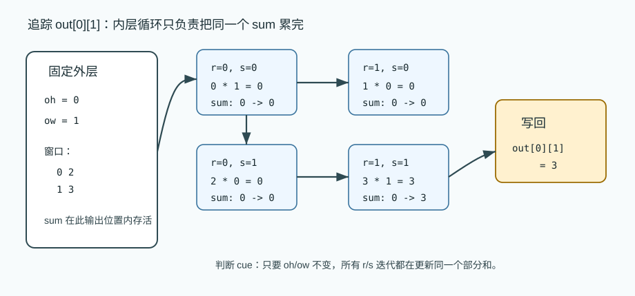
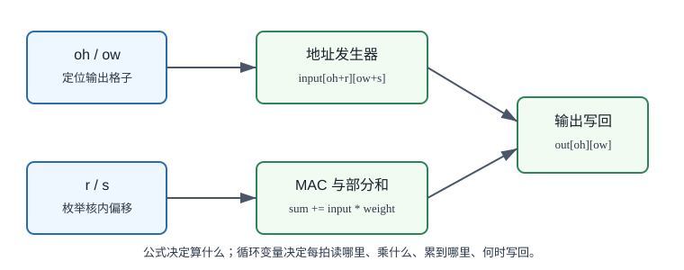
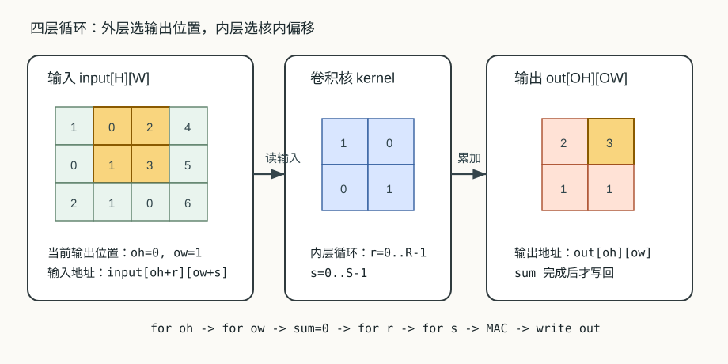

# 10 卷积如何变成多重循环

> 章节等级：A
> 状态：重组候选
> 来源映射：`chapter_source_map.csv` 中的 10 章；本章主要承接 SRC17，参考 SRC12。

## 本章知识全景图

### 1. 一眼看懂本章在讲什么

- 本章主题：把卷积公式展开成可调度的多重循环。
- 核心概念：OH/OW / OC/IC / R/S / loop nest / accumulator / reuse
- 逻辑主线：卷积公式只是压缩写法，硬件和编译器真正处理的是输出空间、通道和 kernel 维度上的循环嵌套。
- 最小学习路径：一个输出点 -> 输出空间循环 -> 通道归约循环 -> kernel 循环 -> 复用和调度。

### 2. 概念地图

| 概念层级 | 核心概念 | 前置知识 | 延伸到 NPU 的位置 |
| --- | --- | --- | --- |
| 输出循环 | oh、ow、oc | 输出 shape | 输出 tile |
| 归约循环 | ic、r、s | 多通道卷积 | psum 累加 |
| 循环顺序 | loop order | 嵌套循环 | dataflow 选择 |
| 调度目标 | 复用、并行、带宽 | buffer | 编译器 lowering |

### 3. 阅读顺序 / 处理顺序

- 先建立什么直觉：先把“卷积如何变成多重循环”落到一个可观察、可手算或可追踪的对象上。
- 再形式化什么定义或流程：围绕“卷积公式要展开成输出循环和归约循环”和“循环顺序决定数据复用和 partial sum 生命周期”整理概念边界、输入输出和约束。
- 最后通过什么例子、操作或推导固化：用“手算一个卷积输出并写成循环”进入复现链，再回到 NPU 的 MAC、buffer、DMA、PE、编译器或 runtime 判断。
## 1. 卷积公式要展开成输出循环和归约循环

硬件不能执行一行公式，它执行的是 `oh/ow/oc` 输出循环和 `ic/r/s` 归约循环。

本章需要你已经理解三件事：

- 单通道卷积：一个输入窗口和一个卷积核逐项相乘再累加。
- 输出大小：在无 padding、stride=1 时，`OH = H - R + 1`，`OW = W - S + 1`。
- MAC：`sum = sum + a*b`，也就是乘法后累加。

这里先从单通道、单卷积核、无 padding、stride=1 开始。多输入通道、多输出通道、batch 会在后续循环骨架中扩展，但本章的核心任务只有一个：把一个二维卷积变成“外层遍历输出位置，内层遍历卷积核位置”的循环。

不要急着把循环写成代码。零基础阶段更重要的是能回答每一层循环背后的问题：

| 循环变量 | 它在问什么 | 它决定读写什么 |
| --- | --- | --- |
| `oh` | 正在算输出的第几行 | 输出行、输入窗口起始行 |
| `ow` | 正在算输出的第几列 | 输出列、输入窗口起始列 |
| `r` | 卷积核内部第几行 | 窗口内部行偏移 |
| `s` | 卷积核内部第几列 | 窗口内部列偏移 |

只要这四个问题清楚，卷积公式就不再是一行压缩符号，而是一串可检查的读数、乘法、累加和写回。

想象你在仓库里用一张小清单检查货架。货架是一张大表，清单是一张小表。你要把清单放到货架左上角，按清单上的格子逐个核对；核对完以后，给这个位置记一个分数。然后清单向右挪一格，再核对一次；一行核对完，再回到下一行开头继续。

如果只对别人说“把清单在货架上滑动检查”，人可以理解，但机器仍然不知道先做哪一步。机器需要更细的说明：

```text
先选第 0 行输出
  再选第 0 列输出
    清单第 0 行第 0 列对应货架哪个格子？
    清单第 0 行第 1 列对应货架哪个格子？
    清单第 1 行第 0 列对应货架哪个格子？
    清单第 1 行第 1 列对应货架哪个格子？
  这个输出分数写回
  再选第 1 列输出
```

这就是多重循环的直觉：外层决定清单放在哪里，内层决定清单内部每个格子怎样逐项核对。卷积里的“核对”换成了“输入值乘以权重值，然后累加到部分和”。

## 2. 循环顺序决定数据复用和 partial sum 生命周期

同一个卷积换一种循环顺序，数学结果不变，但输入、权重和 psum 的停留位置会变。

卷积公式很短：

```text
out[oh][ow] = Σ input[oh+r][ow+s] * kernel[r][s]
```

这行公式把很多动作折叠在一起了。它没有显式告诉你：

- `oh` 从哪里开始，到哪里结束。
- `ow` 从哪里开始，到哪里结束。
- 每个输出值的 `sum` 什么时候清零。
- `r` 和 `s` 怎样枚举卷积核里的每个权重。
- 每次 MAC 读的是输入的哪个地址、权重的哪个地址。
- 最终结果什么时候写到 `out[oh][ow]`。

循环的作用，就是把这些被公式压缩掉的动作重新摊开。最自然的单通道卷积循环有四层：

```text
for oh in 0..OH-1:
  for ow in 0..OW-1:
    sum = 0
    for r in 0..R-1:
      for s in 0..S-1:
        sum += input[oh+r][ow+s] * kernel[r][s]
    out[oh][ow] = sum
```

这不是为了让你记住某种代码格式，而是为了看清依赖关系。`sum` 必须在每个输出位置开始时清零，因为每个输出值有自己的部分和。`r` 和 `s` 是归约循环，它们不产生新的输出格子，只负责把多个乘积累成一个输出。`oh` 和 `ow` 是输出循环，它们每走到一个新组合，就会写出一个新的结果。

可以把四层循环分成两类：

| 循环类型 | 包含变量 | 作用 |
| --- | --- | --- |
| 输出位置循环 | `oh`、`ow` | 决定要写哪个输出格子 |
| 累加循环 | `r`、`s` | 决定这个输出格子由哪些乘积累出来 |

理解这两类循环很关键。后面讲多通道时，会增加 `ic` 这样的累加循环；讲多输出通道时，会增加 `oc` 这样的输出循环；讲 batch 时，会增加 `n` 这样的独立样本循环。第 11 章的六重、七重循环，本质上就是把这两类循环继续扩展。



先定义本章最小场景：

- 输入特征图 `input` 形状为 `H x W`。
- 卷积核 `kernel` 形状为 `R x S`。
- 输出特征图 `out` 形状为 `OH x OW`。
- 本章默认 `stride=1`，`padding=0`。

输出尺寸为：

```text
OH = H - R + 1
OW = W - S + 1
```

对每个合法输出位置 `(oh, ow)`：

```text
out[oh][ow] =
  Σ_{r=0..R-1} Σ_{s=0..S-1}
    input[oh+r][ow+s] * kernel[r][s]
```

其中：

- `oh` 是输出高度方向索引，范围是 `0 <= oh < OH`。
- `ow` 是输出宽度方向索引，范围是 `0 <= ow < OW`。
- `r` 是卷积核高度方向索引，范围是 `0 <= r < R`。
- `s` 是卷积核宽度方向索引，范围是 `0 <= s < S`。
- 输入行索引是 `ih = oh + r`。
- 输入列索引是 `iw = ow + s`。

如果把 stride 和 padding 放回公式，输入坐标会变成：

```text
ih = oh * stride_h + r - pad_top
iw = ow * stride_w + s - pad_left
```

本章不展开 stride 和 padding 的所有边界情况，只要记住：它们不会改变“输出循环 + 累加循环”的骨架，只会改变每次循环访问的输入坐标是否跳格、是否落在补零区域。

从硬件角度看，四层循环还可以写成更接近执行动作的形式：

```text
for each output position (oh, ow):
  psum = 0
  for each kernel position (r, s):
    activation = input[oh+r][ow+s]
    weight = kernel[r][s]
    product = activation * weight
    psum = psum + product
  out[oh][ow] = psum
```

这里的 `psum` 是 partial sum，中文常说部分和。它是一个输出值尚未完成之前的中间累加结果。NPU 设计经常围绕部分和放在哪里、什么时候写回、能不能留在 PE 或 buffer 附近展开。

## 3. 手算一个卷积输出并写成循环

只追踪一个输出位置。输入是 3 行 3 列：

```text
input =
1 0 2
0 1 3
2 1 0
```

卷积核是 2 行 2 列：

```text
kernel =
1 0
0 1
```

我们只算输出位置 `(oh=0, ow=1)`。这个输出位置对应的窗口起点是输入第 0 行、第 1 列。窗口为：

```text
input[0][1] input[0][2]   =>   0 2
input[1][1] input[1][2]        1 3
```

现在展开 `r` 和 `s`：

| 步骤 | `r` | `s` | 读输入 | 读权重 | 乘积 | `sum` 变化 |
| --- | --- | --- | --- | --- | --- | --- |
| 初始化 | - | - | - | - | - | `sum = 0` |
| 1 | 0 | 0 | `input[0+0][1+0]=input[0][1]=0` | `kernel[0][0]=1` | `0*1=0` | `0+0=0` |
| 2 | 0 | 1 | `input[0+0][1+1]=input[0][2]=2` | `kernel[0][1]=0` | `2*0=0` | `0+0=0` |
| 3 | 1 | 0 | `input[0+1][1+0]=input[1][1]=1` | `kernel[1][0]=0` | `1*0=0` | `0+0=0` |
| 4 | 1 | 1 | `input[0+1][1+1]=input[1][2]=3` | `kernel[1][1]=1` | `3*1=3` | `0+3=3` |

所以：

```text
out[0][1] = 3
```

这个例题只有一个输出值，但它已经展示了硬件真正执行的顺序：每一次内层循环都产生一个 `activation * weight`，再把乘积累进同一个 `sum`。等 `r` 和 `s` 都走完，`sum` 才能写成输出。

继续使用同一组输入和卷积核：

```text
input =
1 0 2
0 1 3
2 1 0

kernel =
1 0
0 1
```

输出大小：

```text
OH = H - R + 1 = 3 - 2 + 1 = 2
OW = W - S + 1 = 3 - 2 + 1 = 2
```

因此外层循环会走四个输出位置：

```text
(oh, ow) = (0,0), (0,1), (1,0), (1,1)
```

### 位置 `(0,0)`

窗口：

```text
1 0
0 1
```

循环展开：

```text
sum = 0
r=0,s=0: sum += input[0][0]*kernel[0][0] = 1*1 = 1  -> sum=1
r=0,s=1: sum += input[0][1]*kernel[0][1] = 0*0 = 0  -> sum=1
r=1,s=0: sum += input[1][0]*kernel[1][0] = 0*0 = 0  -> sum=1
r=1,s=1: sum += input[1][1]*kernel[1][1] = 1*1 = 1  -> sum=2
out[0][0] = 2
```

### 位置 `(0,1)`

窗口：

```text
0 2
1 3
```

循环展开：

```text
sum = 0
r=0,s=0: 0*1 = 0 -> sum=0
r=0,s=1: 2*0 = 0 -> sum=0
r=1,s=0: 1*0 = 0 -> sum=0
r=1,s=1: 3*1 = 3 -> sum=3
out[0][1] = 3
```

### 位置 `(1,0)`

窗口：

```text
0 1
2 1
```

循环展开：

```text
sum = 0
r=0,s=0: 0*1 = 0 -> sum=0
r=0,s=1: 1*0 = 0 -> sum=0
r=1,s=0: 2*0 = 0 -> sum=0
r=1,s=1: 1*1 = 1 -> sum=1
out[1][0] = 1
```

### 位置 `(1,1)`

窗口：

```text
1 3
1 0
```

循环展开：

```text
sum = 0
r=0,s=0: 1*1 = 1 -> sum=1
r=0,s=1: 3*0 = 0 -> sum=1
r=1,s=0: 1*0 = 0 -> sum=1
r=1,s=1: 0*1 = 0 -> sum=1
out[1][1] = 1
```

最终输出：

```text
out =
2 3
1 1
```

现在把四个输出合起来看，四层循环一共做了：

```text
输出位置数量 = OH * OW = 2 * 2 = 4
每个输出的 MAC 次数 = R * S = 2 * 2 = 4
总 MAC 次数 = 4 * 4 = 16
```

这就是卷积计算量最基础的来源。输入变大、核变大、通道变多、输出通道变多，循环次数会一起放大。NPU 不是因为卷积公式复杂才需要专用硬件，而是因为这类简单 MAC 会以非常规则、非常巨大的次数重复。

再观察数据复用。输入中心点 `input[1][1]=1` 被四个输出窗口都用到：

```text
out[0][0] 的 r=1,s=1 用它
out[0][1] 的 r=1,s=0 用它
out[1][0] 的 r=0,s=1 用它
out[1][1] 的 r=0,s=0 用它
```

如果每次都从外部内存重新读这个值，就会重复搬运。循环展开不仅让我们知道有多少 MAC，也让我们看到哪些数据会被不同循环迭代反复使用。

## 4. 循环如何变成 tile、buffer 和 PE 任务

NPU 关心循环，是因为循环直接决定三件事：并行、复用和地址生成。

第一，循环告诉硬件哪些工作可以并行。不同 `(oh, ow)` 输出位置通常可以由不同 PE 同时计算，因为它们写的是不同输出格子。相同输出位置内部的 `r,s` 累加则有依赖，因为它们都要更新同一个 `sum`。硬件可以并行做若干乘法后再规约，也可以让一个 PE 顺序累加，但不能忘记这些乘积最终属于同一个输出。

第二，循环暴露数据复用。`kernel[r][s]` 会在所有输出位置重复使用；相邻窗口会复用输入行和输入列；`sum` 在完成前会被多次更新。buffer 的任务之一，就是让这些反复使用的数据尽量留在离 MAC 更近的位置。

第三，循环产生地址。每次内层 MAC 都要把 `(oh, ow, r, s)` 转成输入地址和权重地址：

```text
input address  <- input[oh+r][ow+s]
weight address <- kernel[r][s]
output address <- out[oh][ow]
```

NPU 里的地址发生器和控制器，本质上就是在硬件里高效地产生这些地址序列。后续章节会继续把这个想法扩展到多通道、多输出通道、layout、tile 和 dataflow。现在先记住一条主线：公式决定数学意义，循环决定执行顺序，执行顺序决定数据怎样被读、被复用、被累加、被写回。

还要注意，循环顺序不是唯一的。比如可以先遍历 `oh` 再遍历 `ow`，也可以先遍历 `ow` 再遍历 `oh`；可以让一个 PE 负责一个输出，也可以让多个 PE 分摊一个输出的内层乘积。只要最终每个 `out[oh][ow]` 收到同一组乘积并累加出同一结果，数学上就是等价的。但不同顺序对访存连续性、buffer 复用和 PE 利用率会产生不同影响，这正是编译器和 NPU 微架构需要共同处理的问题。



### 为什么学

卷积公式只说明“结果应该等于什么”，不能直接告诉硬件“下一拍读哪个数、哪个乘法先做、部分和何时清零、输出何时写回”。如果不把卷积拆成循环，后续的 tile、数据复用、dataflow、partial sum 和地址发生器都会变成孤立名词。学会这一步，读者才有能力从一个数学算子走到可执行的 NPU 控制序列。



### 工程判断

当卷积层很小、输出位置少、权重和输入都能轻松放进片上存储时，四重循环的直接实现就足够解释执行顺序；此时优化重点通常是减少控制开销和让地址连续。  
当输出图很大、窗口大量重叠、或者外部带宽跟不上 MAC 阵列时，不能只照着四重循环从外存逐点读数，而要继续做 tile、行 buffer、权重驻留或 dataflow 选择。失败信号很直接：MAC 阵列经常等待输入，外存读请求数量接近“每个窗口重新搬一次”，或者 profiling 显示算力利用率远低于峰值。排查顺序是先确认输出尺寸和循环边界，再看相邻窗口是否复用输入，最后检查 `sum` 是否在正确的输出生命周期内清零和写回。

## 5. 常见误区与判断线索

### 误区 1：卷积公式已经说明了一切

- 错误说法：会写 `out=sum input*kernel` 就等于懂卷积执行。
- 为什么错：公式压缩了输出位置、核位置、部分和清零、地址访问和写回时机。
- 正确理解：公式说明“算什么”，多重循环说明“按什么顺序算、读哪里、写哪里”。
- 工程后果：只看公式会漏掉地址生成、buffer 复用和写回边界，实现时常见问题是输出位置错位、部分和跨输出污染或 DMA 读取窗口不连续。
- 判断线索：如果不能从公式展开出 `oh, ow, r, s` 四个循环，并指出每个循环对应的输出坐标或窗口坐标，就说明执行链还没建立。

### 误区 2：内层循环和外层循环只是代码风格

- 错误说法：四个循环怎么排都只是程序员习惯。
- 为什么错：循环顺序会影响连续访问、数据复用、部分和停留位置和并行安排。
- 正确理解：循环顺序是算法到硬件映射的重要入口，不只是排版问题。
- 工程后果：循环顺序不合适会让连续输入变成跨步访问，让权重或输入无法驻留，最终表现为 PE 空等和外存请求碎片化。
- 判断线索：看到同一 MAC 总数下延迟差异很大，或者 DMA burst 被切成很多小段，就要回头看内层循环是否匹配 layout 和复用目标。

### 误区 3：每个窗口都要重新搬一整块输入

- 错误说法：窗口每移动一次，就必须从外部内存重新读完整窗口。
- 为什么错：相邻窗口大量重叠，很多输入值可以在片上 buffer 中复用。
- 正确理解：循环展开后要主动寻找重叠输入和重复权重，这些是硬件优化机会。
- 工程后果：按窗口完整重读会把外部输入流量推到上界，line buffer 和 SRAM 复用失效，算力峰值再高也会被带宽卡住。
- 判断线索：若输入读次数接近 `OH*OW*R*S`，而不是接近输入 tile 加 halo 的规模，说明窗口重叠没有被利用。

### 误区 4：`sum` 可以一直累加不用清零

- 错误说法：反正都是累加，所有输出位置可以共用同一个 `sum`。
- 为什么错：每个输出位置有自己的部分和。如果不在新输出位置开始时清零，会把上一个输出的结果混进来。
- 正确理解：`sum` 的生命周期属于一个输出位置；进入新的 `(oh, ow)` 时必须重新开始。
- 工程后果：清零时机错误会造成输出之间串扰，数值通常呈现沿扫描方向逐步偏大的模式，后续量化也可能出现异常饱和。
- 判断线索：如果第一个输出正确、后续输出越来越偏，或改变循环顺序后错误跟着扫描方向移动，优先查 `psum` 清零和写回时机。

### 误区 5：循环只属于软件，和硬件无关

- 错误说法：NPU 是硬件，不需要关心 for 循环。
- 为什么错：硬件控制器、地址发生器、buffer 调度和 PE 阵列都在执行循环所描述的重复模式。
- 正确理解：NPU 不一定真的运行 C 语言循环，但它必须实现同样的迭代空间和数据依赖。
- 工程后果：忽略循环会让控制器设计和编译器调度脱节，可能出现边界 tile 漏算、地址计数器越界或最后一块输出未写回。
- 判断线索：硬件 trace 中若能看到计数器、base address、stride、loop bound 和 done 信号，就说明硬件正在实现循环语义；调试时必须按这些量定位。

## 6. 最后速记

### 本章最该记住的结论

- 卷积公式和循环嵌套描述的是同一件事，循环更接近硬件执行。
- `oh/ow/oc` 生成输出位置，`ic/r/s` 决定每个输出值的累加来源。
- 循环顺序改变数据复用机会，是 dataflow 和编译器调度的入口。
- 调试卷积结果时，要能指出 accumulator 何时清零、何时累加、何时写回。

### 复现 / 复习清单

完成本章后应能做到：

- 把单通道卷积公式展开成可执行的多重循环，而不是只背 `sum input*kernel`。
- 说清 `oh`、`ow`、`r`、`s` 四个循环变量分别控制什么位置。
- 手工追踪一个输出值从 `sum=0` 到最终写回的每一次 MAC。
- 解释为什么 NPU 编译器、buffer 和 MAC 阵列都关心循环顺序。
- 看懂后续“六重循环、七重循环、tile、dataflow”为什么都从本章的循环骨架长出来。

本章解决的是一个非常具体的问题：上一章我们已经会手算一个卷积输出，但硬件不能执行“把窗口和核相乘再求和”这句话。硬件需要的是一张工序单：第几行输出、 第几列输出、核的第几行、核的第几列，每一步读哪个输入、读哪个权重、把乘积累到哪里。多重循环就是这张工序单。

### 自测题

### 题目

1. 单通道无 padding、stride=1 卷积中，`oh` 和 `ow` 分别表示什么？
2. `r` 和 `s` 为什么属于累加循环，而不是输出循环？
3. 输入大小 5x5、卷积核 3x3 时，`OH` 和 `OW` 分别是多少？
4. 上题一共会产生多少个输出位置？
5. 每个 3x3 输出位置需要多少次 MAC？
6. 为什么每个输出位置开始时要执行 `sum=0`？
7. 写出 `input[oh+r][ow+s]` 中 `oh+r` 和 `ow+s` 的含义。
8. 为什么相邻窗口会带来输入复用？
9. 循环顺序为什么会影响 NPU 访存效率？
10. 如果 `OH=4`、`OW=4`、`R=3`、`S=3`，单通道卷积总 MAC 次数是多少？

### 答案或评分点

1. `oh` 是输出行索引，`ow` 是输出列索引。
2. 它们枚举卷积核内部位置，只把多个乘积累成当前输出，不产生新的输出格子。
3. `OH=5-3+1=3`，`OW=3`。
4. `3*3=9` 个输出位置。
5. `3*3=9` 次 MAC。
6. 每个输出值有自己的部分和，不清零会混入上一个输出的结果。
7. `oh+r` 是输入窗口中的实际输入行，`ow+s` 是实际输入列。
8. 窗口移动一格后，很多输入格子仍然被新窗口覆盖。
9. 不同顺序会改变内存连续访问、buffer 命中和权重/输入/部分和复用方式。
10. `4*4*3*3 = 144` 次 MAC。

## 来源与核对

- 外部来源：ONNX Conv 官方算子文档 `https://onnx.ai/onnx/operators/onnx__Conv.html`，用于核对卷积输入、权重、stride/pad/dilation/group 等算子边界，避免把本章的简化场景误写成完整框架语义。
- 外部来源：CS231n 卷积网络讲义 `https://cs231n.github.io/convolutional-networks/`，用于核对局部感受野、滑动窗口、输出空间尺寸和卷积层直觉。
- 外部来源：Apache TVM TensorIR 文档 `https://tvm.apache.org/docs/deep_dive/tensor_ir/index.html`，用于支撑“张量程序可由循环迭代、block 和调度变换描述”的编译器视角。
- 本地来源：`C:\Users\11035\Desktop\ic\npu\14、NPU\《NPU硬件循环与数据流架构从入门到精通》\01.html`，标题 `15-NPU硬件循环与数据流架构从入门到精通 - 第一讲：NPU概述`，第 377-393 行给出 3x3 卷积硬件循环伪代码和 PE 并行执行语境。
- 本地来源：`C:\Users\11035\Desktop\ic\npu\14、NPU\《NPU硬件循环与数据流架构从入门到精通》\04.html`，标题 `4、硬件循环（Hardware Loop）概念 - NPU硬件循环与数据流架构`，第 216-253 行说明硬件循环、循环计数器和 NPU 中规整循环的重要性。
- 本地来源：`C:\Users\11035\Desktop\ic\npu\14、NPU\《NPU内存带宽与DMA优化从入门到精通》\01.html`，第 227-274 行说明内存墙、带宽瓶颈和 DMA 优化动机，用于解释为什么循环顺序会影响数据搬运。
