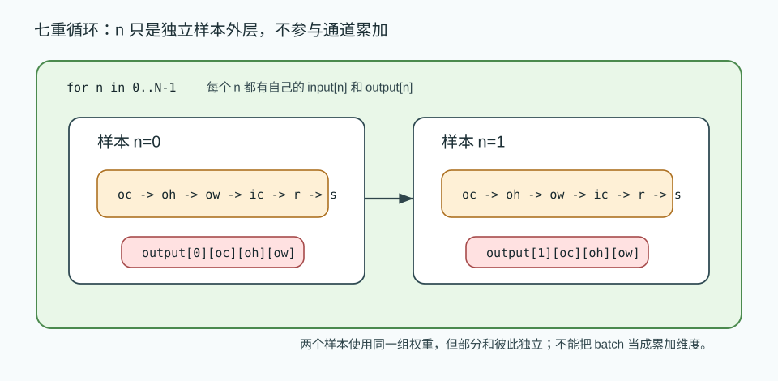
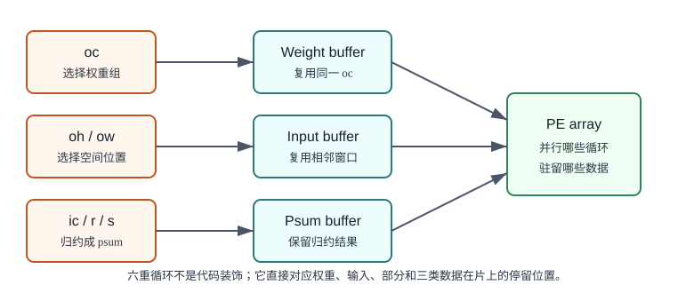
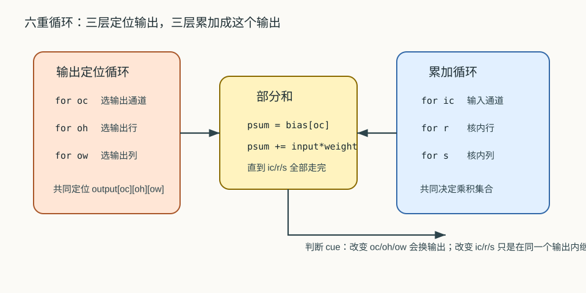

# 11 六重循环与七重循环

> 章节等级：A
> 状态：重组候选
> 来源映射：`chapter_source_map.csv` 中的 11 章；本章主要承接 SRC17，参考 SRC12。

## 本章知识全景图

### 1. 一眼看懂本章在讲什么

- 本章主题：把卷积循环扩展到 batch、输出通道、输入通道和 kernel 维度的完整嵌套。
- 核心概念：N/OC/OH/OW/IC/R/S / six loops / seven loops / reduction / loop order
- 逻辑主线：六重或七重循环不是为了吓人，而是把卷积所有自由维度和归约维度显式写出来，方便后续 tile、并行和 dataflow 判断。
- 最小学习路径：无 batch 六重循环 -> 加 batch 七重循环 -> loop order -> tile/blocking -> 硬件映射。

### 2. 概念地图

| 概念层级 | 核心概念 | 前置知识 | 延伸到 NPU 的位置 |
| --- | --- | --- | --- |
| 输出维度 | N、OC、OH、OW | shape | 输出 tile 和任务拆分 |
| 归约维度 | IC、R、S | 多通道卷积 | psum 累加路径 |
| 循环变换 | reorder、tile、unroll | 循环嵌套 | 编译器调度 |
| 硬件映射 | 并行维、复用维、写回维 | PE/buffer | dataflow 选择 |

### 3. 阅读顺序 / 处理顺序

- 先建立什么直觉：先把“六重循环与七重循环”落到一个可观察、可手算或可追踪的对象上。
- 再形式化什么定义或流程：围绕“六重和七重循环只是把卷积维度写全”和“loop order 是 dataflow 的软件影子”整理概念边界、输入输出和约束。
- 最后通过什么例子、操作或推导固化：用“从六重循环手算到 batch 七重循环”进入复现链，再回到 NPU 的 MAC、buffer、DMA、PE、编译器或 runtime 判断。
## 1. 六重和七重循环只是把卷积维度写全

看懂六重/七重循环的关键，是区分哪些循环在生成输出，哪些循环在为同一个输出做归约。

本章需要你已经知道：

- `oh`、`ow` 选择输出空间位置。
- `r`、`s` 枚举卷积核内部位置。
- 输入通道表示同一空间位置上的多层输入特征。
- 输出通道表示一组不同卷积核产生的不同特征图。
- MAC 的基本形式是 `psum = psum + input * weight`。

这里暂不深入 tile、dataflow 和 PE 阵列的具体设计。它们后面会专门讲。本章先把“循环到底有哪些层”讲清楚。只要能看懂六重循环，后面的硬件映射就有了坐标系。

继续用仓库检查的例子。第 10 章像是你拿一张清单检查一层货架：清单放到某个位置，逐格核对，得到一个分数。

现在仓库变复杂了：

- 货架不止一层，有食品层、工具层、药品层，对应输入通道 `ic`。
- 清单也不止一张，有安全检查清单、库存检查清单、损坏检查清单，对应输出通道 `oc`。
- 有时一天要检查多家仓库，对应 batch 维度 `n`。

一张检查清单要同时看所有输入层，才能给出一个输出分数。不同清单得到不同分数，形成不同输出通道。如果要检查多家仓库，就把同样的流程对第 0 家、第 1 家、第 2 家重复一遍。

这就是六重和七重循环的生活化直觉：

```text
第几家仓库？        -> n
用哪张检查清单？    -> oc
检查哪个货架位置？  -> oh, ow
看哪一层货架？      -> ic
看清单内部哪一格？  -> r, s
```

## 2. loop order 是 dataflow 的软件影子

循环顺序一变，谁留在片上、谁被广播、谁被反复读取也会变。

多通道卷积的一个输出值，不再只来自一个二维窗口，而是来自所有输入通道上的一组窗口。假设输入通道数是 `IC`，卷积核大小是 `R x S`，那么一个输出值要累加：

```text
IC * R * S
```

个乘积。

如果这一层还有 `OC` 个输出通道，就说明有 `OC` 组不同权重。每组权重都会生成一张输出特征图。因此六重循环可以分成两类：

| 循环变量 | 类型 | 作用 |
| --- | --- | --- |
| `oc` | 输出循环 | 选择第几个输出通道，也就是第几组卷积核 |
| `oh` | 输出循环 | 选择输出高度位置 |
| `ow` | 输出循环 | 选择输出宽度位置 |
| `ic` | 累加循环 | 选择第几个输入通道 |
| `r` | 累加循环 | 选择卷积核高度偏移 |
| `s` | 累加循环 | 选择卷积核宽度偏移 |

`oc/oh/ow` 决定“写哪个输出元素”。`ic/r/s` 决定“这个输出元素由哪些乘积累出来”。只要这个分类清楚，六重循环就不会显得乱。

固定一个 batch 样本时，常见六重循环可以写成：

```text
for oc in 0..OC-1:
  for oh in 0..OH-1:
    for ow in 0..OW-1:
      psum = bias[oc]
      for ic in 0..IC-1:
        for r in 0..R-1:
          for s in 0..S-1:
            psum += input[ic][oh+r][ow+s] * weight[oc][ic][r][s]
      output[oc][oh][ow] = psum
```

如果把 batch 也放进来，就在外层再加 `n`：

```text
for n in 0..N-1:
  for oc in 0..OC-1:
    for oh in 0..OH-1:
      for ow in 0..OW-1:
        ...
```

这就是七重循环。`n` 通常表示第几个样本。不同 batch 样本之间的输出不应该互相累加；每个 `n` 都有自己独立的输入和输出。



采用常见的逻辑下标：

- 输入：`input[n][ic][ih][iw]`
- 权重：`weight[oc][ic][r][s]`
- 输出：`output[n][oc][oh][ow]`
- 偏置：`bias[oc]`

在 stride=1、padding=0 时：

```text
ih = oh + r
iw = ow + s
```

完整的多通道、多输出通道卷积定义为：

```text
output[n][oc][oh][ow] =
  bias[oc] +
  Σ_{ic=0..IC-1} Σ_{r=0..R-1} Σ_{s=0..S-1}
    input[n][ic][oh+r][ow+s] * weight[oc][ic][r][s]
```

这个公式里的求和轴是 `ic/r/s`。它们共同生成一个部分和。`n/oc/oh/ow` 则定位输出元素。对应的七重循环是：

```text
for n in 0..N-1:
  for oc in 0..OC-1:
    for oh in 0..OH-1:
      for ow in 0..OW-1:
        psum = bias[oc]
        for ic in 0..IC-1:
          for r in 0..R-1:
            for s in 0..S-1:
              psum += input[n][ic][oh+r][ow+s] * weight[oc][ic][r][s]
        output[n][oc][oh][ow] = psum
```

当 `N=1` 或者我们只讨论一个样本时，外层 `n` 可以省略，于是得到六重循环：

```text
oc -> oh -> ow -> ic -> r -> s
```

这并不表示 batch 不重要，只是本章在固定一个样本时先看核心卷积。

有两个边界条件必须记住：

1. `psum` 的生命周期属于一个确定的 `(n, oc, oh, ow)`。只要这四个下标有任何一个变了，就要重新开始一个新的输出元素。
2. `ic/r/s` 的循环次序可以在某些情况下调整，但它们累加的是同一个输出。调整次序不能改变最终被累加的乘积集合。

## 3. 从六重循环手算到 batch 七重循环

先用最小的 1x1 卷积理解 `ic` 循环。固定一个样本 `n=0`，只有一个输出通道 `oc=0`，空间上只有一个输出位置：

```text
input[ic=0] = 3
input[ic=1] = 4

weight[oc=0][ic=0] = 2
weight[oc=0][ic=1] = 5

bias[0] = 0
```

因为是 1x1 卷积，所以 `r=0`、`s=0` 只有一次。循环展开如下：

| 步骤 | `oc` | `oh` | `ow` | `ic` | `r` | `s` | 乘积 | `psum` |
| --- | --- | --- | --- | --- | --- | --- | --- | --- |
| 初始化 | 0 | 0 | 0 | - | - | - | - | `0` |
| 1 | 0 | 0 | 0 | 0 | 0 | 0 | `3*2=6` | `6` |
| 2 | 0 | 0 | 0 | 1 | 0 | 0 | `4*5=20` | `26` |

所以：

```text
output[0][0][0] = 26
```

这个例子很小，但它说明了多通道卷积最核心的变化：同一个输出位置要跨输入通道继续累加。`ic` 不是产生新输出，而是把更多通道的贡献加进同一个 `psum`。

现在做一个完整但仍可手算的例子。固定 `N=1`，输入有 2 个通道，每个通道 2x2；输出有 2 个通道；卷积核大小是 2x2；无 padding、stride=1。于是输出空间大小是 1x1。

输入：

```text
IC0:
1 2
3 4

IC1:
5 6
7 8
```

输出通道 0 的权重：

```text
weight[OC0][IC0]:
1 0
0 1

weight[OC0][IC1]:
0 1
1 0
```

输出通道 1 的权重：

```text
weight[OC1][IC0]:
1 1
1 1

weight[OC1][IC1]:
1 -1
0  1
```

偏置都设为 0。由于 `OH=1`、`OW=1`，只有 `(oh=0, ow=0)` 一个空间位置，但有两个输出通道。

### 计算输出通道 0

先算 `oc=0, oh=0, ow=0`。初始化：

```text
psum = bias[0] = 0
```

输入通道 0 的 2x2 累加：

```text
ic=0,r=0,s=0: 1*1 = 1 -> psum=1
ic=0,r=0,s=1: 2*0 = 0 -> psum=1
ic=0,r=1,s=0: 3*0 = 0 -> psum=1
ic=0,r=1,s=1: 4*1 = 4 -> psum=5
```

输入通道 1 的 2x2 累加：

```text
ic=1,r=0,s=0: 5*0 = 0 -> psum=5
ic=1,r=0,s=1: 6*1 = 6 -> psum=11
ic=1,r=1,s=0: 7*1 = 7 -> psum=18
ic=1,r=1,s=1: 8*0 = 0 -> psum=18
```

所以：

```text
output[0][0][0] = 18
```

### 计算输出通道 1

接着算 `oc=1, oh=0, ow=0`。注意这是新的输出通道，要重新初始化 `psum`：

```text
psum = bias[1] = 0
```

输入通道 0：

```text
ic=0,r=0,s=0: 1*1 = 1 -> psum=1
ic=0,r=0,s=1: 2*1 = 2 -> psum=3
ic=0,r=1,s=0: 3*1 = 3 -> psum=6
ic=0,r=1,s=1: 4*1 = 4 -> psum=10
```

输入通道 1：

```text
ic=1,r=0,s=0: 5*1  = 5  -> psum=15
ic=1,r=0,s=1: 6*(-1) = -6 -> psum=9
ic=1,r=1,s=0: 7*0  = 0  -> psum=9
ic=1,r=1,s=1: 8*1  = 8  -> psum=17
```

所以：

```text
output[1][0][0] = 17
```

最终输出有 2 个通道：

```text
OC0:
18

OC1:
17
```

这个例子一共做了：

```text
OC * OH * OW * IC * R * S
= 2 * 1 * 1 * 2 * 2 * 2
= 16 次 MAC
```

再把 batch 加进去，假设 `N=2`，就会对第 0 张输入和第 1 张输入分别执行同样的六重循环。第 0 张输入得到上面的 `18` 和 `17`；第 1 张输入会使用自己的 `input[1][ic][h][w]`，但共享同一组权重 `weight[oc][ic][r][s]`。这时总 MAC 次数变成：

```text
N * OC * OH * OW * IC * R * S
= 2 * 2 * 1 * 1 * 2 * 2 * 2
= 32 次 MAC
```

batch 维度增加的是独立样本数量，不是把两个样本的部分和加在一起。每个 `(n, oc, oh, ow)` 都有自己的输出和自己的 `psum`。

## 4. 把循环维度分配给 tile、PE 阵列和 buffer

六重和七重循环是 NPU 映射的基础坐标系。它们告诉编译器和硬件控制逻辑：哪些下标可以并行，哪些下标必须累加，哪些数据值得留在片上。

`oc` 循环选择输出通道，也就是选择一组权重。若硬件有足够资源，不同输出通道可以并行计算；若资源有限，也可以分批计算。`oh/ow` 循环选择空间位置，相邻位置会共享输入窗口，因此适合通过行 buffer 或片上 SRAM 复用输入。`ic/r/s` 循环负责归约，同一个输出的部分和要在这些循环结束后才完成。

从数据复用角度看：

- 权重 `weight[oc][ic][r][s]` 会在多个 `oh/ow` 位置重复使用。
- 输入 `input[n][ic][ih][iw]` 会被相邻窗口、不同输出通道或不同执行时刻复用。
- 部分和 `psum` 会在 `ic/r/s` 内层循环中反复更新，适合尽量留在 PE 本地寄存器或近端 buffer。

循环顺序不同，复用机会的表现也不同。例如先固定 `oc` 再扫完整张输出图，有利于复用这一组输出通道权重；先固定空间位置再遍历多个 `oc`，可能更容易复用同一输入窗口。哪种更好取决于硬件阵列、buffer 容量、权重大小、输入大小和 layout。后面的 tile、数据复用和 dataflow 章节会继续展开这些取舍。

这里先保留一个判断 cue：看到任何 NPU 卷积优化，都先问它改变的是哪几层循环的顺序、并行方式或数据停留位置。如果说不清它作用在 `n/oc/oh/ow/ic/r/s` 的哪一层，就很容易把优化名词背成空话。



### 为什么学

NPU 上的卷积优化很少直接谈“一个窗口乘一个核”，而是谈输出通道并行、输入通道归约、空间 tile、batch 切分和部分和写回。没有六重/七重循环坐标，读者无法判断一个优化是在复用权重、复用输入、保留部分和，还是只是在改代码顺序。学会本章，就是给后面的 tile、reuse、dataflow 和 loop-to-hardware 建立统一坐标系。



### 工程判断

如果硬件权重 buffer 足够大、输出通道数也多，优先让 `oc` 或一组 `oc` 驻留权重通常更容易提高权重复用；如果输入窗口复用更关键，则要关注 `oh/ow` 的扫描顺序和行 buffer 是否能覆盖相邻窗口。`ic/r/s` 是归约维度，工程上最怕部分和生命周期被切断：如果归约还没完成就过早写回外存，会把带宽压力放大；如果多个 PE 分摊归约却没有正确归并，也会得到错误输出。失败信号包括部分和反复写回、权重重复搬运、batch 间输出混合、或 profiling 中同一层 MAC 数正确但带宽异常偏高。排查时先定位优化作用的循环层，再确认输出循环和归约循环没有混淆。

## 5. 常见误区与判断线索

### 误区 1：六重循环只是把简单事情写复杂

- 错误说法：卷积就是滑窗乘加，没必要分六层。
- 为什么错：真实卷积同时有输出通道、空间位置、输入通道和核内位置；不分层就看不清谁产生输出、谁负责累加。
- 正确理解：六重循环是卷积执行空间的坐标系，不是多余形式。
- 工程后果：不分清六层循环会把输出维和归约维混在一起，硬件映射时容易把多个输出写到同一部分和，或把归约贡献当成独立输出。
- 判断线索：拿到一层卷积时，如果不能标出 `oc, oh, ow` 生成输出，`ic, r, s` 负责累加，就不要直接做 PE 映射。

### 误区 2：输入通道循环会产生多个输出通道

- 错误说法：`ic` 每换一次就得到一个新输出通道。
- 为什么错：`ic` 是累加维度，它把不同输入通道的贡献加到同一个输出里。
- 正确理解：输出通道由 `oc` 决定，输入通道由 `ic` 累加。
- 工程后果：把 `ic` 当输出通道会把标准卷积误写成通道拆分输出，导致输出 shape 变厚、数值不等价，后续层权重也对不上。
- 判断线索：如果 `ic` 循环结束前就写最终 output，或每个 `ic` 产生一个独立输出通道，说明归约维度被错误外露。

### 误区 3：batch 维度要和通道一起累加

- 错误说法：`N=2` 时，两个样本的结果要加成一个输出。
- 为什么错：batch 表示独立样本，样本之间不应该互相污染输出。
- 正确理解：`n` 是外层独立循环；每个样本有自己的输出张量。
- 工程后果：batch 混加会让不同输入样本互相污染，表现为 batch=1 正常、batch>1 输出异常，且错误随样本顺序改变。
- 判断线索：如果输出下标缺少 `n`，或 `psum` 没有按 batch 独立清零和写回，就要检查 batch 维是否被误当成归约维。

### 误区 4：所有循环都可以随便交换

- 错误说法：只要最终次数一样，循环顺序随便换。
- 为什么错：有些循环改变部分和生命周期和写回时机；错误交换可能导致输出混合或重复写错。
- 正确理解：能交换的前提是保持同一个输出的乘积集合和累加归属不变。
- 工程后果：非法交换循环会破坏依赖，常见后果是部分和重复累加、提前写回或边界 tile 覆盖不完整。
- 判断线索：交换循环前先问两个问题：被交换的维度是否都只是枚举独立输出，是否会改变 `psum` 的归属和清零位置；任一答案不清楚就不能直接交换。

### 误区 5：只要 MAC 次数一样，性能就一样

- 错误说法：两种循环顺序算同样多 MAC，所以速度一样。
- 为什么错：访存连续性、buffer 复用、权重驻留、部分和写回都会受循环顺序影响。
- 正确理解：MAC 次数是计算量下界，真实性能还取决于数据怎样流动。
- 工程后果：只看 MAC 会选错 loop order，导致权重反复加载、输入不能成块读取，或部分和频繁外存往返。
- 判断线索：当 MAC 数相同但带宽、DMA wait、buffer hit rate 或 PE utilization 不同，差异通常来自循环顺序和 dataflow，而不是数学公式。

## 6. 最后速记

### 本章最该记住的结论

- 七重循环对应 `N/OC/OH/OW/IC/R/S`，其中 `IC/R/S` 是归约维度。
- 输出循环可以并行，但归约循环必须正确累加到同一个 partial sum。
- loop order 不改变数学结果，却会改变复用、带宽和片上存储压力。
- 后续 tile、dataflow、编译器 lowering 都是在这些循环维度上做选择。

### 复现 / 复习清单

完成本章后应能做到：

- 说清为什么真实卷积常从第 10 章的四重循环扩展成六重循环或七重循环。
- 区分 `oc/oh/ow` 这类“产生输出位置”的循环，以及 `ic/r/s` 这类“累加成一个输出”的循环。
- 手算一个 2 输入通道、2 输出通道、2x2 卷积核的小卷积，逐步列出每个输出通道的部分和。
- 解释 batch 维度为什么会把六重循环变成七重循环，但不会改变单个样本内的卷积本质。
- 建立后续学习 tile、data reuse、dataflow 时需要的循环坐标感。

第 10 章只讨论了单通道、单卷积核。真实神经网络更常见的是：输入有多个通道，输出也有多个通道；同一层可能一次处理一批图片。于是循环不再只有 `oh/ow/r/s`，还要加上输入通道、输出通道和 batch。六重循环与七重循环不是为了把代码写复杂，而是为了把卷积中“每个输出由哪些数字累出来”说完整。

### 自测题

### 题目

1. 六重循环中常见的六个变量是什么？
2. 哪些变量通常定位输出元素？
3. 哪些变量通常属于累加维度？
4. 为什么 `oc` 不是累加维度？
5. `IC=3`、`R=3`、`S=3` 时，一个输出元素需要多少次 MAC？
6. `OC=8`、`OH=4`、`OW=4`、`IC=3`、`R=3`、`S=3` 时，一个样本总 MAC 次数是多少？
7. batch 维度 `n` 加入后，为什么叫七重循环？
8. 为什么每个 `(n, oc, oh, ow)` 都要有自己的 `psum`？
9. 先固定 `oc` 扫空间位置，可能复用什么数据？
10. 看到一个卷积优化时，为什么要先问它作用在哪几层循环上？

### 答案或评分点

1. `oc, oh, ow, ic, r, s`。
2. `oc, oh, ow`，若包含 batch，则 `n` 也定位独立输出样本。
3. `ic, r, s`。
4. `oc` 选择不同输出通道和不同权重组，会产生不同输出，不是加进同一个输出。
5. `3*3*3=27` 次 MAC。
6. `8*4*4*3*3*3 = 3456` 次 MAC。
7. 因为在六重卷积循环外又加了样本循环 `n`。
8. 这四个下标共同定位一个唯一输出元素，不能和别的输出混用部分和。
9. 可能复用当前输出通道对应的权重组。
10. 因为优化本质上会改变循环顺序、并行方式、数据驻留或访存模式；不定位循环层就无法判断它解决什么问题。

## 来源与核对

- 外部来源：ONNX Conv 官方算子文档 `https://onnx.ai/onnx/operators/onnx__Conv.html`，用于核对卷积输入、权重、输出通道、group 和 batch 维度语义。
- 外部来源：MLIR Linalg dialect 文档 `https://mlir.llvm.org/docs/Dialects/Linalg/`，其中列出 `linalg.conv_2d_nchw_fchw`、`linalg.conv_2d_nhwc_hwcf` 等具名卷积 op，用于说明卷积在编译器 IR 中会显式携带 layout 与循环结构。
- 外部来源：Apache TVM TensorIR 文档 `https://tvm.apache.org/docs/deep_dive/tensor_ir/index.html`，用于支撑循环迭代、block、调度和局部性优化的编译器表达。
- 本地来源：`C:\Users\11035\Desktop\ic\npu\14、NPU\《NPU硬件循环与数据流架构从入门到精通》\01.html`，第 377-393 行的 3x3 卷积硬件循环伪代码用于连接四重循环到更多维度扩展。
- 本地来源：`C:\Users\11035\Desktop\ic\npu\14、NPU\《NPU硬件循环与数据流架构从入门到精通》\03.html`，第 269-336 行讨论数据复用、weight-stationary/output-stationary 和脉动阵列伪代码，用于解释六重循环的复用选择。
- 本地来源：`C:\Users\11035\Desktop\ic\npu\14、NPU\《NPU内存带宽与DMA优化从入门到精通》\02.html`，第 287-417 行说明片上存储、DMA 和双缓冲，用于解释循环顺序和 buffer/DMA 的关系。
