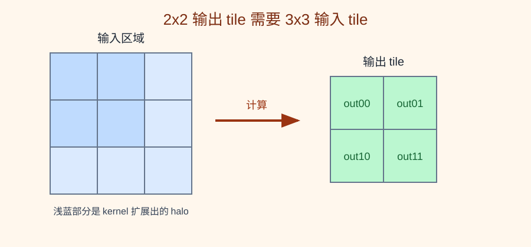
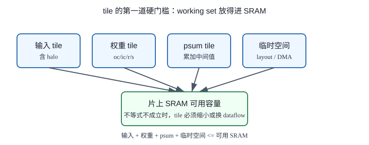
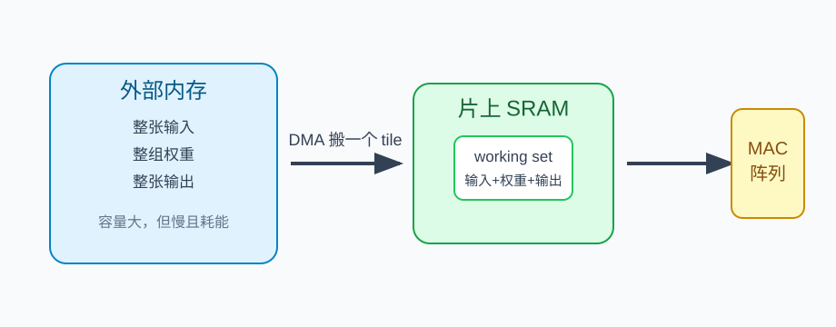

# 14 tile 为什么出现

> 章节等级：A
> 状态：重组候选
> 来源映射：`chapter_source_map.csv` 中的 14 章；本章主要承接 SRC17、SRC12，参考 SRC01。

## 本章知识全景图

### 1. 一眼看懂本章在讲什么

- 本章主题：解释 tile 为什么出现，以及它如何把大计算切成片上能承受的小任务。
- 核心概念：tile / working set / SRAM capacity / halo / blocking / task granularity
- 逻辑主线：tile 不是为了把图切好看，而是因为完整输入、权重、输出和部分和经常放不进片上存储。
- 最小学习路径：整层工作集 -> 片上容量限制 -> 空间/通道/输出通道切块 -> halo 与复用。

### 2. 概念地图

| 概念层级 | 核心概念 | 前置知识 | 延伸到 NPU 的位置 |
| --- | --- | --- | --- |
| 容量约束 | working set | SRAM/buffer | 片上是否放得下 |
| 切分对象 | 空间 tile、通道 tile、OC tile | 卷积维度 | 任务拆分 |
| 边界代价 | halo、重复搬运 | 窗口重叠 | DMA 额外流量 |
| 调度粒度 | tile size | 循环 | PE 利用率和启动开销 |

### 3. 阅读顺序 / 处理顺序

- 先建立什么直觉：先把“tile为什么出现”落到一个可观察、可手算或可追踪的对象上。
- 再形式化什么定义或流程：围绕“tile 的根因是片上容量和带宽有限”和“tile 大小同时影响复用、重复搬运和任务开销”整理概念边界、输入输出和约束。
- 最后通过什么例子、操作或推导固化：用“用工作集估算一个 tile 能否放下”进入复现链，再回到 NPU 的 MAC、buffer、DMA、PE、编译器或 runtime 判断。
## 1. tile 的根因是片上容量和带宽有限

大张量不能直接整层塞进 NPU，tile 把计算切成片上能装、能搬、能复用的小块。

你需要理解卷积窗口、输出大小、输入复用和 MAC。前面我们已经看到，一张小图可以手算完，但真实网络里的输入特征图、权重和输出特征图可能非常大。NPU 的片上 SRAM 很快，但容量有限；外部内存容量大，但访问慢、耗能高。tile 就是在这两个事实之间长出来的工程方法。

本章不把 tile 当成抽象名词背。我们从一个问题开始：如果整张输入、整组权重和整张输出都放不进片上 buffer，NPU 该怎么继续算？

想象你在厨房做很多份饭。冰箱很大，灶台很小。你不能把所有食材都堆到灶台上，只能每次拿一小批：先拿两盘菜要用的食材，炒完端走，再拿下一批。如果每次拿得太少，你会频繁来回冰箱；如果拿得太多，灶台放不下。

NPU 也类似。外部内存像大冰箱，片上 SRAM 像灶台，MAC 阵列像炉火。tile 就是一次搬到灶台上的那一小块数据。tile 太大，放不下；tile 太小，搬运太频繁，炉火等食材。

## 2. tile 大小同时影响复用、重复搬运和任务开销

tile 太小会重复搬边界，tile 太大又放不进 SRAM，合理大小夹在两种代价之间。

tile 出现的第一原因是容量。假设一层卷积的输入有几十万数字，权重有几万数字，输出也有几十万数字。片上 SRAM 不可能同时装下全部数据。那就只能把大任务拆成很多小任务，每次只处理一块输出，对应搬入它需要的输入和权重。

tile 出现的第二原因是带宽。即使外部内存放得下所有数据，也不能每算一个输出就从外部内存重新读完整窗口。tile 的目标是：把一块数据搬进片上以后，在它被赶出 buffer 前尽量多用几次。

tile 出现的第三原因是阵列利用率。MAC 阵列希望持续工作。如果 tile 形状和阵列大小不匹配，可能出现一半 PE 没活干；如果 tile 切得太碎，DMA 和控制开销会淹没计算本身。因此 tile 是一个平衡：既要放得下，又要复用多，还要让阵列忙起来。

卷积里的 tile 不能只看输出块。一个输出 tile 需要的输入区域通常比输出 tile 更大，因为卷积核要覆盖周围窗口。例如 2x2 输出 tile 配 2x2 kernel，需要 3x3 输入区域。这个多出来的边界区域，就是理解 halo 的起点。



- **tile**：把一个大张量或大计算拆成能被片上资源容纳和高效处理的小块。
- **输出 tile**：一次计划生成的一小块输出，例如输出特征图中的 2 行 4 列。
- **输入 tile**：为了计算某个输出 tile，必须读入的输入区域。它通常比输出 tile 大，因为卷积窗口要向周围扩展。
- **权重 tile**：一次放入片上 buffer 或阵列附近的一部分权重，例如若干输出通道、若干输入通道、一个 kernel 块。
- **halo / overlap**：相邻 tile 为了计算边界输出而共同需要的重叠输入区域。
- **tile size**：tile 的大小选择，可以按空间维度、通道维度、batch 维度或输出通道维度切分。
- **working set**：一个 tile 计算期间必须同时可用的数据集合，包括输入 tile、权重 tile、部分和或输出 tile。

tile 的基本约束可以写成：

```text
输入 tile 占用 + 权重 tile 占用 + 输出或部分和占用 + 临时空间 <= 片上可用 SRAM
```

如果这个不等式不成立，tile 就必须变小，或者换另一种数据流和调度方式。



## 3. 用工作集估算一个 tile 能否放下

先看一个一维例子。输入长度为 6，卷积核长度为 3，stride=1，无 padding：

```text
input = [1, 2, 3, 4, 5, 6]
kernel = [1, 0, 1]
```

输出长度：

```text
6 - 3 + 1 = 4
```

如果一次算前 2 个输出，也就是输出 tile `[out0, out1]`，需要哪些输入？

```text
out0 需要 input[0], input[1], input[2]
out1 需要 input[1], input[2], input[3]
```

所以这个输出 tile 需要输入区间：

```text
input[0..3] = [1,2,3,4]
```

输出 tile 长度是 2，但输入 tile 长度是 4。多出来的部分来自卷积核宽度。相邻输出 tile `[out2, out3]` 需要 `input[2..5]`，和前一个 tile 在 `input[2], input[3]` 上重叠。这就是 tile 边界复用和 halo 的最小直觉。

输入是 4 行 4 列：

```text
1  2  3  4
5  6  7  8
9 10 11 12
13 14 15 16
```

卷积核是 2 行 2 列：

```text
1 0
0 1
```

stride=1、无 padding，输出是 3 行 3 列。假设片上 buffer 一次只计划算左上角 2x2 输出 tile：

```text
out[0][0] out[0][1]
out[1][0] out[1][1]
```

为了算这 4 个输出，输入窗口分别是：

```text
out[0][0] 用输入行 0..1，列 0..1
out[0][1] 用输入行 0..1，列 1..2
out[1][0] 用输入行 1..2，列 0..1
out[1][1] 用输入行 1..2，列 1..2
```

合起来需要的输入 tile 是行 0..2、列 0..2，也就是 3x3：

```text
1  2  3
5  6  7
9 10 11
```

逐个输出手算：

```text
out[0][0] = 1*1 + 2*0 + 5*0 + 6*1 = 7
out[0][1] = 2*1 + 3*0 + 6*0 + 7*1 = 9
out[1][0] = 5*1 + 6*0 + 9*0 + 10*1 = 15
out[1][1] = 6*1 + 7*0 + 10*0 + 11*1 = 17
```

所以这个输出 tile 是：

```text
7  9
15 17
```

现在看容量。若每个数字暂按 1 个单位存储，这个 tile 期间至少需要：

```text
输入 tile: 3*3 = 9
权重: 2*2 = 4
输出 tile: 2*2 = 4
合计: 17 个单位
```

如果片上可用空间只有 12 个单位，这个 2x2 输出 tile 就放不下完整 working set。可以改成一次只算 1x2 输出 tile。比如 `out[0][0]` 和 `out[0][1]` 需要输入行 0..1、列 0..2，即 2x3=6，加上权重 4、输出 2，总共 12，刚好放下。

这个例子说明 tile size 不是随意选择的。它由输出块、卷积核扩展、权重、部分和和临时空间共同决定。

如果继续算右上角 2x2 输出 tile：

```text
out[0][1] out[0][2]
out[1][1] out[1][2]
```

它需要输入行 0..2、列 1..3：

```text
2  3  4
6  7  8
10 11 12
```

它和左上 tile 的输入区域在列 1..2 上重叠。聪明的调度会尽量复用这部分已经在片上的数据，而不是把它从外部内存再搬一遍。

## 4. tile 如何进入编译器调度和 DMA 计划

tile 是 NPU 编译器和硬件之间最重要的桥之一。编译器看到一层卷积，会根据 shape、layout、kernel、通道数和硬件 SRAM 容量选择 tile size。DMA 按 tile 搬数据，buffer 保存 tile，MAC 阵列在 tile 内完成一批 MAC。

tile 选择直接影响三件事：

1. **外部带宽**：tile 太小，相同 halo 被重复搬运太多；tile 合理，输入和权重能在片上多次使用。
2. **阵列利用率**：tile 太窄或通道太少，PE 阵列可能填不满；tile 太大，又可能放不下。
3. **控制复杂度**：tile 越多，循环边界、地址生成、DMA 描述符和边缘处理越复杂。

很多 NPU 会使用 double buffering：一个 buffer 给 MAC 阵列当前计算，另一个 buffer 由 DMA 预取下一个 tile。理想情况下，计算当前 tile 的时间足够长，可以把下一块数据搬好；等计算切换时，MAC 阵列不用停下来等外部内存。

tile 还会影响 dataflow。若选择 output tile 固定在本地，就更像 output-stationary；若选择 weight tile 长时间留在阵列附近，就更像 weight-stationary；若按输入 tile 流过多个计算单元，就会强调 input reuse。后面讲数据复用和 dataflow 时，tile 会成为落地单位。

### 为什么学

没有 tile，NPU 只能面对“整层数据太大、外存太慢、片上太小”的矛盾。tile 是把大算子变成可搬、可存、可并行执行的小任务的第一步。后面讲 DMA、双缓冲、dataflow 和编译器调度时，实际都在回答同一个问题：这一小块 tile 怎么搬进来、怎么算完、怎么不让 PE 等数据。



### 工程判断

选择 tile 时，先看容量不等式是否成立，再看输入、权重、psum 哪一类数据最值得留在片上。输出 tile 过大时，输入 halo、权重块和部分和可能一起挤爆 SRAM；tile 过小时，DMA 启动次数、halo 重复搬运和控制开销会上升。好的 tile 不是最大的 tile，而是能让 DMA 和计算重叠、让 PE 阵列填满、让高价值数据复用足够多的 tile。失败信号包括 SRAM 溢出、DMA 频繁小包搬运、边界 tile 让 PE 大量空闲、或 halo 被反复从外存读取。排查时用 `input_tile + weight_tile + psum_tile + temp <= SRAM` 先做硬筛，再调空间维、通道维和输出通道维。

## 5. 常见误区与判断线索

### 误区 1：tile 只是把图片平均切块

- 错误说法：tile 就是把 H 和 W 平均分成几份。
- 为什么错：卷积 tile 还要考虑 kernel 扩展、halo、通道、权重和部分和。
- 正确理解：tile 是按计算和存储约束切块，不只是几何切图。
- 工程后果：按几何平均切块会低估输入覆盖区域，边界 halo、通道块和部分和空间可能放不下，DMA 计划也会漏搬必要数据。
- 判断线索：如果 output tile 是 4x4、3x3 kernel 却只分配 4x4 input tile，说明没有把卷积窗口扩展算进去。

### 误区 2：tile 越大越好

- 错误说法：tile 大就复用多，所以一定越大越快。
- 为什么错：tile 太大可能放不进 SRAM，也可能让 DMA 和计算无法良好交叠。
- 正确理解：tile 要在容量、复用、阵列利用率和控制复杂度之间平衡。
- 工程后果：过大 tile 会挤爆片上 SRAM，迫使部分和或输入写回外存，也可能让双缓冲失效，计算阶段等下一块数据。
- 判断线索：如果 tile 增大后外存临时写回增加、double buffer 无法同时放下两块，或边界块等待 DMA，说明 tile 已超过有效容量。

### 误区 3：tile 越小越安全

- 错误说法：小 tile 肯定能放下，所以越小越好。
- 为什么错：tile 太小会增加外部搬运次数和边界开销，PE 也可能填不满。
- 正确理解：能放下只是下限，高效还要看复用和吞吐。
- 工程后果：过小 tile 会让 halo 占比变大、DMA 次数增加、控制开销上升，阵列每次只吃到很少输出，PE 利用率下降。
- 判断线索：如果每个 tile 的有效输出很少，但输入 halo 和启动开销占比很高，或 PE 阵列边缘大量空闲，就要增大或重排 tile。

### 误区 4：输入 tile 和输出 tile 一样大

- 错误说法：算 2x2 输出就只需要 2x2 输入。
- 为什么错：卷积核覆盖周围窗口，输入 tile 通常比输出 tile 大。
- 正确理解：输入 tile 大小 = 输出 tile 加上 kernel 引入的覆盖边界。
- 工程后果：输入 tile 算小会读不到合法窗口，边界输出缺输入，轻则结果偏小，重则地址发生器越界或填入错误 padding。
- 判断线索：用公式检查 stride=1 时，输出 tile 高宽通常要加 `R-1`、`S-1` 的输入覆盖；dilation 或 padding 存在时还要重新计算。

### 误区 5：halo 是浪费，可以完全消除

- 错误说法：重叠输入没有必要，好的 tile 应该没有 overlap。
- 为什么错：卷积相邻输出本来共享输入，tile 边界必然可能重叠。
- 正确理解：目标不是让 halo 消失，而是让 halo 尽量在片上复用，减少外部重复搬运。
- 工程后果：强行消除 halo 会漏算边界窗口；不管理 halo 又会在相邻 tile 间反复搬同一输入，带宽被边界重复消耗。
- 判断线索：统计相邻 tile 的输入坐标交集，如果交集每次都从外存重新搬，说明 halo 复用没有做好；如果没有交集但卷积窗口需要跨界，说明 tile 覆盖不完整。

### 误区 6：tile 只由 SRAM 容量决定

- 错误说法：只要算出 SRAM 放得下，就能确定 tile size。
- 为什么错：tile 还要贴合 PE 阵列形状、DMA burst 粒度、bank 分布、双缓冲空间和输出写回顺序。
- 正确理解：容量检查只是第一关，最终 tile 要同时满足“放得下、搬得顺、算得满、写得回”。
- 工程后果：只按容量选 tile，可能出现 SRAM 够用但 DMA 不连续、bank 冲突严重、PE 不满或输出部分和跨 tile 合并复杂的情况。
- 判断线索：容量 PASS 但性能不升时，继续看 DMA 请求是否成大块连续、PE utilization 是否稳定、bank conflict 是否升高、边界 tile 是否显著慢于中间 tile。

发布前检查 tile，不要只写一个 `T_H x T_W`。完整记录至少包含五个量：输出 tile 的高宽、输入 tile 的 halo 覆盖、通道 tile、权重 tile、部分和 tile。然后把它们加到同一张 SRAM 预算里，看是否还能留出双缓冲空间。如果预算只够单缓冲，下一块数据不能提前搬入，计算和 DMA 就会串行化。

再做一个边界 tile 检查。中间 tile 通常最规整，右边界、下边界和右下角 tile 才最容易暴露问题。边界 tile 可能输出更少，却仍要读 halo、处理 padding、写回不完整矩形。若实现只按中间 tile 设计，最后一列或最后一行输出很容易漏算、重复写或越界读。工程上验收 tile，必须同时看中间块和尾块。

最小复现实验可以用 5x5 输入、3x3 kernel、stride=1，把输出切成两个 2x2 tile 和若干尾块。记录每个 tile 需要的输入坐标、halo 坐标、写回坐标。只要某个输出坐标没有唯一写回者，或某个输入坐标在相邻 tile 中被外存重复搬运，就能看出 tile 设计还没有收口。

验收时还要记录尾块策略：不足一个完整 tile 的区域是缩小 tile、补 padding 计算，还是走标量路径。策略不清，最后一行和最后一列最容易出错。

## 6. 最后速记

### 本章最该记住的结论

- tile 是容量、带宽和并行粒度共同作用的结果。
- 空间 tile 会产生 halo，通道 tile 会延长 partial sum 生命周期。
- tile 大小不是越大越好，要看输入、权重、psum、输出和双缓冲总工作集。
- 编译器选择 tile，本质是在复用收益和搬运/启动开销之间折中。

### 复现 / 复习清单

完成本章后应能做到：
- 用自己的话解释 tile 为什么不是“为了好看切块”，而是 SRAM 容量、带宽和阵列利用率共同逼出来的选择。
- 说清输出 tile、输入 tile、权重 tile 之间的关系。
- 手算一个 2x2 输出 tile 需要读取多大的输入区域。
- 解释 halo 或 overlap 为什么会出现在相邻 tile 边界。
- 把 tile 连接到 DMA、片上 buffer、double buffering、dataflow 和编译器调度。

### 自测题

### 题目

1. tile 为什么会出现？
2. 什么是 output tile？
3. 2x2 输出 tile 配 3x3 kernel，在 stride=1 情况下通常需要多大的空间输入区域？
4. 为什么相邻 tile 可能有 halo？
5. tile size 受哪些片上资源约束？
6. 对 4x4 输入、2x2 kernel，完整输出大小是多少？
7. 若一次算 1x2 输出 tile，2x2 kernel 需要多大的输入 tile？
8. tile 太小会有什么问题？
9. double buffering 和 tile 有什么关系？
10. tile 如何连接 dataflow？

### 答案或评分点

1. 因为整层数据通常放不进片上 SRAM，需要分块搬运和计算。
2. 一次计划生成的一小块输出。
3. 4x4 输入区域，因为输出 tile 的高宽各要加上 kernel_size-1。
4. 相邻输出窗口共享输入，tile 边界也会共享输入区域。
5. 输入 buffer、权重 buffer、输出或部分和 buffer、临时空间、DMA 和阵列规模。
6. 3x3。
7. 输入高为 2，宽为 3，即 2x3。
8. 外部搬运和控制开销增加，PE 可能利用率低。
9. 一个 tile 计算时，另一个 tile 可以被预取，实现搬运和计算重叠。
10. dataflow 决定 tile 内哪些数据停留、哪些流动、哪些被复用。

## 来源与核对

- 外部来源：Apache TVM TensorIR 文档 `https://tvm.apache.org/docs/deep_dive/tensor_ir/index.html`，用于支撑 tile 是调度变换和局部性优化的核心手段。
- 外部来源：MLIR Linalg dialect 文档 `https://mlir.llvm.org/docs/Dialects/Linalg/`，用于核对卷积、矩阵乘等 structured op 可被编译器作为循环和 tile 空间处理。
- 外部来源：CS231n 卷积网络讲义 `https://cs231n.github.io/convolutional-networks/`，用于核对输出空间、卷积窗口覆盖和 halo 直觉。
- 外部来源：ONNX Conv 官方算子文档 `https://onnx.ai/onnx/operators/onnx__Conv.html`，用于核对 stride、pad、dilation 等属性会改变 tile 的输入覆盖区域。
- 本地来源：`C:\Users\11035\Desktop\ic\npu\14、NPU\《NPU内存带宽与DMA优化从入门到精通》\01.html`，第 314-338 行把 tiling、双缓冲、数据布局转换列入 DMA 优化路线。
- 本地来源：`C:\Users\11035\Desktop\ic\npu\14、NPU\《NPU内存带宽与DMA优化从入门到精通》\02.html`，第 265-269 行给出 tiled 矩阵搬运伪代码，第 287-417 行说明片上存储与双缓冲。
- 本地来源：`C:\Users\11035\Desktop\ic\npu\14、NPU\《NPU硬件循环与数据流架构从入门到精通》\04.html`，第 620-624 行说明可配置硬件循环引擎与数据流协同，用于解释 tile 需要循环控制支持。
