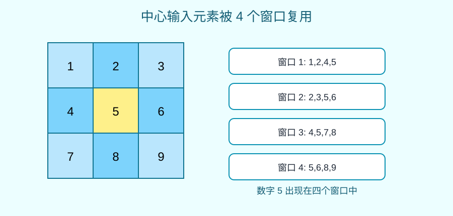
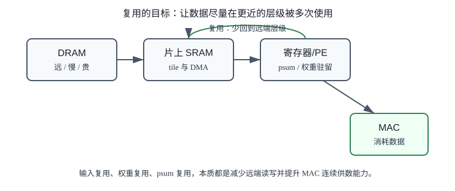
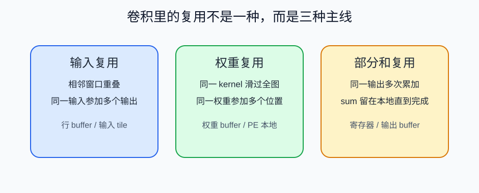

# 15 数据复用

> 章节等级：A
> 状态：重组候选
> 来源映射：`chapter_source_map.csv` 中的 15 章；本章主要承接 SRC17、SRC12，参考 SRC01。

## 本章知识全景图

### 1. 一眼看懂本章在讲什么

- 本章主题：把输入、权重和部分和的复用位置讲清楚。
- 核心概念：input reuse / weight reuse / psum reuse / temporal reuse / spatial reuse
- 逻辑主线：NPU 性能不只由 MAC 数决定，还由每个数据从外存搬进来后能被复用多少次决定。
- 最小学习路径：输入复用 -> 权重复用 -> psum 保留 -> 复用和带宽的交换。

### 2. 概念地图

| 概念层级 | 核心概念 | 前置知识 | 延伸到 NPU 的位置 |
| --- | --- | --- | --- |
| 输入复用 | 相邻窗口共享输入 | 卷积窗口 | input buffer |
| 权重复用 | 同一 kernel 扫过多个位置 | 卷积核 | weight buffer/广播 |
| 部分和复用 | psum 留在片上继续累加 | 归约 | accumulator/register |
| 复用策略 | 时间/空间复用 | dataflow | PE 阵列映射 |

### 3. 阅读顺序 / 处理顺序

- 先建立什么直觉：先把“数据复用”落到一个可观察、可手算或可追踪的对象上。
- 再形式化什么定义或流程：围绕“数据复用决定 MAC 能不能被持续喂饱”和“输入、权重和 psum 的复用方式不同”整理概念边界、输入输出和约束。
- 最后通过什么例子、操作或推导固化：用“用小窗口标出输入、权重和 psum 复用”进入复现链，再回到 NPU 的 MAC、buffer、DMA、PE、编译器或 runtime 判断。
## 1. 数据复用决定 MAC 能不能被持续喂饱

同样的 MAC 数，数据复用好坏会把瓶颈从计算单元转移到外存带宽。

你需要理解卷积窗口、tile 和片上 SRAM。前一章说过，tile 是一次放进片上的工作块。本章继续问：数据既然已经放进片上了，怎样让它在离开之前尽量多服务几个 MAC？

数据复用不是“缓存命中率”这一个词能概括的。对 NPU 来说，它至少有三种来源：同一个输入被多个相邻窗口使用；同一个权重在很多空间位置反复使用；同一个输出的部分和在多次 MAC 中不断累加。三者对应不同的 buffer 和 dataflow 选择。

想象你在装配四台相同的小车。每台车都要用螺丝刀、轮子和车架。如果你每装一个螺丝都跑去仓库拿一次螺丝刀，那会非常慢。更合理的是把螺丝刀放在手边，连续用很多次；把一盒轮子拿到工位，让几台车共享；每台车正在拧到一半时，也不要把半成品搬回仓库。

卷积也一样。输入、权重、部分和就像这些工具和半成品。NPU 设计的很多工作，都是让常用数据停在离 MAC 更近的位置。

## 2. 输入、权重和 psum 的复用方式不同

输入常被相邻窗口复用，权重常被多个输出位置复用，psum 则必须留到归约完成。

输入复用来自窗口重叠。卷积核滑动一格后，新窗口和旧窗口通常共享大部分输入。一个位于中间的输入元素，可能被左上、右上、左下、右下多个输出窗口使用。如果每次都从外部内存重读它，就浪费带宽。

权重复用来自权重共享。同一个卷积核会在整张特征图上滑动。也就是说，权重 `kernel[0][0]` 不只用于一个输出位置，而是用于所有合法窗口的相同相对位置。如果输出空间很大，权重可以被复用很多次。

输出复用更准确地说是部分和复用。一个输出值往往需要多次 MAC 才能完成。在累加完成前，部分和最好留在 PE 寄存器或片上 buffer 中。如果每加一次都写回外部内存，再读回来继续加，就会极其低效。

数据复用的目标不是让所有数据永远不动。真实硬件容量有限，数据总要移动。目标是让“移动一次”的数据尽可能参加更多 MAC，让昂贵的外部访问变少。



- **数据复用**：同一份数据在被重新从更远存储层级读取之前，被多个计算动作使用。
- **输入复用**：输入激活被多个输出位置、多个输出通道或多个 kernel 使用。
- **权重复用**：同一卷积核权重在多个输出空间位置、多个 batch 或多个 tile 内使用。
- **部分和复用**：同一个输出值的累加中间结果留在本地，连续接受多个乘积累加。
- **复用距离**：两次使用同一数据之间隔了多少计算步骤或循环层级。距离越近，越容易用小 buffer 保住。
- **复用因子**：同一数据被使用的次数。例如某个输入元素被 4 个窗口使用，复用因子就是 4。
- **数据驻留**：让某类数据在某个存储层级停留一段时间，例如权重驻留在 PE 附近、部分和驻留在寄存器。

复用的收益可以粗略写成：

```text
外部读取次数减少 = 朴素重复读取次数 - 实际外部读取次数
```

但这只是数量。真实收益还取决于数据从哪一级存储读取：外部 DRAM、片上 SRAM、寄存器或 PE 本地连线，代价差别很大。



## 3. 用小窗口标出输入、权重和 psum 复用

输入是 3 行 3 列，2x2 kernel，stride=1，无 padding。输出是 2x2，所以一共有 4 个窗口。

```text
a b c
d e f
g h i
```

四个窗口分别是：

```text
窗口 1: a b / d e
窗口 2: b c / e f
窗口 3: d e / g h
窗口 4: e f / h i
```

统计每个输入元素被用几次：

```text
a: 1 次
b: 2 次
c: 1 次
d: 2 次
e: 4 次
f: 2 次
g: 1 次
h: 2 次
i: 1 次
```

如果没有输入复用，4 个窗口每个读 4 个输入，一共读：

```text
4 * 4 = 16 次输入读取
```

如果 3x3 输入 tile 能完整留在片上，并且每个元素从外部只搬一次，外部输入读取就是：

```text
9 次
```

单看输入，节省：

```text
16 - 9 = 7 次外部读取
```

这就是数据复用的最小直觉：计算没有变，少的是重复搬运。

继续使用 3x3 输入：

```text
1 2 3
4 5 6
7 8 9
```

卷积核：

```text
1 0
0 1
```

四个输出手算：

```text
out[0][0] = 1*1 + 2*0 + 4*0 + 5*1 = 6
out[0][1] = 2*1 + 3*0 + 5*0 + 6*1 = 8
out[1][0] = 4*1 + 5*0 + 7*0 + 8*1 = 12
out[1][1] = 5*1 + 6*0 + 8*0 + 9*1 = 14
```

现在不关心结果本身，而是统计数据使用。

输入使用次数：

```text
1: 1 次
2: 2 次
3: 1 次
4: 2 次
5: 4 次
6: 2 次
7: 1 次
8: 2 次
9: 1 次
```

权重使用次数。kernel 有 4 个元素：

```text
w00 = 1
w01 = 0
w10 = 0
w11 = 1
```

每个输出窗口都会使用全部 4 个权重。输出一共有 4 个位置，所以每个权重被用：

```text
4 次
```

权重总使用次数：

```text
4 个权重 * 4 个输出位置 = 16 次
```

如果每次使用都从外部内存读权重，需要 16 次外部权重读取；如果 4 个权重留在片上，只需要外部读取 4 次，节省 12 次。

再看部分和。以 `out[0][0]` 为例：

```text
sum = 0
sum = sum + 1*1 = 1
sum = sum + 2*0 = 1
sum = sum + 4*0 = 1
sum = sum + 5*1 = 6
```

这个 `sum` 在 4 次 MAC 之间都属于同一个输出。若它能留在寄存器里，只在最后写出一次，外部写读最少；若每一步都写回外部再读回来继续加，就会出现多余的中间写读。

把三类复用合起来看：

```text
输入：朴素 16 次读取 -> 理想 tile 内 9 次外部读取
权重：朴素 16 次读取 -> 理想 tile 内 4 次外部读取
部分和：每输出 4 步累加 -> 最好本地保留，完成后写一次
```

这个小例子已经说明，NPU 性能不只是 MAC 数量。16 次乘法没有变，但外部搬运次数可以差很多。

### 复用因子小算账

复用不能只停留在“多用几次”的口号上，至少要能粗算一次。仍用 3x3 输入、2x2 kernel、stride=1 的例子。朴素窗口读取会读 4 个窗口，每个窗口 4 个输入，一共 16 次输入读取；如果整个 3x3 输入 tile 已经在片上，只需要从外部读 9 个输入元素，少读 7 次。这个例子很小，但它说明了复用的工程含义：不是 MAC 变少了，而是外部搬运变少了。

权重复用也能类似计算。一个 2x2 kernel 有 4 个权重，输出空间是 2x2 时，每个权重会用于 4 个输出位置。若权重每次从外部重新读，外部读取是 16 次；若权重 tile 驻留在片上，外部读取是 4 次。输出空间越大，权重复用越明显，因此很多数据流会优先让权重驻留。

部分和复用则看写回次数。一个输出值需要 4 次 MAC，如果每次 MAC 后都把 psum 写回外存再读回来，单个输出就会产生多次中间读写；如果 psum 留在 PE 寄存器，外部只看最终输出写回。归约维度越深，部分和驻留越重要。

这三个小账本给出一个判断顺序：先数理论复用因子，再看片上资源能不能保住这类数据，最后看调度是否真的减少了外部访问。如果理论复用很高但实测带宽仍高，通常说明 tile、loop order 或 dataflow 没有把复用机会兑现。

## 4. 复用策略如何变成 buffer 和 dataflow 选择

NPU 的存储层级通常可以粗略看成：外部内存、片上 SRAM、PE 附近寄存器或本地小存储。越靠近 MAC，容量越小但访问越快、能耗越低。数据复用的工程目标就是把高复用数据尽量放在更近的位置。

不同数据类型适合不同驻留方式：

| 数据 | 常见复用 | 可能的驻留位置 |
| --- | --- | --- |
| 输入激活 | 相邻窗口、多个输出通道 | 行 buffer、输入 SRAM、片上 tile buffer |
| 权重 | 多个空间位置、多个 batch | 权重 SRAM、PE 本地寄存器 |
| 部分和 | 同一输出的多次累加 | PE 寄存器、输出 buffer |

tile 是复用的边界。一个 tile 内能复用的数据，最好不要被赶出片上；tile 之间的 halo 复用，则需要更细的调度。dataflow 是复用的执行规则：如果选择 weight-stationary，就让权重留在 PE 附近；如果选择 output-stationary，就让部分和留在本地；如果选择 input-stationary，就尽量让输入在多个计算中被反复使用。

这也解释了为什么 NPU 不只追求更多 MAC。若外部内存带宽不足，MAC 再多也会空等。复用做得好，等于让同样的带宽支撑更多 MAC；复用做得差，就会把能量花在来回搬同一个数字上。

### 为什么学

NPU 的能效优势不只来自“很多 MAC 同时算”，更来自“搬进来的数据能被反复使用”。如果不理解数据复用，就会误以为提高 TOPS 就能提高真实性能；实际系统常常卡在外部带宽、片上 buffer 容量或部分和写回上。学本章，是为了把 tile、dataflow、partial sum 和带宽瓶颈连成同一条工程链。



### 工程判断

判断一层卷积该优先复用什么，先看哪类数据最大、哪类数据复用距离最短、哪类数据搬运最贵。输出空间大时，权重通常值得驻留；窗口重叠强时，输入行 buffer 和空间 tile 很关键；归约很深时，部分和驻留比反复写回更重要。失败信号包括同一权重块被多次从外存搬入、相邻窗口没有命中输入 buffer、部分和每轮都写回外存、或 MAC 利用率低但外存带宽接近上限。排查时先数理论复用因子，再看实际外部访问次数，最后定位是 tile 太小、loop order 不合适，还是 dataflow 选错了驻留对象。

## 5. 常见误区与判断线索

### 误区 1：数据复用只是软件缓存优化

- 错误说法：复用是程序员写代码时顺手优化一下，和硬件结构关系不大。
- 为什么错：NPU 的 buffer、寄存器、阵列连线和 dataflow 都围绕复用设计。
- 正确理解：复用是硬件、编译器和算子形状共同决定的核心目标。
- 工程后果：把复用当软件小优化，会低估片上 SRAM、寄存器文件和 PE 互连的作用，最终只会数 MAC，不会解释为什么算力用不满。
- 判断线索：如果分析报告里只有总计算量，没有说明输入、权重、部分和分别复用多少次、停在哪里，就说明复用口径缺失。

### 误区 2：只要有 cache，复用就自动解决

- 错误说法：硬件缓存会自动保存常用数据，不用管。
- 为什么错：很多 NPU 使用显式片上 SRAM 和编译器调度，不完全依赖通用 cache。
- 正确理解：需要通过 tile、loop order 和 dataflow 主动安排数据停留。
- 工程后果：指望 cache 自动解决会让编译器不安排显式搬运和驻留，真实 NPU 上可能出现同一权重或输入反复 DMA 读入。
- 判断线索：如果硬件暴露 scratchpad、local SRAM 或 DMA 描述符，而不是透明 cache，就必须显式规划 tile 和数据生命周期。

### 误区 3：权重复用和输入复用是一回事

- 错误说法：都是重复使用数据，没必要区分。
- 为什么错：权重通常在空间位置上复用，输入通常在相邻窗口和输出通道上复用，驻留策略不同。
- 正确理解：不同复用来源对应不同 buffer 和数据移动方式。
- 工程后果：不区分复用类型会选错 dataflow，例如本该权重驻留却让权重反复流动，或本该输入广播却让多个 PE 重复读同一输入。
- 判断线索：看复用对象时先问“被谁重复用”：权重是否跨 `OH*OW` 用，输入是否跨相邻窗口或多个 `C_out` 用，部分和是否跨 `ic/r/s` 累加。

### 误区 4：部分和不是数据复用

- 错误说法：复用只指输入和权重，sum 只是临时变量。
- 为什么错：部分和如果不能本地保留，会产生大量中间读写。
- 正确理解：部分和驻留是 dataflow 选择中的核心问题。
- 工程后果：忽视部分和会让归约维度切块时不断读旧值、写新值，外部带宽被中间结果吞掉，量化位宽也更容易出错。
- 判断线索：如果一个输出需要多轮 `K/C_in` 累加，查看中间 `psum` 是否留在 PE/片上 buffer；若每轮都写外存，就是严重复用缺口。

### 误区 5：复用越多一定越好

- 错误说法：只要追求最大复用，性能就最好。
- 为什么错：为了复用可能需要更大 buffer、更复杂控制或更差并行度。
- 正确理解：复用要和容量、并行度、带宽和控制成本一起平衡。
- 工程后果：过度追求单一数据复用会牺牲其他资源，例如为了权重驻留把输入切得太碎，或为了输入复用让部分和合并复杂。
- 判断线索：复用率提高但 PE 利用率下降、buffer 冲突上升或 DMA 等待变长时，说明复用策略已经越过收益点。

### 误区 6：复用次数高就等于复用有效

- 错误说法：只要某个输入理论上被多个输出使用，就一定能减少外部搬运。
- 为什么错：理论复用必须落到实际时间窗口和存储位置；如果两次使用间隔太远，数据早已被替换，就不能形成有效片上复用。
- 正确理解：有效复用需要同时满足三个条件：数据在复用间隔内仍留在近端存储，使用者能按时拿到它，保留它的成本低于重新搬运。
- 工程后果：只数理论复用会高估性能，实际 trace 中仍可能看到同一输入块被反复 DMA，因为 tile 顺序或 buffer 容量无法覆盖复用距离。
- 判断线索：比较理论复用次数和实际外存读取次数；如果理论上同一数据应被用 8 次，但 trace 里几乎每次都重新读，说明复用距离、tile 顺序或 buffer 淘汰策略有问题。

本章发布前的复核表要把复用拆成三列。第一列是理论复用：一个输入、一个权重、一个部分和按数学循环最多被用多少次。第二列是片上复用：这些使用是否发生在同一个 tile 生命周期内，数据是否真的留在 SRAM 或寄存器中。第三列是外存节省：和朴素每次重读相比，实际少搬了多少 byte。只有三列同时闭合，复用才不是口号。

一个小例子可以固定口径：3x3 输入、2x2 kernel、stride=1 会产生 2x2 输出。朴素读窗口需要 `4*4=16` 次输入读取；如果整个 3x3 输入 tile 留在片上，外部只读 9 个输入。理论节省是 7 次输入读取。但真实 NPU 还要看这个 3x3 tile 是否和权重、部分和同时放得下，是否能用连续 DMA 搬入，是否会因为下一个 tile 太远而提前被替换。

因此复用不是越大越好，而是越接近硬件可兑现越好。工程报告里最好同时写“复用机会”和“兑现条件”：谁复用、复用几次、存在哪里、什么时候失效、失效后要多搬多少数据。这样后面讨论 dataflow、tile 和带宽时，才有同一套数字口径。

最小复现实验建议记录两版 trace。第一版按每个窗口独立读取输入，统计 input read、weight read、psum read/write。第二版使用一个能容纳 3x3 输入的片上 tile，再统计同样四类访问。对比两版数字，读者会看到复用不是抽象好处，而是外存字节数的实打实减少。若两版 trace 几乎一样，说明所谓复用没有落到实际存储层级。

这个实验还可以加入权重复用：同一个 2x2 kernel 生成 2x2 输出时，权重理论上被用 4 次。如果硬件每个输出位置都重新从外存读权重，权重复用也没有兑现。把输入复用和权重复用放在同一张表里，才能判断当前瓶颈更像输入带宽、权重带宽，还是部分和写回。

最后再加一列“失效原因”。复用失败通常不是单一原因：可能是 buffer 放不下，可能是 tile 顺序让复用间隔太远，也可能是 DMA 只能按另一种布局成块搬运。把原因写清，后续才知道该改容量、改调度，还是改 layout。

## 6. 最后速记

### 本章最该记住的结论

- 数据复用的目标是减少同一数据反复访问外存。
- 输入、权重、psum 三类数据的复用规律不同，不能用一个缓存概念粗暴概括。
- 好的复用需要片上存储、循环顺序和 PE 映射配合。
- 判断性能时要同时看 MAC utilization 和 DRAM bytes，而不是只看理论算力。

### 复现 / 复习清单

完成本章后应能做到：
- 解释数据复用为什么是 NPU 设计的核心，而不是一个附加优化。
- 区分输入复用、权重复用、输出或部分和复用。
- 手算一个小卷积中输入和权重被重复使用的次数。
- 说明为什么“少搬一次数据”常常比“少做一次小计算”更重要。
- 把数据复用连接到 tile、buffer、DMA、MAC 阵列和 dataflow。

### 自测题

### 题目

1. 什么是数据复用？
2. 卷积中的输入复用来自哪里？
3. 权重复用为什么天然存在？
4. 3x3 输入、2x2 kernel、stride=1 时，中心输入元素被几个窗口使用？
5. 同上例，朴素窗口读取一共会读多少次输入？
6. 如果整个 3x3 输入 tile 只从外部搬一次，外部输入读取是多少次？
7. 部分和为什么最好留在本地？
8. tile 和数据复用是什么关系？
9. weight-stationary 主要想复用哪类数据？
10. 为什么高 MAC 数不一定带来高性能？

### 答案或评分点

1. 同一份数据在被重新从更远存储层级读取前，被多个计算动作使用。
2. 相邻卷积窗口重叠，同一个输入元素参与多个输出。
3. 同一个卷积核在所有输出空间位置共享使用。
4. 4 个窗口。
5. 4 个窗口乘以每窗 4 个输入，共 16 次。
6. 9 次。
7. 否则每次累加都可能产生中间写读，浪费带宽和能量。
8. tile 决定哪些数据能在片上保留并被复用。
9. 权重。
10. 如果数据搬运跟不上，MAC 会空等，能量也会浪费在存储访问上。

## 来源与核对

- 外部来源：Eyeriss 论文 `https://eyeriss.mit.edu/`，用于核对 CNN 加速器中 input、weight、psum 数据复用和存储访问代价的基本分类。
- 外部来源：ONNX Conv 官方算子文档 `https://onnx.ai/onnx/operators/onnx__Conv.html`，用于核对卷积窗口、权重共享和输出计算语义。
- 外部来源：CS231n 卷积网络讲义 `https://cs231n.github.io/convolutional-networks/`，用于核对相邻窗口重叠、局部连接和权重共享直觉。
- 外部来源：Apache TVM TensorIR 文档 `https://tvm.apache.org/docs/deep_dive/tensor_ir/index.html`，用于支撑通过循环调度和局部性优化提升数据复用。
- 本地来源：`C:\Users\11035\Desktop\ic\npu\14、NPU\《NPU硬件循环与数据流架构从入门到精通》\03.html`，第 269-336 行说明数据复用、weight-stationary、output-stationary、row-stationary 和复用层次。
- 本地来源：`C:\Users\11035\Desktop\ic\npu\14、NPU\《NPU硬件循环与数据流架构从入门到精通》\05.html`，第 550-563 行把卷积滑动窗口映射为数据流图并强调数据复用率高、减少内存访问。
- 本地来源：`C:\Users\11035\Desktop\ic\npu\14、NPU\《NPU内存带宽与DMA优化从入门到精通》\01.html`，第 227-274 行说明内存墙、复用机会和 DMA 优化动机。
