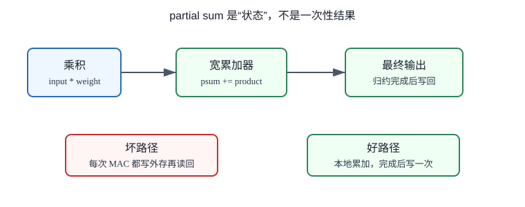
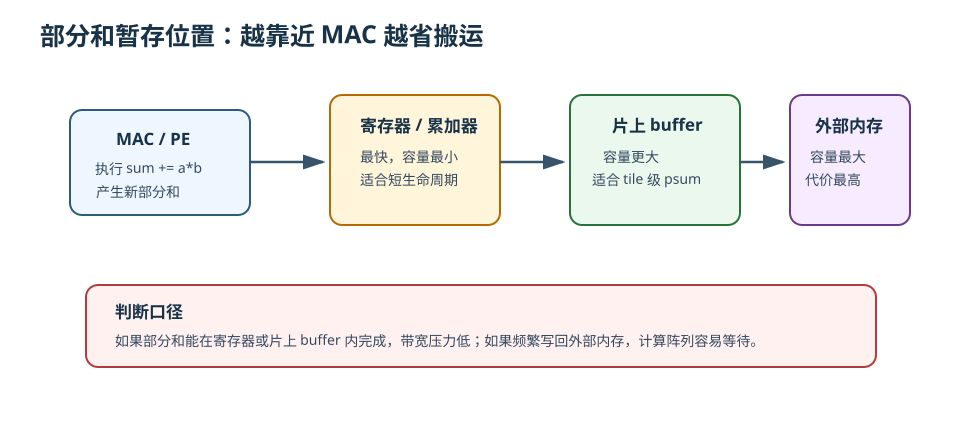
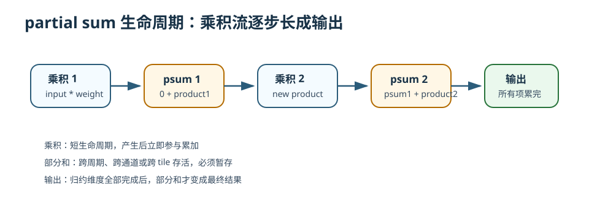

# 17 partial sum 部分和

> 章节等级：A
> 状态：重组候选
> 来源映射：`chapter_source_map.csv` 中的 17 章；本章主要承接 SRC17，参考 SRC01、SRC12。

## 本章知识全景图

### 1. 一眼看懂本章在讲什么

- 本章主题：解释 partial sum 为什么是卷积和矩阵乘正确性与性能的关键中间状态。
- 核心概念：partial sum / accumulator / reduction / writeback / bitwidth / spill
- 逻辑主线：partial sum 不是临时细节，而是归约维度没有累完前的中间结果；它什么时候清零、保留、合并和写回，直接影响正确性和带宽。
- 最小学习路径：MAC 累加 -> psum 生命周期 -> bitwidth -> 片上保留/外存 spill -> 输出写回。

### 2. 概念地图

| 概念层级 | 核心概念 | 前置知识 | 延伸到 NPU 的位置 |
| --- | --- | --- | --- |
| 中间状态 | partial sum | MAC | accumulator/register |
| 生命周期 | 清零、累加、合并、写回 | 归约循环 | output-stationary |
| 数值宽度 | int32 accumulation | 量化 | 溢出和 requantize |
| 带宽风险 | psum spill | buffer 容量 | DRAM traffic |

### 3. 阅读顺序 / 处理顺序

- 先建立什么直觉：先把“partial_sum部分和”落到一个可观察、可手算或可追踪的对象上。
- 再形式化什么定义或流程：围绕“partial sum 是归约没完成前的输出半成品”和“psum 生命周期决定正确性，也决定带宽”整理概念边界、输入输出和约束。
- 最后通过什么例子、操作或推导固化：用“手算一个输出值的 psum 变化”进入复现链，再回到 NPU 的 MAC、buffer、DMA、PE、编译器或 runtime 判断。
## 1. partial sum 是归约没完成前的输出半成品

只要 `IC/R/S/K` 方向还没累完，psum 就不能当作最终输出写回。

本章需要你已经理解 MAC 的基本形式：

```text
sum = sum + a*b
```

这里的 `sum` 在完成之前就是部分和。前面章节已经多次手算过点积和单通道卷积，本章只是把原来藏在计算过程中的 `sum` 单独拿出来看。

还需要记住三个背景：

- 一个卷积输出值来自输入窗口和权重窗口的多次乘加。
- 多通道卷积会把多个输入通道上的乘加结果继续累到同一个输出。
- 后续硬件不会把“输出值”当成一瞬间生成的东西，而会把它看成一段时间内逐步累出来的状态。

本章会提到 PE、buffer、dataflow。PE 的正式微架构定义仍留到第 20 章，这里只把它当成“阵列里负责一部分 MAC 和本地暂存的小计算格子”来使用。



想象你在超市结账。购物车里有苹果、牛奶、面包，每种商品都有单价和数量。收银员不会等到最后突然变出总价，而是边扫商品边更新一个小计：

```text
小计 = 0
扫苹果：小计 = 小计 + 苹果单价 * 苹果数量
扫牛奶：小计 = 小计 + 牛奶单价 * 牛奶数量
扫面包：小计 = 小计 + 面包单价 * 面包数量
最终总价 = 小计
```

在扫完苹果之后，小计还不是最终总价；在扫完牛奶之后，也还不是最终总价。但这些小计都不能丢，因为下一步要接着往上加。partial sum 就是神经网络乘加里的“小计”。

如果收银员每扫一件商品都把小计写到很远的仓库，再下一件商品来时又去仓库取回来，结账会非常慢。NPU 也是一样：如果每一次 MAC 之后都把部分和写回外部内存，再读出来继续加，计算阵列会被数据搬运拖住。因此部分和最好尽量留在离 MAC 很近的地方，直到它真的完成。

## 2. psum 生命周期决定正确性，也决定带宽

psum 清零太晚会串结果，写回太早会多搬运，位宽太小会溢出。

一个输出值可以看成许多贡献项的合并。每个贡献项通常是一个输入数字乘一个权重数字：

```text
贡献项 = input * weight
```

把贡献项一个个加进去，就得到不断变化的部分和：

```text
psum0 = 0
psum1 = psum0 + 第 1 个贡献项
psum2 = psum1 + 第 2 个贡献项
psum3 = psum2 + 第 3 个贡献项
...
最终输出 = psumN
```

这里有三个对象不要混：

| 对象 | 它是什么 | 生命周期 |
| --- | --- | --- |
| 乘积 product | 单次 `input * weight` 的结果 | 通常很短，产生后立刻参与累加 |
| 部分和 partial sum | 已累加若干乘积、但还没完成的中间和 | 可能跨多个周期、多个通道、多个 tile 存活 |
| 最终输出 output | 所有相关乘积都加完后的结果 | 可以写入输出 buffer 或下一层输入 |

部分和存在的根本原因是“归约”。卷积、点积、矩阵乘里的一个输出，通常要沿某些维度求和。例如卷积会沿输入通道、卷积核高度、卷积核宽度求和。只要求和不是一口气在同一个瞬间完成，中间状态就必须有名字、有位置、有更新规则。

部分和最容易在多通道卷积里看清。假设一个输出位置需要两个输入通道共同贡献。先算通道 0，只得到“半成品”；再算通道 1，才得到最终输出。通道 0 的结果就是部分和，它必须等通道 1 的贡献加进来。



在本书中，**partial sum（部分和）** 指某个输出元素在归约维度尚未全部累加完成时的中间累加值。它是最终输出的前身。

对于一个简化的多通道卷积，输出可以写成：

```text
out[oc][oh][ow]
  = bias[oc]
  + sum over ic, r, s of input[ic][oh+r][ow+s] * weight[oc][ic][r][s]
```

其中：

- `oc` 是输出通道。
- `oh, ow` 是输出空间位置。
- `ic` 是输入通道。
- `r, s` 是卷积核内的位置。
- `input * weight` 是单个乘积。
- 对 `ic, r, s` 的求和会产生一串中间累加值。

如果只累加到某个子集合 `T`，就可以把部分和写成：

```text
psum_T[oc][oh][ow]
  = bias[oc] + sum over (ic,r,s) in T of input[ic][oh+r][ow+s] * weight[oc][ic][r][s]
```

当 `T` 覆盖了所有输入通道和卷积核位置时，`psum_T` 才等于最终输出。

部分和有三个关键边界：

1. **初始化边界**：开始累加前，部分和通常初始化为 0，或者初始化为 bias。
2. **更新边界**：每来一个乘积或一组乘积，就执行一次累加更新。
3. **完成边界**：所有归约维度都完成后，部分和变成最终输出，可以写回。

还要注意精度边界。即使用 8 bit 输入和 8 bit 权重，部分和也通常需要更宽的位宽保存，因为很多乘积累加后范围会变大。例如 9 个正数乘积相加，结果可能远大于单个 8 bit 数。量化和定点数会在后续章节展开，本章只先建立直觉：部分和的位宽不能随便等同于输入位宽。

## 3. 手算一个输出值的 psum 变化

先看一个长度为 4 的点积：

```text
x = [2, 1, 3, 4]
w = [5, 6, 1, 2]
```

逐项乘法：

```text
2*5 = 10
1*6 = 6
3*1 = 3
4*2 = 8
```

部分和变化如下：

| 步骤 | 新乘积 | 部分和 |
| --- | ---: | ---: |
| 初始化 | - | 0 |
| 第 1 次 MAC | 10 | 0 + 10 = 10 |
| 第 2 次 MAC | 6 | 10 + 6 = 16 |
| 第 3 次 MAC | 3 | 16 + 3 = 19 |
| 第 4 次 MAC | 8 | 19 + 8 = 27 |

所以最终输出是：

```text
27
```

这里 `10`、`16`、`19` 都是部分和。它们不是最终结果，但下一步必须用到它们。如果第 2 次 MAC 后把 `16` 丢了，第 3 次就无法得到 `19`。

再把这个过程写成硬件更熟悉的形式：

```text
psum = 0
psum = psum + 2*5   # 10
psum = psum + 1*6   # 16
psum = psum + 3*1   # 19
psum = psum + 4*2   # 27
out = psum
```

这段里只有最后一行的 `out` 是最终输出。前面的 `psum` 都是正在生长的输出。

现在看一个两通道、2x2 卷积窗口生成一个输出值的完整过程。假设只有一个输出通道、一个输出位置。

输入通道 0 的窗口：

```text
1 2
0 1
```

对应权重：

```text
1 0
2 1
```

输入通道 1 的窗口：

```text
2 1
3 0
```

对应权重：

```text
0 1
1 2
```

先算通道 0：

```text
1*1 + 2*0 + 0*2 + 1*1
= 1 + 0 + 0 + 1
= 2
```

此时：

```text
psum = 2
```

这个 `2` 还不是最终输出，因为通道 1 的贡献还没加进来。

再算通道 1：

```text
2*0 + 1*1 + 3*1 + 0*2
= 0 + 1 + 3 + 0
= 4
```

把通道 1 贡献加到通道 0 的部分和上：

```text
psum = 2 + 4 = 6
```

最终输出：

```text
out = 6
```

如果写成逐次 MAC，过程更细：

| 阶段 | MAC | psum |
| --- | --- | ---: |
| 初始化 | - | 0 |
| C0 第 1 项 | `1*1` | 1 |
| C0 第 2 项 | `2*0` | 1 |
| C0 第 3 项 | `0*2` | 1 |
| C0 第 4 项 | `1*1` | 2 |
| C1 第 1 项 | `2*0` | 2 |
| C1 第 2 项 | `1*1` | 3 |
| C1 第 3 项 | `3*1` | 6 |
| C1 第 4 项 | `0*2` | 6 |

这个表能看出一个重要事实：部分和的生命周期跨过了两个输入通道。如果硬件一次只能处理一个通道 tile，那么通道 0 算完后，`psum=2` 必须保留；等通道 1 的数据到达，再读出 `2`，继续加到 `6`。

再引入 tile 的情况。假设这个输出一共需要 64 个输入通道贡献，但片上 buffer 一次只能放下 16 个通道的输入和权重。硬件可能分 4 批做：

```text
第 1 批通道 0-15：得到 psum_a
第 2 批通道 16-31：psum_b = psum_a + 新贡献
第 3 批通道 32-47：psum_c = psum_b + 新贡献
第 4 批通道 48-63：out = psum_c + 新贡献
```

如果 `psum_a`、`psum_b`、`psum_c` 能一直留在片上，就很好；如果片上放不下，它们可能要被写到外部内存，下一批再读回来。这种“部分和溢出”会显著增加带宽压力。第 18 章会专门讨论带宽瓶颈。

## 4. psum 如何连接 accumulator、buffer 和 dataflow

NPU 里部分和通常有三个可能的暂存位置：

| 暂存位置 | 好处 | 代价 |
| --- | --- | --- |
| PE 内寄存器或累加器 | 离 MAC 最近，速度快、能耗低 | 容量很小，只适合短生命周期部分和 |
| 片上 SRAM / output buffer | 容量更大，可保存 tile 级部分和 | 访问成本高于寄存器，需地址管理 |
| 外部内存 | 容量最大 | 带宽和能耗代价最高，通常应尽量避免频繁访问 |

这就是 output-stationary 直觉的来源。所谓让输出或部分和 stationary，不是说输出完全不动，而是尽量让它在累加完成前停留在靠近计算的位置。这样同一个部分和不会在每次 MAC 后被搬来搬去。

不同 dataflow 对部分和的处理不同：

- 如果让权重留在本地，输入流过阵列，部分和可能需要在 PE 内累加或在 PE 之间传递。
- 如果让输出留在本地，部分和会尽量待在同一个 PE 或同一小片 buffer，直到完成。
- 如果让输入留在本地，多个权重或输出通道会使用同一批输入，部分和的归属也要随输出通道安排。

无论采用哪种策略，都必须回答同一个问题：某个 `out[oc][oh][ow]` 的部分和由谁拥有、在哪里保存、什么时候更新、什么时候算完。

把本章的两通道例子落到硬件，可以想成一个小 PE 顺序执行 8 次 MAC。PE 里有一个累加器 `acc`：

```text
acc = 0
读 C0 的输入和权重，执行 4 次 MAC，acc = 2
读 C1 的输入和权重，执行 4 次 MAC，acc = 6
写出 output = 6
```

如果有多个 PE 并行处理多个输出位置，每个 PE 都要维护自己的部分和。若多个 PE 协作处理同一个输出，还需要额外的归约，把多个局部部分和合并成最终输出。这类并行归约会带来额外控制和数据移动，后续讲 PE 阵列和脉动阵列时会继续展开。

### 为什么学

partial sum 是卷积从“公式”变成“硬件状态”的关键。输入和权重可以读出来，乘积可以算出来，但只要归约还没结束，输出就只是一个需要继续保存和更新的状态。如果不理解部分和，就无法判断 output-stationary 为什么存在，为什么归约并行需要合并网络，为什么 INT8 输入常常需要更宽累加器，也无法解释部分和频繁写回为什么会变成带宽瓶颈。



### 工程判断

部分和的第一条工程判断是生命周期：它属于哪个输出元素，归约是否已经完成，是否跨 tile 或跨 PE。第二条是位置：能留在 PE 寄存器就不要写远，寄存器放不下再考虑片上 output buffer，只有跨 tile 或容量不足时才写回更远存储。第三条是位宽：输入和权重位宽小，不代表部分和位宽也小，累加项数量越多，溢出风险越高。失败信号包括输出值被不同通道污染、partial sum 清零时机错误、外部中间写回过多、或量化层出现异常饱和。排查时先确认 `psum` 的归属下标，再检查清零、累加、合并、写回四个时机。

## 5. 常见误区与判断线索

### 误区 1：部分和就是最终输出

- 错误说法：只要看到 `sum`，它就是输出。
- 为什么错：`sum` 可能只累加了一部分通道或一部分卷积核位置，还没有覆盖全部归约维度。
- 正确理解：只有所有相关乘积都加完，部分和才变成最终输出。判断方法是看 `ic/r/s` 等归约循环是否全部结束。
- 工程后果：把部分和当最终输出会造成过早写回和后续层读取半成品，输出值通常偏小或缺少某些通道贡献。
- 判断线索：检查归约循环是否全部结束；如果 `ic/r/s/K` 还没跑完就写 output buffer，那写出的就是部分和，不是最终输出。

### 误区 2：部分和只是软件变量，不影响硬件

- 错误说法：`psum` 只是伪代码里的临时变量，硬件不用特别关心。
- 为什么错：部分和必须真实存在于寄存器、buffer 或内存中。它的位置决定了访问次数、能耗和阵列是否等待。
- 正确理解：任何 `sum += a*b` 都暗含一个硬件问题：这个 `sum` 存在哪里。
- 工程后果：不规划 `psum` 位置会让累加路径变成性能瓶颈，可能出现 MAC 算完了却等部分和读写端口的情况。
- 判断线索：看硬件映射时必须指出 `psum` 在 PE 寄存器、片上 SRAM 还是外存；如果图上只有输入和权重流动，没有 `psum` 路径，就是缺图。

### 误区 3：部分和每次写回外部内存也没关系

- 错误说法：外部内存容量大，部分和放那里最简单。
- 为什么错：外部内存访问慢且耗能高，频繁写回/读出会让 MAC 阵列空等。
- 正确理解：尽量让部分和在本地累加完成，只有 tile 边界或容量不足时才考虑写回。
- 工程后果：部分和外存往返会产生读旧值和写新值两次带宽，归约维度越长，浪费越严重。
- 判断线索：如果 trace 中同一输出 tile 在归约尚未完成时多次写回外存，再读回继续累加，就说明 output-stationary 或片上 psum buffer 没利用好。

### 误区 4：只要乘法算得快，部分和不是瓶颈

- 错误说法：NPU 的核心是乘法器，累加不重要。
- 为什么错：多数神经网络输出都是大量乘积的归约。累加路径、位宽和暂存位置会限制吞吐。
- 正确理解：MAC 里的 A 是 accumulate。乘法和累加必须一起设计。
- 工程后果：累加网络或位宽不足会让乘法器空转，或者把高精度乘积压进低精度和，造成溢出、饱和和精度下降。
- 判断线索：如果乘法吞吐很高但输出更新端口、规约树或 accumulator 成为瓶颈，就说明问题在 A 而不是 M。

### 误区 5：部分和位宽可以和输入一样

- 错误说法：输入是 8 bit，部分和也用 8 bit 就够了。
- 为什么错：很多乘积累加后范围会扩大，位宽不足会溢出或严重丢精度。
- 正确理解：部分和通常需要更宽位宽，具体取决于输入范围、权重范围和累加项数量。
- 工程后果：部分和位宽过窄会让中间值饱和，量化误差被归约长度放大，最终表现为某些通道或高亮区域输出异常。
- 判断线索：用最坏情况估算 `max(|a*w|)*累加项数`；如果范围超过 accumulator 位宽，必须说明缩放、分段累加或饱和策略。

## 6. 最后速记

### 本章最该记住的结论

- partial sum 是归约过程中的中间状态，不是最终输出。
- psum 需要明确清零、累加、保留、合并和写回时机。
- psum 常比输入/权重更宽，量化 NPU 中尤其要关注 int32 累加。
- psum spill 到外存会显著增加带宽压力，是 dataflow 和 tile 选择的重要约束。

### 复现 / 复习清单

完成本章后应能做到：

- 用一句话解释 partial sum：它是某个输出值尚未完成时的中间累加结果。
- 手算一个点积或多通道卷积中部分和的变化过程。
- 区分乘积、部分和、最终输出三件事。
- 说明为什么部分和需要暂存在寄存器、PE 附近或片上 buffer 中。
- 解释当一个输出跨多个 tile 计算时，部分和为什么可能需要被写回再读出。
- 把 partial sum 和 output-stationary 这类 dataflow 的直觉联系起来。

### 自测题

### 题目

1. 用一句话解释 partial sum。
2. 在 `sum = sum + a*b` 中，哪一部分是部分和？
3. 点积 `[1,2,3]` 与 `[4,5,6]` 的部分和依次是多少？
4. 为什么多通道卷积更容易看出部分和的存在？
5. 部分和可以存在哪三类位置？
6. 为什么部分和频繁写回外部内存会拖慢 NPU？
7. 如果一个输出需要 9 个乘积，前 4 个乘积累完后的值是不是最终输出？
8. output-stationary 的基本直觉是什么？
9. 为什么部分和位宽通常要比输入位宽更宽？
10. 如果片上 buffer 一次只能放一半输入通道，部分和会发生什么？

### 答案或评分点

1. partial sum 是某个输出值在累加尚未完成时的中间和。
2. 更新前后的 `sum` 都是部分和，直到所有乘积累完才成为输出。
3. `1*4=4`，`4+2*5=14`，`14+3*6=32`，部分和依次为 4、14、32。
4. 因为每个输入通道先贡献一部分，同一个输出要跨通道继续累加。
5. PE 内寄存器/累加器、片上 SRAM 或 output buffer、外部内存。
6. 外部内存带宽有限且访问能耗高，写回再读回会让计算等待数据。
7. 不是，只是前 4 项的部分和。
8. 尽量让部分和停留在靠近 MAC 的位置，直到最终输出完成。
9. 多个乘积累加后数值范围扩大，需要更宽位宽避免溢出或严重误差。
10. 每批通道会产生或更新部分和；上一批部分和必须保存，下一批到来后继续累加。

## 来源与核对

- 外部来源：Eyeriss 项目与论文 `https://eyeriss.mit.edu/`，用于核对 psum、input、weight 三类数据复用和 dataflow 代价。
- 外部来源：ONNX Conv 官方算子文档 `https://onnx.ai/onnx/operators/onnx__Conv.html`，用于核对多输入通道卷积的归约语义。
- 外部来源：CS231n 卷积网络讲义 `https://cs231n.github.io/convolutional-networks/`，用于核对多通道卷积中同一输出由多项贡献累加而来。
- 外部来源：Google TPU 论文 `https://arxiv.org/abs/1704.04760`，用于参考矩阵乘阵列中乘加与累加结果流动。
- 本地来源：`C:\Users\11035\Desktop\ic\npu\14、NPU\《NPU硬件循环与数据流架构从入门到精通》\03.html`，第 285-288 行说明 output-stationary 中部分和在 PE 中累积、减少部分和写回。
- 本地来源：`C:\Users\11035\Desktop\ic\npu\14、NPU\《NPU硬件循环与数据流架构从入门到精通》\04.html`，第 446 行说明 NPU 中循环依赖通过数据流、多级缓冲和同步机制处理。
- 本地来源：`C:\Users\11035\Desktop\ic\npu\14、NPU\《NPU内存带宽与DMA优化从入门到精通》\02.html`，第 287-417 行说明片上存储和 DMA 双缓冲，用于解释部分和写回带宽压力。
