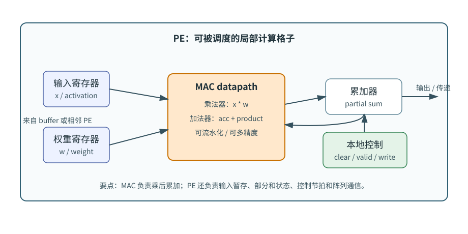
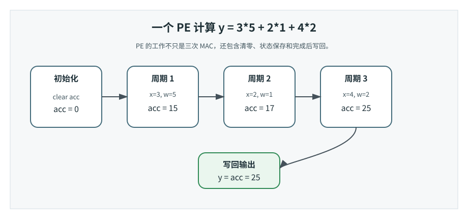
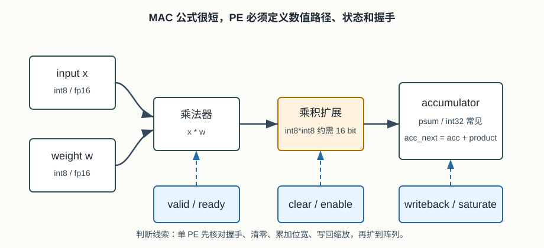

# 20 MAC 与 PE
> 章节等级：A
> 状态：重组候选
> 来源映射：`chapter_source_map.csv` 中的 20 章；本章主要承接 SRC01、SRC17，参考 SRC12。

## 本章知识全景图

### 1. 一眼看懂本章在讲什么

- 本章主题：区分 MAC 这个运算动作和 PE 这个可调度、可握手、可累加的硬件单元。
- 核心概念：MAC / PE / accumulator / register / local control / bitwidth / valid-ready
- 逻辑主线：MAC 只描述乘加，PE 还包含输入选择、累加器、寄存器、控制和局部状态；NPU 阵列真正调度的是 PE。
- 最小学习路径：MAC 动作 -> accumulator 生命周期 -> PE 内部状态 -> 阵列级握手和利用率。

### 2. 概念地图

| 概念层级 | 核心概念 | 前置知识 | 延伸到 NPU 的位置 |
| --- | --- | --- | --- |
| 运算动作 | multiply-accumulate | 点积 | MAC datapath |
| 局部状态 | accumulator、register | partial sum | PE 内部保存和清零 |
| 控制边界 | valid、stall、mode | 时序 | PE 是否接受/输出数据 |
| 阵列组合 | PE array | 并行执行 | dataflow 的最小节点 |



### 3. 阅读顺序 / 处理顺序

- 先建立什么直觉：先把“MAC与PE”落到一个可观察、可手算或可追踪的对象上。
- 再形式化什么定义或流程：围绕“MAC 是运算动作，PE 是包住 MAC 的执行小单元”和“PE 正确性取决于累加器、位宽、控制和握手”整理概念边界、输入输出和约束。
- 最后通过什么例子、操作或推导固化：用“用三元素点积追踪 PE accumulator 的变化”进入复现链，再回到 NPU 的 MAC、buffer、DMA、PE、编译器或 runtime 判断。
## 1. MAC 是运算动作，PE 是包住 MAC 的执行小单元

一个 MAC 只会说 `sum += a*b`，一个 PE 还要知道数据从哪来、累加到哪、何时清零和何时把结果交出去。

本章默认你已经理解三件事：

- 第 01 章的 MAC 直觉：很多点积、矩阵乘和卷积都能拆成重复的 `sum += a*b`。
- 第 17 章的 partial sum：输出还没加完之前，中间累加值必须保存。
- 第 19 章的映射直觉：循环维度会被分给时间、空间、buffer 和 DMA。

如果这些概念还不稳，可以先抓住一个最小关系：

```text
MAC 负责一次乘后累加。
PE 负责在一个局部位置上反复执行 MAC，并保存必要状态。
PE 阵列负责让很多 PE 同时工作。
```

本章会提到寄存器、累加器、valid 信号、输入端口、输出端口。它们不要求你已经学过数字电路，但要先建立一个朴素想法：硬件不是“看到公式就自动算”，硬件要有地方放输入、有线路做乘法和加法、有寄存器记住中间值，还要有控制信号告诉它什么时候算、什么时候停、什么时候输出。

想象一个小型装配工位。桌上有两盒零件：A 盒和 B 盒。工人每次从两盒里各拿一个零件，把它们组合成一个小部件，再把这个小部件加到正在装配的产品上。

如果只看“拿两个零件并组合”，这就是一次乘法。如果再把结果加到半成品上，就是一次 MAC：

```text
半成品 = 半成品 + A零件 * B零件
```

但真实工位不只是一个动作。它还需要：

- 放 A 零件和 B 零件的小托盘。
- 放半成品的暂存位置。
- 一张作业卡，说明本轮要不要工作、结果送到哪里。
- 和相邻工位传递零件或半成品的通道。

这整个工位更像 PE。MAC 是工位上的关键动作，PE 是能把动作稳定重复起来的局部工作站。NPU 不是把无数个乘法器随便堆在一起，而是把许多这样的 PE 组织成阵列，让数据有节奏地到达、复用、累加、输出。

## 2. PE 正确性取决于累加器、位宽、控制和握手

只验证乘法器结果不够，PE 的真实错误常出在 accumulator 生命周期、溢出位宽和 valid/stall 对齐。

MAC 的直觉非常短：

```text
新累加值 = 旧累加值 + 输入 * 权重
```

如果写成时间步：

```text
acc[t+1] = acc[t] + a[t] * b[t]
```

这里 `acc` 就是 PE 里最重要的状态之一。它可能保存部分和，也可能接收上游传来的部分和。只有当归约维度全部算完，`acc` 才能变成最终输出。

PE 的直觉要比 MAC 多一层。一个 PE 通常要回答这些问题：

| 问题 | PE 内部需要什么 |
| --- | --- |
| 本周期的输入从哪里来？ | 输入寄存器、输入端口、valid/ready 信号 |
| 权重或另一个操作数从哪里来？ | 权重寄存器、广播端口、相邻 PE 输入 |
| 乘法和累加由谁做？ | MAC datapath，包括乘法器、加法器、累加器 |
| 部分和暂存在哪里？ | 累加器、局部寄存器或输出寄存器 |
| 结果往哪里走？ | 写回端口、相邻 PE 输出端口或阵列汇聚路径 |
| 什么时候清零、累加、传递、写回？ | 本地控制逻辑或来自阵列控制器的微指令 |

因此，MAC 是 PE 的核心，但 PE 不只是 MAC。一个没有寄存器、控制和接口的乘法器，很难独立参与 NPU 阵列调度；一个 PE 则是阵列能“排班”的基本格子。

这个区别在 partial sum 上最明显。假设一个输出需要 8 次 MAC。乘法器每次只产生一个乘积；MAC datapath 能把乘积加到旧 `acc` 上；PE 则必须知道这个 `acc` 属于哪个输出、什么时候初始化、8 次之后什么时候写回。如果少了这些状态和控制，阵列就无法保证输出正确。

在本书中，**MAC（Multiply-Accumulate，乘加）** 指一次乘法和一次累加组合起来的计算动作，基本形式是：

```text
acc_next = acc_current + x * w
```

其中：

- `x` 通常是输入激活值或输入数据。
- `w` 通常是权重或另一个操作数。
- `acc_current` 是旧累加值，常常是部分和。
- `acc_next` 是更新后的累加值。

**MAC 单元** 指硬件中执行 MAC 动作的 datapath，通常包括乘法器、加法器和累加相关寄存器。实际设计里还可能有饱和、舍入、符号扩展、流水线寄存器、多精度选择等逻辑。零基础阶段先记住：MAC 单元不是抽象公式，而是真正占面积、耗电、受时钟约束的电路。

**PE（Processing Element，处理元素）** 指 NPU 计算阵列中可被调度的基本处理单元。一个 PE 通常包含：

- 一个或多个 MAC 单元。
- 输入操作数寄存器或锁存器。
- 累加器或 partial sum 寄存器。
- 本地控制逻辑，例如清零、累加、旁路、写回、传递。
- 与相邻 PE、片上 buffer 或阵列网络连接的输入输出端口。

边界也要说清：

- PE 不等于 MAC。MAC 是动作或计算电路，PE 是带状态、接口和控制的局部计算单元。
- PE 不等于 CPU core。PE 通常不负责复杂取指、分支预测、操作系统上下文，而是执行高度规则的矩阵/卷积计算片段。
- PE 不一定只能有一个 MAC。有些 PE 可能包含多个 SIMD lane、多个乘法器、向量化 MAC 或额外的激活/比较逻辑。
- PE 的边界定义要允许不同 NPU 微架构差异，但共同点是：它是阵列映射时的本地计算与暂存单位。

还要注意位宽。若 `x` 和 `w` 都是 int8，它们相乘的结果可能需要约 16 bit 表示；如果要累加很多项，`acc` 往往需要 24 bit、32 bit 或更宽。PE 的设计不能只看乘法器数量，还要看累加器位宽和溢出处理，否则同样的数学公式会在硬件里得到错误结果。

## 3. 用三元素点积追踪 PE accumulator 的变化

先让一个 PE 计算长度为 3 的点积：

```text
x = [3, 2, 4]
w = [5, 1, 2]
```

这个 PE 每周期接收一对 `x,w`，内部累加器 `acc` 初始为 0。

| 周期 | 输入 x | 权重 w | 乘积 x*w | acc 更新 |
| --- | ---: | ---: | ---: | ---: |
| 初始化 | - | - | - | 0 |
| 1 | 3 | 5 | 15 | 0 + 15 = 15 |
| 2 | 2 | 1 | 2 | 15 + 2 = 17 |
| 3 | 4 | 2 | 8 | 17 + 8 = 25 |

最终输出是：

```text
y = 25
```

如果只看 MAC 动作，这个例子是三次：

```text
acc = acc + 3*5
acc = acc + 2*1
acc = acc + 4*2
```

如果看 PE，它还包含三个额外动作：

```text
1. 开始前把 acc 清零。
2. 每周期接收一对输入并判断 valid。
3. 第 3 次 MAC 后把 acc=25 标记为完成并送出。
```

这就是 PE 比 MAC 多出来的部分：PE 不是只会“算一下”，它还要知道“什么时候开始、算几次、当前部分和属于谁、什么时候输出”。



### 例题 2：位宽为什么不能只看输入

假设一个 PE 做 int8 点积。输入和权重都在 `[-128, 127]` 范围内。最坏情况下，一个乘积的绝对值约为：

```text
128 * 128 = 16384
```

这个数已经超过 int8 能表示的范围。若一个输出要累加 64 个这样的乘积，累加器可能需要覆盖：

```text
64 * 16384 = 1048576
```

`1048576 = 2^20`，再考虑符号位和余量，累加器通常要比输入和权重宽得多。实际 NPU 可能用 int32 accumulator 保存 int8 MAC 的部分和，然后在输出阶段做缩放、舍入、饱和或截断。

这就是 PE 设计中“位宽”比公式更具体的地方。数学上 `acc = acc + x*w` 很短；硬件上必须回答：

```text
乘积用多少位？
累加器用多少位？
溢出时饱和还是截断？
最终写回前在哪里做量化缩放？
```

如果这些问题没有定义，PE 在小例题上可能正确，在长通道卷积或大 K 维 GEMM 上就会溢出。



现在用两个 PE 计算一个 2x3 矩阵乘以长度为 3 的向量。矩阵和向量是：

```text
A = [
  [1, 2, 3],
  [4, 0, 1]
]

x = [10, 20, 30]
```

输出是：

```text
y[0] = 1*10 + 2*20 + 3*30
y[1] = 4*10 + 0*20 + 1*30
```

空间映射如下：

```text
PE0 负责 y[0]
PE1 负责 y[1]
```

两个 PE 同时接收同一个输入向量元素 `x[k]`，但各自使用不同的权重行。这样输入 `x` 可以广播复用。

### 第一步：初始化

```text
PE0.acc = 0
PE1.acc = 0
```

### 第二步：第 1 个向量元素 x[0]=10

```text
PE0: acc0 = 0 + 1*10 = 10
PE1: acc1 = 0 + 4*10 = 40
```

### 第三步：第 2 个向量元素 x[1]=20

```text
PE0: acc0 = 10 + 2*20 = 50
PE1: acc1 = 40 + 0*20 = 40
```

### 第四步：第 3 个向量元素 x[2]=30

```text
PE0: acc0 = 50 + 3*30 = 140
PE1: acc1 = 40 + 1*30 = 70
```

完整表如下：

| 周期 | 广播输入 | PE0 权重 | PE0 acc | PE1 权重 | PE1 acc |
| --- | ---: | ---: | ---: | ---: | ---: |
| 初始化 | - | - | 0 | - | 0 |
| 1 | 10 | 1 | 10 | 4 | 40 |
| 2 | 20 | 2 | 50 | 0 | 40 |
| 3 | 30 | 3 | 140 | 1 | 70 |

所以：

```text
y = [140, 70]
```

这个例子里最值得观察的是“同一个输入，不同部分和”。`x[0]、x[1]、x[2]` 可以从 buffer 广播给两个 PE；但 PE0 和 PE1 的 `acc` 必须分开，因为它们属于不同输出。如果把两个 PE 的累加器混在一起，就会得到：

```text
错误合并 = 140 + 70 = 210
```

这不是任何一个合法输出。PE 的本地累加器不是随便放的临时变量，而是保证输出归属正确的硬件状态。

把它连接回第 19 章的循环映射：本例把输出行维度映射到空间上，两个输出同时算；把内层 `k` 维度留在时间上，每个 PE 顺序执行 3 次 MAC。输入向量沿 PE 间广播，权重可以来自各 PE 的本地寄存器或权重 buffer，部分和停在各自 PE 内。这就是一个最小的 output-stationary PE 使用方式。

## 4. PE 如何连接阵列、buffer 和 dataflow

在真实 NPU 中，PE 是很多设计问题的交汇点。

第一，PE 决定阵列的基本吞吐。若一个 PE 每周期做 1 次 MAC，一个 16x16 阵列理论上每周期能做：

```text
16 * 16 = 256 次 MAC
```

但这只是峰值。要真正达到这个吞吐，buffer、DMA、广播网络和控制器必须每周期把合适的数据送到足够多的 PE。

第二，PE 决定 partial sum 的保存方式。若采用 output-stationary，PE 内的累加器会尽量保存某个输出的部分和，直到归约完成。若采用其他 dataflow，部分和可能在 PE 间传递，或者写入片上 buffer 后再读出。无论哪种方式，PE 都必须提供清零、累加、传递和写回的控制。

第三，PE 决定 dataflow 的可实现边界。比如：

- 权重固定时，PE 需要能把权重留在本地，同时让输入流过。
- 输出固定时，PE 需要较可靠的本地累加器，保存当前输出部分和。
- 脉动阵列中，PE 需要把输入、权重或部分和传给相邻 PE。
- 多精度设计中，PE 可能要在 int8、int16、fp16 等模式之间切换。

第四，PE 决定编译器映射能不能落地。编译器可以说“把 `oh,ow` 映射到 2x2 PE 阵列”，但硬件上必须有 4 个 PE 同时接收数据、维护各自部分和、输出到正确地址。没有 PE 内部状态和端口，mapping 只是纸面计划。

因此，从本章开始，读 NPU 微架构图时要问一个固定问题：

```text
一个 PE 在一个周期里拿到什么，保存什么，算什么，传出什么？
```

只要这个问题清楚，后面看 PE 阵列、脉动阵列、片上 SRAM、DMA 和地址发生器都会容易很多。

### 为什么学

MAC 与 PE 是 NPU 微架构的最小可解释单元。不会区分这两个词，后面读 PE 阵列、脉动阵列、片上 buffer、DMA 调度时会出现一个固定误解：把所有性能问题都归因于“乘法器不够多”。真实硬件里，乘法器只是 datapath 的一段；能不能把输入按节拍送来、能不能把 partial sum 留住、能不能在 valid/ready 不匹配时暂停、能不能在定点累加时避免溢出，才决定这个小格子是否能长期正确工作。

本章的工程目标是建立一个判断句：看到任意 NPU 计算核心时，先问“一个 PE 在一个周期里拿到什么、保存什么、算什么、传出什么”，再谈阵列规模和 TOPS。

### 工程判断

什么时候把一个计算抽象成 PE 来分析：当你关心的是阵列映射、部分和归属、valid/ready 暂停、位宽、局部寄存器或相邻传递时，就应该看 PE，而不是只看 MAC 数量。第 21-22 章的阵列利用率，本质上都要回到每个 PE 是否拿到了正确操作数、是否保存了正确状态。

什么时候不要把 PE 当成万能单位：如果问题是模型图调度、算子支持边界、runtime 提交、外部 DRAM 带宽或驱动同步，单个 PE 只能解释局部计算，不能解释系统瓶颈。此时要继续向外看 buffer、DMA、控制器和编译器。

失败信号有四类。第一，数值失败：小通道测试正确，大通道或长归约时误差突然变大，常见原因是 accumulator 位宽、舍入或饱和策略不对。第二，状态失败：输出像被串台，常见原因是累加器清零、psum 归属或写回时机错误。第三，时序失败：仿真里 valid 拉高但 ready 不配合，PE 吞掉无效数据或重复累加。第四，性能失败：MAC 单元数量很多但利用率低，常见原因不是 PE 内乘法器，而是阵列供数、buffer bank 或 DMA 没跟上。

排查顺序不要从 TOPS 开始。先用 1 个 PE、1 个输出、3-4 次 MAC 的手算例题核对 `acc` 生命周期；再打开位宽和饱和/截断检查；然后加入 valid/ready 暂停；最后再扩到多个 PE。若单 PE 生命周期不清楚，阵列级 debug 会把数据供给、控制和数值问题混成一团。

## 5. 常见误区与判断线索

### 误区 1：MAC 和 PE 是同一个东西

- 错误说法：PE 就是 MAC，两个词可以互换。
- 为什么错：MAC 是乘后累加动作或执行该动作的 datapath；PE 还包括寄存器、累加器、控制、端口和本地状态。
- 正确理解：MAC 是 PE 的核心计算能力，PE 是能被阵列调度的完整小计算格子。
- 工程后果：混用两者会让微架构图缺少寄存器、valid、psum、端口和控制路径，RTL 验证时只测乘加却漏掉状态归属。
- 判断线索：如果图中只有 multiplier 和 adder，没有输入寄存器、accumulator、清零/写回控制或相邻通信端口，那更像 MAC datapath，不是完整 PE。

### 误区 2：PE 越多，性能就按比例增长

- 错误说法：PE 数量翻倍，模型速度一定翻倍。
- 为什么错：PE 需要输入、权重、部分和和输出通道。如果带宽、buffer 或 dataflow 跟不上，PE 会空等。
- 正确理解：PE 数量必须和数据供给、复用、控制和写回能力一起评估。
- 工程后果：盲目加 PE 会增加面积和功耗，却可能只换来更低利用率；瓶颈会转移到 SRAM 端口、DMA 或输出写回。
- 判断线索：增加 PE 后若 utilization 下降、DMA wait 上升或同一 tile 的供数周期变长，就说明阵列规模超过了数据供给能力。

### 误区 3：累加器只是一个普通变量

- 错误说法：`acc` 只是代码里的变量，硬件里不用特别设计。
- 为什么错：`acc` 是真实寄存器或本地存储，位宽、清零时机、写回时机都会影响正确性和能耗。
- 正确理解：累加器是 PE 中保存 partial sum 的关键硬件状态。
- 工程后果：accumulator 位宽或清零错会直接造成溢出、输出串扰和边界 tile 错误，通常不是性能小问题，而是数值正确性问题。
- 判断线索：如果输出随扫描方向累积偏移、不同输出共享了同一 `acc`，或 int8 累加在大 `K` 下饱和，就要查累加器设计。

### 误区 4：PE 必须长得完全一样

- 错误说法：所有 NPU 的 PE 都只能是一个乘法器加一个加法器。
- 为什么错：不同架构可能让 PE 包含多个 MAC、向量 lane、局部 SRAM、激活逻辑、比较逻辑或相邻互连。
- 正确理解：PE 的共同角色是局部计算与状态保存，具体内部结构会随目标算子、精度和 dataflow 改变。
- 工程后果：固定想象 PE 会误判硬件能力，例如某些 PE 能做向量 MAC 或融合激活，另一些 PE 只支持窄位宽或特定 dataflow。
- 判断线索：读 PE 文档时看 supported dtype、lane 数、local state、neighbor links 和 fused op，而不是只数乘法器。

### 误区 5：只要 MAC 正确，PE 就一定正确

- 错误说法：乘法和加法电路没错，整个 PE 就没问题。
- 为什么错：PE 还可能在 valid 控制、累加器清零、结果归属、相邻传递、溢出位宽上出错。
- 正确理解：PE 正确性包括计算正确、时序正确、状态归属正确和数据传递正确。
- 工程后果：MAC 单元通过单测也可能在阵列里错，因为 valid 泡泡、边界输入、neighbor handoff 或写回选择会让正确乘积进错输出。
- 判断线索：如果单 PE 乘加测试通过，但阵列 tile 输出错，优先查 valid/busy、psum owner、边界 PE 输入和 writeback mux。

## 6. 最后速记

### 本章最该记住的结论

- MAC 是 PE 内部的核心运算，但 PE 不是 MAC 的同义词。
- PE 必须处理输入选择、局部寄存、累加器清零、写回和停顿。
- 累加位宽通常大于输入/权重位宽，量化场景要特别检查溢出和 requantize 边界。
- 阵列性能取决于 PE 能否持续收到有效数据，而不是 MAC 单元单点是否正确。

### 复现 / 复习清单

完成本章后应能做到：

- 说明 MAC，并区分“MAC 动作”和“MAC 单元”。
- 说明 PE，并说清 PE 至少需要哪些组成部分。
- 解释为什么 PE 不等于一个乘法器，也不等于一个完整 CPU 核。
- 手算一个 PE 内部累加器从初始化到输出写回的完整过程。
- 说明 partial sum 为什么常常保存在 PE 的累加器或邻近寄存器中。
- 把 19 章的 loop-to-hardware mapping 连接到单个 PE 的输入、控制、输出和本地状态。

### 自测题

### 题目

1. 用一句话定义 MAC。
2. 用一句话定义 PE。
3. MAC 单元通常至少包含哪些计算部件？
4. PE 通常比 MAC 多哪些东西？
5. 为什么 PE 内需要累加器？
6. int8 输入和 int8 权重相乘后，累加器位宽为什么通常不能仍然只用 int8？
7. 一个 8x8 PE 阵列中，每个 PE 每周期做 1 次 MAC，理论每周期多少次 MAC？
8. 在双 PE 演算中，为什么 PE0 和 PE1 可以共享输入向量，但不能共享同一个累加器？
9. output-stationary 对 PE 内部有什么要求？
10. 读 PE 微架构图时，最应该追问哪四个动作？

### 答案或评分点

1. MAC 是 multiply-accumulate，即 `acc_next = acc + x*w` 的乘后累加动作。
2. PE 是阵列中可被调度的基本处理元素，通常包含 MAC、寄存器、累加器、控制和端口。
3. 乘法器、加法器、累加相关寄存器或累加器。
4. 输入/权重寄存器、本地控制、累加器状态、相邻通信或写回端口。
5. 因为一个输出通常由多次 MAC 累加得到，中间 partial sum 必须保存。
6. 多个乘积累加会扩大数值范围，位宽不足会溢出或严重丢精度。
7. `8*8=64` 次 MAC/cycle。
8. 输入向量被两个输出共同使用，可以广播；但两个输出的部分和不同，必须分别保存。
9. PE 要能把某个输出的部分和留在本地，支持清零、连续累加和完成后写回。
10. 本周期拿到什么、保存什么、算什么、传出什么。

## 来源与核对

- 本地来源 SRC01：`C:\Users\11035\Desktop\ic\npu\14、NPU\《NPU Andes NPU IP核设计从入门到精通》\01.html`，行 216/247 提到定制化数据流、并行计算单元 PE 和可扩展 PE 配置；支撑本章“PE 是可调度局部计算单元，不只是乘法器”的边界。
- 本地来源 SRC17：`C:\Users\11035\Desktop\ic\npu\14、NPU\《NPU硬件循环与数据流架构从入门到精通》\01.html`，行 218/287-305 提到 MAC 阵列、脉动阵列、PE 网格和 dataflow；支撑本章从 MAC 动作过渡到 PE/阵列的学习路径。
- 本地来源 SRC17：`C:\Users\11035\Desktop\ic\npu\14、NPU\《NPU硬件循环与数据流架构从入门到精通》\27.html`，行 355-358 给出 `NPU_PE` SystemVerilog 描述入口；支撑本章把 PE 拆成输入、权重、累加器、控制和输出端口。
- 外部来源 Eyeriss：`Eyeriss: An Energy-Efficient Reconfigurable Accelerator for Deep Convolutional Neural Networks`，https://arxiv.org/abs/1604.07316 ，支撑 PE 阵列、片上层级、数据复用和 psum 保存的工程语境。
- 外部来源 Google TPU：Norman P. Jouppi 等，`In-Datacenter Performance Analysis of a Tensor Processing Unit`，https://arxiv.org/abs/1704.04760 ，支撑矩阵单元、MAC 阵列吞吐与片上 buffer/数据供给之间的关系。
- 外部来源 ONNX Gemm：https://onnx.ai/onnx/operators/onnx__Gemm.html ，支撑 GEMM 作为 `alpha*A*B + beta*C` 的算子语义边界，帮助区分数学算子、MAC 动作和 PE 实现。
