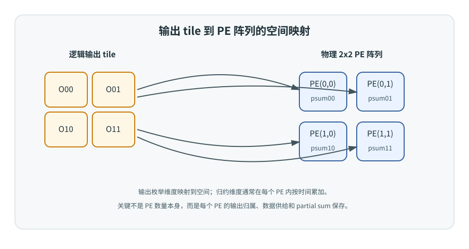
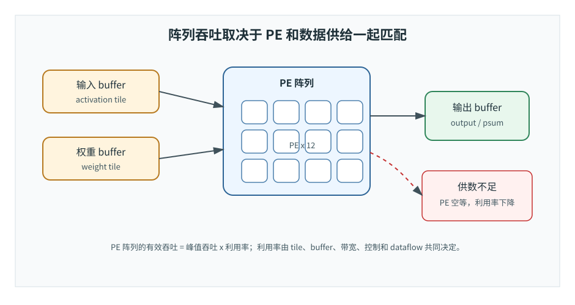
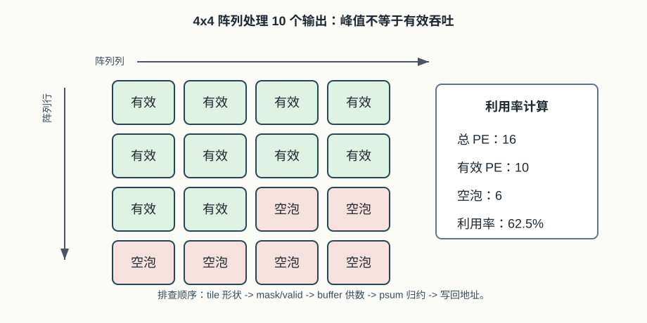

# 21 PE 阵列
> 章节等级：A
> 状态：重组候选
> 来源映射：`chapter_source_map.csv` 中的 21 章；本章主要承接 SRC01、SRC17，参考 SRC09。

## 本章知识全景图

### 1. 一眼看懂本章在讲什么

- 本章主题：说明 PE 阵列如何把可并行循环维度铺成空间计算，并暴露利用率和边界问题。
- 核心概念：PE array / spatial parallelism / broadcast / reduction / utilization / boundary bubble
- 逻辑主线：PE 阵列把许多 MAC 放到空间上同时执行，但阵列是否有效，取决于数据广播、psum 合并、边界 tile 和 dataflow 是否匹配。
- 最小学习路径：单 PE -> 多 PE 空间并行 -> 输出/通道/归约映射 -> 空泡和带宽判断。

### 2. 概念地图

| 概念层级 | 核心概念 | 前置知识 | 延伸到 NPU 的位置 |
| --- | --- | --- | --- |
| 阵列对象 | 二维 PE array | PE | 并行计算平面 |
| 映射维度 | OH/OW/OC/K | loop mapping | 哪些输出或归约同时算 |
| 数据通路 | broadcast、shift、reduce | dataflow | 输入/权重/psum 移动 |
| 效率判断 | utilization、bubble | tile 边界 | 实际吞吐偏离峰值的原因 |



### 3. 阅读顺序 / 处理顺序

- 先建立什么直觉：先把“PE阵列”落到一个可观察、可手算或可追踪的对象上。
- 再形式化什么定义或流程：围绕“PE 阵列是把可并行循环维度铺到空间”和“阵列效率由映射、边界、广播和收集共同决定”整理概念边界、输入输出和约束。
- 最后通过什么例子、操作或推导固化：用“用 2x2 PE 阵列同时计算四个输出位置”进入复现链，再回到 NPU 的 MAC、buffer、DMA、PE、编译器或 runtime 判断。
## 1. PE 阵列是把可并行循环维度铺到空间

阵列不是把 PE 堆起来就结束，而是把输出位置、输出通道或归约片段分配给不同 PE 同时做。

本章默认你已经掌握：

- MAC：`acc_next = acc + x*w`。
- PE：包含 MAC、寄存器、累加器、控制和端口的局部计算单元。
- partial sum：输出完成前的中间累加结果。
- loop-to-hardware mapping：循环维度可以映射到空间或时间。
- tile：大计算被切成能放进片上存储和阵列的小块。

本章不会深入讲片上 SRAM、DMA、地址发生器和控制器的实现细节。这些会在 23-25 章继续展开。本章只建立阵列层的骨架：PE 们排成什么形状、承担什么输出、怎样拿到数据、怎样保持忙碌。

继续用工厂类比。第 20 章里的 PE 是一个工位：工人、工具、托盘、半成品位置都在这个工位上。现在工厂要处理上千个相似零件，只靠一个工位太慢，于是把很多工位排成生产线或车间矩阵。

但把工位摆满车间还不够。还要安排：

- 哪个工位负责哪个零件。
- 原材料从哪条通道送到哪一排。
- 半成品是在工位旁边继续加工，还是送到中间仓库。
- 如果某批货只有 10 件，而车间有 16 个工位，多出来的工位怎么办。
- 如果某条通道送料太慢，工位是否会等料。

PE 阵列就是 NPU 里的这种车间。它的目标是让许多 PE 同时工作，但真正难的是“让它们有活干、有数据、不会算错归属”。这也是为什么 NPU 设计不能只说有多少 TOPS，还要看阵列组织和数据流。

## 2. 阵列效率由映射、边界、广播和收集共同决定

PE 数量越多，对输入/权重供给、psum 合并和边界 tile 填充的要求越高，空泡也越容易暴露。

一个 PE 阵列可以先理解成二维表格：

```text
PE(0,0)  PE(0,1)  PE(0,2) ...
PE(1,0)  PE(1,1)  PE(1,2) ...
PE(2,0)  PE(2,1)  PE(2,2) ...
```

二维阵列常见，因为神经网络计算也常常有二维或多维结构：输出空间有高和宽，矩阵乘有行和列，卷积有输出通道和输出位置。阵列的行列可以映射到不同循环维度。例如：

| 阵列行/列映射 | 适合场景 | 复用直觉 |
| --- | --- | --- |
| 行映射 `oh`，列映射 `ow` | 同一输出通道的一块空间 tile | 权重在多个空间位置复用，输入窗口有重叠 |
| 行映射 `oc`，列映射 `ow` | 多输出通道并行 | 输入在多个输出通道之间复用 |
| 行映射矩阵 A 的行，列映射矩阵 B 的列 | GEMM | A 行和 B 列在阵列中复用 |
| 行列只作为物理 PE 编号，由编译器任意绑定 | 可重构或通用阵列 | 灵活但控制和互连更复杂 |

阵列组织的第一层问题是“谁算什么”。第二层问题是“数据怎么到”。如果 16 个 PE 同时做 16 次 MAC，每周期可能需要 16 个输入和 16 个权重，甚至还要读写 16 个部分和。若数据供给不足，阵列就不能满速。

阵列组织的第三层问题是“部分和归属”。如果每个 PE 负责一个输出，部分和可以留在本地；如果多个 PE 协作同一个输出，就要把多个局部部分和归约合并。这个选择会改变数据流、互连和控制复杂度。



在本书中，**PE 阵列（PE array）** 指由多个 Processing Element 按某种拓扑连接而成的并行计算结构。它用于把算子中的多个循环迭代映射为空间并行执行。

一个 PE 阵列至少可以从五个维度描述：

1. **阵列规模**：例如 4x4、16x16、128x128，表示可同时工作的 PE 数量。
2. **拓扑结构**：PE 如何连接，可能是二维网格、行列广播、树形归约、crossbar、NoC 或多个 cluster。
3. **数据分发方式**：输入、权重、指令、控制信号如何到达每个 PE。
4. **部分和处理方式**：部分和留在 PE、本地 buffer、阵列内部传递，还是跨 PE 归约。
5. **映射策略**：哪些循环维度映射到阵列行列，哪些留在时间上，哪些分 tile 执行。

阵列的理论峰值可以粗略写成：

```text
peak_MAC_per_cycle = PE_count * MAC_per_PE_per_cycle
```

例如一个 8x8 阵列、每个 PE 每周期 1 次 MAC：

```text
PE_count = 8 * 8 = 64
peak = 64 MAC/cycle
```

但真实有效吞吐要乘上利用率：

```text
effective_MAC_per_cycle = peak_MAC_per_cycle * utilization
```

利用率受很多因素影响：

- tile 形状是否能填满阵列。
- 数据带宽是否足够。
- PE 是否等待 partial sum 或同步。
- 边界输出是否不足一个完整 tile。
- 某些算子是否不适合当前阵列形状。

因此，PE 阵列的正式理解不是“PE 越多越好”，而是“把 PE 数量、拓扑、数据流和 workload shape 匹配起来”。

## 3. 用 2x2 PE 阵列同时计算四个输出位置

假设有一个 2x2 PE 阵列，要计算 4 个独立输出：

```text
out00  out01
out10  out11
```

每个输出只需要 2 次 MAC。我们把 4 个输出直接映射到 4 个 PE：

```text
PE(0,0) -> out00
PE(0,1) -> out01
PE(1,0) -> out10
PE(1,1) -> out11
```

假设每个输出的两次乘积如下：

| 输出 | 第 1 个乘积 | 第 2 个乘积 | 最终输出 |
| --- | ---: | ---: | ---: |
| out00 | 3 | 5 | 8 |
| out01 | 4 | 2 | 6 |
| out10 | 1 | 7 | 8 |
| out11 | 6 | 6 | 12 |

阵列执行过程：

| 周期 | PE(0,0) acc | PE(0,1) acc | PE(1,0) acc | PE(1,1) acc |
| --- | ---: | ---: | ---: | ---: |
| 初始化 | 0 | 0 | 0 | 0 |
| 1 | 3 | 4 | 1 | 6 |
| 2 | 8 | 6 | 8 | 12 |

理想情况下，4 个输出 2 个周期完成。如果用 1 个 PE 顺序做，需要：

```text
4 个输出 * 2 次 MAC = 8 个 MAC 周期
```

2x2 阵列把空间并行度提高了 4 倍。但这个理想成立有前提：每个周期必须同时给 4 个 PE 准备好各自乘积需要的输入和权重。否则某些 PE 会等待，表里的并行就只是纸面并行。

现在用一个 2x2 PE 阵列计算单通道 2x2 卷积输出。输入是 3x3，卷积核是 2x2，stride=1，无 padding。

输入：

```text
I =
1 2 0
3 1 2
0 1 4
```

卷积核：

```text
K =
1 0
2 1
```

输出大小是 2x2：

```text
O00  O01
O10  O11
```

### 第一步：空间映射

把 4 个输出位置映射到 4 个 PE：

```text
PE(0,0) -> O00
PE(0,1) -> O01
PE(1,0) -> O10
PE(1,1) -> O11
```

每个 PE 负责一个输出位置，内部累加器保存该输出的 partial sum。

### 第二步：分别列出窗口

`O00` 对应窗口：

```text
1 2
3 1
```

`O01` 对应窗口：

```text
2 0
1 2
```

`O10` 对应窗口：

```text
3 1
0 1
```

`O11` 对应窗口：

```text
1 2
1 4
```

### 第三步：每个 PE 手算

`PE(0,0)`：

```text
O00 = 1*1 + 2*0 + 3*2 + 1*1
    = 1 + 0 + 6 + 1
    = 8
```

`PE(0,1)`：

```text
O01 = 2*1 + 0*0 + 1*2 + 2*1
    = 2 + 0 + 2 + 2
    = 6
```

`PE(1,0)`：

```text
O10 = 3*1 + 1*0 + 0*2 + 1*1
    = 3 + 0 + 0 + 1
    = 4
```

`PE(1,1)`：

```text
O11 = 1*1 + 2*0 + 1*2 + 4*1
    = 1 + 0 + 2 + 4
    = 7
```

所以输出为：

```text
O =
8 6
4 7
```

### 第四步：看阵列里的 partial sum

如果 4 个 PE 同步执行 4 个核位置，部分和可以这样变化：

| 核位置 | PE(0,0) | PE(0,1) | PE(1,0) | PE(1,1) |
| --- | ---: | ---: | ---: | ---: |
| 初始化 | 0 | 0 | 0 | 0 |
| K(0,0)=1 | 1 | 2 | 3 | 1 |
| K(0,1)=0 | 1 | 2 | 3 | 1 |
| K(1,0)=2 | 7 | 4 | 3 | 3 |
| K(1,1)=1 | 8 | 6 | 4 | 7 |

这张表体现了 PE 阵列的核心：每个 PE 都执行同一种 MAC 节拍，但每个 PE 的输入窗口不同、部分和不同、输出归属不同。

### 第五步：看数据复用

这个例子中，卷积核 `K` 对 4 个输出位置完全相同，因此权重可以广播给 4 个 PE。输入窗口之间也有重叠，例如 `I[1][1]=1` 同时参与 4 个输出窗口。如果输入 tile 放在片上 buffer 中，地址发生器可以让不同 PE 读取不同偏移，而不是每个 PE 都从外部内存重新搬一份。

这就是 PE 阵列组织的意义：不是让 4 个 PE 各算各的孤岛，而是让它们共享输入、共享权重流、分别保存 partial sum，并最终生成一块输出 tile。

### 例题 2：边界 tile 如何制造空泡

假设阵列是 `4x4`，共有 16 个 PE。现在某一层最后一个输出 tile 只有 10 个有效输出。若仍按“一个 PE 负责一个输出”映射，最多只能让 10 个 PE 有工作：

```text
利用率 = 有效 PE / 总 PE = 10 / 16 = 62.5%
```

空间分布可以画成：

```text
有效 有效 有效 有效
有效 有效 有效 有效
有效 有效 空泡 空泡
空泡 空泡 空泡 空泡
```

空泡不是 PE 坏了，而是 workload shape 和阵列形状不整除。工程上常见处理方式有三类：

- 让空 PE 闲置，用 mask 或 valid 位禁止写回，控制简单但利用率下降。
- 合并多个小 tile 或多个 batch，让阵列填得更满，但需要更复杂调度。
- 改变 tile 形状，把 `oc/oh/ow` 的映射重新组合，但可能增加 buffer 压力。

这说明 PE 阵列性能不能只看峰值。峰值是 `PE_count * MAC_per_PE`，实际有效吞吐还要乘以边界、供数、同步和算子形状带来的利用率。



## 4. PE 阵列如何承接 dataflow、psum 和带宽

真实 NPU 的 PE 阵列通常和四类硬件紧密配合。

第一类是片上 buffer。阵列很快，外部内存相对慢，所以输入 tile、权重 tile、输出 partial sum 通常先搬到片上。PE 阵列从片上 buffer 获得连续供数，而不是每次 MAC 都去外部内存。

第二类是数据分发网络。常见方式包括：

- 行广播：同一行 PE 接收相同输入或权重。
- 列广播：同一列 PE 接收相同输入或权重。
- multicast：一份数据送到多个目标 PE。
- 相邻传递：数据从一个 PE 传到下一个 PE。
- 归约网络：多个 PE 的局部部分和合并。

第三类是控制器和地址发生器。控制器负责告诉阵列当前在算哪个 tile、归约循环到哪一步、哪些 PE 有效、什么时候写回。地址发生器负责把逻辑索引 `oc/oh/ow/ic/r/s` 变成 buffer 地址。没有这些控制，阵列无法知道每个 PE 应该读哪一份数据。

第四类是性能监控和调度策略。阵列的瓶颈常常来自利用率：

```text
有效吞吐 = PE 数量 * 每 PE MAC/cycle * 利用率
```

如果 tile 只有 10 个输出，却用 16 个 PE 执行，至少有 6 个 PE 会空闲。若输入和权重送不及，更多 PE 会空等。若某些输出需要更多归约项，阵列可能要等待最慢的 PE 完成。因此，编译器和 runtime 会选择 tile 形状、循环顺序和 dataflow，让阵列尽量满、数据尽量复用、部分和尽量少写回。

本章还没有讲脉动阵列的严格节拍。你现在只需要知道：脉动阵列是 PE 阵列的一种重要实现，它让数据按固定方向一拍一拍流过相邻 PE。一般 PE 阵列也可以用广播、共享 buffer、树形归约等方式组织，不一定都是脉动。

### 为什么学

PE 阵列是“循环映射到硬件”的第一层空间化结果。第 20 章只解释了一个 PE 如何算一个输出的一部分；真实 NPU 要让很多输出、很多通道或很多矩阵元素同时推进，就必须把循环维度分配给一片阵列。不会分析 PE 阵列，后面看脉动阵列、片上 SRAM bank、DMA 双缓冲时会缺一条主线：所有搬运和存储设计最终都在服务阵列利用率。

本章不是为了背“二维阵列很快”，而是建立一套读图方法：阵列行列映射到哪个循环维度，哪些数据被广播，哪些数据被转发，partial sum 是本地保存还是跨 PE 归约，边界 tile 会产生多少空泡。

### 工程判断

什么时候使用 PE 阵列视角：当你要判断一层卷积或 GEMM 是否能填满硬件、tile 形状是否合适、输入/权重是否值得广播、partial sum 是否需要跨 PE 合并时，就应该先画 PE 阵列映射。阵列视角能把“循环维度”翻译成“哪些 PE 同时工作”。

什么时候不要只看 PE 阵列：如果瓶颈来自外部内存、DMA 描述符、runtime 排队、算子 fallback 或 layout transform，阵列映射只是中间环节。阵列没有数据时会空等，但根因可能在第 23-24 章的 buffer/DMA，也可能在第 30-32 章的编译器和 runtime。

失败信号可以按四步排查。第一看利用率：profile 显示 PE active 比例低，先检查 tile 是否小于阵列或边界空泡过多。第二看供数：PE 等待输入或权重，检查 SRAM 端口、bank 和 DMA 是否能满足每周期需求。第三看归约：多个 PE 分摊同一输出时，检查局部 psum 是否被正确合并。第四看写回：输出地址错位或重复写，通常是阵列逻辑坐标到内存地址的映射有误。

## 5. 常见误区与判断线索

### 误区 1：PE 阵列就是 PE 数量越多越好

- 错误说法：只要把 PE 堆多，NPU 一定更快。
- 为什么错：PE 需要数据、控制和写回通道。带宽不足或 tile 不匹配时，PE 会空闲。
- 正确理解：阵列规模必须和 buffer 容量、DMA 带宽、dataflow 和 workload shape 匹配。
- 工程后果：阵列过大会增加面积和瞬时供数需求，实际可能大量 PE idle，甚至让功耗上升而延迟不降。
- 判断线索：看 PE utilization、DMA wait、SRAM 端口占用和边界 tile 空洞；这些指标不随 PE 增加改善时，瓶颈不在阵列规模。

### 误区 2：二维阵列只能映射二维输出空间

- 错误说法：阵列行列只能对应图像的高和宽。
- 为什么错：行列也可以映射输出通道、矩阵行列、batch、或者被编译器抽象成逻辑维度。
- 正确理解：阵列是物理二维，映射维度是设计选择，不是固定规定。
- 工程后果：固定映射到 `H/W` 会限制编译器调度，遇到 1x1、GEMM、MLP 或小空间大通道层时阵列可能填不满。
- 判断线索：查看 mapping 表时应标出阵列行列分别对应 `M/N/K`、`oc/oh/ow` 或其他逻辑维；没有映射说明的阵列图不具备工程结论。

### 误区 3：所有 PE 必须同时做完全相同的数据

- 错误说法：阵列里每个 PE 每周期拿到的数据都一样。
- 为什么错：PE 可能执行同一类操作，但操作数不同、输出归属不同、部分和不同。
- 正确理解：阵列常常同步执行相似节拍，但每个 PE 负责不同数据位置或不同输出。
- 工程后果：误以为操作数相同会错设广播和部分和归属，导致多个 PE 写同一输出或不同输出拿到同一权重/输入组合。
- 判断线索：同一周期看 PE trace，应看到相同节拍下的不同坐标、不同权重或不同 psum owner；若全部完全相同，通常不是有效并行。

### 误区 4：部分和一定只留在单个 PE 内

- 错误说法：一个输出永远由一个 PE 从头算到尾。
- 为什么错：为了提高并行度，归约维度也可能拆给多个 PE，之后需要合并局部部分和。
- 正确理解：部分和可以本地保存，也可以跨 PE 归约，取决于 mapping 和 dataflow。
- 工程后果：归约拆分却没有合并路径，会得到多个半成品；合并路径带宽不足，又会让阵列等待规约结果。
- 判断线索：如果 `K/ic` 维被分配给多个 PE，必须看到 reduce tree、psum buffer merge 或明确的写回合并流程。

### 误区 5：阵列峰值就是真实性能

- 错误说法：一个 256 PE 阵列每周期 256 MAC，所以任何模型都能达到这个速度。
- 为什么错：边界 tile、带宽、控制同步、非 MAC 算子、数据 layout 都会降低利用率。
- 正确理解：峰值只是上限，真实吞吐要看阵列利用率和数据供给。
- 工程后果：用峰值直接估算整网延迟会严重乐观，实际部署还会被小 tile、算子切换、layout 转换和后处理拖慢。
- 判断线索：报告性能时同时给 peak MAC/cycle、effective MAC/cycle、utilization 和 stalls；只给峰值不够判断真实吞吐。

## 6. 最后速记

### 本章最该记住的结论

- PE 阵列的价值在空间并行，前提是循环中存在足够可并行工作。
- 阵列映射要说明每个 PE 算什么、数据怎么来、psum 怎么留或合并。
- 边界 tile 和不整除 shape 会制造空泡，使实际利用率低于峰值。
- 评价阵列不能只数 PE，还要数供数带宽、局部存储、互连和写回路径。

### 复现 / 复习清单

完成本章后应能做到：

- 用一句话解释 PE 阵列：它是把多个 PE 组织成空间并行结构的计算核心。
- 区分单个 PE 的能力和 PE 阵列的整体能力。
- 把一个 2x2 输出 tile 映射到 2x2 PE 阵列，并手算每个 PE 的部分和。
- 说明 PE 阵列组织至少要考虑拓扑、数据分发、部分和归属、控制和利用率。
- 解释为什么阵列峰值 MAC/cycle 不等于真实有效吞吐。
- 说清 PE 阵列和下一章脉动阵列的边界：前者是一般组织，后者是特定数据流组织。

### 自测题

### 题目

1. 什么是 PE 阵列？
2. 一个 4x4 PE 阵列，每个 PE 每周期 1 MAC，峰值是多少 MAC/cycle？
3. 为什么峰值 MAC/cycle 不等于有效 MAC/cycle？
4. PE 阵列的行列可以映射到哪些循环维度？
5. 在阵列演算中，`K` 为什么适合广播给 4 个 PE？
6. 为什么每个 PE 要维护自己的 partial sum？
7. 如果一个 tile 只有 6 个输出，却用 8 个 PE 同时处理，至少会有什么问题？
8. 数据分发网络可以有哪些形式？
9. PE 阵列和脉动阵列是什么关系？
10. 设计 PE 阵列时为什么要同时考虑 buffer？

### 答案或评分点

1. PE 阵列是多个 PE 按规则拓扑组织成的空间并行计算结构。
2. `4*4=16 MAC/cycle`。
3. 真实执行还受数据供给、tile 形状、同步、部分和归约和非 MAC 操作影响。
4. 可以映射 `oh/ow`、`oc`、矩阵行列、batch 或编译器选择的逻辑维度。
5. 同一个卷积核应用到多个输出位置，4 个 PE 都需要相同权重。
6. 每个 PE 负责不同输出，partial sum 归属不同，不能混在一起。
7. 至少有 2 个 PE 没有输出可算，阵列利用率下降。
8. 行广播、列广播、multicast、相邻传递、crossbar、NoC、归约网络等。
9. 脉动阵列是 PE 阵列的一种特定数据流组织，数据按固定节拍在相邻 PE 间流动。
10. 阵列吞吐很高，若 buffer 无法提供足够输入、权重和部分和，PE 会等待数据。

## 来源与核对

- 本地来源 SRC01：`C:\Users\11035\Desktop\ic\npu\14、NPU\《NPU Andes NPU IP核设计从入门到精通》\01.html`，行 216/247 支撑 PE、定制化数据流和可扩展并行单元；用于本章 PE 阵列规模和可配置性的解释。
- 本地来源 SRC17：`C:\Users\11035\Desktop\ic\npu\14、NPU\《NPU硬件循环与数据流架构从入门到精通》\01.html`，行 287-305 支撑脉动阵列、数据流架构和 PE 网格；用于本章区分一般 PE 阵列和下一章脉动阵列。
- 本地来源 SRC12：`C:\Users\11035\Desktop\ic\npu\14、NPU\《NPU内存带宽与DMA优化从入门到精通》\02.html`，行 213-221/363-385 支撑计算单元阵列、片上 SRAM/缓存、DMA 与双缓冲；用于说明阵列吞吐必须由 buffer 和 DMA 供数支撑。
- 外部来源 Eyeriss：`Eyeriss: An Energy-Efficient Reconfigurable Accelerator for Deep Convolutional Neural Networks`，https://arxiv.org/abs/1604.07316 ，支撑 PE array、dataflow、psum 和片上层级之间的关系。
- 外部来源 Google TPU：Norman P. Jouppi 等，`In-Datacenter Performance Analysis of a Tensor Processing Unit`，https://arxiv.org/abs/1704.04760 ，支撑矩阵乘阵列、峰值吞吐、利用率和片上 buffer 的系统语境。
- 外部来源 Gemmini：`Gemmini: Enabling Systematic Deep-Learning Architecture Evaluation via Full-Stack Integration`，https://arxiv.org/abs/1911.09925 ，支撑可配置 systolic array、scratchpad/accumulator 和 SoC 集成视角。
