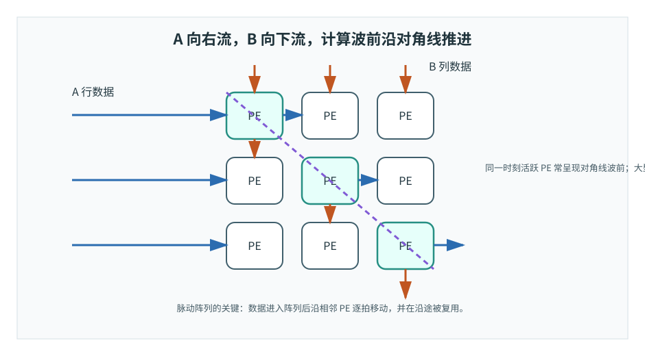
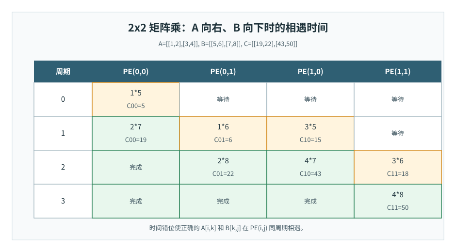
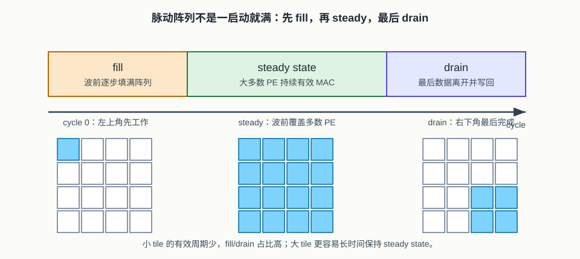

# 22 脉动阵列
> 章节等级：A
> 状态：重组候选
> 来源映射：`chapter_source_map.csv` 中的 22 章；本章主要承接 SRC01、SRC17，参考 SRC03。

## 本章知识全景图

### 1. 一眼看懂本章在讲什么

- 本章主题：把脉动阵列理解成有节拍的数据传递、局部 MAC 和时间错位。
- 核心概念：systolic array / pipeline / fill / steady / drain / wavefront / GEMM
- 逻辑主线：脉动阵列通过固定节拍让输入和权重在相邻 PE 间流动，减少长距离搬运，但需要付出填充、排空和形状适配成本。
- 最小学习路径：相邻 PE 传递 -> 时间错位 -> fill/steady/drain -> GEMM 适配与算子边界。

### 2. 概念地图

| 概念层级 | 核心概念 | 前置知识 | 延伸到 NPU 的位置 |
| --- | --- | --- | --- |
| 节拍机制 | systolic movement | PE array | 相邻 PE 间传数 |
| 流水阶段 | fill、steady、drain | pipeline | 有效周期和空泡 |
| 典型负载 | GEMM/matmul | 矩阵乘 | NPU 矩阵引擎 |
| 边界代价 | shape padding、control | tile | 阵列利用率和适配成本 |



### 3. 阅读顺序 / 处理顺序

- 先建立什么直觉：先把“脉动阵列”落到一个可观察、可手算或可追踪的对象上。
- 再形式化什么定义或流程：围绕“脉动阵列用时间错位让数据在邻近 PE 间流动”和“fill、steady 和 drain 决定有效吞吐和空泡”整理概念边界、输入输出和约束。
- 最后通过什么例子、操作或推导固化：用“用 2x2 矩阵乘追踪脉动阵列周期”进入复现链，再回到 NPU 的 MAC、buffer、DMA、PE、编译器或 runtime 判断。
## 1. 脉动阵列用时间错位让数据在邻近 PE 间流动

脉动阵列的关键不是 PE 排成二维，而是数据按固定节拍穿过阵列，每个 PE 在正确周期做局部 MAC。

本章需要你已经理解：

- PE 内部有 MAC、累加器和相邻通信端口。
- PE 阵列可以把输出行列或输出空间映射到多个 PE。
- GEMM 或矩阵乘中的一个输出是点积。
- partial sum 是多个乘积尚未累完时的中间值。
- dataflow 决定输入、权重、部分和谁流动、谁停留、谁复用。

本章会使用矩阵乘法 `C = A * B` 作为例子。这里不要求你熟练线性代数，只要记住：

```text
C[i][j] = sum over k of A[i][k] * B[k][j]
```

脉动阵列要做的，就是让 `A[i][k]` 和 `B[k][j]` 在 PE(i,j) 的某个周期相遇，并把乘积加到 `C[i][j]` 的部分和上。

“脉动”这个词来自心脏节拍。想象一排排工位，每个工位都不去远处仓库取料，而是接收左边和上边传来的材料。每个节拍，材料往右和往下移动一格；每个工位拿到当前两份材料后加工一次，然后继续把材料传给下一个工位。

这种组织有一个好处：材料一旦进入车间，就能沿途被多个工位使用。它不需要一个巨大的中央调度员每一拍把所有材料分别送到所有工位，也不需要每个工位都直接访问远处仓库。数据像流水线上的物品一样移动，工位只和邻居打交道。

NPU 脉动阵列也是这样。PE 不需要和所有 PE 全连接，通常只需要和相邻 PE 连接。A 数据沿行方向流，B 数据沿列方向流，或者某类数据停在本地，另一类数据流过。每个 PE 的动作很简单，但整个阵列在节拍配合下可以持续产生大量 MAC。

## 2. fill、steady 和 drain 决定有效吞吐和空泡

阵列刚开始要填充，结束要排空，中间 steady 才接近峰值；小 tile 或不规则 shape 会放大这些开销。

脉动阵列有四个直觉关键词。

第一是**规则排列**。PE 通常按二维网格排布，连接模式高度重复。重复结构便于硬件实现，也便于把矩阵乘或卷积 tile 映射到阵列。

第二是**相邻传递**。数据不是每次都从全局 buffer 分发到每个 PE，而是在 PE 之间按方向传递。例如 A 从左往右走，B 从上往下走。每走过一个 PE，就有机会被使用一次。

第三是**固定节拍**。每个时钟周期，PE 接收、计算、转发。就像心跳一样，阵列中有一个规律的节奏。只要输入按正确时间进入，计算会自然沿着阵列推进。

第四是**时间错位**。如果所有 A 和 B 都同时进入阵列，它们不一定在正确 PE 相遇。为了让 `A[i][k]` 和 `B[k][j]` 在 PE(i,j) 同一周期到达，边界注入通常要做 skew，也就是不同的行列延迟不同拍。

这就是脉动阵列比普通 PE 阵列多出来的核心：它不仅规定“哪些 PE 算哪些输出”，还规定“数据以什么方向、什么节拍、什么时间差穿过阵列”。



在本书中，**脉动阵列（systolic array）** 指一种规则互连的 PE 阵列，其中数据从阵列边界按固定节拍注入，在相邻 PE 之间同步传递，每个 PE 基于本地到达的数据执行计算，并将数据或部分和继续传递或保存在本地。

它通常具有以下特征：

1. **局部互连**：PE 主要和相邻 PE 通信，减少全局布线。
2. **节拍同步**：所有 PE 在统一时钟或受控节拍下推进。
3. **数据复用**：数据在穿过阵列时被多个 PE 使用。
4. **规则拓扑**：常见为二维网格，便于映射矩阵乘和卷积 tile。
5. **边界注入与错位**：输入数据从边界进入，并按时间偏移使相关操作数在正确位置相遇。

以矩阵乘为例，常见数据流可以写成：

```text
A 的元素沿行方向向右流动。
B 的元素沿列方向向下流动。
PE(i,j) 累加 C[i][j] 的 partial sum。
```

每个 PE 的局部动作仍然是：

```text
acc[i][j] = acc[i][j] + A[i][k] * B[k][j]
```

但和普通阵列不同的是，`A[i][k]` 和 `B[k][j]` 不是由全局网络每次点对点送达，而是沿阵列逐拍传播。这个传播过程带来两个效果：

- 同一个 A 元素经过一行中的多个 PE，被多个输出列使用。
- 同一个 B 元素经过一列中的多个 PE，被多个输出行使用。

边界也要说清：

- 并不是所有 PE 阵列都是脉动阵列。只把 PE 排成网格，但数据不按固定节拍相邻传递，就不能简单叫脉动。
- 脉动阵列也不只一种。不同设计可以让输入、权重、部分和以不同方向流动，或者让某类数据 stationary。
- 脉动阵列很适合规则密集计算，但面对不规则稀疏、复杂控制或小尺寸边界 tile，利用率可能下降。

## 3. 用 2x2 矩阵乘追踪脉动阵列周期

先看一个一行两列的简化脉动链。两个 PE 排成一行：

```text
PE0 -> PE1
```

输入 `a` 从左向右流动。假设 `PE0` 和 `PE1` 各自保存一个权重：

```text
PE0.w = 2
PE1.w = 3
```

输入流是：

```text
a0 = 5
a1 = 7
```

每个周期，PE 做一次 MAC，并把 `a` 传给右边：

| 周期 | PE0 看到的 a | PE0 acc | PE1 看到的 a | PE1 acc |
| --- | ---: | ---: | ---: | ---: |
| 初始化 | - | 0 | - | 0 |
| 1 | 5 | 0 + 5*2 = 10 | - | 0 |
| 2 | 7 | 10 + 7*2 = 24 | 5 | 0 + 5*3 = 15 |
| 3 | - | 24 | 7 | 15 + 7*3 = 36 |

最终：

```text
PE0.acc = 24
PE1.acc = 36
```

这个例子很小，但已经有脉动味道：`a0=5` 先被 PE0 用，再被 PE1 用；`a1=7` 也沿同一路径向右移动。同一个数据进入阵列后被多个 PE 顺路使用，而不是从外部内存分别读两次。

现在手算一个 2x2 矩阵乘法：

```text
A =
1 2
3 4

B =
5 6
7 8
```

输出：

```text
C = A * B
```

我们用 2x2 脉动阵列：

```text
PE(0,0)  PE(0,1)
PE(1,0)  PE(1,1)
```

每个 PE 负责一个输出：

```text
PE(0,0) -> C00
PE(0,1) -> C01
PE(1,0) -> C10
PE(1,1) -> C11
```

数学结果先写出来：

```text
C00 = 1*5 + 2*7 = 19
C01 = 1*6 + 2*8 = 22
C10 = 3*5 + 4*7 = 43
C11 = 3*6 + 4*8 = 50
```

脉动数据流采用：

```text
A 元素从左向右流。
B 元素从上向下流。
每个 PE 在本地累加自己的 Cij。
```

为了让正确的 `A[i][k]` 和 `B[k][j]` 相遇，需要时间错位。下面按周期列出关键相遇。

### 周期 0

`PE(0,0)` 接收 `A00=1` 和 `B00=5`：

```text
C00_psum = 0 + 1*5 = 5
```

### 周期 1

`PE(0,0)` 接收 `A01=2` 和 `B10=7`：

```text
C00_psum = 5 + 2*7 = 19
```

`PE(0,1)` 接收从左边来的 `A00=1` 和从上边来的 `B01=6`：

```text
C01_psum = 0 + 1*6 = 6
```

`PE(1,0)` 接收从左边来的 `A10=3` 和从上边来的 `B00=5`：

```text
C10_psum = 0 + 3*5 = 15
```

### 周期 2

`PE(0,1)` 接收 `A01=2` 和 `B11=8`：

```text
C01_psum = 6 + 2*8 = 22
```

`PE(1,0)` 接收 `A11=4` 和 `B10=7`：

```text
C10_psum = 15 + 4*7 = 43
```

`PE(1,1)` 接收 `A10=3` 和 `B01=6`：

```text
C11_psum = 0 + 3*6 = 18
```

### 周期 3

`PE(1,1)` 接收 `A11=4` 和 `B11=8`：

```text
C11_psum = 18 + 4*8 = 50
```

完整结果：

```text
C =
19 22
43 50
```

把相遇表合在一起看：

| 周期 | PE(0,0) | PE(0,1) | PE(1,0) | PE(1,1) |
| --- | --- | --- | --- | --- |
| 0 | `1*5 -> 5` | - | - | - |
| 1 | `2*7 -> 19` | `1*6 -> 6` | `3*5 -> 15` | - |
| 2 | 完成 | `2*8 -> 22` | `4*7 -> 43` | `3*6 -> 18` |
| 3 | 完成 | 完成 | 完成 | `4*8 -> 50` |

这里最重要的不是 2x2 的答案，而是波前结构。开始时只有左上角 PE 工作；随后计算波前扩散到右边和下边；最后右下角 PE 完成。大型脉动阵列也是类似规律，只是填满阵列需要更多启动周期，稳定后可以每周期保持大量 PE 工作。

### 例题 2：fill、steady、drain 的周期账

假设有一个 `4x4` 脉动阵列做一个 `4x4 x 4x4` 的矩阵乘 tile。为简化，只看一个输出 tile 的脉动过程。阵列左上角最早开始工作，右下角最晚拿到第一对有效数据。对于 A 向右、B 向下流的二维阵列，波前从左上角走到右下角至少需要：

```text
fill latency = (阵列行数 - 1) + (阵列列数 - 1)
             = 3 + 3
             = 6 cycles
```

每个输出还要沿归约维度做 `K=4` 次 MAC。若忽略边界控制开销，一个输出 tile 从第一拍注入到最后一个 PE 完成，大致包含：

```text
fill  : 前 6 拍逐步填满阵列
steady: 中间 K 拍附近持续产生有效 MAC
drain : 最后一批数据离开阵列并完成右下角输出
```

这个账说明两个工程事实。第一，小 tile 会被 fill/drain 吃掉很多比例；阵列还没完全热起来，任务就结束了。第二，大 tile 更容易进入 steady state，让多数 PE 长时间有活干。脉动阵列高吞吐的前提不是“启动就满”，而是“有足够规则、足够大的 tile 让波前持续流动”。



## 4. 脉动阵列适合规则 GEMM，但有控制和算子边界

脉动阵列常用于 NPU 的矩阵乘和卷积核心，因为这些计算有三个适合它的特征。

第一，计算规则。GEMM 和卷积展开后的矩阵乘都由大量重复 MAC 组成，适合映射到规则 PE 网格。

第二，复用明显。矩阵 A 的一个元素会用于多个输出列，矩阵 B 的一个元素会用于多个输出行。让它们在阵列中流动，可以减少从全局 buffer 重复读取。

第三，局部互连友好。每个 PE 只把数据传给相邻 PE，避免了所有 PE 都直接连接到所有数据源的复杂布线。阵列越大，局部互连越重要。

但脉动阵列也有代价：

- 需要精确的边界注入和时间错位。
- 启动和排空阵列有 latency，小 tile 可能利用率不高。
- 不规则 shape、稀疏计算或复杂控制可能难以填满阵列。
- 需要 buffer 和 DMA 按节拍提供连续数据，否则脉动会断流。

在 NPU 设计中，脉动阵列通常不是孤立存在的。它需要：

- 片上 SRAM 保存输入 tile、权重 tile 和输出 tile。
- 地址发生器按 skew 后的时序取数。
- 控制器配置阵列大小、数据方向、精度模式和写回时机。
- 编译器把卷积、GEMM 或全连接映射成适合阵列的 tile。

所以读到“某 NPU 使用 systolic array”时，不要只记一个名词。要继续追问：

```text
数据从哪里进？
A/B/psum 谁流动、谁停留？
如何做时间错位？
tile 太小时阵列利用率怎样？
结果从哪里出？
```

这些问题比单纯记住“脉动阵列很快”更接近工程设计。

### 为什么学

脉动阵列是很多 NPU 文档里最容易被误读的结构。它不是“二维 PE 阵列”的同义词，而是一个更严格的时序约定：数据从边界进入，按固定方向逐拍传给邻居，正确的操作数必须在正确 PE 的同一周期相遇。少了这个时序约定，阵列可以很大，但不会自然产生高吞吐。

本章解决一个具体学习断点：为什么同样是矩阵乘，普通代码只写三重循环，而硬件里必须关心 skew、pipeline fill、steady state 和 drain。这个断点打通后，后面才能理解片上 SRAM 为什么要按节拍供数，DMA 为什么要提前预取，编译器为什么要把 tile 调成适合阵列波前的形状。

### 工程判断

什么时候适合脉动阵列：计算是规则密集 MAC，数据复用方向清楚，tile 足够大，边界供数能按固定节拍持续输入。典型例子是 GEMM、全连接、大块卷积转矩阵乘，或者能由编译器规整成矩阵 tile 的卷积。

什么时候不要强行使用脉动阵列：算子尺寸很小、稀疏不规则、控制分支多、数据依赖不规则，或者 layout 让 DMA 无法连续供数。此时阵列 fill/drain、mask、边界空泡和供数断流可能吞掉收益。

失败信号主要有五类。第一，结果错位：只有某些行列错误，常见原因是 skew 注入延迟算错。第二，边界错误：中间 tile 正确，最后一行/列错误，常见原因是 mask、drain 或写回时机不对。第三，吞吐不稳：profile 显示阵列周期性断流，常见原因是 SRAM/DMA 没按节拍供数。第四，小层效率低：大量周期花在 fill/drain 而不是 steady state。第五，数值归属错误：psum 被传错方向或被错误清零，导致输出混入相邻 PE 的部分和。

排查顺序应从 2x2 手算开始。先固定 A 向右、B 向下，列出每个周期每个 PE 看到的 A/B；再核对每个 PE 的 `acc` 生命周期；然后加入真实 tile 的 fill/drain；最后才上更大的阵列仿真。脉动阵列 debug 最怕只看最终矩阵，不看操作数相遇时刻。

## 5. 常见误区与判断线索

### 误区 1：脉动阵列就是任意二维 PE 阵列

- 错误说法：只要 PE 排成二维网格，就是脉动阵列。
- 为什么错：脉动阵列强调数据按固定节拍在相邻 PE 间传递。普通网格若依赖全局广播或随机访问，不一定是脉动。
- 正确理解：二维网格是形状，脉动是数据流和时序组织。
- 工程后果：把任意网格都叫脉动，会漏掉 skew、相邻传递和波前填充/排空成本，无法解释阵列启动延迟和利用率。
- 判断线索：如果数据不是按固定方向和节拍在邻居间移动，而是主要靠全局 crossbar 或随机 SRAM 访问，那就不能只凭二维形状称为脉动。

### 误区 2：脉动阵列不需要控制

- 错误说法：数据自己流动，所以控制器不重要。
- 为什么错：边界注入、时间错位、清零、写回、tile 切换都需要控制。
- 正确理解：脉动阵列内部 PE 动作简单，但外围控制和调度必须精确。
- 工程后果：控制错会让正确数据在错误周期相遇，或者部分和未清零、尾块未写回，输出直接错误。
- 判断线索：调试时看输入注入时间表、valid 波前、PE 清零周期和 drain/writeback 信号；这些缺失时脉动实现不可验证。

### 误区 3：所有数据都必须在阵列里流动

- 错误说法：只要是脉动阵列，输入、权重、部分和都必须流动。
- 为什么错：不同 systolic dataflow 可以让某类数据 stationary，让另一类数据流动。
- 正确理解：脉动强调节拍和相邻传递，具体流动对象取决于设计。
- 工程后果：误判谁流谁停会选错 buffer 和连线，可能让权重本该驻留却反复移动，或让部分和在阵列内无合适归属。
- 判断线索：阅读设计时明确 A、B、psum 各自方向和生命周期；如果只写“systolic”却不写数据方向，信息不够。

### 误区 4：脉动阵列适合所有算子

- 错误说法：有了脉动阵列，所有神经网络层都能高效运行。
- 为什么错：激活、池化、小尺寸算子、稀疏或控制不规则任务可能不能填满阵列。
- 正确理解：脉动阵列主要强在规则密集矩阵/卷积计算，系统仍需其他单元和调度策略。
- 工程后果：把所有算子硬塞进脉动阵列会造成利用率低、控制复杂、数据重排多，甚至不如专用小算子单元或 CPU 后处理。
- 判断线索：如果算子 MAC 密度低、shape 太小、稀疏不规则或主要是逐元素操作，就要检查是否应旁路脉动阵列。

### 误区 5：时间错位只是实现细节，不影响理解

- 错误说法：知道 A 向右、B 向下就够了，不用管什么时候进入。
- 为什么错：如果注入时间不对，正确的 A 和 B 不会在目标 PE 同周期相遇，结果就错。
- 正确理解：skew 是脉动阵列正确性的核心之一。
- 工程后果：skew 错会让乘积配对错误，结果不是微小误差，而是矩阵乘的项被错配。
- 判断线索：用 2x2 或 3x3 矩阵画周期表，确认 `A[i,k]` 和 `B[k,j]` 在 `PE(i,j)` 同周期相遇；对不上就先修注入时序。

## 6. 最后速记

### 本章最该记住的结论

- 脉动阵列是一种有方向、有节拍、有局部累加的数据流组织。
- 它能减少全局广播和长距离访存，但需要严格的时间对齐和边界处理。
- fill/steady/drain 是评估实际吞吐的必备周期账。
- 脉动阵列特别适合规则矩阵乘，不代表所有 NPU 算子都天然高效。

### 复现 / 复习清单

完成本章后应能做到：

- 准确定义脉动阵列，并说清它和一般 PE 阵列的区别。
- 解释“相邻传递、固定节拍、局部互连、数据复用”四个关键词。
- 用 2x2 矩阵乘手算 A 数据向右、B 数据向下流动时各 PE 的累加过程。
- 说明为什么脉动阵列需要对输入数据做时间错位注入。
- 判断一个结构是否只是“很多 PE”，还是满足脉动阵列的关键特征。
- 解释脉动阵列为什么适合 GEMM 和卷积转矩阵乘，也知道它不是所有算子的万能答案。

### 自测题

### 题目

1. 用一句话定义脉动阵列。
2. 脉动阵列和一般 PE 阵列的核心区别是什么？
3. 为什么脉动阵列强调相邻通信？
4. 什么是时间错位注入？
5. 在 2x2 周期演算中，`C00` 的结果是多少？
6. 在 2x2 周期演算中，`PE(1,1)` 为什么最晚完成？
7. A 数据向右流、B 数据向下流时，同一个 A 元素会被哪些方向上的 PE 复用？
8. 为什么小 tile 可能让脉动阵列利用率下降？
9. 脉动阵列适合哪类计算？
10. 读到某个 NPU 使用 systolic array 时，应追问哪些工程问题？

### 答案或评分点

1. 脉动阵列是数据按固定节拍在相邻 PE 间传递、PE 本地同步执行计算的规则阵列。
2. 一般 PE 阵列强调空间并行；脉动阵列还规定数据的节拍、方向和相邻传递。
3. 相邻通信减少全局互连和广播压力，让数据在阵列内顺路复用。
4. 不同行列的数据按不同周期进入阵列，使正确操作数在正确 PE 同周期相遇。
5. `C00 = 1*5 + 2*7 = 19`。
6. 它位于右下角，A 和 B 都要经过更多传递拍才到达。
7. 会沿同一行向右经过多个 PE，被多个输出列使用。
8. 阵列启动和排空需要周期，小 tile 不能长时间填满所有 PE。
9. 规则密集矩阵乘、GEMM、卷积转矩阵乘或能映射成规则 MAC tile 的计算。
10. 数据从哪里进、谁流动谁停留、如何 skew、tile 利用率怎样、结果从哪里出、buffer/DMA 能否持续供数。

## 来源与核对

- 本地来源 SRC17：`C:\Users\11035\Desktop\ic\npu\14、NPU\《NPU硬件循环与数据流架构从入门到精通》\01.html`，行 287-305 明确提到脉动阵列中数据在 PE 网格里按节奏流动并复用；支撑本章定义和波前直觉。
- 本地来源 SRC01：`C:\Users\11035\Desktop\ic\npu\14、NPU\《NPU Andes NPU IP核设计从入门到精通》\01.html`，行 216/247 支撑定制化数据流和可扩展 PE 配置；用于解释脉动阵列仍是 PE 阵列的一种具体组织。
- 本地来源 SRC12：`C:\Users\11035\Desktop\ic\npu\14、NPU\《NPU内存带宽与DMA优化从入门到精通》\01.html`，行 176-177/200-221 提到脉动阵列、层次化内存和专用 DMA；用于连接脉动阵列供数与后续 SRAM/DMA。
- 外部来源 H. T. Kung：`Why Systolic Architectures?` 文献信息与 DOI 入口，https://cir.nii.ac.jp/crid/1360855571261536896 ，支撑 systolic architecture 的历史定义、局部通信和 I/O 动机。
- 外部来源 Google TPU：Norman P. Jouppi 等，`In-Datacenter Performance Analysis of a Tensor Processing Unit`，https://arxiv.org/abs/1704.04760 ，支撑大规模矩阵乘单元、systolic array 和片上 buffer 实例。
- 外部来源 Gemmini：`Gemmini: Enabling Systematic Deep-Learning Architecture Evaluation via Full-Stack Integration`，https://arxiv.org/abs/1911.09925 ，支撑开源可配置脉动阵列、scratchpad/accumulator 与 SoC 集成。
