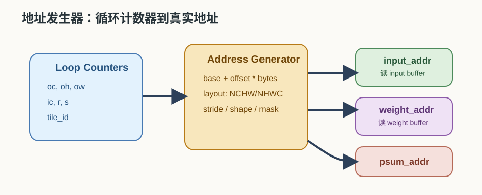
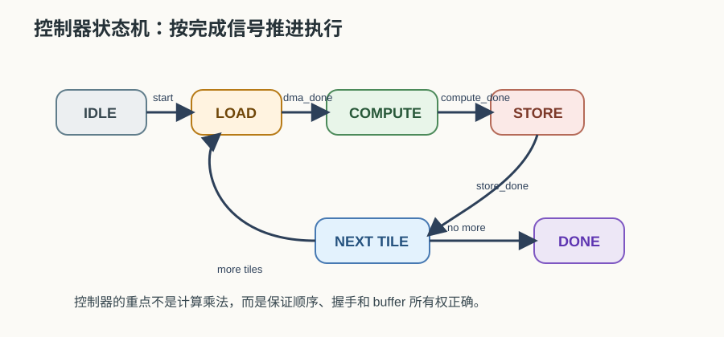
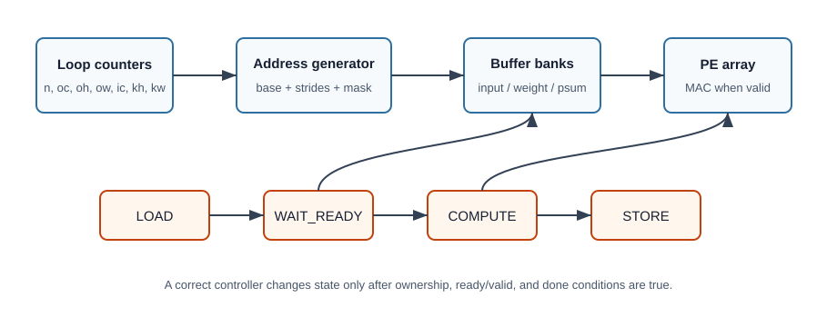

# 25 地址发生器与控制器

> 章节等级：B
> 状态：重组候选
> 来源映射：`chapter_source_map.csv` 中的 25 章；本章主要承接 SRC01、SRC12，参考 SRC17。

## 本章知识全景图

### 1. 一眼看懂本章在讲什么

- 本章主题：把地址发生器和控制器从“周边模块”写成执行循环、layout 和状态切换的核心。
- 核心概念：address generator / controller / FSM / stride / offset / loop counter / state
- 逻辑主线：地址发生器把 shape、layout 和 tile 翻成连续地址序列，控制器决定何时搬、何时算、何时写回；两者一起把算法变成可执行状态机。
- 最小学习路径：shape/layout -> 地址序列 -> 控制状态 -> DMA/PE 握手 -> 错误定位。

### 2. 概念地图

| 概念层级 | 核心概念 | 前置知识 | 延伸到 NPU 的位置 |
| --- | --- | --- | --- |
| 地址对象 | base、stride、offset | layout | 读写位置 |
| 控制对象 | FSM、loop counter | 执行阶段 | 搬运/计算/写回切换 |
| 生成目标 | 连续地址、块地址 | DMA | 高效搬运 |
| 调试对象 | 越界、错位、重复 | runtime | 地址和状态错误 |



### 3. 阅读顺序 / 处理顺序

- 先建立什么直觉：先把“地址发生器与控制器”落到一个可观察、可手算或可追踪的对象上。
- 再形式化什么定义或流程：围绕“地址发生器把 shape/layout/tile 翻成可执行地址序列”和“控制器决定何时搬、何时算、何时写回”整理概念边界、输入输出和约束。
- 最后通过什么例子、操作或推导固化：用“用 NCHW/NHWC 小张量复算地址生成”进入复现链，再回到 NPU 的 MAC、buffer、DMA、PE、编译器或 runtime 判断。
## 1. 地址发生器把 shape/layout/tile 翻成可执行地址序列

硬件不是读“第几个元素”这样的抽象概念，而是读基址、步长、偏移和块长组成的地址流。

本章需要你已经理解：

- 第 12 章的 layout：逻辑相邻不等于物理地址一定相邻。
- 第 19 章的循环映射：`oc/oh/ow/ic/r/s` 会决定访问顺序。
- 第 23 章的 buffer：地址最终会落到 input/weight/psum/output buffer。
- 第 24 章的 DMA 和双缓冲：控制器必须等搬运和计算状态正确后再切换。

本章会出现“状态机”这个词。零基础阶段你可以先把它理解成一个按条件跳转的流程图：现在在 LOAD，等 DMA 完成就去 COMPUTE；计算完成再去 STORE；所有 tile 完成就 DONE。

想象仓库里每个货架、每层、每个格子都有编号。搬运工如果只知道“去拿第 3 批货”，还不够；他必须知道第 3 批货在几号货架、几层、从第几个格子开始、每行隔多远。这个“把逻辑任务翻译成具体格子编号”的人，就像地址发生器。

另一边，仓库主管要安排流程：先让搬运工把货放到 A 区，再通知工人开始加工；加工没结束不能把 A 区覆盖；B 区准备好后再切换；全部做完后通知出库。这个主管就像控制器。

地址发生器回答“在哪里”，控制器回答“什么时候、谁能做、能不能切换”。

## 2. 控制器决定何时搬、何时算、何时写回

即使地址算对了，如果状态切换早了或晚了，PE 还是会等数据、写坏结果或覆盖 buffer。

地址发生器的输入通常不是一个个手写地址，而是一组规则：

```text
base address: 这块张量或 buffer 从哪里开始
layout      : NCHW、NHWC 或其他排列
strides     : 维度每加 1，线性地址增加多少
counters    : 当前循环走到 n/c/h/w/oc/ic/r/s 的哪一个值
element size: 每个元素占多少 byte
```

然后它输出真实地址：

```text
address = base + offset * element_size
```

这里的 offset 来自 layout 和 counters。例如 NCHW 中：

```text
offset = ((n*C + c)*H + h)*W + w
```

控制器则像执行计划的节拍器。它不会替 PE 做乘法，也不会替 DMA 搬每个 byte，但它会管理状态：

```text
IDLE -> LOAD -> COMPUTE -> STORE -> NEXT_TILE -> DONE
```

如果没有控制器，双缓冲就会很危险：DMA 可能覆盖 PE 还没读完的 buffer，PE 可能读取 DMA 尚未填满的数据，store 可能写回还没完成的 output。





**地址发生器（address generator）** 是根据循环计数、张量形状、layout、stride、base address 和数据宽度生成读写地址的硬件或硬件逻辑块。它可以服务：

- DMA 访问外部内存。
- PE 阵列访问片上 input/weight buffer。
- 部分和读改写地址。
- 输出写回地址。

一个简化地址公式是：

```text
addr = base + linear_offset(indexes, shape, layout) * bytes_per_element
```

对 NCHW 输入 `input[n][c][h][w]`：

```text
linear_offset = ((n*C + c)*H + h)*W + w
```

对 NHWC 输入 `input[n][h][w][c]`：

```text
linear_offset = ((n*H + h)*W + w)*C + c
```

**控制器（controller）** 是管理执行阶段和握手条件的逻辑。它通常包括：

- 当前状态寄存器。
- tile、通道、窗口等循环计数器。
- DMA 启动和完成检测。
- PE 启动、暂停和完成检测。
- buffer ownership 管理。
- 错误或边界条件处理。

控制器和地址发生器经常配合工作：控制器更新计数器和状态，地址发生器根据这些计数器给出本周期要访问的位置。

## 3. 用 NCHW/NHWC 小张量复算地址生成

先手算一个 NCHW 地址。假设输入张量：

```text
N=1, C=3, H=4, W=5
每个元素 1 byte
base = 1000
```

求：

```text
input[n=0][c=2][h=1][w=3]
```

NCHW 线性 offset：

```text
offset = ((n*C + c)*H + h)*W + w
```

代入：

```text
offset = ((0*3 + 2)*4 + 1)*5 + 3
       = (2*4 + 1)*5 + 3
       = 9*5 + 3
       = 48
```

真实 byte 地址：

```text
addr = base + offset * 1
     = 1000 + 48
     = 1048
```

这个例子说明：硬件不需要保存每个元素的地址表，只要保存 shape、layout、base 和当前 counters，就能算出地址。

现在手算一个 2 通道、2x2 卷积窗口的输入地址。假设：

```text
输入 layout: NCHW
N=1, C=2, H=5, W=5
每个元素 1 byte
base = 2000
卷积核 R=2, S=2
要计算输出位置 oh=1, ow=2
stride=1, padding=0
```

卷积窗口会访问：

```text
input[0][ic][oh+r][ow+s]
```

其中：

```text
ic = 0..1
r  = 0..1
s  = 0..1
```

### 通道 0

`ic=0`，窗口位置：

| r | s | h=oh+r | w=ow+s | offset | address |
| ---: | ---: | ---: | ---: | ---: | ---: |
| 0 | 0 | 1 | 2 | `((0*2+0)*5+1)*5+2 = 7` | 2007 |
| 0 | 1 | 1 | 3 | `8` | 2008 |
| 1 | 0 | 2 | 2 | `12` | 2012 |
| 1 | 1 | 2 | 3 | `13` | 2013 |

### 通道 1

`ic=1`，同样的空间位置，但通道偏移多了一个 `H*W = 25`：

| r | s | h=oh+r | w=ow+s | offset | address |
| ---: | ---: | ---: | ---: | ---: | ---: |
| 0 | 0 | 1 | 2 | `25 + 7 = 32` | 2032 |
| 0 | 1 | 1 | 3 | `33` | 2033 |
| 1 | 0 | 2 | 2 | `37` | 2037 |
| 1 | 1 | 2 | 3 | `38` | 2038 |

地址发生器要做的事，就是随着 `ic/r/s` 计数变化，按规则输出这些地址。它不“理解卷积”，但它理解 counters 和 stride。

再把控制器放进来。一个简化状态流程是：

```text
IDLE:
  等待 start
LOAD:
  启动 DMA，把当前 tile 搬到 input/weight buffer
  等 dma_done
COMPUTE:
  启动 PE
  每拍更新 ic/r/s/oh/ow counters
  地址发生器输出 input_addr 和 weight_addr
  等 compute_done
STORE:
  启动 DMA 写回 output
  等 store_done
NEXT_TILE:
  如果还有 tile，更新 tile counters，回到 LOAD
DONE:
  发出完成信号
```

如果加入双缓冲，状态机会更复杂：LOAD 下一块和 COMPUTE 当前块会重叠，控制器要记录 ping/pong 哪个 full、哪个 empty、哪个 busy。但核心仍然是同一个问题：只有条件满足，才允许状态切换和 buffer ownership 变化。

## 4. 控制错误如何变成错数、停顿和越界访问

地址发生器和控制器是把“循环映射”变成“硬件动作”的关键桥梁。第 19 章里我们写：

```text
for oc:
  for oh:
    for ow:
      for ic:
        for r:
          for s:
            psum += input[...] * weight[...]
```

到了硬件里，循环变量会变成计数器：

```text
oc_counter, oh_counter, ow_counter, ic_counter, r_counter, s_counter
```

这些计数器一边决定 PE 当前在算哪个输出，一边进入地址发生器，生成：

```text
input_addr
weight_addr
psum_read_addr
psum_write_addr
output_addr
```

控制器还要处理边界。比如 padding 区域可能不从真实 input buffer 读取，而是返回 0；tile 最后一块可能不满，需要 mask；DMA 搬运可能按行 stride，不是一个完全连续块；PE 阵列可能因为 buffer not ready 暂停。这些都不是数学公式本身的问题，但没有它们，硬件就跑不出正确结果。

在 NPU 设计里，地址发生器越通用，能支持的 shape、stride、layout 越多，但控制复杂度和面积可能增加；地址发生器越专用，效率可能更高，但算子支持边界会更窄。第 27 章会继续讨论算子支持边界，本章先建立最小硬件直觉。

### 工程判断

地址发生器和控制器不是“把软件循环翻译成硬件名字”，而是把每一次读写的归属、时机和边界变成可验证的硬件协议。判断一个设计够不够用，先看四条线：第一，所有 `base + stride * counter` 是否能覆盖目标 layout；第二，padding、尾 tile、通道不足时是否有 mask 或虚拟 0；第三，DMA、buffer、PE 是否有清晰 ownership；第四，ready/valid、busy/done、error 是否能让状态机停在安全状态。

什么时候应该做通用地址发生器：目标模型 shape 多、layout 多、stride/padding 变化频繁，或者编译器希望同一个硬件模板承接多类卷积和矩阵任务。它的收益是算子覆盖广，代价是寄存器配置、状态机分支、验证状态空间都会变大。什么时候应该做专用地址发生器：产品只跑少量固定网络，追求面积和功耗最低，或者某个数据流已经被架构锁死。它的收益是短路径和低控制成本，代价是第 27 章会看到的 supported ops 边界变窄。

排查地址/控制错误要按生命周期走，不要直接怀疑 PE 乘法器。先用 1 个 tile 打印输入、权重、psum、输出四类地址；再检查每个 buffer bank 的 owner 是 DMA 还是 PE；然后在 ready 拉低、DMA 延迟、最后一个尾 tile 不满时重复测试；最后才扩展到多通道和多输出通道。若小 shape 正确、大 shape 错，常见原因是 stride、通道步长或尾 tile mask；若仿真偶发错，常见原因是状态机提前切换或 valid 数据被重复消费。

## 5. 常见误区与判断线索

### 误区 1：地址就是数组下标

- 错误说法：`input[c][h][w]` 里的下标就是硬件地址。
- 为什么错：硬件访问的是线性地址，必须由 layout、shape 和元素宽度换算。
- 正确理解：数组下标是逻辑索引，地址发生器把逻辑索引转成物理或 buffer 地址。
- 工程后果：把下标当地址会忽略 layout stride 和 bytes per element，导致通道、行列或 batch 访问错位。
- 判断线索：调试地址时必须能从 `base + offset*bytes` 还原逻辑坐标；如果只有多维下标没有 offset 公式，就无法验证硬件访问。

### 误区 2：只要 DMA 能搬，地址发生器就不重要

- 错误说法：DMA 已经会搬数据了，计算阶段不用再生成地址。
- 为什么错：PE 访问片上 buffer、部分和读改写、输出写回都需要地址序列。
- 正确理解：DMA 地址和计算地址都需要规则生成，只是服务对象不同。
- 工程后果：计算地址发生器错会让 DMA 正确搬入的数据在片上被错读，表现为外部 trace 正常但 PE 输入错。
- 判断线索：如果外存到 SRAM 的数据正确，PE 输出仍错，就要查 SRAM bank/local address、psum address 和 output address。

### 误区 3：控制器只是启动一下计算

- 错误说法：控制器给一个 start 信号就结束了。
- 为什么错：执行中还要处理 DMA done、compute done、buffer ready、tile counters、异常或边界。
- 正确理解：控制器管理整个执行生命周期。
- 工程后果：控制器过于简化会漏掉等待和异常处理，可能在 DMA 未完成时启动计算，或计算完成后不触发写回。
- 判断线索：状态机至少要能解释 IDLE、LOAD、COMPUTE、STORE、NEXT、DONE 之间的转换条件；只见 start/done 两个信号不够。

### 误区 4：状态切换早一点没关系

- 错误说法：DMA 差不多搬完就可以让 PE 开始读。
- 为什么错：PE 可能读到未完成的数据；或者 DMA 覆盖 PE 还没用完的 buffer。
- 正确理解：必须用明确的 valid/busy/done 条件控制 ownership。
- 工程后果：状态提前切换会产生间歇性错误，常常只在大 tile、边界 tile 或 DMA 抖动时出现。
- 判断线索：用断言检查 `PE_read -> buffer_valid`、`DMA_write -> !compute_busy`、`store -> compute_done`；违反任一条件都可能破坏正确性。

### 误区 5：NCHW 和 NHWC 只是名字不同

- 错误说法：layout 不影响地址发生器。
- 为什么错：不同 layout 的线性 offset 公式不同，连续访问方向也不同。
- 正确理解：layout 是地址生成规则的一部分，会影响 DMA 和 PE 访问效率。
- 工程后果：layout 配置错会把通道当宽度或把宽度当通道，输出可能整体错位，也可能只在多通道层暴露。
- 判断线索：用一个小张量同时计算 NCHW/NHWC offset；若硬件连续访问方向和预期 layout 不同，就先修地址发生器配置。

## 6. 最后速记

### 本章最该记住的结论

- 地址发生器负责“去哪儿取”，控制器负责“什么时候取”。
- loop counter、stride 和 base 的组合决定一串地址是否连续、是否越界。
- layout 错误经常首先表现为地址序列错，而不是算术本身错。
- 调试控制器时要同时看状态、地址、DMA 请求和 buffer 读写标记。

### 复现 / 复习清单

完成本章后应能做到：

- 用一句话解释地址发生器和控制器的区别。
- 根据 NCHW 布局手算一个输入元素的线性地址。
- 说明 base、stride、counter、offset 在地址生成中的作用。
- 看懂一个卷积窗口如何被地址发生器逐点访问。
- 解释控制器为什么常用状态机描述。
- 说出 DMA done、compute done、buffer ready 这些信号如何避免覆盖和读错。

### 自测题

### 题目

1. 地址发生器负责什么？
2. 控制器负责什么？
3. NCHW 中 `input[n][c][h][w]` 的线性 offset 公式是什么？
4. NHWC 中 `input[n][h][w][c]` 的线性 offset 公式是什么？
5. 若 `N=1,C=2,H=3,W=4,base=0,bytes=1`，NCHW 下 `input[0][1][2][3]` 地址是多少？
6. 为什么 padding 会影响地址生成？
7. 一个最简单控制器可以有哪些状态？
8. 为什么双缓冲需要记录 buffer ownership？
9. 地址发生器越通用一定越好吗？
10. 本章如何连接到单层卷积完整执行链？

### 答案或评分点

1. 根据 base、layout、shape、stride 和 counters 生成真实读写地址。
2. 管理 DMA、buffer、PE 的启动、等待、状态切换和完成信号。
3. `((n*C + c)*H + h)*W + w`。
4. `((n*H + h)*W + w)*C + c`。
5. `((0*2+1)*3+2)*4+3 = 23`，地址为 23。
6. padding 区域可能对应虚拟 0，不一定读取真实 input buffer；边界地址需要特殊处理或 mask。
7. IDLE、LOAD、COMPUTE、STORE、NEXT_TILE、DONE。
8. 防止 DMA 覆盖 PE 正在用的数据，或 PE 读取 DMA 尚未填完的数据。
9. 不一定；通用性提高会增加控制复杂度、面积和验证成本，专用性提高可能限制算子。
10. 第 26 章会把 DMA、buffer、PE、地址发生器和控制器串成一个完整 layer 执行流程。

## 来源与核对

- 本地来源 SRC01：`C:\Users\11035\Desktop\ic\npu\14、NPU\《NPU Andes NPU IP核设计从入门到精通》\01.html`，行 286-338 给出控制寄存器、地址映射和 busy 标志示例；支撑本章“控制器不是 start 脉冲，而是执行生命周期管理”的判断。
- 本地来源 SRC12：`C:\Users\11035\Desktop\ic\npu\14、NPU\《NPU内存带宽与DMA优化从入门到精通》\01.html`，行 270-338 讨论 DMA 异步搬运、链式命令和任务调度；支撑 DMA 地址、buffer ownership 和双缓冲切换。
- 本地来源 SRC17：`C:\Users\11035\Desktop\ic\npu\14、NPU\《NPU硬件循环与数据流架构从入门到精通》\01.html`，行 385-393 展示卷积循环中的 `ih = oh * stride + kh`、`iw = ow * stride + kw`；支撑“循环计数器进入地址发生器”的公式来源。
- 外部来源 Gemmini：`https://arxiv.org/abs/1911.09925`，支撑 RoCC 加速器、scratchpad、DMA 和 systolic array 之间的配置/控制边界。
- 外部来源 Google TPU：`https://arxiv.org/abs/1704.04760`，支撑矩阵单元、片上 buffer 与控制/供数之间的系统级关系。
- 外部来源 MLIR Linalg：`https://mlir.llvm.org/docs/Dialects/Linalg/`，支撑把结构化循环、indexing map 和硬件地址生成联系起来的编译器视角。
