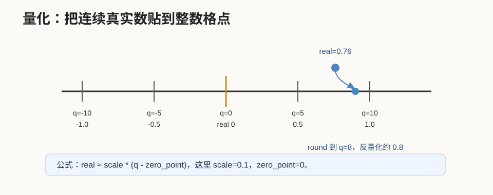
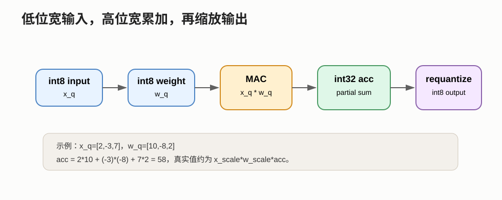
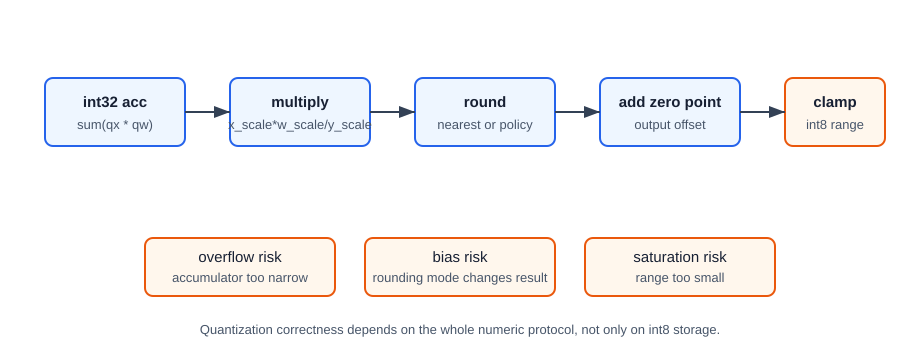

# 28 量化与定点数

> 章节等级：A
> 状态：重组候选
> 来源映射：`chapter_source_map.csv` 中的 28 章；本章主要承接 SRC16，参考 SRC11。

## 本章知识全景图

### 1. 一眼看懂本章在讲什么

- 本章主题：把量化与定点数写成硬件效率、动态范围和精度的联合设计。
- 核心概念：quantization / fixed-point / scale / zero-point / accumulator / requantize / int8
- 逻辑主线：量化不是把浮点随便截短，而是重新编码数值范围，让 NPU 能用更便宜的整数 MAC 完成近似计算。
- 最小学习路径：浮点值 -> scale/zero-point -> 整数 MAC -> 累加位宽 -> requantize -> 误差判断。

### 2. 概念地图

| 概念层级 | 核心概念 | 前置知识 | 延伸到 NPU 的位置 |
| --- | --- | --- | --- |
| 编码对象 | scale、zero-point | 量化参数 | 浮点到整数映射 |
| 计算对象 | int8/int32 MAC | PE/accumulator | 硬件整数通路 |
| 恢复对象 | requantize | 输出位宽 | 回到下一层输入格式 |
| 评估对象 | 误差、吞吐、带宽 | 模型精度 | 精度和性能同时看 |



### 3. 阅读顺序 / 处理顺序

- 先建立什么直觉：先把“量化与定点数”落到一个可观察、可手算或可追踪的对象上。
- 再形式化什么定义或流程：围绕“量化是在精度、动态范围和硬件效率之间重编码”和“scale、zero-point、累加器和 requantize 决定数值是否可还原”整理概念边界、输入输出和约束。
- 最后通过什么例子、操作或推导固化：用“用小向量手算量化、整数 MAC 和反量化”进入复现链，再回到 NPU 的 MAC、buffer、DMA、PE、编译器或 runtime 判断。
## 1. 量化是在精度、动态范围和硬件效率之间重编码

量化的目标不是把数字变小本身，而是用更便宜的整数通路保留足够可用的数值信息。

本章需要你已经理解：

- MAC 是 `sum = sum + a*b`。
- partial sum 会跨多次 MAC 保存和增长。
- 带宽瓶颈来自数据搬运速度跟不上计算速度。
- 算子支持边界里包含 dtype 和量化格式限制。

本章不会深入训练量化感知训练、校准算法或误差理论。零基础阶段先抓住硬件视角：量化后的数仍然要正确乘、正确加、正确保存、正确缩放。

想象你要用一个只能显示整数厘米的尺子测量长度。真实长度可能是：

```text
1.2 cm, 3.8 cm, 5.1 cm
```

但尺子只能记成：

```text
1 cm, 4 cm, 5 cm
```

这样记录更省空间，也更容易用简单硬件处理，但会有误差。量化也是类似：真实的神经网络参数可能是浮点数，比如 `0.137`、`-0.526`，硬件为了更快更省电，把它们映射成 int8 里的整数，如 `14`、`-53`，再用一个比例因子解释这些整数代表的真实大小。

定点数可以理解成“所有数都共用同一把尺”。例如规定最小刻度是 `1/16`，那么整数 `44` 就代表：

```text
44 * 1/16 = 2.75
```

硬件真正存的是整数 44，小数点的位置由规则固定下来。

## 2. scale、zero-point、累加器和 requantize 决定数值是否可还原

输入和权重可以是 int8，但中间累加通常需要更宽位宽；如果 scale 或 zero-point 配错，结果会系统性偏移。

浮点数灵活，但硬件代价较高。整数和定点数不够灵活，却有几类优势：

- 乘法器面积更小。
- 单次乘加能耗更低。
- 每个数占用的 byte 更少，带宽压力更低。
- 同样大小的 SRAM 能放更多输入、权重和中间结果。
- SIMD 或 PE 阵列可以在相同面积内放更多低位宽 MAC。

量化最常见的公式是：

```text
real_value ≈ scale * (q_value - zero_point)
```

其中：

- `real_value` 是原来的真实数。
- `q_value` 是存储和计算用的整数。
- `scale` 是每个整数格点代表的真实间隔。
- `zero_point` 指出整数中的哪个值代表真实的 0。

反过来，把真实数转成整数可以写成：

```text
q_value = round(real_value / scale) + zero_point
```

然后还要把结果夹到整数类型允许范围内。例如 int8 有有限范围，超出范围的数不能无限变大，只能被 clamp 到边界。

量化的关键不是“整数越小越好”，而是在精度、范围和硬件成本之间取平衡。scale 太大，格点稀疏，误差大；scale 太小，可表示范围窄，容易饱和。





**量化 quantization** 指把高精度数值映射到低精度离散表示的过程。神经网络部署里常见的是把 fp32/fp16 的激活和权重量化为 int8 或 int16。

最常用的仿射量化形式是：

```text
real = scale * (q - zero_point)
q = clamp(round(real / scale) + zero_point, q_min, q_max)
```

常见变体包括：

| 形式 | 特点 | 直觉 |
| --- | --- | --- |
| 对称量化 | `zero_point = 0` 或接近 0 | 正负范围对称，乘法路径简单 |
| 非对称量化 | `zero_point` 可不是 0 | 更好覆盖非对称数据范围 |
| per-tensor | 整个张量共用一个 scale | 简单，硬件控制容易 |
| per-channel | 不同输出通道有不同 scale | 权重量化更精细，硬件要处理更多参数 |

**定点数 fixed-point** 指小数点位置固定的数字表示。一个定点数可写成：

```text
real = integer * 2^(-fraction_bits)
```

例如 Q3.4 可以理解为：1 个符号位、3 个整数位、4 个小数位，共 8 bit，最小刻度是：

```text
2^-4 = 1/16 = 0.0625
```

整数编码 `44` 表示：

```text
44 / 16 = 2.75
```

量化和定点数的关系是：很多量化整数都可以看成一种广义定点表示，只是 scale 不一定是 2 的幂。若 scale 是 2 的幂，硬件缩放可以用移位近似；若不是，就常用整数乘法加移位来实现 requantization。

还要特别注意累加器位宽。若输入和权重都是 signed int8，单个乘积最大量级大约是：

```text
127 * 127 = 16129
```

如果要累加 9 项：

```text
9 * 16129 = 145161
```

这已经超过 signed int16 最大值 32767。因此 int8 乘法后常用 int32 accumulator 保存部分和。

## 3. 用小向量手算量化、整数 MAC 和反量化

先做一个最简单的 int8 对称量化。假设：

```text
scale = 0.1
zero_point = 0
q_min = -128
q_max = 127
```

真实数：

```text
x = [-1.0, -0.3, 0.0, 0.7, 1.2]
```

逐个量化：

```text
-1.0 / 0.1 = -10 -> q=-10
-0.3 / 0.1 = -3  -> q=-3
 0.0 / 0.1 = 0   -> q=0
 0.7 / 0.1 = 7   -> q=7
 1.2 / 0.1 = 12  -> q=12
```

所以：

```text
q = [-10, -3, 0, 7, 12]
```

反量化回来：

```text
real' = 0.1 * q
= [-1.0, -0.3, 0.0, 0.7, 1.2]
```

这个例子刚好没有舍入误差。换一个真实数 `0.76`：

```text
0.76 / 0.1 = 7.6
round(7.6) = 8
q = 8
real' = 8 * 0.1 = 0.8
误差 = 0.8 - 0.76 = 0.04
```

这就是量化误差。scale 越粗，误差可能越明显。

现在完整手算一次 int8 点积。真实输入和权重是：

```text
x_real = [ 0.2, -0.3, 0.7]
w_real = [ 0.5, -0.4, 0.1]
```

真实浮点点积：

```text
0.2*0.5 + (-0.3)*(-0.4) + 0.7*0.1
= 0.10 + 0.12 + 0.07
= 0.29
```

### 第一步：选择量化参数

假设输入和权重都用对称量化：

```text
x_scale = 0.1, x_zero_point = 0
w_scale = 0.05, w_zero_point = 0
```

### 第二步：量化输入

```text
0.2 / 0.1 = 2      -> x_q = 2
-0.3 / 0.1 = -3    -> x_q = -3
0.7 / 0.1 = 7      -> x_q = 7
```

所以：

```text
x_q = [2, -3, 7]
```

### 第三步：量化权重

```text
0.5 / 0.05 = 10     -> w_q = 10
-0.4 / 0.05 = -8    -> w_q = -8
0.1 / 0.05 = 2      -> w_q = 2
```

所以：

```text
w_q = [10, -8, 2]
```

### 第四步：整数 MAC 累加

硬件执行整数乘加：

```text
acc_int32 = 0
acc_int32 = 0 + 2*10      = 20
acc_int32 = 20 + (-3)*(-8)= 44
acc_int32 = 44 + 7*2      = 58
```

最终整数累加器：

```text
acc_int32 = 58
```

### 第五步：把整数累加解释回真实值

因为：

```text
x_real ≈ x_scale * x_q
w_real ≈ w_scale * w_q
```

所以乘积累加的真实 scale 是：

```text
acc_real ≈ x_scale * w_scale * acc_int32
= 0.1 * 0.05 * 58
= 0.005 * 58
= 0.29
```

刚好等于真实浮点结果 `0.29`。

### 第六步：requantize 到输出 int8

如果下一层希望输出 scale 是：

```text
y_scale = 0.02
y_zero_point = 0
```

输出整数为：

```text
y_q = round(acc_real / y_scale)
= round(0.29 / 0.02)
= round(14.5)
```

若采用 round half away from zero，可得：

```text
y_q = 15
```

反量化：

```text
y_real' = 15 * 0.02 = 0.30
```

输出误差：

```text
0.30 - 0.29 = 0.01
```

真实硬件中通常不会先转成浮点 `0.29` 再除以 `0.02`，而会把：

```text
(x_scale * w_scale) / y_scale
= 0.005 / 0.02
= 0.25
```

近似成整数乘法加移位。也就是说：

```text
y_q ≈ round(acc_int32 * 0.25)
= round(58 * 0.25)
= round(14.5)
= 15
```

这就是 int8 推理里常见的路径：

```text
int8 输入 * int8 权重 -> int32 累加 -> requantize -> int8 输出
```

## 4. 量化如何影响算子支持、带宽、PPA 和精度

量化直接改变 NPU 微架构设计：

| 设计对象 | 量化带来的影响 |
| --- | --- |
| MAC 阵列 | int8 乘法器比 fp32 乘法器小，能在同面积下放更多 MAC |
| 累加器 | int8 乘积常需要 int32 累加，部分和位宽不能太小 |
| SRAM / buffer | 数据位宽更低，同容量能放更多输入、权重和中间张量 |
| DMA / 带宽 | 每个张量占用 byte 更少，外部搬运压力下降 |
| 算子支持边界 | NPU 可能只对某些 dtype、scale 形式、per-channel 规则提供快路径 |
| 编译器 | 需要插入 quantize、dequantize、requantize 或融合这些动作 |

量化也影响前一章的算子支持边界。一个 NPU 可能支持：

```text
Conv2D int8 input + int8 weight + int32 accumulator
```

但不支持：

```text
Conv2D fp32
Conv2D int4
每个元素都有独立 scale 的量化
动态 scale 的运行时量化
```

这不是文档小字，而是硬件数据通路是否存在的问题。

量化还影响第 29 章的 PPA 取舍。低位宽一般能降低面积和功耗、提高吞吐，但也可能损失精度，或者增加校准、重训练和软件复杂度。优秀的 NPU 不是盲目追求最低 bit，而是在模型精度、硬件成本、带宽和软件支持之间找平衡。

### 工程判断

量化链路是否可靠，要看从校准到硬件后处理的闭环。校准决定 scale/zero point 的候选范围；编译器决定每个 tensor、每个 channel、每个算子使用什么 dtype；硬件决定 int8 乘法、int32 累加、bias 加法、requantization、rounding、saturation 是否存在对应数据通路。只把权重文件变成 int8 不是完整量化部署。

什么时候使用对称量化：权重分布大致以 0 为中心，硬件希望乘法路径更简单，zero point 可省或固定为 0。什么时候使用非对称量化：激活范围明显偏移，真实 0 必须精确表示，否则 ReLU 后数据会浪费大量负数编码。什么时候使用 per-channel：不同输出通道权重量级差异大，per-tensor scale 会让小通道精度损失明显。什么时候要谨慎：硬件后处理只能接受有限 scale 格式，或者每通道 scale 会让带宽和控制复杂度升高。

失败信号有四类。第一，精度断崖：少量层量化后误差突然扩大，通常是 scale 范围、outlier 或激活校准问题。第二，溢出或饱和：输出大量卡在 `-128/127`，说明范围或 requantization 不合适。第三，性能不升反降：int8 主算子很快，但 dtype conversion、dequantize、unsupported op 打断了高效路径。第四，硬件不一致：软件仿真和板端结果差 1-2 LSB 以上，常见原因是 rounding mode、saturation 顺序或 zero point 处理不同。

## 5. 常见误区与判断线索

### 误区 1：量化就是简单四舍五入

- 错误说法：把浮点数 round 成整数就是量化。
- 为什么错：还需要 scale、zero point、范围 clamp、累加位宽和输出再缩放。
- 正确理解：量化是一整套数值表示和硬件执行协议。
- 工程后果：只做 round 会丢掉真实范围、零点和饱和规则，NPU 与训练框架输出可能系统性偏移。
- 判断线索：量化配置里必须能看到 scale、zero point、q_min/q_max、rounding、clamp 和 accumulator 路径；只有 round 公式不完整。

### 误区 2：输入是 int8，所有中间值也都能用 int8

- 错误说法：模型 int8 推理就说明每一步都是 int8。
- 为什么错：int8 乘积累加后范围会变大，部分和通常需要 int32 accumulator。
- 正确理解：常见路径是 int8 乘法、int32 累加、再 requantize 回 int8。
- 工程后果：把中间值也压成 int8 会导致严重溢出或饱和，尤其在 `K/C_in/R/S` 很大的层。
- 判断线索：查看算子实现是否有 int32 accumulator 和 requantize；如果乘积累加直接写 int8，要用最坏情况范围检查。

### 误区 3：scale 越小越好

- 错误说法：scale 小，精度高，所以越小越好。
- 为什么错：scale 小会缩小可表示真实范围，较大数容易饱和到 q_min 或 q_max。
- 正确理解：scale 要同时覆盖范围和控制误差。
- 工程后果：scale 过小会让高幅值激活被 clamp，scale 过大又让小差异被量化噪声吞掉，都会损害精度。
- 判断线索：校准后看饱和比例和量化误差分布；如果大量值贴在 q_min/q_max，scale 可能过小或范围估计错。

### 误区 4：per-channel 量化永远免费

- 错误说法：每个通道一个 scale 更准，所以没有代价。
- 为什么错：硬件和编译器要保存更多 scale，并在输出通道维度应用不同缩放。
- 正确理解：per-channel 常用于权重，精度更好，但控制和后处理更复杂。
- 工程后果：per-channel scale 会增加 scale 读取、广播和 epilogue 控制，某些硬件可能只支持特定维度或特定算子。
- 判断线索：查看 scale 维度是否与 `C_out` 对齐，硬件是否支持按通道 requantize；否则可能回退或插入额外算子。

### 误区 5：定点数和整数完全一样

- 错误说法：定点数就是普通整数。
- 为什么错：定点数的整数编码必须配合固定小数点位置或 scale 才有真实意义。
- 正确理解：硬件存整数，解释时要乘固定比例。
- 工程后果：忽略小数点位置会把同一 bit pattern 解释成错误真实值，导致层间 scale 不匹配。
- 判断线索：任何定点数据都要同时标注整数位、小数位或 scale；只给 raw integer 无法判断数值含义。

### 误区 6：量化只影响精度，不影响性能

- 错误说法：量化是算法问题，硬件性能不变。
- 为什么错：位宽决定乘法器面积、buffer 容量、带宽和能耗。
- 正确理解：量化是算法和硬件共同设计的问题。
- 工程后果：位宽降低可以提升吞吐和减少带宽，但也会增加 scale/requantize 逻辑和精度风险；硬件不支持的 dtype 还会导致 fallback。
- 判断线索：评估量化时同时看精度、byte 数、MAC 吞吐、accumulator 位宽、requantize 开销和 supported dtype。

## 6. 最后速记

### 本章最该记住的结论

- 量化是数值编码设计，不是简单四舍五入。
- 输入、权重、累加和输出往往使用不同位宽和不同还原策略。
- 量化能减少带宽和 MAC 成本，但也会改变误差传播和算子支持边界。
- 判断量化方案时，要同时看精度损失、累加位宽和硬件收益。

### 复现 / 复习清单

完成本章后应能做到：

- 用自然语言解释量化和定点数。
- 写出 `real = scale * (q - zero_point)` 的基本公式。
- 手算一个真实数向 int8 的量化、反量化过程。
- 手算一个 int8 点积如何用 int32 accumulator 累加。
- 说明为什么 int8 输入和权重不代表部分和也能用 int8。
- 区分对称量化、非对称量化、per-tensor 和 per-channel 的直觉。
- 解释量化如何影响 NPU 的面积、功耗、带宽和算子支持边界。

### 自测题

### 题目

1. 写出仿射量化的反量化公式。
2. `scale=0.2, zero_point=0` 时，真实数 `1.0` 量化成多少？
3. `scale=0.2` 时，整数 `-3` 反量化成多少？
4. 为什么量化后要 clamp？
5. signed int8 的单个最大正乘积 `127*127` 是多少？
6. 为什么 9 个 int8 乘积相加不适合用 int16 保存？
7. 什么是 zero point？
8. per-tensor 和 per-channel 的主要区别是什么？
9. Q3.4 的最小刻度是多少？
10. 在完整演算中，`x_scale=0.1`、`w_scale=0.05`、`acc_int32=58`，真实累加值是多少？
11. 量化如何缓解带宽瓶颈？
12. 为什么 NPU supported ops 列表通常要写 dtype 条件？

### 答案或评分点

1. `real = scale * (q - zero_point)`。
2. `round(1.0/0.2)=5`。
3. `-3*0.2=-0.6`。
4. 整数类型范围有限，超出 q_min/q_max 的值无法表示。
5. `16129`。
6. `9*16129=145161`，超过 signed int16 最大值 32767。
7. 代表真实 0 的整数编码。
8. per-tensor 整个张量共用 scale；per-channel 每个通道可有不同 scale。
9. `2^-4=1/16=0.0625`。
10. `0.1*0.05*58=0.29`。
11. 每个元素 byte 数减少，同样带宽能搬更多数据，片上 buffer 也能放更多。
12. 因为不同 dtype 需要不同乘法器、累加器、缩放路径和存储格式，硬件不一定都支持。

## 来源与核对

- 本地来源 SRC16：`C:\Users\11035\Desktop\ic\npu\14、NPU\《NPU模型量化与算子融合优化从入门到精通》\01.html`，行 347-375 讨论模型量化、8 位权重/激活、per-channel 和校准；支撑 scale、zero point、校准和 dtype 边界。
- 本地来源 SRC11：`C:\Users\11035\Desktop\ic\npu\14、NPU\《NPU低功耗电源管理设计从入门到精通》\01.html`，行 203-208、257-268 讨论 MAC 阵列、片上存储、数据搬运与功耗；支撑低位宽改善带宽/功耗但仍受存储和数据通路限制。
- 本地来源 SRC05：`C:\Users\11035\Desktop\ic\npu\14、NPU\《NPU Intel OpenVINO NPU插件从入门到精通》\01.html`，行 292、400 讨论模型优化、量化和 NPU 特定量化方案；支撑软件栈需要匹配硬件量化约束。
- 外部来源 ONNX Runtime quantization：`https://onnxruntime.ai/docs/performance/model-optimizations/quantization.html`，支撑部署量化、数据类型选择、模型优化和量化调试口径。
- 外部来源 ONNX QuantizeLinear：`https://onnx.ai/onnx/operators/onnx__QuantizeLinear.html`，支撑 `y = saturate(roundToEven(x / y_scale) + y_zero_point)` 一类图表示语义。
- 外部来源 ONNX DequantizeLinear：`https://onnx.ai/onnx/operators/onnx__DequantizeLinear.html`，支撑 `x = (x_quantized - x_zero_point) * x_scale` 的反量化语义。
