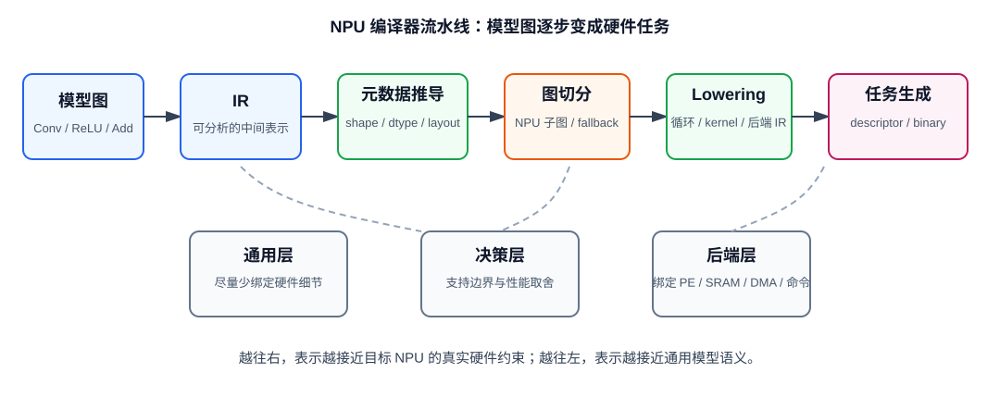
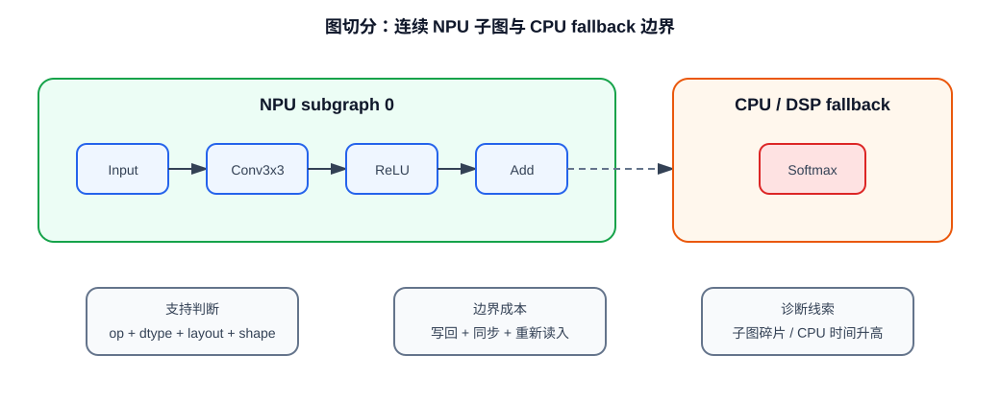
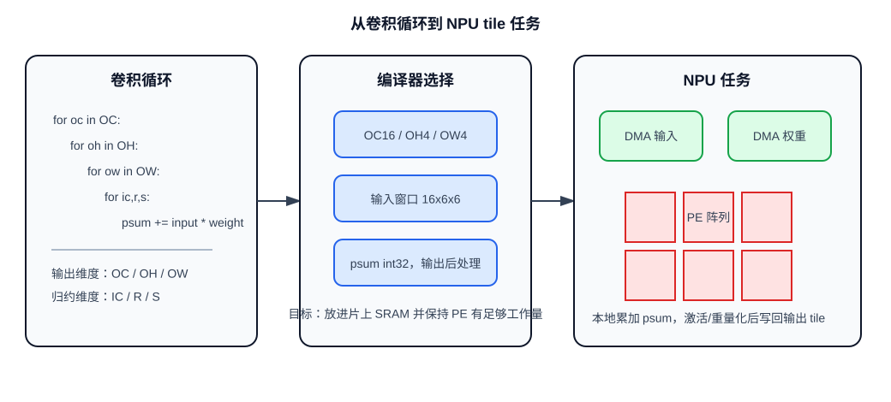
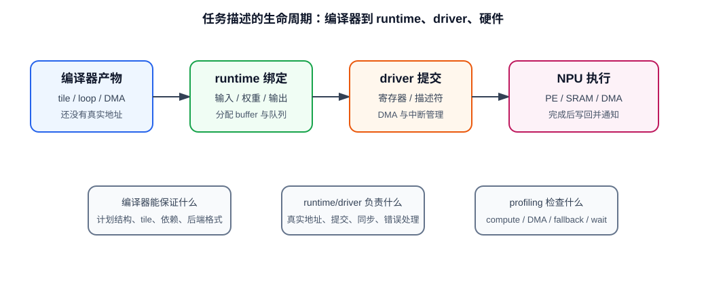

# 30 编译器如何把模型变成硬件任务

> 章节等级：A  
> 状态：重组样稿
> 来源映射：`chapter_source_map.csv` 中的 30 章；本章主要承接 SRC18，参考 SRC05，并补充 TVM、MLIR、ONNX、OpenVINO 官方资料。

## 本章知识全景图

### 1. 一眼看懂本章在讲什么

- 本章主题：NPU 编译器如何把模型图改写成硬件能执行的任务序列。
- 核心概念：计算图、shape/type/layout 推导、图切分、fallback、lowering、tiling、buffer planning、task descriptor。
- 逻辑主线：训练框架给出的是算子图，NPU 需要的是能搬数、能计算、能同步、能回退、能验证的任务图；编译器的工作就是把前 29 章的卷积、循环、tile、dataflow、partial sum、SRAM、DMA 和带宽规则固化成后端可执行计划。
- 最小学习路径：先把模型图拆成可判断节点，再判断哪些节点能进 NPU，最后把可执行子图 lower 成 tile、DMA、PE 循环和 runtime 可提交的任务描述。

### 2. 概念地图

| 概念层级 | 核心概念 | 前置知识 | 延伸到 NPU 的位置 |
| --- | --- | --- | --- |
| 模型对象 | op、dtype、shape、layout、attribute、tensor edge | ONNX Conv、张量 shape | 编译前端和支持边界判断 |
| 图级决策 | pattern matching、graph partition、fallback | 算子融合、算子支持边界 | NPU 子图长度、跨设备搬运 |
| 低层表示 | lowering、loop、kernel、TensorIR/Linalg | 卷积循环、GEMM、tile | PE 循环边界和后端 kernel |
| 存储调度 | tiling、buffer lifetime、DMA order | SRAM/buffer、DMA、partial sum | 片上工作集和双缓冲 |
| 运行交付 | task descriptor、kernel binary、runtime submit | driver、benchmark | 推理延迟、首帧延迟、profiling |



### 3. 阅读顺序 / 处理顺序

- 先建立什么直觉：先把“编译器如何把模型变成硬件任务”落到一个可观察、可手算或可追踪的对象上。
- 再形式化什么定义或流程：围绕“编译器 mapping 是软件栈进入硬件栈的入口”和“模型图必须先变成可判断的节点记录”整理概念边界、输入输出和约束。
- 最后通过什么例子、操作或推导固化：用“编译器流水线把通用图逐步压到后端任务”进入复现链，再回到 NPU 的 MAC、buffer、DMA、PE、编译器或 runtime 判断。
## 1. 编译器 mapping 是软件栈进入硬件栈的入口

训练框架输出的是“算子图”，NPU 执行的是“任务图”；没有编译器，PE、buffer、DMA 和 dataflow 不会自动从模型文件里长出来。

初学者容易以为模型部署只是把 `.onnx`、`.xml` 或 `.tflite` 文件交给工具，然后调用一次 `run()`。真实系统多了一层关键判断：工具链必须先确定哪些节点能进入 NPU，哪些节点要留给 CPU/DSP/GPU，进入 NPU 的节点怎样形成连续子图，子图内部怎样分块，分块任务怎样绑定到片上资源。只要其中一个判断错误，模型可能仍能跑通，但性能会被切碎的子图、反复 layout 转换、CPU fallback 或 DRAM traffic 吃掉。

本章的“编译器”指广义部署编译器和后端工具链。它可能叫 TVM 后端、OpenVINO NPU plugin 的 compiler、厂商 offline compiler、模型转换器或图优化器。名字不同，但核心工作相同：把模型语义转成目标硬件可执行的计划。

本地 SRC18 把代码生成流程拆成“计算图导入、Relay IR、TIR/lowering、代码生成”，Conv2D 后端案例又把自定义 NPU 后端落到算子匹配、调度优化、内存访问和 codegen。TVM BYOC 官方教程同样把 NPU 后端拆成 pattern registration、graph partitioning、codegen 和 runtime dispatch。共同结论是：NPU 编译不是单步转换，而是一条从图到硬件任务的工程链。

## 2. 模型图必须先变成可判断的节点记录

模型图里每个节点至少要回答六个问题：它是什么算子、输入输出 shape 是什么、dtype 是什么、layout 是什么、attribute 是什么、目标 NPU 是否支持这种组合。

以 ONNX Conv 为例，Conv 的输入张量、权重张量、pads、strides、dilations、group、kernel_shape 等属性都会影响输出和语义。编译器不能只看到节点名 `Conv` 就决定“放到 NPU 上”。同样是 Conv，`group=1` 的普通卷积、`group=IC` 的 depthwise 卷积、stride=2 的下采样卷积、dilation>1 的空洞卷积，对硬件后端可能是完全不同的支持边界。

一个编译器前端通常先把模型节点整理成类似下面的内部记录：

```text
node_id: conv_0
op: Conv
input: X[1, 16, 10, 10]
weight: W[32, 16, 3, 3]
output: Y[1, 32, 8, 8]
dtype: int8 input / int8 weight / int32 accumulation
layout: NCHW
attrs: stride=(1,1), pads=(0,0,0,0), dilation=(1,1), group=1
consumers: relu_0
```

这条记录的价值在于“可判断”。后端可以据此检查：

- `op=Conv` 是否在 NPU 支持集合里。
- `int8` 输入、权重和 `int32` 累加是否匹配硬件 MAC 和量化路径。
- `NCHW` 是否需要变成内部 layout。
- `OC=32`、`IC=16`、`R=S=3` 是否存在可用 kernel。
- 输出 shape 是否能静态推导；如果 shape 动态变化，是否还能生成固定任务描述。
- 后继 `ReLU` 是否可融合成硬件 epilogue。

如果前端没有把这些信息整理清楚，后面的 tiling、内存规划、DMA 和 task generation 都会变成猜测。

## 3. 编译器流水线把通用图逐步压到后端任务

编译器 mapping 的主线不是“读入再导出”，而是逐步降低抽象层级：图语义先变成可分析 IR，再变成循环、tile、buffer 和任务描述。

| 步骤 | 输入 | 输出 | 失败信号 |
| --- | --- | --- | --- |
| 前端解析 | ONNX/OpenVINO IR/框架导出模型 | 初始计算图 | 节点属性缺失、shape 不完整、opset 不兼容 |
| shape/type/layout 推导 | 初始图 | 每条边的 shape、dtype、layout | 输出维度无法确定、动态 shape 超界 |
| 图优化与模式匹配 | 带元数据的图 | 可融合模式、可 offload 子图 | 支持节点被拆散、融合机会消失 |
| 图切分 | 模式匹配结果 | NPU 子图 + CPU/DSP fallback 子图 | 子图数量过多、跨设备张量频繁搬运 |
| lowering | 高层算子 | 循环、kernel 或后端 IR | 目标后端缺 kernel、layout 不匹配 |
| tiling/scheduling/memory planning | 低层计算表示 | tile 计划、buffer 生命周期、DMA 顺序 | SRAM 放不下、psum 多次写回、DMA 无法重叠 |
| task/codegen | 执行计划 | command descriptor、kernel binary、常量包 | 任务描述缺地址、命令格式不兼容 |

TVM TensorIR 文档把 TensorIR 定位为表示和优化 primitive tensor function 的核心抽象，MLIR Linalg 文档强调结构化算子、lowering、tiling 和到库/低层表示的映射。这些材料支撑一个关键判断：中间表示不是装饰，它让“算子语义”逐步变成“循环、内存和后端调用”。

OpenVINO NPU 文档提供了工业侧口径：NPU plugin 依赖 driver，compiler 会把 OpenVINO 模型表示转换成专有格式，并针对 NPU 子模块调度层执行和内存事务；应用侧通过 `compile_model(model, "NPU")` 选择设备。也就是说，编译产物最终会被 runtime 和 driver 消费，不是抽象代码片段。

## 4. 图切分决定哪些计算真的进入 NPU

图切分的核心问题是：哪些节点能形成连续 NPU 子图，哪些节点必须留在 CPU/DSP 上。

假设模型片段是：

```text
Input
  -> Conv3x3(int8, NCHW, stride=1)
  -> ReLU
  -> Add(skip)
  -> Softmax
  -> Output
```

目标 NPU 支持表：

| op | dtype | layout | 附加条件 | 支持结果 |
| --- | --- | --- | --- | --- |
| Conv3x3 | int8 | NCHW 或内部 layout | stride=1, dilation=1, group=1 | 支持 |
| ReLU | int8/int32 | 跟随 Conv 输出 | 可作为 epilogue | 支持，可融合 |
| Add | int8 | 两输入 shape 相同 | scale 可对齐 | 支持 |
| Softmax | fp16/fp32 | 向量归一化 | 需要 exp/sum/div | 不支持 |

编译器不能把整个图都送进 NPU。合理切分是：

```text
NPU subgraph 0: Conv3x3 + ReLU + Add
CPU/DSP subgraph 1: Softmax
```

如果 `Add(skip)` 的 skip 分支来自更早的 CPU 节点，NPU 子图还要多一个输入边；如果 `Add` 的两路 scale 不一致而后端不支持重缩放，`Add` 也可能被切出去。由此可见，图切分不是简单看节点名，而是同时看算子语义、shape、dtype、layout 和跨设备数据边。



切分后，性能风险往往出现在边界处：

- NPU 输出要写到 CPU 可读内存，Softmax 才能继续。
- 如果 Softmax 后还有 NPU 支持节点，图会形成 `NPU -> CPU -> NPU` 的往返，跨设备搬运和同步会变成延迟来源。
- benchmark 中只看单个 Conv kernel，会漏掉这些边界成本。

## 5. shape 推导把数学节点变成 buffer 和 MAC 规模

编译器在生成硬件任务前必须先把输出大小和计算量推出来，否则 buffer 分配、tile 数量和任务描述都没有依据。

设卷积参数为：

```text
Input  X: N=1, IC=16, IH=10, IW=10
Weight W: OC=32, IC=16, R=3, S=3
stride = 1
padding = 0
dilation = 1
group = 1
```

输出空间尺寸：

```text
OH = floor((IH + pad_top + pad_bottom - dilation_h * (R - 1) - 1) / stride_h + 1)
   = floor((10 + 0 + 0 - 1 * (3 - 1) - 1) / 1 + 1)
   = 8

OW = 8
```

输出元素数：

```text
N * OC * OH * OW = 1 * 32 * 8 * 8 = 2048
```

每个输出元素的 MAC 次数：

```text
IC * R * S = 16 * 3 * 3 = 144
```

总 MAC 次数：

```text
2048 * 144 = 294912
```

这一步看似只是数学公式，实际会影响三个硬件决策：

- 输出 buffer 至少要容纳 `32*8*8` 个输出元素，若中间是 int32 partial sum，还要按 int32 容量计算。
- 输入 tile 要覆盖输出 tile 对应的输入窗口，不能只搬 `OH_tile*OW_tile` 那么小的区域。
- MAC 数决定任务粒度；任务太小，DMA 和启动开销可能超过计算收益。

如果 shape 推导错，后果不是“结果稍微不准”，而是地址越界、输出错位、tile 缺边界数据或 runtime 绑定错误 buffer。

## 6. tile 选择把循环映射成 DMA 和 PE 任务

lowering 之后，编译器要把一个大卷积切成片上 SRAM 放得下的小块。继续使用上一节的 Conv，选择：

```text
OC_tile = 16
OH_tile = 4
OW_tile = 4
IC_tile = 16
```

一个输出 tile 的输出元素数：

```text
OC_tile * OH_tile * OW_tile = 16 * 4 * 4 = 256
```

如果输出暂存在 int32 partial sum buffer：

```text
psum_bytes = 256 * 4 = 1024 bytes
```

这个 tile 对应的输入空间不是 `4x4`，而是因为 3x3 卷积窗口需要覆盖边缘：

```text
input_h_needed = OH_tile + R - 1 = 4 + 3 - 1 = 6
input_w_needed = OW_tile + S - 1 = 6
input_bytes = IC_tile * 6 * 6 * 1 byte = 16 * 36 = 576 bytes
```

权重 tile：

```text
weight_bytes = OC_tile * IC_tile * R * S * 1 byte
             = 16 * 16 * 3 * 3
             = 2304 bytes
```

只看这三个主要块，片上工作集约为：

```text
576 + 2304 + 1024 = 3904 bytes
```

这个数低于很多片上 buffer 容量，但它只是简化估算。真实编译器还要加上对齐、双缓冲、bank 冲突、输入/权重复用、输出量化或激活后处理。tile 选择越靠近硬件，越不能只看算术大小。



把这个 tile 变成任务时，编译器需要生成如下顺序：

```text
1. DMA load input window for OC_tile/OH_tile/OW_tile
2. DMA load weight tile
3. configure PE loop bounds: oc=16, oh=4, ow=4, ic=16, r=3, s=3
4. run MAC and accumulate int32 psum
5. apply optional ReLU or requantization
6. DMA store output tile
```

这就是第 14-19 章硬件映射知识进入编译器的地方。编译器不是替代硬件知识，而是把硬件知识写成可重复生成的规则。

## 7. task descriptor 是 runtime 能提交的编译成果

编译器最终交给 runtime 的不是“这层是 Conv”，而是一份可以被绑定地址、排队提交和调试的任务描述。

不同厂商格式不同，但抽象字段大致相似：

```yaml
task_id: 30_conv0_tile_0
op: conv2d_int8
input:
  base: X
  layout: NCHW
  tile: n0_c0_h0_w0_to_c15_h5_w5
weight:
  base: W
  tile: oc0_to_oc15_ic0_to_ic15_r3_s3
output:
  base: Y
  tile: oc0_to_oc15_oh0_to_oh3_ow0_to_ow3
compute:
  accumulator: int32
  loop_order: oc_tile -> oh -> ow -> ic -> r -> s
  activation: relu
memory:
  input_dma: 2D_stride_load
  weight_dma: contiguous_load
  output_dma: contiguous_store
dependencies:
  before: input_ready, weight_ready
  after: output_ready_for_next_node
fallback_boundary:
  next: cpu_softmax_if_present
```

这份描述还不是硬件电信号。runtime 会在一次推理时把 `X/W/Y` 绑定到真实 buffer 地址，driver 会把描述符、寄存器配置和 DMA 命令交给设备，硬件完成后再通过中断或轮询告诉 driver。第 32 章会继续讲 runtime 和 driver；本章只要求你看清编译器的边界：它负责把模型节点变成足够具体的任务计划。



## 8. 看编译结果是否健康，要同时看支持边界、搬运和端到端延迟

编译成功只说明生成了可执行计划，不说明这个计划高效。

可靠的检查顺序如下：

1. 看支持边界：目标 NPU 是否明确支持本模型的 op、dtype、shape、layout 和 attribute。
2. 看子图数量：NPU 子图越碎，跨设备同步和搬运风险越高。
3. 看 layout 转换：NCHW/NHWC/内部 layout 是否在关键路径上反复转换。
4. 看 tile 工作集：输入、权重、psum、输出和双缓冲是否超过片上容量。
5. 看 fallback：CPU/DSP fallback 节点是否处在模型热路径上。
6. 看 profiling：时间是否花在 NPU compute、DMA、CPU fallback、runtime submit 还是等待同步上。
7. 看精度：融合、量化、近似 kernel 或重排是否仍在允许误差内。

一个健康的编译结果通常有这些信号：

- NPU 子图长而连续，CPU fallback 不在主干热路径。
- layout 转换少，且大多在输入/输出边界而不是每层之间。
- tile 尺寸让 PE 有足够工作量，又不导致 psum 频繁溢出到 DRAM。
- 权重和输入搬运能和计算重叠，DMA 时间不是主导项。
- 编译日志、runtime profiling 和 benchmark 结论互相一致。

一个不健康的编译结果则常见于这些场景：

- 模型中有一个看似小的 unsupported op，把 NPU 子图切成两段。
- 编译器为了适配内部 layout，在每层之间插入 transpose。
- tile 太保守，导致每个任务计算量太小，启动开销过高。
- tile 太激进，partial sum 写回 DRAM，带宽被打满。
- 编译器产物能运行，但 runtime 每次都重新编译或缓存失效，首帧延迟很高。

## 9. 常见误区与判断线索

| 误区 | 为什么错 | 正确模型 | 工程后果 | 判断线索 |
| --- | --- | --- | --- | --- |
| 编译器只是模型格式转换 | 格式转换只解决“能读入”，不能解决 shape 推导、图切分、lowering、tiling、buffer、DMA、fallback 和 codegen | 编译器是模型语义到硬件执行计划的桥梁 | 漏掉 CPU fallback、layout 往返转换和 tile 低效 | 日志应出现子图切分、backend assignment、codegen 或 cache 产物 |
| 同一模型编译一次就能适配所有 NPU | 不同 NPU 的 PE、SRAM、DMA、量化格式、layout、支持算子和命令描述符都不同 | 前端可相对通用，后端必须绑定目标硬件 | tile、layout 或融合策略照搬会导致片上放不下或 PE 利用率下降 | 编译目标应包含具体 device、target、backend、compiler property 或 platform |
| 算子支持只看 op 名字 | Conv 的 group、stride、padding、dilation、kernel_shape、dtype 和 layout 都会改变可执行性 | 支持边界是 `op + attribute + dtype + shape + layout + 后处理路径` 的组合 | depthwise、dilated conv 或动态 shape conv 可能回退 CPU | 不只查 support list，要看具体节点是否 assigned 到 NPU backend |
| layout 转换只是改下标 | layout 决定连续访问、DMA stride、bank 分布、PE 取数顺序；转换可能是一整次张量读写 | layout 是编译器 mapping 的一等决策 | 每层之间插入 transpose/reorder 会抵消 NPU compute 收益 | profiling 中 reorder、transpose、memcpy 或 conversion 时间接近 compute 时间 |
| 编译器优化就是减少 MAC | NPU 推理常被数据搬运、片上容量、psum 写回、任务启动和同步限制 | 优化同时看计算量、数据移动、复用、tile、并行粒度、融合和提交开销 | 忽略融合、tile 和调度隐藏 DMA 延迟的收益 | 同时看 MAC、DRAM bytes、NPU utilization、DMA time、fallback time 和 latency |
| 编译成功就等于部署完成 | 编译产物还要被 runtime 绑定输入输出、管理缓存、提交队列，并由 driver 配置设备执行 | 编译器生成计划，runtime 组织推理，driver 管设备，benchmark 验证效果 | 首帧延迟、缓存失效、队列等待和设备内存不足会被误判成编译器问题 | 区分 compilation latency、first inference latency、steady-state latency |

## 10. 最后速记

### 本章最该记住的结论

- NPU 编译器的任务不是改文件格式，而是把模型图变成硬件可执行任务计划。
- 支持边界必须看 `op + dtype + shape + layout + attribute + 后处理路径`，不能只看 op 名。
- 图切分决定哪些计算真的进入 NPU；fallback 边界往往比单个 kernel 更影响端到端性能。
- shape 推导、tile 选择和 buffer planning 是编译器连接 PE/SRAM/DMA 的关键步骤。
- 编译成功不等于部署成功，最终要用 profiling 和 benchmark 看 compute、DMA、fallback、submit 和同步时间。

### 复现 / 复习清单

- 能把一个 Conv 节点写成包含 op、input、weight、output、dtype、layout、attrs 的记录。
- 能判断 `Conv -> ReLU -> Add -> Softmax` 在 Softmax 不支持时如何切图。
- 能手算 `1x16x10x10` 输入、`32x16x3x3` 权重的输出 shape 和总 MAC。
- 能估算一个 tile 的 input、weight、psum 工作集。
- 能列出 task descriptor 至少需要的字段。
- 能根据 profiling 判断问题更可能在 fallback、layout 转换、DMA、runtime submit 还是 NPU compute。

### 自测题

1. 用一句话说明 NPU 编译器 mapping 的任务。
2. 模型图节点为什么不能只记录 op 名字？
3. shape 推导、lowering、tiling、codegen 分别产出什么？
4. 给定 `Input -> Conv -> ReLU -> Add -> Softmax`，目标 NPU 不支持 Softmax，应该怎样切图？
5. 输入 `1x16x10x10`、权重 `32x16x3x3`、stride=1、padding=0、dilation=1、group=1 的 Conv 输出 shape 是多少？
6. 第 5 题每个输出元素需要多少次 MAC？总 MAC 是多少？
7. 为什么 `OC_tile=16, OH_tile=4, OW_tile=4, IC_tile=16` 的输入工作集不是 `16*4*4`？
8. task descriptor 至少应该包含哪些信息？
9. 为什么 layout 转换可能毁掉 NPU 加速效果？
10. 看到 profiling 中 CPU 时间很高，你会按什么顺序排查编译 mapping 问题？

答题口径：第 5 题输出为 `1x32x8x8`；第 6 题每个输出元素 `144` 次 MAC，总 MAC `294912`；第 10 题应先查 unsupported op/fallback，再查子图切碎、layout conversion、跨设备张量边，最后看 runtime 提交和缓存。

## 来源与核对

- 本地 HTML：SRC18 `C:\Users\11035\Desktop\ic\npu\14、NPU\《NPU神经网络编译器TVM NPU后端从入门到精通》\05.html`（标题：TVM代码生成流程剖析 - NPU编译器课程），用于“计算图 -> Relay IR -> TIR/lowering -> codegen”的流水线。
- 本地 HTML：SRC18 `C:\Users\11035\Desktop\ic\npu\14、NPU\《NPU神经网络编译器TVM NPU后端从入门到精通》\07.html`（标题：计算图算子映射），用于算子映射、支持边界和 fallback 判断。
- 本地 HTML：SRC18 `C:\Users\11035\Desktop\ic\npu\14、NPU\《NPU神经网络编译器TVM NPU后端从入门到精通》\08.html`（标题：内存分配与优化），用于 buffer 生命周期、静态内存规划、对齐和复用。
- 本地 HTML：SRC18 `C:\Users\11035\Desktop\ic\npu\14、NPU\《NPU神经网络编译器TVM NPU后端从入门到精通》\21.html`（标题：端到端案例：为自定义NPU实现Conv2D后端），用于 Conv2D 后端、调度、内存访问和 codegen 案例。
- 本地 HTML：SRC05 `C:\Users\11035\Desktop\ic\npu\14、NPU\《NPU Intel OpenVINO NPU插件从入门到精通》\04.html`（标题：模型准备与优化 - OpenVINO NPU插件），用于模型格式、NPU 可执行区域、静态 shape、算子兼容性和 CPU 回退口径。
- 外部官方：Apache TVM BYOC NPU Backend Example，支撑 pattern registration、graph partitioning、codegen、runtime dispatch 和 Conv2D+ReLU 子图示例：<https://tvm.apache.org/docs/how_to/tutorials/bring_your_own_codegen.html>。
- 外部官方：Apache TVM TensorIR 文档，支撑 TensorIR 表示、lowering、schedule primitives、loop tiling 与 transformation：<https://tvm.apache.org/docs/deep_dive/tensor_ir/index.html>。
- 外部官方：MLIR Linalg Dialect 文档，支撑结构化算子、lowering、tiling 和 named ops 的编译器表达：<https://mlir.llvm.org/docs/Dialects/Linalg/>。
- 外部官方：ONNX Conv 算子文档，支撑 Conv 的输入、权重、属性、shape inference 和输出尺寸口径：<https://onnx.ai/onnx/operators/onnx__Conv.html>。
- 外部官方：OpenVINO NPU Device 文档，支撑 NPU compiler/plugin、driver、`compile_model(model, "NPU")`、model caching 与编译/首帧延迟边界：<https://docs.openvino.ai/2026/openvino-workflow/running-inference/inference-devices-and-modes/npu-device.html>。
