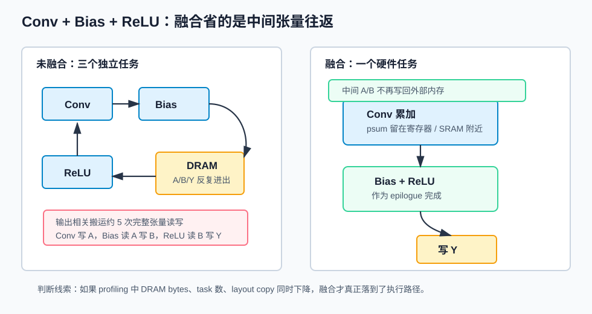
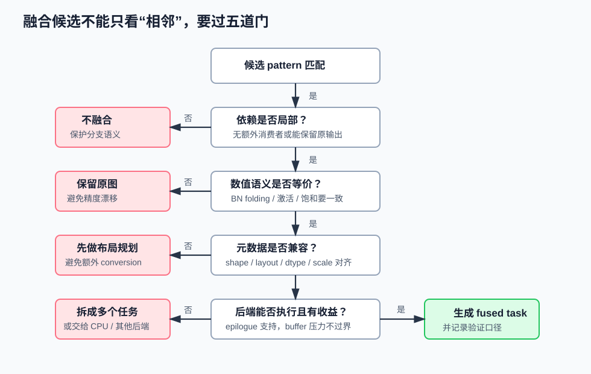
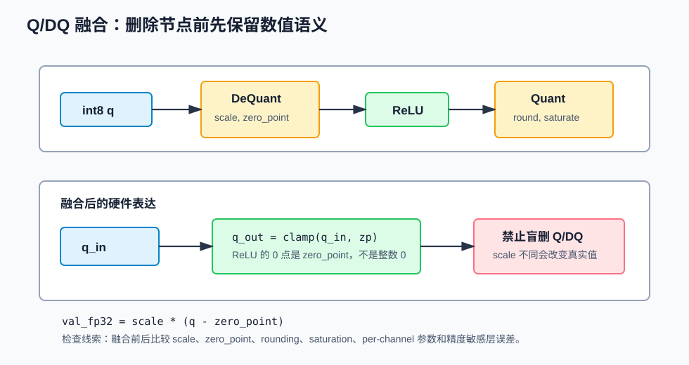
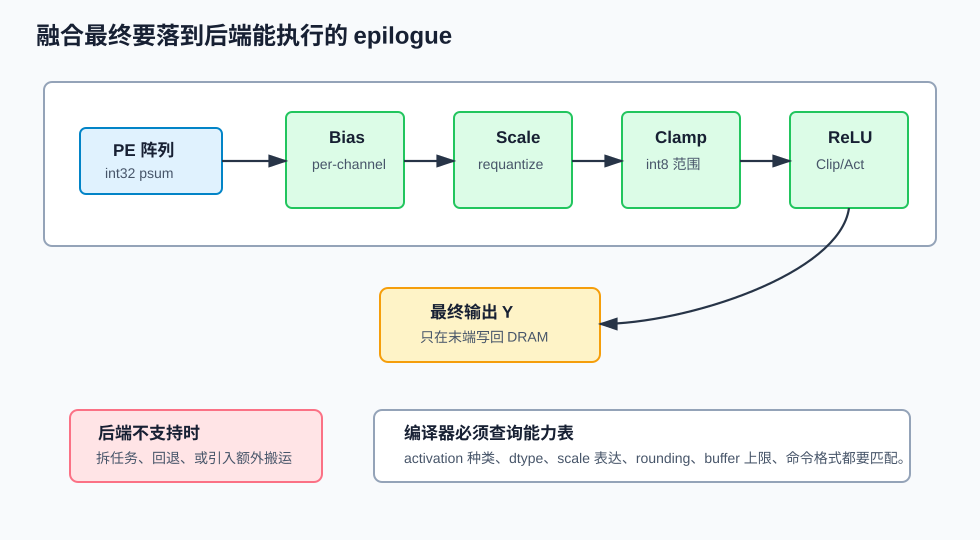

# 31 算子融合

> 章节等级：B
> 状态：重组候选
> 来源映射：`chapter_source_map.csv` 中的 31 章；本章主要承接 SRC16、SRC18，参考 SRC05，并补充 ONNX Runtime、OpenVINO、MLIR 官方资料。

## 本章知识全景图

### 1. 一眼看懂本章在讲什么

- 本章主题：把算子融合讲成中间张量、任务边界和硬件 epilogue 的联合优化。
- 核心概念：operator fusion / intermediate tensor / epilogue / Conv+Bias+ReLU / BN folding / QDQ
- 逻辑主线：融合真正节省的是中间结果写回读回、kernel 提交和同步点；是否能融合，要同时看数学等价、layout/dtype/shape、量化参数和硬件后处理能力。
- 最小学习路径：中间张量成本 -> 典型融合模式 -> 数学/量化边界 -> 硬件 epilogue -> 验证与反例。

### 2. 概念地图

| 概念层级 | 核心概念 | 前置知识 | 延伸到 NPU 的位置 |
| --- | --- | --- | --- |
| 图优化 | fusion pattern | 30 compiler mapping | 编译器 pass |
| 数据代价 | intermediate tensor | DRAM bytes | 减少中间写回/读回 |
| 数值边界 | BN folding、QDQ | 量化 | 等价性检查 |
| 硬件落点 | epilogue、post-op | PE/accumulator | Conv 后处理合并 |



### 3. 阅读顺序 / 处理顺序

- 先建立什么直觉：先把“算子融合”落到一个可观察、可手算或可追踪的对象上。
- 再形式化什么定义或流程：围绕“为什么融合是 NPU 编译器的高频优化”和“先算中间张量成本”整理概念边界、输入输出和约束。
- 最后通过什么例子、操作或推导固化：用“融合的三个层次”进入复现链，再回到 NPU 的 MAC、buffer、DMA、PE、编译器或 runtime 判断。
## 1. 为什么融合是 NPU 编译器的高频优化

算子融合的第一性问题是：一个大张量刚在 NPU 上算出来，是否必须写回外部内存，再被下一个小算子读回来。

卷积、矩阵乘是重计算算子；bias、ReLU、Clip、Scale、Add、Quantize/Dequantize 是相对轻的后处理或逐元素算子。轻量算子本身不贵，贵的是它们如果被拆成独立任务，就要读写完整中间张量，还可能引入新的 runtime 提交和同步点。对 NPU 来说，片外内存访问通常比片上寄存器或 SRAM 访问贵得多，所以融合经常比“换一个更快的 ReLU 实现”更重要。

本地 SRC16 `C:\Users\11035\Desktop\ic\npu\14、NPU\《NPU模型量化与算子融合优化从入门到精通》\10.html` 把融合收益归结为减少中间结果存储与传输开销、提升计算访存比；`14.html` 把 TVM/MLIR 中的融合归入编译器图优化和调度优化；`16.html` 进一步指出量化后融合需要检查 scale、zero point 和精度影响。外部 ONNX Runtime 官方图优化文档也把 Conv Add、Conv BatchNorm、Relu Clip 等列为语义保持的 node fusion：<https://onnxruntime.ai/docs/performance/model-optimizations/graph-optimizations.html>。

融合不是语义层面的“重新设计网络”，而是执行层面的“把可等价合并的局部计算放到一个更合适的硬件任务里”。

## 2. 先算中间张量成本

假设卷积输出张量是：

```text
N=1, C=64, H=56, W=56
元素数 = 1 * 64 * 56 * 56 = 200704
数据类型 = int8，1 byte / element
```

模型片段：

```text
Conv -> BiasAdd -> ReLU
```

如果三者分开执行，输出相关搬运至少包含：

```text
Conv 写出中间 A: 200704 byte
BiasAdd 读 A + 写 B: 200704 + 200704 byte
ReLU 读 B + 写 Y: 200704 + 200704 byte
总计: 1003520 byte
```

如果融合成一个任务：

```text
Conv 累加完成 -> 加 bias -> ReLU clamp -> 写最终 Y
总计: 200704 byte
```

只看这条输出路径，写回/读回量从约 1.0 MB 降到约 0.2 MB，减少 80%。Conv 的输入、权重和 MAC 没有因此消失。融合省的是中间张量往返和任务边界成本。

## 3. 融合的三个层次

同一句“Conv+ReLU 融合”，在系统里可能指三个不同层次。

| 层次 | 发生位置 | 产物 | 读者应看什么 |
|---|---|---|---|
| 图级融合 | 编译器 IR 或 runtime graph optimizer | 一个 fused node 或被标记的子图 | pattern 是否匹配、语义是否等价 |
| kernel 级融合 | lowering/codegen | 一个循环或 kernel 中完成多个动作 | 中间值是否还写回外部内存 |
| 硬件任务级融合 | NPU backend/task generator | 一个 command descriptor 或 fused epilogue | 后端是否支持 bias/activation/clip/requantize |

ONNX Runtime 官方文档把 graph optimization 分为 Basic、Extended、Layout 等层级，并说明部分语义保持融合会在图优化阶段发生。OpenVINO 的低精度转换文档把 low precision pipeline 拆成 prerequisites、markup、main transformations 和 cleanup，并列出 `LinOpSequenceFusion`、量化参数对齐等处理：<https://docs.openvino.ai/2026/documentation/openvino-extensibility/openvino-plugin-library/advanced-guides/low-precision-transformations.html>。这些资料说明：融合既可以是通用图重写，也可以是低精度/后端相关的专门转换。



融合候选至少要过五道检查：数据依赖是否局部，语义是否等价，shape/layout/dtype/量化参数是否兼容，后端是否能执行，收益是否大于新增寄存器和 buffer 压力。

## 4. 例题一：Conv + Bias + ReLU 的搬运账

设输出张量为：

```text
C=16, H=8, W=8
元素数 = 16 * 8 * 8 = 1024
输出 dtype = int8
```

未融合：

```text
Conv 写 A:      1024 byte
BiasAdd 读 A:   1024 byte
BiasAdd 写 B:   1024 byte
ReLU 读 B:      1024 byte
ReLU 写 Y:      1024 byte
总计:           5120 byte
```

融合后：

```text
psum 完成后加 bias
然后 ReLU clamp
只写最终 Y: 1024 byte
```

搬运减少：

```text
5120 - 1024 = 4096 byte
```

这个小例题的关键不是 4096 byte 这个数，而是计算方式。你以后看任何融合，都可以先问：融合前中间张量被完整写回几次、读回几次；融合后这些中间张量是否仍然出现在 DRAM 上。

## 5. 例题二：Conv + BatchNorm 折叠为什么只适合推理

推理阶段的 BatchNorm 对每个输出通道做固定仿射变换：

```text
y = gamma * (x - mean) / sqrt(var + eps) + beta
```

整理系数：

```text
a = gamma / sqrt(var + eps)
b = beta - gamma * mean / sqrt(var + eps)
y = a * x + b
```

如果 `x = Conv(input, W) + bias`，则：

```text
y = a * (Conv(input, W) + bias) + b
  = Conv(input, a * W) + (a * bias + b)
```

因此推理阶段可以把 BN 的 `a` 折进卷积权重，把 `a*bias+b` 折进卷积 bias。融合后图上没有单独 BN 节点，计算结果在浮点理想模型下等价。

训练阶段不能这样随便折叠。训练中的 BN 依赖当前 batch 的均值和方差，还要更新统计量并参与反向传播。Conv-BN folding 是推理优化，不是训练结构随意改写。

## 6. 例题三：量化 Q/DQ 融合为什么要看 scale 和 zero point

ONNX Runtime 官方量化文档把量化模型表示分成 QOperator 和 QDQ 两类；QDQ 会在原始算子之间插入 `QuantizeLinear` 和 `DeQuantizeLinear`，并携带 scale 与 zero point：<https://onnxruntime.ai/docs/performance/model-optimizations/quantization.html>。

量化关系可以写成：

```text
val_fp32 = scale * (val_quantized - zero_point)
```

假设：

```text
q = 120
scale = 0.05
zero_point = 100
val = 0.05 * (120 - 100) = 1.0
```

如果后面接 ReLU，实数下界是 0。在同一量化域中融合 ReLU，硬件不是 clamp 到整数 0，而是 clamp 到代表实数 0 的 `zero_point`：

```text
q_relu = max(q, zero_point)
```

若 `q=80`：

```text
val = 0.05 * (80 - 100) = -1.0
ReLU(val)=0
q_relu = max(80, 100)=100
```

这说明量化融合不能只说“把 ReLU 合进去”。它必须知道 scale、zero point、舍入、饱和和输出 dtype。若不同分支 scale 不一致，或某个后处理需要重新量化，融合位置就会影响精度。



## 7. 例题四：一个不能融合的反例

有些相邻节点看起来能合，其实不该合。

```text
       -> ReLU -> Consumer A
Conv ->
       -> Add(skip) -> Consumer B
```

这里 Conv 输出有两个消费者。若把 `Conv + ReLU` 融合，并直接消除原 Conv 输出，Consumer B 读到的就不是 Conv 原始输出，而是 ReLU 后输出，语义变了。除非编译器能保留原始输出同时给 ReLU 分支产生融合结果，否则不能简单融合。

再看 layout 反例：

```text
Conv 输出 layout: NHWC
后继算子支持 layout: NCHW
```

如果硬件 fused epilogue 只能处理内部 NHWC 输出，而后继主路径马上需要 NCHW，那么融合可能省掉一个小算子，却引入一个整张量 layout conversion。此时正确选择可能是“不融合，先选择更合适的 layout 计划”。



## 8. 硬件 epilogue：融合如何落到 NPU 上

在 NPU 上，很多融合最终表现为“主计算后处理路径”。矩阵乘或卷积结束时，PE 阵列得到 int32 partial sum，然后后处理单元可能依次执行：

```text
psum int32
  -> add bias
  -> multiply scale
  -> shift / round
  -> clamp to int8 range
  -> ReLU / ReLU6 / Clip
  -> store output
```

如果硬件 epilogue 支持这些动作，编译器可以生成一个 fused task。若硬件只支持其中一部分，比如支持 bias+ReLU 但不支持 per-channel scale，编译器就要拆任务或选择其他后端路径。

硬件 epilogue 决定了融合边界：

- 支持 bias 加法，不代表支持任意 BatchNorm；BN 是否已折成权重和 bias 要先判断。
- 支持 ReLU，不代表支持 GELU、Swish 或 Softmax；复杂非线性可能需要查表、近似或回退。
- 支持 int8 输出，不代表任意 scale 都可直接表达；shift、multiplier、rounding 模式可能有限制。
- 支持 Add，不代表 residual 分支随便融合；两路量化参数和 layout 必须对齐。

这也是为什么融合需要编译器和硬件协同。硬件要暴露清楚 epilogue 能力，编译器要在图上只选择后端能真实执行的融合。

## 9. 工程判断：融合后怎么验证

融合后必须同时验证性能和数值。

性能验证看中间 tensor 是否从编译后图中消失、NPU 子图是否更长更连续、runtime 提交任务数是否减少、profiling 中 memory copy/layout conversion/CPU fallback 是否下降、端到端 latency 是否下降。

数值验证看融合前后输出误差是否在模型允许范围内、Conv-BN folding 后权重和 bias 是否按通道正确折叠、Q/DQ 融合后 scale/zero point/rounding/saturation 是否一致、精度敏感层是否产生不可接受误差。

MLIR Linalg 官方文档强调结构化算子可以被 tiling、fusion、vectorization 等变换逐步 lowered：<https://mlir.llvm.org/docs/Dialects/Linalg/>。工程上不要只看前端图是否出现 fused node，还要看它是否真正落到后端 kernel 或硬件 epilogue。

## 10. 常见误区与判断线索

### 误区 1：融合一定减少计算量

- 错误说法：融合后 MAC 数会明显减少。
- 为什么错：Conv、MatMul 的主 MAC 通常还在；融合主要消除中间张量搬运和任务边界。
- 正确模型：先分清 compute reduction 和 memory traffic reduction；融合常属于后者。
- 工程后果：如果只用 MAC 数评估融合，会误以为融合没有收益，或高估某些融合的算力价值。
- 判断线索：同时看 DRAM bytes、kernel/task 数、DMA time、runtime submit time 和 end-to-end latency。

### 误区 2：所有相邻算子都能融合

- 错误说法：图上两个节点挨着就可以合成一个节点。
- 为什么错：中间张量可能有其他消费者；shape、layout、dtype、量化参数或后端能力可能不兼容。
- 正确模型：融合必须同时满足数据依赖、语义等价、元数据兼容和后端可执行。
- 工程后果：盲目融合会改错数值、破坏分支语义，或者引入额外 layout conversion。
- 判断线索：先查消费者数量，再查 dtype/layout/scale，再查后端 fused kernel 支持。

### 误区 3：Conv-BN 融合在训练和推理阶段一样安全

- 错误说法：BN 总能折进 Conv。
- 为什么错：推理阶段 BN 使用固定均值方差；训练阶段 BN 依赖 batch 统计并参与梯度。
- 正确模型：Conv-BN folding 是推理图优化；训练图不能按同一规则随便折。
- 工程后果：如果在训练或校准边界错误折叠 BN，可能造成训练行为变化或量化校准失真。
- 判断线索：确认当前图是 inference graph、BN 参数已固定，且融合后重新验证输出误差。

### 误区 4：量化融合只要消掉 Q/DQ 节点就行

- 错误说法：Q/DQ 节点越少越好，直接删掉就是优化。
- 为什么错：Q/DQ 表示量化域边界；scale、zero point、rounding、saturation 不能丢。
- 正确模型：量化融合要证明融合后的整数计算和原始量化语义等价或误差可接受。
- 工程后果：错误消除 Q/DQ 会让输出范围、零点、饱和位置变化，精度可能突然下降。
- 判断线索：检查每条融合边的 scale/zero point 是否对齐，必要时比较融合前后中间激活。

### 误区 5：融合越多越好

- 错误说法：把整张图融合成越大的 kernel 越快。
- 为什么错：过度融合可能增加寄存器和 buffer 压力，降低并行度，阻塞调度，还会让调试更难。
- 正确模型：融合是带约束的局部收益最大化，不是无条件扩大任务。
- 工程后果：大 fused task 可能导致片上放不下、spill 到 DRAM、occupancy 下降，反而变慢。
- 判断线索：看融合后工作集、寄存器压力、tile 尺寸和 occupancy 是否恶化。

### 误区 6：融合只是软件 pass，硬件不需要参与

- 错误说法：编译器想融合就能融合，和硬件没关系。
- 为什么错：最终执行取决于 NPU 是否支持对应 epilogue、dtype、量化路径、内存访问和命令格式。
- 正确模型：融合是“图模式 + 后端能力 + 代价模型”的系统优化。
- 工程后果：软件标了 fused node，但后端没有 fused kernel 时，要么回退 CPU，要么拆回多个任务，性能收益消失。
- 判断线索：检查编译后子图和后端 codegen 结果，而不只看前端图是否出现 fused node。

## 11. 最后速记

### 本章最该记住的结论

- 融合主要减少中间张量搬运和任务边界，不一定减少主算子 MAC。
- Conv+Bias+ReLU 常见，是因为它们能落在卷积 epilogue 中完成。
- BN folding 只在推理阶段按固定统计量等价，训练阶段不能随便折叠。
- 量化融合必须检查 scale、zero-point、舍入和饱和位置是否等价。

### 复现 / 复习清单

- 能手算 Conv+Bias+ReLU 融合前后的中间张量搬运量。
- 能说明 Conv+BN folding 的推理边界。
- 能指出至少三个不能融合的原因：多消费者、layout/dtype 不匹配、量化参数失配、硬件 epilogue 不支持。
- 能用 profiling 判断融合是否真的减少端到端延迟。

### 自测题

### 题目

1. 算子融合的定义是什么？
2. 为什么 `Conv + Bias + ReLU` 是典型融合模式？
3. 1024 个 int8 元素的中间张量，如果被一个独立逐元素算子读写一次，会增加多少字节的中间读写？
4. Conv-BN folding 的核心公式是什么？
5. 为什么 Conv-BN folding 只适合推理阶段？
6. QDQ 表示中的 `scale` 和 `zero_point` 分别起什么作用？
7. `zero_point=100` 时，int8 ReLU 的量化下界为什么不是 0？
8. 一个中间张量有两个消费者时，为什么不能简单融合其中一路？
9. layout 不匹配为什么可能抵消融合收益？
10. 硬件 epilogue 通常能做哪些后处理？
11. 融合后需要验证哪两类结果？
12. 写出一个融合后反而可能变慢的原因。

### 答案或评分点

1. 在保持语义等价的前提下，把相邻或局部相关算子合成一个执行单元，减少中间搬运和任务边界成本。
2. Bias 和 ReLU 直接消费 Conv 输出，常能在累加完成后作为 epilogue 完成，不必写回中间张量。
3. 读 1024 byte + 写 1024 byte = 2048 byte。
4. `a = gamma / sqrt(var + eps)`，`b = beta - gamma * mean / sqrt(var + eps)`，将 `y=a*(Conv+bias)+b` 折成新权重和新 bias。
5. 推理阶段 BN 参数固定；训练阶段 BN 依赖 batch 统计并参与反向传播。
6. `scale` 把整数间隔映射到实数间隔；`zero_point` 表示实数 0 在量化空间的位置。
7. ReLU 的实数下界是 0，对应量化值是 `zero_point`，所以应 clamp 到 100。
8. 融合一路可能消除或改写原始中间值，导致另一路消费者读错数据。
9. layout 转换通常是整张量读写，若融合引入或保留额外转换，省下的小算子成本可能被抵消。
10. bias、scale、shift、round、clamp、ReLU/ReLU6/Clip、requantize、store 等。
11. 性能结果和数值结果；前者看搬运/任务/latency，后者看误差/scale/rounding/饱和。
12. 例如 fused task 工作集过大导致 spill、寄存器压力升高、并行度下降或后端不支持而回退。

## 来源与核对

- 本地 HTML：SRC16 `C:\Users\11035\Desktop\ic\npu\14、NPU\《NPU模型量化与算子融合优化从入门到精通》\10.html`（标题：算子融合优化原理），用于融合收益、计算访存比、Conv-BN 与常见融合模式。
- 本地 HTML：SRC16 `C:\Users\11035\Desktop\ic\npu\14、NPU\《NPU模型量化与算子融合优化从入门到精通》\11.html`（标题：常见融合模式（一）：Conv-BN融合、Conv-BN-ReLU融合原理与实现），用于 Conv-BN 折叠公式、推理融合和验证。
- 本地 HTML：SRC16 `C:\Users\11035\Desktop\ic\npu\14、NPU\《NPU模型量化与算子融合优化从入门到精通》\14.html`（标题：基于编译器的融合优化），用于 TVM/MLIR 中的图融合和调度优化。
- 本地 HTML：SRC16 `C:\Users\11035\Desktop\ic\npu\14、NPU\《NPU模型量化与算子融合优化从入门到精通》\16.html`（标题：量化与融合的协同优化），用于 Q/DQ、scale/zero point 和量化误差边界。
- 本地 HTML：SRC18 `C:\Users\11035\Desktop\ic\npu\14、NPU\《NPU神经网络编译器TVM NPU后端从入门到精通》\12.html`（标题：NPU特定优化Pass开发），用于 add+relu 模式匹配、图层 pass 和后端融合算子边界。
- 外部官方：ONNX Runtime Graph Optimizations，支撑语义保持 node fusion、优化等级和 Conv/Add/BN 等融合口径：<https://onnxruntime.ai/docs/performance/model-optimizations/graph-optimizations.html>。
- 外部官方：ONNX Runtime Quantization，支撑 QOperator/QDQ、scale、zero point 和量化调试边界：<https://onnxruntime.ai/docs/performance/model-optimizations/quantization.html>。
- 外部官方：OpenVINO Low Precision Transformations，支撑低精度转换、量化参数对齐和融合清理路径：<https://docs.openvino.ai/2026/documentation/openvino-extensibility/openvino-plugin-library/advanced-guides/low-precision-transformations.html>。
- 外部官方：MLIR Linalg Dialect，支撑结构化算子、fusion、tiling、vectorization 与 lowering 的编译器表达：<https://mlir.llvm.org/docs/Dialects/Linalg/>。
