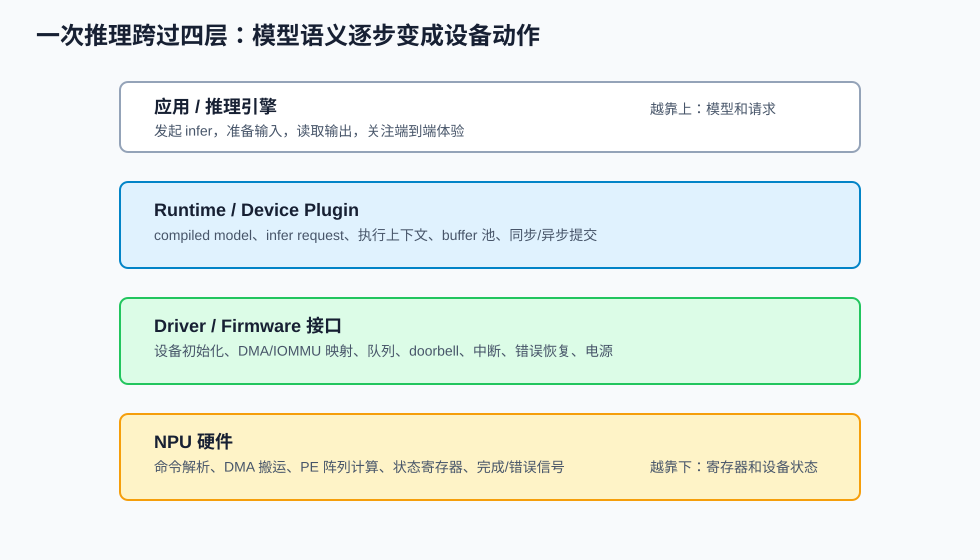
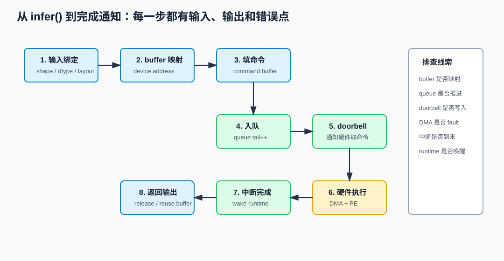
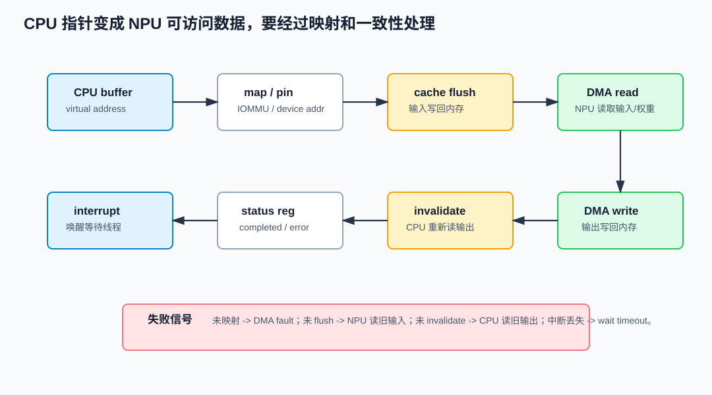
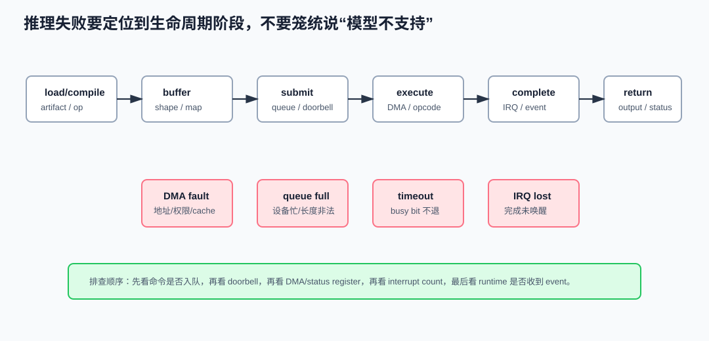

# 32 Runtime 与驱动

> 章节等级：A
> 状态：重组候选
> 来源映射：`chapter_source_map.csv` 中的 32 章；本章主要承接 SRC08，参考 SRC05，并补充 Linux kernel 与 OpenVINO 官方资料。

## 本章知识全景图

### 1. 一眼看懂本章在讲什么

- 本章主题：把 runtime/driver 写成编译结果真正变成 NPU 执行的生命周期。
- 核心概念：runtime / driver / command descriptor / buffer binding / queue / doorbell / interrupt / timeout
- 逻辑主线：编译器产出任务模板后，runtime 负责把用户输入、buffer 和队列绑定起来，driver 负责和寄存器、队列、中断、电源状态交互；两层之间任何地址或状态错误都会变成运行失败。
- 最小学习路径：编译任务 -> buffer 绑定 -> queue/doorbell -> NPU 执行 -> interrupt/profile/error。

### 2. 概念地图

| 概念层级 | 核心概念 | 前置知识 | 延伸到 NPU 的位置 |
| --- | --- | --- | --- |
| 软件边界 | runtime | 模型执行 API | 任务提交和 buffer 管理 |
| 内核边界 | driver | 设备寄存器 | 队列、doorbell、中断 |
| 数据边界 | physical/iova address | DMA | NPU 可访问地址 |
| 调试边界 | timeout、profile、error code | 执行链 | 故障定位 |



### 3. 阅读顺序 / 处理顺序

- 先建立什么直觉：先把“Runtime与驱动”落到一个可观察、可手算或可追踪的对象上。
- 再形式化什么定义或流程：围绕“分层边界：谁离模型近，谁离寄存器近”和“一次推理请求的生命周期”整理概念边界、输入输出和约束。
- 最后通过什么例子、操作或推导固化：用“例题一：把编译器任务模板绑定成一次真实运行”进入复现链，再回到 NPU 的 MAC、buffer、DMA、PE、编译器或 runtime 判断。
## 1. 分层边界：谁离模型近，谁离寄存器近

Runtime 是模型执行现场的组织者。它通常位于框架、推理引擎或应用 API 之下，负责加载编译产物，创建执行上下文，准备输入输出，复用内存池，发起同步或异步推理，并把状态返回给上层。OpenVINO 官方推理流程把运行分成读模型、编译模型、创建 infer request、填输入、启动推理、取输出等步骤：<https://docs.openvino.ai/2026/openvino-workflow/running-inference.html>。这里的 compiled model、infer request 和 device/plugin，就是典型 runtime 视角。

Driver 是硬件资源的安全入口。它不关心“这层是不是卷积”这种模型语义，而关心设备是否初始化、寄存器怎么配置、buffer 是否可被 NPU DMA 访问、命令队列是否有空间、中断是否到来、错误状态寄存器如何解释。Linux kernel 的 DMAEngine 文档把异步 DMA 传输抽象成 channel、descriptor、submit、callback 等概念：<https://www.kernel.org/doc/html/latest/driver-api/dmaengine/index.html>。NPU driver 具体实现可以不同，但“描述一次设备传输/执行并等待完成”这个结构很相似。

本地 SRC08 `C:\Users\11035\Desktop\ic\npu\14、NPU\《NPU NPU驱动开发与运行时从入门到精通》\05.html` 用驱动架构总览说明设备层、内存层、任务调度层和用户态接口的分工；`11.html` 专门讲 NPU runtime 的模型加载、内存管理和执行管理；`10.html` 讲用户态接口如何把上层请求传到驱动。把这些合起来，可以得到一个稳定边界：

| 层级 | 输入 | 输出 | 主要风险 |
|---|---|---|---|
| 编译器 | 模型图、权重、目标硬件能力 | artifact、task template、内存计划 | 算子不支持、layout 不匹配、切图失败 |
| runtime | artifact、本次输入输出、设备句柄 | command buffer、执行句柄、事件 | buffer 生命周期、提交时序、同步等待 |
| driver | command buffer、设备地址、队列请求 | 寄存器配置、DMA 描述符、中断状态 | 地址错误、设备忙、超时、中断丢失 |
| NPU/firmware | 命令流、buffer 地址、配置寄存器 | 计算结果、完成标志、错误码 | DMA fault、非法命令、硬件 hang |

## 2. 一次推理请求的生命周期

一次 NPU 推理不是一次函数调用那么简单，它更像一条事务链：

```text
应用调用 infer
  -> runtime 检查模型与输入
  -> runtime 选择/创建执行上下文
  -> runtime 准备 input/output/workspace buffer
  -> runtime 填 command template 中的地址和 shape 参数
  -> driver 校验 buffer 映射和设备状态
  -> driver 入队 command buffer
  -> driver 写 doorbell 或通知 firmware
  -> NPU 通过 DMA 读写并执行 PE 阵列
  -> NPU 产生 interrupt/event 或完成标志
  -> driver 处理完成/错误
  -> runtime 释放或复用资源，返回输出
```



这个链条里有三种“时间”要分开：

| 时间 | 含义 | 为什么重要 |
|---|---|---|
| NPU execute time | 硬件真正执行命令的时间 | 衡量计算阵列和 DMA 是否高效 |
| submit/sync overhead | runtime/driver 提交、排队、等待、唤醒开销 | 小模型上可能比硬件执行还显眼 |
| end-to-end latency | 应用看到的总耗时 | 用户体验和 benchmark 通常看它 |

如果硬件执行只用 `2 ms`，但输入准备 `0.8 ms`、driver 提交 `0.2 ms`、排队 `0.7 ms`、完成同步 `0.3 ms`、后处理 `0.5 ms`，端到端就是 `4.5 ms`。这就是下一章做 benchmark 时必须同时报告端到端时间和设备执行时间的原因。

## 3. 例题一：把编译器任务模板绑定成一次真实运行

假设第 30 章生成了一个 Conv 任务模板：

```text
task_template:
  op = Conv2D
  input_base  = <runtime fill>
  weight_base = 0x40000000
  output_base = <runtime fill>
  input_shape = 1x56x56x32
  output_shape = 1x56x56x64
  tile = 16x16
  epilogue = bias + relu
```

应用本次传入：

```text
input_buffer_cpu_ptr  = 0x000001C0_10000000
output_buffer_cpu_ptr = 0x000001C0_20000000
```

runtime 不能把这两个 CPU 虚拟地址原封不动塞给 NPU。它要通过内存池或驱动接口拿到设备可访问地址：

```text
map(input_buffer_cpu_ptr)  -> input_device_addr  = 0x8000_0000
map(output_buffer_cpu_ptr) -> output_device_addr = 0x8100_0000
```

然后形成 command buffer：

```text
cmd.conv.input_base  = 0x8000_0000
cmd.conv.weight_base = 0x4000_0000
cmd.conv.output_base = 0x8100_0000
cmd.conv.tile        = 16x16
cmd.conv.flags       = EPILOGUE_BIAS_RELU
```

这里的关键结论是：编译器产物描述“应该做什么”，runtime/driver 补齐“这一次在哪里做、用哪块内存做、提交到哪条队列做”。

## 4. Buffer、DMA 与 cache：为什么地址绑定不能含糊

NPU 通常通过 DMA 访问输入、权重、输出和 workspace。DMA 的直觉是：设备绕过 CPU 核心，自己把数据从系统内存搬到设备侧或片上缓存，再把结果写回。Linux DMAEngine 文档中的 `descriptor`、`submit`、`callback` 这些词，对应到 NPU 场景就是“描述一次搬运/执行、提交给设备、完成后通知软件”。

假设输入张量：

```text
shape = 1x224x224x3
dtype = uint8
bytes = 1 * 224 * 224 * 3 = 150528 byte
```

如果每次推理都重新分配、映射、刷新这块 buffer，开销可能包括：

```text
allocate buffer
map to device address
copy or preprocess input
flush CPU cache lines
submit DMA read
wait completion
invalidate output cache lines
```

对小模型来说，这些固定开销会占很大比例。更好的 runtime 会复用 buffer、提前建好内存池、尽量让预处理直接写入目标 layout，并用异步队列重叠 CPU 准备和 NPU 执行。



三个概念必须区分：

| 概念 | 解释 | 常见错误 |
|---|---|---|
| CPU virtual address | 应用或 runtime 看到的指针 | 误以为设备能直接访问 |
| physical/IOMMU/device address | NPU DMA 使用的地址 | 映射未建立会导致 DMA fault |
| cache state | CPU cache 与内存中数据是否一致 | 输入未 flush 或输出未 invalidate 会读到旧数据 |

## 5. Queue、doorbell 与 interrupt：任务如何开始和结束

Driver 把 command buffer 放入队列后，通常要通过某种“门铃”机制通知硬件：队列里有新任务。门铃可以是寄存器写，也可以是对 firmware 的消息。硬件开始读命令后，状态会经历：

```text
QUEUED -> RUNNING -> COMPLETED
                 -> ERROR
                 -> TIMEOUT
```

本地 SRC08 `07.html` 讲中断处理，`09.html` 讲命令队列与任务调度，二者合在一起就是一次任务完成的最小闭环：

```text
driver enqueue
driver write doorbell
hardware fetch command
hardware execute
hardware writes status
hardware raises interrupt
interrupt handler records completion
waiting thread wakes up
runtime sees success/error
```

中断不是“硬件执行本身”，而是硬件向软件报告状态的机制。对于高频小任务，系统也可能使用 polling 或 batch completion，避免过多中断上下文切换；对于长任务，中断能避免 CPU 忙等。正确选择取决于延迟、功耗和吞吐目标。

## 6. 例题二：排队等待为什么会吃掉性能

假设一个应用连续提交 3 个推理请求：

```text
request A: execute 2.0 ms
request B: execute 2.0 ms
request C: execute 2.0 ms
driver submit overhead: 0.15 ms / request
completion wakeup overhead: 0.10 ms / request
```

如果 NPU 只能串行执行，且应用同步等待每个请求：

```text
A: submit 0.15 + execute 2.0 + wake 0.10 = 2.25 ms
B: submit 0.15 + execute 2.0 + wake 0.10 = 2.25 ms
C: submit 0.15 + execute 2.0 + wake 0.10 = 2.25 ms
total = 6.75 ms
```

如果 runtime 允许提前准备下一个请求，并用双 buffer 重叠 CPU 预处理：

```text
CPU prepares B while NPU runs A
CPU prepares C while NPU runs B
```

端到端吞吐会改善，但单个请求的硬件执行时间不一定变。这里的收益来自队列利用率和 CPU/NPU 重叠，而不是单个 Conv 更快。



## 7. 错误处理：不要把所有失败都叫“模型不支持”

一次推理失败可能发生在不同层：

| 阶段 | 典型失败 | 判断线索 |
|---|---|---|
| load/compile | artifact 版本不匹配，目标设备不支持 | 编译日志、plugin 报错、supported ops |
| buffer prepare | shape/dtype/layout 不符，buffer 太小 | runtime 输入校验、tensor metadata |
| map/cache | DMA 地址未映射，cache 未同步 | IOMMU fault、输出旧值、随机错误 |
| submit | 队列满、设备忙、命令长度非法 | driver 返回码、队列状态 |
| execute | 非法指令、DMA fault、硬件 timeout | status register、firmware log |
| complete | 中断未到、event 未触发、等待超时 | interrupt count、wait timeout |
| fallback | 某段回退 CPU，端到端变慢 | profiling 中出现 CPU node 或 copy |

OpenVINO NPU 设备文档把 NPU plugin、compiler、driver、model caching 和首帧延迟放在同一运行链路里讨论：<https://docs.openvino.ai/2026/openvino-workflow/running-inference/inference-devices-and-modes/npu-device.html>。这说明部署时不能只看模型图是否可编译，还要看首次编译、缓存、设备选择、驱动路径和实际 inference request。

## 8. 例题三：一次 timeout 怎么排查

现象：

```text
runtime infer() 返回 timeout
NPU execute counter 没有增加
driver 日志显示 wait_event timeout
```

按生命周期排查：

```text
1. command buffer 是否真的入队？
   看 queue tail 是否推进。

2. doorbell 是否写到正确寄存器？
   看 doorbell write 计数或寄存器 trace。

3. NPU 是否取走命令？
   看 command fetch/status register。

4. DMA 是否访问非法地址？
   看 IOMMU fault 或 bus error。

5. 中断是否产生但未处理？
   看 interrupt count 和 handler log。

6. 硬件是否执行中卡死？
   看 busy bit、firmware heartbeat、last opcode。
```

如果 queue tail 没动，问题在 submit 前；如果 tail 动了但 doorbell 没写，问题在 driver 通知；如果 doorbell 写了但 NPU 没取命令，问题在设备状态或电源；如果 NPU 执行了但中断没来，问题在 interrupt/event；如果中断来了但 runtime 还等超时，问题在完成状态传播。

## 9. 电源、时钟与首帧延迟

移动端或边缘设备的 NPU 不会永远满频运行。driver 可能要负责：

```text
power on
clock enable
firmware boot or wake
frequency/voltage vote
idle timeout
power collapse
```

本地 SRC08 `14.html` 讲 NPU 电源与功耗管理。对推理来说，电源管理最容易影响两个指标：

| 指标 | 受影响原因 |
|---|---|
| first inference latency | 第一次请求可能包含唤醒、编译缓存读取、固件准备、频率提升 |
| sustained throughput | 长时间运行会受温度、功耗限制和调度策略影响 |

因此 benchmark 必须区分 cold start、warmup 后稳定状态、连续负载和间歇负载。只测一帧，可能把唤醒成本误认为模型执行成本；只测稳定满载，又可能低估真实交互场景的首帧延迟。

## 10. 例题四：把总延迟拆到可行动的优化项

一次端到端推理测得：

```text
preprocess             0.7 ms
runtime buffer prepare 0.4 ms
driver submit          0.2 ms
queue wait             0.6 ms
NPU execute            2.1 ms
completion sync        0.2 ms
postprocess            0.5 ms
total                  4.7 ms
```

如果目标是把总延迟降到 `4.0 ms` 以下，不一定先改 NPU PE 阵列。更直接的候选是：

```text
preprocess 直接写目标 layout: -0.3 ms
buffer 池复用，减少 map/cache 维护: -0.2 ms
异步提前提交，减少 queue wait: -0.3 ms
```

这些都是 runtime/driver 层能影响的项。硬件执行 `2.1 ms` 当然重要，但系统优化必须看完整链路。

## 11. 工程判断：看日志和 profiler 时先分层

读 NPU runtime/driver 日志时，先把信息归到四层：

```text
model/runtime: compiled model, infer request, input/output binding
memory: allocation, map, flush, invalidate, address, size
submit/sync: queue, command buffer, fence/event, interrupt
device: register, DMA fault, timeout, firmware, power
```

如果日志只说 `NPU inference failed`，它的信息量太低。高质量 runtime/driver 应该能至少暴露：失败阶段、设备错误码、最后提交的 command id、相关 buffer id、是否发生 CPU fallback、是否超时、是否重试。下一章做性能评测时，也要把这些事件和 latency 对齐。

## 12. 常见误区与判断线索

### 误区 1：编译完成就等于模型能跑

- 错误说法：编译器产物生成了，NPU 推理就一定没问题。
- 为什么错：还需要 runtime 加载、内存绑定、driver 提交、硬件执行和完成通知；任何一段失败都会让推理失败。
- 正确模型：编译产物只是计划，runtime/driver 把计划绑定到本次资源并驱动硬件完成。
- 工程后果：只看 compile success 会漏掉 buffer 映射、设备超时、中断丢失和 fallback 问题。
- 判断线索：同时检查 compiled model、infer request、buffer map、submit log、interrupt count 和输出校验。

### 误区 2：driver 只是薄薄的转发层

- 错误说法：driver 只负责把 command buffer 传给 NPU。
- 为什么错：driver 还管理设备初始化、寄存器、内存权限、DMA、队列、中断、电源、安全隔离和错误恢复。
- 正确模型：driver 是硬件资源的受控入口，必须保护设备状态和进程隔离。
- 工程后果：忽略 driver 会导致非法地址、队列竞争、设备 hang 或错误码不可诊断。
- 判断线索：看 driver 是否暴露设备状态、队列状态、错误寄存器、timeout 和恢复路径。

### 误区 3：CPU 指针就是 NPU 地址

- 错误说法：把应用指针写进任务描述，NPU 就能直接读写。
- 为什么错：CPU 虚拟地址、物理地址、IOMMU 地址和设备地址不是一回事；cache 状态也必须维护。
- 正确模型：runtime/driver 需要为 buffer 建立设备可访问映射，并处理对齐、权限和 cache 同步。
- 工程后果：地址错会触发 DMA fault；cache 未同步会让 NPU 读到旧输入或 CPU 读到旧输出。
- 判断线索：检查 map/unmap、flush/invalidate、IOMMU fault、buffer size 和设备地址日志。

### 误区 4：NPU execute time 等于用户看到的延迟

- 错误说法：硬件执行 2 ms，用户端到端延迟就是 2 ms。
- 为什么错：端到端还包含输入准备、runtime 调度、driver 提交、排队、同步和后处理。
- 正确模型：benchmark 至少区分 end-to-end latency、device execution time 和 submit/sync overhead。
- 工程后果：只优化 kernel 可能看不到用户体验改善，也可能误判瓶颈。
- 判断线索：用 profiler 拆分 preprocess、submit、queue wait、execute、sync、postprocess。

### 误区 5：中断越多越实时

- 错误说法：每个小任务都用一次中断，系统响应就最好。
- 为什么错：中断有上下文切换和调度成本；高频小任务可能更适合 batching、polling 或事件合并。
- 正确模型：中断、轮询和 batch completion 是延迟、功耗、吞吐之间的取舍。
- 工程后果：中断风暴会拖慢 CPU，polling 过度会浪费功耗，batch 过大又会增加尾延迟。
- 判断线索：观察 interrupt rate、CPU wakeup、queue depth、tail latency 和功耗。

### 误区 6：runtime 和 driver 边界所有平台都一样

- 错误说法：每个 NPU 软件栈都按同一套用户态/内核态边界实现。
- 为什么错：调度、内存管理、命令生成和错误处理可以分布在 runtime、driver、firmware 或 device plugin 中。
- 正确模型：边界会迁移，但加载、内存、提交、执行、完成、错误恢复这些职责必须被覆盖。
- 工程后果：照搬一个平台的 API 解释另一个平台，容易误读日志和性能瓶颈。
- 判断线索：先画出目标平台的实际调用链，再对应每个阶段的输入、输出和错误码。

## 13. 最后速记

### 本章最该记住的结论

- 编译完成不等于模型能跑，runtime/driver 还要完成绑定、提交、同步和错误处理。
- CPU 指针不是 NPU 地址，buffer 绑定和 cache 一致性是运行正确性的硬边界。
- 用户看到的端到端延迟包含排队、搬运、电源唤醒和同步，不等于 NPU execute time。
- 排查 runtime 问题时，要先分层：编译、地址、队列、执行、中断、profile。

### 复现 / 复习清单

- 能画出一次推理请求从 runtime API 到 driver 中断返回的生命周期。
- 能解释 command descriptor 里至少要绑定哪些 buffer 和参数。
- 能区分 NPU execute time、device time 和 end-to-end latency。
- 能列出 timeout 排查顺序：队列、地址、DMA、算子支持、电源/时钟、中断。

### 自测题

### 题目

1. runtime 和 driver 的职责边界怎么粗略区分？
2. 一次推理从应用调用到 NPU 完成，至少经过哪些阶段？
3. command buffer 中为什么要填 input/output device address？
4. CPU virtual address 和 device address 有什么区别？
5. DMA 访问前后为什么常需要 cache flush/invalidate？
6. queue 和 doorbell 分别起什么作用？
7. interrupt/event 在 NPU 推理中解决什么问题？
8. 为什么 NPU execute time 不等于 end-to-end latency？
9. request A/B/C 串行提交时，queue wait 可能怎样影响吞吐？
10. timeout 排查时为什么要先看 queue tail 和 doorbell？
11. 电源管理为什么会影响 first inference latency？
12. 写出一个 runtime/driver 层优化项，并说明它优化哪段时间。

### 答案或评分点

1. runtime 更靠近模型和执行上下文，driver 更靠近设备、寄存器、DMA、中断和错误恢复。
2. 输入检查、上下文选择、buffer 准备、命令绑定、driver 校验、入队、doorbell、硬件执行、中断/事件、结果回收。
3. 编译模板只知道任务结构，不知道本次输入输出实际落在哪块设备可访问内存。
4. CPU virtual address 是进程看到的地址，device address 是 NPU DMA 或 IOMMU 侧可访问地址。
5. CPU cache 和内存可能不一致；输入要确保设备读到最新数据，输出要确保 CPU 读到设备写回的数据。
6. queue 保存待执行命令，doorbell 通知硬件队列有新任务。
7. 用于通知软件任务完成或异常，避免 CPU 一直忙等。
8. 总延迟还包含预处理、buffer、提交、排队、同步和后处理。
9. 如果提交和执行完全串行，后续请求要等待前一个完成；异步队列和双 buffer 可重叠 CPU/NPU 工作。
10. queue tail 判断命令是否入队，doorbell 判断硬件是否被通知；二者能把问题定位在 submit 前后。
11. 设备休眠时需要唤醒、开时钟、固件准备或升频，第一帧会额外变慢。
12. 例如 buffer 池复用减少 allocate/map/cache 开销；异步提前提交减少 queue wait；预处理直接写目标 layout 减少 copy。

## 来源与核对

- 本地 HTML：SRC08 `C:\Users\11035\Desktop\ic\npu\14、NPU\《NPU NPU驱动开发与运行时从入门到精通》\05.html`（标题：NPU驱动架构总览），用于驱动分层、设备管理和用户态/内核态边界。
- 本地 HTML：SRC08 `C:\Users\11035\Desktop\ic\npu\14、NPU\《NPU NPU驱动开发与运行时从入门到精通》\07.html`（标题：NPU中断处理机制），用于 interrupt/event、完成通知和 timeout 排查。
- 本地 HTML：SRC08 `C:\Users\11035\Desktop\ic\npu\14、NPU\《NPU NPU驱动开发与运行时从入门到精通》\08.html`（标题：DMA与内存管理），用于 DMA、buffer、设备地址、cache 同步和内存生命周期。
- 本地 HTML：SRC08 `C:\Users\11035\Desktop\ic\npu\14、NPU\《NPU NPU驱动开发与运行时从入门到精通》\09.html`（标题：命令队列与任务调度），用于 queue、submit、doorbell 和排队等待。
- 本地 HTML：SRC08 `C:\Users\11035\Desktop\ic\npu\14、NPU\《NPU NPU驱动开发与运行时从入门到精通》\10.html`（标题：用户态接口设计），用于 runtime 到 driver 的接口边界。
- 本地 HTML：SRC08 `C:\Users\11035\Desktop\ic\npu\14、NPU\《NPU NPU驱动开发与运行时从入门到精通》\11.html`（标题：NPU运行时（Runtime）核心），用于 runtime 的模型加载、内存管理和执行管理。
- 本地 HTML：SRC08 `C:\Users\11035\Desktop\ic\npu\14、NPU\《NPU NPU驱动开发与运行时从入门到精通》\14.html`（标题：NPU电源与功耗管理），用于 first inference latency、唤醒和持续吞吐边界。
- 外部官方：Linux kernel DMAEngine documentation，用于 DMA channel、descriptor、submit、callback 的设备传输模型：<https://www.kernel.org/doc/html/latest/driver-api/dmaengine/index.html>。
- 外部官方：Linux kernel generic IRQ documentation，用于中断处理、IRQ 语义和完成通知背景：<https://docs.kernel.org/core-api/genericirq.html>。
- 外部官方：OpenVINO running inference documentation，用于 compiled model、infer request、输入输出绑定和推理流程：<https://docs.openvino.ai/2026/openvino-workflow/running-inference.html>。
- 外部官方：OpenVINO NPU device documentation，用于 NPU plugin、compiler、driver、model caching 和首帧延迟边界：<https://docs.openvino.ai/2026/openvino-workflow/running-inference/inference-devices-and-modes/npu-device.html>。
