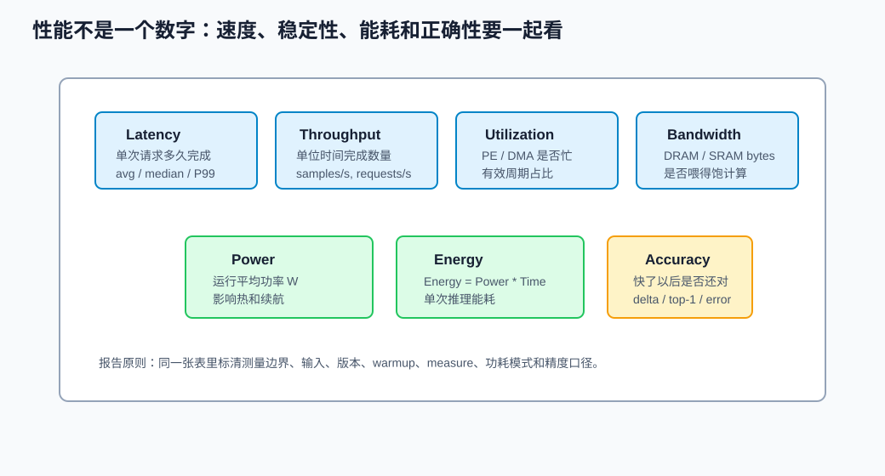
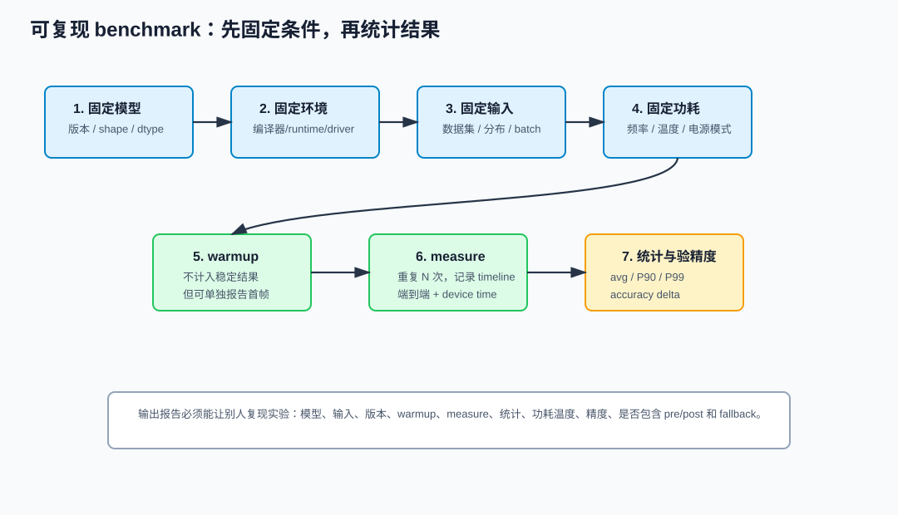
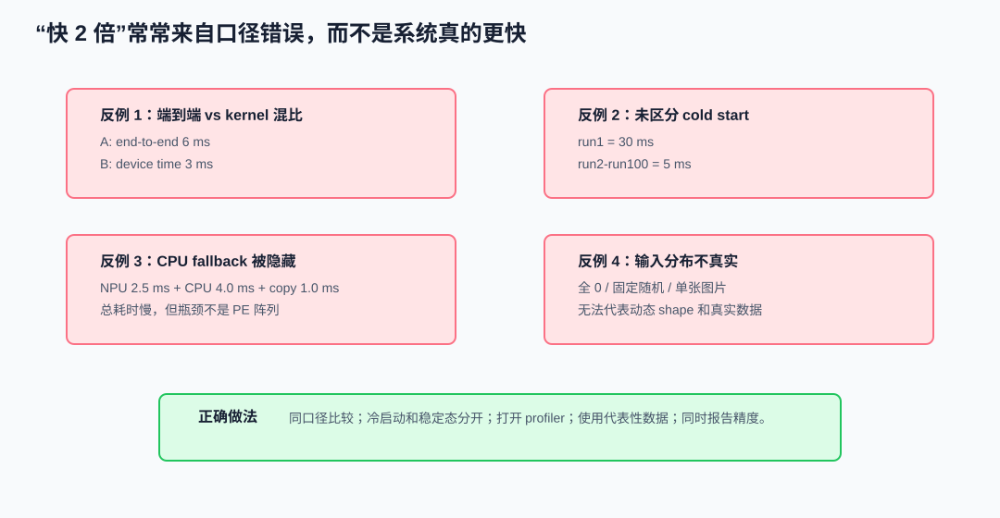
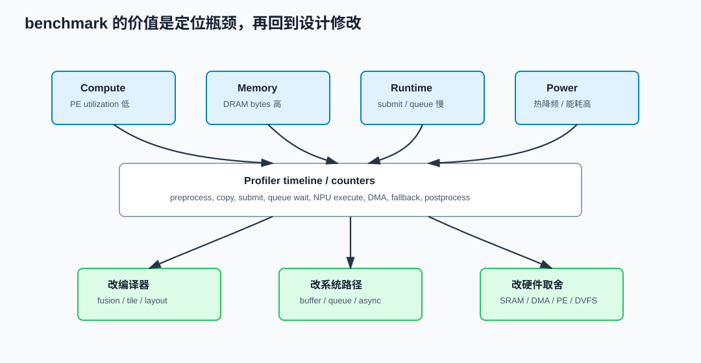

# 33 性能评测与基准测试

> 章节等级：A
> 状态：重组候选
> 来源映射：`chapter_source_map.csv` 中的 33 章；本章主要承接 SRC15，并补充 MLCommons、OpenVINO 与 Eyeriss 论文资料。

## 本章知识全景图

### 1. 一眼看懂本章在讲什么

- 本章主题：把 benchmark 写成可复现实验协议，而不是单个好看的延迟数字。
- 核心概念：latency / throughput / energy / effective TOPS / warmup / P50/P90/P99 / profiling
- 逻辑主线：性能评测必须同时说明测量边界、输入、预热、统计口径、精度校验和 profiling；否则平均延迟、TOPS 或单次运行都可能误导设计判断。
- 最小学习路径：测量边界 -> 指标公式 -> 实验协议 -> 分位数统计 -> profiling 反馈设计。

### 2. 概念地图

| 概念层级 | 核心概念 | 前置知识 | 延伸到 NPU 的位置 |
| --- | --- | --- | --- |
| 测量边界 | end-to-end、device、kernel | runtime | 数字能否横向比较 |
| 核心指标 | latency、throughput、energy | PPA | 性能和能耗判断 |
| 统计口径 | warmup、P50/P90/P99 | 实验设计 | 稳定性和尾延迟 |
| 反馈动作 | profiling | dataflow/buffer/fallback | 设计修改入口 |



### 3. 阅读顺序 / 处理顺序

- 先建立什么直觉：先把“性能评测与基准测试”落到一个可观察、可手算或可追踪的对象上。
- 再形式化什么定义或流程：围绕“先把“测什么”说清楚”和“核心指标和公式”整理概念边界、输入输出和约束。
- 最后通过什么例子、操作或推导固化：用“例题一：手算 latency、throughput、energy 和 effective TOPS”进入复现链，再回到 NPU 的 MAC、buffer、DMA、PE、编译器或 runtime 判断。
## 1. 先把“测什么”说清楚

评测的第一步不是写脚本，而是定义边界。常见边界有三类：

| 边界 | 起点 | 终点 | 适合回答的问题 |
|---|---|---|---|
| kernel/device time | NPU 开始执行命令 | NPU 完成命令 | 计算阵列、DMA、编译器映射是否高效 |
| runtime latency | runtime 收到 infer request | runtime 返回结果或 event | runtime/driver 提交、同步和设备执行整体是否高效 |
| end-to-end latency | 应用开始处理输入 | 应用拿到可用输出 | 用户体验、产品响应和真实部署效果 |

OpenVINO 官方性能页把 benchmark app、latency hint、throughput hint 和不同设备的性能设置放在同一套性能数字口径里：<https://docs.openvino.ai/2026/about-openvino/performance-benchmarks/getting-performance-numbers.html>。MLCommons Inference 文档则强调 benchmark 要有固定模型、数据集、场景、性能与精度要求：<https://docs.mlcommons.org/inference/index_gh/>。二者共同说明：性能数字必须绑定测量协议。

本地 SRC15 `C:\Users\11035\Desktop\ic\npu\14、NPU\《NPU性能评测与基准测试从入门到精通》\04.html` 给出 latency、throughput、utilization 等指标；`05.html` 讨论 benchmark 方法论；`20.html` 用 Roofline 看算力/带宽瓶颈；`30.html` 把评测结果反馈到架构修改。它们不是让你堆指标名，而是要求每个数字都能回答一个工程问题。

## 2. 核心指标和公式

| 指标 | 公式或口径 | 常见单位 | 解释 |
|---|---|---|---|
| latency | 单次请求完成时间 | ms | 单个请求多久返回 |
| throughput | 完成样本数 / 时间 | samples/s、requests/s | 单位时间完成多少 |
| utilization | 有效忙碌周期 / 总周期 | % | PE、DMA 或内存系统是否被用起来 |
| bandwidth | 搬运字节数 / 时间 | GB/s | 数据流是否喂得饱计算 |
| power | 单位时间能耗 | W | 瞬时或平均功耗 |
| energy per inference | power * time | J、mJ | 完成一次推理消耗多少能量 |
| effective TOPS | 实际 ops / 实际时间 / 10^12 | TOPS | 某个模型实际达到的吞吐 |
| accuracy delta | 优化后精度 - 基线精度 | %、pp | 快了以后是否还对 |

有效 TOPS 不能和峰值 TOPS 混用：

```text
peak TOPS = 硬件理想上限
effective TOPS = 当前模型、当前输入、当前编译和运行条件下测得的有效吞吐
```

Eyeriss 论文强调 DNN 加速器能效高度依赖数据移动和数据复用，而不只是乘加数量：<https://arxiv.org/abs/1604.07316>。这对 NPU benchmark 很关键：一个模型可能 MAC 数不大，但 memory copy、layout conversion 或外部 DRAM 访问把延迟和能耗拉高。

## 3. 例题一：手算 latency、throughput、energy 和 effective TOPS

测量 5 次端到端 latency：

```text
6.0 ms, 5.5 ms, 5.7 ms, 5.8 ms, 5.6 ms
```

平均 latency：

```text
(6.0 + 5.5 + 5.7 + 5.8 + 5.6) / 5
= 28.6 / 5
= 5.72 ms
```

batch size = 1 时，粗略吞吐：

```text
throughput = 1000 ms/s / 5.72 ms
≈ 174.8 samples/s
```

平均功率为 2 W 时，单次推理能耗：

```text
time = 5.72 ms = 0.00572 s
energy = 2 W * 0.00572 s
       = 0.01144 J = 11.44 mJ
```

如果这个模型估算有 `6e9 ops`，有效 TOPS：

```text
effective TOPS = 6e9 / 0.00572 / 1e12
               ≈ 1.05 TOPS
```

这组数字必须同时写明“端到端 latency、batch=1、平均功率 2 W、ops 估算方法”。否则别人无法复现，也无法判断它和另一个数字是否可比。

## 4. 可复现实验协议



一个最小但严肃的 NPU benchmark 表可以这样写：

| 项目 | 记录值 | 为什么必须记录 |
|---|---|---|
| model | `mobilenet_v2_int8.onnx`，commit/hash | 模型版本不同，性能和精度不同 |
| input shape | `1x224x224x3` | shape 改变会改变 tile、带宽和融合 |
| dtype/quant | int8 per-channel weight，int8 activation | 精度和 epilogue 路径相关 |
| batch/concurrency | batch=1，2 个 infer request | 影响 latency/throughput 取舍 |
| compiler/runtime/driver | 版本号和关键选项 | 编译映射和提交开销会变 |
| warmup | 20 次，不计入结果 | 排除加载、缓存、升频、首次编译 |
| measure | 200 次 | 让平均值和分位数有统计意义 |
| boundary | end-to-end + device time 都报 | 避免端到端和 kernel 混比 |
| power mode | fixed performance / balanced | 频率和功耗策略会改变结果 |
| temperature | 起始温度、结束温度 | 长跑可能热降频 |
| accuracy | 与 fp32 或官方基线对比 | 快了但错了不算成功 |

本地 SRC15 `07.html` 强调测试环境搭建，`08.html` 讲性能剖析工具，`09.html` 讲 benchmark 脚本基础。对零基础读者来说，脚本不是核心，核心是让脚本把这些字段固化下来。

## 5. 例题二：P90/P99 为什么比“平均值”更诚实

假设 10 次 end-to-end latency：

```text
5.0, 5.1, 5.0, 5.2, 5.1, 5.0, 5.2, 5.1, 5.0, 12.0 ms
```

平均值：

```text
sum = 57.7 ms
avg = 5.77 ms
```

中位数约为：

```text
median ≈ 5.1 ms
```

但最大值是 `12.0 ms`。如果交互应用偶尔卡一帧，用户能感知到；平均值会把它稀释。P90/P99 的目的就是暴露尾延迟。MLPerf Inference 的不同场景会区分吞吐和延迟约束，例如 Offline 更偏吞吐，Server/SingleStream 更关注延迟或尾延迟；官方规则源可以在 MLCommons inference policies 查看：<https://raw.githubusercontent.com/mlcommons/inference_policies/master/inference_rules.adoc>。

零基础阶段可以先用三行统计：

```text
avg latency
median latency
P90/P99 latency
```

如果 P99 很高，再去查 queue wait、thermal throttling、CPU fallback、cache miss、内存拷贝或系统调度。

## 6. 例题三：端到端和 device time 同时报

一次推理拆分如下：

```text
preprocess       0.6 ms
runtime submit   0.2 ms
queue wait       0.4 ms
NPU execute      2.0 ms
output sync      0.2 ms
postprocess      0.5 ms
total            3.9 ms
```

如果报告写成：

```text
latency = 2.0 ms
```

它只是在报 device time，不能代表用户体验。如果报告写成：

```text
end-to-end latency = 3.9 ms
device execution = 2.0 ms
submit/sync/queue = 0.8 ms
pre/post = 1.1 ms
```

读者就知道下一步优化方向：如果目标是用户延迟，pre/post 和 queue wait 也值得优化；如果目标是 NPU 架构，device execution 和带宽利用率更关键。



## 7. 错误 benchmark 的四个反例

### 反例一：A 报 end-to-end，B 报 kernel

```text
A: end-to-end 6 ms
B: NPU kernel 3 ms
```

不能得出 B 快两倍。B 可能还有 4 ms 的预处理、提交或后处理没有报。

### 反例二：第一次运行直接计入稳定结果

```text
run1 = 30 ms
run2-run100 = 5 ms
```

如果只报平均值，冷启动会污染 steady-state；如果产品关心首帧，就应单独报 cold start 和 warmed latency。

### 反例三：CPU fallback 被藏进端到端

模型有一段 unsupported op 回退 CPU：

```text
NPU execute: 2.5 ms
CPU fallback: 4.0 ms
copy NPU->CPU->NPU: 1.0 ms
```

如果 profiler 没打开，只看总耗时，会误以为 NPU 很慢；实际瓶颈是支持边界和数据往返。

### 反例四：只跑全 0 输入

某些输入分布会影响稀疏路径、cache 命中、分支、后处理范围和量化饱和。如果 benchmark 输入和真实场景差异太大，数字就不能指导部署。

## 8. Profiling：把数字变成判断



Profiling 的目标不是生成一堆曲线，而是回答“下一刀改哪里”。可以用下面的归因表：

| 现象 | 可能原因 | 下一步检查 |
|---|---|---|
| PE utilization 低 | tile 太小、shape 不适配、融合不足 | 编译日志、tile 形状、fused op 数 |
| DRAM bytes 高 | 中间张量写回多、layout conversion 多 | 图优化、memory trace、copy node |
| queue wait 高 | 并发过高、设备被其他任务占用 | queue depth、request timeline |
| submit overhead 高 | 小模型频繁提交、command buffer 重建 | batch、异步、多 request、command cache |
| power 高但吞吐低 | memory-bound 或等待多 | Roofline、带宽计数器、DVFS 状态 |
| accuracy 掉 | 量化/融合/近似计算改变数值 | 层级误差、敏感层、Q/DQ 边界 |

Roofline 模型的用法是：先算计算强度 `ops / byte`，再看模型是被峰值算力限制还是被带宽限制。本地 SRC15 `20.html` 用 Roofline 诊断 NPU 性能瓶颈；这和第 18 章的带宽瓶颈、31 章的融合减少中间搬运可以连起来。

## 9. 例题四：一个可复现实验表

假设我们要比较两个编译选项：

```text
Option A: fusion off
Option B: fusion on
```

实验表：

| 字段 | A | B |
|---|---:|---:|
| warmup | 20 | 20 |
| measure | 200 | 200 |
| avg latency | 6.2 ms | 4.8 ms |
| P90 latency | 6.6 ms | 5.1 ms |
| P99 latency | 8.9 ms | 5.8 ms |
| throughput | 161 samples/s | 208 samples/s |
| NPU execute | 4.0 ms | 3.2 ms |
| memory copy | 1.1 ms | 0.4 ms |
| CPU fallback | 0 | 0 |
| power | 2.1 W | 2.3 W |
| energy | 13.0 mJ | 11.0 mJ |
| top-1 delta | 0 pp | -0.1 pp |

结论不能只写“B 快”。更合格的写法是：

```text
B 通过融合把 memory copy 从 1.1 ms 降到 0.4 ms，
平均 latency 从 6.2 ms 降到 4.8 ms，
P99 从 8.9 ms 降到 5.8 ms；
功率略升但单次能耗下降，
top-1 只下降 0.1 个百分点，在验收阈值内。
```

这段结论把性能、稳定性、能耗和精度同时交代清楚，下一步才能决定是否采用。

## 10. 从评测反馈到设计修改

本地 SRC15 `30.html` 讲从评测到架构反馈。对 NPU 设计学习来说，benchmark 的终点不是排行榜，而是反馈链：

```text
benchmark 发现 bottleneck
  -> profiler 定位是 compute / memory / runtime / power / accuracy
  -> 修改编译器策略、buffer 规划、fusion、DMA、PE 阵列或电源策略
  -> 重新运行同一协议
  -> 比较是否真正改善
```

不同瓶颈对应不同改法：

| 瓶颈 | 优先改法 |
|---|---|
| compute-bound | 提高 PE 利用率、tile 映射、并行度、频率 |
| memory-bound | 融合、数据复用、SRAM 容量、DMA 重叠、layout 规划 |
| runtime-bound | 减少提交次数、异步队列、复用 command/buffer |
| power-bound | 降低访存、调整 DVFS、减少空转、提升能效 |
| accuracy-bound | 量化校准、敏感层保留高精度、检查融合数值边界 |

## 11. 常见误区与判断线索

### 误区 1：只报平均延迟就够了

- 错误说法：平均 5 ms 就代表体验稳定。
- 为什么错：平均值会隐藏长尾，偶发 30 ms 卡顿对交互体验很明显。
- 正确模型：同时报告 avg、median、P90/P99，必要时画时间线。
- 工程后果：只看平均值可能上线一个尾延迟很差的系统。
- 判断线索：查看 latency 分布、queue wait、CPU 调度、thermal throttling 和 fallback。

### 误区 2：峰值 TOPS 可以直接代表模型速度

- 错误说法：2 TOPS NPU 一定比 1 TOPS NPU 快两倍。
- 为什么错：真实模型受带宽、利用率、tile、融合、runtime、功耗和输入 shape 限制。
- 正确模型：峰值 TOPS 是硬件上限，effective TOPS 才是当前 workload 的实测效率。
- 工程后果：只按 TOPS 选型会误判低利用率、小模型和 memory-bound 模型。
- 判断线索：同时看 effective TOPS、utilization、DRAM bytes、Roofline 位置和功耗。

### 误区 3：benchmark 不需要精度验证

- 错误说法：只要 latency 下降，优化就成功。
- 为什么错：量化、融合、近似计算、layout 错误都可能让输出变坏。
- 正确模型：性能提升必须和 accuracy delta 或逐层误差一起验收。
- 工程后果：可能把“更快但错”的模型发布出去。
- 判断线索：比较基线输出、精度指标、层级误差、Q/DQ 边界和敏感层。

### 误区 4：warmup 是可有可无的细节

- 错误说法：直接从第一次运行开始统计即可。
- 为什么错：第一次运行可能包含加载、编译缓存、内存池建立、NPU 唤醒和升频。
- 正确模型：cold start 和 warm steady-state 要分开报告。
- 工程后果：产品首帧延迟和稳定吞吐会被混在一起，优化方向错位。
- 判断线索：单独记录 run1、warmup 后 avg/P99、model cache 是否命中和频率状态。

### 误区 5：端到端和 kernel 时间可以混比

- 错误说法：A 的端到端 8 ms 可以直接和 B 的 device time 4 ms 比。
- 为什么错：两个数字包含的链路不同。
- 正确模型：比较必须同口径；最好同时报告 end-to-end、runtime overhead 和 device execution。
- 工程后果：会错误评估编译器、runtime 或硬件改动效果。
- 判断线索：看测量起止点、profiler 标记、是否包含 pre/post、copy、submit 和 sync。

### 误区 6：输入数据随便造也能代表真实部署

- 错误说法：全 0、固定随机数或单张图片就能代表模型性能。
- 为什么错：真实输入分布会影响 cache、稀疏性、动态 shape、后处理范围和精度。
- 正确模型：benchmark 输入要么来自代表性数据集，要么明确说明是 synthetic stress case。
- 工程后果：部署后可能遇到完全不同的延迟、功耗和精度表现。
- 判断线索：记录数据来源、预处理方式、shape 分布、序列长度或图像尺寸分布。

## 12. 最后速记

### 本章最该记住的结论

- benchmark 的第一步是说清楚测什么：端到端、device time 还是 kernel time。
- 平均值不够，尾延迟和波动常常暴露调度、fallback、温控或输入分布问题。
- 性能数字必须配精度验证，否则可能只是测到错误输出很快。
- 好的 benchmark 会反馈到模型、编译器、runtime、buffer、DMA 或 PE 设计修改。

### 复现 / 复习清单

- 能手算 latency、throughput、energy per inference 和 effective TOPS。
- 能写出一个包含 warmup、重复次数、输入分布、精度校验和统计分位数的实验协议。
- 能解释端到端时间和 device time 为什么不能混比。
- 能从 profiling 中判断瓶颈在 fallback、DMA、PE 利用率还是 host 调度。

### 自测题

### 题目

1. latency 和 throughput 的区别是什么？
2. 为什么端到端 latency 和 device time 不能混比？
3. effective TOPS 怎么计算？
4. 5 次 latency 为 `4, 5, 5, 6, 5 ms`，平均是多少？
5. 平均 latency `5 ms`、batch size 1 时，吞吐约是多少？
6. 功率 `2 W`，单次推理 `10 ms`，能耗是多少？
7. 为什么 benchmark 要做 warmup？
8. 为什么 P90/P99 比平均值更能暴露稳定性？
9. CPU fallback 会怎样污染 NPU benchmark？
10. 写出一个最小 benchmark 必须记录的环境字段。
11. Roofline 模型主要帮助判断什么？
12. 如果优化后 latency 降低但 accuracy 明显下降，应该怎样判定？

### 答案或评分点

1. latency 是单次完成时间；throughput 是单位时间完成数量。
2. 端到端包含 pre/post、runtime、driver、queue、sync；device time 只看 NPU 执行。
3. `actual ops / elapsed time / 1e12`，必须说明 ops 估算和测量边界。
4. `(4+5+5+6+5)/5 = 5 ms`。
5. `1000/5 = 200 samples/s`。
6. `10 ms = 0.01 s`，能耗 `2 * 0.01 = 0.02 J`。
7. 排除或单独观察首次加载、编译缓存、内存池、NPU 唤醒和升频。
8. 长尾会被平均值稀释，P90/P99 能暴露偶发卡顿。
9. CPU fallback 会增加 CPU 执行和 NPU/CPU 之间 copy，使瓶颈不再是纯 NPU。
10. 模型版本、input shape、dtype、batch、编译器/runtime/driver 版本、电源模式、温度、warmup、measure 次数等。
11. 判断 workload 是算力受限还是带宽受限，并指导计算阵列或内存路径优化。
12. 不能直接判为成功；必须看精度阈值，必要时调整量化、融合或敏感层策略。

## 来源与核对

- 本地 HTML：SRC15 `C:\Users\11035\Desktop\ic\npu\14、NPU\《NPU性能评测与基准测试从入门到精通》\04.html`（标题：NPU性能评测核心概念），用于 latency、throughput、utilization、power、energy 等指标定义。
- 本地 HTML：SRC15 `C:\Users\11035\Desktop\ic\npu\14、NPU\《NPU性能评测与基准测试从入门到精通》\05.html`（标题：NPU基准测试方法论），用于可复现 benchmark 协议和报告字段。
- 本地 HTML：SRC15 `C:\Users\11035\Desktop\ic\npu\14、NPU\《NPU性能评测与基准测试从入门到精通》\07.html`（标题：测试环境搭建），用于环境、版本、电源和温度记录。
- 本地 HTML：SRC15 `C:\Users\11035\Desktop\ic\npu\14、NPU\《NPU性能评测与基准测试从入门到精通》\08.html`（标题：性能剖析工具入门），用于 profiler 归因和时间线拆分。
- 本地 HTML：SRC15 `C:\Users\11035\Desktop\ic\npu\14、NPU\《NPU性能评测与基准测试从入门到精通》\09.html`（标题：基准测试脚本编写基础），用于脚本化 warmup、measure 和统计字段。
- 本地 HTML：SRC15 `C:\Users\11035\Desktop\ic\npu\14、NPU\《NPU性能评测与基准测试从入门到精通》\20.html`（标题：Roofline模型），用于算力/带宽瓶颈诊断。
- 本地 HTML：SRC15 `C:\Users\11035\Desktop\ic\npu\14、NPU\《NPU性能评测与基准测试从入门到精通》\30.html`（标题：从评测到架构反馈），用于从 benchmark 到设计修改的闭环。
- 外部官方：MLCommons Inference documentation，用于固定场景、模型、数据集、精度和性能报告口径：<https://docs.mlcommons.org/inference/index_gh/>。
- 外部官方：MLCommons inference policies，用于不同推理场景、吞吐与延迟约束的规则来源：<https://raw.githubusercontent.com/mlcommons/inference_policies/master/inference_rules.adoc>。
- 外部官方：OpenVINO Getting Performance Numbers，用于 benchmark app、latency/throughput hint 和性能数字口径：<https://docs.openvino.ai/2026/about-openvino/performance-benchmarks/getting-performance-numbers.html>。
- 外部论文：Eyeriss，`Eyeriss: A Spatial Architecture for Energy-Efficient Dataflow for Convolutional Neural Networks`，用于数据移动、数据复用和能效评测背景：<https://arxiv.org/abs/1604.07316>。
