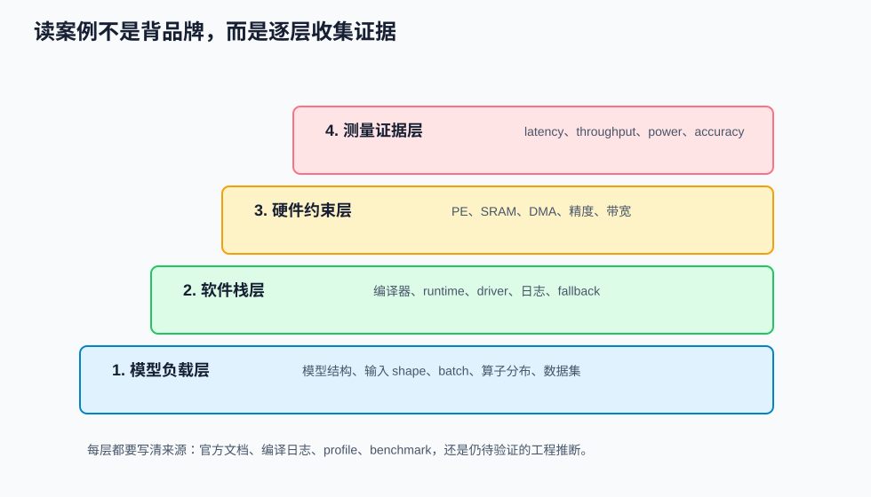
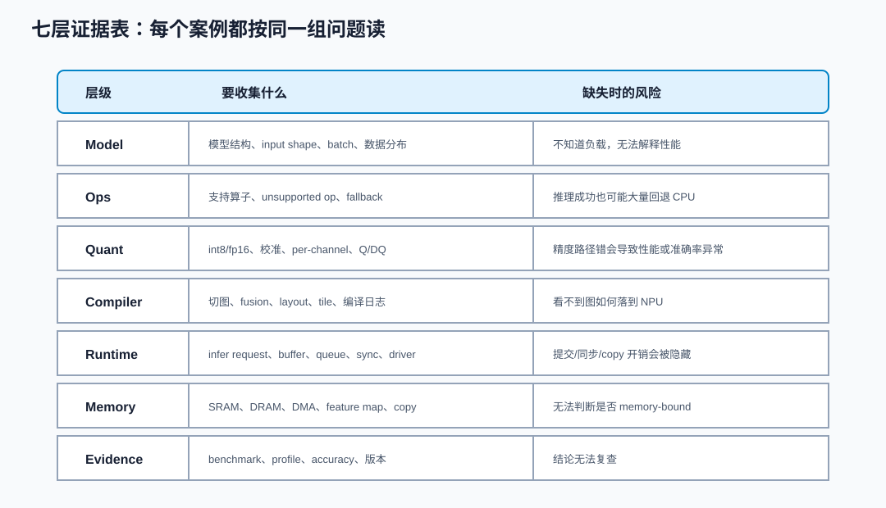
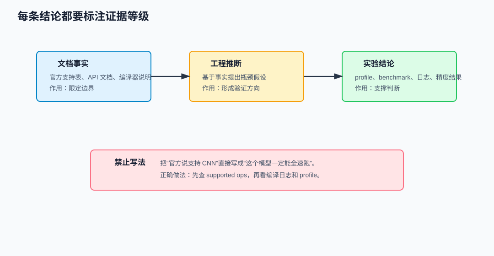
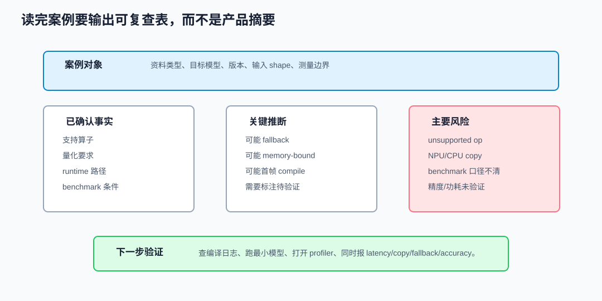

# 34 真实 NPU 案例阅读方法

> 章节等级：A
> 状态：重组候选
> 来源映射：`chapter_source_map.csv` 中的 34 章；本章主要承接 SRC02、SRC03、SRC05、SRC09，并补充 Arm、Coral、OpenVINO、VeriSilicon 官方资料。

## 本章知识全景图

### 1. 一眼看懂本章在讲什么

- 本章主题：把真实 NPU 案例阅读变成证据分层、推断边界和实验核对。
- 核心概念：case reading / evidence layer / official docs / compiler log / benchmark / supported ops
- 逻辑主线：读真实 NPU 资料不能只摘 TOPS 或营销图，而要把官方事实、日志证据、benchmark 条件和自己的工程推断分开，避免把宣传口径当成可迁移结论。
- 最小学习路径：资料类型 -> 七层证据表 -> 编译/运行日志 -> benchmark 条件 -> 可迁移判断。

### 2. 概念地图

| 概念层级 | 核心概念 | 前置知识 | 延伸到 NPU 的位置 |
| --- | --- | --- | --- |
| 事实层 | official docs、datasheet | 资料阅读 | 可引用事实 |
| 执行层 | compiler/runtime log | 部署链路 | 是否真的跑在 NPU |
| 评测层 | benchmark condition | 性能评测 | 数字是否可比 |
| 推断层 | learning takeaway | 架构判断 | 迁移到自己项目 |



### 3. 阅读顺序 / 处理顺序

- 先建立什么直觉：先把“真实NPU案例阅读方法”落到一个可观察、可手算或可追踪的对象上。
- 再形式化什么定义或流程：围绕“先判断资料类型”和“七层证据表”整理概念边界、输入输出和约束。
- 最后通过什么例子、操作或推导固化：用“例题一：从一段编译日志读出风险”进入复现链，再回到 NPU 的 MAC、buffer、DMA、PE、编译器或 runtime 判断。
## 1. 先判断资料类型

看到一份 NPU 资料时，先不要读正文，先判断它属于哪类：

| 资料类型 | 常见形式 | 能证明什么 | 不能直接证明什么 |
|---|---|---|---|
| 产品页 | TOPS、能效、框图、支持场景 | 产品定位、公开能力边界 | 某个模型真实 latency |
| 编译器文档 | 命令行、支持算子、报错说明 | 图转换和 NPU 映射规则 | runtime 是否无拷贝 |
| SDK/runtime 文档 | API、buffer、异步推理 | 模型如何被提交执行 | 硬件内部 dataflow |
| profile/benchmark | latency、throughput、功耗、日志 | 某条件下的实测表现 | 换输入/版本后的表现 |
| 论文/IP 白皮书 | 架构、SRAM、DMA、PE、数据流 | 设计思想和硬件约束 | SDK 当前支持边界 |

Arm Ethos-U55 官方页属于产品/IP 入口：<https://www.arm.com/products/silicon-ip-cpu/ethos/ethos-u55>。Google Coral Edge TPU Compiler 文档属于编译器入口，重点是模型如何被编译到 Edge TPU、哪些操作可能不支持：<https://www.coral.ai/docs/edgetpu/compiler/>。OpenVINO NPU 设备文档属于 runtime/plugin 入口，说明 NPU plugin、compiler、driver、model caching 和设备执行路径：<https://docs.openvino.ai/2026/openvino-workflow/running-inference/inference-devices-and-modes/npu-device.html>。VeriSilicon Vivante NPU IP 页面属于商用 NPU IP 入口：<https://www.verisilicon.com/en/IPPortfolio/VivanteNPUIP>。

资料类型决定你的读法。产品页不能当 benchmark，benchmark 也不能替代算子支持表。

## 2. 七层证据表

真实案例可以统一写成：

```text
Case = {
  Model:    模型结构、输入 shape、batch、数据分布,
  Ops:      支持/不支持算子，是否 fallback,
  Quant:    int8/fp16/int16、per-tensor/per-channel、校准要求,
  Compiler: 图切分、layout、tile、fusion、报错和日志,
  Runtime:  compiled model、infer request、buffer、queue、sync,
  Memory:   SRAM/DRAM、DMA、feature map 中间搬运、copy,
  Evidence: benchmark、profile、精度、功耗、版本和复现条件
}
```



本地 SRC05 `C:\Users\11035\Desktop\ic\npu\14、NPU\《NPU Intel OpenVINO NPU插件从入门到精通》\04.html` 和 `05.html` 讲模型准备、NPU 插件和基础推理流程；SRC03 `...\《NPU Google Edge TPU开发板实战从入门到精通》\05.html` 讲模型转换与编译；SRC02 `...\《NPU Arm Ethos-U55U85架构编程从入门到精通》\04.html` 讲软件栈全景；SRC09 `...\《NPU VeriSilicon VIP9000系列开发从入门到精通》\04.html` 和 `08.html` 讲 VIP9000 软件栈和 runtime API。它们看似分散，其实都能填进同一张七层表。

## 3. 例题一：从一段编译日志读出风险

假设编译日志如下：

```text
Input -> Conv2D -> ReLU -> Resize -> Conv2D -> Softmax

Conv2D_0: mapped to NPU
ReLU_0: fused into Conv2D_0
Resize_0: not supported, fallback to CPU
Conv2D_1: mapped to NPU
Softmax_0: fallback to CPU
```

不要只写“有两个算子回退”。要把它变成证据表：

| 层 | 设备 | 证据 | 风险 |
|---|---|---|---|
| Conv2D_0 | NPU | log: mapped | 需要确认 input layout 和量化方式 |
| ReLU_0 | NPU fused | log: fused | 融合成功，减少中间写回 |
| Resize_0 | CPU | log: fallback | NPU -> CPU -> NPU copy 和同步，可能打断流水 |
| Conv2D_1 | NPU | log: mapped | 如果前一层 CPU 输出 layout 不匹配，可能额外转换 |
| Softmax_0 | CPU | log: fallback | 分类头小，可能不是主瓶颈，但要计入端到端 |

下一步不是“换 NPU”，而是查三个问题：

```text
Resize 为什么不支持？是算子类型、shape、dtype，还是编译器版本？
CPU fallback 是否产生了 device copy？
端到端 latency 中 fallback 和 copy 占多少？
```

如果 profile 显示 `Resize + copy` 占总延迟 45%，优化方向可能是改模型上采样方式、升级编译器、把 Resize 前后都放 CPU，或者接受异构切图。这个结论比“这个 NPU 不行”更可执行。

## 4. 文档事实、工程推断、实验结论要分开



案例阅读最容易犯的错误，是把三类话混在一起：

| 类型 | 例子 | 写法 |
|---|---|---|
| 文档事实 | Coral compiler 文档列出不支持操作会导致编译失败或映射失败 | “根据官方编译器文档，需检查 unsupported op 日志。” |
| 工程推断 | Resize 回退可能导致额外 copy | “推断：若回退发生在两段 NPU 子图之间，可能产生 NPU/CPU 数据往返。” |
| 实验结论 | profile 显示 copy 占 1.2 ms | “实验：在本模型、本版本、本输入下，copy 占 1.2 ms。” |

只有第三类能直接支撑“本案例瓶颈在哪里”。第一类提供边界，第二类提供假设，第三类提供证据。高质量案例笔记必须给每个结论贴上来源类型。

## 5. 例题二：读一个 OpenVINO NPU 推理路径

OpenVINO NPU 路径可以按第 32 章的 runtime/driver 生命周期读：

```text
read model
compile model to NPU device
create infer request
set input tensor
start inference
wait / get output
```

案例表：

| 七层 | 要查的问题 |
|---|---|
| Model | 模型格式、输入 shape 是否固定，动态 shape 如何处理 |
| Ops | 编译后有多少子图在 NPU，是否出现 CPU fallback |
| Quant | FP16/int8 是否支持，量化是否影响 NPU 路径 |
| Compiler | 首次 compile 是否慢，model cache 是否命中 |
| Runtime | infer request 是同步还是异步，是否多 request 并发 |
| Memory | input/output 是否有额外 copy，layout 是否转换 |
| Evidence | benchmark_app 或 profiler 是否同时给 end-to-end 与 device 信息 |

如果首帧很慢，先不要归因到 NPU 计算。OpenVINO NPU 设备文档把 compiler、driver 和 model caching 都列入 NPU 设备路径；首帧可能包含编译或缓存加载。正确写法是：“当前资料说明 NPU 路径包含 compile/cache 环节；若首帧慢，需要分开测 cold start 和 warmed inference。”

## 6. 例题三：读一个 Edge TPU 编译器案例

Edge TPU 文档常见的阅读入口是 compiler。对零基础读者来说，最重要的不是记命令行，而是读懂编译结果：

```text
edgetpu_compiler model.tflite
```

你应该寻找：

| 信息 | 为什么重要 |
|---|---|
| 是否成功编译 | 失败意味着模型结构或量化不满足目标 |
| mapped operations 数量 | 判断主干是否落到 NPU |
| unsupported operations | 定位改模型或换算子的方向 |
| input/output tensor 信息 | 判断量化、shape 和前后处理 |
| 编译器版本 | 支持范围可能随版本变化 |

假设日志说：

```text
Operator DEPTHWISE_CONV_2D mapped
Operator RESIZE_BILINEAR not supported
```

结论应写成：

```text
文档事实：当前编译器路径对 RESIZE_BILINEAR 不支持或不满足条件。
工程推断：如果 Resize 位于两个 NPU 子图之间，会引入 CPU fallback 和数据往返。
下一步验证：用 profiler 测 Resize 周围的 copy 和 latency；尝试改成编译器支持的上采样结构。
```

## 7. 例题四：读一个商用 NPU IP 页面

商用 NPU IP 页面常写：

```text
高 TOPS
支持多种神经网络
高能效
可配置
完整软件栈
```

这些词是入口，不是结论。你要把它们拆成问题：

| 产品词 | 工程问题 |
|---|---|
| 高 TOPS | 在 int8 还是 fp16？频率和面积条件是什么？ |
| 支持多种网络 | 支持哪些算子、shape、量化和动态维度？ |
| 高能效 | benchmark 输入、功耗测量、温度和数据搬运如何定义？ |
| 可配置 | PE、SRAM、DMA、总线宽度、精度单元哪些可配置？ |
| 完整软件栈 | 编译器、runtime、driver、profiler、模型转换工具是否公开？ |

如果页面没有给出 benchmark 细节，就不能写“它一定比另一个 NPU 快”。最多能写：“该资料提供公开产品定位和可配置方向；具体模型适配、算子边界和性能要查 SDK 文档、支持表和实测报告。”

## 8. 案例阅读输出模板

一份 reader-facing 案例阅读笔记可以这样收尾：

```text
案例对象：
资料类型：
目标模型/场景：

已确认事实：
1. ...
2. ...

关键推断：
1. ...（需要 profile 验证）
2. ...

主要风险：
1. 算子/精度边界
2. CPU fallback 与数据 copy
3. benchmark 口径不清

下一步验证：
1. 查编译日志
2. 跑最小模型
3. 打开 profiler
4. 同时报 end-to-end、device time、copy、fallback、精度
```



这个模板避免了两种低质量写法：一种是产品介绍式摘抄，另一种是凭感觉判断强弱。它要求你把结论、证据和缺口放在同一页。

## 9. 与全书主线的连接

读真实案例时，可以沿着全书链路反查：

```text
模型图
  -> 算子支持和量化边界
  -> 编译器切图、fusion、layout、tile
  -> SRAM、DMA、PE、dataflow、partial sum
  -> runtime/driver 提交和同步
  -> benchmark、功耗、精度和瓶颈归因
```

如果案例中出现性能异常，优先把异常定位到链路中的一段：

| 异常 | 优先查 |
|---|---|
| 编译失败 | 算子、shape、dtype、量化、版本 |
| 编译成功但慢 | fallback、copy、layout conversion、tile、带宽 |
| 首帧慢 | compile/cache、NPU 唤醒、runtime 初始化 |
| 稳态慢 | NPU execute、DRAM bytes、PE utilization、queue wait |
| 精度差 | 量化校准、Q/DQ、融合、敏感层 |

这就是案例阅读的价值：它把真实资料变成可复用的调试地图。

## 10. 常见误区与判断线索

### 误区 1：只看 TOPS 就能判断 NPU 强弱

- 错误说法：TOPS 越高，任何模型都越快。
- 为什么错：真实性能还取决于算子支持、量化、片上存储、带宽、编译器切图和 runtime 开销。
- 正确模型：TOPS 是峰值计算能力，案例阅读必须同时看模型、软件栈和测量条件。
- 工程后果：会错误选型，尤其会误判 memory-bound、小模型和 fallback 多的模型。
- 判断线索：看 effective TOPS、supported ops、profile、DRAM bytes、fallback 和 benchmark 口径。

### 误区 2：推理成功就说明整图都在 NPU 上

- 错误说法：SDK 能跑通模型，说明每一层都在 NPU 上执行。
- 为什么错：很多系统允许部分算子回退到 CPU、DSP 或其他设备，应用仍然看到成功结果。
- 正确模型：推理成功只说明系统给出输出，不说明设备分配。
- 工程后果：端到端延迟可能被 CPU fallback 和数据 copy 主导，却被误认为 NPU 计算慢。
- 判断线索：查编译日志、设备分配、profile timeline、copy node 和 CPU utilization。

### 误区 3：案例阅读就是摘抄产品文档

- 错误说法：把官方介绍复制进笔记，就算读懂案例。
- 为什么错：产品文档按宣传和功能组织，不一定回答模型如何落到 NPU、瓶颈在哪里。
- 正确模型：把资料重排成七层证据表，并区分事实、推断和实验结论。
- 工程后果：笔记无法指导调试、选型或模型修改。
- 判断线索：检查每条结论是否有来源、证据等级、风险和下一步验证。

### 误区 4：一个 NPU 的经验可以无条件迁移

- 错误说法：某模型在 A NPU 上需要 int8，在 B NPU 上也一定如此。
- 为什么错：不同 NPU 的精度路径、算子集合、SRAM、DMA、编译器和 runtime 都可能不同。
- 正确模型：迁移问题清单，不迁移未经验证的结论。
- 工程后果：会把 A 平台的约束错当成通用规律，导致错误优化。
- 判断线索：重新查 B 平台的 supported ops、quantization、compiler log 和 benchmark。

### 误区 5：网页上的 benchmark 数字可以直接横向排序

- 错误说法：两个网页都写 latency，就能直接比谁快。
- 为什么错：输入大小、batch、预处理、后处理、软件版本、功耗模式和测量范围可能不同。
- 正确模型：只有测量条件一致或可归一化时，benchmark 才能支持横向比较。
- 工程后果：会用不公平数字做选型或论文结论。
- 判断线索：看 input shape、dtype、batch、warmup、measure、是否包含 pre/post、温度和版本。

### 误区 6：编译成功等于部署完成

- 错误说法：模型能编译，后面就没有风险。
- 为什么错：runtime buffer、驱动版本、内存 copy、异步同步、首帧编译缓存、温度和功耗模式都会影响部署。
- 正确模型：编译成功是中点，不是终点；必须继续验证运行、profile、精度和 benchmark。
- 工程后果：上线后可能出现首帧慢、间歇 timeout、精度漂移或热降频。
- 判断线索：跑 cold/warm benchmark，打开 profiler，查 driver/runtime 版本和错误日志。

## 11. 最后速记

### 本章最该记住的结论

- 真实案例阅读要区分文档事实、工程推断和实验结论。
- 推理成功不等于整图在 NPU 上执行，必须看子图、fallback 和运行日志。
- TOPS、延迟和能耗数字只有在输入、batch、精度、测量边界一致时才可比较。
- 一个 NPU 的经验能否迁移，取决于算子集合、数据流、存储层级、软件栈和目标场景是否相近。

### 复现 / 复习清单

- 能用七层证据表阅读一个 NPU 页面或编译日志。
- 能把官方事实、实验结果和自己的推断分开写。
- 能从日志中找出 supported ops、fallback、layout/quantization 转换和 profiling 线索。
- 能说明一个 benchmark 数字为什么不能直接横向排序。

### 自测题

### 题目

1. 真实 NPU 案例阅读的七层证据表包含哪七类？
2. 产品页、编译器文档、runtime 文档和 benchmark 分别能证明什么？
3. 为什么不能只看 TOPS 判断一个 NPU 是否适合某模型？
4. 编译日志里某算子 fallback 到 CPU，至少可能带来哪两类影响？
5. “文档事实”“工程推断”“实验结论”有什么区别？
6. 读 OpenVINO NPU 推理路径时，为什么要区分 cold start 和 warmed inference？
7. 读 Edge TPU 编译器日志时，unsupported op 应该引出哪些问题？
8. 商用 NPU IP 页面写“高能效”，你应该追问什么？
9. 为什么推理成功不等于整图在 NPU 上？
10. benchmark 数字横向比较前要核对哪些条件？
11. 如果 profile 显示 CPU fallback 占 40%，下一步有哪些可能动作？
12. 为什么案例阅读输出要写“下一步验证”？

### 答案或评分点

1. Model、Ops、Quant、Compiler、Runtime、Memory、Evidence。
2. 产品页证明公开定位和能力边界；编译器文档证明映射规则；runtime 文档证明执行路径；benchmark 证明某条件下实测表现。
3. TOPS 是峰值计算能力，真实模型还受算子、精度、带宽、编译器、runtime 和测量条件影响。
4. 可能增加 CPU/NPU 数据往返和同步，也可能打断融合、流水和片上数据复用。
5. 文档事实直接来自资料；工程推断是基于事实的假设；实验结论来自特定条件下测量。
6. 首帧可能包含编译、缓存、初始化和设备唤醒，不能和稳定推理混报。
7. 问它是算子类型、shape、dtype、量化还是版本限制，并用 profile 看 fallback/copy 成本。
8. 问模型、输入、精度、功耗测量、温度、数据搬运和 benchmark 口径。
9. 系统可能自动使用 CPU/DSP/其他设备完成部分算子。
10. input shape、dtype、batch、版本、是否包含 pre/post、warmup、measure、电源温度、精度。
11. 改模型结构、换支持算子、升级编译器、调整切图、接受异构但减少 copy，或重测瓶颈。
12. 因为案例资料常不完整，下一步验证能把推断推进成证据。

## 来源与核对

- 本地 HTML：SRC02 `C:\Users\11035\Desktop\ic\npu\14、NPU\《NPU Arm Ethos-U55U85架构编程从入门到精通》\04.html`（标题：软件栈全景），用于微控制器 NPU 软件栈案例阅读。
- 本地 HTML：SRC03 `C:\Users\11035\Desktop\ic\npu\14、NPU\《NPU Google Edge TPU开发板实战从入门到精通》\05.html`（标题：模型转换与编译），用于编译器日志、unsupported op 和模型转换边界。
- 本地 HTML：SRC03 `C:\Users\11035\Desktop\ic\npu\14、NPU\《NPU Google Edge TPU开发板实战从入门到精通》\06.html`（标题：图像分类实战：MobileNet V2在Edge TPU上的部署），用于端侧模型部署案例阅读。
- 本地 HTML：SRC05 `C:\Users\11035\Desktop\ic\npu\14、NPU\《NPU Intel OpenVINO NPU插件从入门到精通》\04.html`（标题：模型准备与优化 - OpenVINO NPU插件），用于模型准备、NPU 可执行区域和设备兼容性。
- 本地 HTML：SRC05 `C:\Users\11035\Desktop\ic\npu\14、NPU\《NPU Intel OpenVINO NPU插件从入门到精通》\05.html`（标题：基础推理流程），用于 OpenVINO NPU runtime 路径。
- 本地 HTML：SRC05 `C:\Users\11035\Desktop\ic\npu\14、NPU\《NPU Intel OpenVINO NPU插件从入门到精通》\08.html`（标题：性能剖析工具），用于 profile 证据和性能归因。
- 本地 HTML：SRC09 `C:\Users\11035\Desktop\ic\npu\14、NPU\《NPU VeriSilicon VIP9000系列开发从入门到精通》\04.html`（标题：VIP9000软件栈总览），用于商用 NPU IP 软件栈阅读。
- 本地 HTML：SRC09 `C:\Users\11035\Desktop\ic\npu\14、NPU\《NPU VeriSilicon VIP9000系列开发从入门到精通》\08.html`（标题：VIP9000运行时API详解），用于 runtime API 和执行路径阅读。
- 外部官方：Arm Ethos-U55 product page，用于公开产品/IP 阅读入口：<https://www.arm.com/products/silicon-ip-cpu/ethos/ethos-u55>。
- 外部官方：Google Coral Edge TPU Compiler documentation，用于编译器、unsupported operation 和映射日志阅读入口：<https://www.coral.ai/docs/edgetpu/compiler/>。
- 外部官方：OpenVINO NPU device documentation，用于 NPU plugin、compiler、driver、model caching 和设备执行路径：<https://docs.openvino.ai/2026/openvino-workflow/running-inference/inference-devices-and-modes/npu-device.html>。
- 外部官方：VeriSilicon Vivante NPU IP page，用于商用 NPU IP 公开资料阅读入口：<https://www.verisilicon.com/en/IPPortfolio/VivanteNPUIP>。
