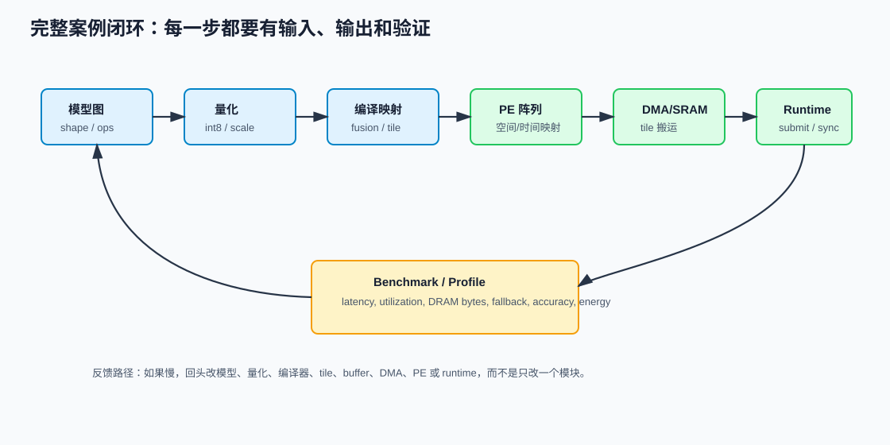
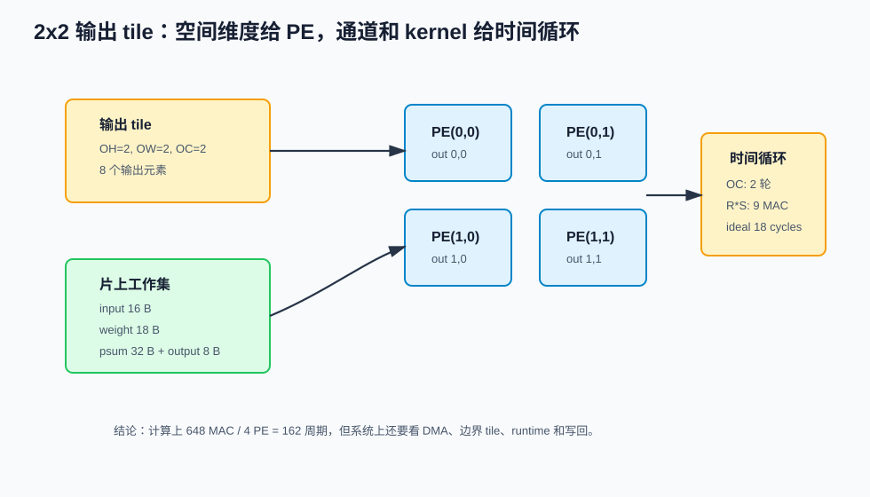
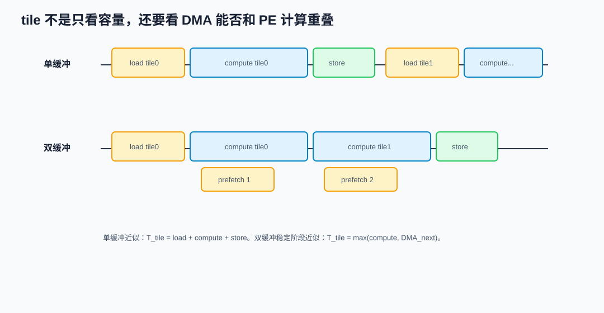
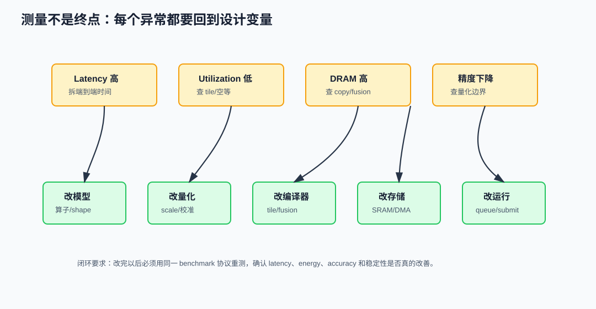

# 35 从模型到 NPU 设计完整案例

> 章节等级：A
> 状态：重组候选
> 来源映射：`chapter_source_map.csv` 中的 35 章；本章主要承接 SRC17、SRC12、SRC18、SRC08、SRC15，并补充 ONNX、TVM、MLIR、Gemmini、MLCommons 等公开资料。

## 本章知识全景图

### 1. 一眼看懂本章在讲什么

- 本章主题：用 ToyCamNet 把模型、量化、tile、PE、DMA、runtime 和 benchmark 串成闭环。
- 核心概念：ToyCamNet / shape / MAC / byte / quantization / tile / PE mapping / runtime / benchmark feedback
- 逻辑主线：端到端案例的价值不是“跑通一次”，而是把每一层的 shape、MAC、byte、量化、buffer、dataflow、runtime 和 benchmark 反馈连成可检查链。
- 最小学习路径：模型图 -> shape/MAC/byte -> 量化/accumulator -> tile/dataflow -> runtime 提交 -> benchmark 反馈。

### 2. 概念地图

| 概念层级 | 核心概念 | 前置知识 | 延伸到 NPU 的位置 |
| --- | --- | --- | --- |
| 模型层 | ToyCamNet | CNN 基础 | 工作负载定义 |
| 数值层 | int8/int32、requantize | 量化 | 数据通路位宽 |
| 硬件层 | tile、PE、SRAM、DMA | 执行链 | 资源约束 |
| 系统层 | runtime、benchmark | 软件栈 | 闭环验证 |



### 3. 阅读顺序 / 处理顺序

- 先建立什么直觉：先把“从模型到NPU设计完整案例”落到一个可观察、可手算或可追踪的对象上。
- 再形式化什么定义或流程：围绕“案例设定：ToyCamNet 和玩具 NPU”和“例题一：逐层 shape、MAC 和 byte”整理概念边界、输入输出和约束。
- 最后通过什么例子、操作或推导固化：用“例题二：量化和 accumulator 位宽”进入复现链，再回到 NPU 的 MAC、buffer、DMA、PE、编译器或 runtime 判断。
## 1. 案例设定：ToyCamNet 和玩具 NPU

ToyCamNet 是教学用小模型，不代表真实产品精度：

```text
Input: 8x8x1 int8 灰度图
Layer 1: Conv 3x3, OC=2, stride=1, padding=0
Layer 2: ReLU
Layer 3: MaxPool 2x2, stride=2
Layer 4: Flatten
Layer 5: Fully Connected 18 -> 3
Output: 3 类 logits
```

玩具 NPU：

```text
PE array: 2x2 = 4 PE
input/weight dtype: int8
accumulator dtype: int32
output dtype: int8
scratchpad for this layer: 256 byte
DMA: 可以在 DRAM 和 scratchpad 间搬 input/weight/output tile
epilogue: bias + ReLU + requantize
```

这个配置小到可以手算，同时覆盖 NPU 的核心元素：PE、tile、psum、SRAM、DMA、量化、runtime、benchmark。

## 2. 例题一：逐层 shape、MAC 和 byte

Conv 层输出：

```text
Input H=W=8, IC=1
Kernel R=S=3, stride=1, padding=0
OH = 8 - 3 + 1 = 6
OW = 8 - 3 + 1 = 6
OC = 2
Output = 6x6x2
```

Conv MAC：

```text
输出元素数 = 6 * 6 * 2 = 72
每个输出 MAC = IC * R * S = 1 * 3 * 3 = 9
Conv MAC = 72 * 9 = 648
```

Pool 与 FC：

```text
MaxPool 2x2 stride=2:
  6x6x2 -> 3x3x2
  输出元素 = 18，每个输出约 3 次比较

Flatten:
  3x3x2 -> 18

FC:
  18 -> 3
  MAC = 18 * 3 = 54
```

总 MAC：

```text
648 + 54 = 702 MAC
```

主要数据大小：

| 数据 | 公式 | 大小 |
|---|---:|---:|
| input | `8*8*1` | 64 byte |
| conv weight | `2*1*3*3` | 18 byte |
| conv output int8 | `6*6*2` | 72 byte |
| pool output int8 | `3*3*2` | 18 byte |
| FC weight | `18*3` | 54 byte |
| logits int32 | `3*4` | 12 byte |

ONNX Conv 官方算子说明把 Conv 的输入、权重、属性和输出 shape inference 作为标准语义入口：<https://onnx.ai/onnx/operators/onnx__Conv.html>。本章 ToyCamNet 的 Conv 手算就是在做同一件事的最小版本。

## 3. 例题二：量化和 accumulator 位宽

int8 不是“把所有数都变小就结束”。卷积累加需要更宽位宽：

```text
int8 * int8 -> 乘积最多约 127 * 127 = 16129
3x3 卷积累加 9 项
最大量级约 9 * 16129 = 145161
```

这个数超过 int8 范围，所以 accumulator 用 int32。完成累加后才做：

```text
int32 psum
  -> add bias
  -> multiply scale
  -> round / shift
  -> clamp to int8
  -> ReLU
  -> store int8 output
```

量化计划必须记录：

| 项目 | ToyCamNet 设定 | 为什么重要 |
|---|---|---|
| input scale | 由校准集决定 | 决定 int8 输入代表的真实范围 |
| weight scale | per-output-channel | 每个输出通道权重范围不同 |
| accumulator | int32 | 避免部分和溢出 |
| output scale | 每层记录 | 决定下一层输入量化域 |
| ReLU 下界 | 对应 real 0 的量化值 | 不能简单 clamp 到整数 0 |

本地 SRC16 可支撑量化与融合边界；第 31 章已经说明 Q/DQ、scale 和 zero point 会影响融合与 epilogue。这里把它放进完整案例。

## 4. 例题三：选择 tile，让工作集放进片上

选择输出 tile：

```text
OH_tile = 2
OW_tile = 2
OC_tile = 2
```

一个 tile 产生：

```text
2 * 2 * 2 = 8 个输出元素
```

为了计算 2x2 输出空间，3x3 valid 卷积需要的输入窗口：

```text
IH_tile = OH_tile + R - 1 = 2 + 3 - 1 = 4
IW_tile = OW_tile + S - 1 = 2 + 3 - 1 = 4
```

tile 工作集：

```text
input tile  = 4 * 4 * 1 = 16 byte
weight tile = 2 * 1 * 3 * 3 = 18 byte
psum tile   = 8 * 4 = 32 byte
output tile = 8 * 1 = 8 byte
total       = 74 byte
```

片上可用空间 256 byte，`74 byte` 放得下，还留有 metadata、对齐和双缓冲空间。这个结论比“做 tiling”更具体，因为它说明 tile 不是拍脑袋，而是由 shape、kernel 和 buffer 容量共同决定。

如果 tile 改成 `OH_tile=4, OW_tile=4, OC_tile=2`：

```text
输出 = 4*4*2 = 32 byte
psum = 32*4 = 128 byte
输入 = (4+3-1)*(4+3-1)*1 = 6*6 = 36 byte
权重 = 18 byte
total = 36 + 18 + 128 + 32 = 214 byte
```

仍然放得下，但双缓冲空间变紧，边界 tile 更复杂。选择 tile 的真实问题是容量、复用、PE 利用率、DMA 连续性和边界处理的取舍。



## 5. 例题四：把循环映射到 2x2 PE 阵列

Conv 的循环可以写成：

```text
for oh in 0..5:
  for ow in 0..5:
    for oc in 0..1:
      psum = bias[oc]
      for ic in 0..0:
        for r in 0..2:
          for s in 0..2:
            psum += input[oh+r, ow+s, ic] * weight[oc, r, s, ic]
      output[oh, ow, oc] = requant_relu(psum)
```

空间映射：

```text
PE(0,0) -> tile 内 out[oh=0, ow=0]
PE(0,1) -> tile 内 out[oh=0, ow=1]
PE(1,0) -> tile 内 out[oh=1, ow=0]
PE(1,1) -> tile 内 out[oh=1, ow=1]
```

时间映射：

```text
OC=2 分两轮
每轮处理一个输出通道
每个 PE 对 3x3 窗口做 9 次 MAC
```

一个空间 tile 两个输出通道：

```text
9 cycles/channel * 2 channels = 18 ideal cycles
```

整个输出空间有：

```text
(6/2) * (6/2) = 9 个空间 tile
```

Conv 理想计算周期：

```text
9 tile * 18 cycles = 162 cycles
```

和 MAC 下限一致：

```text
648 MAC / 4 PE = 162 cycles
```

这个映射在计算上没有浪费 PE，但还没有证明它在系统上最快。下一步要看 DMA 能否跟上、边界处理是否增加空泡、runtime 是否为每个 tile 都提交一次命令。



## 6. dataflow、buffer 和 DMA

本例采用 output-stationary：

- 每个 PE 负责一个输出空间位置。
- 当前输出通道的 psum 留在 PE accumulator。
- 9 次 MAC 完成后，执行 bias、scale、ReLU，写出 int8。
- 切换输出通道时，加载另一组权重，accumulator 重新开始。

DMA 序列：

```text
1. load input tile 0
2. load weight tile OC0/OC1
3. compute tile 0 while optional prefetch tile 1
4. store output tile 0
5. advance address generator to next tile
```

如果 DMA 不能和 compute 重叠，单 tile 时间是：

```text
T_tile = T_load_input + T_load_weight + T_compute + T_store_output
```

如果双缓冲能重叠，稳定阶段近似：

```text
T_tile ≈ max(T_compute, T_dma_for_next_tile)
```

本地 SRC12 `C:\Users\11035\Desktop\ic\npu\14、NPU\《NPU内存带宽与DMA优化从入门到精通》\29.html` 用典型模型内存优化全流程讲 tile、buffer、DMA 和带宽反馈；这正是本例的内存计划依据。

## 7. 编译器任务和 runtime 提交

Apache TVM BYOC 文档展示了子图标注、图切分、codegen 和 runtime dispatch 的通用思路：<https://tvm.apache.org/docs/how_to/tutorials/bring_your_own_codegen.html>。本地 SRC18 `...\《NPU神经网络编译器TVM NPU后端从入门到精通》\21.html` 也用自定义 NPU Conv2D 后端作为端到端案例。对 ToyCamNet，编译器可以生成：

```text
task0: conv_relu, input=input0, weight=conv_w, output=conv_out
task1: maxpool, input=conv_out, output=pool_out
task2: fc, input=pool_out, weight=fc_w, output=logits
```

runtime 提交：

```text
load artifact
allocate input/output/workspace buffer
copy or map input image
fill command descriptor addresses
submit task0/task1/task2 or a fused command sequence
wait completion event
read logits
```

如果 NPU 不支持 MaxPool，任务可能变成：

```text
task0 conv_relu on NPU
copy conv_out to CPU
task1 maxpool on CPU
copy pool_out to NPU
task2 fc on NPU
```

这会让端到端 latency 明显变差。第 34 章讲的案例阅读方法，在这里变成设计决策：算子支持边界会直接改变 runtime 和数据搬运路径。

## 8. benchmark 反馈闭环



对 ToyCamNet 至少测：

| 指标 | 目标 | 异常时的下一步 |
|---|---|---|
| end-to-end latency | 用户看到的总时间 | 拆 pre/post、submit、queue、execute、copy |
| device execute time | NPU 任务时间 | 查 PE utilization、DMA wait、tile 边界 |
| PE utilization | 阵列是否忙 | 改 tile、batch、映射维度或合并小任务 |
| DRAM bytes | 是否反复搬运 | 改 fusion、layout、buffer 复用和 tile |
| fallback count | 是否离开 NPU | 改模型、算子、编译器或异构策略 |
| accuracy delta | int8 是否可接受 | 改校准、scale、敏感层位宽 |
| energy | 单次推理能耗 | 降低访存、DVFS、减少空转 |

假设 profile：

```text
Conv PE utilization: 90%
FC PE utilization: 35%
runtime submit overhead: 0.25 ms
NPU execute total: 0.08 ms
end-to-end: 0.60 ms
fallback: 0
accuracy delta: -0.2 pp
```

解读：

```text
Conv 映射合理；
FC 太小，难以填满阵列；
模型整体太小，runtime 固定开销比 NPU execute 更大；
当前不是“增加 PE”的问题，而是减少提交次数或合并任务的问题。
```

下一轮修改：

- 让编译器把 Conv/ReLU/Pool/FC 尽量串成更少任务。
- 对多个帧或多个请求做异步队列，摊薄 submit overhead。
- 对极小 FC 考虑 CPU 执行，避免来回提交 NPU。
- 如果目标模型会变大，再用更真实模型重新评估 PE 规模。

Gemmini 论文展示了可配置 DNN 加速器与软件栈共同设计的思想：<https://arxiv.org/abs/1911.09925>。ToyCamNet 的反馈环正是这种软硬件共同取舍的缩小版。

## 9. 从玩具案例迁移到真实设计

ToyCamNet 的数字很小，迁移到真实模型时要扩大四件事：

1. **更大 shape**：例如 `224x224x3` 输入会让 feature map 和 DRAM traffic 放大。
2. **更多通道**：`IC/OC` 增大后，权重和 psum 压力会显著变化。
3. **更多算子**：Depthwise、Add、Resize、Norm、Softmax 可能触发回退。
4. **更复杂系统**：多线程、多 request、功耗墙、热限制、model cache 都会进入端到端结果。

但分析骨架不变：

```text
shape -> MAC/byte -> quant -> tile -> mapping -> runtime -> benchmark -> feedback
```

这条骨架就是学习 NPU 的“最短闭环”。以后读任何 NPU 论文、SDK、IP 文档或开源代码，都可以用它来定位自己正在看哪一段。

## 10. 常见误区与判断线索

### 误区 1：完整案例就是把模型跑通

- 错误说法：模型能在 NPU 上输出结果，就说明完整案例完成。
- 为什么错：跑通只证明功能路径存在，不证明映射合理、性能稳定、带宽可接受、准确率达标。
- 正确模型：完整案例必须包含 shape、MAC、数据量、mapping、runtime、benchmark 和反馈。
- 工程后果：可能把一个大量 fallback、功耗高、尾延迟差的系统误判为成功。
- 判断线索：看 profile、fallback count、accuracy delta、DRAM bytes、PE utilization 和 P99 latency。

### 误区 2：小模型加速不明显，说明 NPU 没用

- 错误说法：ToyCamNet 这种小模型 NPU 加速不明显，所以 NPU 不适合视觉。
- 为什么错：小模型中 runtime 固定开销和数据搬运占比很高，PE 阵列可能没有足够工作量。
- 正确模型：要区分 workload 太小、调度开销太大和硬件本身不适合三种原因。
- 工程后果：会错误否定 NPU，或错误增加 PE 数量。
- 判断线索：比较 device execute time、submit overhead、batch/concurrency 和 PE utilization。

### 误区 3：tile 放得下就一定好

- 错误说法：只要 tile 能放进 SRAM，这个 tile 就是好 tile。
- 为什么错：tile 还影响 PE 利用率、DMA 连续性、输入/权重复用、psum 写回和边界处理。
- 正确模型：容量只是第一道门，复用和调度才决定 tile 是否高效。
- 工程后果：可能选择一个放得下但搬运差、边界复杂或阵列空等严重的 tile。
- 判断线索：同时看 working set、reuse、DMA burst、边界 tile、utilization 和 DRAM bytes。

### 误区 4：量化只是把数字变小

- 错误说法：int8 量化只是在节省内存，不影响设计。
- 为什么错：量化影响 accumulator 位宽、scale、zero point、epilogue、准确率和硬件乘加路径。
- 正确模型：量化是数值计划的一部分，必须和 accumulator、校准、benchmark 一起看。
- 工程后果：可能溢出、精度下降，或硬件 epilogue 无法表达目标 scale。
- 判断线索：检查 int32 psum 范围、Q/DQ、per-channel scale、accuracy delta 和敏感层。

### 误区 5：PE 利用率低就该增加 PE

- 错误说法：利用率低说明 PE 不够强，应增加更多 PE。
- 为什么错：利用率低常常是数据供给不足、tile 不匹配、任务太小或回退造成，增加 PE 可能更空。
- 正确模型：先定位空等原因，再决定改 PE、buffer、DMA、编译器还是模型。
- 工程后果：面积和功耗上升，性能却不升。
- 判断线索：看 DMA wait、queue wait、tile occupancy、fallback、batch 和 workload 大小。

### 误区 6：编译器 mapping 和硬件设计可以分开

- 错误说法：硬件先设计好，编译器后面适配即可。
- 为什么错：硬件支持哪些 dataflow、buffer 多大、DMA 怎样搬，都会限制编译器能生成的 mapping。
- 正确模型：NPU 是硬件和编译器共同设计的系统，mapping 是两者的接口语言。
- 工程后果：可能出现硬件有算力但编译器无法稳定生成高效任务。
- 判断线索：检查编译器能否表达 tile、layout、fusion、buffer 复用和硬件 epilogue。

### 误区 7：benchmark 只要看平均延迟

- 错误说法：平均 latency 最低就是最好设计。
- 为什么错：端侧系统还关心 P95/P99、功耗、温度、准确率、内存占用和稳定性。
- 正确模型：benchmark 要服务产品目标，不能只盯一个平均值。
- 工程后果：可能上线尾延迟差、热稳定性差或精度不合格的方案。
- 判断线索：同时看 latency 分布、energy、accuracy、thermal、fallback 和错误率。

## 11. 最后速记

### 本章最该记住的结论

- 完整案例要同时交代模型工作量、硬件资源、执行时序和验证反馈。
- shape/MAC/byte 是从模型走向 NPU 任务的第一张账。
- tile、dataflow 和 buffer 决定这张账能否落到片上执行。
- benchmark 反馈不是尾声，而是下一轮修改模型、编译器或硬件的依据。

### 复现 / 复习清单

- 能按层计算 ToyCamNet 的输出 shape、MAC 和 byte。
- 能解释 int8 输入、int32 accumulator 和 requantize 的关系。
- 能把一层卷积映射到 tile、2x2 PE 阵列和 DMA 时间线上。
- 能根据 latency、PE utilization、DRAM bytes、fallback 和 accuracy 提出下一轮修改。

### 自测题

### 题目

1. ToyCamNet 的 Conv 层输入是 `8x8x1`，3x3 valid 卷积、输出通道 2，输出 shape 是多少？
2. 第 1 题的 Conv 层总 MAC 数是多少？
3. 如果 2x2 PE 阵列每周期做 4 次 MAC，Conv 层理想计算周期是多少？
4. 为什么 `OH_tile=2, OW_tile=2` 时需要 `4x4` 输入窗口？
5. 本章 `2x2x2` 输出 tile 的 input、weight、psum、output 分别是多少 byte？
6. 为什么 psum 用 int32，而不是直接用 int8？
7. output-stationary 在本例中是什么意思？
8. runtime 在模型执行链路中负责什么？
9. 如果 FC 层 PE utilization 很低，可能原因有哪些？
10. 完整 NPU 案例为什么必须包含 benchmark 反馈？
11. 如果 latency 高但 PE utilization 也高，下一步更应该怀疑什么？
12. 如果 latency 高且编译日志显示多个算子 fallback 到 CPU，下一步更应该改什么？

### 答案或评分点

1. `6x6x2`。
2. 输出元素 `72`，每个输出 `9 MAC`，总计 `648 MAC`。
3. `648/4 = 162` 理想周期。
4. valid 3x3 卷积计算 2x2 输出，需要 `2+3-1=4` 的输入高度和宽度。
5. input `16 byte`，weight `18 byte`，psum `32 byte`，output `8 byte`，合计 `74 byte`。
6. 多个 int8 乘积累加会超过 int8 范围，int32 能承载部分和。
7. 输出部分和尽量留在 PE accumulator，直到该输出完成后再写回。
8. 加载 artifact、绑定 buffer、填写 command descriptor、提交任务、等待完成、返回输出和错误状态。
9. FC 太小、tile 不适合阵列、runtime submit overhead 占比高、数据搬运或同步过重。
10. 因为设计是否有效必须由 latency、utilization、DRAM bytes、energy、accuracy 等证据验证，并反向指导修改。
11. 更应该怀疑 DMA/带宽、后处理、同步、功耗或系统级瓶颈，而不是先增加 PE。
12. 优先查算子支持、模型改写、编译器版本、融合策略和异构执行路径。

## 来源与核对

- 本地 HTML：SRC18 `C:\Users\11035\Desktop\ic\npu\14、NPU\《NPU神经网络编译器TVM NPU后端从入门到精通》\21.html`（标题：端到端案例：为自定义NPU实现Conv2D后端），用于模型图到 NPU 后端的端到端编译案例。
- 本地 HTML：SRC12 `C:\Users\11035\Desktop\ic\npu\14、NPU\《NPU内存带宽与DMA优化从入门到精通》\29.html`（标题：综合案例研究：典型模型内存优化全流程），用于 tile、buffer、DMA、带宽反馈闭环。
- 本地 HTML：SRC15 `C:\Users\11035\Desktop\ic\npu\14、NPU\《NPU性能评测与基准测试从入门到精通》\30.html`（标题：从评测到架构反馈），用于 benchmark 反向驱动设计修改。
- 本地 HTML：SRC16 `C:\Users\11035\Desktop\ic\npu\14、NPU\《NPU模型量化与算子融合优化从入门到精通》\16.html`（标题：量化与融合的协同优化），用于 int8、Q/DQ、scale 和 epilogue 边界。
- 本地 HTML：SRC08 `C:\Users\11035\Desktop\ic\npu\14、NPU\《NPU NPU驱动开发与运行时从入门到精通》\11.html`（标题：NPU运行时（Runtime）核心），用于 runtime 提交、buffer 和执行上下文。
- 外部官方：ONNX Conv operator，用于 Conv 输入、权重、属性和输出 shape 语义：<https://onnx.ai/onnx/operators/onnx__Conv.html>。
- 外部官方：Apache TVM BYOC，用于子图标注、图切分、codegen 和 runtime dispatch：<https://tvm.apache.org/docs/how_to/tutorials/bring_your_own_codegen.html>。
- 外部官方：MLIR TOSA dialect，用于张量算子 IR 和 lowering 背景：<https://mlir.llvm.org/docs/Dialects/TOSA/>。
- 外部论文：Gemmini，用于可配置 DNN 加速器与软件栈共同设计背景：<https://arxiv.org/abs/1911.09925>。
- 外部官方：MLCommons Inference，用于性能测量和复现口径背景：<https://docs.mlcommons.org/inference/index_gh/>。
