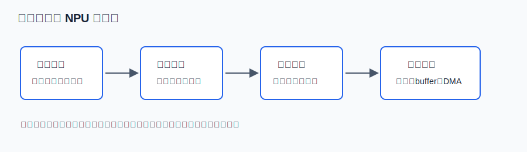
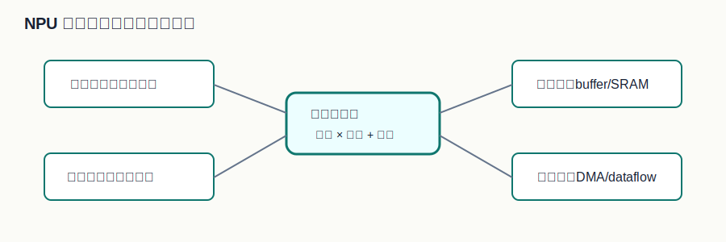

# 00 怎么学习 NPU

> 章节等级：B  
> 状态：drafting  
> 来源映射：`chapter_source_map.csv` 中的 00 章；本章主要承接 SRC17、SRC12、SRC18，参考 SRC01、SRC15。



## 1. 学习目标

读完本章，你应该能够：

- 说清楚本书为什么从数字、乘加、窗口和循环开始，而不是从厂商架构图开始。
- 用一个很小的数值例子解释 NPU 为什么离不开 MAC、PE、片上存储和数据搬运。
- 分清“神经网络模型”“算子”“张量”“NPU 硬件”这几层不是同一件事。
- 建立后续学习的检查方法：任何术语都要能回到一个可手算的输出值。

## 2. 先修提醒

本章不要求你已经学过卷积、矩阵乘法、数字电路或计算机体系结构。你只需要会做整数的乘法和加法。后面第一次出现新词时，本书会先给工作定义，再给小例子。

有一个学习习惯要先改掉：不要把 NPU 当成“能识别图片的黑盒”。NPU 看不到“猫”“车”“人脸”这些词，它看到的是一堆按形状排列的数字。它做的主要工作也不是理解语义，而是高效执行大量规则重复的乘加、搬运和累加。

## 3. 生活化引入

假设你在看一张 3 行 3 列的黑白小图，数字越大表示越亮：

```text
1 1 0
0 1 0
0 1 1
```

现在你想判断中间附近有没有一条竖线。一个朴素办法是拿一个“竖线模板”去比较：

```text
0 1 0
0 1 0
0 1 0
```

对应位置相乘，再把结果加起来：

```text
1*0 + 1*1 + 0*0
+ 0*0 + 1*1 + 0*0
+ 0*0 + 1*1 + 1*0
= 0 + 1 + 0 + 0 + 1 + 0 + 0 + 1 + 0
= 3
```

这个 3 不是魔法分数。它只说明这块输入和“竖线模板”有 3 个位置对得上。神经网络中的很多计算，都可以先从这种“数字表和数字表逐项相乘再求和”的动作理解。NPU 的学习起点就是：这种小动作如果重复几百万、几千万次，硬件该怎么组织。

## 4. 直觉解释

NPU 可以先理解成一台专门擅长神经网络计算的机器。它常见的核心问题不是“会不会算”，而是“能不能在有限面积、有限功耗、有限带宽下，把大量相似计算持续喂饱”。

这里有四层要分清：

| 层次 | 零基础理解 | 本书后续会怎么展开 |
| --- | --- | --- |
| 张量 | 按行、列、通道排列的一堆数字 | 形状、维度、layout |
| 算子 | 对张量做变换的规则 | 卷积、矩阵乘、激活、池化 |
| 循环 | 把算子写成重复步骤 | 多重循环、tile、数据复用 |
| 硬件 | 执行循环的电路和存储 | MAC、PE、SRAM、DMA、dataflow |

学习顺序最好从下列问题开始：

1. 一个输出值到底由哪些输入数字和权重数字算出来？
2. 这个输出值内部做了几次乘法、几次加法？
3. 很多输出值之间有没有重复使用同一批输入或权重？
4. 如果数据放不下或搬不快，硬件会怎么切分和调度？



## 5. 正式定义

在本书里，NPU 指面向神经网络计算的专用处理器或专用加速器。它通常包含大量乘加单元、片上存储、数据搬运单元和专用控制逻辑，用来高效执行卷积、矩阵乘、激活、池化、归一化等算子。

几个工作定义先放在这里：

- **张量**：带有形状的一组数字。一个向量可以看成一维张量，一张灰度图可以看成二维张量，一张彩色图可以看成三维张量。
- **算子**：对输入张量执行某种规则，得到输出张量的计算。例如卷积算子把输入图像块和卷积核做乘加。
- **MAC**：Multiply-Accumulate，先乘再累加。例如 `sum = sum + a*b`。
- **PE**：Processing Element，处理单元。可以先理解成阵列里负责一小块乘加和局部累加的小计算格子。
- **buffer / 片上 SRAM**：离计算单元更近的临时存储，用来减少反复访问外部内存。
- **DMA**：Direct Memory Access，数据搬运机制。它让大块数据在内存和片上存储之间移动，尽量不让计算阵列一直等数据。
- **dataflow**：数据流。它描述输入、权重、部分和在阵列和存储之间如何移动、停留和复用。

这些词后面都会展开。本章只要求你先知道：它们不是孤立名词，而是围绕“如何高效完成大量乘加”长出来的工程部件。

## 6. 最小例题

输入块：

```text
2 0
1 3
```

模板：

```text
1 2
0 1
```

逐项相乘：

```text
左上：2*1 = 2
右上：0*2 = 0
左下：1*0 = 0
右下：3*1 = 3
```

再相加：

```text
2 + 0 + 0 + 3 = 5
```

如果把这个动作写成 MAC 形式，就是：

```text
sum = 0
sum = sum + 2*1 = 2
sum = sum + 0*2 = 2
sum = sum + 1*0 = 2
sum = sum + 3*1 = 5
```

注意最后的 5 不是单次乘法产生的，而是四次乘法和三次有效累加之后得到的部分结果。后面讲卷积、矩阵乘、PE 阵列时，都会反复回到这个动作。

## 7. 完整例题

现在把例子稍微扩大。假设输入是 3 行 3 列：

```text
1 0 2
0 1 3
2 1 0
```

模板是 2 行 2 列：

```text
1 0
0 1
```

模板可以放在输入的四个位置。每放一次，就得到一个输出值。

位置 1：左上窗口

```text
1 0
0 1
```

计算：

```text
1*1 + 0*0 + 0*0 + 1*1 = 2
```

位置 2：右上窗口

```text
0 2
1 3
```

计算：

```text
0*1 + 2*0 + 1*0 + 3*1 = 3
```

位置 3：左下窗口

```text
0 1
2 1
```

计算：

```text
0*1 + 1*0 + 2*0 + 1*1 = 1
```

位置 4：右下窗口

```text
1 3
1 0
```

计算：

```text
1*1 + 3*0 + 1*0 + 0*1 = 1
```

所以输出是：

```text
2 3
1 1
```

这已经包含 NPU 学习的骨架：输入数字、权重数字、窗口、乘加、输出位置、重复使用。后面每一章只是在这个骨架上逐步增加形状、通道、循环、存储和硬件阵列。

## 8. NPU 连接

NPU 要解决的不是“能不能算出 2、3、1、1”，而是更工程化的四个问题：

1. **并行问题**：如果有成千上万个输出值，哪些可以同时算？哪些必须等前一步的累加？
2. **复用问题**：同一个输入数字会被多个窗口用到，同一个权重会在整张图上反复使用，怎样少搬几次？
3. **存储问题**：中间的部分和放在哪里？每次都写回外部内存会不会太慢、太耗能？
4. **调度问题**：当输入、权重、输出都很大时，怎样切成 tile，让片上 SRAM 装得下，让 DMA 和计算阵列配合？

因此，后面看到 MAC、PE、buffer、DMA、dataflow 时，不要先背定义。先问：它在帮哪个数字少搬一次？帮哪个部分和少写回一次？帮哪一批 MAC 并行起来？

## 9. 常见误区

### 误区 1：先背术语就能学会 NPU

- 错误说法：先把 PE、DMA、dataflow、TOPS 全背熟，再看例子。
- 为什么错：术语没有落到数字过程时，很容易变成空话。你可能知道 PE 是处理单元，却不知道它到底处理哪一次乘加。
- 正确理解：先手算一个输出值，再把术语贴回这个过程。

### 误区 2：NPU 只看峰值算力

- 错误说法：TOPS 越高，NPU 一定越快。
- 为什么错：如果数据搬运跟不上，MAC 阵列会空等；如果部分和频繁写回，能量也会浪费在存储访问上。
- 正确理解：真实表现取决于算力、带宽、片上存储、数据复用和编译调度的组合。

### 误区 3：卷积只是数学公式

- 错误说法：会背卷积公式就等于懂卷积。
- 为什么错：硬件真正执行的是循环、地址访问、MAC 和部分和累加。公式只是压缩写法。
- 正确理解：每个公式都要能展开成具体窗口、具体乘积和具体累加顺序。

### 误区 4：软件和硬件可以分开学

- 错误说法：先学神经网络模型，以后再单独学硬件。
- 为什么错：NPU 的很多硬件选择来自算子的形状和循环规律，不懂算子就很难理解硬件为什么这样设计。
- 正确理解：本书会把模型计算和硬件映射放在同一条线上讲。

## 10. 本章自测

### 题目

1. 为什么本书不建议从厂商 NPU 架构图开始？
2. 对输入块 `[[1,2],[3,4]]` 和模板 `[[1,0],[0,1]]`，手算输出值。
3. 用一句话解释 MAC。
4. `buffer` 为什么可能比外部内存更适合保存临时数据？
5. 为什么同一个输入数字被重复使用是 NPU 设计中的重要机会？
6. “NPU 看懂图片”这句话为什么不严谨？
7. 说出张量、算子、循环、硬件四层之间的关系。
8. 如果一个输出值需要 9 次乘法和 8 次加法，那么 1000 个输出值大约需要多少次乘法？

### 答案或评分点

1. 架构图里术语太多，零基础读者没有数值落点；应该先理解一个输出值如何由乘加得到。
2. `1*1 + 2*0 + 3*0 + 4*1 = 5`。
3. MAC 是“乘法后累加”，典型形式是 `sum = sum + a*b`。
4. 片上 buffer 离计算阵列近，访问更快、能耗更低，适合保存会被反复使用的数据或部分和。
5. 重复使用意味着可以少从外部内存搬数据，提高阵列利用率并降低能耗。
6. NPU 处理的是数字张量，不直接处理语义；识别结果来自模型计算和后处理。
7. 张量是数据，算子是规则，循环是规则的计算展开，硬件负责高效执行循环。
8. 约 9000 次乘法；加法次数按每个输出的累加组织约为 8000 次。

## 来源

- 本地来源：SRC17（硬件循环与数据流架构）、SRC12（内存带宽与 DMA 优化）、SRC18（TVM NPU 后端）、SRC01（Andes NPU IP 设计）、SRC15（性能评测）。
- 外部来源：MLSys Book（机器学习系统全景）、Computer Architecture: A Quantitative Approach（存储层级与性能分析）、Arm Ethos-U 官方资料（NPU/加速器公开案例）、Google TPU 相关论文与公开资料（阵列与数据流案例）。
