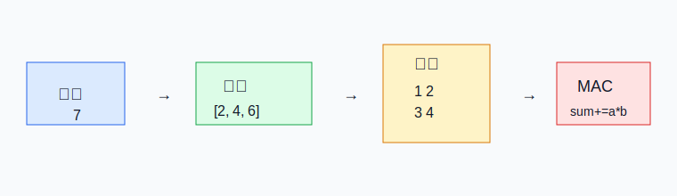
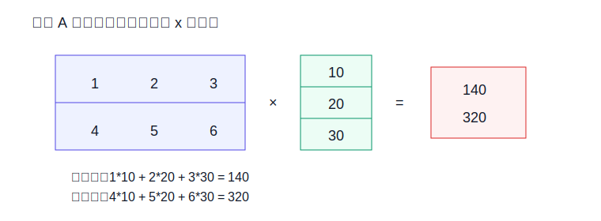

# 01 数字、向量、矩阵、乘加

> 章节等级：A  
> 状态：drafting  
> 来源映射：`chapter_source_map.csv` 中的 01 章；本章主要承接 SRC17，参考 SRC01。



## 1. 学习目标

读完本章，你应该能够：
- 把“数字、向量、矩阵”理解成不同摆放方式的一批数，而不是神秘数学对象。
- 手算向量点积、矩阵乘以向量、矩阵乘以矩阵中的一个输出值。
- 解释乘加，也就是 `sum = sum + a*b`，为什么是 NPU 的最小工作动作。
- 说清 MAC、PE、阵列、片上 buffer 之间的第一层关系。

## 2. 先修提醒

本章只要求会整数加法和乘法。第一次出现的新词会先给直观说法，再给定义。你不需要先学线性代数；本章的目标恰恰是把线性代数里最常见的计算拆成能手算的小步骤。

## 3. 生活化引入

假设你在给一次考试算总分。语文 80 分、数学 90 分、英语 70 分。如果三门权重相同，总分可以直接相加。如果权重不同，例如语文占 20%、数学占 50%、英语占 30%，就要先把每个分数乘上权重，再加起来：

```text
80*0.2 + 90*0.5 + 70*0.3 = 16 + 45 + 21 = 82
```

这个动作已经很像神经网络里的一个小计算：一批输入数字分别乘以一批权重数字，再把乘积加成一个输出数字。NPU 每秒要做的，主要就是把这种动作重复很多次，只是数字更多、形状更复杂、并行度更高。

## 4. 直观解释

一个数字可以看成一个格子里的值。一排数字就是向量，一张表就是矩阵。向量和矩阵不是为了吓人，它们只是让我们知道“这些数按什么顺序摆放”。

```text
数字：     7
向量：     [2, 4, 6]
矩阵：     1 2 3
          4 5 6
```

在 NPU 里，输入图片、模型权重、中间结果都要变成数字表。硬件不理解“猫耳朵”或“边缘”，它只接收数字。所谓计算，就是按规则从这些数字表里拿数、相乘、累加、写回结果。



## 5. 正式定义

- **标量**：一个单独数字，例如 `3`。
- **向量**：按一维顺序排列的一组数字，例如 `[2, 4, 6]`。
- **矩阵**：按二维行列排列的一组数字，例如 2 行 3 列矩阵。
- **权重**：模型学到的数字，用来决定某个输入对输出影响多大。
- **点积**：两个长度相同的向量逐项相乘，再把乘积相加。若 `x=[x0,x1,x2]`，`w=[w0,w1,w2]`，则点积是 `x0*w0 + x1*w1 + x2*w2`。
- **MAC**：Multiply-Accumulate，乘后累加。典型形式是 `sum = sum + a*b`。

边界条件也要说清：两个向量做点积时，长度必须相同；矩阵乘向量时，矩阵每一行的列数必须等于向量长度。

## 6. 最小例题

计算两个向量的点积：

```text
x = [2, 3, 4]
w = [5, 6, 7]
```

逐项相乘：

```text
2*5 = 10
3*6 = 18
4*7 = 28
```

再相加：

```text
10 + 18 + 28 = 56
```

写成 MAC 过程：

```text
sum = 0
sum = sum + 2*5 = 10
sum = sum + 3*6 = 28
sum = sum + 4*7 = 56
```

这里最后的 `56` 是一个输出值。它不是一次乘法得来的，而是 3 次乘法和 2 次有效加法得来的。

## 7. 完整例题

现在计算矩阵乘向量。矩阵 `A` 有 2 行 3 列，向量 `x` 有 3 个数：

```text
A = 1 2 3
    4 5 6

x = [10, 20, 30]
```

输出向量会有 2 个数，因为矩阵有 2 行。第一行和 `x` 做点积：

```text
y0 = 1*10 + 2*20 + 3*30
   = 10 + 40 + 90
   = 140
```

第二行和 `x` 做点积：

```text
y1 = 4*10 + 5*20 + 6*30
   = 40 + 100 + 180
   = 320
```

所以输出是：

```text
y = [140, 320]
```

再看矩阵乘矩阵里的一个输出值。左矩阵一行 `[1,2]`，右矩阵一列 `[3,5]`：

```text
1*3 + 2*5 = 3 + 10 = 13
```

矩阵乘法的本质并没有变：仍然是“取一组输入数字，取一组权重数字，逐项相乘，再累加”。

## 8. NPU 连接

NPU 会把这些点积动作交给很多 MAC 单元并行执行。一个 PE 可以先理解为“带一点本地控制和寄存器的小计算格子”，其中常包含一个或多个 MAC。很多 PE 排成阵列，就能同时算很多输出值。

在上面的矩阵乘向量中，第一行 `[1,2,3]` 和第二行 `[4,5,6]` 都要读取同一个输入向量 `[10,20,30]`。如果每个 PE 都从外部内存重新搬一遍输入，效率会很差。因此 NPU 会用片上 buffer 暂存输入和权重，再通过数据流安排复用：输入数字可以广播给多个 PE，权重可以留在本地重复使用，部分和可以在 PE 内或邻近 buffer 中累加。

本章先建立一条硬件主线：数字按形状摆好，计算拆成 MAC，MAC 放进 PE，PE 排成阵列，buffer 和 DMA 负责把数据持续送到阵列旁边。

## 9. 常见误区

### 误区 1：矩阵乘法是高级公式，和硬件无关

- 错误说法：只要会背矩阵乘法公式，就算理解 NPU 计算。
- 为什么错：硬件执行的是具体乘法、加法、读数、写数，不是抽象公式本身。
- 正确理解：每个矩阵输出值都能展开成一串 MAC，这串 MAC 才是硬件真正执行的动作。

### 误区 2：MAC 只是一个术语

- 错误说法：MAC 只是文档里常见缩写，不影响理解。
- 为什么错：NPU 的面积、功耗、吞吐、数据复用都围绕大量 MAC 的组织方式展开。
- 正确理解：看到任何卷积或矩阵乘，都要问它最终需要多少次 `sum += a*b`。

### 误区 3：向量和矩阵只是数学课内容

- 错误说法：学习 NPU 可以跳过向量矩阵，直接看 PE 阵列。
- 为什么错：PE 阵列要服务于具体数据形状；不知道形状，就不知道数据如何搬运和复用。
- 正确理解：向量和矩阵是硬件调度的输入说明书。

### 误区 4：乘法次数越多就一定越慢

- 错误说法：只要减少乘法次数，速度就一定提升。
- 为什么错：真实速度还取决于数据是否及时到达、部分和是否频繁写回、PE 是否空等。
- 正确理解：乘法次数、访存次数、并行度和复用方式要一起看。

## 10. 本章自测

### 题目

1. 用一句话解释向量。
2. 计算 `[1,2,3]` 和 `[4,5,6]` 的点积。
3. 为什么点积要求两个向量长度相同？
4. `sum = sum + a*b` 中的 `sum` 表示什么？
5. 矩阵 `[[1,0],[2,3]]` 乘向量 `[5,6]` 的输出是什么？
6. 为什么同一个输入向量可能被多个 PE 复用？
7. MAC 和 PE 是同一个概念吗？
8. 在矩阵乘向量中，矩阵有 4 行 3 列，向量长度为 3，输出有几个数？
9. 如果一个输出需要 8 次乘法，100 个输出大约需要多少次乘法？
10. 为什么 NPU 不只看 MAC 数量，还要看 buffer 和 DMA？

### 答案或评分点

1. 向量是一维排列的一组数字。
2. `1*4 + 2*5 + 3*6 = 32`。
3. 因为点积要逐项配对相乘，长度不同就有数字无法配对。
4. 表示不断累积的部分和或最终和。
5. 第一行 `1*5+0*6=5`，第二行 `2*5+3*6=28`，输出 `[5,28]`。
6. 多行权重或多个输出都可能使用同一批输入，复用能减少外部搬运。
7. 不是。MAC 是乘加动作或单元；PE 是包含计算、寄存器和控制的小处理单元。
8. 4 个。
9. 约 800 次乘法。
10. 如果数据送不到或频繁外存访问，MAC 会空等或能耗过高。

## 来源

- 本地来源：SRC17（硬件循环与数据流架构）、SRC01（NPU IP 微架构案例）。
- 外部来源：MLSys Book（机器学习系统中的算子和加速器概念）、Computer Architecture: A Quantitative Approach（性能与存储层次）、线性代数基础教材（向量、矩阵、点积定义）。
