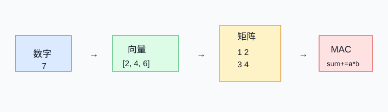
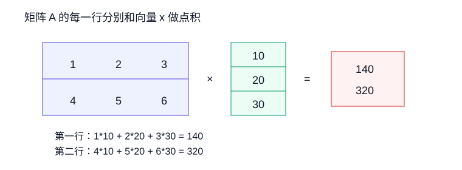
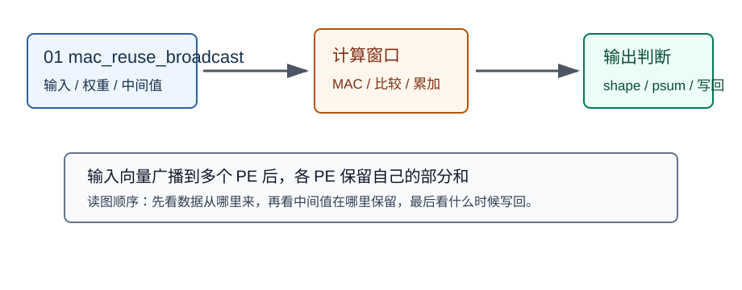
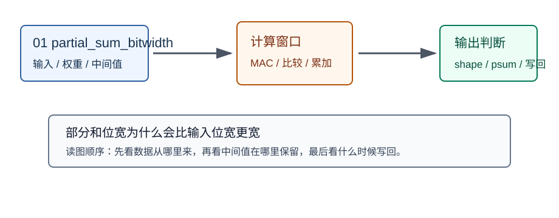

# 01 数字、向量、矩阵、乘加

> 章节等级：A  
> 状态：发布候选
> 来源映射：`chapter_source_map.csv` 中的 01 章；本章主要承接 SRC17，参考 SRC01。



## 本章知识全景图

| 项目 | 本章定位 |
| --- | --- |
| 章节等级 | A |
| 核心问题 | 本章把“数字、向量、矩阵、乘加”落到可手算、可画图、可映射到 NPU 硬件的最小链路。 |
| 学习主线 | 先用具体数字建立直觉，再给正式定义，最后连接到 MAC、buffer、DMA、PE 阵列或编译器调度。 |
| 概念地图 | 输入对象 -> 计算规则 -> 输出结果 -> 硬件/软件代价 -> 常见误判。 |
| 最短路径 | 读例题，复算关键公式，检查图解，再用自测题判断是否能迁移到后续章节。 |

## 1. 学习目标

读完本章，你应该能够：
- 把“数字、向量、矩阵”理解成不同摆放方式的一批数，而不是神秘数学对象。
- 手算向量点积、矩阵乘以向量、矩阵乘以矩阵中的一个输出值。
- 解释乘加，也就是 `sum = sum + a*b`，为什么是 NPU 的最小工作动作。
- 说清 MAC、PE、阵列、片上 buffer 之间的第一层关系。

## 2. 先修提醒

本章只要求会整数加法和乘法。第一次出现的新词会先给直观说法，再给定义。你不需要先学线性代数；本章的目标恰恰是把线性代数里最常见的计算拆成能手算的小步骤。

## 3. 生活化引入

假设你在给一次考试算总分。语文 80 分、数学 90 分、英语 70 分。如果三门权重相同，总分可以直接相加。如果权重不同，例如语文占 20%、数学占 50%、英语占 30%，就要先把每个分数乘上权重，再加起来：

```text
80*0.2 + 90*0.5 + 70*0.3 = 16 + 45 + 21 = 82
```

这个动作已经很像神经网络里的一个小计算：一批输入数字分别乘以一批权重数字，再把乘积加成一个输出数字。NPU 每秒要做的，主要就是把这种动作重复很多次，只是数字更多、形状更复杂、并行度更高。

## 4. 直觉解释

一个数字可以看成一个格子里的值。一排数字就是向量，一张表就是矩阵。向量和矩阵不是为了吓人，它们只是让我们知道“这些数按什么顺序摆放”。

```text
数字：     7
向量：     [2, 4, 6]
矩阵：     1 2 3
          4 5 6
```

在 NPU 里，输入图片、模型权重、中间结果都要变成数字表。硬件不理解“猫耳朵”或“边缘”，它只接收数字。所谓计算，就是按规则从这些数字表里拿数、相乘、累加、写回结果。

这里的“数字”也不要只理解成数学课上的抽象量。在硬件里，数字首先是一个被存储的值：它有位宽，例如 8 bit、16 bit 或 32 bit；它有解释方式，例如整数、定点数或浮点数；它有地址，必须从某个存储位置读出来。NPU 设计关心这些细节，是因为同样一个 `7`，如果是 8 bit 整数，占用的存储和带宽就比 32 bit 浮点小得多，但表示范围和精度也不同。

向量可以先理解成“有顺序的一排值”。顺序不能随便换，因为第 0 个输入要乘第 0 个权重，第 1 个输入要乘第 1 个权重。矩阵则是“多排向量组成的表”。矩阵的每一行常常可以生成一个输出，或者表示一组权重。这样看，矩阵乘向量并不是新动作，而是很多行向量分别和同一个输入向量做点积。



## 5. 正式定义

- **标量**：一个单独数字，例如 `3`。
- **向量**：按一维顺序排列的一组数字，例如 `[2, 4, 6]`。
- **矩阵**：按二维行列排列的一组数字，例如 2 行 3 列矩阵。
- **权重**：模型学到的数字，用来决定某个输入对输出影响多大。
- **点积**：两个长度相同的向量逐项相乘，再把乘积相加。若 `x=[x0,x1,x2]`，`w=[w0,w1,w2]`，则点积是 `x0*w0 + x1*w1 + x2*w2`。
- **MAC**：Multiply-Accumulate，乘后累加。典型形式是 `sum = sum + a*b`。

边界条件也要说清：两个向量做点积时，长度必须相同；矩阵乘向量时，矩阵每一行的列数必须等于向量长度。

还要区分两个容易混淆的词：

- **乘法结果**：一次 `a*b` 得到的临时数。
- **部分和**：多个乘法结果累加到一半时的 `sum`。在硬件里，部分和通常要暂存在寄存器、PE 内部或片上 buffer 中。

部分和很重要，因为神经网络里的很多输出值不是一次乘法得到的，而是几十、几百甚至几千次 MAC 累出来的。如果部分和每加一次都写回外部内存，速度和能耗都会很差。

## 6. 最小例题

计算两个向量的点积：

```text
x = [2, 3, 4]
w = [5, 6, 7]
```

逐项相乘：

```text
2*5 = 10
3*6 = 18
4*7 = 28
```

再相加：

```text
10 + 18 + 28 = 56
```

写成 MAC 过程：

```text
sum = 0
sum = sum + 2*5 = 10
sum = sum + 3*6 = 28
sum = sum + 4*7 = 56
```

这里最后的 `56` 是一个输出值。它不是一次乘法得来的，而是 3 次乘法和 2 次有效加法得来的。

再看一个带负数的点积例子：

```text
x = [3, -1, 2]
w = [2,  4, -3]
```

逐项相乘：

```text
3*2   = 6
-1*4  = -4
2*(-3)= -6
```

累加：

```text
6 + (-4) + (-6) = -4
```

这个例子说明，权重不只是“放大输入”，也可以让某些输入拉低输出。神经网络训练出来的权重就是用正负和大小来表达某种模式偏好。

## 7. 完整例题

现在计算矩阵乘向量。矩阵 `A` 有 2 行 3 列，向量 `x` 有 3 个数：

```text
A = 1 2 3
    4 5 6

x = [10, 20, 30]
```

输出向量会有 2 个数，因为矩阵有 2 行。第一行和 `x` 做点积：

```text
y0 = 1*10 + 2*20 + 3*30
   = 10 + 40 + 90
   = 140
```

第二行和 `x` 做点积：

```text
y1 = 4*10 + 5*20 + 6*30
   = 40 + 100 + 180
   = 320
```

所以输出是：

```text
y = [140, 320]
```

再看矩阵乘矩阵里的一个输出值。左矩阵一行 `[1,2]`，右矩阵一列 `[3,5]`：

```text
1*3 + 2*5 = 3 + 10 = 13
```

矩阵乘法的本质并没有变：仍然是“取一组输入数字，取一组权重数字，逐项相乘，再累加”。

为了把 4 个例子串起来，再补一个小型矩阵乘矩阵。设：

```text
A = 1 2
    3 4

B = 5 6
    7 8
```

输出 `C` 也是 2 行 2 列。每个输出都是 A 的一行和 B 的一列做点积：

```text
C[0][0] = 1*5 + 2*7 = 19
C[0][1] = 1*6 + 2*8 = 22
C[1][0] = 3*5 + 4*7 = 43
C[1][1] = 3*6 + 4*8 = 50
```

所以：

```text
C = 19 22
    43 50
```

这 4 个输出一共做了 8 次乘法和 4 组累加。NPU 的阵列化思路，就是让很多 PE 同时负责不同的 `C[i][j]`，并尽量复用 A 的行和 B 的列。

还有一个硬件友好的例子：如果一个输出是

```text
7 = 1*2 + 3*1 + 4*0 + 2*1
```

硬件不需要知道这来自考试权重、图像窗口还是矩阵乘法。它只要按顺序执行 4 次 `sum += a*b`。这就是 MAC 能成为 NPU 最小桥梁的原因：很多看起来不同的算子，落到最底层都是一批规则重复的 MAC。

## 8. NPU 连接

NPU 会把这些点积动作交给很多 MAC 单元并行执行。一个 PE 可以先理解为“带一点本地控制和寄存器的小计算格子”，其中常包含一个或多个 MAC。很多 PE 排成阵列，就能同时算很多输出值。

在上面的矩阵乘向量中，第一行 `[1,2,3]` 和第二行 `[4,5,6]` 都要读取同一个输入向量 `[10,20,30]`。如果每个 PE 都从外部内存重新搬一遍输入，效率会很差。因此 NPU 会用片上 buffer 暂存输入和权重，再通过数据流安排复用：输入数字可以广播给多个 PE，权重可以留在本地重复使用，部分和可以在 PE 内或邻近 buffer 中累加。

本章先建立一条硬件主线：数字按形状摆好，计算拆成 MAC，MAC 放进 PE，PE 排成阵列，buffer 和 DMA 负责把数据持续送到阵列旁边。

把矩阵乘向量映射到硬件时，可以这样想：

```text
输入向量 x:  [10, 20, 30]

PE0 负责第 0 行权重 [1,2,3] -> y0
PE1 负责第 1 行权重 [4,5,6] -> y1
```

两个 PE 都需要同一个 `x[0]`、`x[1]`、`x[2]`。如果输入向量从 buffer 广播给 PE0 和 PE1，就能减少重复读外部内存。每个 PE 内部保留自己的部分和：

```text
PE0: sum0 = 0 -> 10 -> 50 -> 140
PE1: sum1 = 0 -> 40 -> 140 -> 320
```

这就是最小的“数据复用 + 并行”图景。后面讲 PE 阵列、systolic array、dataflow 时，都会把这个图景放大。

## 9. 常见误区

### 误区 1：矩阵乘法是高级公式，和硬件无关

- 错误说法：只要会背矩阵乘法公式，就算理解 NPU 计算。
- 为什么错：硬件执行的是具体乘法、加法、读数、写数，不是抽象公式本身。
- 正确理解：每个矩阵输出值都能展开成一串 MAC，这串 MAC 才是硬件真正执行的动作。

### 误区 2：MAC 只是一个术语

- 错误说法：MAC 只是文档里常见缩写，不影响理解。
- 为什么错：NPU 的面积、功耗、吞吐、数据复用都围绕大量 MAC 的组织方式展开。
- 正确理解：看到任何卷积或矩阵乘，都要问它最终需要多少次 `sum += a*b`。

### 误区 3：向量和矩阵只是数学课内容

- 错误说法：学习 NPU 可以跳过向量矩阵，直接看 PE 阵列。
- 为什么错：PE 阵列要服务于具体数据形状；不知道形状，就不知道数据如何搬运和复用。
- 正确理解：向量和矩阵是硬件调度的输入说明书。

### 误区 4：乘法次数越多就一定越慢

- 错误说法：只要减少乘法次数，速度就一定提升。
- 为什么错：真实速度还取决于数据是否及时到达、部分和是否频繁写回、PE 是否空等。
- 正确理解：乘法次数、访存次数、并行度和复用方式要一起看。

## 10. 本章自测

### 题目

1. 用一句话解释向量。
2. 计算 `[1,2,3]` 和 `[4,5,6]` 的点积。
3. 为什么点积要求两个向量长度相同？
4. `sum = sum + a*b` 中的 `sum` 表示什么？
5. 矩阵 `[[1,0],[2,3]]` 乘向量 `[5,6]` 的输出是什么？
6. 为什么同一个输入向量可能被多个 PE 复用？
7. MAC 和 PE 是同一个概念吗？
8. 在矩阵乘向量中，矩阵有 4 行 3 列，向量长度为 3，输出有几个数？
9. 如果一个输出需要 8 次乘法，100 个输出大约需要多少次乘法？
10. 为什么 NPU 不只看 MAC 数量，还要看 buffer 和 DMA？

### 答案或评分点

1. 向量是一维排列的一组数字。
2. `1*4 + 2*5 + 3*6 = 32`。
3. 因为点积要逐项配对相乘，长度不同就有数字无法配对。
4. 表示不断累积的部分和或最终和。
5. 第一行 `1*5+0*6=5`，第二行 `2*5+3*6=28`，输出 `[5,28]`。
6. 多行权重或多个输出都可能使用同一批输入，复用能减少外部搬运。
7. 不是。MAC 是乘加动作或单元；PE 是包含计算、寄存器和控制的小处理单元。
8. 4 个。
9. 约 800 次乘法。
10. 如果数据送不到或频繁外存访问，MAC 会空等或能耗过高。

## 11. 终稿候选补强：从一个 MAC 推到阵列判断

本章最容易漏掉的不是点积公式，而是“同一批数怎样被复用”。如果两个输出都要使用同一个输入向量，NPU 不应让每个 PE 都从外部内存重新读一遍输入。更合理的做法是把输入从片上 buffer 广播到多个 PE，每个 PE 保留自己的权重和部分和。



图中 `x0,x1,x2` 只从 buffer 进入阵列一次，却同时喂给两个输出通道的 PE。PE0 计算 `w00*x0 + w01*x1 + w02*x2`，PE1 计算 `w10*x0 + w11*x1 + w12*x2`。这就是基础数学和硬件效率之间的第一条连接：向量不是抽象列表，矩阵不是纸面表格，它们决定了数据能不能被广播、驻留和复用。

一个可复现的判断例子是 8 bit 输入和 8 bit 权重。单次乘法最大量级接近 `127*127=16129`，已经需要 15 bit 表示；如果沿 `K=64` 累加，最大量级还要再乘 64，部分和至少需要比 8 bit 宽得多。工程上常见的 int8 推理并不表示所有中间值都用 int8 累加，很多实现会用 int32 accumulator，再在合适位置做缩放、舍入和饱和。



这张图的读法是：输入位宽决定单次乘积范围，`K` 方向长度决定累加范围，输出量化格式决定最终写回范围。若忽略这个链条，就会把“8 bit 乘 8 bit”误解成“全程 8 bit 都安全”。判断一个 MAC 映射是否靠谱，可以按三步检查：第一，输入和权重是否按同一 `k` 索引配对；第二，部分和在哪里保存、何时清零；第三，累加位宽是否覆盖最坏情况，或是否有明确的饱和策略。

这一节也补上本章的工程反例：如果把两个输出都分配到同一个 PE 串行算，MAC 次数不变，但并行度下降；如果把输入广播给太多 PE，而 buffer 端口或片上互连供不上数据，PE 仍会空等。矩阵乘法落到 NPU 后，真正的目标不是只数乘法次数，而是在 MAC 数、数据复用、buffer 容量、端口带宽之间取得平衡。

## 12. 终稿候选复核例题：从形状、次数到瓶颈判断

把一层全连接写成 `Y = XW + b`，其中 `X` 是 `M x K`，`W` 是 `K x N`，`Y` 是 `M x N`。若 `M=4,K=8,N=6`，乘法次数是 `4*8*6=192`，加法次数同量级，bias 加法是 `4*6=24`。这个数字只是计算下限，不等于真实运行时间。真实时间还要看 `X`、`W`、`Y` 的搬运次数。

若权重 `W` 能留在片上，4 行输入可以复用同一块权重；若权重放不下，每处理一小批输出列就要重新搬一块权重。若输出部分和能留在 PE 或近旁 buffer，`K` 方向累加结束后写一次；若部分和频繁写回外存，带宽会迅速吞掉 MAC 优势。论文或工程报告里写这一层时，不应只写“共有 192 次乘法”，还应说明复用口径：输入按行流入，权重按列块驻留，输出部分和在片上完成累加后写回。

一个常见失败信号是“MAC 利用率低但乘法次数很大”。这通常说明瓶颈不在公式，而在数据供给：DMA 没能连续供数，buffer 容量太小，或者 tile 切分让同一块权重反复加载。排查时先看 shape，再看每个 tile 的 `M_tile,N_tile,K_tile`，最后看部分和写回次数。

## 13. 发布前可复现实验：矩阵乘向量

本章进入发布候选前，必须能用一个很小的实验把核心机制跑通。推荐实验形态是 `W[2,3] * x[3] -> y[2]`。实验不追求真实模型规模，而是让读者能逐项核对输入、输出、中间值和硬件含义。若小实验都说不清，放到真实 NPU 上只会把错误隐藏在更大的日志里。

实验记录至少写四项。第一，逻辑 shape：每个维度代表什么，谁是 batch，谁是通道，谁是空间或矩阵公共维。第二，数据顺序：内存里相邻元素是谁，DMA 能否连续读取，是否需要 layout 转换。第三，中间状态：部分和、窗口、旁路张量或 tile 在哪里暂存，什么时候清零，什么时候变成最终输出。第四，失败信号：若输出不对，先查 shape 和边界，再查 layout 和地址，最后查量化、饱和或写回顺序。

对本章来说，实验的重点是 输入广播、权重驻留、部分和位宽。这三个词必须落到具体数字。例如不要只说“复用输入”，而要说明哪一个输入值被几个输出使用；不要只说“部分和变宽”，而要列出单次乘积范围和累加项数；不要只说“layout 更快”，而要指出连续读取的是通道、空间行，还是 blocked 通道组。这样的记录才能让后续章节复用，而不是变成一句抽象经验。

论文或学习笔记中可以把这个实验写成一个短表：

| 检查项 | 应填写内容 | 不合格信号 |
|---|---|---|
| shape | 输入、权重、输出的完整维度 | 只写总元素数 |
| 访问 | 连续读取方向、stride、tile 大小 | 地址跳跃但没有解释 |
| 中间值 | psum/窗口/旁路/tile 的保存位置 | 中间值过早写回外存 |
| 硬件连接 | MAC、PE、buffer、DMA 或 runtime 中的落点 | 只停留在数学公式 |

本章最应避免的错误是：把 `x` 分别重复读给两个 PE，或把 int8 部分和也压成 int8。它的工程后果通常不是“文字不严谨”，而是性能或数值直接出问题：PE 空等、外存带宽暴涨、输出 shape 与参考框架不一致、量化误差扩大，或者编译器无法选择合理 tile。发布候选不是把概念讲顺，而是让这些失败能被读者提前识别。

最后给出一个自检口径：合上正文后，读者应能独立画出数据从输入到输出的路径，并指出至少一个复用点、一个边界条件和一个失败信号。若只能背定义，说明本章还停在知识点层；若能用小实验解释硬件后果，才算真正支撑后续 NPU 设计章节。

## 14. 术语边界与失败排查：标量、向量、矩阵、MAC

发布前还要把本章术语边界钉住，因为很多 NPU 错误不是公式不会算，而是把相邻术语混在一起。`标量、向量、矩阵、MAC` 这些词在数学、模型图、编译器和硬件里各有落点。读者必须能说出每个词对应的数据对象、循环边界和硬件位置，否则后续章节会在 PE、buffer、DMA、dataflow 处反复断线。

第一条边界是“数学对象”和“存储对象”的区别。数学对象说明这个量应该怎样参与计算，存储对象说明这个量在内存里怎样排列。一个矩阵在公式中有行列，在内存中可能是 row-major、column-major 或 blocked；一个特征张量在模型图中有 N/C/H/W，在硬件中可能被切成空间 tile、通道 tile 或输出通道 tile。写教材时不能只停在数学对象，也不能直接跳到硬件术语，中间必须给出存储和访问口径。

第二条边界是“最终输出”和“中间状态”的区别。NPU 最容易出错的地方往往是中间状态：部分和还没累加完、窗口还没覆盖完、旁路张量还没对齐、tile 还没完成 K 方向归约。若把中间状态提前当成最终输出，就会造成数值错误；若把中间状态频繁写回外存，就会造成性能和能耗问题。正文中的每个例题都应说明中间值在哪里、何时有效、何时失效。

第三条边界是“可并行”和“值得并行”的区别。很多输出位置、输出通道或矩阵元素在数学上相互独立，可以并行；但硬件是否值得并行，还要看数据供给、buffer 容量、片上互连、端口冲突和写回顺序。若并行度超过数据供给能力，PE 数增加只会让空等更明显。讲 NPU 时，凡是出现“可以同时算”，都应接一句“前提是数据能同时到达并且中间值能放得下”。

本章最常见误解是：把矩阵乘法误看成一条公式。它的排查方法是把一个小样例拆成三张表：输入表列出每个元素的索引和内存位置；计算表列出每一步乘、加、比较或选择；输出表列出最终写回的 shape 和地址。三张表对不上时，不要先怀疑模型，而要先查术语边界是否混乱。

工程失败信号集中在：维度不匹配、部分和清零时机错误、累加位宽不足。这些信号出现时，报告里应写清“错在定义、错在地址、错在调度，还是错在量化”。如果只是写“性能不佳”或“结果不对”，读者无法复现，也无法连接到后续硬件章节。终稿候选的最低要求，是每个失败都能被追溯到一个术语边界和一个可执行检查。

最后给一个复习口令：先问对象是谁，再问形状是什么，再问存在内存哪里，再问谁复用它，再问什么时候写回。这个顺序能贯穿本书前 9 章。它把零基础读者从“看懂概念”推进到“能检查 NPU 执行计划”，也是基础篇进入微架构篇前必须建立的共同语言。

## 来源

- 本地来源：SRC17《NPU硬件循环与数据流架构从入门到精通》，路径 `C:\Users\11035\Desktop\ic\npu\14、NPU\《NPU硬件循环与数据流架构从入门到精通》\01.html` line 290，说明 PE 网格执行乘加并复用数据；SRC01《NPU Andes NPU IP核设计从入门到精通》，路径 `C:\Users\11035\Desktop\ic\npu\14、NPU\《NPU Andes NPU IP核设计从入门到精通》\01.html` line 167、line 216，把深度学习计算落到矩阵乘加、PE 和数据流。
- 外部来源：ONNX Gemm `https://onnx.ai/onnx/operators/onnx__Gemm.html` 支撑 `alpha*A*B + beta*C`、转置属性和 bias/广播口径；ONNX MatMul `https://onnx.ai/onnx/operators/onnx__MatMul.html` 支撑矩阵乘和广播形状规则；Arm Ethos-U55 `https://www.arm.com/products/silicon-ip-cpu/ethos/ethos-u55` 支撑端侧 NPU/MAC 阵列语境。
- 本章来源落点：ONNX 用于核对点积、矩阵乘和全连接公式；本地 SRC01/SRC17 用于把 MAC、PE、buffer、数据流连接到 NPU 硬件；Arm 页面用于限定“端侧 NPU”不是抽象数学背景。
