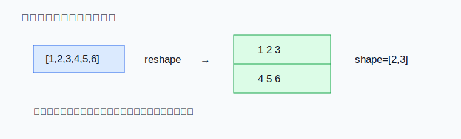
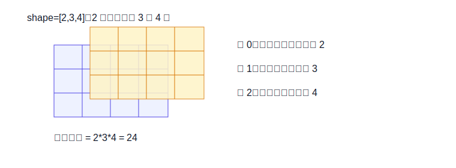

# 02 张量、维度、形状

> 章节等级：A  
> 状态：drafting  
> 来源映射：`chapter_source_map.csv` 中的 02 章；本章主要承接 SRC16、SRC18，参考 SRC05。



## 1. 学习目标

读完本章，你应该能够：
- 用自己的话解释张量、维度、轴、形状。
- 看懂 `shape = [2,3,4]` 表示什么。
- 区分“数据的值”和“数据的摆放方式”。
- 解释为什么 NPU、编译器和 runtime 都非常关心 shape 和 layout。

## 2. 先修提醒

本章需要你理解上一章的一维向量和二维矩阵。你不需要知道高等数学中的张量分析；在机器学习和 NPU 工程里，本章只把张量当成“带形状的一批数字”。

## 3. 生活化引入

想象你在整理快递柜。一个格子里可以放一个包裹；一排格子是一维；很多排格子组成一个柜面，是二维；如果有好几层柜面，就变成三维。

数字也是这样。单个数字是一个值；一排数字是向量；一张表是矩阵；多张表叠在一起，就是更高维的张量。张量不是新魔法，它只是告诉我们数字有几层、每层有多大、按什么顺序找。

## 4. 直观解释

张量最重要的不是名字，而是三个问题：

1. 有多少个方向可以索引它？这叫维度数量。
2. 每个方向有多长？合起来叫形状。
3. 内存里实际先放哪个方向？这叫 layout，常翻译为数据布局。

例如 `shape = [2,3]` 可以看成 2 行 3 列：

```text
1 2 3
4 5 6
```

`shape = [2,3,4]` 可以看成 2 张表，每张 3 行 4 列。第一个轴选第几张表，第二个轴选第几行，第三个轴选第几列。



## 5. 正式定义

- **张量**：一组按照固定形状排列的数字。标量、向量、矩阵都可以看成张量的特殊情况。
- **维度**：索引张量时需要走的方向数量。标量 0 维，向量 1 维，矩阵 2 维，图像批次常见 4 维。
- **轴**：某一个具体方向。例如图像张量里的高度轴、宽度轴、通道轴。
- **形状 shape**：每个轴的长度列表。例如 `[1, 3, 224, 224]` 表示 4 个轴，长度分别是 1、3、224、224。
- **元素数量**：所有轴长度相乘。形状 `[2,3,4]` 的元素数量是 `2*3*4=24`。
- **layout**：同样的逻辑形状在内存中的排列约定。例如 NCHW 表示批次、通道、高度、宽度；NHWC 表示批次、高度、宽度、通道。

## 6. 最小例题

给定一个形状：

```text
shape = [2, 3]
```

它表示 2 行 3 列，一共：

```text
2 * 3 = 6
```

个数字。可以写成：

```text
a00 a01 a02
a10 a11 a12
```

如果要找第 1 行第 2 列，按从 0 开始计数就是 `a[1][2]`，它是第二行第三列。

## 7. 完整例题

考虑一个很小的图像批次张量，使用 NCHW：

```text
N = 1   表示 1 张图
C = 2   表示 2 个通道
H = 2   表示高度 2
W = 3   表示宽度 3
shape = [1, 2, 2, 3]
```

元素数量：

```text
1 * 2 * 2 * 3 = 12
```

可以把它展开成两张 2 行 3 列的表：

```text
通道 0：
1 2 3
4 5 6

通道 1：
7  8  9
10 11 12
```

如果访问 `x[0][1][0][2]`，意思是：

```text
第 0 张图
第 1 个通道
第 0 行
第 2 列
```

对应数字是 `9`。

如果改用 NHWC，逻辑上仍然是 1 张图、2 行、3 列、2 通道，但内存相邻关系会变。NPU 的数据搬运和向量化读取可能因此完全不同。

## 8. NPU 连接

NPU 执行算子前，必须知道输入和输出的 shape。卷积需要知道输入高度、宽度、通道数、卷积核大小；矩阵乘需要知道行数、列数是否匹配；DMA 需要知道一次搬多少连续数据；buffer 需要知道片上能放下哪一块 tile。

编译器会根据 shape 做很多决定。例如同样是卷积，`C=3` 的输入和 `C=64` 的输入，数据复用方式不同；`H,W` 很大时可能按空间切 tile；通道很多时可能按通道切 tile。layout 也会影响硬件是否能一次读取连续数据。如果 NPU 喜欢 NHWC，但模型给的是 NCHW，编译器可能要插入 layout 转换，或者选择另一种执行计划。

因此 shape 不是附属信息，而是硬件执行计划的一部分。

## 9. 常见误区

### 误区 1：张量一定是很高深的数学概念

- 错误说法：不懂张量数学就不能学 NPU。
- 为什么错：机器学习工程中的张量首先是带形状的数字数组。
- 正确理解：先掌握 shape、axis、layout，再逐步理解更抽象的数学含义。

### 误区 2：shape 只影响阅读，不影响性能

- 错误说法：只要数值一样，shape 怎么写都无所谓。
- 为什么错：shape 决定循环边界、访存步长、tile 切分和并行方式。
- 正确理解：shape 是编译器和硬件生成执行计划的核心输入。

### 误区 3：NCHW 和 NHWC 只是名字不同

- 错误说法：两种 layout 只是换个缩写。
- 为什么错：它们会改变内存中相邻元素是谁，影响连续读取和缓存复用。
- 正确理解：layout 是内存顺序约定，和 DMA、buffer、向量加载直接相关。

### 误区 4：元素数量相同就一定能直接互换

- 错误说法：`[2,6]` 和 `[3,4]` 都是 12 个数，所以一定等价。
- 为什么错：元素数量相同不代表每个轴的语义相同。
- 正确理解：reshape 必须保证后续算子理解的轴语义仍然正确。

## 10. 本章自测

### 题目

1. 什么是张量？
2. `shape=[3,4]` 有多少个元素？
3. `shape=[2,3,4]` 有几个轴？
4. 轴和维度有什么关系？
5. NCHW 中 C 表示什么？
6. NHWC 和 NCHW 的主要区别是什么？
7. 为什么 DMA 关心 shape？
8. `[1,3,2,2]` 的元素数量是多少？
9. 为什么元素数量相同不代表语义相同？
10. 编译器为什么可能插入 layout 转换？

### 答案或评分点

1. 张量是带形状的一批数字。
2. `3*4=12`。
3. 3 个轴。
4. 维度数量就是轴的数量；轴是具体方向。
5. 通道数。
6. 轴在内存中的排列顺序不同，导致相邻元素不同。
7. DMA 需要知道连续搬运长度、步长和块大小。
8. `1*3*2*2=12`。
9. 因为轴代表不同含义，例如通道、高度、宽度不能随意混淆。
10. 为了匹配硬件更高效的数据读取和计算布局。

## 来源

- 本地来源：SRC16（模型量化与算子融合中的张量形状）、SRC18（TVM NPU 后端中的 shape/layout）、SRC05（OpenVINO NPU 插件案例）。
- 外部来源：ONNX 官方文档（张量和模型图表示）、Apache TVM 官方文档（TensorIR 与调度）、MLSys Book（机器学习系统数据表示）。
