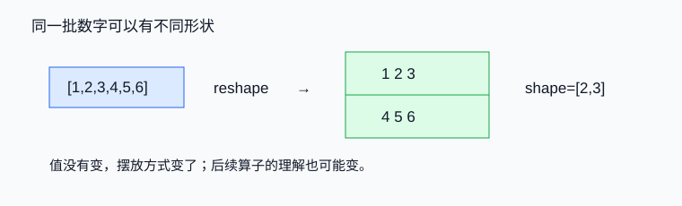
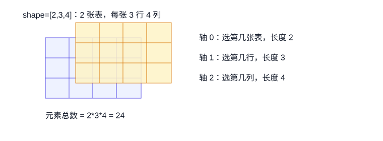
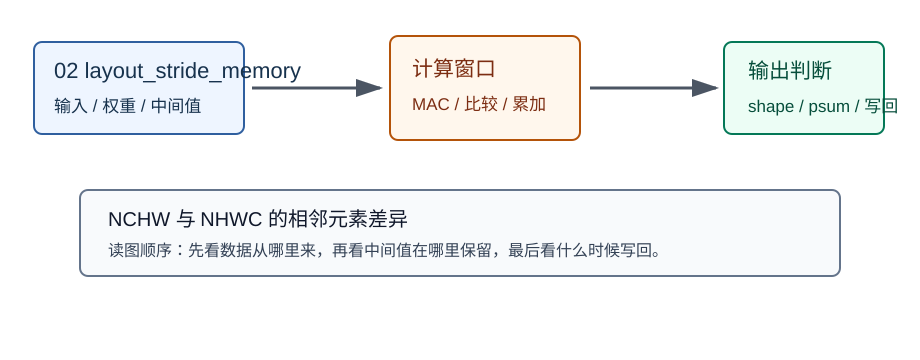
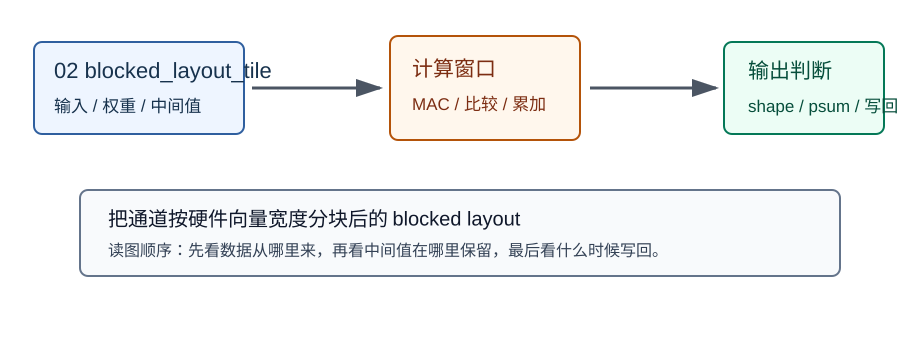

# 02 张量、维度、形状

> 章节等级：A  
> 状态：发布候选
> 来源映射：`chapter_source_map.csv` 中的 02 章；本章主要承接 SRC16、SRC18，参考 SRC05。



## 本章知识全景图

| 项目 | 本章定位 |
| --- | --- |
| 章节等级 | A |
| 核心问题 | 本章把“张量、维度、形状”落到可手算、可画图、可映射到 NPU 硬件的最小链路。 |
| 学习主线 | 先用具体数字建立直觉，再给正式定义，最后连接到 MAC、buffer、DMA、PE 阵列或编译器调度。 |
| 概念地图 | 输入对象 -> 计算规则 -> 输出结果 -> 硬件/软件代价 -> 常见误判。 |
| 最短路径 | 读例题，复算关键公式，检查图解，再用自测题判断是否能迁移到后续章节。 |

## 1. 学习目标

读完本章，你应该能够：
- 用自己的话解释张量、维度、轴、形状。
- 看懂 `shape = [2,3,4]` 表示什么。
- 区分“数据的值”和“数据的摆放方式”。
- 解释为什么 NPU、编译器和 runtime 都非常关心 shape 和 layout。

## 2. 先修提醒

本章需要你理解上一章的一维向量和二维矩阵。你不需要知道高等数学中的张量分析；在机器学习和 NPU 工程里，本章只把张量当成“带形状的一批数字”。

## 3. 生活化引入

想象你在整理快递柜。一个格子里可以放一个包裹；一排格子是一维；很多排格子组成一个柜面，是二维；如果有好几层柜面，就变成三维。

数字也是这样。单个数字是一个值；一排数字是向量；一张表是矩阵；多张表叠在一起，就是更高维的张量。张量不是新魔法，它只是告诉我们数字有几层、每层有多大、按什么顺序找。

## 4. 直觉解释

张量最重要的不是名字，而是三个问题：

1. 有多少个方向可以索引它？这叫维度数量。
2. 每个方向有多长？合起来叫形状。
3. 内存里实际先放哪个方向？这叫 layout，常翻译为数据布局。

例如 `shape = [2,3]` 可以看成 2 行 3 列：

```text
1 2 3
4 5 6
```

`shape = [2,3,4]` 可以看成 2 张表，每张 3 行 4 列。第一个轴选第几张表，第二个轴选第几行，第三个轴选第几列。

shape 只描述“逻辑上怎么看”，layout 描述“内存里按什么顺序放”。这两件事必须分开。比如同样一张 2 行 3 列、2 通道的小图，逻辑上每个位置都有两个通道值；但内存可以先把一个通道整张图放完，再放下一个通道，也可以每个像素位置连续放两个通道。

```text
按通道整张放：
C0: a b c d e f
C1: g h i j k l

按像素交错放：
(a,g) (b,h) (c,i) (d,j) (e,k) (f,l)
```

前者接近 NCHW 的直觉，后者接近 NHWC 的直觉。哪种更好不只取决于人类阅读习惯，还取决于硬件一次想连续读哪些数字。



## 5. 正式定义

- **张量**：一组按照固定形状排列的数字。标量、向量、矩阵都可以看成张量的特殊情况。
- **维度**：索引张量时需要走的方向数量。标量 0 维，向量 1 维，矩阵 2 维，图像批次常见 4 维。
- **轴**：某一个具体方向。例如图像张量里的高度轴、宽度轴、通道轴。
- **形状 shape**：每个轴的长度列表。例如 `[1, 3, 224, 224]` 表示 4 个轴，长度分别是 1、3、224、224。
- **元素数量**：所有轴长度相乘。形状 `[2,3,4]` 的元素数量是 `2*3*4=24`。
- **layout**：同样的逻辑形状在内存中的排列约定。例如 NCHW 表示批次、通道、高度、宽度；NHWC 表示批次、高度、宽度、通道。
- **stride（存储步长）**：在内存中沿某个轴移动一格时，地址要跨过多少个元素。这里先理解成“找下一个相邻逻辑元素时，内存指针要跳多远”。
- **contiguous（连续）**：逻辑相邻的数据在内存中也按预期连续排列。连续数据更容易被 DMA 和向量加载高效读取。
- **reshape**：在元素总数不变的前提下，改变 shape 的解释方式。
- **flatten**：把多维张量按某种顺序压平成一维向量。

## 6. 最小例题

给定一个形状：

```text
shape = [2, 3]
```

它表示 2 行 3 列，一共：

```text
2 * 3 = 6
```

个数字。可以写成：

```text
a00 a01 a02
a10 a11 a12
```

如果要找第 1 行第 2 列，按从 0 开始计数就是 `a[1][2]`，它是第二行第三列。

## 7. 完整例题

考虑一个很小的图像批次张量，使用 NCHW：

```text
N = 1   表示 1 张图
C = 2   表示 2 个通道
H = 2   表示高度 2
W = 3   表示宽度 3
shape = [1, 2, 2, 3]
```

元素数量：

```text
1 * 2 * 2 * 3 = 12
```

可以把它展开成两张 2 行 3 列的表：

```text
通道 0：
1 2 3
4 5 6

通道 1：
7  8  9
10 11 12
```

如果访问 `x[0][1][0][2]`，意思是：

```text
第 0 张图
第 1 个通道
第 0 行
第 2 列
```

对应数字是 `9`。

如果改用 NHWC，逻辑上仍然是 1 张图、2 行、3 列、2 通道，但内存相邻关系会变。NPU 的数据搬运和向量化读取可能因此完全不同。

再看 reshape 和 flatten。上面的 12 个元素如果按当前顺序压平成一维，可以写成：

```text
[1,2,3,4,5,6,7,8,9,10,11,12]
```

它可以 reshape 成 `[3,4]`：

```text
1  2  3  4
5  6  7  8
9 10 11 12
```

也可以 reshape 成 `[2,6]`：

```text
1  2  3  4  5  6
7  8  9 10 11 12
```

但这只说明元素数量允许，不说明语义一定正确。如果原来的第一个轴代表通道，随便 reshape 后可能把通道、高度、宽度混在一起。对 NPU 编译器来说，这可能让后续卷积读错相邻关系。

再看一个 contiguous 直觉。假设一行数据是：

```text
10 20 30 40 50 60
```

取完整连续的一段 `[20,30,40]`，DMA 可以很自然地一次搬运；如果取每隔一个元素 `[10,30,50]`，就变成跳着读。跳着读不是不能做，但通常更难喂饱计算阵列。layout 选择的核心价值之一，就是让常用访问模式尽量连续。

## 8. NPU 连接

NPU 执行算子前，必须知道输入和输出的 shape。卷积需要知道输入高度、宽度、通道数、卷积核大小；矩阵乘需要知道行数、列数是否匹配；DMA 需要知道一次搬多少连续数据；buffer 需要知道片上能放下哪一块 tile。

编译器会根据 shape 做很多决定。例如同样是卷积，`C=3` 的输入和 `C=64` 的输入，数据复用方式不同；`H,W` 很大时可能按空间切 tile；通道很多时可能按通道切 tile。layout 也会影响硬件是否能一次读取连续数据。如果 NPU 喜欢 NHWC，但模型给的是 NCHW，编译器可能要插入 layout 转换，或者选择另一种执行计划。

因此 shape 不是附属信息，而是硬件执行计划的一部分。

可以用一个小例子理解 layout 对卷积的影响。单个输出位置需要读取同一像素位置的多个通道时：

- NHWC 下，同一位置的通道值往往相邻，适合一次连续读取一组通道。
- NCHW 下，同一通道的一整张平面往往连续，适合沿空间方向滑动窗口时复用同一通道的数据。

真实 NPU 会根据 PE 阵列、向量宽度、buffer 组织和算子类型选择偏好的 layout。有些硬件偏好 NHWC，有些编译器内部会先转成更适合调度的 blocked layout，例如把通道按 8 或 16 个一组打包。零基础阶段不需要记住所有变体，但要知道：layout 是为了让“下一批要算的数据”更容易连续地到达 MAC 阵列。

## 9. 常见误区

### 误区 1：张量一定是很高深的数学概念

- 错误说法：不懂张量数学就不能学 NPU。
- 为什么错：机器学习工程中的张量首先是带形状的数字数组。
- 正确理解：先掌握 shape、axis、layout，再逐步理解更抽象的数学含义。

### 误区 2：shape 只影响阅读，不影响性能

- 错误说法：只要数值一样，shape 怎么写都无所谓。
- 为什么错：shape 决定循环边界、访存步长、tile 切分和并行方式。
- 正确理解：shape 是编译器和硬件生成执行计划的核心输入。

### 误区 3：NCHW 和 NHWC 只是名字不同

- 错误说法：两种 layout 只是换个缩写。
- 为什么错：它们会改变内存中相邻元素是谁，影响连续读取和缓存复用。
- 正确理解：layout 是内存顺序约定，和 DMA、buffer、向量加载直接相关。

### 误区 4：元素数量相同就一定能直接互换

- 错误说法：`[2,6]` 和 `[3,4]` 都是 12 个数，所以一定等价。
- 为什么错：元素数量相同不代表每个轴的语义相同。
- 正确理解：reshape 必须保证后续算子理解的轴语义仍然正确。

## 10. 本章自测

### 题目

1. 什么是张量？
2. `shape=[3,4]` 有多少个元素？
3. `shape=[2,3,4]` 有几个轴？
4. 轴和维度有什么关系？
5. NCHW 中 C 表示什么？
6. NHWC 和 NCHW 的主要区别是什么？
7. 为什么 DMA 关心 shape？
8. `[1,3,2,2]` 的元素数量是多少？
9. 为什么元素数量相同不代表语义相同？
10. 编译器为什么可能插入 layout 转换？

### 答案或评分点

1. 张量是带形状的一批数字。
2. `3*4=12`。
3. 3 个轴。
4. 维度数量就是轴的数量；轴是具体方向。
5. 通道数。
6. 轴在内存中的排列顺序不同，导致相邻元素不同。
7. DMA 需要知道连续搬运长度、步长和块大小。
8. `1*3*2*2=12`。
9. 因为轴代表不同含义，例如通道、高度、宽度不能随意混淆。
10. 为了匹配硬件更高效的数据读取和计算布局。

## 11. 终稿候选补强：shape 是执行计划，不是注释

shape 的工程含义可以用一个问题检验：下一次 DMA 应该搬连续多少个数？如果 layout 是 NHWC，同一像素位置的多个通道通常相邻；如果 layout 是 NCHW，同一通道的一整张平面通常更连续。两种写法的元素总数可以完全相同，但硬件看到的相邻关系不同。



图中同样是 `C=4,H=2,W=2`，NHWC 更容易一次读到同一像素的 4 个通道，NCHW 更容易沿同一通道的空间方向连续读取。卷积到底偏好哪一种，取决于内层循环先走空间还是先走通道、PE 一次消耗多少通道、buffer 怎样分 bank。零基础读者不需要背所有布局名，但必须记住：layout 改变的是“谁和谁挨在一起”，这会直接改变 DMA burst、cache line、bank conflict 和向量装载效率。

真实编译器还会引入 blocked layout。例如把通道按 8 或 16 个一组打包，逻辑 shape 仍可读作 `N,H,W,C`，物理存储却可能接近 `N,H,W,C_outer,C_inner`。这样做的动机是让硬件向量宽度吃满：一次读入 `C_inner=8` 个通道，正好喂给 8 路 MAC 或一个小向量单元。



判断 shape/layout 是否合理，可以按四个问题走：第一，逻辑轴的语义有没有变，例如通道不能被误当成宽度；第二，最内层访问是否尽量连续；第三，tile 是否能放进片上 buffer；第四，layout 转换的成本是否低于它带来的后续收益。如果一个模型导入 NPU 后性能异常，shape 没错但 layout 不合硬件，是非常常见的失败信号。

本章因此把“张量”收束成一个执行口径：张量是带形状、轴语义和物理布局的数值块。数学上它是数组，编译器眼里它是循环边界，DMA 眼里它是地址序列，NPU 阵列眼里它是下一拍要消耗的数据队列。

## 12. 终稿候选复核例题：layout 错误怎样变成数值错误

设一张 2x2 RGB 小图按 NHWC 存储，逻辑顺序是每个像素后面紧跟 R、G、B：

```text
(0,0): R0 G0 B0
(0,1): R1 G1 B1
(1,0): R2 G2 B2
(1,1): R3 G3 B3
```

若某段代码把这段连续内存误读成 NCHW，就会先把前 4 个数当作 R 平面，再把后 4 个数当作 G 平面。这样通道语义被打乱，卷积核以为自己在看同一颜色平面的空间邻域，实际却读到了不同像素和不同通道混在一起的序列。错误不会表现为维度不匹配，因为元素总数仍然相同；它会表现为模型输出异常、精度下降或边界样本错得很离谱。

工程上排查 layout 问题，要准备一个带可识别模式的小张量，而不是直接用真实图片。例如让 R 通道全为 10，G 通道全为 20，B 通道全为 30，再经过一次 identity 或 1x1 卷积。如果输出通道数值互相串扰，就说明 layout、stride 或通道打包发生了错误。

论文中描述张量时也不能只写“输入大小为 224x224x3”。更严谨的写法应包含逻辑 shape、物理 layout 和批量维度，例如 `NHWC=[1,224,224,3]` 或 `NCHW=[1,3,224,224]`。如果部署端使用 blocked layout，还要说明这是编译器内部重排，不改变模型语义，但会改变内存相邻关系和 DMA 搬运形态。

## 13. 发布前可复现实验：layout 验证

本章进入发布候选前，必须能用一个很小的实验把核心机制跑通。推荐实验形态是 `NHWC=[1,2,2,3]` 与 `NCHW=[1,3,2,2]`。实验不追求真实模型规模，而是让读者能逐项核对输入、输出、中间值和硬件含义。若小实验都说不清，放到真实 NPU 上只会把错误隐藏在更大的日志里。

实验记录至少写四项。第一，逻辑 shape：每个维度代表什么，谁是 batch，谁是通道，谁是空间或矩阵公共维。第二，数据顺序：内存里相邻元素是谁，DMA 能否连续读取，是否需要 layout 转换。第三，中间状态：部分和、窗口、旁路张量或 tile 在哪里暂存，什么时候清零，什么时候变成最终输出。第四，失败信号：若输出不对，先查 shape 和边界，再查 layout 和地址，最后查量化、饱和或写回顺序。

对本章来说，实验的重点是 轴语义、物理相邻关系、DMA 连续搬运。这三个词必须落到具体数字。例如不要只说“复用输入”，而要说明哪一个输入值被几个输出使用；不要只说“部分和变宽”，而要列出单次乘积范围和累加项数；不要只说“layout 更快”，而要指出连续读取的是通道、空间行，还是 blocked 通道组。这样的记录才能让后续章节复用，而不是变成一句抽象经验。

论文或学习笔记中可以把这个实验写成一个短表：

| 检查项 | 应填写内容 | 不合格信号 |
|---|---|---|
| shape | 输入、权重、输出的完整维度 | 只写总元素数 |
| 访问 | 连续读取方向、stride、tile 大小 | 地址跳跃但没有解释 |
| 中间值 | psum/窗口/旁路/tile 的保存位置 | 中间值过早写回外存 |
| 硬件连接 | MAC、PE、buffer、DMA 或 runtime 中的落点 | 只停留在数学公式 |

本章最应避免的错误是：只检查元素总数，不检查通道是否串位。它的工程后果通常不是“文字不严谨”，而是性能或数值直接出问题：PE 空等、外存带宽暴涨、输出 shape 与参考框架不一致、量化误差扩大，或者编译器无法选择合理 tile。发布候选不是把概念讲顺，而是让这些失败能被读者提前识别。

最后给出一个自检口径：合上正文后，读者应能独立画出数据从输入到输出的路径，并指出至少一个复用点、一个边界条件和一个失败信号。若只能背定义，说明本章还停在知识点层；若能用小实验解释硬件后果，才算真正支撑后续 NPU 设计章节。

## 14. 术语边界与失败排查：shape、axis、layout、stride

发布前还要把本章术语边界钉住，因为很多 NPU 错误不是公式不会算，而是把相邻术语混在一起。`shape、axis、layout、stride` 这些词在数学、模型图、编译器和硬件里各有落点。读者必须能说出每个词对应的数据对象、循环边界和硬件位置，否则后续章节会在 PE、buffer、DMA、dataflow 处反复断线。

第一条边界是“数学对象”和“存储对象”的区别。数学对象说明这个量应该怎样参与计算，存储对象说明这个量在内存里怎样排列。一个矩阵在公式中有行列，在内存中可能是 row-major、column-major 或 blocked；一个特征张量在模型图中有 N/C/H/W，在硬件中可能被切成空间 tile、通道 tile 或输出通道 tile。写教材时不能只停在数学对象，也不能直接跳到硬件术语，中间必须给出存储和访问口径。

第二条边界是“最终输出”和“中间状态”的区别。NPU 最容易出错的地方往往是中间状态：部分和还没累加完、窗口还没覆盖完、旁路张量还没对齐、tile 还没完成 K 方向归约。若把中间状态提前当成最终输出，就会造成数值错误；若把中间状态频繁写回外存，就会造成性能和能耗问题。正文中的每个例题都应说明中间值在哪里、何时有效、何时失效。

第三条边界是“可并行”和“值得并行”的区别。很多输出位置、输出通道或矩阵元素在数学上相互独立，可以并行；但硬件是否值得并行，还要看数据供给、buffer 容量、片上互连、端口冲突和写回顺序。若并行度超过数据供给能力，PE 数增加只会让空等更明显。讲 NPU 时，凡是出现“可以同时算”，都应接一句“前提是数据能同时到达并且中间值能放得下”。

本章最常见误解是：把逻辑形状和物理存储顺序混成一件事。它的排查方法是把一个小样例拆成三张表：输入表列出每个元素的索引和内存位置；计算表列出每一步乘、加、比较或选择；输出表列出最终写回的 shape 和地址。三张表对不上时，不要先怀疑模型，而要先查术语边界是否混乱。

工程失败信号集中在：通道串位、DMA 读数跳跃、layout 转换插入过多。这些信号出现时，报告里应写清“错在定义、错在地址、错在调度，还是错在量化”。如果只是写“性能不佳”或“结果不对”，读者无法复现，也无法连接到后续硬件章节。终稿候选的最低要求，是每个失败都能被追溯到一个术语边界和一个可执行检查。

最后给一个复习口令：先问对象是谁，再问形状是什么，再问存在内存哪里，再问谁复用它，再问什么时候写回。这个顺序能贯穿本书前 9 章。它把零基础读者从“看懂概念”推进到“能检查 NPU 执行计划”，也是基础篇进入微架构篇前必须建立的共同语言。

## 15. 最小验收样例：用哨兵值检查 layout

给张量填入哨兵值是最直接的 layout 验收方法。对 `NHWC=[1,2,2,3]`，可以让四个像素分别写成 `[101,102,103]`、`[201,202,203]`、`[301,302,303]`、`[401,402,403]`。其中百位表示空间位置，个位表示通道。若部署端读出的第一个像素不是 `101,102,103`，而是 `101,201,301` 之类的序列，就说明它把空间轴和通道轴混读了。

这个样例的价值是错误一眼可见，不需要真实图片，也不依赖模型精度。NPU bring-up、编译器 layout pass、DMA descriptor 调试都可以使用类似哨兵张量。终稿发布时，本章保留这个实验口径，是为了让读者知道 shape/layout 不是抽象名词，而是可以被小数据直接验收的工程合同。若后续章节讨论 tile、bank、stride 或 blocked channel，也应先回到这个小样例，确认逻辑轴和物理地址没有先天错位；否则后续所有性能分析都会建立在错误数据顺序上，调试成本会被放大，后续验证也会失真。

补充一句验收标准：读者应能用哨兵值复现一次 layout 错位，并指出错位发生在轴解释还是地址生成。

## 来源

- 本地来源：SRC18《NPU神经网络编译器TVM NPU后端从入门到精通》，路径 `C:\Users\11035\Desktop\ic\npu\14、NPU\《NPU神经网络编译器TVM NPU后端从入门到精通》\02.html` line 291、line 296，说明 TensorIR 与 Buffer 抽象；同课程路径 `C:\Users\11035\Desktop\ic\npu\14、NPU\《NPU神经网络编译器TVM NPU后端从入门到精通》\03.html` line 366、line 367，明确提到 NHWC 到 NCHW 这类数据布局转换。
- 外部来源：ONNX Reshape `https://onnx.ai/onnx/operators/onnx__Reshape.html` 支撑 reshape 的 shape 输入语义；ONNX Transpose `https://onnx.ai/onnx/operators/onnx__Transpose.html` 支撑轴置换；MLIR Linalg `https://mlir.llvm.org/docs/Dialects/Linalg/` 支撑结构化张量运算、索引和循环空间的解释。
- 本章来源落点：ONNX 用于区分形状变化和轴顺序变化；MLIR/TensorIR 用于把 shape 连接到循环、buffer 和硬件映射；本地 SRC18 用于说明 layout 转换是 NPU 编译器真实工作，不是术语装饰。
