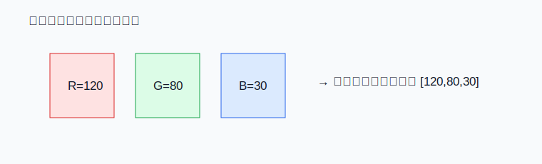
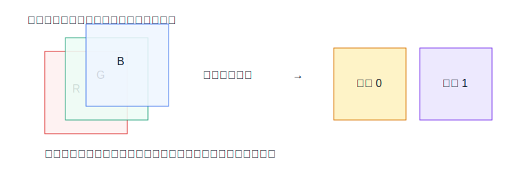

# 03 图像、特征图、通道

> 章节等级：A  
> 状态：drafting  
> 来源映射：`chapter_source_map.csv` 中的 03 章；本章主要承接 SRC16，参考 SRC03、SRC06。



## 1. 学习目标

读完本章，你应该能够：
- 把图像理解成按高度、宽度、通道排列的数字。
- 解释像素、灰度图、RGB 通道、特征图、激活图之间的关系。
- 手算一个很小图像块的通道访问方式。
- 说明为什么 NPU 处理的是数字张量，而不是直接处理“图片语义”。

## 2. 先修提醒

你需要知道上一章的 shape 和 axis。这里的“通道”先按图像里的颜色层理解，后面再扩展到神经网络内部的特征层。

## 3. 生活化引入

手机屏幕上的一张图片，看起来是连续的颜色，其实可以拆成很多小格子。每个小格子叫像素。灰度图的一个像素只需要一个亮度数字；彩色图常用红、绿、蓝三个数字表示一个像素。

例如一个像素可以写成：

```text
R=120, G=80, B=30
```

这不是三个像素，而是同一个位置上的三个颜色通道。

## 4. 直观解释

图像可以先看成二维表：高度方向有多少行，宽度方向有多少列。灰度图每个格子放一个数字：

```text
10 20 30
40 50 60
```

彩色图则是在每个位置放 3 个数字。为了方便计算，我们通常把它看成 3 张表：红色表、绿色表、蓝色表。每张表都和原图一样高、一样宽。

神经网络经过卷积后，输出不一定还是 RGB 三个颜色通道，而可能是 8、16、64 个“特征通道”。每个通道都是一张二维表，记录某种模式在不同位置的响应强弱。这样的二维表常叫 feature map，也叫特征图；如果强调它是经过某层计算得到的数值响应，也常叫 activation map。



## 5. 正式定义

- **像素**：图像中的一个空间位置。
- **灰度值**：描述亮度的一个数字，常见范围可以是 0 到 255，也可以是归一化后的 0 到 1。
- **通道**：同一空间位置上的一类数值层。RGB 图像有 3 个输入通道；神经网络中间层可以有更多特征通道。
- **图像张量**：把图像数字按 shape 存起来的张量。单张 RGB 图像常见逻辑形状可以是 `[3,H,W]` 或 `[H,W,3]`。
- **特征图 feature map**：神经网络某一层输出的空间响应表。一个输出通道对应一张特征图。
- **激活 activation**：神经网络某层输出的数值。特征图里的每个格子都是一个激活值。

## 6. 最小例题

一张 2 行 2 列灰度图：

```text
10 20
30 40
```

它的 shape 可以写成 `[H,W] = [2,2]`。访问第 1 行第 0 列，得到 `30`。

如果把它变成一张 RGB 图像，每个位置有 3 个数。例如左上角像素是：

```text
[R,G,B] = [10, 20, 30]
```

那么访问同一个空间位置时，还要说明通道：红色通道是 10，绿色通道是 20，蓝色通道是 30。

## 7. 完整例题

考虑一张很小的 RGB 图，形状 `[C,H,W] = [3,2,2]`：

```text
R 通道：
1 2
3 4

G 通道：
5 6
7 8

B 通道：
9  10
11 12
```

如果访问位置 `(行=1, 列=0)`，三个通道的值是：

```text
R = 3
G = 7
B = 11
```

这个位置的像素向量就是 `[3,7,11]`。如果某个卷积核想检测“偏红”的局部模式，它可能给 R 通道较大权重，给 G/B 通道较小或负权重。NPU 不知道“偏红”这个词，它只会执行通道上的乘加。

再看一个特征图例子。假设一层网络输出 2 个通道，每个通道 2 行 2 列：

```text
输出通道 0：
0 1
2 3

输出通道 1：
4 5
6 7
```

这表示同一张输入图在两个不同模式检测器下的响应。通道 0 可能更像边缘响应，通道 1 可能更像纹理响应；具体含义来自模型训练，不是硬件写死的。

## 8. NPU 连接

图像进入 NPU 前会变成张量。NPU 的 DMA 看到的是一段段数字，buffer 存的是输入 tile、权重 tile 和输出 tile。卷积计算时，一个输出像素常常需要读取输入图像的一个局部窗口，并且可能跨多个通道读取数字。

通道数直接影响计算量。单通道 3x3 卷积只需要 9 次乘法得到一个输出；如果输入有 3 个通道，同一个输出位置就要对 3 个通道各做 9 次乘法，总共 27 次乘法，再把它们累加。后面多通道卷积会详细展开。

特征图也影响 buffer 设计。若特征图很大，片上 SRAM 放不下整张图，就要切成 tile；若通道很多，可能按通道分块；若 layout 不合适，DMA 读取会变成跳跃访问，降低效率。

## 9. 常见误区

### 误区 1：NPU 直接理解图片内容

- 错误说法：NPU 看见猫、车、人脸。
- 为什么错：NPU 接收的是数字张量，语义是模型计算和后处理给出的解释。
- 正确理解：硬件只做数值计算，识别结果来自模型结构和权重。

### 误区 2：通道只等于 RGB

- 错误说法：通道最多就是红绿蓝三层。
- 为什么错：神经网络中间层的通道可以是 8、32、256 等，表示不同特征响应。
- 正确理解：通道是一组并列的数值层，不局限于颜色。

### 误区 3：feature map 和原图一样容易理解

- 错误说法：每张特征图都能直接解释成一种人类可见物体。
- 为什么错：很多通道是模型内部特征组合，并不对应直观物体名。
- 正确理解：特征图是响应数字表，能否可视化解释要看层级和模型。

### 误区 4：图像大小只影响显示，不影响硬件

- 错误说法：图片大一点只是显示更清楚。
- 为什么错：高度、宽度、通道数直接决定乘加次数、数据搬运量和 buffer 需求。
- 正确理解：图像 shape 是 NPU 计算量和访存量的直接来源。

## 10. 本章自测

### 题目

1. 什么是像素？
2. 灰度图和 RGB 图的通道数有什么不同？
3. `[3,224,224]` 可以怎样理解？
4. feature map 是什么？
5. activation map 和 feature map 的关系是什么？
6. 为什么中间层通道数可以不是 3？
7. 单通道 3x3 窗口有多少个输入数字？
8. 三通道 3x3 窗口有多少个输入数字？
9. 为什么图像越大，NPU 的数据搬运压力越大？
10. NPU 为什么不直接处理“边缘”这个词？

### 答案或评分点

1. 图像中的一个空间格子或采样位置。
2. 灰度图通常 1 个亮度通道，RGB 图有红绿蓝 3 个通道。
3. 3 个通道，每个通道 224 行 224 列。
4. 某层输出的一张空间响应表。
5. feature map 由激活值组成；强调空间表时叫特征图，强调数值响应时叫激活。
6. 中间层通道表示模型学到的不同特征，不受 RGB 限制。
7. 9 个。
8. 27 个。
9. 高度、宽度、通道增加会增加输入、输出和中间结果的元素数量。
10. 硬件只读取数字并做乘加，“边缘”是人类对某些响应模式的解释。

## 来源

- 本地来源：SRC16（模型量化与算子融合中的特征图）、SRC03（Edge TPU 开发板案例）、SRC06（移动端 APU 案例）。
- 外部来源：MLSys Book（深度学习工作负载）、卷积神经网络教材（图像通道与特征图概念）、ONNX 官方文档（张量表示）。
