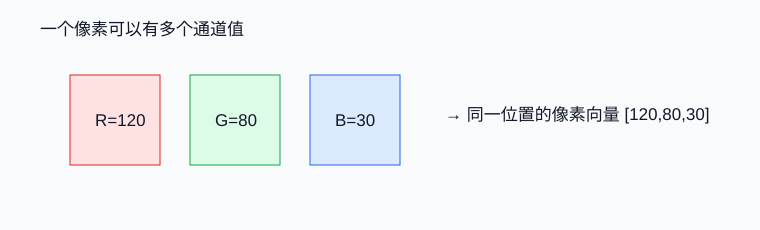
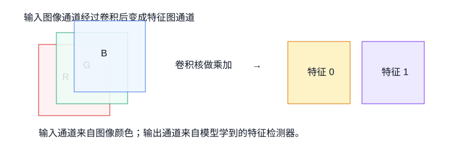

# 03 图像、特征图、通道

> 章节等级：A  
> 状态：发布候选
> 来源映射：`chapter_source_map.csv` 中的 03 章；本章主要承接 SRC16，参考 SRC03、SRC06。



## 本章知识全景图

| 项目 | 本章定位 |
| --- | --- |
| 章节等级 | A |
| 核心问题 | 本章把“图像、特征图、通道”落到可手算、可画图、可映射到 NPU 硬件的最小链路。 |
| 学习主线 | 先用具体数字建立直觉，再给正式定义，最后连接到 MAC、buffer、DMA、PE 阵列或编译器调度。 |
| 概念地图 | 输入对象 -> 计算规则 -> 输出结果 -> 硬件/软件代价 -> 常见误判。 |
| 最短路径 | 读例题，复算关键公式，检查图解，再用自测题判断是否能迁移到后续章节。 |

## 1. 学习目标

读完本章，你应该能够：
- 把图像理解成按高度、宽度、通道排列的数字。
- 解释像素、灰度图、RGB 通道、特征图、激活图之间的关系。
- 手算一个很小图像块的通道访问方式。
- 说明为什么 NPU 处理的是数字张量，而不是直接处理“图片语义”。

## 2. 先修提醒

你需要知道上一章的 shape 和 axis。这里的“通道”先按图像里的颜色层理解，后面再扩展到神经网络内部的特征层。

## 3. 生活化引入

手机屏幕上的一张图片，看起来是连续的颜色，其实可以拆成很多小格子。每个小格子叫像素。灰度图的一个像素只需要一个亮度数字；彩色图常用红、绿、蓝三个数字表示一个像素。

例如一个像素可以写成：

```text
R=120, G=80, B=30
```

这不是三个像素，而是同一个位置上的三个颜色通道。

## 4. 直觉解释

图像可以先看成二维表：高度方向有多少行，宽度方向有多少列。灰度图每个格子放一个数字：

```text
10 20 30
40 50 60
```

彩色图则是在每个位置放 3 个数字。为了方便计算，我们通常把它看成 3 张表：红色表、绿色表、蓝色表。每张表都和原图一样高、一样宽。

神经网络经过卷积后，输出不一定还是 RGB 三个颜色通道，而可能是 8、16、64 个“特征通道”。每个通道都是一张二维表，记录某种模式在不同位置的响应强弱。这样的二维表常叫 feature map，也叫特征图；如果强调它是经过某层计算得到的数值响应，也常叫 activation map。

通道可以理解成“同一个位置的多种描述”。在原始 RGB 图里，一个位置可以用红、绿、蓝三种颜色强度描述；在神经网络中间层，一个位置可以用“像不像竖边”“像不像横边”“像不像某种纹理”等很多数值响应描述。这些描述不一定能被人类直接命名，但它们都是同一空间位置上的不同数字层。

例如某个位置在两个特征通道上的值是：

```text
通道 0 响应 = 0.9
通道 1 响应 = 0.1
```

这可以粗略理解为：第 0 个模式在这里比较强，第 1 个模式在这里比较弱。硬件并不知道模式名字，只会存储和搬运这两个激活值。



## 5. 正式定义

- **像素**：图像中的一个空间位置。
- **灰度值**：描述亮度的一个数字，常见范围可以是 0 到 255，也可以是归一化后的 0 到 1。
- **通道**：同一空间位置上的一类数值层。RGB 图像有 3 个输入通道；神经网络中间层可以有更多特征通道。
- **图像张量**：把图像数字按 shape 存起来的张量。单张 RGB 图像常见逻辑形状可以是 `[3,H,W]` 或 `[H,W,3]`。
- **特征图 feature map**：神经网络某一层输出的空间响应表。一个输出通道对应一张特征图。
- **激活 activation**：神经网络某层输出的数值。特征图里的每个格子都是一个激活值。
- **activation map（激活图）**：强调某个通道在所有空间位置上的响应分布。很多场景下它和 feature map 可以近似互换使用；区别只在强调点不同。
- **输入通道**：当前层读取的通道，例如 RGB 的 3 个通道。
- **输出通道**：当前层生成的通道，每个输出通道通常对应一组卷积核权重。

## 6. 最小例题

一张 2 行 2 列灰度图：

```text
10 20
30 40
```

它的 shape 可以写成 `[H,W] = [2,2]`。访问第 1 行第 0 列，得到 `30`。

如果把它变成一张 RGB 图像，每个位置有 3 个数。例如左上角像素是：

```text
[R,G,B] = [10, 20, 30]
```

那么访问同一个空间位置时，还要说明通道：红色通道是 10，绿色通道是 20，蓝色通道是 30。

## 7. 完整例题

考虑一张很小的 RGB 图，形状 `[C,H,W] = [3,2,2]`：

```text
R 通道：
1 2
3 4

G 通道：
5 6
7 8

B 通道：
9  10
11 12
```

如果访问位置 `(行=1, 列=0)`，三个通道的值是：

```text
R = 3
G = 7
B = 11
```

这个位置的像素向量就是 `[3,7,11]`。如果某个卷积核想检测“偏红”的局部模式，它可能给 R 通道较大权重，给 G/B 通道较小或负权重。NPU 不知道“偏红”这个词，它只会执行通道上的乘加。

再看一个特征图例子。假设一层网络输出 2 个通道，每个通道 2 行 2 列：

```text
输出通道 0：
0 1
2 3

输出通道 1：
4 5
6 7
```

这表示同一张输入图在两个不同模式检测器下的响应。通道 0 可能更像边缘响应，通道 1 可能更像纹理响应；具体含义来自模型训练，不是硬件写死的。

再补一个“响应强弱”的小例子。假设某个 2x2 灰度窗口是：

```text
0 1
0 1
```

一个偏向检测右侧亮、左侧暗的核是：

```text
-1 1
-1 1
```

逐项相乘并求和：

```text
0*(-1) + 1*1 + 0*(-1) + 1*1 = 2
```

如果窗口变成左右都亮：

```text
1 1
1 1
```

响应是：

```text
1*(-1) + 1*1 + 1*(-1) + 1*1 = 0
```

这个核不是“懂边缘”，而是通过正负权重让某种局部差异得到高响应。输出特征图就是把这个核在不同位置得到的响应排成表。

如果同一层有两个核，就会产生两个输出通道：

```text
核 A：更关注左右差异 -> 输出通道 A
核 B：更关注上下差异 -> 输出通道 B
```

同一位置的两个输出值，合起来就是这个位置的两种新描述。下一层会继续把这些描述当作输入通道使用。

## 8. NPU 连接

图像进入 NPU 前会变成张量。NPU 的 DMA 看到的是一段段数字，buffer 存的是输入 tile、权重 tile 和输出 tile。卷积计算时，一个输出像素常常需要读取输入图像的一个局部窗口，并且可能跨多个通道读取数字。

通道数直接影响计算量。单通道 3x3 卷积只需要 9 次乘法得到一个输出；如果输入有 3 个通道，同一个输出位置就要对 3 个通道各做 9 次乘法，总共 27 次乘法，再把它们累加。后面多通道卷积会详细展开。

特征图也影响 buffer 设计。若特征图很大，片上 SRAM 放不下整张图，就要切成 tile；若通道很多，可能按通道分块；若 layout 不合适，DMA 读取会变成跳跃访问，降低效率。

从硬件角度看，一张图像进入 NPU 后至少牵涉三类数据：

| 数据 | 例子 | 硬件关注点 |
| --- | --- | --- |
| 输入激活 | 原图或上一层 feature map | 能否连续读取窗口和通道 |
| 权重 | 卷积核里的数字 | 能否在多个空间位置复用 |
| 输出激活 | 新 feature map | 部分和在哪里累加、何时写回 |

通道数增加时，最明显的变化是一个输出值要跨更多输入通道累加。例如从 3 通道到 64 通道，单个 3x3 输出位置的乘法数从 `3*3*3=27` 变成 `64*3*3=576`。这还只是一个输出通道、一个空间位置。NPU 之所以需要 PE 阵列和片上 buffer，就是因为这些通道维度会迅速放大计算量和搬运量。

这也解释了为什么本章必须放在卷积之前：如果不理解通道和特征图，卷积就很容易被误解成“在一张二维图片上滑一个小矩阵”。真实模型里，卷积往往是在多通道输入上生成多通道输出。

## 9. 常见误区

### 误区 1：NPU 直接理解图片内容

- 错误说法：NPU 看见猫、车、人脸。
- 为什么错：NPU 接收的是数字张量，语义是模型计算和后处理给出的解释。
- 正确理解：硬件只做数值计算，识别结果来自模型结构和权重。

### 误区 2：通道只等于 RGB

- 错误说法：通道最多就是红绿蓝三层。
- 为什么错：神经网络中间层的通道可以是 8、32、256 等，表示不同特征响应。
- 正确理解：通道是一组并列的数值层，不局限于颜色。

### 误区 3：feature map 和原图一样容易理解

- 错误说法：每张特征图都能直接解释成一种人类可见物体。
- 为什么错：很多通道是模型内部特征组合，并不对应直观物体名。
- 正确理解：特征图是响应数字表，能否可视化解释要看层级和模型。

### 误区 4：图像大小只影响显示，不影响硬件

- 错误说法：图片大一点只是显示更清楚。
- 为什么错：高度、宽度、通道数直接决定乘加次数、数据搬运量和 buffer 需求。
- 正确理解：图像 shape 是 NPU 计算量和访存量的直接来源。

## 10. 本章自测

### 题目

1. 什么是像素？
2. 灰度图和 RGB 图的通道数有什么不同？
3. `[3,224,224]` 可以怎样理解？
4. feature map 是什么？
5. activation map 和 feature map 的关系是什么？
6. 为什么中间层通道数可以不是 3？
7. 单通道 3x3 窗口有多少个输入数字？
8. 三通道 3x3 窗口有多少个输入数字？
9. 为什么图像越大，NPU 的数据搬运压力越大？
10. NPU 为什么不直接处理“边缘”这个词？

### 答案或评分点

1. 图像中的一个空间格子或采样位置。
2. 灰度图通常 1 个亮度通道，RGB 图有红绿蓝 3 个通道。
3. 3 个通道，每个通道 224 行 224 列。
4. 某层输出的一张空间响应表。
5. feature map 由激活值组成；强调空间表时叫特征图，强调数值响应时叫激活。
6. 中间层通道表示模型学到的不同特征，不受 RGB 限制。
7. 9 个。
8. 27 个。
9. 高度、宽度、通道增加会增加输入、输出和中间结果的元素数量。
10. 硬件只读取数字并做乘加，“边缘”是人类对某些响应模式的解释。

## 11. 终稿候选补强：通道增长为什么会压到硬件

RGB 图像只有 3 个通道，但中间层经常有 16、32、64 甚至更多通道。这个增长不是图像颜色变多了，而是网络用多组卷积核提取多种响应。每个输出通道都是一张新的响应图，表示某一组权重在各个空间位置上的计算结果。


图中第一层把 3 通道输入变成 8 个输出通道。下一层再看这 8 个通道时，单个输出位置不再只读 RGB 三层，而是要读 8 个输入通道上的局部窗口。于是通道数增长会同时放大三件事：权重数量、单个输出的 MAC 数、输入 tile 在 buffer 中的占用。

一个小算例可以固定直觉。若输入是 `C=3,H=5,W=5`，3x3 卷积产生 `C_out=8`，不考虑 padding 时输出空间是 `3x3`。每个输出位置、每个输出通道需要 `3*3*3=27` 次乘法；整层乘法数是 `8*3*3*27=1944`。如果下一层输入通道变成 8，同样 3x3、输出 16 通道，单个输出通道的一个位置就要 `8*3*3=72` 次乘法。硬件压力不是“图片更大”这一句话能概括的，而是空间、通道、输出通道三者一起相乘。


特征图进入 NPU 时通常不会整张常驻片上 SRAM。更常见的方式是切成 tile：取一块空间区域、若干输入通道、若干输出通道的权重，在片上完成一批输出，再换下一块。判断 tile 是否合理，要看窗口重叠是否带来输入复用，通道块是否匹配 MAC 阵列宽度，输出部分和是否能在片上保留到累加结束。

本章的边界也要说清：feature map 不是人眼可解释图片的保证。浅层通道可能还能看出边缘、纹理、颜色差异，深层通道往往是任务相关的内部表示。NPU 不理解“车轮”这个词，它只接收一批数，按权重做乘加、比较、归一化和搬运。

## 12. 终稿候选复核例题：特征图不是图片缩略图

假设输入是 4x4 灰度图，第一层用了 2 个 3x3 卷积核，stride=1，不加 padding。输出空间是 2x2，输出通道数是 2，所以输出 shape 是 `[2,2,2]`。这不是“两张更小的图片”这么简单，而是同一空间位置有两种响应：第 0 个通道可能对竖直差异敏感，第 1 个通道可能对水平差异敏感。下一层看到的输入通道数就是 2，而不是原来的 1。

若下一层使用 4 个 3x3 卷积核，它的每个输出通道都要同时读取前一层 2 个输入通道。也就是说，中间层通道不是视觉装饰，而是下一层计算量的乘数。`C_in` 从 2 增到 32 时，单个输出位置需要读取和相乘的输入通道也随之增长。NPU 的 buffer 规划必须考虑这些通道是否一次放得下，还是要分通道块累加。

一个常见误判是把 feature map 可视化图当成模型解释本身。可视化只是在某些样本、某些通道上的投影，不能证明硬件理解了语义。硬件只保证按模型图执行数值计算。真正能落到工程判断的是 shape、通道数、窗口大小、layout 和 tile：它们决定一次搬多少数据、复用多少次、写回多少输出。

写论文或报告时，特征图章节应承担“从图像直觉过渡到张量执行”的角色。建议写清三句话：输入图像被编码为带通道的数值张量；卷积核把局部窗口变成输出响应；输出响应按空间位置和输出通道重新组成 feature map。这样读者才能从图片概念走到后面的卷积、数据流和 NPU 存储层级。

## 13. 发布前可复现实验：特征图通道增长

本章进入发布候选前，必须能用一个很小的实验把核心机制跑通。推荐实验形态是 `C_in=3,C_out=8,H=W=5,R=S=3`。实验不追求真实模型规模，而是让读者能逐项核对输入、输出、中间值和硬件含义。若小实验都说不清，放到真实 NPU 上只会把错误隐藏在更大的日志里。

实验记录至少写四项。第一，逻辑 shape：每个维度代表什么，谁是 batch，谁是通道，谁是空间或矩阵公共维。第二，数据顺序：内存里相邻元素是谁，DMA 能否连续读取，是否需要 layout 转换。第三，中间状态：部分和、窗口、旁路张量或 tile 在哪里暂存，什么时候清零，什么时候变成最终输出。第四，失败信号：若输出不对，先查 shape 和边界，再查 layout 和地址，最后查量化、饱和或写回顺序。

对本章来说，实验的重点是 通道响应、输出 shape、buffer tile。这三个词必须落到具体数字。例如不要只说“复用输入”，而要说明哪一个输入值被几个输出使用；不要只说“部分和变宽”，而要列出单次乘积范围和累加项数；不要只说“layout 更快”，而要指出连续读取的是通道、空间行，还是 blocked 通道组。这样的记录才能让后续章节复用，而不是变成一句抽象经验。

论文或学习笔记中可以把这个实验写成一个短表：

| 检查项 | 应填写内容 | 不合格信号 |
|---|---|---|
| shape | 输入、权重、输出的完整维度 | 只写总元素数 |
| 访问 | 连续读取方向、stride、tile 大小 | 地址跳跃但没有解释 |
| 中间值 | psum/窗口/旁路/tile 的保存位置 | 中间值过早写回外存 |
| 硬件连接 | MAC、PE、buffer、DMA 或 runtime 中的落点 | 只停留在数学公式 |

本章最应避免的错误是：把中间通道解释成人眼可读图层。它的工程后果通常不是“文字不严谨”，而是性能或数值直接出问题：PE 空等、外存带宽暴涨、输出 shape 与参考框架不一致、量化误差扩大，或者编译器无法选择合理 tile。发布候选不是把概念讲顺，而是让这些失败能被读者提前识别。

最后给出一个自检口径：合上正文后，读者应能独立画出数据从输入到输出的路径，并指出至少一个复用点、一个边界条件和一个失败信号。若只能背定义，说明本章还停在知识点层；若能用小实验解释硬件后果，才算真正支撑后续 NPU 设计章节。

## 14. 术语边界与失败排查：pixel、channel、feature map、activation

发布前还要把本章术语边界钉住，因为很多 NPU 错误不是公式不会算，而是把相邻术语混在一起。`pixel、channel、feature map、activation` 这些词在数学、模型图、编译器和硬件里各有落点。读者必须能说出每个词对应的数据对象、循环边界和硬件位置，否则后续章节会在 PE、buffer、DMA、dataflow 处反复断线。

第一条边界是“数学对象”和“存储对象”的区别。数学对象说明这个量应该怎样参与计算，存储对象说明这个量在内存里怎样排列。一个矩阵在公式中有行列，在内存中可能是 row-major、column-major 或 blocked；一个特征张量在模型图中有 N/C/H/W，在硬件中可能被切成空间 tile、通道 tile 或输出通道 tile。写教材时不能只停在数学对象，也不能直接跳到硬件术语，中间必须给出存储和访问口径。

第二条边界是“最终输出”和“中间状态”的区别。NPU 最容易出错的地方往往是中间状态：部分和还没累加完、窗口还没覆盖完、旁路张量还没对齐、tile 还没完成 K 方向归约。若把中间状态提前当成最终输出，就会造成数值错误；若把中间状态频繁写回外存，就会造成性能和能耗问题。正文中的每个例题都应说明中间值在哪里、何时有效、何时失效。

第三条边界是“可并行”和“值得并行”的区别。很多输出位置、输出通道或矩阵元素在数学上相互独立，可以并行；但硬件是否值得并行，还要看数据供给、buffer 容量、片上互连、端口冲突和写回顺序。若并行度超过数据供给能力，PE 数增加只会让空等更明显。讲 NPU 时，凡是出现“可以同时算”，都应接一句“前提是数据能同时到达并且中间值能放得下”。

本章最常见误解是：把特征图当成人眼能直接理解的图片。它的排查方法是把一个小样例拆成三张表：输入表列出每个元素的索引和内存位置；计算表列出每一步乘、加、比较或选择；输出表列出最终写回的 shape 和地址。三张表对不上时，不要先怀疑模型，而要先查术语边界是否混乱。

工程失败信号集中在：通道数增长后 buffer 放不下、下一层输入维度误判。这些信号出现时，报告里应写清“错在定义、错在地址、错在调度，还是错在量化”。如果只是写“性能不佳”或“结果不对”，读者无法复现，也无法连接到后续硬件章节。终稿候选的最低要求，是每个失败都能被追溯到一个术语边界和一个可执行检查。

最后给一个复习口令：先问对象是谁，再问形状是什么，再问存在内存哪里，再问谁复用它，再问什么时候写回。这个顺序能贯穿本书前 9 章。它把零基础读者从“看懂概念”推进到“能检查 NPU 执行计划”，也是基础篇进入微架构篇前必须建立的共同语言。

## 15. 最小验收样例：用通道哨兵值检查 feature map

检查 feature map 通道语义时，可以构造一个 3 通道输入：第 0 通道全填 10，第 1 通道全填 20，第 2 通道全填 30。再使用一个 1x1 卷积核，让某个输出通道只读取第 1 个输入通道，权重为 1，其余权重为 0。正确输出应全部为 20。若输出混入 10 或 30，说明通道顺序、layout 或权重读取发生了错位。

这个实验也能说明中间层通道的本质：通道不是颜色标签，而是一组并行数值平面。只要权重指定读取哪个通道，输出就应忠实反映那个通道。后续多通道卷积、输出通道和 GEMM lowering 都可以沿用这个验收思路：先用哨兵值让每个轴可识别，再检查硬件是否按预期消费这些轴。若通道哨兵在第一层就错位，后面再谈特征提取、数据复用或分类精度都没有意义；这也是 bring-up 阶段必须先用小张量而不是直接跑大模型的原因，定位会更快，错误也更可复现。

补充一句验收标准：读者应能用通道哨兵值复现一次通道错位，并说明它如何影响下一层卷积。

## 来源

- 本地来源：SRC18《NPU神经网络编译器TVM NPU后端从入门到精通》，路径 `C:\Users\11035\Desktop\ic\npu\14、NPU\《NPU神经网络编译器TVM NPU后端从入门到精通》\03.html` line 357，说明卷积中的权重、输入数据存在空间/通道复用；SRC16《NPU模型量化与算子融合优化从入门到精通》，路径 `C:\Users\11035\Desktop\ic\npu\14、NPU\《NPU模型量化与算子融合优化从入门到精通》\01.html` line 204、line 228，把 NPU 优化对象落到矩阵乘加、卷积和激活。
- 外部来源：CS231n Convolutional Networks `https://cs231n.github.io/convolutional-networks/` 支撑 volume、channel、filter、activation map 术语；ONNX Conv `https://onnx.ai/onnx/operators/onnx__Conv.html` 支撑输入 X、权重 W、输出 Y 的张量角色；MLIR Linalg `https://mlir.llvm.org/docs/Dialects/Linalg/` 支撑从张量索引到循环映射的解释。
- 本章来源落点：CS231n 用于图像、特征图和通道定义；ONNX 用于约束 Conv 张量角色；本地 SRC18/SRC16 用于把特征图通道连接到复用、buffer 和 NPU 算子执行。
