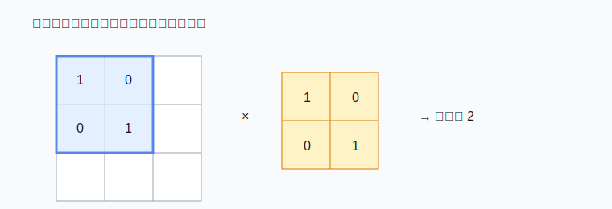
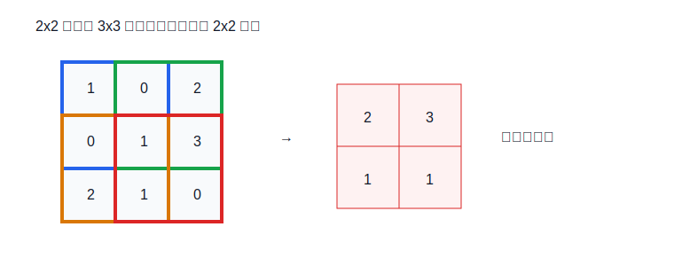

# 04 单通道卷积到底在做什么

> 章节等级：A  
> 状态：drafting  
> 来源映射：`chapter_source_map.csv` 中的 04 章；本章主要承接 SRC17、SRC16，参考 SRC12。



## 1. 学习目标

读完本章，你应该能够：
- 解释卷积为什么存在：用小窗口在整张图上寻找局部模式。
- 说清卷积核、窗口、滑动、输出特征图分别是什么。
- 手算一个单通道 3x3 输入和 2x2 卷积核得到 2x2 输出的全过程。
- 把卷积计算连接到 MAC、PE、buffer、数据复用和 dataflow。

## 2. 先修提醒

你需要理解数字表、矩阵、shape、图像像素和单通道特征图。这里先只讲单通道、步幅为 1、无 padding 的最小卷积。多通道、stride、padding 后续章节再展开。

## 3. 生活化引入

假设你在一张黑白小图里找竖线。你不会一次看完整张大图再凭感觉判断，而是拿一个小模板在图上挪动：先看左上角一块，再向右挪，再向下挪。每到一个位置，就问：“这块区域像不像我要找的模式？”

卷积就是这种思想的数值版本。小模板叫卷积核；被模板覆盖的局部区域叫窗口；窗口和卷积核逐项相乘再相加，得到这个位置的响应值。响应值越大，通常说明这个局部窗口越像卷积核想检测的模式。

## 4. 直观解释

卷积存在的原因有三个：

1. 图像中的有用模式通常是局部的，例如边缘、角点、纹理。
2. 同一种模式可能出现在不同位置，所以同一个卷积核要在整张图上共享使用。
3. 小窗口能减少参数数量，并让计算结构规则，方便硬件重复执行。

如果卷积核是：

```text
0 1
0 1
```

它更关注窗口右侧两格。如果某个窗口右侧数字大，乘加结果就会大。卷积核不是直接写着“竖线”，而是用权重数字表达一种局部偏好。



## 5. 正式定义

在本章的单通道、无 padding、stride=1 场景中：

- **输入特征图**：一个二维数字表，形状为 `H x W`。
- **卷积核 kernel**：一个较小的二维权重表，形状为 `R x S`。
- **窗口**：输入上与卷积核同样大小的局部区域。
- **卷积输出**：每个合法窗口位置产生一个数字。
- **输出高度**：`OH = H - R + 1`。
- **输出宽度**：`OW = W - S + 1`。

某个输出位置 `(oh, ow)` 的计算是：

```text
out[oh][ow] = sum over r,s of input[oh+r][ow+s] * kernel[r][s]
```

这条公式只是压缩写法。真正执行时，它会展开成多次 MAC。

## 6. 最小例题

输入窗口：

```text
2 0
1 3
```

卷积核：

```text
1 2
0 1
```

逐项相乘：

```text
2*1 = 2
0*2 = 0
1*0 = 0
3*1 = 3
```

相加：

```text
2 + 0 + 0 + 3 = 5
```

这个 `5` 就是卷积核放在当前窗口位置时的输出响应。

## 7. 完整例题

输入是 3 行 3 列：

```text
1 0 2
0 1 3
2 1 0
```

卷积核是 2 行 2 列：

```text
1 0
0 1
```

输出大小：

```text
OH = 3 - 2 + 1 = 2
OW = 3 - 2 + 1 = 2
```

所以输出是 2 行 2 列。逐个位置计算。

位置 `(0,0)`，窗口是：

```text
1 0
0 1
```

计算：

```text
1*1 + 0*0 + 0*0 + 1*1 = 2
```

位置 `(0,1)`，窗口向右滑一格：

```text
0 2
1 3
```

计算：

```text
0*1 + 2*0 + 1*0 + 3*1 = 3
```

位置 `(1,0)`，窗口回到左侧并向下滑一格：

```text
0 1
2 1
```

计算：

```text
0*1 + 1*0 + 2*0 + 1*1 = 1
```

位置 `(1,1)`：

```text
1 3
1 0
```

计算：

```text
1*1 + 3*0 + 1*0 + 0*1 = 1
```

最终输出：

```text
2 3
1 1
```

现在把第一个输出位置写成 MAC：

```text
sum = 0
sum = sum + input[0][0]*kernel[0][0] = 1
sum = sum + input[0][1]*kernel[0][1] = 1
sum = sum + input[1][0]*kernel[1][0] = 1
sum = sum + input[1][1]*kernel[1][1] = 2
```

所有输出位置都重复这件事：取窗口、乘权重、累加、写输出。

## 8. NPU 连接

卷积在 NPU 上通常会展开成规则循环。对于每个输出位置，硬件读取一个输入窗口和卷积核权重，执行一串 MAC。PE 可以负责一个或多个输出位置；多个 PE 可以同时处理不同窗口、不同输出通道或不同 tile。

数据复用是关键。上面 3x3 输入里的中间数字 `1` 会被多个 2x2 窗口使用。如果每次窗口滑动都重新从外部内存搬整块数据，DMA 压力会很大。更好的做法是把一部分输入行放进片上 buffer，让相邻窗口复用已经搬进来的数据。卷积核权重也会在整张图上重复使用，适合暂存在 PE 附近或权重 buffer 中。

dataflow 关注的是数据停在哪里、怎么移动。例如 weight-stationary 会尽量让权重留在 PE 内，输入流过阵列；output-stationary 会尽量让部分和留在本地直到累加完成。无论采用哪种 dataflow，本质目标都是减少昂贵的数据搬运，让 MAC 阵列持续工作。

## 9. 常见误区

### 误区 1：卷积只是套公式

- 错误说法：记住 `out=sum input*kernel` 就够了。
- 为什么错：公式没有告诉你窗口如何移动、哪些输入被复用、硬件如何读写。
- 正确理解：把公式展开成窗口、MAC、循环和数据搬运。

### 误区 2：卷积核真的懂“边缘”

- 错误说法：卷积核知道自己在找边缘或纹理。
- 为什么错：卷积核只是权重数字；“检测什么”是人类对响应模式的解释。
- 正确理解：窗口和权重匹配时响应变大，模型通过训练学到这些权重。

### 误区 3：窗口越大一定越好

- 错误说法：更大窗口能看更多信息，所以总是更好。
- 为什么错：窗口越大，乘加次数、参数数量和访存压力越大。
- 正确理解：窗口大小是表达能力、计算量和硬件效率之间的权衡。

### 误区 4：相邻输出互不相关

- 错误说法：每个输出值都完全独立计算。
- 为什么错：相邻窗口大量重叠，使用许多相同输入。
- 正确理解：这种重叠正是 NPU 设计 buffer 和 dataflow 的复用机会。

## 10. 本章自测

### 题目

1. 卷积为什么使用局部窗口？
2. 什么是卷积核？
3. 单通道输入 5x5、卷积核 3x3、stride=1、无 padding，输出大小是多少？
4. 一个 3x3 卷积核计算一个输出需要几次乘法？
5. 为什么同一个卷积核要在不同位置共享使用？
6. 计算窗口 `[[1,2],[3,4]]` 与核 `[[0,1],[1,0]]` 的输出。
7. 什么是部分和？
8. 为什么相邻窗口会带来数据复用机会？
9. buffer 在卷积中有什么作用？
10. dataflow 主要回答什么问题？

### 答案或评分点

1. 因为图像模式常局部出现，小窗口能检测局部模式并减少参数。
2. 卷积核是一组小尺寸权重，用来和输入窗口做乘加。
3. `OH=5-3+1=3`，`OW=3`，输出 3x3。
4. 9 次乘法。
5. 同一种局部模式可能出现在不同位置，共享权重可减少参数并保持平移处理一致。
6. `1*0 + 2*1 + 3*1 + 4*0 = 5`。
7. MAC 累加过程中尚未完成或刚完成的中间和。
8. 窗口滑动一格后大部分输入仍然重叠。
9. 暂存输入、权重或部分和，减少外部内存访问。
10. 数据在 PE、buffer、内存之间如何移动、停留和复用。

## 来源

- 本地来源：SRC17（硬件循环与数据流架构）、SRC16（算子与模型优化）、SRC12（内存带宽与 DMA 优化）。
- 外部来源：卷积神经网络教材（卷积定义与局部感受野）、MLSys Book（深度学习算子与加速器）、Eyeriss dataflow 相关论文（数据复用与 dataflow）。
