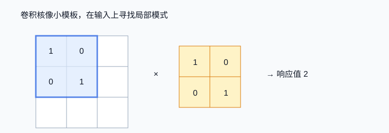
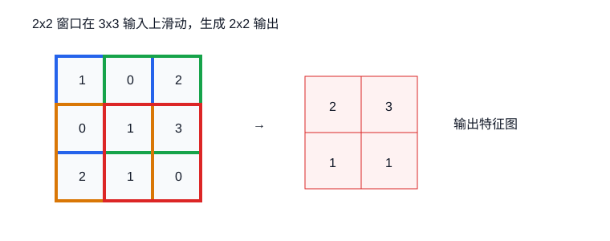
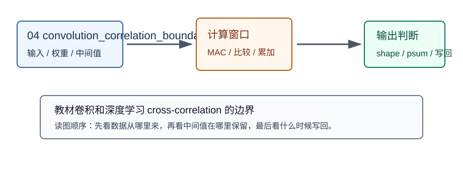
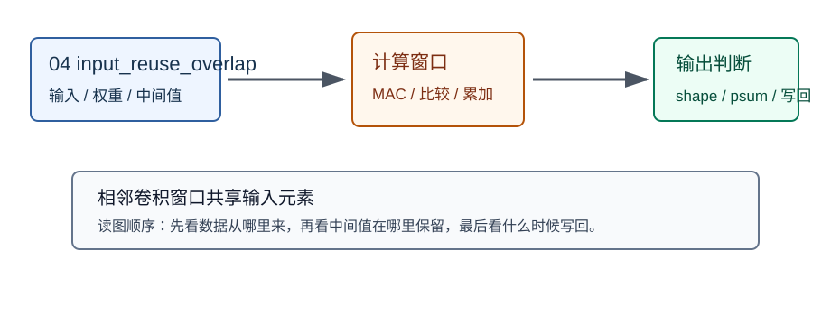

# 04 单通道卷积到底在做什么

> 章节等级：A  
> 状态：发布候选
> 来源映射：`chapter_source_map.csv` 中的 04 章；本章主要承接 SRC17、SRC16，参考 SRC12。



## 本章知识全景图

| 项目 | 本章定位 |
| --- | --- |
| 章节等级 | A |
| 核心问题 | 本章把“单通道卷积”落到可手算、可画图、可映射到 NPU 硬件的最小链路。 |
| 学习主线 | 先用具体数字建立直觉，再给正式定义，最后连接到 MAC、buffer、DMA、PE 阵列或编译器调度。 |
| 概念地图 | 输入对象 -> 计算规则 -> 输出结果 -> 硬件/软件代价 -> 常见误判。 |
| 最短路径 | 读例题，复算关键公式，检查图解，再用自测题判断是否能迁移到后续章节。 |

## 1. 学习目标

读完本章，你应该能够：
- 解释卷积为什么存在：用小窗口在整张图上寻找局部模式。
- 说清卷积核、窗口、滑动、输出特征图分别是什么。
- 手算一个单通道 3x3 输入和 2x2 卷积核得到 2x2 输出的全过程。
- 把卷积计算连接到 MAC、PE、buffer、数据复用和 dataflow。

## 2. 先修提醒

你需要理解数字表、矩阵、shape、图像像素和单通道特征图。这里先只讲单通道、步幅为 1、无 padding 的最小卷积。多通道、stride、padding 后续章节再展开。

## 3. 生活化引入

假设你在一张黑白小图里找竖线。你不会一次看完整张大图再凭感觉判断，而是拿一个小模板在图上挪动：先看左上角一块，再向右挪，再向下挪。每到一个位置，就问：“这块区域像不像我要找的模式？”

卷积就是这种思想的数值版本。小模板叫卷积核；被模板覆盖的局部区域叫窗口；窗口和卷积核逐项相乘再相加，得到这个位置的响应值。响应值越大，通常说明这个局部窗口越像卷积核想检测的模式。

为什么不直接把整张图摊平成一个大向量，再用一个巨大的全连接计算？因为图像有很强的空间结构。相邻像素往往相关，边缘、角点、纹理这类早期模式通常只需要看一小块区域。如果每个输出都连接整张图，参数会非常多，也会丢掉“相邻位置关系”这个重要线索。卷积用小窗口先处理局部，再把同一个窗口规则滑过整张图，正好符合图像的局部性。

另一个原因是共享。假设一个“竖边”可能出现在左上角，也可能出现在右下角。我们不希望左上角和右下角各自学一套完全不同的检测器。卷积让同一个卷积核在所有位置使用，这叫权重共享。它减少参数，也让模型更容易处理“同一种模式出现在不同位置”的情况。

## 4. 直觉解释

卷积存在的原因有三个：

1. 图像中的有用模式通常是局部的，例如边缘、角点、纹理。
2. 同一种模式可能出现在不同位置，所以同一个卷积核要在整张图上共享使用。
3. 小窗口能减少参数数量，并让计算结构规则，方便硬件重复执行。

如果卷积核是：

```text
0 1
0 1
```

它更关注窗口右侧两格。如果某个窗口右侧数字大，乘加结果就会大。卷积核不是直接写着“竖线”，而是用权重数字表达一种局部偏好。

再看一个更直观的 2x2 模式。窗口 A 是右侧亮、左侧暗：

```text
0 3
0 3
```

窗口 B 是左右都亮：

```text
3 3
3 3
```

如果卷积核是：

```text
-1 1
-1 1
```

那么窗口 A 的响应是：

```text
0*(-1) + 3*1 + 0*(-1) + 3*1 = 6
```

窗口 B 的响应是：

```text
3*(-1) + 3*1 + 3*(-1) + 3*1 = 0
```

这说明卷积核可以让某些局部差异得到更高响应。它没有“看懂边缘”，只是对一种数字排列更敏感。



## 5. 正式定义

在本章的单通道、无 padding、stride=1 场景中：

- **输入特征图**：一个二维数字表，形状为 `H x W`。
- **卷积核 kernel**：一个较小的二维权重表，形状为 `R x S`。
- **窗口**：输入上与卷积核同样大小的局部区域。
- **卷积输出**：每个合法窗口位置产生一个数字。
- **输出高度**：`OH = H - R + 1`。
- **输出宽度**：`OW = W - S + 1`。
- **边界**：窗口不能完整覆盖的位置。在本章无 padding 场景中，窗口不能越出输入边界，所以输出会比输入小。
- **权重共享**：同一个卷积核在所有合法窗口位置重复使用。
- **局部感受野**：一个输出值实际看到的输入局部区域。本章里就是一个 `R x S` 窗口。

某个输出位置 `(oh, ow)` 的计算是：

```text
out[oh][ow] = sum over r,s of input[oh+r][ow+s] * kernel[r][s]
```

这条公式只是压缩写法。真正执行时，它会展开成多次 MAC。

## 6. 最小例题

输入窗口：

```text
2 0
1 3
```

卷积核：

```text
1 2
0 1
```

逐项相乘：

```text
2*1 = 2
0*2 = 0
1*0 = 0
3*1 = 3
```

相加：

```text
2 + 0 + 0 + 3 = 5
```

这个 `5` 就是卷积核放在当前窗口位置时的输出响应。

如果把核换成：

```text
0 1
1 0
```

同一个窗口的响应就变成：

```text
2*0 + 0*1 + 1*1 + 3*0 = 1
```

输入窗口没变，卷积核变了，输出响应就变了。这是理解“模型权重决定检测偏好”的最小例子。

## 7. 完整例题

输入是 3 行 3 列：

```text
1 0 2
0 1 3
2 1 0
```

卷积核是 2 行 2 列：

```text
1 0
0 1
```

输出大小：

```text
OH = 3 - 2 + 1 = 2
OW = 3 - 2 + 1 = 2
```

所以输出是 2 行 2 列。逐个位置计算。

位置 `(0,0)`，窗口是：

```text
1 0
0 1
```

计算：

```text
1*1 + 0*0 + 0*0 + 1*1 = 2
```

位置 `(0,1)`，窗口向右滑一格：

```text
0 2
1 3
```

计算：

```text
0*1 + 2*0 + 1*0 + 3*1 = 3
```

位置 `(1,0)`，窗口回到左侧并向下滑一格：

```text
0 1
2 1
```

计算：

```text
0*1 + 1*0 + 2*0 + 1*1 = 1
```

位置 `(1,1)`：

```text
1 3
1 0
```

计算：

```text
1*1 + 3*0 + 1*0 + 0*1 = 1
```

最终输出：

```text
2 3
1 1
```

现在把第一个输出位置写成 MAC：

```text
sum = 0
sum = sum + input[0][0]*kernel[0][0] = 1
sum = sum + input[0][1]*kernel[0][1] = 1
sum = sum + input[1][0]*kernel[1][0] = 1
sum = sum + input[1][1]*kernel[1][1] = 2
```

所有输出位置都重复这件事：取窗口、乘权重、累加、写输出。

这个例子还可以看出边界为什么会让输出变小。2x2 卷积核必须完整盖住输入区域。对于 3x3 输入，左上角起点只能是：

```text
(0,0)  (0,1)
(1,0)  (1,1)
```

不能从 `(0,2)` 开始，因为窗口会伸到输入右边界外；也不能从 `(2,0)` 开始，因为窗口会伸到下边界外。因此无 padding、stride=1 时输出是 2x2，而不是 3x3。后续 padding 章节会解释：如果在边缘补 0，就能让窗口在边缘位置也有完整的计算区域。

再做一个 4x4 输入、3x3 核的完整输出大小和每个输出位置手算。输入：

```text
1 2 0 1
0 1 3 2
2 1 0 1
1 0 2 3
```

核：

```text
1 0 1
0 1 0
1 0 1
```

输出大小：

```text
OH = 4 - 3 + 1 = 2
OW = 4 - 3 + 1 = 2
```

位置 `(0,0)` 的窗口是：

```text
1 2 0
0 1 3
2 1 0
```

计算：

```text
1*1 + 2*0 + 0*1
+ 0*0 + 1*1 + 3*0
+ 2*1 + 1*0 + 0*1
= 4
```

位置 `(0,1)` 的窗口是：

```text
2 0 1
1 3 2
1 0 1
```

计算：

```text
2*1 + 0*0 + 1*1
+ 1*0 + 3*1 + 2*0
+ 1*1 + 0*0 + 1*1
= 8
```

位置 `(1,0)` 的窗口是：

```text
0 1 3
2 1 0
1 0 2
```

计算：

```text
0*1 + 1*0 + 3*1
+ 2*0 + 1*1 + 0*0
+ 1*1 + 0*0 + 2*1
= 7
```

位置 `(1,1)` 的窗口是：

```text
1 3 2
1 0 1
0 2 3
```

计算：

```text
1*1 + 3*0 + 2*1
+ 1*0 + 0*1 + 1*0
+ 0*1 + 2*0 + 3*1
= 6
```

最终输出：

```text
4 8
7 6
```

这个例子比 2x2 核多了一个关键直觉：一个输出值可能来自 9 次乘法，真正花时间的是大量重复的乘加，而不是公式本身。

## 8. NPU 连接

卷积在 NPU 上通常会展开成规则循环。对于每个输出位置，硬件读取一个输入窗口和卷积核权重，执行一串 MAC。PE 可以负责一个或多个输出位置；多个 PE 可以同时处理不同窗口、不同输出通道或不同 tile。

数据复用是关键。上面 3x3 输入里的中间数字 `1` 会被多个 2x2 窗口使用。如果每次窗口滑动都重新从外部内存搬整块数据，DMA 压力会很大。更好的做法是把一部分输入行放进片上 buffer，让相邻窗口复用已经搬进来的数据。卷积核权重也会在整张图上重复使用，适合暂存在 PE 附近或权重 buffer 中。

dataflow 关注的是数据停在哪里、怎么移动。例如 weight-stationary 会尽量让权重留在 PE 内，输入流过阵列；output-stationary 会尽量让部分和留在本地直到累加完成。无论采用哪种 dataflow，本质目标都是减少昂贵的数据搬运，让 MAC 阵列持续工作。

把本章 3x3 输入、2x2 核映射到硬件，可以拆成三层：

1. **MAC 层**：每个输出位置需要 4 次 `sum += input*weight`。4 个输出位置一共 16 次乘法。
2. **PE 层**：一个 PE 可以顺序算一个输出位置；4 个 PE 可以并行算 4 个输出位置；也可以用更少 PE 分时复用。
3. **buffer 层**：输入第 1 行和第 2 行会被多个窗口共享，中间元素也会被多个输出复用。把这些行暂存在片上 buffer，可以减少重复从外部内存读取。

以 3x3 输入为例，中心元素 `input[1][1]` 同时出现在四个 2x2 窗口中：

```text
窗口 (0,0): 包含 input[1][1]
窗口 (0,1): 包含 input[1][1]
窗口 (1,0): 包含 input[1][1]
窗口 (1,1): 包含 input[1][1]
```

如果中心元素每次都从外部内存读，就会读 4 次；如果先放入片上 buffer，再被多个 PE 或多个时间步复用，就能节省带宽和能量。卷积硬件优化的很多技巧，都是围绕“让被反复用的数据尽量靠近 MAC”展开的。

再看部分和。一个 3x3 核计算一个输出时，9 个乘积要累成 1 个结果。硬件可以让某个 PE 保留这个部分和：

```text
sum = 0
第 1 个乘积 -> sum
第 2 个乘积 -> sum
...
第 9 个乘积 -> 最终输出
```

如果中途把 sum 写到外部内存再读回来，会非常浪费。因此 output-stationary 这类 dataflow 会尽量让部分和停在本地，直到它真的完成。

卷积也天然适合流水化。DMA 预取下一块输入 tile，buffer 保存当前窗口附近的行，PE 阵列持续做 MAC，输出 buffer 暂存结果并写回。理想状态下，搬运和计算交叠进行，PE 不空等；如果 tile 选择不好、layout 不合适或 buffer 太小，PE 就会因为等数据而闲置。

## 9. 常见误区

### 误区 1：卷积只是套公式

- 错误说法：记住 `out=sum input*kernel` 就够了。
- 为什么错：公式没有告诉你窗口如何移动、哪些输入被复用、硬件如何读写。
- 正确理解：把公式展开成窗口、MAC、循环和数据搬运。

### 误区 2：卷积核真的懂“边缘”

- 错误说法：卷积核知道自己在找边缘或纹理。
- 为什么错：卷积核只是权重数字；“检测什么”是人类对响应模式的解释。
- 正确理解：窗口和权重匹配时响应变大，模型通过训练学到这些权重。

### 误区 3：窗口越大一定越好

- 错误说法：更大窗口能看更多信息，所以总是更好。
- 为什么错：窗口越大，乘加次数、参数数量和访存压力越大。
- 正确理解：窗口大小是表达能力、计算量和硬件效率之间的权衡。

### 误区 4：相邻输出互不相关

- 错误说法：每个输出值都完全独立计算。
- 为什么错：相邻窗口大量重叠，使用许多相同输入。
- 正确理解：这种重叠正是 NPU 设计 buffer 和 dataflow 的复用机会。

### 误区 5：padding 只是为了让图像尺寸好看

- 错误说法：padding 只是工程上凑尺寸。
- 为什么错：padding 改变了边界位置是否能被窗口覆盖，也会影响输出大小和边缘信息保留。
- 正确理解：无 padding 时边缘参与计算次数更少；padding 可以让边缘也拥有合法窗口，但补入的值也会影响响应。

### 误区 6：卷积输出越大说明越“正确”

- 错误说法：响应值大就一定代表识别正确。
- 为什么错：单个卷积响应只说明当前窗口和当前权重的数值匹配程度，不能单独代表最终分类。
- 正确理解：神经网络会把很多层、很多通道、很多位置的响应组合起来，最后才形成任务输出。

## 10. 本章自测

### 题目

1. 卷积为什么使用局部窗口？
2. 什么是卷积核？
3. 单通道输入 5x5、卷积核 3x3、stride=1、无 padding，输出大小是多少？
4. 一个 3x3 卷积核计算一个输出需要几次乘法？
5. 为什么同一个卷积核要在不同位置共享使用？
6. 计算窗口 `[[1,2],[3,4]]` 与核 `[[0,1],[1,0]]` 的输出。
7. 什么是部分和？
8. 为什么相邻窗口会带来数据复用机会？
9. buffer 在卷积中有什么作用？
10. dataflow 主要回答什么问题？

### 答案或评分点

1. 因为图像模式常局部出现，小窗口能检测局部模式并减少参数。
2. 卷积核是一组小尺寸权重，用来和输入窗口做乘加。
3. `OH=5-3+1=3`，`OW=3`，输出 3x3。
4. 9 次乘法。
5. 同一种局部模式可能出现在不同位置，共享权重可减少参数并保持平移处理一致。
6. `1*0 + 2*1 + 3*1 + 4*0 = 5`。
7. MAC 累加过程中尚未完成或刚完成的中间和。
8. 窗口滑动一格后大部分输入仍然重叠。
9. 暂存输入、权重或部分和，减少外部内存访问。
10. 数据在 PE、buffer、内存之间如何移动、停留和复用。

## 11. 终稿候选补强：卷积边界和输入复用

深度学习框架里的 Conv 通常执行的是 cross-correlation 形式：窗口里的输入和权重按同一方向逐项相乘再求和，不强制把核翻转 180 度。传统信号处理教材中的严格卷积会讨论核翻转。对本书的 NPU 学习来说，关键不是争论名字，而是明确采用哪一种算子约定，并让权重训练、模型导出、推理执行保持一致。



图中同一个 2x2 权重，若翻转和不翻转，参与相乘的位置会不同。训练好的神经网络权重已经适配了框架的算子定义；推理硬件只要忠实执行模型图中的 Conv 约定即可。错误地在硬件侧多翻一次核，会把每个局部模式的响应位置打乱，属于功能错误，不是性能优化。

卷积对 NPU 有价值，还因为相邻输出窗口高度重叠。一个 3x3 窗口向右移动一格，通常只有一列新输入进入，另外两列可以复用。若每个输出都重新从外部内存读取完整 3x3 窗口，访存量会被严重放大；若用 line buffer 或片上 tile 保留相邻窗口共享的数据，就能让 MAC 阵列持续工作。



一个工程判断例子：输入 5x5、核 3x3、stride=1 时输出 3x3，共 9 个输出。朴素读法会读取 `9*9=81` 个输入位置；但原始输入只有 25 个位置，且很多位置被多个窗口重复使用。NPU 的输入 buffer、line buffer、tile 策略就是围绕这种复用设计的。窗口复用越好，单位外部内存访问能支撑的 MAC 越多。

本章因此给卷积一个硬件化定义：卷积是把一个局部窗口、一个权重窗口和一个输出位置绑定起来的规则重复。它同时规定计算、访问和复用。只会算一个输出值还不够；能看出哪些输入会被相邻输出复用，才算开始理解卷积为什么适合专用加速。

## 12. 终稿候选复核例题：边界窗口和复用收益

以 6x6 输入、3x3 核、stride=1、padding=0 为例，输出是 4x4。中心区域的输入元素会被多个窗口复用，角落元素只被少数窗口使用。具体看输入位置 `(2,2)`，它会落入多个 3x3 窗口；输入位置 `(0,0)` 只能落入左上角附近的窗口。这说明卷积的访存复用不是均匀的，边界和中心的复用次数不同。

如果 stride 变成 2，输出变成 2x2，窗口重叠减少，输入复用也减少。MAC 次数下降了，但某些硬件上的阵列利用率未必线性提高，因为输出点变少后，可并行分配的空间位置也变少。工程判断必须同时看计算量、复用率和并行粒度。只说 stride=2 更快是不完整的。

写论文时，卷积章节应避免把重点停在“公式如下”。更好的解释是：卷积用局部连接减少参数，用权重共享保留空间模式，用滑动窗口产生输出特征图，用输入复用降低搬运成本。对应到 NPU，局部窗口决定输入 tile，权重共享决定权重驻留，滑动顺序决定地址生成，部分和决定累加器和写回时机。

## 13. 发布前可复现实验：卷积窗口复用

本章进入发布候选前，必须能用一个很小的实验把核心机制跑通。推荐实验形态是 `6x6 input, 3x3 kernel, stride=1`。实验不追求真实模型规模，而是让读者能逐项核对输入、输出、中间值和硬件含义。若小实验都说不清，放到真实 NPU 上只会把错误隐藏在更大的日志里。

实验记录至少写四项。第一，逻辑 shape：每个维度代表什么，谁是 batch，谁是通道，谁是空间或矩阵公共维。第二，数据顺序：内存里相邻元素是谁，DMA 能否连续读取，是否需要 layout 转换。第三，中间状态：部分和、窗口、旁路张量或 tile 在哪里暂存，什么时候清零，什么时候变成最终输出。第四，失败信号：若输出不对，先查 shape 和边界，再查 layout 和地址，最后查量化、饱和或写回顺序。

对本章来说，实验的重点是 窗口起点、重叠输入、line buffer 复用。这三个词必须落到具体数字。例如不要只说“复用输入”，而要说明哪一个输入值被几个输出使用；不要只说“部分和变宽”，而要列出单次乘积范围和累加项数；不要只说“layout 更快”，而要指出连续读取的是通道、空间行，还是 blocked 通道组。这样的记录才能让后续章节复用，而不是变成一句抽象经验。

论文或学习笔记中可以把这个实验写成一个短表：

| 检查项 | 应填写内容 | 不合格信号 |
|---|---|---|
| shape | 输入、权重、输出的完整维度 | 只写总元素数 |
| 访问 | 连续读取方向、stride、tile 大小 | 地址跳跃但没有解释 |
| 中间值 | psum/窗口/旁路/tile 的保存位置 | 中间值过早写回外存 |
| 硬件连接 | MAC、PE、buffer、DMA 或 runtime 中的落点 | 只停留在数学公式 |

本章最应避免的错误是：每个输出都重新从外存读取完整窗口。它的工程后果通常不是“文字不严谨”，而是性能或数值直接出问题：PE 空等、外存带宽暴涨、输出 shape 与参考框架不一致、量化误差扩大，或者编译器无法选择合理 tile。发布候选不是把概念讲顺，而是让这些失败能被读者提前识别。

最后给出一个自检口径：合上正文后，读者应能独立画出数据从输入到输出的路径，并指出至少一个复用点、一个边界条件和一个失败信号。若只能背定义，说明本章还停在知识点层；若能用小实验解释硬件后果，才算真正支撑后续 NPU 设计章节。

## 来源

- 本地来源：SRC17《NPU硬件循环与数据流架构从入门到精通》，路径 `C:\Users\11035\Desktop\ic\npu\14、NPU\《NPU硬件循环与数据流架构从入门到精通》\01.html` line 377 到 line 393，给出 3x3 卷积硬件循环伪代码和 PE 展开说明；SRC01《NPU Andes NPU IP核设计从入门到精通》，路径 `C:\Users\11035\Desktop\ic\npu\14、NPU\《NPU Andes NPU IP核设计从入门到精通》\02.html` line 333 到 line 344，描述卷积层配置、DMA 预取、PE 乘加、激活/池化和写回流程。
- 外部来源：ONNX Conv `https://onnx.ai/onnx/operators/onnx__Conv.html` 支撑 pads、strides、dilations、输入输出维度约束；CS231n Convolutional Networks `https://cs231n.github.io/convolutional-networks/` 支撑局部连接、filter、stride 和 zero-padding；MLIR Linalg `https://mlir.llvm.org/docs/Dialects/Linalg/` 支撑把卷积窗口看成结构化循环空间。
- 本章来源落点：ONNX/CS231n 用于核对卷积窗口和边界语义；SRC17 用于把窗口计算展开成循环和 MAC；SRC01 用于说明同一层在 NPU 中由配置、搬运、计算和写回组成。
