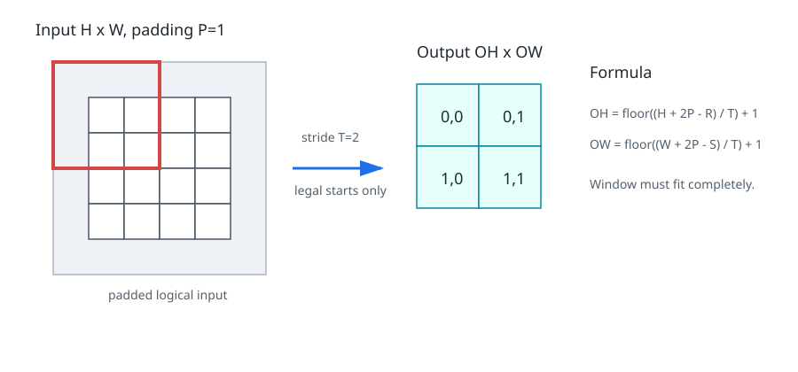
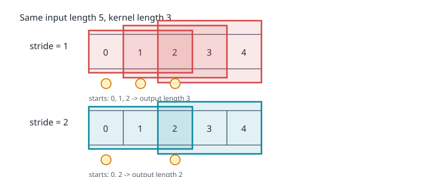
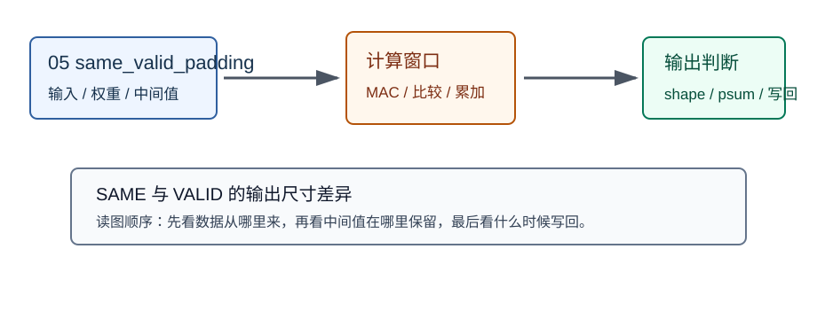
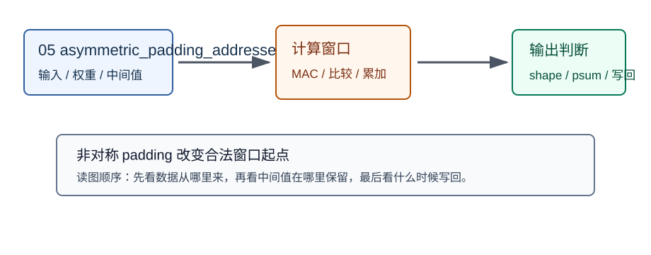

# 05 stride、padding、输出尺寸

> 章节等级：A  
> 状态：发布候选
> 来源映射：`chapter_source_map.csv` 中的 05 章；本章主要承接 SRC17、SRC16，参考 SRC12。



## 本章知识全景图

| 项目 | 本章定位 |
| --- | --- |
| 章节等级 | A |
| 核心问题 | 本章把“stride、padding、输出尺寸”落到可手算、可画图、可映射到 NPU 硬件的最小链路。 |
| 学习主线 | 先用具体数字建立直觉，再给正式定义，最后连接到 MAC、buffer、DMA、PE 阵列或编译器调度。 |
| 概念地图 | 输入对象 -> 计算规则 -> 输出结果 -> 硬件/软件代价 -> 常见误判。 |
| 最短路径 | 读例题，复算关键公式，检查图解，再用自测题判断是否能迁移到后续章节。 |

## 1. 学习目标

读完本章，你应该能够：

- 解释 stride 为什么会让窗口“跳着走”，padding 为什么会让边缘也参与计算。
- 手算单通道卷积在给定输入大小、卷积核大小、stride 和 padding 时的输出高度与输出宽度。
- 区分“补零改变输入边界”和“步幅改变窗口起点间隔”这两件事。
- 把输出尺寸变化连接到 NPU 的循环次数、MAC 次数、buffer 读取和输出写回。

## 2. 先修提醒

本章承接第 04 章的单通道卷积。你需要已经能手算：一个输入窗口和一个卷积核逐项相乘再累加，得到一个输出值。这里仍然只讲单通道卷积，不讲多通道累加，也不讲多个卷积核生成多个输出通道。多通道会放到第 06 章，多卷积核会放到第 07 章。

本章会出现两个英文词：`stride` 和 `padding`。先把它们当成窗口移动规则和边界处理规则，不要急着背公式。公式只是把窗口能放在哪里压缩成一行表达式；真正理解要从“窗口左上角能落在哪些位置”开始。

## 3. 生活化引入

想象你在用一个 2x2 的小印章检查一张格子纸。上一章默认的做法是：印章从左上角开始，每次向右挪 1 格，走到一行末尾后再向下挪 1 格。这就是 stride=1 的直觉。

如果你觉得格子太密，不想每个位置都检查，可以每次向右挪 2 格、向下也挪 2 格。这样检查点少了，输出格子也少了。这就是 stride 变大。

再想象印章到了边缘。没有 padding 时，印章必须完整盖在原来的纸面上，不能伸出去，所以边缘外侧没法作为窗口的一部分。加 padding 就像在纸的四周先贴上一圈空白格，让印章在原本边缘附近也能完整落下。神经网络里最常见的是补 0，所以也叫 zero padding。

## 4. 直觉解释

stride 和 padding 解决的是两个不同问题：

1. **stride 决定窗口起点之间隔多远。** stride=1 表示相邻输出对应的窗口起点相差 1 格；stride=2 表示相差 2 格。
2. **padding 决定输入边界外是否先补一些格子。** padding=0 表示不补；padding=1 表示上下左右各补 1 圈。
3. **输出尺寸来自合法窗口起点数量。** 窗口起点越多，输出越大；窗口跳得越远，起点越少；边界补得越多，起点可能越多。

先看 5 个位置的一维直觉。输入长度是 5，核长度是 3：

```text
输入位置：0 1 2 3 4
核长度：  [x x x]
```

无 padding、stride=1 时，窗口起点可以是 0、1、2：

```text
起点 0 覆盖 0 1 2
起点 1 覆盖 1 2 3
起点 2 覆盖 2 3 4
```

所以输出长度是 3。如果 stride=2，起点只能是 0、2，输出长度变成 2。不是因为卷积核变了，而是因为你少检查了一些中间位置。

padding 的直觉则相反。输入两边各补 1 个 0 后，逻辑长度从 5 变成 7：

```text
补后位置：P 0 1 2 3 4 P
数值理解：0 a b c d e 0
```

核长度仍然是 3、stride=1 时，合法起点会变多。原来最左边的输入 `a` 只能出现在窗口左侧或中间；补 0 后，它也能出现在更靠边的窗口里。这样边缘位置参与计算的机会增加，输出尺寸也可能保持得更接近输入尺寸。



## 5. 正式定义

本章仍然采用单通道二维卷积。设输入高度和宽度为：

```text
H, W
```

卷积核高度和宽度为：

```text
R, S
```

上下左右 padding 都相同，记为：

```text
P
```

高度方向和宽度方向 stride 相同，记为：

```text
T
```

补零后的逻辑输入大小是：

```text
H_pad = H + 2P
W_pad = W + 2P
```

输出高度和输出宽度是：

```text
OH = floor((H + 2P - R) / T) + 1
OW = floor((W + 2P - S) / T) + 1
```

这里的 `floor` 表示向下取整。为什么要向下取整？因为最后一个窗口必须完整落在补零后的输入范围内。如果剩下一小段不够卷积核完整覆盖，就不能生成一个完整输出。

如果高度和宽度使用不同 stride 或 padding，可以写成：

```text
OH = floor((H + P_top + P_bottom - R) / T_h) + 1
OW = floor((W + P_left + P_right - S) / T_w) + 1
```

常见的 `same` padding 目标是让 stride=1 时输出尺寸尽量等于输入尺寸；常见的 `valid` 卷积就是不补 padding，只保留卷积核完整落在原输入内部的位置。不同框架对偶数核、非对称 padding 的命名细节可能不同，零基础阶段先掌握窗口起点逻辑，比背名字更稳。

## 6. 最小例题

输入是 4x4，卷积核是 2x2，无 padding，stride=1：

```text
H = 4, W = 4
R = 2, S = 2
P = 0
T = 1
```

输出高度：

```text
OH = floor((4 + 2*0 - 2) / 1) + 1
   = floor(2 / 1) + 1
   = 3
```

输出宽度同理：

```text
OW = 3
```

所以输出是 3x3。

如果只把 stride 改成 2：

```text
OH = floor((4 - 2) / 2) + 1
   = floor(1) + 1
   = 2
```

输出变成 2x2。窗口不是不能算中间位置，而是我们规定每次跳 2 格，所以只取起点 0 和 2。

## 7. 完整例题

现在做一个完整手算。输入是 4 行 4 列：

```text
1 2 0 1
0 1 3 2
2 1 0 1
1 0 2 3
```

卷积核是 3 行 3 列：

```text
1 0 1
0 1 0
1 0 1
```

设置：

```text
padding P = 1
stride  T = 2
```

先补零。补后输入是 6x6：

```text
0 0 0 0 0 0
0 1 2 0 1 0
0 0 1 3 2 0
0 2 1 0 1 0
0 1 0 2 3 0
0 0 0 0 0 0
```

输出尺寸：

```text
OH = floor((4 + 2*1 - 3) / 2) + 1
   = floor(3 / 2) + 1
   = 1 + 1
   = 2

OW = 2
```

所以输出是 2x2。stride=2 表示窗口左上角只取补后输入中的这些起点：

```text
(0,0)  (0,2)
(2,0)  (2,2)
```

位置 `(0,0)` 的 3x3 窗口是：

```text
0 0 0
0 1 2
0 0 1
```

计算：

```text
0*1 + 0*0 + 0*1
+ 0*0 + 1*1 + 2*0
+ 0*1 + 0*0 + 1*1
= 2
```

位置 `(0,2)` 的窗口是：

```text
0 0 0
2 0 1
1 3 2
```

计算：

```text
0*1 + 0*0 + 0*1
+ 2*0 + 0*1 + 1*0
+ 1*1 + 3*0 + 2*1
= 3
```

位置 `(2,0)` 的窗口是：

```text
0 0 1
0 2 1
0 1 0
```

计算：

```text
0*1 + 0*0 + 1*1
+ 0*0 + 2*1 + 1*0
+ 0*1 + 1*0 + 0*1
= 3
```

位置 `(2,2)` 的窗口是：

```text
1 3 2
1 0 1
0 2 3
```

计算：

```text
1*1 + 3*0 + 2*1
+ 1*0 + 0*1 + 1*0
+ 0*1 + 2*0 + 3*1
= 6
```

最终输出是：

```text
2 3
3 6
```

这个例题里，padding 让窗口可以从补零区域开始；stride=2 又让窗口起点只取每隔 2 格的位置。两者共同决定输出大小和每个输出值看到的输入区域。

再做一个反例：如果同样输入和卷积核，但 padding=0、stride=2：

```text
OH = floor((4 - 3) / 2) + 1
   = floor(0.5) + 1
   = 1
```

输出只有 1x1。剩下那一格距离不够再放一个完整 3x3 窗口，所以不能生成第二个输出。

## 8. NPU 连接

stride 和 padding 不只是数学参数，它们会改变硬件要做多少工作。

输出尺寸决定输出位置数量。单通道卷积里，每个输出位置需要 `R*S` 次乘法。于是大致乘法次数是：

```text
OH * OW * R * S
```

例如 4x4 输入、3x3 核、padding=1、stride=2 时，输出是 2x2，每个输出需要 9 次乘法，总乘法次数是：

```text
2 * 2 * 9 = 36
```

如果 stride=1，输出会是：

```text
OH = floor((4 + 2 - 3) / 1) + 1 = 4
OW = 4
```

乘法次数变成：

```text
4 * 4 * 9 = 144
```

这说明 stride 变大通常会减少输出数量和计算量，但也会降低空间采样密度。模型为什么能接受这种减少，要看网络设计目标；硬件只看到循环次数变少、输出写回变少、窗口起点变稀。

padding 对硬件的影响也很实际。补零不一定意味着真的在内存里复制一圈 0。NPU 或编译器可以在边界访问时识别“这里越界，乘以 0”，也可以在输入 buffer 中准备带边界的区域。无论采用哪种方式，控制逻辑都必须知道边界规则，否则会读错输入。

从循环角度看，卷积的外层循环大致会遍历输出高度和输出宽度：

```text
for oh in 0 .. OH-1:
  for ow in 0 .. OW-1:
    input_h_start = oh * T - P
    input_w_start = ow * T - P
```

这两行就是 stride 和 padding 进入地址计算的地方。stride 决定 `oh` 增加 1 时输入起点跳多远；padding 决定逻辑起点要向原输入外侧偏移多少。

因此，本章的输出尺寸不是纸面公式，而是 NPU 后续循环边界、地址发生器、输入读取、输出写回和 MAC 次数的共同入口。

## 9. 常见误区

### 误区 1：padding 只是为了把输出尺寸凑好看

- 错误说法：padding 只是为了让输入输出大小一样。
- 为什么错：padding 还决定边缘位置是否能作为完整窗口参与计算，并影响边缘数字参与次数。
- 正确理解：padding 是边界处理规则；保持尺寸只是其中一种常见结果。

### 误区 2：stride 变大只是让计算更快，没有代价

- 错误说法：stride 越大越省计算，所以越好。
- 为什么错：stride 变大会跳过一些窗口起点，输出空间采样更稀，可能丢失细节。
- 正确理解：stride 是计算量、输出分辨率和模型表达之间的取舍。

### 误区 3：输出尺寸可以靠感觉估计

- 错误说法：输入 5x5、核 3x3，大概输出 3x3 或 5x5，记个常见情况就行。
- 为什么错：一旦加入 padding 和 stride，靠感觉很容易错，尤其遇到不能整除时。
- 正确理解：回到合法窗口起点数量，或使用公式并注意向下取整。

### 误区 4：补零后的 0 和原图里的 0 完全一样

- 错误说法：padding 补出来的 0 就是输入真实测到的 0。
- 为什么错：补零是人为边界规则，不代表原图边界外真实存在黑色像素。
- 正确理解：补零只是让窗口在边缘有可计算的占位值。

### 误区 5：padding 一定需要真的把大输入复制一份

- 错误说法：加 padding 就必须在内存里新建一张更大的图。
- 为什么错：硬件和编译器可以用边界判断、地址映射或 buffer 填零来实现。
- 正确理解：padding 是逻辑规则，实现方式可以不同。

## 10. 本章自测

### 题目

1. stride 决定什么？
2. padding 决定什么？
3. 输入 7x7、核 3x3、padding=0、stride=1，输出大小是多少？
4. 输入 7x7、核 3x3、padding=1、stride=1，输出大小是多少？
5. 输入 7x7、核 3x3、padding=1、stride=2，输出大小是多少？
6. 为什么输出尺寸公式里要有 `floor`？
7. `same` padding 的直觉目标是什么？
8. stride 变大对 MAC 次数有什么影响？
9. padding 会怎样影响边缘像素参与计算？
10. 在地址计算 `input_h_start = oh*T - P` 中，`T` 和 `P` 分别体现了什么？

### 答案或评分点

1. stride 决定相邻窗口起点在输入上相隔多少格。
2. padding 决定输入边界外是否补占位值，以及补多少。
3. `OH=7-3+1=5`，输出 5x5。
4. `OH=(7+2-3)+1=7`，输出 7x7。
5. `OH=floor((7+2-3)/2)+1=floor(6/2)+1=4`，输出 4x4。
6. 因为最后剩余区域不够完整覆盖卷积核时，不能生成输出。
7. stride=1 时尽量让输出空间尺寸和输入相同。
8. 通常减少输出位置数量，从而减少总 MAC 次数。
9. padding 让边缘附近也能形成完整窗口，边缘像素参与更多窗口。
10. `T` 体现 stride 的跳步距离，`P` 体现补零后逻辑坐标相对原输入的偏移。

## 11. 终稿候选补强：SAME、VALID 与地址生成

`VALID` 的直觉是只计算完全落在原始输入内的窗口；`SAME` 的直觉是通过 padding 让输出空间尺寸按 stride 规则尽量保持输入尺度。官方算子文档通常不会只说“补到一样大”，而会把 padding、stride、kernel、dilation 一起放进输出尺寸公式。工程实现必须按明确公式生成窗口起点，不能靠肉眼估计。



以 5x5 输入、3x3 核、stride=1 为例，VALID 输出是 3x3；若上下左右各 pad 1，输出可以是 5x5。差异不只是尺寸变大，边界输出会读到补零位置。NPU 地址生成器在访问边界窗口时，要么真实读 padding 后的缓冲区，要么在地址逻辑里识别越界位置并注入 0。

非对称 padding 更容易出错。若左边 pad 0、右边 pad 1，上边 pad 1、下边 pad 0，窗口起点和输出坐标之间的映射就不再是左右对称。ONNX Conv 的 `pads` 属性按每个空间轴的 begin 和 end 记录，这种格式正是为了表达非对称 padding。



一个可复现检查：输入长度 `I=5`，kernel `K=3`，stride `S=2`，左 pad `P0=1`，右 pad `P1=0`，输出长度为 `floor((I+P0+P1-K)/S)+1 = floor((5+1-3)/2)+1 = 2`。两个窗口在 padded 坐标里的起点是 0 和 2，映射回原输入坐标是 -1 和 1。第一个窗口含有越界位置，必须由 padding 逻辑提供 0。

判断 stride/padding 的硬件实现是否可靠，可以看三条线：输出尺寸公式是否和模型格式一致；边界越界位置是否被确定处理；地址生成是否能覆盖非对称 padding、stride 大于 1、无法整除这些情况。只要其中一条模糊，后续卷积数值就可能和训练框架不一致。

## 12. 终稿候选复核例题：公式之外还要核对框架口径

不同框架对 `SAME` 的具体边界处理可能有差异，尤其在 stride 大于 1 时更容易混淆。因此工程实现不要只记“same 是输出和输入一样大”。更稳妥的做法是读取模型格式中的显式 padding，或者按该格式定义的 auto_pad 规则计算 begin/end padding，再生成窗口起点。

一个测试样例可以暴露问题：输入长度 4，kernel 3，stride 2。如果使用某种 SAME 规则，输出长度可能按 `ceil(4/2)=2` 得到；为了让两个窗口覆盖合理范围，需要在左右分配 padding。若实现端按 floor 或按对称 padding 写死，就可能得到不同输出。部署前应使用小张量把每个边界输出手算出来，与框架导出的参考输出逐项比较。

论文中解释 stride/padding 时，应说明它们在模型里的角色：stride 控制窗口采样密度，padding 控制边界信息如何参与计算，二者共同决定输出尺寸和后续层的计算量。对 NPU 来说，它们还决定地址生成器的步进、越界注入 0 的条件、以及边界窗口是否需要特殊处理。

## 13. 发布前可复现实验：padding 地址生成

本章进入发布候选前，必须能用一个很小的实验把核心机制跑通。推荐实验形态是 `I=5,K=3,S=2,pad_begin=1,pad_end=0`。实验不追求真实模型规模，而是让读者能逐项核对输入、输出、中间值和硬件含义。若小实验都说不清，放到真实 NPU 上只会把错误隐藏在更大的日志里。

实验记录至少写四项。第一，逻辑 shape：每个维度代表什么，谁是 batch，谁是通道，谁是空间或矩阵公共维。第二，数据顺序：内存里相邻元素是谁，DMA 能否连续读取，是否需要 layout 转换。第三，中间状态：部分和、窗口、旁路张量或 tile 在哪里暂存，什么时候清零，什么时候变成最终输出。第四，失败信号：若输出不对，先查 shape 和边界，再查 layout 和地址，最后查量化、饱和或写回顺序。

对本章来说，实验的重点是 输出尺寸公式、越界注零、非对称边界。这三个词必须落到具体数字。例如不要只说“复用输入”，而要说明哪一个输入值被几个输出使用；不要只说“部分和变宽”，而要列出单次乘积范围和累加项数；不要只说“layout 更快”，而要指出连续读取的是通道、空间行，还是 blocked 通道组。这样的记录才能让后续章节复用，而不是变成一句抽象经验。

论文或学习笔记中可以把这个实验写成一个短表：

| 检查项 | 应填写内容 | 不合格信号 |
|---|---|---|
| shape | 输入、权重、输出的完整维度 | 只写总元素数 |
| 访问 | 连续读取方向、stride、tile 大小 | 地址跳跃但没有解释 |
| 中间值 | psum/窗口/旁路/tile 的保存位置 | 中间值过早写回外存 |
| 硬件连接 | MAC、PE、buffer、DMA 或 runtime 中的落点 | 只停留在数学公式 |

本章最应避免的错误是：把 SAME/VALID 当成口号而不是模型格式规则。它的工程后果通常不是“文字不严谨”，而是性能或数值直接出问题：PE 空等、外存带宽暴涨、输出 shape 与参考框架不一致、量化误差扩大，或者编译器无法选择合理 tile。发布候选不是把概念讲顺，而是让这些失败能被读者提前识别。

最后给出一个自检口径：合上正文后，读者应能独立画出数据从输入到输出的路径，并指出至少一个复用点、一个边界条件和一个失败信号。若只能背定义，说明本章还停在知识点层；若能用小实验解释硬件后果，才算真正支撑后续 NPU 设计章节。

## 来源

- 本地来源：SRC17《NPU硬件循环与数据流架构从入门到精通》，路径 `C:\Users\11035\Desktop\ic\npu\14、NPU\《NPU硬件循环与数据流架构从入门到精通》\01.html` line 377 到 line 386，给出用 `oh * stride + kh`、`ow * stride + kw` 计算输入坐标的卷积索引；SRC01《NPU Andes NPU IP核设计从入门到精通》，路径 `C:\Users\11035\Desktop\ic\npu\14、NPU\《NPU Andes NPU IP核设计从入门到精通》\02.html` line 335，把权重地址、输入输出尺寸、卷积核大小写入层参数配置。
- 外部来源：ONNX Conv `https://onnx.ai/onnx/operators/onnx__Conv.html` 支撑 `auto_pad`、`pads`、`strides` 语义；CS231n Convolutional Networks `https://cs231n.github.io/convolutional-networks/` 支撑 spatial arrangement、stride、zero-padding 和输出尺寸解释；MLIR Linalg `https://mlir.llvm.org/docs/Dialects/Linalg/` 支撑把窗口索引看成结构化循环空间。
- 本章来源落点：ONNX/PyTorch 用于核对 stride/padding 的算子边界；CS231n 用于教学化输出尺寸推导；SRC17/SRC01 用于说明 stride/padding 最终会落到地址生成和层配置寄存器。
