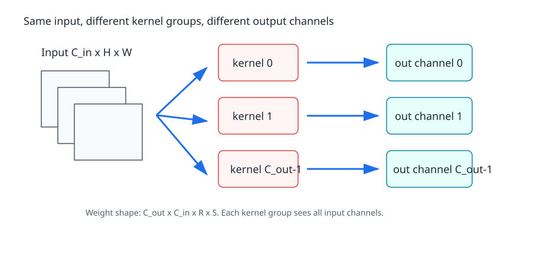
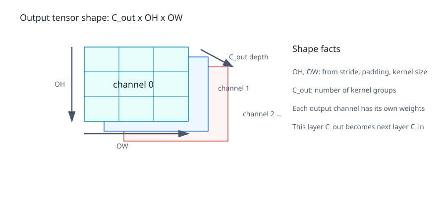
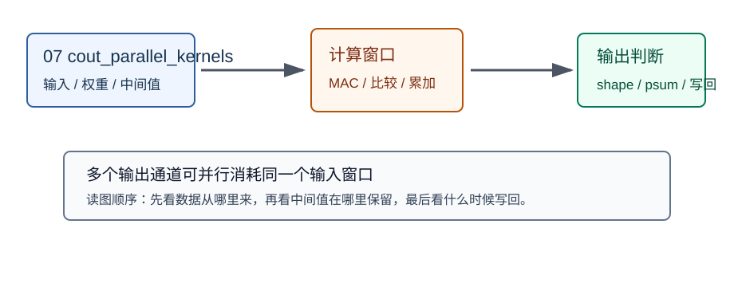
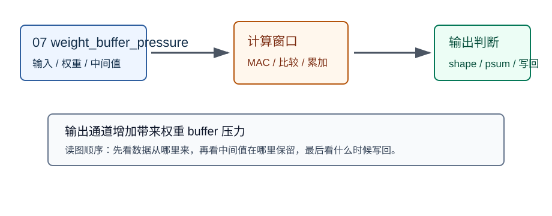

# 07 多卷积核、输出通道

> 章节等级：A  
> 状态：发布候选
> 来源映射：`chapter_source_map.csv` 中的 07 章；本章主要承接 SRC17、SRC16，参考 SRC01。



## 本章知识全景图

| 项目 | 本章定位 |
| --- | --- |
| 章节等级 | A |
| 核心问题 | 本章把“多卷积核、输出通道”落到可手算、可画图、可映射到 NPU 硬件的最小链路。 |
| 学习主线 | 先用具体数字建立直觉，再给正式定义，最后连接到 MAC、buffer、DMA、PE 阵列或编译器调度。 |
| 概念地图 | 输入对象 -> 计算规则 -> 输出结果 -> 硬件/软件代价 -> 常见误判。 |
| 最短路径 | 读例题，复算关键公式，检查图解，再用自测题判断是否能迁移到后续章节。 |

## 1. 学习目标

读完本章，你应该能够：

- 解释为什么一个卷积核组只生成一个输出通道，而多个卷积核组会生成多个输出通道。
- 区分输入通道 `C_in`、输出通道 `C_out`、卷积核空间大小 `R x S`。
- 手算 2 个输入通道、2 个卷积核组在同一输出位置生成 2 个输出通道的过程。
- 说明输出通道数增加后，NPU 的权重数量、MAC 次数、输出写回和并行机会如何变化。

## 2. 先修提醒

本章承接第 06 章：一个卷积核组的形状是 `C_in x R x S`，它会跨所有输入通道累加，生成一个输出通道中的一个输出位置。

本章只新增一个概念：**卷积核组可以有很多个**。每个卷积核组都有自己的一整套 `C_in x R x S` 权重。第 0 个核组生成输出通道 0，第 1 个核组生成输出通道 1，以此类推。

这里仍然不提前讲 GEMM、tile 或深入 dataflow。我们只把输出通道这件事讲清楚：它是模型表达能力和硬件工作量同时增加的来源。

## 3. 生活化引入

假设你在一张照片里同时想找三类线索：竖边、横边、斜边。一个检测器只擅长一种线索还不够，你需要多套检测器。每套检测器看同一块输入，但权重不同，因此得到不同响应。

卷积里的多个卷积核组就是多套检测器。它们读同一个输入特征图，但每个核组有自己的权重。核组 A 可能对某种局部模式响应更高，核组 B 对另一种模式响应更高。最后它们不是互相相加成一个数字，而是分别形成不同的输出通道。

所以输出通道可以理解成“同一空间位置上的多种新描述”。这和第 03 章的通道直觉一致：RGB 图像的一个位置有 R/G/B 三种描述；卷积输出的一个位置可以有 8、16、64 甚至更多种模型学到的描述。

## 4. 直觉解释

第 06 章讲的是：

```text
一个核组看完所有输入通道 -> 生成一个输出通道
```

本章讲的是：

```text
核组 0 看完所有输入通道 -> 输出通道 0
核组 1 看完所有输入通道 -> 输出通道 1
核组 2 看完所有输入通道 -> 输出通道 2
...
```

一个容易混淆的点是：每个输出通道都要看所有输入通道。不是输出通道 0 只看输入通道 0，也不是输出通道 1 只看输入通道 1。标准卷积中，每个核组都有 `C_in` 个通道平面，它会和全部输入通道相乘并累加。

用形状表达，输入是：

```text
C_in x H x W
```

权重是：

```text
C_out x C_in x R x S
```

输出是：

```text
C_out x OH x OW
```

输出空间大小 `OH x OW` 由输入空间、核大小、stride、padding 决定；输出通道数 `C_out` 由卷积核组数量决定。



## 5. 正式定义

设输入特征图为：

```text
input[c_in][h][w]
```

权重为：

```text
weight[c_out][c_in][r][s]
```

输出为：

```text
output[c_out][oh][ow]
```

单个输出通道 `co`、单个空间位置 `(oh, ow)` 的计算是：

```text
output[co][oh][ow] =
  sum over ci,r,s of
    input[ci][oh+r][ow+s] * weight[co][ci][r][s]
```

这个公式和第 06 章的差别只有一个：现在多了 `co`，也就是输出通道索引。每固定一个 `co`，就得到一个独立的核组；遍历所有 `co`，就得到所有输出通道。

参数数量是：

```text
C_out * C_in * R * S
```

如果每个输出通道还有一个 bias，bias 数量通常是：

```text
C_out
```

本章可以先把 bias 看成每个输出通道最后加上的一个常数，不影响理解卷积核组和输出通道的主线。

总乘法次数在 stride=1、padding=0 的单批输入中大致是：

```text
C_out * OH * OW * C_in * R * S
```

这行公式很重要：输出通道数 `C_out` 会把第 06 章的多通道卷积工作量再乘一遍。

## 6. 最小例题

输入有 2 个通道，同一个输出位置的 2x2 窗口如下：

```text
输入通道 0：
1 0
2 1

输入通道 1：
0 2
1 3
```

现在有 2 个卷积核组。核组 0：

```text
核组 0 / 通道 0：
1 1
0 1

核组 0 / 通道 1：
2 0
1 0
```

这是第 06 章最小例题的核组，输出通道 0 的值是：

```text
通道 0 贡献 = 1*1 + 0*1 + 2*0 + 1*1 = 2
通道 1 贡献 = 0*2 + 2*0 + 1*1 + 3*0 = 1
输出通道 0 = 2 + 1 = 3
```

核组 1：

```text
核组 1 / 通道 0：
0 1
1 0

核组 1 / 通道 1：
1 1
0 1
```

输出通道 1 的值是：

```text
通道 0 贡献 = 1*0 + 0*1 + 2*1 + 1*0 = 2
通道 1 贡献 = 0*1 + 2*1 + 1*0 + 3*1 = 5
输出通道 1 = 2 + 5 = 7
```

同一个输入窗口，因为使用了两套不同权重，得到两个输出通道值：

```text
[输出通道 0, 输出通道 1] = [3, 7]
```

## 7. 完整例题

现在手算一个完整但仍然很小的多输出通道例子。输入有 2 个通道，每个通道 3x3：

```text
输入通道 0：
1 0 2
0 1 3
2 1 0

输入通道 1：
0 1 1
2 0 1
1 3 2
```

使用 2 个卷积核组，每个核组都有 2 个输入通道平面、每个平面 2x2。

核组 0：

```text
通道 0：
1 0
0 1

通道 1：
0 1
1 0
```

核组 1：

```text
通道 0：
1 1
0 0

通道 1：
0 0
1 1
```

stride=1、padding=0，所以：

```text
OH = 3 - 2 + 1 = 2
OW = 2
C_out = 2
```

输出形状是：

```text
2 x 2 x 2
```

先算输出通道 0。这个核组和第 06 章完整例题相同，所以结果是：

```text
输出通道 0：
5 4
2 5
```

再完整手算输出通道 1。

位置 `(0,0)`：

```text
输入通道 0 窗口：
1 0
0 1

通道 0 贡献 = 1*1 + 0*1 + 0*0 + 1*0 = 1

输入通道 1 窗口：
0 1
2 0

通道 1 贡献 = 0*0 + 1*0 + 2*1 + 0*1 = 2

输出通道 1 的 (0,0) = 1 + 2 = 3
```

位置 `(0,1)`：

```text
输入通道 0 窗口：
0 2
1 3

通道 0 贡献 = 0*1 + 2*1 + 1*0 + 3*0 = 2

输入通道 1 窗口：
1 1
0 1

通道 1 贡献 = 1*0 + 1*0 + 0*1 + 1*1 = 1

输出 = 2 + 1 = 3
```

位置 `(1,0)`：

```text
输入通道 0 窗口：
0 1
2 1

通道 0 贡献 = 0*1 + 1*1 + 2*0 + 1*0 = 1

输入通道 1 窗口：
2 0
1 3

通道 1 贡献 = 2*0 + 0*0 + 1*1 + 3*1 = 4

输出 = 1 + 4 = 5
```

位置 `(1,1)`：

```text
输入通道 0 窗口：
1 3
1 0

通道 0 贡献 = 1*1 + 3*1 + 1*0 + 0*0 = 4

输入通道 1 窗口：
0 1
3 2

通道 1 贡献 = 0*0 + 1*0 + 3*1 + 2*1 = 5

输出 = 4 + 5 = 9
```

因此输出通道 1 是：

```text
3 3
5 9
```

最终输出张量可以写成：

```text
输出通道 0：
5 4
2 5

输出通道 1：
3 3
5 9
```

现在数计算量。每个输出值需要：

```text
C_in * R * S = 2 * 2 * 2 = 8
```

次乘法。输出总共有：

```text
C_out * OH * OW = 2 * 2 * 2 = 8
```

个值。所以总乘法次数是：

```text
8 * 8 = 64
```

这也可以用总公式直接得到：

```text
C_out * OH * OW * C_in * R * S
= 2 * 2 * 2 * 2 * 2 * 2
= 64
```

## 8. NPU 连接

输出通道数增加后，NPU 同时看到更大的工作量和更多并行机会。

工作量增加很直接。参数数量从一个核组的 `C_in*R*S`，变成 `C_out*C_in*R*S`。每个输出空间位置不再只算一个响应，而是要为每个输出通道各算一个响应。输出写回数量也乘上 `C_out`。

并行机会也增加。不同输出通道之间使用不同权重，但读取的是同一个输入窗口。硬件可以让多个 PE 或多个计算 lane 同时处理不同输出通道，从同一份输入窗口中复用输入数字，只是各自乘上不同权重并累加到各自的输出。

从数据角度看，同一个输入窗口可能被多个卷积核组共同使用：

```text
同一输入窗口 -> 核组 0 -> 输出通道 0
同一输入窗口 -> 核组 1 -> 输出通道 1
同一输入窗口 -> 核组 2 -> 输出通道 2
```

这给 buffer 设计带来机会：输入窗口如果已经在片上，就可以服务多个输出通道，减少重复从外部内存读取。但权重数量会随 `C_out` 增长，权重 buffer 和权重搬运压力也会变大。

输出通道还会影响后续层。当前层的 `C_out` 会成为下一层的 `C_in`。如果本层输出 64 个通道，下一层每个卷积核组就要看 64 个输入通道。于是输出通道数不仅影响本层计算，也会影响后续层的多通道累加深度。

因此，神经网络设计中常见的“通道数从 16 到 32 到 64 增长”，对 NPU 来说意味着：中间特征表达更丰富，同时计算量、权重量、buffer 压力和调度复杂度也逐步增加。

## 9. 常见误区

### 误区 1：一个 3x3 卷积核就是 9 个参数

- 错误说法：3x3 卷积核只有 9 个权重。
- 为什么错：这只适用于单输入通道、单输出通道。真实权重还要乘上 `C_in` 和 `C_out`。
- 正确理解：标准卷积权重数量是 `C_out*C_in*R*S`。

### 误区 2：输出通道和输入通道一一对应

- 错误说法：输出通道 0 来自输入通道 0，输出通道 1 来自输入通道 1。
- 为什么错：标准卷积中每个输出通道通常都会看所有输入通道。
- 正确理解：输出通道对应一个完整核组，核组内部包含所有输入通道的权重。

### 误区 3：多输出通道只是复制同一个结果

- 错误说法：多个输出通道只是把同一张输出图复制多份。
- 为什么错：不同核组权重不同，对同一输入窗口会产生不同响应。
- 正确理解：多个输出通道是多套检测器对同一输入的不同数值描述。

### 误区 4：增加输出通道只增加输出大小，不影响计算

- 错误说法：`C_out` 只让输出张量变厚。
- 为什么错：每个输出通道都需要独立核组计算，MAC 次数和权重数量都会增加。
- 正确理解：总计算量大致正比于 `C_out*OH*OW*C_in*R*S`。

### 误区 5：输出通道越多一定越好

- 错误说法：通道越多，模型一定更强，而且没有代价。
- 为什么错：更多通道会增加参数、计算、访存和后续层输入通道数。
- 正确理解：通道数是表达能力与硬件成本之间的取舍。

## 10. 本章自测

### 题目

1. 一个卷积核组生成几个输出通道？
2. `C_in=3,C_out=16,R=3,S=3` 时，权重数量是多少？
3. 输入 `C_in=2,H=5,W=5`，`C_out=4,R=3,S=3`，stride=1、padding=0，输出形状是多少？
4. 上题总乘法次数是多少？
5. 为什么每个输出通道通常都要看所有输入通道？
6. 输出通道数由什么决定？
7. 当前层的 `C_out` 对下一层有什么影响？
8. 多个输出通道给 NPU 带来什么复用机会？
9. 为什么权重 buffer 压力会随 `C_out` 增加？
10. 输入通道、输出通道、核空间大小三者在公式中分别扮演什么角色？

### 答案或评分点

1. 一个卷积核组生成一个输出通道。
2. `16*3*3*3=432` 个权重。
3. `OH=5-3+1=3`，`OW=3`，输出形状为 `4 x 3 x 3`。
4. `4*3*3*2*3*3 = 648` 次乘法。
5. 因为一个输出通道要综合所有输入通道的局部信息。
6. 由卷积核组数量，也就是 `C_out` 决定。
7. 当前层的 `C_out` 会成为下一层的输入通道数 `C_in`。
8. 同一个输入窗口可以被多个输出通道的核组复用。
9. 每增加一个输出通道，就增加一整套 `C_in*R*S` 权重。
10. `C_in` 决定每个输出值跨多少输入通道累加，`C_out` 决定有多少套输出响应，`R*S` 决定每个通道窗口内有多少空间乘加。

## 11. 终稿候选补强：输出通道是并行机会，也是权重压力

输出通道数 `C_out` 由卷积核组数决定。每一组核都会看所有输入通道和同一空间窗口，产生一个输出通道。它带来的好处是并行机会：同一个输入窗口可以同时喂给多组权重，多个 PE 分别计算不同输出通道。



图中输入窗口只取一次，却被 kernel0、kernel1、kernel2 复用。若阵列足够宽，多个输出通道可以并行计算；若阵列较窄，则需要分批处理 `C_out`。这解释了为什么输出通道既是模型表达能力的一部分，也是硬件调度维度。

代价是权重数量线性增长。卷积权重 shape 可写作 `C_out x C_in x R x S`。当 `C_out` 从 16 增到 64，输入通道和核大小不变，权重数量直接变成 4 倍。权重 buffer 如果放不下所有输出通道的权重，就要切输出通道 tile；切得过小会减少输入窗口复用，切得过大又可能挤占输入和输出部分和空间。



一个可复现判断：`C_in=32,R=S=3,C_out=64` 时权重数是 `64*32*3*3=18432`。若每个权重 1 byte，单层权重约 18 KB；若片上可给该层权重的空间只有 8 KB，就必须分多批输出通道装载。此时调度器要决定每批算多少 `C_out`，以及输入 tile 是否保留到多批权重都用完。

本章的工程结论是：输出通道不是“多几张图”这么简单。它决定下一层的输入通道数，决定权重存储规模，决定输入窗口复用机会，也决定输出 buffer 和后续带宽。读到任何卷积层配置时，都应立即把 `C_in,C_out,R,S,H,W` 放在一起看。

## 12. 终稿候选复核例题：按输出通道切 tile

假设 `C_out=64`，但片上权重 buffer 一次只能放 16 个输出通道的权重。调度器就可以把输出通道切成 4 批：先算 `oc=0..15`，再算 `16..31`，直到 `48..63`。如果输入 tile 能在这 4 批期间保留片上，输入复用很好；如果每批都重新加载输入 tile，带宽会增加 4 倍。

这也是为什么输出通道并行不是越多越好。并行输出通道需要更多权重端口、更多 accumulator、更多输出 buffer。若阵列很宽但权重供给不足，PE 会等权重；若权重一次装太多，输入或输出部分和可能放不下。好的 `C_out` tile 大小通常来自硬件向量宽度、SRAM 容量、DMA burst 和算子 shape 的共同约束。

论文中描述多输出通道时，可以把它写成“同一输入窗口被多组权重解释”。这句话比“生成多张图”更接近硬件：输入窗口是共享资源，权重组是并行消费者，输出通道是并行结果。后续做性能分析时，就能自然引出权重复用、输入复用和输出写回的权衡。

## 13. 发布前可复现实验：输出通道切块

本章进入发布候选前，必须能用一个很小的实验把核心机制跑通。推荐实验形态是 `C_out=64, output-channel tile=16`。实验不追求真实模型规模，而是让读者能逐项核对输入、输出、中间值和硬件含义。若小实验都说不清，放到真实 NPU 上只会把错误隐藏在更大的日志里。

实验记录至少写四项。第一，逻辑 shape：每个维度代表什么，谁是 batch，谁是通道，谁是空间或矩阵公共维。第二，数据顺序：内存里相邻元素是谁，DMA 能否连续读取，是否需要 layout 转换。第三，中间状态：部分和、窗口、旁路张量或 tile 在哪里暂存，什么时候清零，什么时候变成最终输出。第四，失败信号：若输出不对，先查 shape 和边界，再查 layout 和地址，最后查量化、饱和或写回顺序。

对本章来说，实验的重点是 权重块驻留、输入窗口复用、输出 buffer。这三个词必须落到具体数字。例如不要只说“复用输入”，而要说明哪一个输入值被几个输出使用；不要只说“部分和变宽”，而要列出单次乘积范围和累加项数；不要只说“layout 更快”，而要指出连续读取的是通道、空间行，还是 blocked 通道组。这样的记录才能让后续章节复用，而不是变成一句抽象经验。

论文或学习笔记中可以把这个实验写成一个短表：

| 检查项 | 应填写内容 | 不合格信号 |
|---|---|---|
| shape | 输入、权重、输出的完整维度 | 只写总元素数 |
| 访问 | 连续读取方向、stride、tile 大小 | 地址跳跃但没有解释 |
| 中间值 | psum/窗口/旁路/tile 的保存位置 | 中间值过早写回外存 |
| 硬件连接 | MAC、PE、buffer、DMA 或 runtime 中的落点 | 只停留在数学公式 |

本章最应避免的错误是：只增加输出通道并行度，不核对权重供给。它的工程后果通常不是“文字不严谨”，而是性能或数值直接出问题：PE 空等、外存带宽暴涨、输出 shape 与参考框架不一致、量化误差扩大，或者编译器无法选择合理 tile。发布候选不是把概念讲顺，而是让这些失败能被读者提前识别。

最后给出一个自检口径：合上正文后，读者应能独立画出数据从输入到输出的路径，并指出至少一个复用点、一个边界条件和一个失败信号。若只能背定义，说明本章还停在知识点层；若能用小实验解释硬件后果，才算真正支撑后续 NPU 设计章节。

## 14. 术语边界与失败排查：kernel group、output channel、weight tile

发布前还要把本章术语边界钉住，因为很多 NPU 错误不是公式不会算，而是把相邻术语混在一起。`kernel group、output channel、weight tile` 这些词在数学、模型图、编译器和硬件里各有落点。读者必须能说出每个词对应的数据对象、循环边界和硬件位置，否则后续章节会在 PE、buffer、DMA、dataflow 处反复断线。

第一条边界是“数学对象”和“存储对象”的区别。数学对象说明这个量应该怎样参与计算，存储对象说明这个量在内存里怎样排列。一个矩阵在公式中有行列，在内存中可能是 row-major、column-major 或 blocked；一个特征张量在模型图中有 N/C/H/W，在硬件中可能被切成空间 tile、通道 tile 或输出通道 tile。写教材时不能只停在数学对象，也不能直接跳到硬件术语，中间必须给出存储和访问口径。

第二条边界是“最终输出”和“中间状态”的区别。NPU 最容易出错的地方往往是中间状态：部分和还没累加完、窗口还没覆盖完、旁路张量还没对齐、tile 还没完成 K 方向归约。若把中间状态提前当成最终输出，就会造成数值错误；若把中间状态频繁写回外存，就会造成性能和能耗问题。正文中的每个例题都应说明中间值在哪里、何时有效、何时失效。

第三条边界是“可并行”和“值得并行”的区别。很多输出位置、输出通道或矩阵元素在数学上相互独立，可以并行；但硬件是否值得并行，还要看数据供给、buffer 容量、片上互连、端口冲突和写回顺序。若并行度超过数据供给能力，PE 数增加只会让空等更明显。讲 NPU 时，凡是出现“可以同时算”，都应接一句“前提是数据能同时到达并且中间值能放得下”。

本章最常见误解是：把输出通道只看成结果张数。它的排查方法是把一个小样例拆成三张表：输入表列出每个元素的索引和内存位置；计算表列出每一步乘、加、比较或选择；输出表列出最终写回的 shape 和地址。三张表对不上时，不要先怀疑模型，而要先查术语边界是否混乱。

工程失败信号集中在：权重 buffer 溢出、输入窗口复用失败、PE 等待权重。这些信号出现时，报告里应写清“错在定义、错在地址、错在调度，还是错在量化”。如果只是写“性能不佳”或“结果不对”，读者无法复现，也无法连接到后续硬件章节。终稿候选的最低要求，是每个失败都能被追溯到一个术语边界和一个可执行检查。

最后给一个复习口令：先问对象是谁，再问形状是什么，再问存在内存哪里，再问谁复用它，再问什么时候写回。这个顺序能贯穿本书前 9 章。它把零基础读者从“看懂概念”推进到“能检查 NPU 执行计划”，也是基础篇进入微架构篇前必须建立的共同语言。

## 来源

- 本地来源：SRC01《NPU Andes NPU IP核设计从入门到精通》，路径 `C:\Users\11035\Desktop\ic\npu\14、NPU\《NPU Andes NPU IP核设计从入门到精通》\02.html` line 262 到 line 273，说明 PE Array、SRAM 和 DMA 的硬件分工；SRC18《NPU神经网络编译器TVM NPU后端从入门到精通》，路径 `C:\Users\11035\Desktop\ic\npu\14、NPU\《NPU神经网络编译器TVM NPU后端从入门到精通》\03.html` line 357，说明卷积数据在空间/通道维度存在复用。
- 外部来源：ONNX Conv `https://onnx.ai/onnx/operators/onnx__Conv.html` 支撑权重张量和输出 Y 的语义；CS231n Convolutional Networks `https://cs231n.github.io/convolutional-networks/` 支撑 filter 数量决定输出深度；MLIR Linalg `https://mlir.llvm.org/docs/Dialects/Linalg/` 支撑区分输出通道循环和输入通道归约循环。
- 本章来源落点：ONNX/CS231n 用于核对“多个 kernel 产生多个输出通道”；MLIR 用于解释循环角色；本地 SRC01/SRC18 用于说明输出通道并行、权重复用和 buffer 切分为什么是硬件问题。
