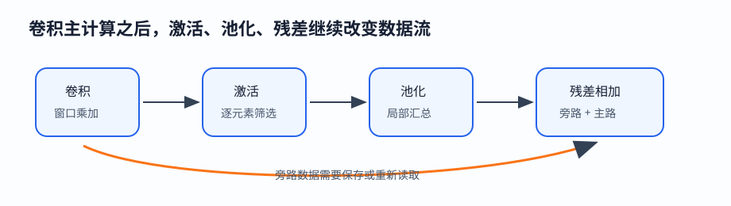
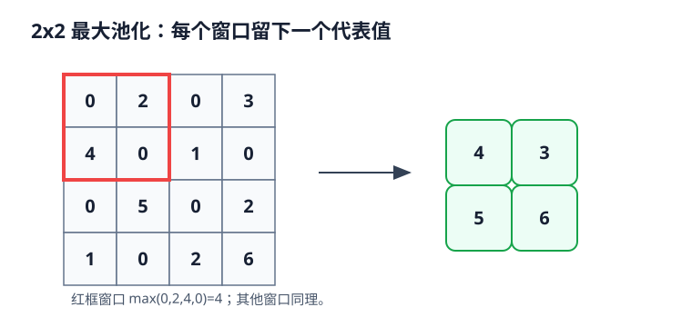
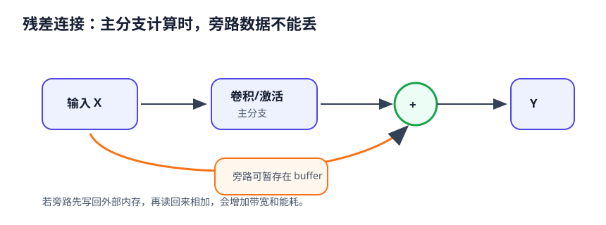
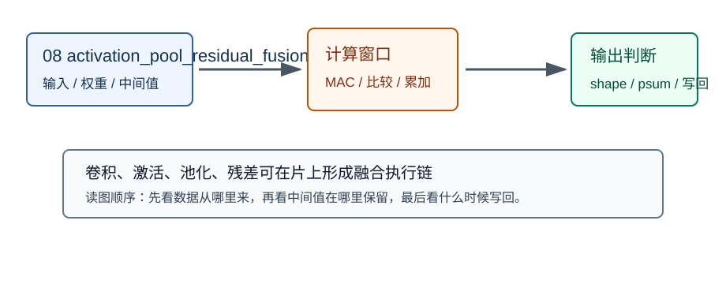

# 08 激活、池化、残差

> 章节等级：B  
> 状态：发布候选
> 来源映射：`chapter_source_map.csv` 中的 08 章；本章主要承接 SRC16，参考 SRC19。



## 本章知识全景图

| 项目 | 本章定位 |
| --- | --- |
| 章节等级 | B |
| 核心问题 | 本章把“激活、池化、残差”落到可手算、可画图、可映射到 NPU 硬件的最小链路。 |
| 学习主线 | 先用具体数字建立直觉，再给正式定义，最后连接到 MAC、buffer、DMA、PE 阵列或编译器调度。 |
| 概念地图 | 输入对象 -> 计算规则 -> 输出结果 -> 硬件/软件代价 -> 常见误判。 |
| 最短路径 | 读例题，复算关键公式，检查图解，再用自测题判断是否能迁移到后续章节。 |

## 1. 学习目标

读完本章，你应该能够：

- 解释激活、池化、残差为什么经常夹在卷积层之间。
- 手算 ReLU、最大池化、平均池化和残差相加的最小例子。
- 分清“卷积主计算”和“卷积后的数据变换”不是一回事。
- 说明这些操作虽然乘加量通常小于卷积，但会改变数据值、shape、buffer 读写和后续数据流。
- 用 NPU 视角判断：哪些动作适合和前后算子融合，哪些动作会额外消耗带宽。

## 2. 先修提醒

本章承接 00-07 的数字、张量、通道、单通道卷积、stride/padding、多通道和多输出通道。你至少需要知道：卷积会把一个局部窗口和卷积核逐项相乘再累加，得到输出特征图里的一个数字。如果你暂时还没读完 05-07，也可以先把本章的输入理解成“上一层已经算好的一张或多张数字表”。

本章不把激活、池化、残差写成深度学习论文综述。零基础阶段只抓一个主线：卷积或矩阵乘产生一批数字以后，网络还会对这些数字做筛选、压缩、旁路相加。NPU 不只要会做卷积，也要知道这些动作是否能在片上完成，是否要读写额外中间结果。

## 3. 生活化引入

想象你在检查一条生产线。前面的机器给每个零件打了一个分数，有些分数是正的，表示“像目标零件”；有些分数是负的，表示“不像”。你可能会做三件事：

1. 把负分直接记为 0，因为你只关心“有没有明显响应”。这像激活函数中的 ReLU。
2. 把相邻几个位置里最大的分数留下，表示这一小片区域里“最明显的响应”。这像最大池化。
3. 把原始分数的一条旁路保留下来，再和后面机器算出的修正量相加，避免后面机器把原有有用信息完全覆盖。这像残差连接。

这三件事都不是重新做一遍卷积。它们更像是对已经算出的数字进行整理：截断、汇总、相加。整理看起来简单，但会影响后续层看到什么数据，也会影响硬件要搬多少数据、存多少中间结果。

## 4. 直觉解释

激活函数回答的问题是：一个线性乘加结果要不要原样传下去？如果一直只做乘加和加偏置，很多层叠起来仍然容易退化成一个大的线性变换，表达能力受限。激活函数给网络加入非线性，让同一个输入在不同数值范围里产生不同响应。最常见的入门例子是 ReLU：

```text
ReLU(x) = max(0, x)
```

它把负数变成 0，把正数保留。这样做的直觉是：某个局部模式没有出现时，不要让负响应继续干扰后面层；出现时，则保留响应强度。

池化回答的问题是：一小片区域里是否可以用一个代表值概括？最大池化取局部窗口最大值，平均池化取局部窗口平均值。池化常会降低空间尺寸，因此它改变的不只是数值，还改变后续计算要处理的元素数量。

残差回答的问题是：后面几层能不能只学习“需要修改多少”，而不是把所有信息重新生成一遍？残差连接把输入旁路和主分支输出逐元素相加：

```text
输出 = 主分支计算结果 + 旁路输入
```

这样做可以让信息和梯度更容易穿过深层网络。对硬件来说，残差还有一个很实际的含义：旁路输入必须被保存到相加发生的时刻，或者能从存储层级里重新读回来。



## 5. 正式定义

- **激活 activation**：对上一层输出的每个元素应用一个函数，得到新的激活值。它通常逐元素执行，不改变元素之间的空间位置。
- **ReLU**：Rectified Linear Unit，定义为 `ReLU(x)=max(0,x)`。负数输出 0，非负数保持原值。
- **Sigmoid / tanh**：也是激活函数，会把数值压到固定范围；本章只做概念了解，不展开公式推导。
- **池化 pooling**：在局部窗口内做汇总，常见有最大池化和平均池化。池化窗口会在输入上移动，产生较小或相同尺寸的输出。
- **最大池化 max pooling**：输出窗口内最大值。
- **平均池化 average pooling**：输出窗口内平均值。
- **残差 residual connection**：把某个较早的张量通过旁路连接到较后的张量，并做逐元素相加。
- **逐元素操作 elementwise operation**：每个输出元素只依赖对应位置的一个或几个输入元素，例如 ReLU 和残差加法。
- **形状匹配**：残差相加要求两个张量 shape 一致，或经过明确的投影、补齐、下采样后再相加。

边界要说清楚：激活和残差加法通常不是卷积的主乘加计算；池化也不使用可训练卷积核。它们可能没有大量权重参数，但仍然会产生真实的读写和调度成本。

## 6. 最小例题

先看 ReLU。输入向量是：

```text
[-3, 0, 2, 5]
```

逐元素应用 `max(0,x)`：

```text
ReLU(-3) = 0
ReLU(0)  = 0
ReLU(2)  = 2
ReLU(5)  = 5
```

输出是：

```text
[0, 0, 2, 5]
```

再看一个 2x2 最大池化窗口：

```text
1  4
3  2
```

最大值是 `4`，所以输出一个数字：

```text
max(1,4,3,2) = 4
```

如果改成平均池化：

```text
(1 + 4 + 3 + 2) / 4 = 10 / 4 = 2.5
```

最后看残差相加。主分支输出：

```text
[2, -1, 4]
```

旁路输入：

```text
[1, 3, 0]
```

逐元素相加：

```text
[2+1, -1+3, 4+0] = [3, 2, 4]
```

这个例子说明：残差不是把两个张量拼接在一起，而是同形状位置逐项相加。

## 7. 完整例题

现在把三类操作串起来。假设某个卷积层已经输出一张 4x4 单通道特征图 `Z`：

```text
Z =
-1   2   0   3
 4  -2   1  -1
 0   5  -3   2
 1  -4   2   6
```

第一步，应用 ReLU，所有负数变成 0：

```text
A =
0  2  0  3
4  0  1  0
0  5  0  2
1  0  2  6
```

第二步，做 2x2 最大池化，窗口不重叠。左上窗口是：

```text
0  2
4  0
```

最大值是 `4`。右上窗口是：

```text
0  3
1  0
```

最大值是 `3`。左下窗口是：

```text
0  5
1  0
```

最大值是 `5`。右下窗口是：

```text
0  2
2  6
```

最大值是 `6`。所以池化输出 `P` 是：

```text
P =
4  3
5  6
```

第三步，假设有一条旁路也产生了同样 shape 的 2x2 张量 `S`：

```text
S =
1  1
0 -2
```

做残差相加：

```text
Y[0][0] = 4 + 1  = 5
Y[0][1] = 3 + 1  = 4
Y[1][0] = 5 + 0  = 5
Y[1][1] = 6 + (-2) = 4
```

最终输出：

```text
Y =
5  4
5  4
```

这个完整例题有三个关键观察：

- ReLU 改变了数值，但没有改变 4x4 shape。
- 2x2 最大池化把 4x4 变成 2x2，减少了后续空间元素数量。
- 残差相加要求两个 2x2 张量在位置上一一对应；旁路数据必须在相加时可用。

再做一个反例。若旁路 `S` 的 shape 是 4x4，而池化输出 `P` 是 2x2，就不能直接相加。必须先让旁路也下采样成 2x2，或让主分支保持 4x4。否则 `P[0][0]` 到底应该和 `S` 的哪一个元素相加并不明确。

## 8. NPU 连接

从 NPU 视角看，激活、池化、残差的计算模式和卷积不同。

激活通常是逐元素操作。ReLU 对每个元素只需要比较一次和选择一次，不需要读取卷积核权重，也没有长串 MAC。它的计算量很小，但如果实现方式是“卷积输出写回外部内存，再读回来做 ReLU，再写回”，带宽成本就会很浪费。因此硬件和编译器常希望把卷积、偏置、ReLU 融合在一起：卷积结果刚在片上得到，就顺手做 ReLU，再写最终结果。

池化需要读取局部窗口，但不做权重乘法。最大池化需要比较，平均池化需要加法和除以窗口元素数。池化会改变输出尺寸，所以它会改变后续层的循环边界和 buffer 容量需求。对于 2x2 stride=2 的最大池化，输出元素数量大约变成原来的四分之一，后续层搬运和计算压力也可能下降。

残差连接看似只是加法，却会带来额外数据通路。主分支计算到相加点时，旁路张量也必须在附近。如果旁路保存在片上 buffer，速度较好但占用容量；如果写回外部内存再读回来，带宽和能耗会增加。深层网络里残差很多，编译器必须安排好旁路张量的生命周期。



这三个操作也说明：NPU 不能只优化“卷积有多少 MAC”。真实网络是算子链。一个算子输出的数据，往往马上被下一个算子使用。若每个小算子都单独读写外部内存，阵列再强也会被数据搬运拖慢。后续讲循环、tile、dataflow、buffer 时，会不断回到这个问题：让数据在片上多停一会儿，少走一次远路。

## 9. 常见误区

### 误区 1：激活函数只是数学装饰

- 错误说法：卷积已经算出结果，激活函数可有可无。
- 为什么错：没有非线性，多层线性变换的表达能力会受限；ReLU 还会改变后续层看到的稀疏程度。
- 正确理解：激活是网络表达能力的一部分，也是硬件执行链中的真实逐元素操作。

### 误区 2：池化就是随便丢数据

- 错误说法：池化只是把图缩小，丢了就丢了。
- 为什么错：最大池化和平均池化都有明确规则，分别保留局部最强响应或局部平均趋势。
- 正确理解：池化是受规则约束的局部汇总，会改变空间尺寸和后续计算量。

### 误区 3：残差就是把两个结果拼起来

- 错误说法：残差连接等于把两个特征图接在一起。
- 为什么错：常见残差块是逐元素相加，不是沿通道拼接；相加要求 shape 对齐。
- 正确理解：残差是主分支和旁路在对应位置相加，必要时先做投影或下采样匹配形状。

### 误区 4：这些算子计算量小，所以硬件不用关心

- 错误说法：ReLU、pooling、add 不像卷积那样做大量乘法，可以忽略。
- 为什么错：它们可能引入额外读写、同步和 buffer 占用；带宽受限时，小算子也会拖慢整体。
- 正确理解：计算量和数据搬运量要一起看，算子融合常常比单看乘法次数更重要。

### 误区 5：ReLU 会让所有信息更准确

- 错误说法：负数都不好，所以 ReLU 一定提升结果。
- 为什么错：负响应是否有用取决于模型设计；ReLU 只是常见选择，不是万能规则。
- 正确理解：ReLU 的作用是引入简单非线性和稀疏响应，具体效果要放在网络训练和任务里看。

### 误区 6：残差只解决训练问题，和推理硬件无关

- 错误说法：残差是训练技巧，部署到 NPU 后没有影响。
- 为什么错：推理时仍然要执行旁路读写和逐元素相加。
- 正确理解：残差同时影响模型可训练性和推理时的数据生命周期。

## 10. 本章自测

### 题目

1. 用一句话解释 ReLU。
2. 对 `[-2, 3, -1, 0]` 做 ReLU，结果是什么？
3. 2x2 窗口 `[[1,5],[2,4]]` 的最大池化输出是多少？
4. 同一个窗口的平均池化输出是多少？
5. 残差相加为什么要求 shape 匹配？
6. 为什么 ReLU 适合和卷积输出融合执行？
7. 池化会如何影响后续层的计算量？
8. 残差连接为什么可能增加带宽压力？

### 答案或评分点

1. ReLU 把负数变为 0，非负数保持原值。
2. `[0, 3, 0, 0]`。
3. `5`。
4. `(1+5+2+4)/4 = 3`。
5. 因为逐元素相加需要每个位置一一对应，否则无法定义哪个元素相加。
6. ReLU 只依赖卷积刚产生的单个输出元素，在片上顺手处理可避免额外读写。
7. 若池化降低空间尺寸，后续层处理的元素数量通常减少。
8. 旁路张量必须保存到相加时刻，可能占用片上 buffer，或写回外部内存后再读入。

## 11. 终稿候选补强：小算子不小，关键在数据生命期

激活、池化、残差的 MAC 数通常低于卷积，但它们会决定中间张量是否需要离开片上。若卷积输出刚产生就做 ReLU，再进入池化或 Add，可以少一次外部写回和读回。若每个算子都拆开执行，带宽成本可能超过它们本身的计算成本。



图中卷积输出先进入片上部分和/输出 buffer，随后做 ReLU、可选池化，再与残差旁路相加。判断能否融合，要看四个条件：shape 是否匹配；算子顺序是否保持模型语义；旁路张量是否在相加时仍可获得；量化 scale 是否允许在同一执行段内处理。任何一个条件不满足，都可能需要拆开执行。

池化的边界也要更精确。max pooling 保留窗口最大响应，average pooling 计算窗口平均；它们都不是随意丢数据。若窗口不能整齐覆盖输入，框架会有明确的 padding、ceil/floor 或忽略规则。NPU 实现必须和模型导出格式一致，否则同一张图在训练框架和部署端会得到不同输出尺寸或不同边界值。

残差连接的硬件判断是“旁路张量活多久”。如果旁路很小，可以保留在片上；如果旁路很大，可能要写到外部内存再读回。深层网络中残差很多，这会把内存规划变成核心问题。残差不是只在训练时有意义；推理时 Add 仍然真实发生，并且影响 buffer 容量、调度顺序和融合机会。

这一节把本章收束为一个判断链：先看算子是否逐元素或局部窗口；再看它是否改变 shape；再看它能否和前后算子融合；最后看中间张量是否必须外存往返。这样读网络结构，才不会把“计算量小”误判成“硬件无成本”。

## 12. 终稿候选复核例题：融合失败的典型信号

若卷积输出接 ReLU，再接 Add，理论上看起来可以融合；但如果 Add 的另一条输入来自很早之前的层，而且 shape、layout 或量化 scale 不一致，就不能简单把三者塞进同一个内核。此时可能需要插入 layout 转换、requantize 或旁路缓存，融合收益会下降。

一个实用检查顺序是：先核对两个分支的 shape 是否逐元素对齐；再核对 layout 是否相同；再核对量化参数是否能在 Add 前统一；最后核对旁路张量在时间上是否仍保留在片上。如果其中任一项失败，残差 Add 就可能从“便宜的小算子”变成一次昂贵的外存读写。

这类内容在论文中通常作为优化说明：不是说 NPU 支持 ReLU、Pool、Add 就结束，而是说明哪些算子可以融合、融合减少了几次中间张量读写、失败时退化到什么路径。

## 13. 发布前可复现实验：小算子融合

本章进入发布候选前，必须能用一个很小的实验把核心机制跑通。推荐实验形态是 `Conv -> ReLU -> Pool/Add`。实验不追求真实模型规模，而是让读者能逐项核对输入、输出、中间值和硬件含义。若小实验都说不清，放到真实 NPU 上只会把错误隐藏在更大的日志里。

实验记录至少写四项。第一，逻辑 shape：每个维度代表什么，谁是 batch，谁是通道，谁是空间或矩阵公共维。第二，数据顺序：内存里相邻元素是谁，DMA 能否连续读取，是否需要 layout 转换。第三，中间状态：部分和、窗口、旁路张量或 tile 在哪里暂存，什么时候清零，什么时候变成最终输出。第四，失败信号：若输出不对，先查 shape 和边界，再查 layout 和地址，最后查量化、饱和或写回顺序。

对本章来说，实验的重点是 shape 对齐、量化 scale、旁路张量生命期。这三个词必须落到具体数字。例如不要只说“复用输入”，而要说明哪一个输入值被几个输出使用；不要只说“部分和变宽”，而要列出单次乘积范围和累加项数；不要只说“layout 更快”，而要指出连续读取的是通道、空间行，还是 blocked 通道组。这样的记录才能让后续章节复用，而不是变成一句抽象经验。

论文或学习笔记中可以把这个实验写成一个短表：

| 检查项 | 应填写内容 | 不合格信号 |
|---|---|---|
| shape | 输入、权重、输出的完整维度 | 只写总元素数 |
| 访问 | 连续读取方向、stride、tile 大小 | 地址跳跃但没有解释 |
| 中间值 | psum/窗口/旁路/tile 的保存位置 | 中间值过早写回外存 |
| 硬件连接 | MAC、PE、buffer、DMA 或 runtime 中的落点 | 只停留在数学公式 |

本章最应避免的错误是：把低 MAC 算子当作零成本。它的工程后果通常不是“文字不严谨”，而是性能或数值直接出问题：PE 空等、外存带宽暴涨、输出 shape 与参考框架不一致、量化误差扩大，或者编译器无法选择合理 tile。发布候选不是把概念讲顺，而是让这些失败能被读者提前识别。

最后给出一个自检口径：合上正文后，读者应能独立画出数据从输入到输出的路径，并指出至少一个复用点、一个边界条件和一个失败信号。若只能背定义，说明本章还停在知识点层；若能用小实验解释硬件后果，才算真正支撑后续 NPU 设计章节。

## 来源

- 本地来源：SRC16《NPU模型量化与算子融合优化从入门到精通》，路径 `C:\Users\11035\Desktop\ic\npu\14、NPU\《NPU模型量化与算子融合优化从入门到精通》\01.html` line 235 到 line 280，描述激活/池化单元，line 388 到 line 410 给出 Conv-BN-ReLU 融合例子。
- 外部来源：ONNX Relu `https://onnx.ai/onnx/operators/onnx__Relu.html` 支撑 ReLU 语义；ONNX MaxPool `https://onnx.ai/onnx/operators/onnx__MaxPool.html` 和 ONNX AveragePool `https://onnx.ai/onnx/operators/onnx__AveragePool.html` 支撑池化窗口、stride、padding 语义；ONNX Add `https://onnx.ai/onnx/operators/onnx__Add.html` 支撑残差加法的广播边界；ResNet 论文 `https://arxiv.org/abs/1512.03385` 支撑残差连接的来源。
- 本章来源落点：ONNX 用于核对激活、池化、Add 的算子语义；ResNet 用于残差连接概念边界；SRC16 用于说明这些算子在 NPU 中通常接在卷积后，并可能通过融合减少中间写回。
