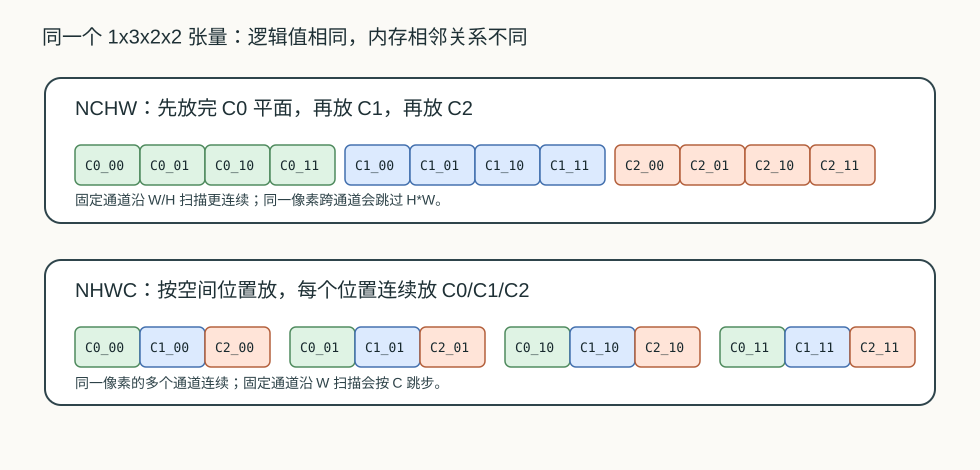
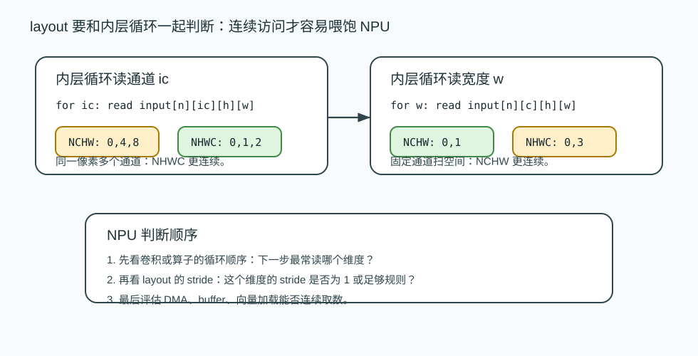
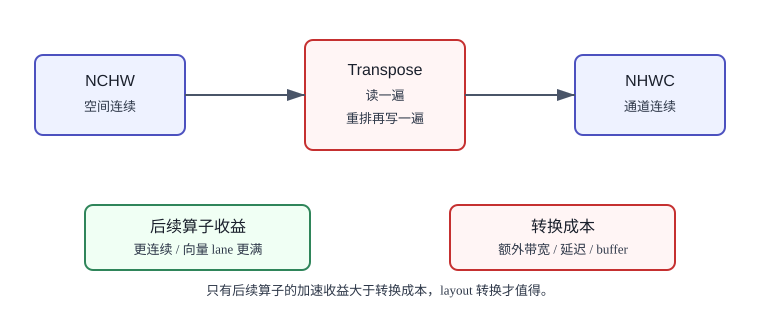

# 12 NCHW/NHWC 数据布局

> 章节等级：B  
> 状态：发布候选
> 来源映射：`chapter_source_map.csv` 中的 12 章；本章主要承接 SRC18、SRC12，参考 SRC05。

## 本章知识全景图

| 问题 | 本章回答 |
| --- | --- |
| layout 改变什么？ | 改变逻辑坐标到线性内存地址的映射，不改变正确转换后的数学值。 |
| NCHW/NHWC 的关键差异是什么？ | NCHW 通常让同一通道的空间相邻，NHWC 通常让同一像素的通道相邻。 |
| 为什么和循环有关？ | 内层循环连续访问哪一维，决定哪种 layout 更容易形成连续搬运和向量读取。 |
| NPU 为什么关心？ | layout 影响 DMA burst、buffer bank、向量 lane、地址发生器复杂度和是否需要额外 transpose。 |

最短学习路径：先手算 NCHW/NHWC offset，再比较 `ic` 连续和 `w` 连续两种访问，最后判断 layout 转换是否值得。

## 为什么学

第 10、11 章把卷积拆成了循环，但循环变量还只是逻辑坐标。NPU 真正读写的是线性内存地址。layout 决定逻辑坐标如何变成地址，也决定循环下一步读到的是相邻元素还是远距离跳转。如果不理解 layout，后续看到 DMA 不连续、buffer bank 冲突、向量通道浪费或编译器插入 transpose 时，就只能把问题归因于“硬件慢”，而看不出根因是访问模式和数据排列不匹配。



## 1. 学习目标

读完本章，你应该能够：

- 解释 NCHW 和 NHWC 不是改变张量数值，而是改变同一批逻辑元素在内存中的排列顺序。
- 写出 NCHW 与 NHWC 下 4 维张量元素的线性地址公式。
- 手算一个元素在两种 layout 下的 offset。
- 比较“沿通道访问”和“沿宽度访问”在两种 layout 下是否连续。
- 说明 layout 为什么会影响 NPU 的 DMA、buffer、向量加载和循环执行效率。

第 10、11 章已经把卷积拆成了循环。循环每走一步都要读输入、读权重、更新部分和。第 12 章要补上一个关键问题：循环里的逻辑坐标，例如 `input[n][ic][h][w]`，到底落在内存中的第几个元素？NCHW/NHWC 就是在回答这个问题。

## 2. 先修提醒

本章需要你已经理解：

- 张量的 shape、axis 和 channel。
- 卷积循环中的 `n/oc/oh/ow/ic/r/s`。
- 同一个输出位置会在内层循环中读取多个输入通道。
- NPU 访存更喜欢连续、规则、可批量搬运的数据。

本章不要求你提前掌握所有框架的 layout 规则。先把最常见的 NCHW 和 NHWC 算清楚，再理解为什么真实 NPU 有时还会使用 blocked layout 或内部私有 layout。

## 3. 生活化引入

想象你有一套照片档案。每张照片都有高度、宽度和颜色通道。你可以按两种方式装盒：

- 先把红色通道整张照片装完，再装绿色通道，再装蓝色通道。
- 每个像素位置放一个小包，小包里连续放红、绿、蓝三个值。

两种装法没有改变照片本身。左上角像素的红色值仍然是那个红色值。但当你要拿“同一个像素的 RGB 三个值”时，第二种装法更顺手；当你要沿着整张红色平面从左到右扫时，第一种装法更顺手。

这就是 layout 的本质：同样的逻辑坐标，内存相邻关系不同。NPU 不是只关心值对不对，还关心下一次要读的值是不是就在旁边。

## 4. 直觉解释

先看一个很小的张量：`N=1, C=3, H=2, W=2`。逻辑上它有 1 张图、3 个通道、2 行、2 列。为了容易读，把每个元素写成 `C通道_位置`：

```text
通道 C0:
C0_00  C0_01
C0_10  C0_11

通道 C1:
C1_00  C1_01
C1_10  C1_11

通道 C2:
C2_00  C2_01
C2_10  C2_11
```

NCHW 的顺序是先 N，再 C，再 H，再 W。固定 `n` 后，会先把 C0 整个平面放完，再放 C1，再放 C2：

```text
NCHW memory:
C0_00, C0_01, C0_10, C0_11,
C1_00, C1_01, C1_10, C1_11,
C2_00, C2_01, C2_10, C2_11
```

NHWC 的顺序是先 N，再 H，再 W，再 C。固定 `n` 后，会按空间位置走，每个位置连续放 C0、C1、C2：

```text
NHWC memory:
C0_00, C1_00, C2_00,
C0_01, C1_01, C2_01,
C0_10, C1_10, C2_10,
C0_11, C1_11, C2_11
```

这两串内存里的元素总数一样，逻辑值也一样，但“谁和谁相邻”完全不同。

把它连接回卷积循环。若当前内层循环是：

```text
for ic in 0..C-1:
  read input[n][ic][h][w]
```

也就是同一个像素位置连续读多个通道，那么 NHWC 下这些通道通常是连续的。若当前循环是：

```text
for w in 0..W-1:
  read input[n][ic][h][w]
```

也就是固定某个通道沿宽度方向扫一行，那么 NCHW 下这些元素通常是连续的。layout 不存在脱离访问模式的绝对优劣，它要和循环顺序一起看。



## 5. 正式定义

### NCHW

NCHW 表示逻辑维度顺序为：

```text
[N, C, H, W]
```

其中：

- `N` 是 batch 样本数。
- `C` 是通道数。
- `H` 是高度。
- `W` 是宽度。

若张量在内存中连续存放，元素 `x[n][c][h][w]` 的线性 offset 是：

```text
offset_nchw = ((n * C + c) * H + h) * W + w
```

对应 stride 为：

```text
stride_N = C * H * W
stride_C = H * W
stride_H = W
stride_W = 1
```

这说明在 NCHW 中，沿 `W` 方向走一格，offset 加 1；沿 `C` 方向走一格，offset 要跳过一个完整的 `H*W` 平面。

### NHWC

NHWC 表示逻辑维度顺序为：

```text
[N, H, W, C]
```

同一个逻辑元素如果写成 `x[n][h][w][c]`，线性 offset 是：

```text
offset_nhwc = ((n * H + h) * W + w) * C + c
```

对应 stride 为：

```text
stride_N = H * W * C
stride_H = W * C
stride_W = C
stride_C = 1
```

这说明在 NHWC 中，沿 `C` 方向走一格，offset 加 1；沿 `W` 方向走一格，offset 要跳过 `C` 个元素。

以 `N=1, C=3, H=2, W=2` 为例：

| layout | stride_N | stride_C | stride_H | stride_W |
| --- | ---: | ---: | ---: | ---: |
| NCHW | 12 | 4 | 2 | 1 |

NHWC 的维度顺序不同，所以按 `N,H,W,C` 写 stride：

| layout | stride_N | stride_H | stride_W | stride_C |
| --- | ---: | ---: | ---: | ---: |
| NHWC | 12 | 6 | 3 | 1 |

stride 不是卷积里的步幅 stride。这里的 stride 是存储步长，表示某个维度索引加 1 时，线性地址增加多少个元素。两者名字相同，语境不同，后续读代码时一定要分清。

## 6. 最小例题

仍然使用 `N=1, C=3, H=2, W=2`。求逻辑元素：

```text
n=0, c=2, h=1, w=0
```

在 NCHW 下：

```text
offset_nchw = ((n*C + c)*H + h)*W + w
            = ((0*3 + 2)*2 + 1)*2 + 0
            = (4 + 1)*2
            = 10
```

在 NHWC 下，同一个逻辑元素写作 `x[n][h][w][c]`：

```text
offset_nhwc = ((n*H + h)*W + w)*C + c
            = ((0*2 + 1)*2 + 0)*3 + 2
            = 2*3 + 2
            = 8
```

同一个逻辑元素，在两种 layout 下 offset 不同。这不是数值变了，而是摆放顺序变了。

再看访问连续性。访问同一个像素 `(h=0,w=0)` 的三个通道：

```text
c = 0, 1, 2
```

NCHW 下 offset 是：

```text
c=0: ((0*3+0)*2+0)*2+0 = 0
c=1: ((0*3+1)*2+0)*2+0 = 4
c=2: ((0*3+2)*2+0)*2+0 = 8
```

它们相隔 4，不连续。

NHWC 下 offset 是：

```text
c=0: ((0*2+0)*2+0)*3+0 = 0
c=1: ((0*2+0)*2+0)*3+1 = 1
c=2: ((0*2+0)*2+0)*3+2 = 2
```

它们连续。这就是为什么“同一个空间位置读多个通道”的访问模式常常更适合 NHWC 或类似通道紧邻的 layout。

## 7. 完整例题

做一个 1x1 卷积的完整访问例子。逻辑张量仍是 `N=1, C=3, H=2, W=2`，各位置数值为：

```text
位置 (h=0,w=0): C0=1, C1=10, C2=100
位置 (h=0,w=1): C0=2, C1=20, C2=200
位置 (h=1,w=0): C0=3, C1=30, C2=300
位置 (h=1,w=1): C0=4, C1=40, C2=400
```

1x1 卷积权重为：

```text
weight[C0] = 1
weight[C1] = 2
weight[C2] = 3
```

输出位置 `(h=0,w=0)` 的计算是：

```text
1*1 + 10*2 + 100*3
= 1 + 20 + 300
= 321
```

输出位置 `(h=0,w=1)` 的计算是：

```text
2*1 + 20*2 + 200*3
= 2 + 40 + 600
= 642
```

现在看内存访问。

### NCHW 内存顺序

```text
offset:  0   1   2   3    4    5    6    7     8     9    10    11
value:   1   2   3   4   10   20   30   40   100   200   300   400
meaning: C0_00 C0_01 C0_10 C0_11 C1_00 C1_01 C1_10 C1_11 C2_00 C2_01 C2_10 C2_11
```

如果循环顺序是：

```text
for h:
  for w:
    for ic:
      read input[ic][h][w]
```

那么对 `(h=0,w=0)`，读三个通道的 offset 是：

```text
C0_00 -> 0
C1_00 -> 4
C2_00 -> 8
```

这是跳跃访问。对 `(h=0,w=1)`，offset 是：

```text
C0_01 -> 1
C1_01 -> 5
C2_01 -> 9
```

仍然跳跃。

但如果循环固定通道、沿宽度扫：

```text
for ic:
  for h:
    for w:
      read input[ic][h][w]
```

那么 C0 的 `(h=0,w=0)` 到 `(h=0,w=1)` 是 offset `0 -> 1`，连续；C1 是 `4 -> 5`，连续；C2 是 `8 -> 9`，也连续。NCHW 对“同一通道内沿空间扫”更友好。

### NHWC 内存顺序

```text
offset:  0   1    2    3   4    5    6   7    8    9   10   11
value:   1   10   100  2   20   200  3   30   300  4   40   400
meaning: C0_00 C1_00 C2_00 C0_01 C1_01 C2_01 C0_10 C1_10 C2_10 C0_11 C1_11 C2_11
```

对 `(h=0,w=0)`，读三个通道的 offset 是：

```text
C0_00 -> 0
C1_00 -> 1
C2_00 -> 2
```

连续。对 `(h=0,w=1)`：

```text
C0_01 -> 3
C1_01 -> 4
C2_01 -> 5
```

也连续。

但固定 C0 沿宽度扫，offset 是：

```text
C0_00 -> 0
C0_01 -> 3
```

中间隔了 C1 和 C2。NHWC 对“同一位置连续读多个通道”更友好，对“单通道平面连续扫”则不如 NCHW 直接。

这个例子给出一个非常实用的判断方法：不要单独问 NCHW 好还是 NHWC 好，要先问内层循环最常连续读哪个维度。如果内层常读 `ic`，通道连续更有利；如果内层常读 `w`，空间连续更有利。

## 8. NPU 连接

layout 影响 NPU 的原因不是名称本身，而是它改变了连续访存和数据搬运方式。

DMA 擅长搬连续块。如果循环下一步要读的元素就在当前元素旁边，DMA 和片上 buffer 更容易高效工作；如果下一步要跨很大 stride 跳到另一个位置，就可能需要多次小搬运或更复杂的地址生成。向量加载也类似：如果硬件一次想取 8 个或 16 个相邻通道值，NHWC 或通道打包 layout 可能更合适；如果硬件一次想扫同一通道的一段空间，NCHW 可能更直观。

layout 还影响 buffer 里数据怎样组织。假设卷积内层循环按 `ic` 读取同一像素位置的多个通道，NHWC 能把这些值放在连续地址上，buffer 读口和向量通道更容易一次取齐。假设执行计划按通道平面分块，先固定 `ic` 再扫一片空间，NCHW 能让同一通道的一行或一块更连续。

编译器的工作之一，就是让模型图里的 layout、算子循环顺序和硬件偏好尽量匹配。如果模型输入是 NCHW，而 NPU 内部更偏好 NHWC，编译器可能插入 layout 转换；如果转换成本太高，也可能选择另一种循环顺序或内部临时 layout。转换不是免费的：它会读一遍数据、重排、再写一遍数据，消耗带宽和时间。

更进一步，真实 NPU 不一定只使用纯 NCHW 或纯 NHWC。为了匹配向量宽度或 SRAM bank，常见做法是把通道按 8、16 或 32 个一组打包，形成类似 `NCHWc` 或 blocked layout 的内部格式。零基础阶段不需要掌握所有名字，但要理解基本原则：layout 的目标是让循环访问到的数据尽量连续、可批量搬运、可被 MAC 阵列及时消费。



## 工程判断

当算子内层循环连续读同一像素的多个通道，或者硬件向量 lane 正好对应通道维，NHWC 或通道打包 layout 往往更自然；当执行计划固定通道平面、沿宽度或空间 tile 连续扫描，NCHW 更容易得到连续地址。不要脱离访问模式判断 layout。失败信号包括 DMA 被拆成大量小传输、向量加载只填满一部分 lane、layout 转换节点占用明显时间、或同一模型在不同输入 shape 下性能波动很大。排查时先写出 offset 公式，再标出内层循环变化的维度，最后估算转换成本是否会被后续算子加速抵消。

## 9. 常见误区

### 误区 1：NCHW 和 NHWC 只是缩写不同

- 错误说法：两者只是把字母换个顺序，实际没有区别。
- 为什么错：字母顺序决定线性内存中哪一维相邻，进而影响连续读取和地址步长。
- 正确理解：layout 是逻辑坐标到线性地址的映射规则。

### 误区 2：layout 会改变张量的数学值

- 错误说法：从 NCHW 转成 NHWC 后，卷积算出来的数学结果一定不同。
- 为什么错：正确转换只改变存储顺序，不改变每个逻辑坐标的值。
- 正确理解：layout 转换必须保持逻辑元素对应关系；若结果变了，通常是索引解释错了。

### 误区 3：NHWC 一定比 NCHW 快

- 错误说法：通道连续就是更先进，所以 NHWC 总是更快。
- 为什么错：性能取决于循环顺序、硬件向量宽度、buffer 组织和算子类型。
- 正确理解：layout 要和访问模式匹配；同一硬件上不同算子也可能偏好不同 layout。

### 误区 4：reshape 等同于 layout 转换

- 错误说法：元素数量一样，reshape 一下就完成 NCHW 到 NHWC。
- 为什么错：reshape 只是改变形状解释，未必移动数据；NCHW 到 NHWC 通常需要转置或重排。
- 正确理解：layout 转换要保持逻辑坐标对应，不能只看元素总数。

### 误区 5：layout 转换是免费的

- 错误说法：编译器想转就转，不影响性能。
- 为什么错：转换需要读、重排、写，可能消耗大量带宽并打断流水。
- 正确理解：编译器会权衡转换成本和后续算子加速收益。

## 10. 本章自测

### 题目

1. NCHW 中四个字母分别表示什么？
2. NHWC 中哪一维在内存中最连续？
3. 写出 NCHW 下 `x[n][c][h][w]` 的 offset 公式。
4. 写出 NHWC 下 `x[n][h][w][c]` 的 offset 公式。
5. 对 `N=1,C=3,H=2,W=2`，NCHW 下 `c=1,h=0,w=1` 的 offset 是多少？
6. 同一元素在 NHWC 下的 offset 是多少？
7. 为什么 NHWC 适合连续读取同一像素的多个通道？
8. 为什么 NCHW 适合固定通道沿宽度方向扫描？
9. reshape 为什么不能随便当成 layout 转换？
10. layout 为什么会影响 NPU 的 DMA 和 buffer？

### 答案或评分点

1. `N` 是 batch，`C` 是通道，`H` 是高度，`W` 是宽度。
2. `C` 维，因为 NHWC 的 `stride_C=1`。
3. `offset_nchw = ((n*C + c)*H + h)*W + w`。
4. `offset_nhwc = ((n*H + h)*W + w)*C + c`。
5. `((0*3+1)*2+0)*2+1 = 5`。
6. `((0*2+0)*2+1)*3+1 = 4`。
7. 同一 `(n,h,w)` 下，`c` 增加 1 时 offset 也增加 1。
8. 固定 `n,c,h` 后，`w` 增加 1 时 offset 增加 1。
9. reshape 只改变形状解释，不保证按通道/空间重新排列数据。
10. DMA 和 buffer 更擅长连续、规则的地址；layout 决定循环访问是否连续或跳跃。

## 来源

- 外部来源：ONNX Transpose 官方算子文档 `https://onnx.ai/onnx/operators/onnx__Transpose.html`，用于核对 layout 转换通常是维度置换而不是单纯 reshape。
- 外部来源：ONNX Reshape 官方算子文档 `https://onnx.ai/onnx/operators/onnx__Reshape.html`，用于区分 reshape 的形状解释和 layout 转换的数据重排边界。
- 外部来源：MLIR Linalg dialect 文档 `https://mlir.llvm.org/docs/Dialects/Linalg/`，用于核对 NCHW/NHWC 等 layout 会出现在具名卷积 op 中。
- 外部来源：Apache TVM TensorIR 文档 `https://tvm.apache.org/docs/deep_dive/tensor_ir/index.html`，用于支撑 layout、循环迭代、局部性和调度变换之间的关系。
- 本地来源：`C:\Users\11035\Desktop\ic\npu\14、NPU\《NPU神经网络编译器TVM NPU后端从入门到精通》\03.html`，第 328-417 行说明 NPU 内存层次、data layout transformation、ONNX/Relay lowering 到 NPU 指令的语境。
- 本地来源：`C:\Users\11035\Desktop\ic\npu\14、NPU\《NPU神经网络编译器TVM NPU后端从入门到精通》\02.html`，第 346-416 行说明 TVM 调度原语改变循环结构和内存布局。
- 本地来源：`C:\Users\11035\Desktop\ic\npu\14、NPU\《NPU内存带宽与DMA优化从入门到精通》\01.html`，第 314-338 行把数据布局转换、内存对齐、DMA 链式命令列为优化路线，用于解释 layout 转换成本。
