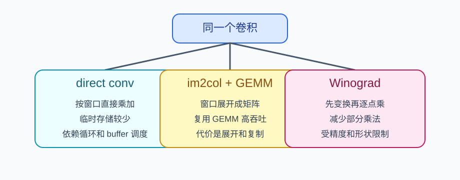
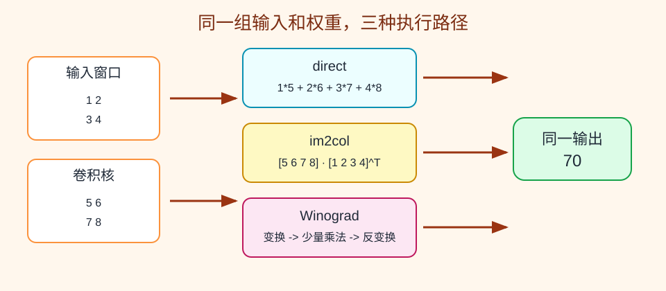
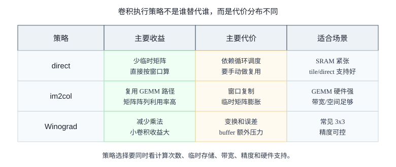

# 13 im2col、direct conv 与 Winograd

> 章节等级：A  
> 状态：发布候选
> 来源映射：`chapter_source_map.csv` 中的 13 章；本章主要承接 SRC18、SRC16，参考 SRC12。

## 本章知识全景图

| 问题 | 本章回答 |
| --- | --- |
| 三种策略算的是不是同一个卷积？ | 是。direct、im2col、Winograd 改变执行路径，不改变卷积的数学目标。 |
| im2col 的核心代价是什么？ | 把重叠窗口展开成矩阵会复制输入，换来 GEMM 路径和矩阵阵列利用率。 |
| Winograd 的核心代价是什么？ | 减少部分乘法，但增加变换、加法、buffer 和数值误差风险。 |
| 编译器怎么选？ | 看 kernel、stride、shape、layout、SRAM、矩阵阵列能力、量化精度和转换成本。 |

最短学习路径：先手算同一个卷积的 direct 与 im2col，再看 im2col 的临时矩阵膨胀，最后用策略取舍表判断 Winograd 适不适合。

## 为什么学

卷积进入 NPU 后，很少只有一种执行形态。同一个 `Conv` 节点可能被直接循环实现、被展开成 GEMM、被做 Winograd 变换，或者被编译器选择成硬件专用指令。如果只知道卷积公式，就无法解释为什么同一层在不同 NPU 上性能差异巨大。学本章是为了建立“算子语义不变，执行策略可变”的工程视角。



## 1. 学习目标

读完本章，你应该能够：
- 说清 direct convolution、im2col 和 Winograd 都在算同一个卷积，只是执行路径不同。
- 解释为什么工程里不会只保留一种卷积实现策略。
- 手算一个 3x3 输入、2x2 卷积核的 direct 结果，并把同一问题改写成 im2col 矩阵乘。
- 用零基础语言说明 Winograd 为什么能减少乘法，以及它为什么不是所有场景都更好。
- 把三种策略连接到 NPU 的 MAC 阵列、片上 buffer、DMA、tile 和编译器选择。

## 2. 先修提醒

本章需要你已经理解：卷积是窗口和卷积核逐项相乘再累加；一个输出值来自一串 MAC；同一个输入元素和同一个权重可能被多个输出重复使用。你不需要先懂高等代数，也不需要背 Winograd 公式。本章只抓一个问题：同一个卷积，为什么会被工程师改写成不同执行形态。

先给结论：direct convolution 最像手算卷积；im2col 是把窗口摊开成矩阵，借用 GEMM 的成熟高性能路径；Winograd 是利用代数变换减少小卷积中的乘法次数。三者不是谁淘汰谁，而是在“计算次数、额外存储、数据搬运、数值稳定性、硬件支持”之间取舍。

## 3. 生活化引入

假设你要给很多包裹贴标签。第一种做法是拿起一个包裹，查清信息，贴好，再拿下一个。这像 direct convolution：按原始窗口顺序直接做。

第二种做法是先把所有包裹的信息抄到一张大表里，再交给一台特别擅长批量处理表格的机器。这像 im2col：先把卷积窗口整理成矩阵，再交给矩阵乘法引擎。

第三种做法是发现某些标签规则有重复结构，可以先做几次加减合并，再少做几次昂贵操作。这像 Winograd：通过变换把一部分乘法换成加法和变换。

三个方法都能得到同一批标签，但临时表大小、准备时间、机器利用率和出错风险不同。卷积实现策略的核心也是这个取舍。

## 4. 直觉解释

direct convolution 的优点是自然。窗口在哪里，就读哪里的输入；卷积核是什么，就逐项乘加。它不一定需要把所有窗口复制到一块大矩阵里，因此临时存储压力可以小。缺点是如果硬件最擅长的是大矩阵乘法，direct 可能不容易直接吃满矩阵乘阵列；如果循环和访存调度做得不好，也会反复读取相同输入。

im2col 的想法是“让卷积长得像矩阵乘”。每一个滑动窗口被拉平成一列或一行，多个窗口组成一个大矩阵；卷积核也拉平成向量或矩阵。这样卷积就能用 GEMM 计算。优点是 GEMM 优化成熟，容易复用矩阵乘硬件和软件库。缺点是窗口重叠会导致输入被复制多次，临时矩阵可能比原输入大很多。

Winograd 的想法更像“换一个计算坐标”。对于常见的小卷积，例如 3x3 kernel 生成一小块输出，它可以通过输入变换、权重变换、逐点乘、输出反变换，减少乘法次数。乘法在硬件里通常比加法更贵，减少乘法有吸引力。但 Winograd 需要额外加法、变换 buffer，并且对数值精度、kernel 大小、stride、padding 都有适用边界。

可以把三者看成三条路：

| 策略 | 最关心的问题 | 常见代价 |
| --- | --- | --- |
| direct | 不展开大临时矩阵，直接按窗口算 | 需要精心循环和 buffer 才能高效复用 |
| im2col | 借用 GEMM 高吞吐 | 临时矩阵膨胀，输入重复存放 |
| Winograd | 减少小卷积乘法次数 | 变换开销、数值误差、适用范围限制 |



## 5. 正式定义

本章只讨论常见二维卷积的执行策略，不改变卷积数学含义。

- **direct convolution**：直接按输出位置、输入通道、卷积核行列等循环读取输入窗口与权重，执行 MAC 得到输出。它是最接近卷积定义的实现。
- **im2col**：image to column，把每个卷积窗口展开成矩阵的一列或一行，再把卷积核展开成矩阵，使卷积转化为 GEMM。
- **GEMM**：通用矩阵乘法。这里可以先理解为 `C = A * B`，其中 A 放展开后的权重，B 放展开后的输入窗口，C 放输出。
- **Winograd convolution**：利用 Winograd minimal filtering 思想，把小卷积转成“输入变换、权重变换、逐点乘、输出变换”的流程，以减少乘法次数。
- **临时展开矩阵**：im2col 产生的中间数据。它不是新的模型数据，只是为了让卷积能被矩阵乘法处理而重排出来。
- **策略选择**：编译器或算子库根据 shape、kernel 大小、stride、layout、buffer 容量、硬件矩阵乘能力和精度要求选择执行路径。

重要边界：这些策略的输出应该相同或在允许误差内相同。它们改变的是“怎么执行”，不是“卷积要算什么”。



## 6. 最小例题

先看 direct。输入窗口：

```text
1 2
3 4
```

卷积核：

```text
5 6
7 8
```

direct convolution 直接逐项乘加：

```text
1*5 = 5
2*6 = 12
3*7 = 21
4*8 = 32
```

累加：

```text
5 + 12 + 21 + 32 = 70
```

现在把它写成 im2col 的最小形式。窗口拉平成一列：

```text
col = [1, 2, 3, 4]^T
```

卷积核拉平成一行：

```text
w = [5, 6, 7, 8]
```

矩阵乘就是：

```text
w * col = 5*1 + 6*2 + 7*3 + 8*4 = 70
```

同一个输出值没有变，只是从“二维窗口乘加”改写成“行向量乘列向量”。

## 7. 完整例题

输入是 3 行 3 列：

```text
1 2 3
4 5 6
7 8 9
```

卷积核是 2 行 2 列：

```text
1 0
0 1
```

stride=1、无 padding，输出大小是：

```text
OH = 3 - 2 + 1 = 2
OW = 3 - 2 + 1 = 2
```

direct convolution 逐窗口计算：

```text
out[0][0] = 1*1 + 2*0 + 4*0 + 5*1 = 6
out[0][1] = 2*1 + 3*0 + 5*0 + 6*1 = 8
out[1][0] = 4*1 + 5*0 + 7*0 + 8*1 = 12
out[1][1] = 5*1 + 6*0 + 8*0 + 9*1 = 14
```

输出是：

```text
6  8
12 14
```

现在做 im2col。每个 2x2 窗口按“左上、右上、左下、右下”展开成一列：

```text
窗口 (0,0): [1,2,4,5]^T
窗口 (0,1): [2,3,5,6]^T
窗口 (1,0): [4,5,7,8]^T
窗口 (1,1): [5,6,8,9]^T
```

组成 im2col 矩阵：

```text
X_col =
1 2 4 5
2 3 5 6
4 5 7 8
5 6 8 9
```

卷积核展开成一行：

```text
W_row = [1, 0, 0, 1]
```

矩阵乘：

```text
Y_row = W_row * X_col
```

逐列算：

```text
第 1 列：1*1 + 0*2 + 0*4 + 1*5 = 6
第 2 列：1*2 + 0*3 + 0*5 + 1*6 = 8
第 3 列：1*4 + 0*5 + 0*7 + 1*8 = 12
第 4 列：1*5 + 0*6 + 0*8 + 1*9 = 14
```

再 reshape 回 2x2：

```text
6  8
12 14
```

这个例子也暴露了 im2col 的代价。原输入只有 9 个数字，但 `X_col` 有 16 个数字。中间元素 5 在四个窗口里出现了 4 次。im2col 借来了 GEMM 的效率，却用额外存储和复制换取这种效率。

Winograd 的完整工程公式比本章范围更复杂，但可以用一个一维类比看清“少乘法”的思想。要算两个相邻输出：

```text
y0 = d0*g0 + d1*g1 + d2*g2
y1 = d1*g0 + d2*g1 + d3*g2
```

朴素做法需要 6 次乘法。Winograd 类方法会先把输入和权重做加减变换，再做较少次数的逐点乘，最后变换回输出。它省下的通常是乘法，增加的是加法和中间变换。二维 3x3 常见优化就是这个思想的扩展。

## 8. NPU 连接

NPU 不是只执行数学公式，它要持续喂饱 MAC 阵列。策略选择会直接影响阵列旁边的数据形态。

direct convolution 更适合流式读取窗口：DMA 搬一块输入 tile，片上 buffer 保存几行或几列，计算单元按循环顺序取窗口和权重。它的关键是循环顺序、layout 和 buffer 设计能不能把输入、权重和部分和复用起来。

im2col 让卷积进入 GEMM 通道。若 NPU 有强矩阵乘阵列，im2col 或类似 implicit im2col 的方法可以让数据以矩阵块进入阵列，调度更接近矩阵乘。但真正硬件不一定会把完整 `X_col` 写到外部内存；很多实现会在片上边生成边消费，避免临时矩阵爆炸。

Winograd 适合某些小 kernel、高复用、对精度可控的卷积。它减少乘法，有机会降低计算量；但变换也需要 buffer 和加法单元。如果输入 tile 太小、边界太多、精度要求很严，Winograd 的收益可能被抵消。

编译器或算子库做选择时，通常会问：

- kernel 是 1x1、3x3，还是更大？
- stride、padding、dilation 是否让窗口规则性变差？
- 输入和输出通道是否足够大，能否吃满 GEMM 阵列？
- 片上 SRAM 是否能容纳 im2col tile 或 Winograd 变换 tile？
- 当前量化精度下，Winograd 的数值误差是否可接受？

这就是本章和后面 tile、数据复用、dataflow 的连接：策略不是孤立算法名，而是决定数据以什么形态进入 buffer、阵列和 DMA。

## 工程判断

当 kernel 小、stride 为 1、输出空间大且矩阵乘阵列很强时，im2col 或 implicit im2col 可能把硬件喂得更满；但如果展开矩阵放不进 SRAM，或外部带宽被临时矩阵拖垮，direct/tiled direct 反而更稳。当是常见 3x3 小卷积、精度容忍度足够、硬件或库支持成熟时，Winograd 可能减少乘法；但遇到量化误差敏感、边界 tile 很多、stride/dilation 不匹配、或变换 buffer 紧张时，应谨慎使用。失败信号包括 im2col 临时内存远大于输入、Winograd 输出误差超阈值、direct 路径 PE 利用率低、或编译器策略切换导致性能突降。排查顺序是先确认 Conv 语义和 shape，再估算展开/变换成本，最后对比 MAC 利用率与带宽占用。

## 9. 常见误区

### 误区 1：im2col 改变了卷积结果

- 错误说法：im2col 是另一种算子，所以输出和卷积不同。
- 为什么错：im2col 只是把每个窗口重新排列成矩阵列，乘加项没有改变。
- 正确理解：im2col 改变执行形态，不改变卷积数学含义。

### 误区 2：direct convolution 一定慢

- 错误说法：direct 没有转成 GEMM，所以一定不高效。
- 为什么错：direct 如果配合好的 tile、layout 和片上复用，可以避免大临时矩阵，很多硬件上非常有效。
- 正确理解：direct 的性能取决于循环调度和存储层级，不是名字决定快慢。

### 误区 3：Winograd 永远更好

- 错误说法：Winograd 减少乘法，所以所有卷积都应该用它。
- 为什么错：它增加变换和加法，受 kernel、stride、tile、精度和边界影响。
- 正确理解：Winograd 是特定场景下的优化，不是通用替代品。

### 误区 4：im2col 临时矩阵可以忽略

- 错误说法：只要 GEMM 快，展开矩阵占多少内存不重要。
- 为什么错：临时矩阵会复制重叠输入，可能消耗 SRAM 或外部带宽。
- 正确理解：im2col 的收益必须和展开开销一起算。

### 误区 5：策略选择只由软件决定

- 错误说法：编译器想选什么就选什么，和 NPU 硬件无关。
- 为什么错：硬件矩阵阵列、buffer 容量、DMA 模式和支持的精度会限制可选策略。
- 正确理解：策略选择是编译器和硬件能力共同决定的。

## 10. 本章自测

### 题目

1. direct convolution 的核心做法是什么？
2. im2col 为什么能把卷积变成 GEMM？
3. 对窗口 `[[1,2],[3,4]]` 和核 `[[1,1],[0,1]]`，direct 输出是多少？
4. 上题的窗口拉平成 `[1,2,3,4]^T`，核应该拉平成什么？
5. 为什么 im2col 可能增加临时存储？
6. Winograd 主要试图减少哪类操作？
7. 为什么 Winograd 可能不适合所有卷积？
8. direct 和 im2col 哪个一定更快？
9. implicit im2col 的直觉是什么？
10. NPU 编译器选择卷积策略时至少要看哪三个条件？

### 答案或评分点

1. 按输出位置直接读取窗口和权重，逐项乘加得到输出。
2. 每个窗口展开成矩阵列，卷积核展开成矩阵行，输出就是矩阵乘的结果。
3. `1*1 + 2*1 + 3*0 + 4*1 = 7`。
4. `[1,1,0,1]`。
5. 重叠窗口会让同一输入元素在展开矩阵中出现多次。
6. 乘法次数。
7. 额外变换、加法、buffer 和数值误差会抵消收益，且适用 kernel/stride 有限制。
8. 都不一定；要看 shape、硬件和调度。
9. 不把完整展开矩阵落到外部内存，而是在片上按需生成并直接喂给矩阵乘。
10. kernel 大小、stride/padding、通道数、layout、SRAM 容量、矩阵阵列能力、精度要求等。

## 来源

- 外部来源：ONNX Conv 官方算子文档 `https://onnx.ai/onnx/operators/onnx__Conv.html`，用于核对本章三种策略都不能改变 Conv 的输入、权重和属性语义。
- 外部来源：Apache TVM TensorIR 文档 `https://tvm.apache.org/docs/deep_dive/tensor_ir/index.html`，用于支撑卷积可通过 TIR 循环与调度变换表达。
- 外部来源：Lavin 与 Gray 的 Winograd 卷积论文 `https://arxiv.org/abs/1509.09308`，用于核对 Winograd 通过最小滤波减少小卷积乘法的适用边界。
- 外部来源：CS231n 卷积网络讲义 `https://cs231n.github.io/convolutional-networks/`，用于核对卷积窗口、局部连接和输出空间直觉。
- 本地来源：`C:\Users\11035\Desktop\ic\npu\14、NPU\《NPU神经网络编译器TVM NPU后端从入门到精通》\02.html`，第 346-416 行说明 TVM 调度原语和 tile 示例，第 453-493 行给出 Conv2D 自动调度示例。
- 本地来源：`C:\Users\11035\Desktop\ic\npu\14、NPU\《NPU神经网络编译器TVM NPU后端从入门到精通》\03.html`，第 385-431 行说明 CONV 粗粒度指令、内存分配、调度原语和代码生成。
- 本地来源：`C:\Users\11035\Desktop\ic\npu\14、NPU\《NPU内存带宽与DMA优化从入门到精通》\02.html`，第 287-417 行说明片上存储、DMA 与双缓冲，用于解释 im2col/implicit im2col 的临时数据和搬运成本。
