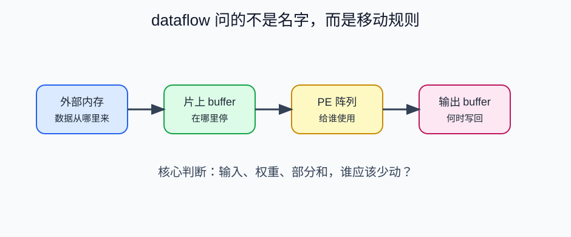
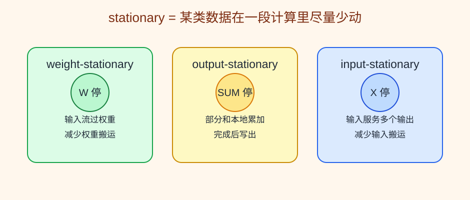
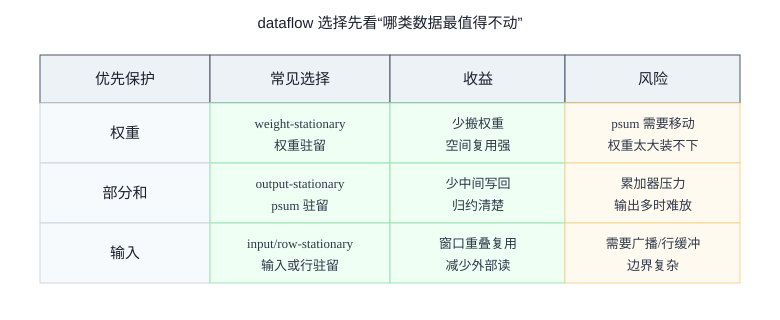

# 16 dataflow 入门

> 章节等级：A  
> 状态：发布候选
> 来源映射：`chapter_source_map.csv` 中的 16 章；本章主要承接 SRC17、SRC12，参考 SRC01。

## 本章知识全景图

| 问题 | 本章回答 |
| --- | --- |
| dataflow 到底是什么？ | 它是输入、权重、部分和在 PE 阵列和存储层级中停留、流动、复用和写回的规则。 |
| stationary 名字怎么理解？ | 哪类数据尽量留在本地，哪类数据就被称为 stationary。 |
| 为什么不能只背三类名词？ | 真实 NPU 往往混合多种策略，关键是看 workload、tile、buffer 和带宽。 |
| 怎么做工程判断？ | 先问复用因子和移动代价，再问 buffer 能不能装下，最后问阵列是否能被持续喂饱。 |

最短学习路径：先用点积理解“谁停谁动”，再把输入、权重、部分和分别对应到三种 stationary 直觉，最后用决策矩阵判断一个 layer 更该保护哪类数据。

## 为什么学

tile 只决定“一次算哪一块”，dataflow 决定“这块里面谁留在本地、谁流过阵列、部分和在哪里合并”。如果不理解 dataflow，就很容易把 weight-stationary、output-stationary、row-stationary 背成术语表，却无法解释为什么同一个卷积在不同 NPU 上有不同 buffer 组织和 PE 通信方式。本章的目标是让读者能用数据移动代价而不是名称判断 dataflow。



## 1. 学习目标

读完本章，你应该能够：
- 解释 dataflow 不是“数据流图”的简单翻译，而是 NPU 中数据如何移动、停留和复用的规则。
- 区分 weight-stationary、output-stationary、input-stationary 的基本直觉。
- 手算同一个小卷积，并说明不同 dataflow 只是改变数据安排，不改变结果。
- 说清 dataflow 为什么必须和 tile、buffer、DMA、部分和一起理解。
- 建立后续学习 PE 阵列、片上 SRAM 和 DMA 时的统一问题框架。

## 2. 先修提醒

你需要理解卷积窗口、tile 和数据复用。前两章已经说明：tile 决定一次放进片上的工作块，数据复用决定哪些数字值得留近一点。本章把这两个问题合起来：一旦 tile 选好了，NPU 到底让输入、权重、部分和怎样在阵列里移动？

dataflow 的关键不是背名字，而是回答三句话：谁留在原地？谁流过阵列？部分和在哪里累加？

## 3. 生活化引入

想象一个小工厂要组装很多相同产品。可以把工具固定在工位，让零件依次流过；也可以把半成品固定在工位，让不同工具依次过来加工；还可以把某类零件固定在一排工位，让它服务多个产品。哪种方式好，取决于工具重不重、零件多不多、半成品搬起来麻不麻烦。

NPU 阵列也类似。输入、权重和部分和都可以移动，也都可以暂时停留。但每移动一次都有代价。dataflow 就是安排这些数据移动和停留的工厂规则。

## 4. 直觉解释

如果权重很值得复用，就让权重尽量留在 PE 附近，输入不断流过，这类直觉叫 weight-stationary。它适合权重会在很多空间位置被反复使用的情况。

如果一个输出需要很多次累加，而部分和写回很贵，就让部分和留在本地，直到这个输出完成，这类直觉叫 output-stationary。它适合减少中间 sum 的来回读写。

如果同一批输入会服务很多权重或输出，就让输入留在本地，让不同权重或计算经过它，这类直觉叫 input-stationary。它强调输入激活的复用。

真实 NPU 不一定只用一种纯粹策略。很多设计会混合：在某个循环层级让权重驻留，在另一个层级让部分和驻留，还用 tile 保住输入行。理解 dataflow 的第一步不是分类，而是始终问：这次调度想保护哪类数据不远距离移动？



## 5. 正式定义

- **dataflow**：在给定算子、tile 和硬件资源下，输入激活、权重、部分和或输出在存储层级和计算阵列之间移动、停留、广播、累加和写回的方式。
- **stationary**：某类数据在一段计算期间尽量停留在本地，不频繁移动到远处。
- **weight-stationary**：权重尽量留在 PE 或权重 buffer 附近，输入和部分和围绕它移动。
- **output-stationary**：输出部分和尽量留在本地，直到所有相关 MAC 完成后再写出。
- **input-stationary**：输入激活尽量留在本地，被多个权重或输出复用。
- **broadcast**：一份数据同时发送给多个计算单元，例如一个输入值送给多个 PE。
- **reduce / accumulate**：多个乘积合成一个输出部分和或最终输出。

dataflow 不改变算子数学定义。它改变的是：

```text
数据从哪里来 -> 在哪里停 -> 给谁使用 -> 部分和在哪里累加 -> 什么时候写回
```



## 6. 最小例题

计算一个点积：

```text
x = [2, 3]
w = [4, 5]
```

结果：

```text
y = 2*4 + 3*5 = 8 + 15 = 23
```

如果采用 output-stationary 直觉，可以让 `y` 的部分和留在本地：

```text
sum = 0
读入 x0=2, w0=4 -> sum = 8
读入 x1=3, w1=5 -> sum = 23
最后写出 y=23
```

如果每一步都把 `sum` 写回外部内存，再读回来继续加，就会多出中间读写。这个最小例子说明：dataflow 不只是决定输入和权重怎么来，也决定部分和要不要留在本地。

## 7. 完整例题

使用同一组 3x3 输入和 2x2 kernel：

```text
input =
1 2 3
4 5 6
7 8 9

kernel =
1 0
0 1
```

输出仍是 2x2。先按普通卷积手算：

```text
out[0][0] = 1*1 + 2*0 + 4*0 + 5*1 = 6
out[0][1] = 2*1 + 3*0 + 5*0 + 6*1 = 8
out[1][0] = 4*1 + 5*0 + 7*0 + 8*1 = 12
out[1][1] = 5*1 + 6*0 + 8*0 + 9*1 = 14
```

结果是：

```text
6  8
12 14
```

现在只改变 dataflow 直觉。

**output-stationary**：为 4 个输出各保留一个本地部分和。

```text
sum00 = 0, sum01 = 0, sum10 = 0, sum11 = 0
```

按 kernel 相对位置依次累加：

```text
w00=1:
sum00 += input[0][0]*1 = 1
sum01 += input[0][1]*1 = 2
sum10 += input[1][0]*1 = 4
sum11 += input[1][1]*1 = 5

w01=0:
sum00 += input[0][1]*0 = 1
sum01 += input[0][2]*0 = 2
sum10 += input[1][1]*0 = 4
sum11 += input[1][2]*0 = 5

w10=0:
sum00 += input[1][0]*0 = 1
sum01 += input[1][1]*0 = 2
sum10 += input[2][0]*0 = 4
sum11 += input[2][1]*0 = 5

w11=1:
sum00 += input[1][1]*1 = 6
sum01 += input[1][2]*1 = 8
sum10 += input[2][1]*1 = 12
sum11 += input[2][2]*1 = 14
```

最后一次性写出：

```text
6  8
12 14
```

这个安排保护的是部分和。每个 sum 在本地不断累加，避免中间写回。

**weight-stationary**：把 4 个权重尽量留在本地，输入窗口流过这些权重。对于每个输出位置，输入值到达对应权重所在位置，产生乘积，再送去累加。输出结果不变，但权重外部读取可以减少。

**input-stationary**：考虑中心输入 `5`。它参与四个输出：

```text
out[0][0] 中作为右下输入，乘 w11=1
out[0][1] 中作为左下输入，乘 w10=0
out[1][0] 中作为右上输入，乘 w01=0
out[1][1] 中作为左上输入，乘 w00=1
```

如果 `5` 留在本地，它可以连续服务四个贡献：

```text
5*1 -> out[0][0]
5*0 -> out[0][1]
5*0 -> out[1][0]
5*1 -> out[1][1]
```

这保护的是输入激活。三个 dataflow 的数学结果相同，差别在于谁少动、谁多动、部分和在哪里合并。

## 8. NPU 连接

dataflow 直接决定 NPU 的微架构压力。

weight-stationary 需要能把权重装进 PE 或权重 buffer，并让输入高效流过阵列。它减少权重搬运，但部分和可能需要在 PE 之间移动或写到输出 buffer。

output-stationary 需要每个正在计算的输出都有地方保存部分和。它减少部分和外部读写，但如果输出 tile 很大，部分和 buffer 压力会上升。

input-stationary 需要输入激活在片上或 PE 附近停留，并被多个权重或输出消费。它有利于输入复用，但权重和部分和的调度也要配合。

真实编译器选择 dataflow 时，不会只看一个名字，而会综合：

- 哪类数据复用因子最大？
- 哪类数据移动最贵？
- 片上 buffer 能保住哪类 working set？
- PE 阵列的连线更适合广播、传递，还是局部累加？
- tile 的边界和 halo 会不会破坏复用？
- 量化位宽和 batch 大小会不会改变容量与带宽压力？

后续学习 PE 阵列、systolic array、SRAM、DMA 时，可以一直带着本章问题：数据到底在哪里停？什么时候流动？部分和在哪里归约？这比单纯背某个 dataflow 名称更可靠。

## 9. 常见误区

### 误区 1：dataflow 就是模型计算图

- 错误说法：ONNX 或网络结构图里的边就是 NPU dataflow。
- 为什么错：模型图描述算子之间的数据依赖；本章 dataflow 描述算子内部数据在硬件上的移动和复用。
- 正确理解：它们有关联，但不是同一层概念。

### 误区 2：stationary 表示数据完全不动

- 错误说法：weight-stationary 就是权重永远不移动。
- 为什么错：数据总要加载、替换和写回；stationary 只是指在一段计算期间尽量本地停留。
- 正确理解：stationary 是局部驻留策略，不是永久固定。

### 误区 3：某一种 dataflow 永远最好

- 错误说法：output-stationary 或 weight-stationary 总是最优。
- 为什么错：不同 layer 的 shape、kernel、通道、batch 和硬件资源不同。
- 正确理解：dataflow 要按 workload 和硬件共同选择。

### 误区 4：dataflow 会改变卷积数值

- 错误说法：换 dataflow 就像换算法，结果会变。
- 为什么错：合法 dataflow 只是改变执行顺序和数据移动，乘加关系应保持一致。
- 正确理解：在相同精度和舍入规则下，输出应相同或在允许误差内相同。

### 误区 5：只要 tile 选好，就不需要 dataflow

- 错误说法：tile 已经决定了数据块，剩下顺序无所谓。
- 为什么错：同一 tile 内，输入、权重和部分和仍然有多种移动与驻留方式。
- 正确理解：tile 决定工作范围，dataflow 决定范围内怎么执行。

## 工程判断

选择 dataflow 时，先不要问“哪种名字先进”，而要问三件事。第一，哪类数据复用最多：输出空间大时权重复用明显，归约深时部分和更值得保留，窗口重叠强时输入复用更重要。第二，哪类数据移动最贵：如果部分和位宽很宽，频繁写回会很痛；如果权重很大，反复加载权重会拖垮带宽。第三，硬件能否支持：buffer 容量、PE 间连线、广播能力、规约网络和 DMA 粒度都会限制 dataflow。失败信号包括 PE 等数据、部分和频繁写回、广播网络拥塞、或某类 buffer 满而另一类 buffer 空。排查时用 `复用机会 -> 驻留位置 -> 搬运路径 -> 带宽压力` 的顺序看。

## 10. 本章自测

### 题目

1. 本章中的 dataflow 指什么？
2. stationary 的含义是什么？
3. weight-stationary 主要保护哪类数据？
4. output-stationary 为什么能减少部分和读写？
5. input-stationary 适合利用哪类复用？
6. 对点积 `[2,3]·[4,5]`，结果是多少？
7. 换 dataflow 会不会改变卷积数学关系？
8. dataflow 和 tile 的区别是什么？
9. 为什么真实 NPU 可能混合多种 dataflow？
10. 选择 dataflow 时至少要看哪三个因素？

### 答案或评分点

1. 输入、权重、部分和或输出在存储层级和计算阵列之间移动、停留、复用、累加和写回的方式。
2. 某类数据在一段计算期间尽量留在本地。
3. 权重。
4. 部分和留在本地连续累加，完成后再写出，避免中间写回再读。
5. 输入激活被多个输出、权重或窗口使用的复用。
6. `2*4 + 3*5 = 23`。
7. 不应该改变；它只改变执行安排。
8. tile 决定一次处理哪块数据，dataflow 决定这块数据内部谁停谁动。
9. 不同循环层级和不同数据类型的复用需求不同，单一策略往往不能同时最优。
10. 复用因子、数据移动代价、buffer 容量、PE 连线、tile 形状、精度、batch 大小等。

## 来源

- 外部来源：Eyeriss 项目与论文 `https://eyeriss.mit.edu/`，用于核对 row-stationary、数据复用和 CNN 数据移动代价。
- 外部来源：Google TPU 论文 `https://arxiv.org/abs/1704.04760`，用于核对脉动阵列中矩阵数据流动和片上/片外数据供给语境。
- 外部来源：Apache TVM TensorIR 文档 `https://tvm.apache.org/docs/deep_dive/tensor_ir/index.html`，用于支撑 dataflow 与循环调度、局部性优化的关系。
- 外部来源：MLIR Linalg dialect 文档 `https://mlir.llvm.org/docs/Dialects/Linalg/`，用于核对 structured op、输入输出和迭代结构如何进入编译器表示。
- 本地来源：`C:\Users\11035\Desktop\ic\npu\14、NPU\《NPU硬件循环与数据流架构从入门到精通》\03.html`，第 269-336 行说明 weight-stationary、output-stationary、row-stationary 和复用层次。
- 本地来源：`C:\Users\11035\Desktop\ic\npu\14、NPU\《NPU硬件循环与数据流架构从入门到精通》\05.html`，第 232-268 行定义数据流架构，第 550-563 行给出卷积滑动窗口的数据流实现语境。
- 本地来源：`C:\Users\11035\Desktop\ic\npu\14、NPU\《NPU内存带宽与DMA优化从入门到精通》\02.html`，第 287-417 行说明片上存储、DMA 和双缓冲，用于解释 dataflow 受 buffer/DMA 约束。
