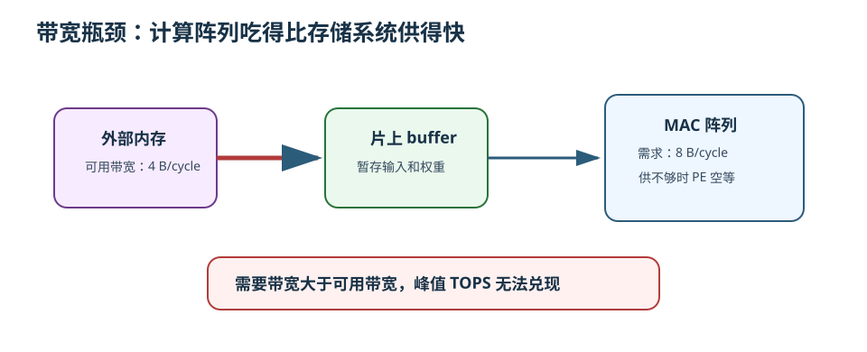
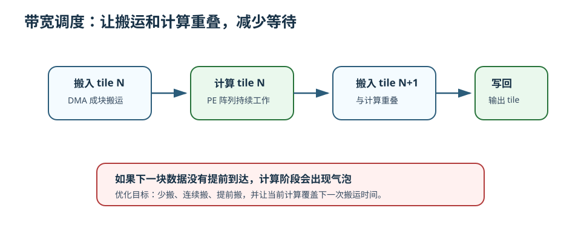
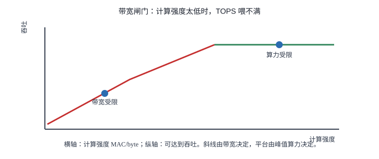

# 18 带宽瓶颈

> 章节等级：B  
> 状态：发布候选
> 来源映射：`chapter_source_map.csv` 中的 18 章；本章主要承接 SRC12、SRC15，参考 SRC11。

## 本章知识全景图

本章解决的问题是：为什么 NPU 明明有很多 MAC，却还是可能跑不快。原因常常不是“不会算”，而是数据送不到、送不及、送得太贵。带宽瓶颈就是计算阵列想吃数据的速度，超过了存储系统能供数据的速度。

| 核心问题 | 本章给出的回答 |
| --- | --- |
| 什么是带宽？ | 单位时间内能搬运的数据量，常用 B/s、GB/s 或每周期多少字节表示。 |
| 为什么会成为瓶颈？ | MAC 阵列每周期需要输入、权重、部分和，如果存储层供不上，阵列就空等。 |
| 怎样判断瓶颈？ | 比较计算需要的数据速率和实际可提供带宽，也可以用计算强度粗略判断。 |
| 怎样缓解？ | 靠 tile、数据复用、片上 SRAM、DMA 调度、layout、量化等手段减少外部搬运。 |

学习本章时不要只记“带宽很重要”。更有用的训练是：看到一个算子，先估算它要做多少 MAC，再估算它要搬多少字节，最后问这些字节能不能及时到达计算阵列。

## 为什么学

峰值 TOPS 只能说明计算阵列“最多能吃多少”，不能说明系统“能不能把数据喂上去”。NPU 真实性能经常被外部内存带宽、片上 SRAM 端口、DMA 粒度、layout 连续性或部分和写回拖住。学本章是为了把性能判断从“算力够不够”推进到“每 byte 能支撑多少 MAC、什么时候会让 PE 空等”。



## 1. 学习目标

读完本章，你应该能够：

- 用厨房供料的类比解释带宽瓶颈。
- 区分算力瓶颈和带宽瓶颈。
- 用一个小例子估算 MAC 阵列每周期需要多少字节。
- 手算一个卷积 tile 在“无复用”和“有复用”两种情况下的数据搬运量差异。
- 说明为什么 tile、buffer、DMA 和 dataflow 都在服务于“少搬、早搬、连续搬”。
- 看懂为什么 TOPS 高不等于真实推理速度一定高。

## 2. 先修提醒

本章需要你理解前面几个概念：

- MAC：一次乘法后累加。
- 输入、权重、输出、部分和：NPU 计算中最主要的几类数据。
- tile：把大计算拆成能放进片上存储的小块。
- 数据复用：同一个输入、权重或部分和被多次使用，减少重复搬运。

本章不会深入讲 DRAM 协议、总线仲裁或缓存一致性。零基础阶段先抓住一个核心：计算阵列的吞吐必须和数据供给速度匹配。

## 3. 生活化引入

想象一家餐厅有 100 位厨师，每位厨师每分钟都能炒一盘菜。看起来餐厅每分钟能做 100 盘。但是仓库到厨房只有一条小通道，每分钟只能送来 20 盘菜所需的食材。结果会怎样？

不是厨师不会做，而是厨师在等菜、等肉、等调料。最终出菜速度接近每分钟 20 盘，而不是 100 盘。

NPU 也是这样。MAC 阵列像厨师，输入和权重像食材，部分和和输出像半成品和成品。如果片上 buffer、DMA、外部内存之间的数据搬运跟不上，很多 MAC 单元就会空着。此时再增加 MAC 数量，不一定让系统更快，反而可能让“等数据”的问题更明显。

## 4. 直觉解释

带宽瓶颈可以用一句话判断：

```text
如果计算单元消耗数据的速度 > 存储系统提供数据的速度，就会出现带宽瓶颈。
```

计算阵列每做一次 MAC，至少要知道两个数：输入和权重。很多情况下还要读写部分和或输出。如果没有复用，数据需求会非常可怕：

```text
每次 MAC 都读 1 个输入 + 1 个权重
很多 MAC 还要读旧部分和 + 写新部分和
```

复用的意义就在这里。同一个输入可能被多个卷积窗口使用，同一个权重可能在整张特征图上重复使用，同一个部分和会被连续更新。只要把这些会被复用的数据放到片上，就可以把昂贵的外部搬运变成较便宜的本地访问。

带宽瓶颈不只和“总字节数”有关，也和“什么时候需要这些字节”有关。即使总数据量不大，如果某一段时间必须同时供给很多 PE，而 DMA 没有提前搬好，阵列也会停顿。好的调度会尽量让搬运和计算重叠：当前 tile 正在算时，下一个 tile 已经在搬。





## 5. 正式定义

**带宽 bandwidth** 指单位时间内可搬运的数据量。常见写法包括：

```text
GB/s：每秒多少十亿字节
B/cycle：每个周期多少字节
```

**算力 throughput** 指单位时间内可完成的计算量，例如 MAC/s 或 TOPS。

**带宽瓶颈** 指计算单元的潜在吞吐超过数据供给能力，导致计算单元等待数据，无法达到峰值算力。

一个简化判断公式是：

```text
需要带宽 = 每次计算需要搬运的字节数 * 每秒计算次数
```

如果：

```text
需要带宽 > 可用带宽
```

就会出现带宽瓶颈。

还可以用**计算强度**来描述一个 workload：

```text
计算强度 = 计算量 / 数据搬运量
```

单位可以粗略理解为：

```text
MAC per byte
```

计算强度高，说明每搬 1 byte 数据能做很多 MAC，比较容易喂饱阵列；计算强度低，说明搬很多数据却做不了多少计算，更容易受带宽限制。

这里的“数据搬运量”要分层看：

- 外部内存到片上 SRAM 的搬运。
- 片上 SRAM 到 PE 阵列的搬运。
- PE 内部寄存器和累加器之间的移动。

不同层级带宽和能耗差别很大。NPU 优化通常优先减少外部内存访问，因为它最慢、最贵，也最容易成为瓶颈。

## 6. 最小例题

假设一个小阵列每周期能做 4 次 MAC。输入和权重都是 1 byte。先看最坏的无复用情况：每次 MAC 都要从外部读 1 byte 输入和 1 byte 权重。

每周期需要：

```text
4 次 MAC * (1 byte 输入 + 1 byte 权重)
= 4 * 2 byte
= 8 byte/cycle
```

如果外部接口每周期只能提供 4 byte，那么最多只能支持：

```text
4 byte/cycle / 2 byte per MAC = 2 MAC/cycle
```

阵列理论上能做 4 MAC/cycle，但实际只能被喂饱一半。剩下一半时间或一半 MAC 单元会等待数据。

如果输入或权重能复用一次，每 4 次 MAC 只需要读 4 byte 而不是 8 byte，那么需求就变成：

```text
4 byte/cycle
```

这时同样的外部接口就可能刚好喂饱阵列。这个例子说明：带宽瓶颈不只靠增加接口宽度解决，也可以靠减少重复读取解决。

## 7. 完整例题

现在估算一个小卷积 tile 的搬运量。假设：

```text
输出 tile: OH=8, OW=8
输出通道: OC=16
输入通道: IC=16
卷积核: R=3, S=3
输入/权重: int8，每个 1 byte
输出/部分和: int32，每个 4 byte
stride=1，无 padding
```

计算量：

```text
输出元素数 = 8 * 8 * 16 = 1024
每个输出需要 IC * R * S = 16 * 3 * 3 = 144 次 MAC
总 MAC = 1024 * 144 = 147456
```

### 情况 A：几乎不复用，按 MAC 反复读输入和权重

每次 MAC 读 1 byte 输入和 1 byte 权重：

```text
输入+权重读取 = 147456 * 2 byte = 294912 byte
```

最终输出写回：

```text
输出写回 = 1024 * 4 byte = 4096 byte
```

粗略总搬运：

```text
294912 + 4096 = 299008 byte
```

这还没有算部分和中途写回。如果部分和也频繁溢出到外部内存，搬运量会更大。

### 情况 B：tile 放进片上，输入和权重尽量复用

为了得到 8x8 输出，3x3 卷积需要输入空间大约是 10x10。输入 tile 大小：

```text
IC * IH * IW = 16 * 10 * 10 = 1600 byte
```

权重大小：

```text
OC * IC * R * S = 16 * 16 * 3 * 3 = 2304 byte
```

输出写回：

```text
1024 * 4 byte = 4096 byte
```

粗略总搬运：

```text
1600 + 2304 + 4096 = 8000 byte
```

比较两种情况：

```text
无复用约 299008 byte
有 tile 复用约 8000 byte
```

搬运量相差约：

```text
299008 / 8000 ≈ 37.4
```

这个估算并不是最终硬件模型，但足以说明为什么 NPU 这么重视 tile、片上 SRAM 和 dataflow。同样的 147456 次 MAC，如果每次都重新搬数据，带宽压力巨大；如果输入和权重能在片上复用，外部带宽需求会明显下降。

再看计算强度：

```text
无复用计算强度 ≈ 147456 MAC / 299008 byte ≈ 0.49 MAC/byte
有复用计算强度 ≈ 147456 MAC / 8000 byte ≈ 18.43 MAC/byte
```

计算强度越高，说明每搬一个字节能做更多计算，MAC 阵列越不容易饿肚子。

## 8. NPU 连接

NPU 处理带宽瓶颈，常见思路可以归成六类：

| 手段 | 解决什么问题 |
| --- | --- |
| tile | 把大张量拆成片上 SRAM 能容纳的小块 |
| 数据复用 | 让输入、权重、部分和尽量多用几次再丢 |
| 片上 buffer | 用更近、更快、更省能的数据存放位置替代反复访问外部内存 |
| DMA 调度 | 提前搬、成块搬、连续搬，尽量和计算重叠 |
| layout 优化 | 让下一批要读的数据在内存中更连续 |
| 量化/压缩 | 减少每个数占用的 byte 数 |

这里最容易低估的是部分和。输入和权重只是读入，部分和常常要读旧值、加新贡献、写新值。如果部分和不能留在本地，就会形成额外读写流量。第 17 章讲的 partial sum，正是带宽问题里的高风险对象。

带宽瓶颈也解释了为什么峰值 TOPS 不等于真实性能。TOPS 只说明“如果数据都准备好了，计算阵列最多能做多少操作”。但真实模型还要看：

- 输入、权重、输出是否能按时到达。
- 片上 SRAM 能否容纳有用 tile。
- DMA 能否和计算重叠。
- dataflow 是否让最该复用的数据留在本地。
- layout 是否造成大量非连续访问。

一个设计判断口诀是：

```text
先算 MAC，再算 byte；如果 byte 喂不动，TOPS 就只是峰值广告。
```

## 9. 常见误区

### 误区 1：TOPS 高就一定快

- 错误说法：NPU 的 TOPS 越高，模型一定越快。
- 为什么错：如果数据供给跟不上，MAC 阵列无法持续满负荷工作。
- 正确理解：真实性能取决于算力、带宽、片上存储、复用和调度共同作用。

### 误区 2：带宽只和外部内存有关

- 错误说法：只要 DRAM 带宽够，片上就不会有瓶颈。
- 为什么错：片上 SRAM 到 PE、PE 之间、寄存器到 MAC 也有带宽和端口限制。
- 正确理解：带宽是分层问题，只是外部内存通常最昂贵、最明显。

### 误区 3：tile 只是为了放得下

- 错误说法：tile 的唯一作用是把大张量切小。
- 为什么错：tile 还决定哪些数据能在片上复用、部分和是否要写回、DMA 是否连续。
- 正确理解：好的 tile 同时服务容量、复用、带宽和调度。

### 误区 4：减少计算量一定比减少搬运量更重要

- 错误说法：优化 NPU 只要少做 MAC。
- 为什么错：很多场景中，外部内存访问比一次 MAC 更慢、更耗能。少搬数据可能比少算一点更关键。
- 正确理解：应同时估算 MAC 数和 byte 数，判断当前瓶颈在哪里。

### 误区 5：所有数据都同等重要

- 错误说法：输入、权重、部分和的优化优先级一样。
- 为什么错：不同 dataflow 下复用机会不同。有些层权重复用高，有些层输入复用高，部分和可能成为主要写回压力。
- 正确理解：要按算子形状和 mapping 判断最该留在本地的数据。

## 工程判断

判断带宽瓶颈时，先估算计算强度：`MAC 数 / 外部搬运 byte 数`。如果计算强度低，即使 TOPS 很高也可能被带宽限制；如果计算强度高但仍慢，再看片上端口、DMA 是否连续、layout 是否导致小包搬运。优化顺序不是盲目加 PE，而是先减少外部搬运：提高复用、扩大合适 tile、压缩位宽、让 DMA 预取和计算重叠、避免部分和中间写回。失败信号包括 PE utilization 低、外部带宽接近上限、DMA 请求碎片化、或同一层在增大 PE 数后延迟几乎不降。排查时同时记录 MAC、byte、带宽、利用率四个量。

## 10. 本章自测

### 题目

1. 什么是带宽？
2. 什么是带宽瓶颈？
3. 一个阵列每周期做 8 次 MAC，每次 MAC 无复用读取 1 byte 输入和 1 byte 权重，需要多少 byte/cycle？
4. 如果第 3 题的可用带宽只有 8 byte/cycle，最多能喂饱多少次 MAC/cycle？
5. 为什么数据复用能缓解带宽瓶颈？
6. 什么是计算强度？
7. 为什么部分和可能增加带宽压力？
8. tile 和带宽有什么关系？
9. 为什么 layout 会影响带宽利用率？
10. TOPS 和真实推理速度之间为什么不能直接画等号？

### 答案或评分点

1. 单位时间内能搬运的数据量。
2. 计算单元需要的数据速率超过存储系统可提供的数据速率，导致计算等待。
3. `8*(1+1)=16 byte/cycle`。
4. `8 byte/cycle / 2 byte per MAC = 4 MAC/cycle`。
5. 同一数据多次使用，可以减少外部重复读取，让每 byte 支撑更多 MAC。
6. 计算量除以数据搬运量，例如 MAC/byte。
7. 部分和可能需要读旧值和写新值；若不能本地保存，会产生额外外部访问。
8. tile 决定哪些输入、权重、输出能放在片上复用，也决定 DMA 搬运粒度。
9. layout 决定逻辑相邻数据在内存中是否连续，影响成块搬运效率。
10. TOPS 是峰值计算能力，真实速度还受带宽、存储容量、复用和调度限制。

## 来源

- 外部来源：OSTI Roofline 论文页面 `https://www.osti.gov/pages/biblio/1407073`，用于核对计算强度、带宽上限和 roofline 判断口径。
- 外部来源：Eyeriss 项目与论文 `https://eyeriss.mit.edu/`，用于核对数据复用和存储访问能耗/带宽压力。
- 外部来源：Google TPU 论文 `https://arxiv.org/abs/1704.04760`，用于参考大规模矩阵阵列需要片上/片外存储持续供数。
- 外部来源：Apache TVM TensorIR 文档 `https://tvm.apache.org/docs/deep_dive/tensor_ir/index.html`，用于支撑通过调度和局部性降低带宽压力。
- 本地来源：`C:\Users\11035\Desktop\ic\npu\14、NPU\《NPU内存带宽与DMA优化从入门到精通》\01.html`，第 227-274 行说明内存墙、带宽瓶颈和 DMA 优化重要性。
- 本地来源：`C:\Users\11035\Desktop\ic\npu\14、NPU\《NPU内存带宽与DMA优化从入门到精通》\03.html`，第 237-304 行给出带宽定义、峰值带宽公式和 LPDDR5 示例。
- 本地来源：`C:\Users\11035\Desktop\ic\npu\14、NPU\《NPU性能评测与基准测试从入门到精通》\01.html`，作为 TOPS 与真实性能差异的本地评测语境；后续验证脚本会进一步抽取精确行号。
