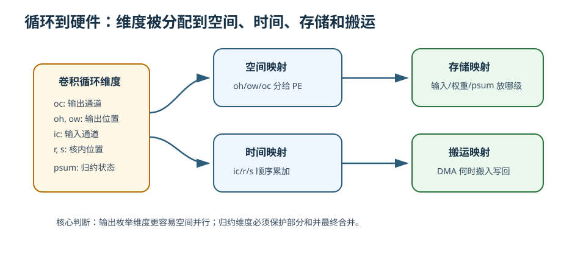
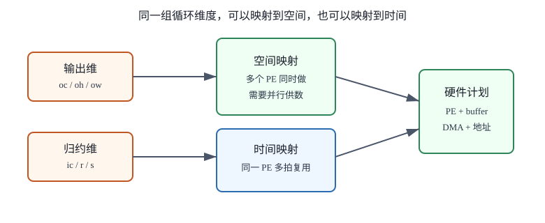
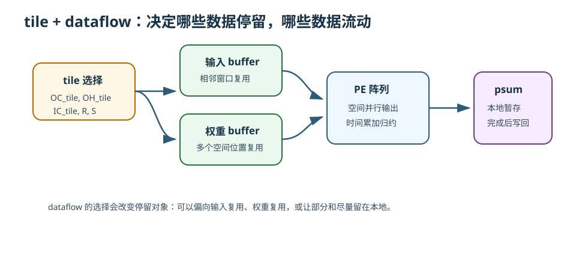

# 19 循环如何映射到硬件

> 章节等级：A  
> 状态：发布候选
> 来源映射：`chapter_source_map.csv` 中的 19 章；本章主要承接 SRC17、SRC01，参考 SRC12。

## 本章知识全景图

本章把第 10-18 章的线索收束到一个问题：写在程序里的循环，怎样变成 NPU 上的并行计算、片上存储、地址生成和数据流。循环不是只给 CPU 顺序执行的代码；在 NPU 设计里，循环维度会被拆开，有的映射到 PE 阵列的空间位置，有的留在时间上顺序执行，有的决定 tile 形状，有的决定数据在 buffer 中如何复用。

| 核心问题 | 本章给出的回答 |
| --- | --- |
| 循环映射是什么？ | 把 `oc/oh/ow/ic/r/s` 等循环维度绑定到时间、PE 阵列、buffer 和 DMA 搬运上的过程。 |
| tile 起什么作用？ | tile 决定一次映射到硬件的小问题规模，让数据能放进片上并形成复用。 |
| dataflow 起什么作用？ | dataflow 决定输入、权重、部分和谁尽量停留、谁流动、谁被复用。 |
| 硬件到底执行什么？ | 地址发生器取数，buffer 暂存，PE/MAC 阵列计算，部分和累加，DMA 写回。 |

读这一章时，建议把循环看成“工作清单”，把硬件看成“工厂”。映射就是决定哪些工作分给哪些工位并行做，哪些工作排队做，哪些材料提前送到工位旁边。

## 为什么学

前面章节分别讲了 loop、layout、tile、reuse、dataflow、psum 和 bandwidth，本章负责把它们接成硬件执行计划。没有 loop-to-hardware mapping，读者只知道许多局部概念，却不知道编译器和硬件最终如何决定：哪些循环展开到 PE，哪些循环留给时间复用，哪些数据进入 buffer，DMA 何时搬运，地址发生器怎么走。



## 1. 学习目标

读完本章，你应该能够：

- 把卷积循环中的输出空间、输出通道、输入通道、卷积核位置分清。
- 解释 spatial mapping 和 temporal mapping 的区别。
- 用一个 2x2 输出的小例子说明循环如何分给多个 PE。
- 说明 tile、数据复用、partial sum 和 dataflow 如何共同决定硬件执行计划。
- 看懂一个简化卷积 loop nest 到 buffer、PE、DMA 的映射路径。
- 说出为什么同一个数学算子可以有多种硬件映射。

## 2. 先修提醒

本章默认你已经知道：

- 单个卷积输出来自窗口和权重的乘加。
- 多通道卷积会沿输入通道继续累加。
- 循环可以展开卷积计算。
- tile 是把大计算拆成小块。
- 数据复用包括输入复用、权重复用和部分和复用。
- partial sum 必须在最终输出前被保存和更新。
- 带宽瓶颈会限制 MAC 阵列的实际利用率。

如果这些概念还不稳，读本章时可以先抓最小判断：循环维度不是抽象数学，它会决定硬件里谁并行、谁暂存、谁搬运。



## 3. 生活化引入

想象一个工厂要给 1000 个包裹贴标签。任务可以写成几层循环：

```text
for 每个货架:
  for 每一层:
    for 每个包裹:
      贴标签
```

如果只有一个工人，他可以从头到尾顺序贴。可是工厂有很多工位，就要重新安排：

- 货架可以分给不同区域的工人。
- 同一货架不同层可以并行处理。
- 标签纸和扫描枪要提前放到工位旁边。
- 已贴好的包裹要集中送回仓库。

循环映射就是这种安排。程序里的循环告诉我们“有哪些活”；硬件映射决定“哪些活同时做、哪些活分批做、数据放在哪里、什么时候搬”。

## 4. 直觉解释

卷积循环里常见的维度包括：

```text
oc: 输出通道
oh: 输出高度位置
ow: 输出宽度位置
ic: 输入通道
r : 卷积核高度位置
s : 卷积核宽度位置
```

这些循环可以分成两类：

| 循环类型 | 例子 | 对输出的意义 |
| --- | --- | --- |
| 生成输出的循环 | `oc, oh, ow` | 决定要生成哪些输出元素 |
| 归约累加的循环 | `ic, r, s` | 决定一个输出元素内部要累加哪些乘积 |

硬件映射最重要的一步，就是决定哪些循环放到空间上并行，哪些循环留在时间上顺序执行。

- **空间映射**：把不同循环迭代分给不同 PE 同时做。例如 4 个 PE 分别算 4 个输出位置。
- **时间映射**：同一个 PE 在多个周期里顺序执行不同迭代。例如一个 PE 依次累加 `ic,r,s` 的乘积。

一个常见直觉是：生成不同输出的循环比较容易并行；归约循环必须小心处理部分和。比如不同 `oh,ow` 的输出位置可以分给不同 PE；但同一个输出里的 `ic,r,s` 贡献要加到同一个部分和上，不能随便分散后忘记合并。

tile 是映射前的切块动作。完整特征图和所有通道往往太大，放不进片上 SRAM，所以编译器或调度器会先选择一小块：

```text
一批输出通道
一块输出空间
一批输入通道
对应输入窗口和权重
```

dataflow 则决定这块数据在硬件里怎么动。比如让权重留在 PE 附近，输入不断流过；或者让部分和留在 PE 内，直到输出完成。



## 5. 正式定义

**循环映射（loop-to-hardware mapping）** 指把算子循环中的迭代维度分配到硬件资源和执行时间上的过程。它至少包括四个决定：

1. **空间映射**：哪些循环维度映射到 PE 阵列的行、列或其他并行单元。
2. **时间映射**：哪些循环维度在同一硬件资源上按周期顺序执行。
3. **存储映射**：输入、权重、部分和、输出分别放在哪级 buffer 或寄存器。
4. **搬运映射**：DMA 何时搬入、搬出，是否与计算重叠，访问是否连续。

一个简化卷积 loop nest 可以写成：

```text
for oc in OC:
  for oh in OH:
    for ow in OW:
      psum = 0
      for ic in IC:
        for r in R:
          for s in S:
            psum += input[ic][oh+r][ow+s] * weight[oc][ic][r][s]
      output[oc][oh][ow] = psum
```

在这个循环里：

- `oc, oh, ow` 是输出枚举维度。
- `ic, r, s` 是归约维度。
- `psum` 的生命周期覆盖归约循环。
- 输入复用常发生在相邻 `oh,ow`。
- 权重复用常发生在同一个 `oc` 的多个空间位置。
- 部分和复用发生在同一个输出元素的连续累加。

映射不是改变数学结果，而是改变执行顺序和数据停留位置。只要依赖关系正确，很多不同 mapping 都能得到同样输出；差异在速度、面积、能耗、带宽和控制复杂度。

## 6. 最小例题

假设我们要计算一个单通道 2x2 输出，每个输出需要 2 次 MAC。输出位置是：

```text
out[0][0]  out[0][1]
out[1][0]  out[1][1]
```

### 方案 A：一个 PE 顺序计算

```text
周期 1-2：计算 out[0][0]
周期 3-4：计算 out[0][1]
周期 5-6：计算 out[1][0]
周期 7-8：计算 out[1][1]
```

总共需要 8 个 MAC 周期。部分和只需要一个累加器，但总时间长。

### 方案 B：四个 PE 空间并行

```text
PE0 -> out[0][0]
PE1 -> out[0][1]
PE2 -> out[1][0]
PE3 -> out[1][1]
```

每个 PE 做 2 次 MAC：

```text
周期 1：每个 PE 做第 1 次 MAC
周期 2：每个 PE 做第 2 次 MAC
```

理想情况下 2 个周期完成 4 个输出。代价是需要同时给 4 个 PE 提供输入和权重，还要为 4 个输出维护 4 份部分和。

这个例子说明了映射的基本取舍：

- 并行度高，计算更快。
- 数据供给压力也更高。
- 部分和数量更多，需要更多本地暂存。
- 如果带宽不够，四个 PE 可能并不能满速工作。

## 7. 完整例题

现在把一个小卷积 loop 映射到一个 2x2 PE 阵列。假设：

```text
输出 tile: OH_tile=2, OW_tile=2
输出通道: OC_tile=1
输入通道: IC_tile=2
卷积核: R=2, S=2
PE 阵列: 2 行 x 2 列
```

输出空间刚好有 4 个位置：

```text
(oh=0, ow=0)  (oh=0, ow=1)
(oh=1, ow=0)  (oh=1, ow=1)
```

### 第一步：选择空间映射

把 `oh,ow` 映射到 PE 阵列：

```text
PE(0,0) -> out[0][0]
PE(0,1) -> out[0][1]
PE(1,0) -> out[1][0]
PE(1,1) -> out[1][1]
```

这样，4 个输出位置并行生成。

### 第二步：选择时间映射

每个输出还要累加：

```text
IC_tile * R * S = 2 * 2 * 2 = 8
```

个乘积。把 `ic,r,s` 留在时间上顺序执行。每个 PE 有自己的 `psum`：

```text
psum_pe = 0
for ic in 0..1:
  for r in 0..1:
    for s in 0..1:
      psum_pe += input[ic][oh+r][ow+s] * weight[0][ic][r][s]
```

8 轮后，每个 PE 得到一个最终输出。

### 第三步：分析输入复用

相邻输出窗口会共享输入。例如 `out[0][0]` 和 `out[0][1]` 的窗口横向相邻，许多输入位置重叠。如果输入 tile 放在片上 buffer 中，PE(0,0) 和 PE(0,1) 可以从同一片输入 buffer 读取不同偏移，而不必各自从外部内存重新搬。

### 第四步：分析权重复用

本例只有一个输出通道，4 个 PE 都使用同一组权重：

```text
weight[0][ic][r][s]
```

这些权重可以广播给 4 个 PE，或者提前放在每个 PE 附近。权重复用的机会来自：同一卷积核会应用到多个空间位置。

### 第五步：分析部分和

每个 PE 负责一个输出位置，因此每个 PE 都维护自己的部分和：

```text
PE(0,0): psum00
PE(0,1): psum01
PE(1,0): psum10
PE(1,1): psum11
```

如果采用 output-stationary 直觉，这 4 个部分和会尽量留在各自 PE 或附近寄存器中，直到 8 个乘积都累完，再写到 output buffer。

### 第六步：形成硬件执行流水

一个简化执行计划是：

```text
1. DMA 把输入 tile 和权重 tile 搬入片上 buffer。
2. 地址发生器按 oh/ow/ic/r/s 产生读取地址。
3. 2x2 PE 阵列并行计算 4 个输出位置。
4. 每个 PE 在本地累加自己的 psum。
5. 8 轮 MAC 后，4 个输出写入 output buffer。
6. DMA 把输出 tile 写回，或交给下一层继续使用。
```

这就是循环、tile、复用、dataflow 到硬件映射的闭环。循环告诉我们有哪些迭代；tile 决定本次装进片上的范围；复用告诉我们哪些数据值得留在本地；dataflow 决定数据停留和移动方式；硬件执行计划把这些决定变成地址、buffer 读写、PE 计算和输出写回。

## 8. NPU 连接

真实 NPU 的 mapping 通常由硬件能力和编译器共同决定。硬件提供 PE 阵列规模、buffer 容量、DMA 能力、支持的数据流形式；编译器或 runtime 根据模型 shape、layout 和算子类型生成具体执行计划。

一个可复用的 mapping 检查表如下：

| 问题 | 目的 |
| --- | --- |
| 哪些循环是输出枚举，哪些循环是归约？ | 避免把需要累加的维度错误并行后忘记归约 |
| 哪些循环映射到 PE 行列？ | 决定空间并行度 |
| 哪些循环留在时间上？ | 决定每个 PE 的工作周期和部分和生命周期 |
| tile 是否放得进片上 buffer？ | 决定是否需要更多分批和中间写回 |
| 输入、权重、部分和谁复用最多？ | 决定 dataflow 倾向 |
| DMA 访问是否连续？ | 决定带宽利用率 |
| 部分和在哪里完成？ | 决定写回次数和累加正确性 |

同一个数学卷积可以有多种 mapping。例如：

- 把 `ow` 映射到 PE 列，适合横向相邻输出并行。
- 把 `oc` 映射到 PE 列，适合多个输出通道并行，并复用同一输入。
- 把 `ic` 拆给多个 PE 并行时，需要最后把多个局部部分和归约合并。
- 把 `r,s` 留在时间上时，控制简单；若展开到空间上，可能增加输入广播和部分和合并压力。

因此 mapping 没有脱离硬件的唯一答案。一个小阵列、一个大阵列、一个外部带宽很强的系统、一个片上 SRAM 很小的系统，可能选择不同映射。优秀的 NPU 设计不是把循环随便摊开，而是在并行度、复用、带宽、部分和保存和控制复杂度之间取平衡。

## 9. 常见误区

### 误区 1：循环顺序就是硬件执行顺序

- 错误说法：伪代码怎么写，硬件就一定按这个顺序执行。
- 为什么错：编译器和硬件可以重排、分块、并行化循环，只要不破坏依赖关系。
- 正确理解：伪代码表达数学含义，mapping 决定实际执行组织。

### 误区 2：所有循环都适合直接并行

- 错误说法：把每层循环都分给不同 PE，速度一定最快。
- 为什么错：归约循环并行后需要合并部分和，数据供给和控制也可能变复杂。
- 正确理解：输出枚举循环较容易空间并行，归约循环要处理部分和归并。

### 误区 3：tile 只影响容量，不影响 mapping

- 错误说法：tile 只是把数据切小，和硬件映射无关。
- 为什么错：tile 形状决定 PE 一次处理哪些输出、哪些数据能复用、部分和是否跨批次保存。
- 正确理解：tile 是 mapping 的输入之一，不是单独的预处理。

### 误区 4：dataflow 是硬件名词，和循环无关

- 错误说法：循环是软件，dataflow 是硬件，两者可以分开看。
- 为什么错：dataflow 实际上是在回答循环迭代中输入、权重、部分和如何移动和复用。
- 正确理解：循环维度提供复用机会，dataflow 选择利用哪种复用机会。

### 误区 5：空间并行越多越好

- 错误说法：PE 越多、映射越展开，性能一定越高。
- 为什么错：PE 多会增加同时供数需求、部分和数量和输出写回压力；带宽不足时会空等。
- 正确理解：并行度必须和 buffer、DMA、带宽、dataflow 匹配。

## 工程判断

做 mapping 时先分清两类维度：`oc/oh/ow/n` 通常产生不同输出，适合空间并行或 tile 分配；`ic/r/s` 是归约维度，并行后必须处理部分和合并。空间展开越多，PE 利用率可能越高，但同时增加输入、权重、psum 的瞬时供给压力；时间复用越多，硬件需求小，但延迟更高。失败信号包括归约结果合并错误、地址发生器跨界读写、PE 阵列大面积空闲、DMA 供数跟不上或边界 tile 处理错误。排查时先把 loop nest 标出输出维和归约维，再画出每个维度落到 PE、buffer、DMA 还是时间循环。

## 10. 本章自测

### 题目

1. 什么是 loop-to-hardware mapping？
2. 卷积循环中 `oc,oh,ow` 通常属于输出枚举维度还是归约维度？
3. `ic,r,s` 通常属于什么维度？
4. 什么是空间映射？
5. 什么是时间映射？
6. 为什么归约循环并行后需要小心处理部分和？
7. 一个 2x2 PE 阵列并行计算 2x2 输出空间，理想情况下每个 PE 负责几个输出位置？
8. tile 为什么会影响数据复用？
9. dataflow 和 mapping 的关系是什么？
10. 为什么同一个卷积算子可能有多种正确的硬件映射？

### 答案或评分点

1. 把算子循环维度分配到硬件资源、执行时间、存储和搬运上的过程。
2. 输出枚举维度。
3. 归约累加维度。
4. 把不同循环迭代分给多个 PE 或并行单元同时执行。
5. 同一硬件资源在多个周期里顺序执行循环迭代。
6. 因为同一个输出的多个贡献必须合并到同一个最终值，不能各算各的后丢失。
7. 理想情况下每个 PE 负责 1 个输出位置。
8. tile 决定哪些输入、权重、部分和同时在片上，从而决定能复用哪些数据。
9. mapping 选择循环如何落到硬件，dataflow 选择数据在这些硬件资源之间如何停留和移动。
10. 只要数学依赖正确，不同空间/时间/存储安排都能得到同一结果，但性能和能耗不同。

## 来源

- 外部来源：Apache TVM TensorIR 文档 `https://tvm.apache.org/docs/deep_dive/tensor_ir/index.html`，用于核对循环、block、调度变换和硬件映射入口。
- 外部来源：MLIR Linalg dialect 文档 `https://mlir.llvm.org/docs/Dialects/Linalg/`，用于核对 structured op 的输入、输出和迭代语义。
- 外部来源：Eyeriss 项目与论文 `https://eyeriss.mit.edu/`，用于核对 dataflow、复用和硬件映射选择。
- 外部来源：Google TPU 论文 `https://arxiv.org/abs/1704.04760`，用于参考脉动阵列的空间/时间数据流映射。
- 本地来源：`C:\Users\11035\Desktop\ic\npu\14、NPU\《NPU硬件循环与数据流架构从入门到精通》\04.html`，第 216-253 行说明硬件循环机制，第 620-624 行说明可配置硬件循环引擎与数据流集成。
- 本地来源：`C:\Users\11035\Desktop\ic\npu\14、NPU\《NPU硬件循环与数据流架构从入门到精通》\03.html`，第 191-260 行说明脉动阵列和数据在 PE 间固定路径流动。
- 本地来源：`C:\Users\11035\Desktop\ic\npu\14、NPU\《NPU内存带宽与DMA优化从入门到精通》\02.html`，第 287-417 行说明片上存储、内存接口和 DMA 双缓冲，用于映射 buffer/DMA 侧。
