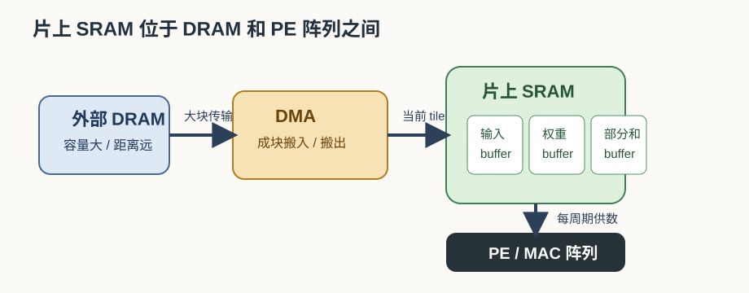
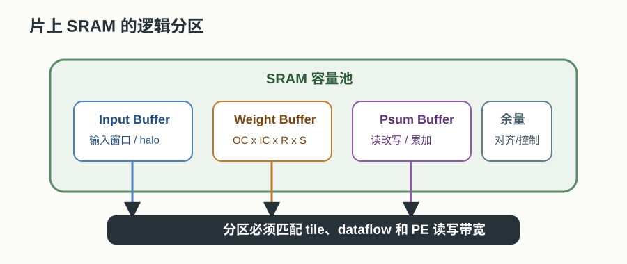
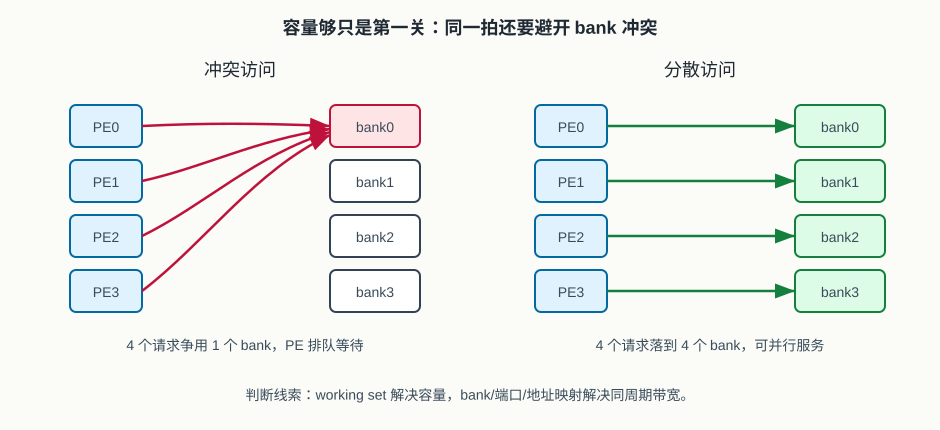

# 23 片上 SRAM 与 buffer

> 章节等级：A  
> 状态：发布候选  
> 来源映射：`chapter_source_map.csv` 中的 23 章；本章主要承接 SRC12、SRC17，参考 SRC11。

前面几章已经说明：卷积不是只做乘法，而是一连串循环、数据复用、部分和累加和硬件映射。本章继续追问一个很现实的问题：这些输入、权重、部分和和输出到底放在哪里。片上 SRAM 与 buffer 的作用，就是在外部内存和 PE 阵列之间放一个更近、更快、可控的小仓库，让 NPU 不必每做几次 MAC 就去远处取数或存数。

## 本章知识全景图

| 核心问题 | 本章给出的回答 |
| --- | --- |
| 片上 SRAM 是什么？ | NPU 芯片内部的静态随机存储器，容量小于外部 DRAM，但离计算阵列近、延迟低、能耗低。 |
| buffer 是什么？ | 为某类数据或某段执行流程准备的临时存储空间，可以用 SRAM 实现，也可以包含寄存器队列等结构。 |
| 为什么需要它？ | 为了承接 tile、数据复用和 partial sum，减少外部内存访问，缓解带宽瓶颈。 |
| 设计时最先看什么？ | 容量够不够、端口/带宽够不够、数据分区是否适合当前 dataflow。 |



## 为什么学

PE 阵列的峰值来自“每周期很多 MAC”，但真实吞吐常常卡在“每周期能不能把数据送到 PE”。片上 SRAM 与 buffer 是连接计算阵列和外部内存的中间层：它们决定 tile 能不能放下，输入和权重能不能复用，partial sum 能不能留在片上，以及 DMA 和 PE 是否能重叠工作。

本章要把一个抽象说法落到可计算判断：给定 tile 形状、数据位宽和 buffer 分区，能不能算出 working set；给定 PE 阵列访问模式，能不能判断 bank/端口会不会冲突。不会做这个判断，后面即使会画 PE 阵列，也无法解释为什么阵列经常等数据。

## 1. 学习目标

读完本章，你应该能够：

- 用自己的话解释为什么 NPU 不能只依赖外部 DRAM。
- 区分 SRAM、buffer、寄存器、外部内存这几类存储位置。
- 说明 input buffer、weight buffer、psum/output buffer 分别服务什么数据。
- 手算一个卷积 tile 至少需要多少片上存储。
- 解释 buffer 容量、端口和分区为什么会影响 PE 阵列利用率。
- 把片上 SRAM 和前面的 tile、dataflow、partial sum、带宽瓶颈联系起来。

## 2. 先修提醒

本章默认你已经理解四件事：

- 第 14 章的 tile：大张量要切成能放进片上的小块。
- 第 15 章的数据复用：同一份输入、权重或部分和最好多用几次。
- 第 17 章的 partial sum：输出在累加完成前有中间状态。
- 第 18 章的带宽瓶颈：MAC 阵列吃数据的速度可能超过存储供给速度。

本章会提到 PE 阵列，但不会重新定义 PE 微架构。你只需要把 PE 理解成“执行 MAC、保存少量局部状态的小计算单元”。真正的 PE 细节在第 20-22 章已经铺垫，本章关注的是它旁边和外层的数据存放问题。

## 3. 生活化引入

想象你在厨房做 100 份同样的菜。所有食材都放在楼下仓库。如果每切一片菜、每放一勺盐，都要跑到楼下拿一次，厨师再熟练也做不快。更合理的做法是先从仓库把一批食材搬到厨房台面：一篮青菜、一盒调料、一盆半成品。厨师做菜时大部分时间只在台面附近取放，只有一批快用完时才再去仓库补货。

NPU 的外部 DRAM 像楼下仓库，片上 SRAM 像厨房里的工作台和小冰箱，PE 阵列像厨师。工作台不可能放下整个仓库，但只要放下“当前这批 tile”需要的数据，就能让厨师连续工作。

如果没有片上 SRAM，NPU 会陷入两个麻烦：

- 输入和权重反复从远处读取，同一份数据无法就近复用。
- 部分和每更新几次就要写回远处，再读回来继续累加。

这两个麻烦最终都会变成带宽和能耗问题。

## 4. 直觉解释

片上 SRAM 的第一层直觉是“近”。同样是存一个数字，放在 PE 内寄存器最近，放在片上 SRAM 次之，放在外部 DRAM 最远。越近通常越快、越省能，但容量越小、成本越高。

可以把 NPU 存储层级粗略看成：

```text
PE 寄存器/累加器  <  片上 SRAM buffer  <  外部 DRAM
最近、最小、最快      中等容量、可复用       最大、最远、最贵
```

buffer 的第二层直觉是“按用途分工”。同一块物理 SRAM 可以被划成不同逻辑区域，也可以设计成多个独立 SRAM bank。常见逻辑 buffer 包括：

| buffer 类型 | 主要保存 | 为什么重要 |
| --- | --- | --- |
| input buffer | 当前 tile 的输入特征图 | 让相邻输出窗口复用同一片输入 |
| weight buffer | 当前 tile 的卷积核权重 | 让同一组权重服务多个输出位置 |
| psum buffer | 尚未完成的部分和 | 避免部分和频繁写回外部内存 |
| output buffer | 已完成或等待写回的输出 | 给 DMA 或下一层提供连续写回空间 |

buffer 的第三层直觉是“喂饱阵列”。容量够只是第一步，PE 阵列还要在每个周期拿到足够数据。如果 SRAM 只有一个读端口，却要同时喂很多 PE，阵列也会等待。因此 NPU 设计常常会把 SRAM 分成多个 bank，或者给不同数据流安排不同端口。



## 5. 正式定义

**片上 SRAM（on-chip SRAM）** 指集成在 NPU 芯片内部、由静态存储单元构成的随机访问存储器。本书里重点关注它作为神经网络加速器本地存储的角色，而不是晶体管级 SRAM 电路。

**buffer** 指为某段计算临时保存数据的逻辑存储空间。buffer 可以由 SRAM、寄存器文件、FIFO 或它们的组合实现。教材中常说的 input buffer、weight buffer、output buffer，强调的是“这块空间用来服务哪类数据”，不一定代表物理上一定是三块完全独立的 SRAM。

对一个卷积 tile，片上存储需求可以粗略写成：

```text
总片上需求
≈ 输入 tile 字节数
+ 权重 tile 字节数
+ 部分和/输出 tile 字节数
+ 对齐、bank、双缓冲和控制开销
```

其中：

```text
输入 tile 字节数 = IC_tile * IH_tile * IW_tile * bytes(input)
权重 tile 字节数 = OC_tile * IC_tile * R * S * bytes(weight)
部分和字节数     = OC_tile * OH_tile * OW_tile * bytes(psum)
输出字节数       = OC_tile * OH_tile * OW_tile * bytes(output)
```

如果部分和在累加期间一直保留在片上，`psum` 和最终 `output` 可能复用同一区域；如果部分和需要跨输入通道 tile 保存，就必须明确它什么时候留在 SRAM、什么时候写回外部内存。

片上 SRAM 设计还有三个边界：

1. **容量边界**：能不能放下当前 tile 的输入、权重、部分和。
2. **带宽边界**：每周期能不能向 PE 阵列提供足够读写。
3. **组织边界**：bank、端口、地址映射和 dataflow 是否匹配。

## 6. 最小例题

先看一个极小的 1D 类比。假设一个 PE 要连续计算 4 次 MAC：

```text
x = [3, 4, 5, 6]
w = [2, 1, 3, 1]
```

如果没有片上 buffer，每次 MAC 都从外部内存读输入和权重：

```text
第 1 次：读 x0, w0
第 2 次：读 x1, w1
第 3 次：读 x2, w2
第 4 次：读 x3, w3
```

外部读取量是：

```text
4 次 MAC * 2 个数 = 8 个数
```

如果先把 `x` 和 `w` 搬进片上 buffer，计算阶段就从本地读取：

```text
外部搬入：x0,x1,x2,x3,w0,w1,w2,w3，共 8 个数
本地计算：从 buffer 读 8 个数
```

这个例子看起来外部总数没变，因为每个数只用了一次。真正的价值要等复用出现。假设同一组权重 `w` 要用于 3 个不同输入窗口，那么无 buffer 时权重可能被外部读 3 次：

```text
权重外部读取 = 4 个权重 * 3 次 = 12 个数
```

放入 weight buffer 后，权重外部读取只需要：

```text
4 个权重 * 1 次 = 4 个数
```

省下来的不是计算，而是反复搬运。NPU 的 SRAM buffer 正是靠这种复用把外部带宽需求降下来。

## 7. 完整例题

现在手算一个卷积 tile 需要多少片上 SRAM。假设：

```text
输出 tile: OH_tile=8, OW_tile=8
输出通道 tile: OC_tile=16
输入通道 tile: IC_tile=16
卷积核: R=3, S=3
stride=1, 无 padding
input/weight: int8，每个 1 byte
partial sum/output: int32，每个 4 byte
```

为了得到 `8x8` 输出，`3x3` 卷积需要的输入空间是：

```text
IH_tile = OH_tile + R - 1 = 8 + 3 - 1 = 10
IW_tile = OW_tile + S - 1 = 8 + 3 - 1 = 10
```

### 第一步：输入 buffer

```text
输入 tile 字节数
= IC_tile * IH_tile * IW_tile * 1
= 16 * 10 * 10
= 1600 byte
```

### 第二步：权重 buffer

```text
权重 tile 字节数
= OC_tile * IC_tile * R * S * 1
= 16 * 16 * 3 * 3
= 2304 byte
```

### 第三步：部分和 buffer

输出 tile 有：

```text
OC_tile * OH_tile * OW_tile = 16 * 8 * 8 = 1024 个输出元素
```

每个部分和用 int32 保存：

```text
部分和 buffer
= 1024 * 4
= 4096 byte
```

### 第四步：合计

只算核心数据，不算对齐、bank 和双缓冲：

```text
总需求 = 1600 + 2304 + 4096 = 8000 byte
```

也就是大约 `7.8 KiB`。

如果片上 SRAM 分给这一层的空间只有 `6 KiB`，这个 tile 放不下。设计者或编译器要缩小 `OC_tile`、`OH_tile/OW_tile` 或 `IC_tile`，也可能允许部分和在输入通道 tile 之间写回。每一种选择都会影响复用和带宽。

再看一个分区方案。假设可用 SRAM 是 `12 KiB`，可以粗略分成：

```text
input buffer : 2 KiB
weight buffer: 3 KiB
psum buffer  : 5 KiB
余量/对齐/控制: 2 KiB
```

这个分配能放下刚才的 8000 byte 核心数据，并留出一些余量。若要做第 24 章的双缓冲，输入或权重 buffer 可能需要两份 ping-pong 空间，此时 12 KiB 可能又不够。由此可以看出：buffer 容量不是孤立数字，而是和 tile、DMA、dataflow 一起决定的。

### 例题 2：bank 冲突如何让容量够也喂不饱阵列

假设 input buffer 有 4 个 bank，地址按低位交错分配：

```text
bank_id = address mod 4
```

一个周期里 4 个 PE 同时读地址：

```text
PE0 -> address 0 -> bank 0
PE1 -> address 4 -> bank 0
PE2 -> address 8 -> bank 0
PE3 -> address 12 -> bank 0
```

虽然 SRAM 总容量够，但 4 个请求都打到 bank 0。如果每个 bank 每周期只能服务 1 次读取，那么这一周期只能完成 1 个请求，其余请求要排队。阵列看到的现象是：PE 数据没到，valid 不齐，利用率下降。

换一种地址布局或数据排布，让同周期请求分散到不同 bank：

```text
PE0 -> address 0 -> bank 0
PE1 -> address 1 -> bank 1
PE2 -> address 2 -> bank 2
PE3 -> address 3 -> bank 3
```

这时 4 个 bank 可以并行服务 4 个 PE。这个例题说明：片上 SRAM 的“组织方式”不是实现细节，而是阵列能否满速的关键约束。容量回答“放不放得下”，bank/端口回答“同一拍拿不拿得出”。



## 8. NPU 连接

片上 SRAM 是 NPU 微架构里连接“算”和“搬”的核心部件。前面章节的概念到这里会汇合：

- tile 选择决定一次要放进 SRAM 的输入、权重和部分和范围。
- dataflow 决定哪些数据尽量停在 SRAM 或 PE 附近。
- partial sum 决定 output/psum buffer 是否要支持读改写。
- 带宽瓶颈决定 SRAM 到 PE 的端口和 bank 是否够用。
- 后续 DMA 与双缓冲决定 SRAM 是否要预留两套交替工作区。

一个简化执行过程可以写成：

```text
1. DMA 把输入 tile 和权重 tile 从外部内存搬到片上 SRAM。
2. 地址发生器按循环顺序从 input/weight buffer 读数。
3. PE 阵列执行 MAC，部分和留在累加器或 psum buffer。
4. 一个输出 tile 完成后，output buffer 等待写回或交给下一层。
```

如果 SRAM 设计太小，tile 会被迫变小，外部搬运次数增加。如果 SRAM 端口不足，数据虽然在片上，却不能按 PE 需要的速度被读出。如果 SRAM bank 映射不合理，多个 PE 同时访问同一个 bank，也会造成冲突。也就是说，片上 SRAM 不是“有就行”，而是要和计算阵列、循环映射和调度方式一起设计。

本章也为下一章铺路。片上 SRAM 负责“近处放得下”，DMA 负责“远处搬得来”，双缓冲负责“搬运和计算尽量重叠”。三者合起来，才让 PE 阵列有机会长时间保持忙碌。

## 工程判断

什么时候优先扩大或重分片上 SRAM：当 tile working set 放不下、partial sum 被迫频繁写回、同一输入/权重在外部内存被重复读取时，片上 buffer 是第一优先检查项。扩大容量或改变分区可以减少外部搬运，但会付出面积、功耗和访问时序代价。

什么时候优先改 bank/端口而不是容量：当 working set 明明放得下，但 PE active 周期低、SRAM 请求排队、同一 bank 热点明显时，问题通常在带宽组织。此时盲目增大总容量不一定有效，应检查 bank 交错、端口数、地址映射和 dataflow。

失败信号可以分成三类。容量失败：编译器只能选择很小 tile，外部搬运次数明显增加。带宽失败：profile 显示 SRAM 读写队列阻塞或 PE 等待 input/weight。正确性失败：部分和被提前覆盖、输出 tile 写回错位、bank 地址映射把不同逻辑元素混到同一位置。排查顺序是先算 working set，再查并发访问模式，最后查生命周期和覆盖时机。

## 9. 常见误区

### 误区 1：SRAM 越大越好，没有代价

- 错误说法：片上 SRAM 多堆一点总没错。
- 为什么错：SRAM 占面积、耗静态功耗，也会增加访问路径和时序压力。
- 正确理解：SRAM 要够当前目标 workload 的 tile 和复用策略使用，但不是越大越无脑。

### 误区 2：buffer 就等于外部内存缓存

- 错误说法：NPU buffer 和 CPU cache 一样，硬件自动把常用数据缓存起来。
- 为什么错：很多 NPU buffer 是由编译器、DMA 和控制器显式管理，什么时候搬入、覆盖和写回都要安排。
- 正确理解：buffer 更像专用工作区，服务明确的数据流和 tile 调度。

### 误区 3：容量够就一定能喂饱 PE

- 错误说法：只要 SRAM 放得下 tile，计算阵列就不会等。
- 为什么错：SRAM 读写端口、bank 冲突和地址生成速度也会限制每周期供数。
- 正确理解：容量、带宽和组织方式要一起满足。

### 误区 4：输入、权重、部分和可以随便共用一块空间

- 错误说法：反正都是数字，放一起就行。
- 为什么错：三类数据生命周期和访问模式不同。部分和需要读改写，权重可能广播复用，输入可能按窗口滑动复用。
- 正确理解：buffer 分区要跟数据生命周期和 dataflow 对齐。

### 误区 5：片上 SRAM 只解决速度，不影响正确性

- 错误说法：buffer 只是性能优化，算错算对和它无关。
- 为什么错：如果部分和覆盖过早、tile 边界保存错误或地址映射冲突，就会直接产生错误输出。
- 正确理解：buffer 管理既是性能问题，也是正确性问题。

## 10. 本章自测

### 题目

1. 为什么 NPU 需要片上 SRAM？
2. SRAM 和 buffer 是同一个概念吗？
3. input buffer、weight buffer、psum buffer 分别保存什么？
4. 一个 `8x8` 输出 tile、`16` 个输出通道、int32 部分和，需要多少 psum buffer？
5. 为什么部分和比输入更容易需要更宽位宽？
6. 如果 SRAM 容量不够放下 tile，可能有哪些处理方式？
7. 为什么 SRAM 容量够仍可能出现 PE 等待？
8. bank 冲突会造成什么结果？
9. buffer 分区和 dataflow 有什么关系？
10. 本章和 DMA/双缓冲的关系是什么？

### 答案或评分点

1. 为了把当前 tile 的输入、权重、部分和放在离 PE 更近的位置，减少外部访问并提高复用。
2. 不是完全相同；SRAM 是物理存储实现，buffer 是按用途划分的临时存储空间。
3. input buffer 保存输入 tile，weight buffer 保存权重 tile，psum buffer 保存尚未完成的部分和。
4. `8*8*16*4 = 4096 byte`。
5. 多个乘积累加后数值范围变大，部分和通常需要比 int8 输入更宽的保存格式。
6. 缩小 tile、减少并行通道、分批计算、让部分和跨批次写回，或改变 dataflow。
7. 因为端口数、bank 冲突、地址生成和 SRAM 到 PE 的带宽也可能不足。
8. 多个访问争用同一 bank，导致一部分读写延迟，PE 可能停等。
9. dataflow 决定哪类数据要停留、哪类数据流动，因此决定 buffer 分区和访问模式。
10. SRAM 负责存放当前工作数据，DMA 负责搬入搬出，双缓冲让搬运和计算重叠。

## 来源

- 本地来源 SRC12：`C:\Users\11035\Desktop\ic\npu\14、NPU\《NPU内存带宽与DMA优化从入门到精通》\02.html`，行 136-180/345-377 支撑计算阵列、片上 SRAM/缓存、内存子系统接口和 DMA；用于本章存储层级与 buffer 角色。
- 本地来源 SRC17：`C:\Users\11035\Desktop\ic\npu\14、NPU\《NPU硬件循环与数据流架构从入门到精通》\24.html`，行 339/343-349 提到暴露 SRAM bank 数量、大小和数据流配置；支撑本章 bank/端口与编译器调度的联系。
- 本地来源 SRC17：`C:\Users\11035\Desktop\ic\npu\14、NPU\《NPU硬件循环与数据流架构从入门到精通》\27.html`，行 547-552 展示 SRAM 与 PE 阵列结构；支撑本章“buffer 位于 PE 阵列旁边”的系统位置。
- 外部来源 Eyeriss：`Eyeriss: An Energy-Efficient Reconfigurable Accelerator for Deep Convolutional Neural Networks`，https://arxiv.org/abs/1604.07316 ，支撑片上存储层级、数据复用和 psum 处理。
- 外部来源 Google TPU：Norman P. Jouppi 等，`In-Datacenter Performance Analysis of a Tensor Processing Unit`，https://arxiv.org/abs/1704.04760 ，支撑片上 unified buffer、矩阵单元供数和系统吞吐边界。
- 外部来源 Gemmini：`Gemmini: Enabling Systematic Deep-Learning Architecture Evaluation via Full-Stack Integration`，https://arxiv.org/abs/1911.09925 ，支撑 scratchpad、accumulator、systolic array 与可配置存储组织。
