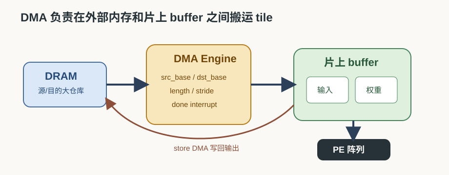
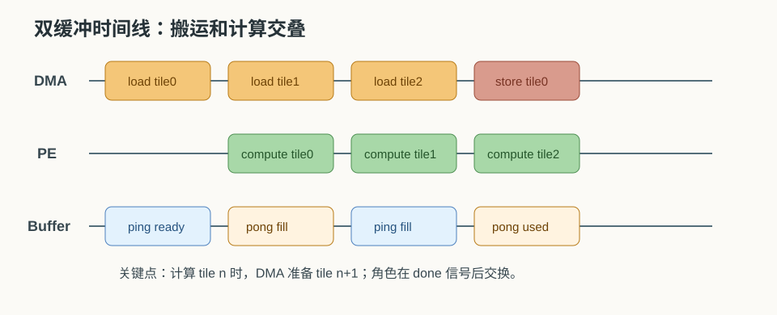
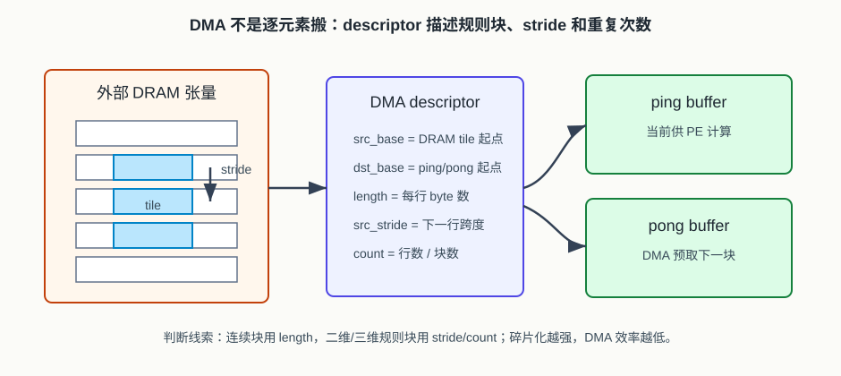

# 24 DMA 与双缓冲

> 章节等级：A  
> 状态：发布候选  
> 来源映射：`chapter_source_map.csv` 中的 24 章；本章主要承接 SRC12，参考 SRC08。

第 23 章讲了片上 SRAM 和 buffer，解决的是“当前这批数据放在哪里”。本章继续解决“这些数据怎样准时搬到 buffer 里”。DMA 负责把大块数据从外部内存搬到片上 SRAM，或把结果从片上 SRAM 写回外部内存；双缓冲负责让“搬下一批”和“算当前批”尽量同时发生。没有这两件事，NPU 很容易变成 PE 阵列算一会儿、等数据一会儿、再算一会儿的断续机器。

## 本章知识全景图

| 核心问题 | 本章给出的回答 |
| --- | --- |
| DMA 是什么？ | Direct Memory Access，直接内存访问；它按配置搬运连续或规则分块数据，不让 PE 或 CPU 逐元素搬。 |
| 双缓冲是什么？ | 准备 A/B 两套 buffer，计算用一套时，DMA 为另一套搬下一批数据。 |
| 为什么重要？ | 它把搬运时间藏到计算时间里，减少 PE 阵列等待。 |
| 什么时候效果不好？ | 当搬运时间明显大于计算时间、访问不连续、buffer 不够或同步控制错误时。 |



## 为什么学

NPU 的计算阵列不会自己把外部内存里的张量逐个拿到 PE 旁边。真实执行要先把 tile 从 DRAM 搬到片上 buffer，再让 PE 阵列按节拍读取；输出完成后还要写回。DMA 和双缓冲就是把这条搬运链变成可调度流水线的关键机制。

本章要建立一个判断式：双缓冲不是让搬运消失，而是把可重叠的搬运时间藏进计算时间里。如果 `load + store` 的可重叠部分大于 `compute`，PE 仍会等；如果 stride 碎片化或 descriptor 配错，DMA 仍会慢；如果 ping/pong 所有权切换错误，结果会直接错。

## 1. 学习目标

读完本章，你应该能够：

- 解释 DMA 为什么比“让计算单元自己逐个搬数”更适合 NPU。
- 区分 load DMA、store DMA、计算阶段三类动作。
- 用时间线说明单缓冲为什么会让计算等待。
- 手算双缓冲在多个 tile 上能节省多少等待时间。
- 说明 ping-pong buffer 的状态切换：一边计算，一边搬下一块。
- 说出双缓冲需要哪些同步条件，避免覆盖还没用完的数据。

## 2. 先修提醒

本章需要你先理解：

- 第 18 章的带宽瓶颈：数据供给慢会拖住 MAC。
- 第 23 章的片上 SRAM：DMA 的目标通常就是这些 input/weight/output buffer。
- 第 19 章的 loop-to-hardware mapping：tile 边界决定每次 DMA 搬哪一块。

本章不深入讲总线协议和 SoC 仲裁。你先把 DMA 看成一个专门搬货的硬件工人：给它源地址、目的地址、长度、步长和启动信号，它就按规则搬运；搬完后报告完成。

## 3. 生活化引入

继续用厨房类比。厨师在台面上做当前这批菜，帮厨负责从仓库搬下一批食材。如果只有一个台面，帮厨必须等厨师把当前食材全部用完、清空台面后，才能搬下一批。厨师在这段时间只能等。

更好的办法是准备两个台面：

```text
台面 A：厨师正在做菜
台面 B：帮厨正在摆下一批食材
```

等厨师做完 A，直接切到 B；帮厨再去给 A 摆下一批。A 和 B 轮流使用，这就是双缓冲的直觉。NPU 中的 ping-pong buffer 也是这样：一个 buffer 被 PE 阵列读取计算，另一个 buffer 被 DMA 填充或写回。

## 4. 直觉解释

DMA 的核心价值是“批量、规则、异步”。批量是指一次搬一段或一个 tile；规则是指按地址、长度和 stride 自动生成访问；异步是指搬运可以和 PE 计算并行推进，而不是每个数字都由计算单元停下来搬。

单缓冲的时间线通常是：

```text
搬入 tile 0 -> 计算 tile 0 -> 写回 tile 0
搬入 tile 1 -> 计算 tile 1 -> 写回 tile 1
搬入 tile 2 -> 计算 tile 2 -> 写回 tile 2
```

计算和搬运串行，PE 在搬入时空等，DMA 在计算时也可能空等。

双缓冲把它改成：

```text
先搬入 tile 0
计算 tile 0 的同时，搬入 tile 1
计算 tile 1 的同时，搬入 tile 2，并写回 tile 0
计算 tile 2 的同时，搬入 tile 3，并写回 tile 1
```

理想情况下，每个 tile 的总时间不再是：

```text
load + compute + store
```

而接近：

```text
max(load/store 可重叠部分, compute)
```

当然，“理想”需要条件：buffer 要有两套，地址不能冲突，DMA 带宽要足够，控制器要知道什么时候可以切换。



## 5. 正式定义

**DMA（Direct Memory Access）** 是一种让专用搬运引擎直接在内存和设备/片上 buffer 之间传输数据的机制。对 NPU 来说，DMA 常用于：

- 从外部内存搬输入 tile 到 input buffer。
- 从外部内存搬权重 tile 到 weight buffer。
- 把 output buffer 或完成后的部分和写回外部内存。
- 在某些系统中，在不同片上存储区域之间搬运或重排数据。

一个简化 DMA 描述符可以包含：

```text
src_base   : 源地址
dst_base   : 目的地址
length     : 每行或每块搬多少 byte
src_stride : 源端相邻行/块的跨度
dst_stride : 目的端相邻行/块的跨度
count      : 搬多少行/块
direction  : load 或 store
```

**双缓冲（double buffering）** 指为同一类数据准备两套 buffer，常称为 ping 和 pong：

```text
ping buffer: 当前供计算使用
pong buffer: DMA 正在准备下一批
```

每轮结束后交换角色：

```text
ping <-> pong
```

双缓冲的正确性依赖三个信号：

1. DMA 已经把下一批搬完，buffer 才能交给计算。
2. 计算已经用完当前批，buffer 才能交给 DMA 覆盖。
3. store DMA 已经写回结果，output/psum buffer 才能复用。



## 6. 最小例题

假设每个 tile 有三个阶段：

```text
load   = 30 cycles
compute= 80 cycles
store  = 20 cycles
```

### 单缓冲

一个 tile 需要：

```text
30 + 80 + 20 = 130 cycles
```

如果有 4 个 tile：

```text
4 * 130 = 520 cycles
```

### 双缓冲的理想重叠

先搬入第 0 个 tile：

```text
启动开销 = 30 cycles
```

每个 tile 计算时，DMA 尝试搬下一块并写回上一块。因为：

```text
compute = 80 cycles
load + store 的重叠压力 = 30 + 20 = 50 cycles
```

搬运可以藏在计算中。4 个 tile 的近似时间：

```text
初始 load 30
+ 4 个 tile 的 compute 4*80
+ 最后 store 20
= 30 + 320 + 20
= 370 cycles
```

节省：

```text
520 - 370 = 150 cycles
```

这个例子说明双缓冲不是减少了要搬的数据，而是让搬运和计算重叠，减少等待。

## 7. 完整例题

现在看一个更接近 NPU 的 3 个 tile 时间线。假设：

```text
每个 tile 输入搬入: 120 cycles
每个 tile 权重搬入: 80 cycles
每个 tile 计算: 220 cycles
每个 tile 输出写回: 60 cycles
```

为了简单，假设输入和权重可以由同一个 DMA 顺序搬入，所以 load 总时间是：

```text
load = 120 + 80 = 200 cycles
```

### 单缓冲总时间

每个 tile：

```text
load + compute + store = 200 + 220 + 60 = 480 cycles
```

3 个 tile：

```text
3 * 480 = 1440 cycles
```

### 双缓冲时间线

先预取 tile 0：

```text
0-200: DMA load tile 0 到 ping
```

然后计算 tile 0，同时 load tile 1：

```text
200-420: PE compute tile 0 from ping
200-400: DMA load tile 1 to pong
```

tile 0 计算到 420 才结束，tile 1 已经在 400 搬好，所以没有等待。

接着计算 tile 1，同时 load tile 2，并写回 tile 0。假设 store DMA 可以和 load 共用带宽，二者顺序执行：

```text
420-640: PE compute tile 1 from pong
420-480: DMA store tile 0
480-680: DMA load tile 2 to ping
```

这里出现问题：tile 1 在 640 结束，但 tile 2 要到 680 才搬好。PE 等待：

```text
680 - 640 = 40 cycles
```

然后计算 tile 2，并写回 tile 1：

```text
680-900: PE compute tile 2 from ping
680-740: DMA store tile 1
900-960: DMA store tile 2
```

双缓冲总时间大约：

```text
预取 tile0: 200
compute tile0: 220
compute tile1: 220
等待 tile2: 40
compute tile2: 220
最后 store tile2: 60
合计 = 960 cycles
```

相对单缓冲节省：

```text
1440 - 960 = 480 cycles
```

但它没有达到完美重叠，因为 tile 1 计算期间，store tile 0 和 load tile 2 合起来需要：

```text
60 + 200 = 260 cycles
```

而计算只有：

```text
220 cycles
```

所以 PE 等了 40 cycles。这个完整例题给出一个关键判断：双缓冲能隐藏搬运，但前提是可重叠搬运工作量不超过计算时间，或者系统有更强 DMA 并行能力。

## 8. NPU 连接

在 NPU 中，DMA 和双缓冲通常围绕 tile 调度工作：

```text
1. 编译器或 runtime 选择 tile 形状。
2. 控制器配置 DMA 描述符：源地址、目的地址、长度和 stride。
3. DMA 把 tile 搬入片上 SRAM 的 ping 或 pong 区。
4. PE 阵列计算当前 buffer。
5. DMA 预取下一 buffer，同时把已完成输出写回。
6. 控制器在 DMA done 和 compute done 都满足后切换 buffer。
```

DMA 对 layout 很敏感。如果输入 tile 在外部内存中是连续的，DMA 可以大块搬运；如果每一行之间有跨度，DMA 需要 stride 描述；如果数据布局让访问非常碎，DMA 效率会下降。第 25 章会继续讲地址发生器和控制器如何产生这些地址和状态切换。

双缓冲也不是只给输入用。实际系统可能有：

- input ping-pong buffer
- weight ping-pong buffer
- output 或 psum ping-pong buffer

但每增加一类双缓冲，就要多占一份 SRAM。假设第 23 章例题中输入 buffer 需要 1600 byte，如果做输入双缓冲，就变成：

```text
1600 * 2 = 3200 byte
```

权重也双缓冲：

```text
2304 * 2 = 4608 byte
```

再加上 4096 byte 部分和，核心需求变成：

```text
3200 + 4608 + 4096 = 11904 byte
```

这解释了为什么双缓冲和 SRAM 容量必须一起设计。双缓冲能提升流水，但它不是免费魔法。

## 工程判断

什么时候用 DMA：只要数据搬运是连续、规则分块或可由 stride 描述的 tile 传输，就应优先让 DMA 批量搬，而不是让 PE、CPU 或 runtime 逐元素搬。DMA 适合处理输入 tile、权重 tile、输出 tile 和部分片上重排。

什么时候双缓冲收益明显：计算时间足够长，能覆盖下一块 load 和上一块 store；片上 SRAM 有足够 ping/pong 空间；DMA 与 PE 可以并行；descriptor 能表达连续或规则 stride。典型信号是单缓冲 profile 中 PE 在 load/store 阶段大段空闲，而 compute 阶段本身能稳定跑满。

什么时候双缓冲收益有限或危险：搬运时间远大于计算时间、DMA 和 store 共用带宽严重争用、tile 太小导致 descriptor 开销占比高、访问 stride 太碎、ping/pong 状态机没有明确 done/busy/ready。危险信号包括下一块尚未搬完就切给计算、当前块尚未算完就被 DMA 覆盖、输出尚未写回就复用 output buffer。

排查顺序是：先画时间线，比较 `load`、`compute`、`store`；再查 DMA descriptor 的源/目的/length/stride/count 是否覆盖正确 tile；然后查 ping/pong 所有权切换；最后看总线带宽和仲裁。不要只看到“用了双缓冲”就判定搬运已经被隐藏。

## 9. 常见误区

### 误区 1：DMA 会让数据搬运消失

- 错误说法：用了 DMA，就不用考虑带宽了。
- 为什么错：DMA 只是更高效地搬，数据量和可用带宽仍然存在。
- 正确理解：DMA 改善搬运方式，双缓冲隐藏等待，但不能违反带宽上限。

### 误区 2：双缓冲一定把性能翻倍

- 错误说法：A/B 两套 buffer 就能让速度直接提升 2 倍。
- 为什么错：如果搬运时间远大于计算时间，PE 仍会等待；如果计算远大于搬运，提升也有限。
- 正确理解：双缓冲收益取决于 load/store 与 compute 的时间比例。

### 误区 3：ping-pong buffer 可以随便覆盖

- 错误说法：反正有两套，DMA 想写哪套就写哪套。
- 为什么错：如果覆盖了 PE 尚未读完的数据，输出会直接错误。
- 正确理解：必须用 done/valid/busy 等状态确保所有权切换正确。

### 误区 4：DMA 只搬输入，不管输出

- 错误说法：DMA 的任务只是把输入拿进来。
- 为什么错：权重需要搬入，输出和部分和也可能需要写回或在层间搬运。
- 正确理解：load 和 store 都是 DMA 调度的一部分。

### 误区 5：访问不连续也不影响 DMA

- 错误说法：DMA 反正会搬，连续不连续无所谓。
- 为什么错：碎片访问会增加描述符、突发传输效率下降，也可能浪费总线带宽。
- 正确理解：layout、stride 和 tile 形状会直接影响 DMA 效率。

## 10. 本章自测

### 题目

1. DMA 的全称是什么？在 NPU 里主要做什么？
2. 为什么不让 PE 阵列逐元素去外部内存搬数据？
3. 什么是双缓冲？
4. ping 和 pong buffer 在同一时刻可以分别处于什么状态？
5. 单缓冲下 `load=40, compute=100, store=20`，一个 tile 多少周期？
6. 4 个 tile 单缓冲总时间是多少？
7. 如果双缓冲能完全隐藏 load/store，4 个 tile 近似多少周期？按“初始 load + 4 次 compute + 最后 store”计算。
8. 双缓冲为什么需要更多 SRAM？
9. 什么情况下双缓冲仍会让 PE 等待？
10. DMA 和下一章地址发生器/控制器有什么关系？

### 答案或评分点

1. Direct Memory Access；负责在外部内存和片上 buffer 之间成块搬运输入、权重、输出等数据。
2. 逐元素搬运会让 PE 停下来等待，无法形成高效批量传输，也浪费计算资源。
3. 准备两套 buffer，一套计算使用，另一套 DMA 预取或写回，完成后交换角色。
4. 一套可能是 compute busy，另一套可能是 DMA busy 或 ready。
5. `40+100+20=160 cycles`。
6. `4*160=640 cycles`。
7. `初始 load 40 + 4*100 + 最后 store 20 = 460 cycles`。
8. 同一类数据要准备两份空间，例如输入 ping 和输入 pong。
9. 搬运时间大于计算时间、DMA 带宽不足、访问碎片化、store 和 load 争用严重或同步错误。
10. DMA 需要地址、长度、stride 和启动/完成控制；这些由地址发生器和控制器配合产生。

## 来源

- 本地来源 SRC12：`C:\Users\11035\Desktop\ic\npu\14、NPU\《NPU内存带宽与DMA优化从入门到精通》\01.html`，行 270-308 支撑 DMA、双缓冲和计算搬运重叠；用于本章时间线和收益边界。
- 本地来源 SRC12：`C:\Users\11035\Desktop\ic\npu\14、NPU\《NPU内存带宽与DMA优化从入门到精通》\02.html`，行 383-418 给出双缓冲 DMA 伪代码；用于本章 ping/pong 状态切换和异步预取。
- 本地来源 SRC17：`C:\Users\11035\Desktop\ic\npu\14、NPU\《NPU硬件循环与数据流架构从入门到精通》\24.html`，行 386/402/421 提到 DMA 描述符队列、配置 DMA 与同步、资源管理；用于连接 DMA descriptor、控制器和 runtime。
- 外部来源 Gemmini：`Gemmini: Enabling Systematic Deep-Learning Architecture Evaluation via Full-Stack Integration`，https://arxiv.org/abs/1911.09925 ，支撑 scratchpad、DMA 和 systolic-array SoC 集成视角。
- 外部来源 TPU：Norman P. Jouppi 等，`In-Datacenter Performance Analysis of a Tensor Processing Unit`，https://arxiv.org/abs/1704.04760 ，支撑矩阵单元与 unified buffer/host-memory 搬运之间的系统边界。
- 外部来源 MLIR Linalg 官方文档：https://mlir.llvm.org/docs/Dialects/Linalg/ ，支撑 structured ops、tiling 和 loop-like data movement 的编译表示背景。
