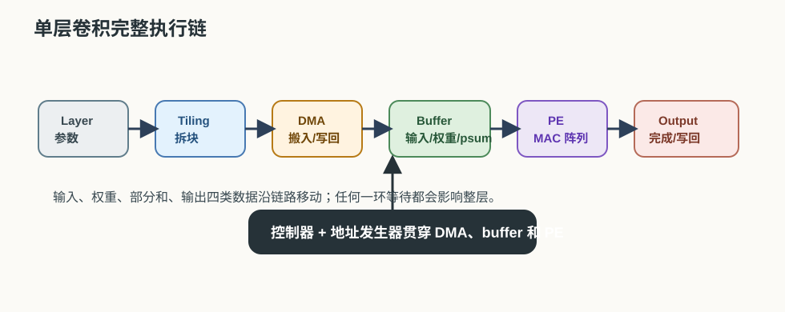
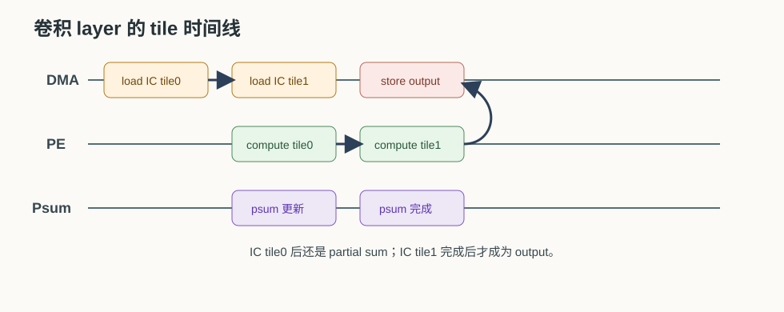
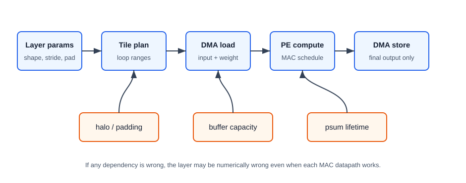

# 26 单层卷积完整执行链

> 章节等级：A  
> 状态：发布候选  
> 来源映射：`chapter_source_map.csv` 中的 26 章；本章主要承接 SRC17、SRC12、SRC01，参考 SRC15。

到这一章为止，我们已经见过卷积公式、循环、tile、数据复用、partial sum、带宽、硬件映射、片上 SRAM、DMA、双缓冲、地址发生器和控制器。本章把它们串成一条完整链路：一个单层卷积任务进入 NPU 后，如何被拆成 tile，如何搬入输入和权重，如何由 PE 阵列完成 MAC 和部分和累加，如何写回输出，并为下一层留下可用结果。

| 核心问题 | 本章给出的回答 |
| --- | --- |
| 单层卷积执行链是什么？ | 从 layer 参数到 tile 调度、DMA 搬运、buffer 读写、PE 计算、部分和完成和输出写回的全过程。 |
| 为什么要串起来看？ | 单独理解 MAC、buffer、DMA 都不够，真实执行需要它们按正确时序协作。 |
| 最重要的状态是什么？ | 数据是否已搬入、buffer 是否可用、部分和是否完成、输出是否写回。 |
| 本章目标是什么？ | 让读者能追踪一个小卷积层在 NPU 上怎么一步步跑完。 |



## 1. 学习目标

读完本章，你应该能够：

- 说出单层卷积执行至少包含哪些阶段。
- 把卷积 layer 参数转换成输出尺寸、tile 和循环范围。
- 手算一个小卷积层的完整输出。
- 解释输入、权重、部分和、输出在执行链中的移动路径。
- 用时间线描述 DMA、buffer 和 PE 阵列如何协同。
- 找出执行链中可能发生等待、覆盖、地址错误或部分和错误的位置。

## 2. 先修提醒

本章是卷三前半段的收束章，需要你已经理解：

- 卷积输出尺寸、输入通道、输出通道和卷积核。
- 循环如何展开卷积，并映射到硬件。
- partial sum 为什么需要保存和继续累加。
- SRAM buffer、DMA、双缓冲、地址发生器和控制器的基本职责。

本章不会引入新的大概念，而是把已有概念按执行顺序排起来。阅读时建议你一直追问四个对象在哪里：输入在哪里、权重在哪里、部分和在哪里、输出在哪里。

## 3. 生活化引入

想象工厂接到一张订单：给 1000 个零件喷漆。订单不是直接变成完成品，它会经过一条生产链：

```text
读订单 -> 拆批次 -> 领材料 -> 送到工位 -> 加工 -> 质检 -> 入库
```

每一步都可能出问题。材料没到，工位会等；批次拆太大，台面放不下；批次拆太小，搬运次数太多；质检没完成就入库，会把坏件混进去。

单层卷积在 NPU 上也一样：

```text
读 layer 描述 -> 选 tile -> DMA 搬数据 -> buffer 供数 -> PE 计算 -> psum 完成 -> 输出写回
```

这条链路不是为了让概念变复杂，而是为了让你能看见真实 NPU 为什么需要很多“非计算”部件。

## 4. 直觉解释

一个卷积层可以看成一张任务单：

```text
输入张量 shape
权重张量 shape
stride/padding
输出 shape
数据类型
layout
```

NPU 不会一次把整层所有数据都塞进 PE 阵列。它通常会按 tile 执行：

```text
选择一块输出空间
选择一批输出通道
选择一批输入通道
搬入对应输入和权重
计算并更新部分和
完成后写回输出
```

执行链中最重要的是依赖关系：

- 输入和权重没搬好，PE 不能开始。
- 部分和没完成，不能当成最终输出写回。
- output buffer 没写回或没被下游接收，不能随便覆盖。
- 下一 tile 的 DMA 预取不能覆盖当前 tile 正在使用的 ping/pong buffer。

所以单层卷积不是“调用一个卷积函数”这么简单。它是很多硬件部件按状态和地址规则协作完成的一段流水。





## 5. 正式定义

本书中，**单层卷积完整执行链** 指一个卷积层在 NPU 上从任务配置到结果可用的端到端过程，至少包括：

1. **解析 layer 参数**：输入 shape、权重 shape、stride、padding、layout、数据类型。
2. **计算输出 shape**：确定 `OH/OW/OC`。
3. **选择 tile 和 mapping**：决定 `OH_tile/OW_tile/OC_tile/IC_tile` 以及空间/时间映射。
4. **配置 DMA 和 buffer**：确定 input/weight/output/psum 的搬运范围和片上位置。
5. **生成地址和控制状态**：地址发生器输出读写地址，控制器推进状态机。
6. **PE 阵列计算**：执行 MAC，更新 partial sum。
7. **完成与写回**：部分和变成最终输出，写回外部内存或传给下一层。

一个简化卷积公式仍然是：

```text
out[oc][oh][ow]
  = bias[oc]
  + sum over ic,r,s input[ic][oh+r][ow+s] * weight[oc][ic][r][s]
```

执行链的任务，就是把这个公式变成有时序的硬件动作：

```text
load input/weight -> read buffer -> MAC -> update psum -> write output
```

判断执行链是否正确，至少要看：

- 数学结果是否正确。
- 地址是否对应正确输入和权重。
- 部分和是否跨所有归约维度完成。
- buffer 是否没有被提前覆盖。
- DMA 和 compute 是否按预期重叠或等待。

## 6. 最小例题

先看一个单通道 2x2 卷积，只计算一个输出。输入窗口：

```text
1 2
3 4
```

权重：

```text
1 0
2 1
```

执行链最小化如下：

```text
1. DMA 搬入 4 个输入和 4 个权重。
2. input buffer 保存 [1,2,3,4]。
3. weight buffer 保存 [1,0,2,1]。
4. PE 初始化 psum=0。
5. 执行 4 次 MAC。
6. 输出写回。
```

手算：

```text
psum0 = 0
psum1 = 0 + 1*1 = 1
psum2 = 1 + 2*0 = 1
psum3 = 1 + 3*2 = 7
psum4 = 7 + 4*1 = 11
out = 11
```

这里每一步都能对应硬件动作：DMA 搬数，buffer 存数，地址发生器给出下一对输入/权重地址，PE 做 MAC，部分和累加器保存 psum，最后 output buffer 等待写回。

## 7. 完整例题

现在手算一个完整小卷积层。假设：

```text
输入: 1 个通道，3x3
权重: 1 个输出通道，2x2
stride=1, padding=0
bias=0
```

输入：

```text
1 2 0
3 1 2
0 1 4
```

权重：

```text
1 0
2 1
```

输出尺寸：

```text
OH = 3 - 2 + 1 = 2
OW = 3 - 2 + 1 = 2
```

所以要得到 2x2 输出：

```text
out[0][0]  out[0][1]
out[1][0]  out[1][1]
```

### 输出 out[0][0]

窗口：

```text
1 2
3 1
```

计算：

```text
1*1 + 2*0 + 3*2 + 1*1
= 1 + 0 + 6 + 1
= 8
```

### 输出 out[0][1]

窗口：

```text
2 0
1 2
```

计算：

```text
2*1 + 0*0 + 1*2 + 2*1
= 2 + 0 + 2 + 2
= 6
```

### 输出 out[1][0]

窗口：

```text
3 1
0 1
```

计算：

```text
3*1 + 1*0 + 0*2 + 1*1
= 3 + 0 + 0 + 1
= 4
```

### 输出 out[1][1]

窗口：

```text
1 2
1 4
```

计算：

```text
1*1 + 2*0 + 1*2 + 4*1
= 1 + 0 + 2 + 4
= 7
```

最终输出：

```text
8 6
4 7
```

现在把它落到 NPU 执行链。因为这个例子很小，可以把整个 layer 当成一个 tile：

```text
输入 tile: 1*3*3 = 9 个 int8
权重 tile: 1*1*2*2 = 4 个 int8
输出 tile: 1*2*2 = 4 个 int32 或输出格式元素
```

执行步骤：

```text
1. 控制器进入 LOAD。
2. DMA 把 9 个输入搬到 input buffer，把 4 个权重搬到 weight buffer。
3. 控制器等待 dma_done，然后进入 COMPUTE。
4. 地址发生器按 oh/ow/r/s 产生输入窗口地址和权重地址。
5. 2x2 PE 阵列可以让 4 个 PE 分别负责 4 个输出位置。
6. 每个 PE 执行 4 次 MAC，并保存自己的 psum。
7. 4 个 psum 完成后变成输出 8、6、4、7。
8. 控制器进入 STORE。
9. DMA 把 output buffer 写回外部内存，或交给下一层输入 buffer。
```

如果 PE 阵列只有 1 个 PE，也能得到同样结果，只是按 4 个输出位置顺序计算。区别是执行时间和数据供给压力，不是数学结果。

## 8. NPU 连接

真实 NPU 单层卷积会比上面例子大得多，但结构相同。一个更完整的 tile 循环可能是：

```text
for oc_tile:
  for oh_tile:
    for ow_tile:
      初始化 output/psum tile
      for ic_tile:
        DMA load input tile
        DMA load weight tile
        PE compute and accumulate psum
      DMA store output tile
```

这里有几个关键点：

- `ic_tile` 循环内部得到的是部分和，不一定是最终输出。
- 只有所有输入通道 tile 都累加完，psum 才能作为 output 写回。
- input/weight DMA 可以用双缓冲提前准备下一批。
- output 或 psum buffer 必须保证没有被下一 tile 提前覆盖。
- 地址发生器必须同时支持外部地址和片上 buffer 地址。

性能分析也要沿执行链看，而不是只看 MAC：

| 环节 | 可能瓶颈 |
| --- | --- |
| DMA load | 外部带宽不足、layout 不连续、tile 太碎 |
| SRAM buffer | 容量不够、bank 冲突、端口不足 |
| PE compute | 并行度不足、部分和归约复杂、数据未到 |
| DMA store | 输出写回阻塞、部分和溢出写回 |
| 控制状态 | ping-pong 切换错误、done 信号等待过长 |

第 26 章的价值在于把“一个层”看成系统，而不是只看一个公式。真实芯片的效率往往取决于整个执行链最慢的一环。

## 工程判断

单层卷积能否“跑完整”，不看单个公式，而看每类数据在什么时刻位于什么存储层。输入 tile 和权重 tile 必须在 PE 读之前进入片上 buffer；psum 必须在所有 `ic/kh/kw` 贡献完成前保持可读写；输出只能在归约完成后写回。若某个设计只描述 MAC 计算而没有说明 input/weight/psum/output 的生命周期，它还不是完整执行链。

什么时候使用更大的空间并行：输出空间、输出通道或 batch 足够大，buffer 和 DMA 能连续供数，且写回不会阻塞 psum 完成。什么时候不要扩大阵列：tile 太小、stride/padding 造成访存破碎、输入通道太少、DMA load/store 占主导，或者算子在第 27 章的支持边界外被切图。此时增 PE 只会提高峰值，不会提高真实吞吐。

调试单层错误要固定一条最短链路：先用 1 个输入通道、1 个输出通道、2x2 输出手算；再打开多输入通道，观察 psum 是否在每个 `ic_tile` 后累加而不是覆盖；然后打开多输出通道，观察权重和输出地址是否分离；最后再开双缓冲和 DMA overlap。若先开大模型 benchmark，只能看到错了，无法定位是地址、psum、buffer ownership 还是 PE 数据路径。

## 9. 常见误区

### 误区 1：卷积执行就是 PE 做 MAC

- 错误说法：只要 PE 能做乘加，卷积层就能高效跑完。
- 为什么错：数据搬入、地址生成、buffer 管理、部分和保存和输出写回都会限制执行。
- 正确理解：MAC 是核心动作，但单层执行链包括搬运、存储、控制和写回。

### 误区 2：tile 之间互不相关

- 错误说法：每个 tile 算完就结束，和别的 tile 无关。
- 为什么错：输入通道 tile 之间可能共享同一个输出 partial sum；空间 tile 之间可能共享输入 halo。
- 正确理解：tile 是执行单位，但数学依赖和数据复用可能跨 tile 存在。

### 误区 3：输出 buffer 里有数就能立刻写回

- 错误说法：PE 算出一个中间值就可以当输出写回。
- 为什么错：如果归约维度还没完成，这个值只是 partial sum。
- 正确理解：必须确认所有 `ic/r/s` 或所有相关 tile 已完成，psum 才是最终输出。

### 误区 4：双缓冲只要开了就不会等待

- 错误说法：有 ping-pong buffer，PE 一定连续工作。
- 为什么错：搬运时间可能超过计算时间，或者 store/load 争用 DMA，仍会等待。
- 正确理解：双缓冲减少等待，但需要带宽、tile 和调度配合。

### 误区 5：地址错误只是性能问题

- 错误说法：地址发生器配置错了最多慢一点。
- 为什么错：地址错会读错输入、权重或写错输出，直接改变数学结果。
- 正确理解：地址和控制是正确性基础，不只是优化细节。

## 10. 本章自测

### 题目

1. 单层卷积完整执行链至少包含哪些阶段？
2. 为什么 layer 参数解析是执行链的一部分？
3. 本章完整例题的输出尺寸是多少？
4. 本章完整例题中 `out[0][0]` 等于多少？
5. 为什么 `ic_tile` 循环中间得到的是部分和？
6. DMA、buffer、PE、地址发生器、控制器分别承担什么角色？
7. 如果 output buffer 被提前覆盖，会发生什么？
8. 为什么同一层卷积可以用 1 个 PE 顺序算，也可以用 2x2 PE 阵列并行算？
9. 执行链中哪些环节可能造成 PE 等待？
10. 如果要调试一层卷积输出错误，应该沿哪些对象追踪？

### 答案或评分点

1. 参数解析、输出 shape 计算、tile/mapping、DMA 搬运、buffer 读写、地址生成、PE 计算、部分和完成、输出写回。
2. 因为 shape、stride、padding、layout 和数据类型决定循环范围、地址规则和 buffer 需求。
3. `OH=2, OW=2`。
4. `1*1 + 2*0 + 3*2 + 1*1 = 8`。
5. 因为一个输出可能需要多个输入通道 tile 的贡献全部累加完才完成。
6. DMA 搬数据，buffer 暂存数据，PE 做 MAC，地址发生器生成读写地址，控制器管理状态和握手。
7. 可能丢失尚未写回或尚未完成的输出/部分和，导致结果错误。
8. 数学依赖不变，只是空间/时间映射不同；并行阵列更快但供数压力更高。
9. DMA 未完成、SRAM 端口不足、bank 冲突、地址生成/控制等待、部分和写回阻塞等。
10. 追踪输入、权重、部分和、输出四类数据的位置、地址、生命周期和完成条件。

## 来源

- 本地来源 SRC01：`C:\Users\11035\Desktop\ic\npu\14、NPU\《NPU Andes NPU IP核设计从入门到精通》\02.html`，行 331-344 描述数据预取、SRAM 读取、计算阵列执行和写回；支撑本章完整 layer 执行链。
- 本地来源 SRC12：`C:\Users\11035\Desktop\ic\npu\14、NPU\《NPU内存带宽与DMA优化从入门到精通》\01.html`，行 270-295 描述 DMA 搬运与计算重叠；支撑 tile 时间线和双缓冲解释。
- 本地来源 SRC17：`C:\Users\11035\Desktop\ic\npu\14、NPU\《NPU硬件循环与数据流架构从入门到精通》\01.html`，行 385-393 展示卷积循环如何被硬件展开到 PE；支撑从循环到执行链的映射。
- 外部来源 ONNX Conv：`https://onnx.ai/onnx/operators/onnx__Conv.html`，支撑卷积算子的输入、输出、stride、padding、dilation 等语义边界。
- 外部来源 Eyeriss：`https://arxiv.org/abs/1604.07316`，支撑 CNN 加速器中的 dataflow、片上存储和数据复用语境。
- 外部来源 Google TPU：`https://arxiv.org/abs/1704.04760`，支撑矩阵单元、片上 buffer 和系统级推理执行链。
