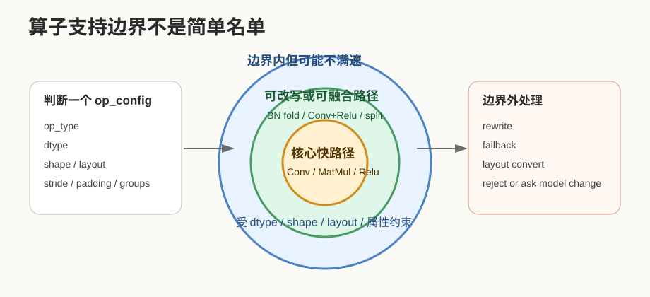
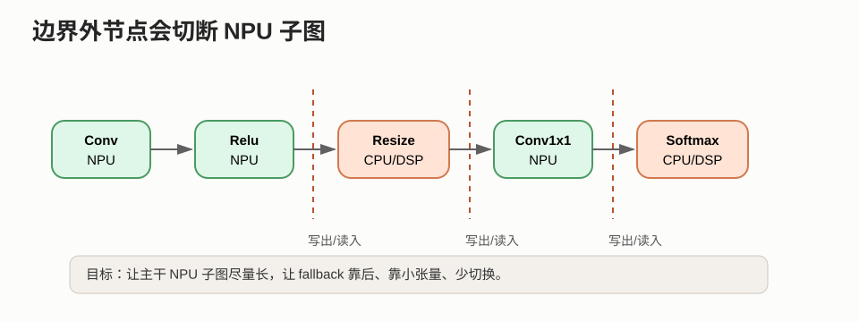
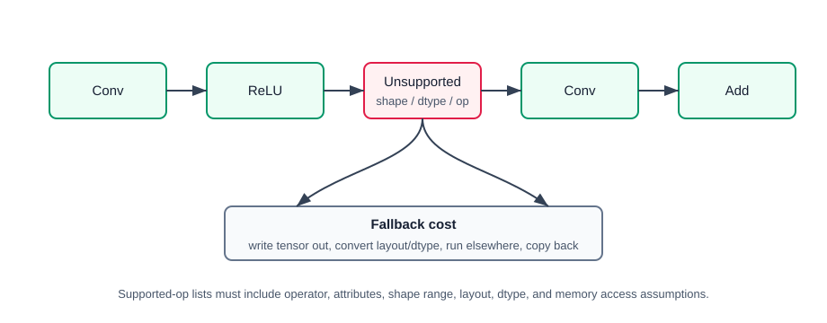

# 27 算子支持边界

> 章节等级：B  
> 状态：发布候选  
> 来源映射：`chapter_source_map.csv` 中的 27 章；本章主要承接 SRC16、SRC18，参考 SRC05。

本章解决一个工程里非常常见、但零基础读者容易忽略的问题：一个 NPU 并不是“什么神经网络算子都能高速执行”。它通常只对一部分算子、数据类型、形状、layout 和属性组合提供高效硬件路径；超出这条边界的部分，可能要被编译器改写、融合、拆分，甚至退回 CPU、DSP 或通用加速单元执行。理解算子支持边界，能帮助你看懂为什么同一个模型在不同 NPU 上性能差异很大。

| 核心问题 | 本章给出的回答 |
| --- | --- |
| 算子支持边界是什么？ | NPU 能直接或高效执行的算子集合，以及每个算子的形状、数据类型、layout、属性限制。 |
| 为什么不是支持算子名就够？ | `Conv` 这个名字背后还有 kernel、stride、padding、dilation、group、dtype、layout 等条件。 |
| 超出边界会怎样？ | 可能被改写成其他算子、拆成多个 kernel、走低效路径，或 fallback 到其他处理器。 |
| 和后续编译器有什么关系？ | 编译器要把模型图切成 NPU 子图和非 NPU 子图，并在边界处插入数据搬运和格式转换。 |

学习本章时要把“支持”拆成两层：第一层是数学上能不能表达，第二层是硬件上能不能高效执行。NPU 真正关心的是第二层。



## 1. 学习目标

读完本章，你应该能够：

- 用一句话解释算子支持边界。
- 区分“算子名支持”和“具体参数组合支持”。
- 判断一个小模型图中哪些节点适合放到 NPU，哪些节点可能 fallback。
- 说明 dtype、shape、layout 和属性为什么会改变支持结果。
- 手算一次 fallback 边界带来的数据搬运和延迟影响。
- 解释算子支持边界如何影响后续编译器映射、算子融合和性能评测。

## 2. 先修提醒

本章需要你已经理解：

- 卷积、激活、池化、全连接、GEMM 等常见算子的基本作用。
- tile、buffer、DMA、部分和、带宽瓶颈会影响真实执行速度。
- 一个模型可以看成由多个算子节点组成的计算图。

本章会提到编译器、runtime、fallback。它们的系统级细节会留到第 30-32 章。本章只先建立直觉：NPU 硬件提供一组能力，编译器负责把模型尽量放进这组能力里。

## 3. 生活化引入

想象一家餐厅说“我们支持面食”。这句话听起来范围很大，但真正下单时会发现还有很多条件：

- 支持牛肉面，但不支持手擀宽面。
- 支持小碗和大碗，但不支持超大盆。
- 支持清汤和红烧，但不支持麻辣加十种配菜。
- 支持堂食，但外卖会换包装，速度也不同。

NPU 的“支持卷积”也类似。它可能支持 3x3、1x1、stride 1 或 2、int8 输入、固定几种 layout；但不一定支持很大的 dilation、不规则 padding、特殊 group、某些浮点格式或动态 shape。对硬件来说，这些条件不是小字备注，而是决定地址发生器、buffer 容量、PE 阵列利用率和数据通路能否匹配的硬约束。

因此，问“NPU 支不支持这个模型”时，不能只看模型里有没有 `Conv`、`Relu`、`MatMul` 这些名字，还要看每个节点的具体属性。

## 4. 直觉解释

算子支持边界可以想成三层圈：

1. **核心快路径**：硬件最擅长的算子和参数组合，例如常见 int8 卷积、深度可分离卷积、矩阵乘、逐元素激活。
2. **可改写路径**：原算子不是硬件直接支持，但能被编译器改写成支持的组合，例如 `BatchNorm` 在推理阶段折叠进卷积权重和 bias。
3. **边界外路径**：无法高效映射到 NPU，需要 CPU/DSP 执行，或需要大量数据格式转换和中间张量搬运。





一个算子是否在边界内，通常要同时满足几类条件：

| 条件 | 例子 | 为什么影响 NPU |
| --- | --- | --- |
| 算子类型 | Conv、DepthwiseConv、MatMul、Add、Relu | 决定有没有对应硬件数据通路或微码 |
| 数据类型 | int8、int16、fp16、int32 accumulator | 决定位宽、乘法器、累加器和带宽 |
| 张量形状 | 通道数、空间尺寸、batch | 决定 tile 能否放进片上，以及阵列是否容易吃满 |
| 算子属性 | stride、padding、dilation、groups | 决定地址发生器和窗口访问模式是否支持 |
| layout | NCHW、NHWC、厂商内部 blocked layout | 决定 DMA 和 PE 读数是否连续 |
| 动态性 | 静态 shape 或动态 shape | 决定编译期能不能生成固定调度 |

所以，“支持边界”不是一张简单算子名单，而是一组带条件的规则。

## 5. 正式定义

在本书中，**算子支持边界** 指某个 NPU 硬件、编译器和 runtime 共同能够直接或高效执行的算子配置集合。一个算子配置可以写成：

```text
op_config = (op_type, dtype, shape, layout, attributes, quantization, memory_policy)
```

如果 `op_config` 满足目标 NPU 的规则，就可以进入 NPU 子图；如果不满足，就需要以下处理之一：

- **rewrite**：把算子改写成等价或近似等价的支持组合。
- **fusion**：把多个算子合并到一个支持的硬件 kernel 中。
- **split**：把一个大算子拆成多个 NPU 可执行的小块。
- **fallback**：把该节点或子图交给 CPU、DSP、GPU 或其他执行后端。
- **reject**：模型部署阶段直接报错，需要用户改模型或改参数。

这里有三个边界要分清：

1. **数学边界**：算子能否用基本数学操作表达。大多数算子都能表达。
2. **编译边界**：编译器能否把它合法改写、切图、调度。
3. **硬件快路径边界**：硬件能否以高利用率、低搬运成本执行。

工程里最重要的是第三个边界。一个算子即使数学上可表达，如果需要频繁 layout 转换、反复写回外部内存，或者只能用标量慢路径执行，也不能算真正高效支持。

## 6. 最小例题

假设某个入门级 NPU 的支持表很简单：

```text
支持：
1. Conv2D, int8 输入和权重, kernel=1x1 或 3x3, stride=1 或 2
2. Relu, int8
3. Add, int8, 两个输入 shape 相同
4. AveragePool, kernel=2x2, stride=2

不支持：
1. Softmax
2. 动态 reshape
3. dilation > 1 的卷积
```

现在模型片段是：

```text
Input -> Conv3x3(stride=1,int8) -> Relu -> Softmax
```

逐节点判断：

| 节点 | 是否在 NPU 边界内 | 原因 |
| --- | --- | --- |
| Conv3x3 stride=1 int8 | 是 | 符合 Conv2D 条件 |
| Relu int8 | 是 | 支持逐元素 Relu |
| Softmax | 否 | 支持表明确不支持 |

因此图会被切成：

```text
NPU 子图：Input -> Conv -> Relu
CPU/DSP 子图：Softmax
```

这说明一个模型“前半段在 NPU 上跑”不等于“整个模型都在 NPU 上跑”。边界外节点会带来额外调度和数据搬运。

## 7. 完整例题

现在手算一次边界切分带来的影响。假设一个小模型有 5 个节点：

```text
N1: Conv3x3, int8, 输出 16x16x16
N2: Relu, int8, 输出 16x16x16
N3: ResizeNearest, int8, 输出 32x32x16
N4: Conv1x1, int8, 输出 32x32x32
N5: Softmax, int8 输入，输出 1x1x32
```

目标 NPU 支持：

```text
Conv1x1 / Conv3x3 int8
Relu int8
不支持 ResizeNearest
不支持 Softmax
```

### 第一步：逐节点标记

| 节点 | 标记 | 说明 |
| --- | --- | --- |
| N1 Conv3x3 | NPU | 核大小和 dtype 都支持 |
| N2 Relu | NPU | 可支持，甚至可能与 N1 融合 |
| N3 ResizeNearest | 非 NPU | 支持表不包含 |
| N4 Conv1x1 | NPU | 支持 |
| N5 Softmax | 非 NPU | 支持表不包含 |

### 第二步：切成子图

```text
子图 A: N1 -> N2        在 NPU
子图 B: N3             在 CPU/DSP
子图 C: N4             在 NPU
子图 D: N5             在 CPU/DSP
```

模型会发生两次明显的后端切换：

```text
NPU -> CPU/DSP -> NPU -> CPU/DSP
```

### 第三步：手算中间张量搬运量

假设 int8 每个元素 1 byte，后端切换时需要把张量写到共享内存并由另一个后端读出。

N2 输出大小：

```text
16 * 16 * 16 = 4096 elements = 4096 byte
```

从 NPU 切到 CPU/DSP 执行 N3，至少涉及：

```text
NPU 写出 N2 输出：4096 byte
CPU/DSP 读入 N2 输出：4096 byte
合计：8192 byte
```

N3 输出大小：

```text
32 * 32 * 16 = 16384 elements = 16384 byte
```

从 CPU/DSP 切回 NPU 执行 N4：

```text
CPU/DSP 写出 N3 输出：16384 byte
NPU 读入 N3 输出：16384 byte
合计：32768 byte
```

N4 输出大小：

```text
32 * 32 * 32 = 32768 elements = 32768 byte
```

从 NPU 切到 CPU/DSP 执行 N5：

```text
NPU 写出 N4 输出：32768 byte
CPU/DSP 读入 N4 输出：32768 byte
合计：65536 byte
```

边界切换引入的粗略搬运量：

```text
8192 + 32768 + 65536 = 106496 byte
```

这还没有计算 layout 转换、cache flush、同步等待和 runtime 调度开销。这个例子说明：一个不支持的 `Resize` 或 `Softmax` 节点，可能不只是自己慢，还会打断前后 NPU 子图，让中间张量反复离开 NPU 友好的路径。

### 第四步：尝试优化

可能的优化方向：

- 如果模型允许，把 `ResizeNearest` 移到 NPU 支持的预处理或替换为可支持的上采样模式。
- 如果 `Softmax` 只用于分类后处理，考虑是否能放到最后 CPU 端，避免中间切回。
- 如果 `Conv+Relu` 支持融合，让 N1 和 N2 合并，减少一次中间写读。
- 如果 NPU 支持某种内部 layout，尽量让 NPU 子图连续变长，减少 layout 来回转换。

优化的目标不是“所有节点都必须在 NPU”，而是让高计算量、高带宽压力的主干尽量连续留在 NPU 内。

## 8. NPU 连接

算子支持边界和前面几章的硬件概念是连在一起的：

- **PE 阵列**决定哪些计算模式容易高并行执行。卷积、矩阵乘、逐元素算子比较常见；复杂控制流或不规则访存通常难。
- **buffer 容量**决定某些 shape 是否能一次有效 tile。通道数、空间尺寸过大或过碎，都可能降低利用率。
- **DMA 和 layout**决定数据能否连续搬运。即使算子数学上支持，如果 layout 转换太频繁，也会破坏性能。
- **量化支持**决定 dtype 边界。int8 快路径、int16 累加、fp16 支持与否，会改变可部署模型。
- **编译器切图**决定边界外节点如何处理。第 30 章会继续讲模型如何被变成硬件任务。

在真实工程中，厂商文档常会给出 supported operators 列表，但读列表时要带着以下问题：

| 检查项 | 应该追问 |
| --- | --- |
| 算子名 | 是所有属性都支持，还是只支持子集？ |
| dtype | int8、int16、fp16、bf16 支持到哪一步？ |
| shape | 是否要求静态 shape？通道数是否要对齐？ |
| layout | 输入输出 layout 是否会触发转换？ |
| fusion | Conv+BN+Relu 是否能合并？Add+Relu 是否能合并？ |
| fallback | 不支持节点是报错、CPU 执行，还是自动改写？ |

这就是为什么性能评测不能只看“模型包含多少个 NPU 支持算子”。更重要的是：NPU 子图是否足够长、边界切换是否少、主计算是否在快路径上、数据是否避免来回搬。

## 工程判断

判断一个算子是否“被 NPU 支持”，至少要同时问六件事：op type 是否支持，属性是否支持，shape 范围是否支持，layout 是否支持，dtype/量化参数是否支持，访存模式是否支持。只写“支持 Conv”没有工程意义；`Conv(stride=1,pad=same,int8,NHWC)` 和 `Conv(dilation=2,group=C,per-channel scale,NCHW)` 对硬件和编译器可能是完全不同的任务。

什么时候接受 fallback：fallback 子图很小，输出张量也小，切换开销低于在 NPU 上硬凑支持的代价；或者该算子只在启动/收尾阶段出现，不影响主干吞吐。什么时候不要接受 fallback：算子位于主干循环内，前后张量大，或者会打断 Conv/BN/ReLU/Quantize 这类连续高效路径。此时一次 fallback 不只是一个算子慢，而是让中间张量离开 NPU 高效路径。

编译器 pattern matching 的失败信号通常不是“模型不能运行”，而是运行计划变碎：NPU 子图数量增加、CPU 子图变多、layout conversion 节点插入、临时 tensor 写回增加、profiling 中 NPU 利用率低而 CPU/DRAM 时间升高。排查顺序是先看模型图切分，再看 unsupported-op log，再看 dtype/shape/layout 约束，最后才考虑手工改模型或补后端 lowering。

## 9. 常见误区

### 误区 1：支持 Conv 就等于支持所有卷积

- 错误说法：文档写了支持 Conv，所以任何卷积都能跑。
- 为什么错：卷积还包含 kernel、stride、padding、dilation、group、dtype、layout 等条件。
- 正确理解：要判断完整 `op_config`，而不是只看 `op_type`。

### 误区 2：不支持的算子只影响它自己

- 错误说法：一个 Softmax 不支持，只是 Softmax 慢一点。
- 为什么错：它可能把图切断，引入中间张量写回、读入、同步和 layout 转换。
- 正确理解：边界外节点会影响整段子图的连续性和搬运成本。

### 误区 3：CPU fallback 一定可以忽略

- 错误说法：CPU 只处理几个小算子，没关系。
- 为什么错：如果 fallback 位于模型中间，输入输出张量可能很大，搬运和同步成本会超过算子本身。
- 正确理解：越靠近中间大特征图的 fallback，越需要警惕。

### 误区 4：编译器一定能自动解决所有不支持问题

- 错误说法：只要有编译器，模型怎么写都能适配 NPU。
- 为什么错：有些改写会改变数值、增加额外算子，或超出硬件内存和 dtype 限制。
- 正确理解：编译器能扩大可用范围，但不能消除硬件边界。

### 误区 5：支持列表越长，NPU 一定越好

- 错误说法：谁的 supported ops 多，谁的 NPU 就强。
- 为什么错：很多算子可能只是低效路径支持；主干算子的吞吐、带宽、融合和量化质量更关键。
- 正确理解：要看高频主干是否快、子图是否连续、边界切换是否少。

## 10. 本章自测

### 题目

1. 什么是算子支持边界？
2. 为什么不能只看算子名判断 NPU 是否支持？
3. 写出三个会影响 Conv 支持结果的属性。
4. fallback 是什么？
5. 为什么中间层 fallback 比最后后处理 fallback 更危险？
6. `Conv+Relu` 融合有什么好处？
7. 一个 int8 张量大小为 `32*32*16`，一次后端切换如果要写出再读入，至少搬多少 byte？
8. 动态 shape 为什么可能影响编译？
9. 支持边界和 layout 有什么关系？
10. 如果一个模型被切成很多小 NPU 子图，性能可能出现什么问题？

### 答案或评分点

1. NPU 硬件、编译器和 runtime 能直接或高效执行的算子配置集合。
2. 因为同一个算子名还有 dtype、shape、layout、stride、padding、dilation、group 等条件。
3. 示例：kernel size、stride、padding、dilation、groups、dtype、layout、通道对齐。
4. 不支持的节点或子图交给 CPU、DSP、GPU 或其他后端执行。
5. 中间层张量通常大，切换会产生大量数据搬运和同步；最后后处理张量可能较小。
6. 减少中间张量写读，延长 NPU 子图，可能使用硬件快路径。
7. 元素数 `32*32*16=16384`，int8 为 16384 byte；写出再读入至少 32768 byte。
8. 编译器无法在编译期固定 tile、buffer 分配和地址生成，可能只能走保守路径。
9. layout 不匹配会触发转换；支持边界常包含允许的输入输出 layout 和内部 blocked layout。
10. 后端切换、同步、layout 转换和中间张量搬运增多，NPU 利用率下降。

## 来源

- 本地来源 SRC16：`C:\Users\11035\Desktop\ic\npu\14、NPU\《NPU模型量化与算子融合优化从入门到精通》\01.html`，行 297-298、388-393 讨论精度/速度权衡、算子支持差异和融合减少中间写回；支撑 supported ops 与融合边界。
- 本地来源 SRC18：`C:\Users\11035\Desktop\ic\npu\14、NPU\《NPU神经网络编译器TVM NPU后端从入门到精通》\01.html`，行 287-309 讨论编译器理解硬件特性、算子融合和 NPU 后端支持挑战；支撑 pattern matching/lowering 视角。
- 本地来源 SRC05：`C:\Users\11035\Desktop\ic\npu\14、NPU\《NPU Intel OpenVINO NPU插件从入门到精通》\01.html`，行 286-400 讨论 OpenVINO Runtime、模型转换、NPU 插件和优化建议；支撑真实软件栈边界。
- 外部来源 ONNX operators：`https://onnx.ai/onnx/operators/`，支撑算子由 op type、attributes、inputs、outputs 共同定义，而不是只有名字。
- 外部来源 TVM Relax transform：`https://tvm.apache.org/docs/reference/api/python/relax/transform.html`，支撑图级/张量级变换、模式处理和后端 lowering 的工程背景。
- 外部来源 MLIR Linalg：`https://mlir.llvm.org/docs/Dialects/Linalg/`，支撑结构化 op、indexing maps 和编译器模式匹配/转换的解释。
