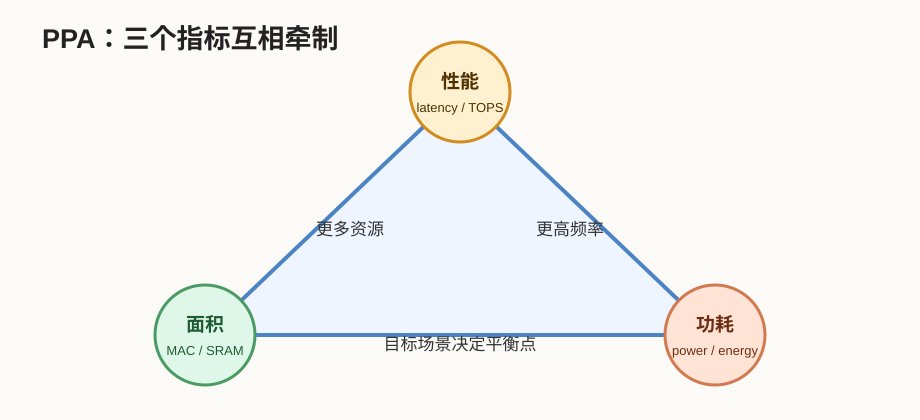
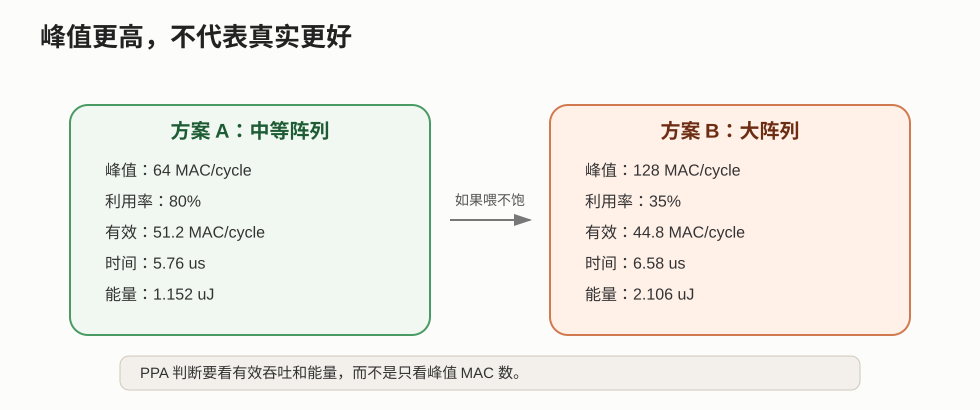
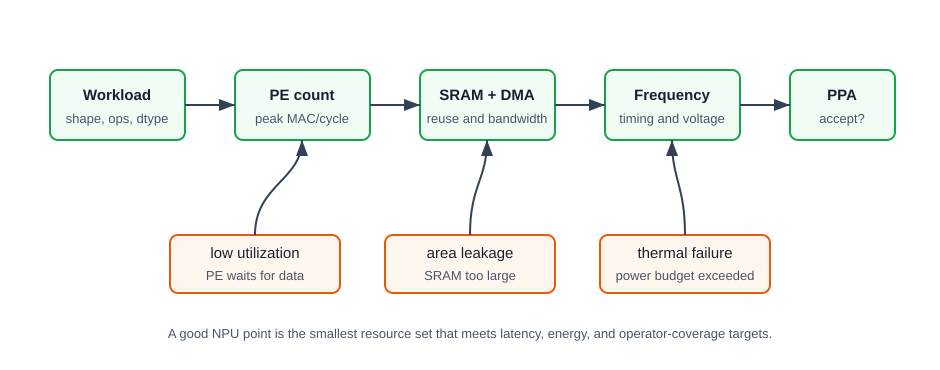

# 29 面积功耗性能取舍

> 章节等级：B  
> 状态：发布候选  
> 来源映射：`chapter_source_map.csv` 中的 29 章；本章主要承接 SRC11、SRC15，参考 SRC01。

本章解决一个 NPU 设计绕不开的问题：为什么不能无限堆 MAC、无限加 SRAM、无限提高频率。真实芯片设计总是在面积、功耗、性能之间取舍。面积决定能放多少计算和存储，功耗决定能不能在手机、摄像头、边缘设备里长期运行，性能决定模型是否能满足延迟和吞吐要求。三者互相牵制，不能只看一个指标。

| 核心问题 | 本章给出的回答 |
| --- | --- |
| 面积是什么？ | MAC、SRAM、互连、控制、DMA 等硬件资源占用的芯片成本。 |
| 功耗是什么？ | 计算、存储访问、数据搬运和漏电带来的能量消耗速率。 |
| 性能是什么？ | 延迟、吞吐、利用率、TOPS、帧率等共同描述的执行能力。 |
| 为什么要取舍？ | 增加资源可能提升峰值，但也会增加面积、功耗和数据供给压力。 |

如果说前面章节在讲“NPU 怎么算”，本章就在讲“为什么不能想怎么堆就怎么堆”。NPU 设计不是把所有指标都拉满，而是在目标场景下找到可接受的平衡点。



## 1. 学习目标

读完本章，你应该能够：

- 用自己的话解释 PPA：area、power、performance。
- 区分峰值性能和真实性能。
- 说明为什么更多 MAC 不一定带来更低延迟。
- 手算一个小算子在两个 NPU 方案上的周期、延迟和能量。
- 解释 SRAM、带宽、量化、频率对 PPA 的影响。
- 看懂为什么不同产品形态会选择不同 NPU 设计。

## 2. 先修提醒

本章需要你已经理解：

- MAC、PE 阵列、buffer、DMA、部分和和带宽瓶颈。
- 量化会改变位宽、数据搬运和乘法器成本。
- 算子支持边界会决定真实模型能否连续留在 NPU 上执行。

本章不会深入半导体工艺、版图、时序收敛或电源网络。零基础阶段先建立 PPA 直觉：一个设计改动几乎不会只影响一个指标。

## 3. 生活化引入

想象你要买一辆车：

- 想要更快，可以换更强发动机。
- 想要更省油，可以减轻车重或降低发动机功率。
- 想要能装更多东西，需要更大车身。

但三件事很难同时无限提高。更强发动机可能更贵、更耗油；更大车身可能更重；更省油的设计可能加速慢。NPU 也是这样。

堆更多 MAC 像换更强发动机；加大 SRAM 像扩大后备箱；提高频率像让发动机转更快；量化像把货物压缩得更轻。每个动作都有收益，也有代价。

## 4. 直觉解释

PPA 是三个词：

```text
P = Performance 性能
P = Power 功耗
A = Area 面积
```

为了避免两个 P 混淆，工程里常说 PPA。

### 面积直觉

面积不是只有 MAC 阵列。NPU 面积通常包括：

- MAC/PE 阵列。
- 片上 SRAM、寄存器文件、FIFO。
- DMA、总线接口、地址发生器。
- 数据重排、量化缩放、激活函数等辅助单元。
- 控制逻辑、时钟、电源和测试结构。

很多初学者以为“面积主要是计算单元”。但在不少 NPU 中，片上存储和互连也可能占很大比例。为了让 MAC 吃饱而加 buffer、加端口、加交叉开关，都会增加面积。

### 功耗直觉

功耗来自两大类：

- 动态功耗：电路切换、MAC 计算、SRAM 读写、总线搬运。
- 静态功耗：即使不切换，晶体管也会有漏电。

动态功耗可以用很粗的直觉式理解：

```text
功耗大致随 电容负载 * 电压^2 * 频率 * 活动率 增加
```

不需要现在掌握公式细节，只要知道：更宽数据、更大互连、更高频率、更频繁访问，通常会增加功耗。

### 性能直觉

性能也不只是 TOPS。常见指标包括：

| 指标 | 含义 |
| --- | --- |
| latency | 单次推理或单层执行需要多久 |
| throughput | 单位时间能处理多少帧、多少 token、多少 batch |
| utilization | PE/MAC 阵列实际忙碌比例 |
| TOPS | 峰值每秒操作数，通常是理想上限 |
| energy per inference | 每次推理消耗多少能量 |

峰值 TOPS 高，只说明理想情况下算得快；如果带宽、buffer、算子支持或调度跟不上，真实利用率会下降。





## 5. 正式定义

在本书中，NPU 的 PPA 取舍指围绕以下目标同时优化：

```text
面积：在芯片预算内放下计算、存储、互连和控制。
功耗：在热设计、电池寿命和供电能力内运行。
性能：在目标模型和目标延迟/吞吐下达到要求。
```

一个简化性能估算可以写成：

```text
有效 MAC/cycle = 峰值 MAC/cycle * 利用率
执行周期 = 总 MAC 数 / 有效 MAC/cycle
执行时间 = 执行周期 / 频率
```

一个简化能量估算可以写成：

```text
能量 = 平均功耗 * 执行时间
```

这些公式很粗，但足够建立判断：

- 增加峰值 MAC/cycle 会增加性能上限，但如果利用率下降，真实性能未必提升。
- 提高频率可能降低时间，但也可能增加功耗和时序难度。
- 加 SRAM 可能增加面积，却减少外部内存访问，从而降低能量并提高利用率。
- 降低位宽可能同时降低面积、功耗和带宽，但可能损失精度或增加量化复杂度。

PPA 的本质不是单指标最大化，而是面向目标场景的约束优化。

## 6. 最小例题

假设一个小 NPU 每周期峰值能做 16 次 MAC，频率 500 MHz。如果利用率是 100%，峰值 MAC/s 是：

```text
16 MAC/cycle * 500,000,000 cycle/s
= 8,000,000,000 MAC/s
= 8 GMAC/s
```

如果真实模型因为带宽不足，利用率只有 50%，有效性能变成：

```text
8 GMAC/s * 50% = 4 GMAC/s
```

这说明：

```text
峰值性能 != 真实性能
```

再看功耗。假设满利用率时平均功耗 200 mW，而 50% 利用率时功耗不是简单减半，而是 140 mW，因为时钟、SRAM 和控制逻辑仍在消耗能量。低利用率不仅让性能下降，也可能让“每次推理能量”变差。

## 7. 完整例题

现在比较两个 NPU 方案执行同一个卷积 tile。这个 tile 的计算量来自第 18 章类似例子：

```text
总 MAC = 147456
```

两个设计：

| 方案 | 峰值 MAC/cycle | 频率 | 预计利用率 | 平均功耗 |
| --- | ---: | ---: | ---: | ---: |
| 方案 A：中等阵列、较足 buffer | 64 | 500 MHz | 80% | 200 mW |
| 方案 B：大阵列、buffer 偏紧 | 128 | 500 MHz | 35% | 320 mW |

### 第一步：计算有效 MAC/cycle

方案 A：

```text
64 * 80% = 51.2 MAC/cycle
```

方案 B：

```text
128 * 35% = 44.8 MAC/cycle
```

虽然 B 的峰值是 A 的 2 倍，但因为带宽和 buffer 喂不饱阵列，有效 MAC/cycle 反而更低。

### 第二步：计算执行周期

方案 A：

```text
147456 / 51.2 = 2880 cycles
```

方案 B：

```text
147456 / 44.8 ≈ 3291.4 cycles
```

周期通常要向上取整：

```text
方案 B ≈ 3292 cycles
```

### 第三步：计算执行时间

频率 500 MHz，表示每秒 500,000,000 个周期。

方案 A：

```text
2880 / 500,000,000 s
= 0.00000576 s
= 5.76 us
```

方案 B：

```text
3292 / 500,000,000 s
= 0.000006584 s
≈ 6.58 us
```

方案 B 峰值更高，但真实执行反而更慢。

### 第四步：计算能量

能量等于功耗乘时间。注意单位：

```text
200 mW = 0.2 W
320 mW = 0.32 W
```

方案 A：

```text
0.2 W * 5.76 us
= 0.2 * 5.76 microjoule
= 1.152 uJ
```

方案 B：

```text
0.32 W * 6.58 us
≈ 2.106 uJ
```

方案 B 不仅慢，还更耗能。

### 第五步：解释为什么

方案 B 的问题不是 MAC 不够，而是：

- 大阵列需要更高数据供给速率。
- buffer 偏紧导致复用不足。
- 部分 PE 空等，利用率降低。
- 更大的阵列和互连仍然带来面积和功耗代价。

这个例子说明 PPA 的核心判断：资源堆上去以后，必须确认数据流、buffer 和算子形状能把资源用起来。否则峰值指标会变漂亮，真实性能和能量反而变差。

## 8. NPU 连接

NPU 里常见的 PPA 旋钮包括：

| 旋钮 | 可能收益 | 可能代价 |
| --- | --- | --- |
| 增加 MAC/PE 数量 | 提高峰值并行度 | 面积、功耗、供数压力上升 |
| 增加 SRAM | 提高复用，减少外部带宽 | 面积增加，SRAM 漏电和访问功耗增加 |
| 提高频率 | 降低周期时间 | 动态功耗上升，时序更难 |
| 降低位宽 | 降低 MAC 和搬运成本 | 量化误差、scale 管理、精度风险 |
| 支持更多算子 | 减少 fallback | 控制复杂度和验证成本增加 |
| 更复杂 dataflow | 提高利用率和复用 | 控制、互连、编译器复杂度增加 |

不同产品会做不同取舍：

- 手机 NPU 重视能效和热约束，不能只追求峰值 TOPS。
- 摄像头或 IoT NPU 重视低功耗、低成本、固定模型稳定运行。
- 数据中心加速器更能接受较大面积和功耗，但必须追求高吞吐和高利用率。
- 车载或工业场景还会关注可靠性、实时性和长时间稳定功耗。

前面几章学过的内容都会回到 PPA：

- 量化降低位宽，改善面积、功耗和带宽。
- tile 和 dataflow 提高复用，改善利用率和能效。
- 部分和本地保存减少外部写回。
- 算子支持边界决定模型能否连续留在高效路径。
- 编译器 mapping 决定硬件资源是否被充分利用。

所以 PPA 不是单独一章的名词，而是全书硬件设计线索的收束。

## 工程判断

PPA 设计不能从“我要多少 TOPS”开始，而要从目标工作负载开始。先列模型的主算子、shape、batch、dtype、延迟目标和功耗预算；再估算总 MAC、权重/激活/输出搬运量、可复用维度；然后选择 PE 数、SRAM 容量、DMA 带宽和频率；最后用利用率、能量、面积和温度反馈修正。这个顺序能避免只堆 PE，却被带宽和 supported ops 卡住。

什么时候增加 PE：profiling 显示 PE 长时间忙、DMA 和 SRAM 还有余量、目标模型有足够并行维度。什么时候增加 SRAM：外部访存占主导，tile 放大能显著提高复用，并且漏电/面积仍在预算内。什么时候提高频率：时序余量、供电、散热都能承受，且性能确实受计算周期限制。什么时候不要做这些：算子 fallback 多、shape 太小、DMA 饥饿、bank conflict 严重，或低功耗模式下温度已经接近上限。

失败信号要分层看。若峰值 TOPS 高但延迟不降，看利用率和带宽；若延迟达标但能耗过高，看数据搬运、时钟门控和空转；若面积超标，看 PE、SRAM、互连和控制状态机哪一类资源增长最快；若 benchmark 波动大，看 thermal throttling、DVFS、CPU fallback 和输入 batch 稳定性。PPA 的好方案不是每项指标最大，而是在目标场景下刚好满足约束并留下验证余量。

## 9. 常见误区

### 误区 1：MAC 越多，NPU 一定越快

- 错误说法：把 PE 阵列扩大一倍，速度就会提高一倍。
- 为什么错：数据供给、buffer、调度和算子形状可能让利用率下降。
- 正确理解：真实速度取决于峰值和利用率共同作用。

### 误区 2：SRAM 越大越好

- 错误说法：片上 SRAM 越大，性能和能效一定越好。
- 为什么错：SRAM 会占面积、耗漏电，访问端口和布线也有成本。
- 正确理解：SRAM 要匹配目标 tile 和复用需求，不是无限增大。

### 误区 3：只看 TOPS 就能判断 NPU 强弱

- 错误说法：TOPS 高的 NPU 一定更适合所有模型。
- 为什么错：TOPS 是峰值计算指标，不包含带宽、算子覆盖、量化精度和利用率。
- 正确理解：要结合目标模型的延迟、能量、内存访问和 supported ops 看。

### 误区 4：低功耗就是降低频率

- 错误说法：想省电只要把频率降下来。
- 为什么错：频率降低会拉长执行时间，静态功耗和系统等待时间可能增加。
- 正确理解：低功耗需要综合位宽、数据复用、电压频率、关断策略和调度。

### 误区 5：面积、功耗、性能可以分别优化

- 错误说法：先把性能做到最大，再单独解决面积和功耗。
- 为什么错：提高性能的资源往往直接增加面积和功耗，后期很难无损修复。
- 正确理解：PPA 必须从架构早期一起考虑。

## 10. 本章自测

### 题目

1. PPA 分别代表什么？
2. 为什么峰值 TOPS 不等于真实推理性能？
3. 写出有效 MAC/cycle 的简化计算式。
4. 一个阵列峰值 32 MAC/cycle，利用率 75%，有效 MAC/cycle 是多少？
5. 总计算量 2400 MAC，有效 24 MAC/cycle，需要多少周期？
6. 频率 600 MHz，1200 cycles 约是多少微秒？
7. 功耗 0.25 W，执行时间 4 us，能量是多少 uJ？
8. 为什么增加 SRAM 可能同时有好处和坏处？
9. 量化为什么能改善 PPA？
10. 为什么支持更多算子可能增加面积或验证成本？

### 答案或评分点

1. Performance、Power、Area，即性能、功耗、面积。
2. 真实性能还受利用率、带宽、buffer、算子支持、调度和数据搬运影响。
3. `有效 MAC/cycle = 峰值 MAC/cycle * 利用率`。
4. `32*0.75=24 MAC/cycle`。
5. `2400/24=100 cycles`。
6. `1200/600,000,000 s = 2 us`。
7. `0.25*4 us = 1 uJ`。
8. 好处是提高复用、减少外部访问；坏处是增加面积、漏电、访问和布线成本。
9. 降低位宽可以减小乘法器和存储，减少带宽与能耗，但要控制精度损失。
10. 更多算子需要更多数据通路、控制逻辑、边界条件处理和测试验证。

## 来源

- 本地来源 SRC11：`C:\Users\11035\Desktop\ic\npu\14、NPU\《NPU低功耗电源管理设计从入门到精通》\01.html`，行 185-208、246-272 讨论功耗重要性、动态/静态功耗、片上存储功耗、时钟网络和 DVFS；支撑 power 维度。
- 本地来源 SRC15：`C:\Users\11035\Desktop\ic\npu\14、NPU\《NPU性能评测与基准测试从入门到精通》\01.html`，行 259-309 讨论 CPU/GPU/NPU 对比、内存带宽、能效比和性能测试；支撑 TOPS、延迟、吞吐和利用率口径。
- 本地来源 SRC01：`C:\Users\11035\Desktop\ic\npu\14、NPU\《NPU Andes NPU IP核设计从入门到精通》\02.html`，行 380-412 给出性能、利用率、功耗、面积、可扩展性和软件栈支持；支撑 area/performance/system tradeoff。
- 外部来源 Google TPU：`https://arxiv.org/abs/1704.04760`，支撑峰值矩阵单元、片上 buffer、实际 workload 性能与系统瓶颈的关系。
- 外部来源 Eyeriss：`https://arxiv.org/abs/1604.07316`，支撑数据复用、片上层级、能效和 CNN accelerator 架构取舍。
- 外部来源 Gemmini：`https://arxiv.org/abs/1911.09925`，支撑可配置 systolic array、scratchpad、accumulator、DMA 和 SoC 集成的 PPA 设计空间。
