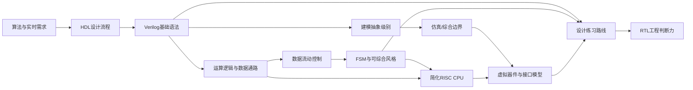

# 全书知识总图：从算法到可验证 RTL 系统

## 本章知识全景图

整本书的骨架是一条工程链路：

```text
算法需求
  -> 硬件结构选择
  -> Verilog 语法和模型边界
  -> 数据通路
  -> 同步控制和 FSM
  -> 小型 CPU/系统案例
  -> 虚拟外设和验证环境
  -> 练习闭环
```

这条链路服务一个目标：让学习者能把“我要计算什么”变成“哪些寄存器、组合逻辑、状态机、总线和外设模型一起工作”。

## 1. 全书依赖图



图里最重要的依赖是：

| 依赖 | 如果没学懂，会出现什么问题 |
|---|---|
| 语法 -> 模型边界 | 把 testbench 写法混进 RTL |
| 语法 -> 数据通路 | 只会写表达式，不知道资源和时序代价 |
| 数据通路 -> 控制 | 运算器有了，但不知道哪拍有效 |
| 控制 -> FSM | 多拍协议只能写成乱序 if |
| FSM -> CPU | 看不懂指令周期和控制信号 |
| CPU -> 虚拟接口 | 不知道 ROM/RAM/testbench 为什么不属于 CPU |
| 虚拟接口 -> 练习 | 练习只能跑理想输入，不能暴露真实接口错误 |

## 2. 知识块总表

| 知识块 | 解决的问题 | 关键文件 | 交付能力 |
|---|---|---|---|
| 算法到硬线逻辑 | 为什么需要 RTL | 01 | 能把软件循环改写为数据通路问题 |
| HDL 设计流程 | 怎么从规格到硬件 | 01、03 | 能描述 Top-Down、仿真、综合、后仿真 |
| Verilog 语法 | 怎么写模块和过程块 | 02 | 能写基本组合/时序模块 |
| 抽象级别 | 哪些代码属于哪一层 | 03 | 能分辨行为模型、RTL、门级网表 |
| 数据通路 | 数据怎样计算和选择 | 04 | 能设计加法器、mux、总线、流水线 |
| 同步控制 | 数据什么时候被保存 | 05 | 能用时钟、复位、使能控制数据流 |
| FSM 风格 | 多拍控制怎样可靠表达 | 06 | 能写两段式 FSM，避免 latch/race |
| CPU 案例 | 完整系统怎样协同 | 07 | 能追踪指令、PC、IR、ALU、总线和控制器 |
| 虚拟接口 | 外部世界怎样进入仿真 | 08 | 能写或使用 BFM/行为模型验证 DUT |
| 练习路线 | 怎样从小模块练到系统 | 09、93 | 能完成比较器、FSM、卷积器、FIFO |

## 3. 三条主线

### 3.1 语言主线

```text
module/port
  -> wire/reg/memory
  -> assign/always
  -> if/case/loop
  -> task/function/system task
  -> 可综合子集和 testbench 子集分离
```

这条线解决“怎么写”。它的关键不是背语法，而是知道每种写法在仿真和综合中的角色。

### 3.2 硬件主线

```text
组合逻辑
  -> 时序寄存器
  -> 数据通路
  -> 控制信号
  -> FSM
  -> CPU/卷积器/FIFO
```

这条线解决“写出来是什么硬件”。如果一段 Verilog 不能说清会生成什么硬件，就不能算真正懂。

### 3.3 验证主线

```text
简单 testbench
  -> 波形观察
  -> 系统任务打印
  -> 虚拟 ROM/RAM/ADC
  -> 诊断程序
  -> BFM/VIP/scoreboard 思维
```

这条线解决“怎么证明它对”。越往后，验证不再是手工看波形，而是可重复、可定位、可扩展的检查系统。

## 4. 章节之间的关键转折

| 转折点 | 从哪里到哪里 | 真正变化 |
|---|---|---|
| 软件到硬件 | 01 -> 02 | 从执行步骤转向寄存器和组合逻辑 |
| 语法到模型 | 02 -> 03 | 从会写语句转向判断可综合边界 |
| 运算到结构 | 03 -> 04 | 从表达式转向加法器、乘法器、mux 和总线 |
| 数据到时序 | 04 -> 05 | 从“算出值”转向“哪拍保存值” |
| 时序到控制 | 05 -> 06 | 从单个寄存器转向状态机 |
| 模块到系统 | 06 -> 07 | 从小控制器转向 CPU 级协同 |
| 系统到环境 | 07 -> 08 | 从 DUT 转向虚拟外设和接口模型 |
| 知识到能力 | 08 -> 09 | 从读懂变成能练、能测、能改 |

## 5. AI+IC 路线中的对应关系

| 本书知识 | AI+IC 中的对应 |
|---|---|
| 算法到硬线逻辑 | 卷积、矩阵乘、激活函数从软件循环变成 NPU 数据通路 |
| 数据通路 | MAC 阵列、累加树、量化/饱和/移位单元 |
| mux 和总线 | SRAM bank 选择、NoC 路由、AXI 数据通路 |
| FSM | DMA、tile 调度、卷积滑窗、算子启动和完成控制 |
| CPU 案例 | 微控制器、RISC-V 控制核、NPU 命令解释器 |
| 虚拟接口模型 | SRAM/HBM/AXI BFM、输入激活和权重模型 |
| testbench | cocotb/UVM、scoreboard、golden model 对比 |
| FIFO 练习 | valid-ready 解耦、流水线缓冲、片上队列 |

读本书时始终带着这个问题：同一个知识点在 NPU 里会出现在哪里。这样 Verilog 学习不会停在语法，而会进入数字 IC 工程。

## 6. 全书最终判断句

学完后应能把任何小 RTL 任务拆成 8 个问题：

1. 输入、输出、时钟、复位是什么。
2. 哪些值需要寄存，哪些只是组合计算。
3. 数据通路由哪些运算器、mux、存储器和总线组成。
4. 控制信号由什么 FSM 或计数器产生。
5. 每一拍哪个模块读、写、驱动或采样。
6. 哪些代码属于可综合 RTL，哪些属于 testbench。
7. testbench 如何覆盖正常、边界和错误场景。
8. 综合和后仿真失败时，从时序、资源、约束还是代码结构查起。

这 8 个问题比记住某个示例代码更重要。
