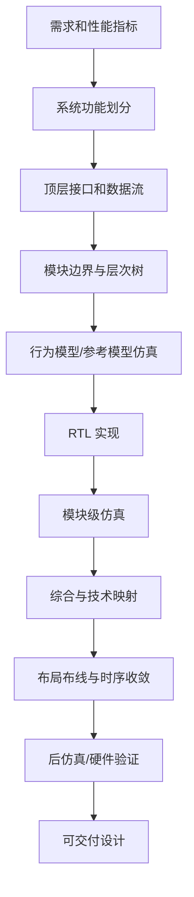

# 01 算法到硬线逻辑：为什么 Verilog 是 RTL 学习入口

## 本章知识全景图

本章解决的问题是：为什么一个已经能用 C 跑通的算法，还要重新写成 Verilog RTL，并经过仿真、综合、布局布线才变成真实硬件。

| 学习块 | 核心概念 | 你要形成的判断 |
|---|---|---|
| 从信号处理到实时计算 | DSP、实时、吞吐、延迟 | 不是所有计算都适合交给通用 CPU；时间约束会逼出专用硬件 |
| 从程序到硬线逻辑 | 算法、数据结构、程序、体系结构 | C 程序描述“先后执行”，硬件描述“空间上同时存在的电路” |
| C 与 Verilog 分工 | 功能模型、并行结构、RTL、综合 | C 适合验证算法，Verilog 适合表达硬件结构、时钟和并行 |
| HDL 设计方法 | HDL、仿真、综合、Top-Down | Verilog 不是画电路的替代品，而是把设计流程组织起来的工程语言 |
| 可复用硬件 | 软核、固核、硬核、IP | RTL 学习最终要走向模块复用、接口和系统集成 |

最短学习路径：先理解“实时需求为什么需要硬件”，再理解“C 和 Verilog 为什么不能互相替代”，最后掌握“Top-Down + 仿真 + 综合”的设计闭环。

## 1. 实时计算为什么会逼出硬线逻辑

实时处理的本质不是“算得快一点”，而是在规定时间内完成规定数量的数据处理；超过时间窗口，结果即使正确也失去工程价值。

数字信号处理常见任务包括滤波、变换、加密、解密、编码、解码、纠错、压缩和解压缩。这些任务都可以抽象为数学运算，也都可以先用软件验证。区别在于时间约束：

| 场景 | 时间要求 | 通常实现 |
|---|---|---|
| 地质数据离线分析 | 可以几天或更久 | 通用计算机足够 |
| 通信接收端解码 | 必须跟上数据流 | 往往需要专用硬件 |
| 雷达、图像、实时控制 | 延迟窗口很窄 | FPGA、ASIC、DSP/NPU 加速器 |

通用处理器为了“什么都能做”，必须配置通用指令集、通用寄存器、通用总线和通用控制流程。它的优势是灵活，代价是每一步都要取指、译码、调度和访存；如果某个算法只需要固定的数据通路，通用性就会变成额外开销。

硬线逻辑把算法中的关键运算直接映射为门、寄存器、多路器、加法器、乘法器、状态机和互连结构。它不再反复“解释指令”，而是让数据在固定硬件结构中按时钟节拍流动。对 AI+IC 学习来说，这正是 NPU、卷积加速器、矩阵乘法阵列和视频编解码器的底层直觉：把反复执行的高吞吐计算，从软件循环改造成空间并行的数据通路。

## 2. 基本概念：算法、程序、体系结构、硬线逻辑

算法说明“为了得到结果要做哪些计算”，体系结构说明“这些计算由哪些资源、按什么数据流和控制流完成”。

| 概念 | 准确定义 | RTL 学习里的用法 |
|---|---|---|
| 算法 | 对输入数据施加有限步骤并产生输出结果的方法 | 决定需要哪些运算和数据依赖 |
| 数据结构 | 数据的组织方式和访问关系 | 决定位宽、存储、队列、缓冲、地址生成 |
| 程序 | 用软件语言把算法写成顺序执行的语句 | 适合功能验证，不直接等于硬件 |
| 体系结构 | 运算资源、存储资源、互连和控制方式 | 决定硬件性能上限 |
| 硬线逻辑 | 用固定电路实现运算和控制的结构 | FPGA/ASIC 中的 RTL 目标 |
| 设计方法学 | 把需求分解、实现、验证和收敛的一套流程 | 防止复杂设计只靠经验堆代码 |

C 程序的默认心智模型是“一行接一行执行”。硬件的默认心智模型是“许多电路同时存在，只在时钟、使能和互连关系下改变状态”。初学者最容易犯的错误，是把 C 的执行顺序强行带入 Verilog，以为把 `for`、`if`、函数调用换成相似关键字就完成了硬件设计。

硬件设计真正要问的是：

1. 数据放在哪里：寄存器、存储器、FIFO、总线还是接口。
2. 每个时钟周期做什么：哪些寄存器更新，哪些组合逻辑只计算不保存。
3. 哪些运算可以并行：多个加法器同时工作，还是复用一个加法器分多拍完成。
4. 控制如何推进：固定流水、计数器、握手协议还是有限状态机。
5. 结果如何检查：仿真输出、波形、断言、综合报告、时序报告。

## 3. 专用硬件与微处理器的取舍

微处理器方案适合变化快、控制复杂、性能要求适中的任务；硬线逻辑适合运算固定、吞吐高、延迟硬约束强的任务。

| 实现路线 | 优点 | 代价 | 适用判断 |
|---|---|---|---|
| 通用 CPU / MCU | 开发快、软件生态完整 | 吞吐和延迟受指令流限制 | 控制类、低速处理、需求常变 |
| 专用 DSP/处理器 | 指令和硬件对信号处理友好 | 仍受处理器体系结构限制 | 中等实时信号处理 |
| FPGA | 可重构、适合原型和中小批量 | 面积、功耗、频率不如定制 ASIC | 课程实践、验证、算法加速原型 |
| ASIC | 性能/功耗/面积可做到最好 | 设计和流片成本高，不易修改 | 大规模量产、强约束芯片 |
| CPU + 专用硬件 | 软件控制灵活，硬件处理热点 | 接口和数据搬运复杂 | SoC、NPU、视频/通信加速器 |

书中强调硬线逻辑的目的，是让读者从算法能力转向电路实现能力。今天这个判断仍然成立，只是具体工具链已经从早期商业 EDA 和 Verilog-XL 时代，发展到 SystemVerilog、UVM、开源仿真器、FPGA 原型、HLS、形式验证和更成熟的 ASIC 流程。

现代学习时不要把“硬线逻辑优于处理器”理解成绝对结论。正确判断是：当算法热点足够稳定、数据并行度足够高、时间或能耗约束足够强时，把热点做成硬件才值得。

## 4. C 与 Verilog 的正确分工

C 是算法验证语言，Verilog 是硬件结构语言；两者能配合，但不能互相替代。

一个稳健的算法到硬件流程可以写成：

```text
算法想法
  -> C / Python 功能模型
  -> 限制动态特性，整理成固定循环和固定数据结构
  -> 构造更接近硬件的数据通路和并行结构
  -> Verilog 行为模型或参考模型
  -> RTL Verilog：寄存器、组合逻辑、FSM、接口
  -> RTL 仿真：功能正确、周期行为正确
  -> 综合：变成门级网表或 FPGA LUT/寄存器资源
  -> 布局布线后仿真/时序检查
  -> 板级或芯片验证
```

这条链路里，C 的价值是提供黄金参考模型。Verilog 的价值是表达硬件要如何在时间和空间上运行。

### 4.1 关键字相似不代表语义相同

| C 结构 | Verilog 中常见对应 | 不能忽略的差异 |
|---|---|---|
| function | `module`、`function`、`task` | C 函数调用是一次执行；Verilog 模块例化是一个长期存在的硬件实例 |
| `{ }` | `begin/end` | 只是语句块边界，不自动表示硬件结构 |
| `if/else` | `if/else` | 组合逻辑中条件不完整可能推导锁存器 |
| `case` | `case` | 必须考虑未覆盖分支、`default`、`x/z` 匹配风险 |
| `for/while` | `for/while/repeat` | 可综合循环通常要能在综合期展开或有明确硬件边界 |
| `break` | `disable` 或重构控制 | 现代 RTL 更常用状态机或显式条件组织 |
| `printf` | `$display`、`$monitor`、`$strobe` | 多数系统任务只服务仿真，不是硬件电路 |

### 4.2 运算符相似也不代表硬件代价相同

`+`、`-`、`*`、`/`、`%`、`&&`、`||`、`>`、`<` 等符号在 C 和 Verilog 中看起来接近，但硬件代价完全不同。一个 8 位加法器、32 位乘法器、除法器和模运算器，在面积、延迟、流水线需求上差异很大。

RTL 写作不能只问“这个表达式算不算得出结果”，还要问：

- 位宽是多少，溢出如何处理。
- 有符号还是无符号。
- 组合路径是否太长。
- 运算是否要分多拍。
- 是否要复用硬件资源。
- 是否会引入 `x/z` 传播和仿真/综合差异。

### 4.3 软件到硬件的四个关键陷阱

| 陷阱 | 错误想法 | 正确处理 |
|---|---|---|
| 顺序执行幻觉 | C 里先写的语句在硬件里也先发生 | 明确组合逻辑、寄存器更新和时钟边沿 |
| 动态结构幻觉 | 指针、递归、不定循环可以直接综合 | 用固定存储、固定循环边界、状态机重写 |
| 函数调用幻觉 | 多次调用同一函数像软件一样共享一个实体 | 模块例化会产生多个硬件实例，复用要显式控制 |
| 延时幻觉 | 加 `#delay` 就能表达真实硬件等待 | 可综合 RTL 用时钟、计数器、握手和 FSM 表达等待 |

如果转换后的 Verilog 不能表达成清楚的 RTL，也就是不能说明“哪些寄存器在什么条件下更新，哪些组合逻辑由哪些输入决定”，综合工具就无法可靠地产生你想要的门级电路。

## 5. HDL 是什么：它组织的是模型、验证和综合

硬件描述语言不是“会画电路的人偷懒用的文本格式”，而是把复杂硬件设计变成可层次化、可仿真、可综合、可复用工程对象的语言。

HDL 在设计中的作用有三层：

| 层次 | HDL 做什么 | 验收信号 |
|---|---|---|
| 建模 | 描述模块行为、结构、接口和时序 | 读者能说清输入、输出、状态和时钟 |
| 验证 | 写 testbench、激励、检查、波形观察 | 仿真能暴露功能和时序错误 |
| 综合 | 把可综合 RTL 转成门级网表或 FPGA 资源 | 综合报告、时序报告和资源报告可解释 |

书中介绍 Verilog 的历史时，要按历史背景理解：Verilog 由 Gateway Design Automation 在 1980 年代推出，后经 OVI 推动开放，并在 1995 年成为 IEEE 1364 标准。今天学习时，还要知道 Verilog 已经与 SystemVerilog 标准体系衔接，现代设计和验证常以 IEEE 1800 SystemVerilog 为边界。学习本书仍有价值，因为可综合 RTL 的基本心智模型并没有过时。

## 6. Verilog 与 VHDL：今天不要背旧比例，要学判断口径

Verilog 和 VHDL 都是硬件描述语言，真正重要的不是“哪一个在某一年某地区更多”，而是它们如何帮助你描述硬件。

| 维度 | Verilog / SystemVerilog | VHDL |
|---|---|---|
| 学习入口 | 语法接近 C，初学门槛较低 | 类型系统更严格，初学成本较高 |
| 工程生态 | ASIC/FPGA、IP、验证中广泛使用 | 航空航天、欧洲和部分 FPGA 场景常见 |
| 硬件描述能力 | RTL、门级、验证扩展强 | 强类型和工程约束清晰 |
| 本书使用价值 | 用 Verilog 建立 RTL 基础 | 作为后续横向比较对象 |

对当前 AI+IC 学习路线，先学 Verilog/SystemVerilog 的可综合 RTL 子集更直接：后续读 NPU、RISC-V、总线、cache、DMA、NoC、FPGA 原型和开源 RTL 都会频繁遇到这套写法。

## 7. 为什么 HDL 比原理图输入更适合复杂设计

原理图适合局部小电路，HDL 适合规模化系统；当模块数量、位宽、状态和验证场景上升时，文本化、层次化和自动化会压倒手工连线。

| 对比项 | 原理图输入 | Verilog HDL 输入 |
|---|---|---|
| 修改位宽 | 大量连线和模块要手改 | 参数、向量和生成结构更容易调整 |
| 复用 | 依赖图纸复制和人工连接 | 模块、IP、接口可以复用 |
| 仿真 | 可做，但测试组织较弱 | testbench 可与设计同语言组织 |
| 工艺迁移 | 容易绑定特定器件 | RTL 到综合网表再映射到目标工艺 |
| 团队协作 | 图形管理困难 | 文本可版本管理、检查、比较 |
| 大规模设计 | 连线复杂度迅速失控 | 层次化和自动化工具可管理 |

这也是 Top-Down 方法的基础：先在高层确定功能和模块边界，再逐层分解到可以实现的基本单元。

## 8. 软核、固核、硬核：复用的是“已经验证过的设计资产”

IP 复用的本质是避免每个项目都从零重新发明可靠模块。

| 类型 | 形态 | 灵活性 | 典型用途 |
|---|---|---|---|
| 软核 | 可综合 RTL 源码或等价描述 | 最高，可改参数、可迁移工艺 | CPU、总线、FIFO、DSP 模块、接口控制器 |
| 固核 | 已做过较多实现约束的门级或布局相关交付 | 中等，移植成本比软核高 | 需要较稳定性能/面积的模块 |
| 硬核 | 已完成版图或物理实现的宏单元 | 最低，但性能和时序更确定 | SRAM、PLL、高速 PHY、模拟/混合信号模块 |

现代工程里，“软核/硬宏/IP”的说法更常见，“固核”的边界在不同公司可能不同。学习时抓住核心判断：越靠近 RTL，越灵活但实现不确定性更高；越靠近版图，性能更可控但可修改性更低。

## 9. Top-Down 设计：先分解问题，再实现电路

Top-Down 不是把大模块随便切小，而是从系统目标出发，把功能、接口、时序、资源和验证责任逐层分配。



Top-Down 解决的是“复杂度分配”问题。高层先确认系统能不能满足功能和性能，低层再把模块落实成寄存器、组合逻辑、存储器和接口。底层实现又会反过来约束高层：如果面积、功耗、频率或时序无法满足，系统划分就要调整。

因此，真实工程不是纯 Top-Down，也不是纯 Bottom-Up，而是两者结合：

- Top-Down 提供目标、边界、层次和验证路线。
- Bottom-Up 提供已有 IP、标准单元、硬宏、工艺库和可实现约束。
- 中间的 RTL 设计者负责把抽象目标和可实现资源对齐。

## 10. Verilog 设计流程的检查点

一个模块从文字需求变成电路，至少要经过“设计开发”和“设计验证”两条线。

| 阶段 | 设计开发在做什么 | 设计验证在看什么 |
|---|---|---|
| 规格 | 明确输入、输出、时序、吞吐、延迟 | 需求是否可测，边界条件是否完整 |
| 架构 | 划分数据通路、控制器、存储和接口 | 数据是否能流动，控制是否闭环 |
| RTL | 写寄存器、组合逻辑、FSM、模块例化 | testbench、波形、断言是否通过 |
| 综合 | RTL 转网表，映射到库或 FPGA 资源 | 面积、频率、警告、锁存器、未驱动信号 |
| 布局布线 | 放置、连线、提取时延 | 时序收敛、约束是否正确 |
| 后仿真/硬件 | 接近真实物理实现验证 | 上板/硅后行为是否与仿真一致 |

初学时最容易漏掉的是“每一层都可以仿真”。高层仿真用于验证算法和模块边界，RTL 仿真用于验证周期行为，综合后和布局布线后的验证用于发现映射、时序和物理约束问题。

## 11. 现代边界：哪些内容要保留，哪些要更新

这本书成书于 2000 年，历史判断不能原样当成今天的产业事实；但它建立的 RTL 学习主线仍然有效。

| 原书内容 | 今天怎么处理 |
|---|---|
| Verilog/VHDL 地区使用比例 | 标注为历史背景，不背比例 |
| Verilog-XL、早期商业工具 | 作为工具史，不作为当前工具指南 |
| IEEE 1364-95 附录 | 用作 Verilog 语法来源之一，同时补充 IEEE 1800/SystemVerilog 边界 |
| C 与 Verilog 配合 | 仍有效，但今天也常用 Python、C++、SystemC、cocotb、HLS 做参考模型或验证 |
| FPGA/ASIC 实现路径 | 仍有效，只是工具、库、验证方法和开源生态更成熟 |
| 软核/固核/硬核 | 保留复用思想，术语按现代 IP/soft IP/hard macro 边界解释 |

对零基础学习者，当前最稳的路线不是一上来追全量 SystemVerilog，而是先掌握可综合 Verilog RTL 子集：模块、端口、组合逻辑、时序逻辑、FSM、testbench、综合边界。后续再补 SystemVerilog 的接口、结构体、枚举、断言和验证特性。

## 12. AI+IC 连接：从算法到 NPU 数据通路

AI 芯片设计就是“算法到硬线逻辑”的现代版本。

以卷积或矩阵乘法为例，软件里常写成多重循环；硬件里要重新问：

- 乘加单元有多少个，是否形成阵列。
- 输入特征、权重和部分和放在哪里。
- 每拍从 SRAM/FIFO/总线取多少数据。
- 数据是否复用，复用方向是什么。
- 控制器怎样推进循环边界。
- 输出何时有效，如何写回。
- 是否需要流水线、并行展开、量化和饱和处理。

这就是第 1-2 章对后续 RTL 学习的价值：它让你知道 Verilog 不是“另一种编程语言”，而是把算法的时间、空间和资源形态具体化的工程工具。

## 13. 本章易错点

| 易错点 | 后果 | 正确判断 |
|---|---|---|
| 以为 C 程序能直接翻译成 Verilog | 写出不可综合或低性能 RTL | 先重构数据通路和控制器 |
| 只看功能，不看时间 | 仿真结果对但吞吐/延迟失败 | 每个状态和时钟周期都要有意义 |
| 把 `#delay` 当成硬件等待 | 综合时被忽略或行为不一致 | 用时钟、计数器、握手、FSM |
| 把 HDL 当作画电路替代品 | 只会写模块，不会组织流程 | 学会仿真、综合、约束和验证闭环 |
| 背旧生态结论 | 误判现代工具和语言边界 | 把旧结论转成历史背景和判断方法 |

## 14. 自测题

1. 一个地震数据离线处理程序和一个实时通信解码器都在做数字信号处理，为什么前者可以用通用计算机慢慢算，后者可能必须用硬件？
2. 为什么说 C 函数调用和 Verilog 模块例化不是一回事？
3. 如果一个 C 循环次数由运行时输入决定，直接搬到可综合 Verilog 里会遇到什么问题？
4. 解释“软核比硬核灵活，但实现不确定性更高”。
5. 画出一个最小 Top-Down 流程：从算法规格到 RTL 仿真、综合、布局布线后验证。
6. 面向 NPU 的矩阵乘法单元，哪些信息属于算法，哪些信息属于体系结构，哪些信息属于 RTL？

答案检查口径：

- 能明确区分离线正确性和实时截止时间。
- 能说明软件顺序执行与硬件并行存在的差别。
- 能把“循环”转成计数器、状态机、并行展开或固定边界。
- 能说出软核/固核/硬核的修改自由度和物理确定性差别。
- 能把 Verilog 学习连接到仿真、综合和硬件验证，而不是只停在语法。
