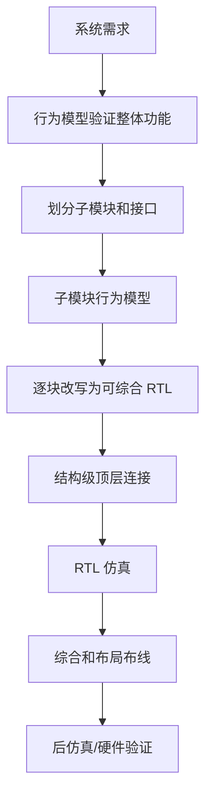

# 03 Verilog 建模抽象级别：仿真模型不等于可综合 RTL

## 本章知识全景图

同一个电路可以用不同抽象级别描述；抽象级别越高，越适合早期验证和系统分解，离真实门级实现也越远。

| 抽象级别 | 主要描述什么 | 常见用途 | 综合边界 |
|---|---|---|---|
| 系统级 | 模块之间的大行为、吞吐、接口协议 | 架构探索、系统仿真 | 通常不直接综合 |
| 算法级 | 算法步骤和数据处理关系 | 功能验证、模块划分 | 部分结构可改写后综合 |
| RTL 级 | 寄存器之间的数据流动和控制 | 可综合设计主线 | 成熟可综合 |
| 门级 | 门、触发器、原语和连线 | 结构实现、网表、后仿真 | 可综合或综合结果 |
| 开关级 | 晶体管/开关行为 | 器件库、底层建模 | 系统 RTL 学习一般不展开 |

最短路径：门级帮助你理解“最终硬件是什么”，行为级帮助你快速验证“功能是否对”，RTL 级负责把二者连接成可综合设计。

## 1. 为什么要区分抽象级别

抽象级别的作用是控制复杂度；如果一开始就写门级，大系统无法维护；如果一直停在行为级，设计可能无法落成硬件。

以一个简化 CPU 为例：

- 系统级关心 CPU 如何取指、执行、访存。
- 算法级关心每条指令的功能效果。
- RTL 级关心 PC、IR、ALU、累加器和控制器在每个时钟周期如何更新。
- 门级关心加法器、触发器、多路器和译码逻辑如何连接。

学习 Verilog 时必须形成一个判断：这段代码是“帮助我验证想法”，还是“准备交给综合工具生成硬件”。两者都重要，但验收口径不同。

## 2. 门级结构描述：直接用门和实例搭电路

门级结构描述把电路看成基本门、触发器和连线组成的网络。

Verilog 提供内建门原语，例如：

```verilog
and  u1(y, a, b);
nand u2(n, a, b);
or   u3(z, x, y);
not  u4(nx, x);
bufif1 u5(bus, data, en);
```

基本格式：

```verilog
gate_type instance_name(output, input1, input2, ...);
```

门级写法的特点：

| 特点 | 含义 |
|---|---|
| 结构清楚 | 直接看到门和连接关系 |
| 抽象低 | 代码长度随电路规模迅速膨胀 |
| 接近网表 | 适合理解综合结果和后仿真 |
| 不适合大规模手写 | 大系统应由 RTL 综合或层次化模块生成 |

门级 D 触发器例子在本书中用于说明：Verilog 不只能写行为，还能直接连接低层逻辑元件。对初学者来说，重点不是背门级 DFF 的每个 NAND，而是理解门级描述的身份：它更像“结构网表”，不是日常 RTL 设计的首选表达。

## 3. 结构级建模：用已有模块拼更大模块

结构级建模把已经验证过的模块当作积木，通过例化和连线组成更高层模块。

```verilog
module top(
  output y,
  input  a,
  input  b,
  input  c
);
  wire t;

  and2 u_and(.y(t), .a(a), .b(b));
  or2  u_or (.y(y), .a(t), .b(c));
endmodule
```

结构级不是“低级”，而是系统设计里最重要的组织方式。CPU、NPU、总线、外设接口都要靠结构级连接各个子模块。

结构级阅读顺序：

1. 找顶层端口：系统对外暴露什么。
2. 找内部连线：模块之间传什么。
3. 找子模块例化：每个模块负责什么。
4. 找时钟和复位：哪些模块共享时序域。
5. 找控制信号：谁决定数据何时有效。

## 4. UDP：用户定义原语属于底层库思维

UDP 让用户用真值表定义简单组合或时序原语。它更接近库单元建模，不是普通 RTL 学习的主线。

基本形式：

```verilog
primitive udp_name(out, in1, in2);
  output out;
  input  in1, in2;

  table
    // in1 in2 : out
       0   ?  : 0;
       1   0  : 0;
       1   1  : 1;
  endtable
endprimitive
```

UDP 关键限制：

| 限制 | 原因 |
|---|---|
| 只有一个输出 | 保持原语简单 |
| 端口必须是标量 | 真值表粒度是一位逻辑 |
| 表项使用 0/1/x 等逻辑值 | 用查表驱动仿真 |
| 可以描述简单组合/时序逻辑 | 适合库单元，不适合复杂系统模块 |

系统 RTL 设计者只需要知道 UDP 的位置：它用于基本逻辑元件或库模型。真正写业务 RTL 时，优先用 module、assign、always 和子模块结构。

## 5. 行为描述：先验证行为，不一定直接生成硬件

行为描述关注“模块应该做什么”，不一定关注“具体由哪些门和触发器实现”。

testbench 时钟例子：

```verilog
module gen_clk(output reg clk, output reg reset);
  initial begin
    clk = 1'b0;
    reset = 1'b1;
    #20 reset = 1'b0;
  end

  always #5 clk = ~clk;
endmodule
```

这段代码很适合仿真：它能产生时钟和复位。但它不是通用可综合 RTL，因为 `#5` 是仿真时间延迟，不是硬件里的时钟生成结构。

行为模型常见用途：

| 用途 | 例子 | 是否设计主体 |
|---|---|---|
| 产生激励 | 时钟、复位、输入序列 | testbench |
| 检查输出 | 比较预期值、打印错误 | testbench |
| 建立高层参考模型 | 算法行为、指令效果 | 参考模型 |
| 早期模块划分 | 用行为模型验证子系统关系 | 架构阶段 |

行为描述的价值是让设计者在低层实现之前先验证想法。风险是：行为代码写得再像 Verilog，只要不符合可综合子集，就不能直接变成硬件。

## 6. 可仿真与可综合：两条边界必须分开

能仿真的 Verilog 不一定能综合；能综合的 Verilog 也不一定满足时序、面积和功耗。

| 代码特征 | 仿真 | 综合 |
|---|---|---|
| `assign y = a & b;` | 可以 | 可以 |
| `always @* y = sel ? a : b;` | 可以 | 可以 |
| `always @(posedge clk) q <= d;` | 可以 | 可以 |
| `initial $display(...)` | 可以 | 不生成业务硬件 |
| `always #5 clk = ~clk;` | 可以 | 通常不可综合 |
| `$random` 激励 | 可以 | 不作为普通硬件随机源 |
| `fork/join` 测试流程 | 可以 | 不作为 RTL 主线 |

逻辑综合的本质，是把较高层次的 HDL 描述转换成较低层次的门级结构网表。综合后得到的还不是真正的芯片或 FPGA 布线结果。后续还需要工艺库映射、布局布线、时序分析、约束修正和后仿真。

正确流程：

```text
可综合 RTL
  -> 逻辑综合
  -> 门级网表
  -> 工艺/FPGA 资源映射
  -> 布局布线
  -> 时序收敛
  -> 后仿真或硬件验证
```

如果后仿真或时序报告失败，不能只说“代码仿真对了”。要回到 RTL、约束、流水线、资源复用或模块边界重新调整。

## 7. Top-Down 中行为模型的正确位置

Top-Down 设计可以先用行为模型划分系统，再逐步把底层模块替换为可综合 RTL。



行为模型不是废代码，它是系统分解和验证的工具。只是在项目推进时，必须给每个行为模块一个最终归宿：

- 保留为 testbench 或参考模型。
- 改写为可综合 RTL。
- 替换为已有 IP 或门级/硬宏。
- 删除或合并进其他模块。

## 8. RISC CPU 案例的真正学习点

简化 RISC CPU 案例说明：复杂系统可以先拆成简单部件，再用结构级顶层连接起来。

典型部件包括：

| 部件 | 角色 |
|---|---|
| 时钟发生器 | 提供仿真/系统节拍 |
| 指令寄存器 | 保存当前指令 |
| 程序计数器 | 给出取指地址 |
| 累加器 | 保存运算数据 |
| ALU | 执行算术/逻辑运算 |
| 数据控制器 | 控制数据总线方向 |
| 地址多路器 | 在取指、访存地址之间选择 |
| 状态控制器 | 决定取指、译码、执行等状态 |
| 外围模块 | 存储器、接口、测试环境 |

第 4 章并不要求现在读懂整个 CPU 代码。它要建立一种设计方法：先用模型把模块关系跑通，再逐块检查哪些可综合、哪些只是仿真辅助，最后把可实现模块接成系统。

这也是后续第 8 章的入口。到第 8 章时，不能只背模块名，而要追踪：

- 指令从哪里来。
- PC 什么时候更新。
- IR 什么时候装载。
- ALU 的输入来自哪里。
- 控制器如何发出读写和装载信号。
- 仿真时如何定位错误状态。

## 9. 本章判断表

| 问题 | 判断 |
|---|---|
| 这段代码能仿真吗 | 看语法、激励、时间控制、系统任务是否能被仿真器执行 |
| 这段代码能综合吗 | 看是否属于工具支持的可综合子集 |
| 综合后是不是最终电路 | 不是，还要工艺映射、布局布线、时序和后仿真 |
| 行为模型有没有价值 | 有，用于早期验证、testbench、参考模型和系统划分 |
| 门级模型有没有价值 | 有，用于理解底层结构、网表和库单元，但不适合手写大系统 |
| UDP 要不要深学 | 系统 RTL 初学只需知道用途；做库单元/器件建模才深挖 |

## 10. 常见错误

| 错误 | 后果 | 修正 |
|---|---|---|
| 以为能仿真就能综合 | 交给综合工具失败或生成错误硬件 | 先标注 testbench/RTL 边界 |
| 用 `#delay` 写设计等待 | 综合不可用 | 改成计数器、握手或 FSM |
| 手写大量门级代码 | 难维护、难验证 | 用 RTL 描述，由工具综合 |
| 行为模型写完就结束 | 没有实现路径 | 为每个行为模块指定 RTL/IP/保留为验证模型 |
| 综合后就认为完成 | 忽略时序和物理实现 | 继续布局布线、时序分析、后仿真 |

## 11. 自测题

1. 为什么说系统级、算法级、RTL 级、门级描述都可能“正确”，但验收标准不同？
2. 门级 D 触发器例子的学习价值是什么？为什么不建议初学者大量手写门级系统？
3. UDP 与普通 module 的主要差别是什么？
4. `always #5 clk = ~clk;` 为什么适合 testbench，但不适合当普通可综合设计？
5. 逻辑综合后得到的网表为什么还不是真正芯片？
6. 对一个 RISC CPU 行为模型，如何判断哪些模块要改写成 RTL，哪些可以留在 testbench？

答案检查口径：

- 能区分“仿真模型”“可综合 RTL”“综合后网表”“物理实现”。
- 能说明行为模型在 Top-Down 设计中的作用。
- 能把 testbench 构造和设计主体分离。
- 能理解第 8 章 CPU 案例要追数据流、控制流和调试路径。
