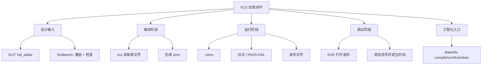

# 任务12：逻辑仿真工具 VCS 的使用

## 本章知识全景图

### 一眼看懂这讲在讲什么

这一讲把 VCS 仿真从“知道工具名”推进到“跑通一个 full adder 实验”。完整闭环是：写 DUT，写 testbench，编译生成 `simv`，运行仿真，打印结果，生成波形，用 DVE 添加信号并核对输入输出关系。真正的学习目标不是打开 DVE，而是能用 testbench 和波形证明 DUT 在指定激励下行为正确。

核心概念：DUT、testbench、full adder、VCS、`simv`、DVE、Makefile、compile target、run target、waveform dump、`$finish`、self-checking testbench。

逻辑主线：

1. VCS 负责把 RTL/testbench 编译成仿真可执行体。
2. DUT 是被测设计，testbench 是产生激励和检查响应的环境。
3. `simv` 是编译后的仿真程序，运行它才会产生日志和波形。
4. DVE 不是仿真本体，而是波形调试视图。
5. 最小实验要能从代码、命令、日志、波形四个角度互相核对。

### 概念地图



### 最短学习路径

1. 先确认 DUT 端口和 testbench 连接正确。
2. 再用 VCS 编译生成 `simv`。
3. 运行 `simv`，确认日志正常结束。
4. 打开 DVE，把输入输出信号加入波形窗口。
5. 用 full adder 真值表检查每组激励是否对应正确输出。

## 1. VCS 解决逻辑仿真，不解决综合

VCS 的位置在 RTL 功能验证阶段。它读取设计代码和 testbench，模拟信号随时间变化的行为；它不会把 RTL 映射成标准单元，也不会证明所有可能场景都正确。仿真通过的含义是：在当前 testbench 覆盖的激励下，DUT 行为符合预期。

视觉核对：02:40-03:10，画面展示 VCS demo overview；04:45-05:10，画面展示生成 `simv`。


VCS 与相关对象的分工：

| 对象 | 角色 |
|---|---|
| RTL/DUT | 被验证的硬件设计 |
| testbench | 给 DUT 加输入、控制时间、检查输出 |
| VCS | 编译和运行仿真 |
| `simv` | VCS 生成的仿真可执行文件 |
| DVE | 查看和调试波形 |
| log/wave | 仿真证据 |

如果只记住“VCS 可以看波形”，会误解流程。正确顺序是先编译、再运行、再看波形。

## 2. DUT 和 testbench 的关系是“被测对象”和“实验环境”

DUT 只描述硬件功能；testbench 不综合成芯片，它负责构造实验：实例化 DUT、驱动输入、等待时间、读取输出、打印或比较结果。full adder 是最小例子，因为输入输出少，真值表可以完整穷举。

视觉核对：12:01-12:35，画面展示 DUT I/O signals；17:32-18:05，画面展示 testbench 文件。


full adder DUT：

```systemverilog
module full_adder (
  input  logic a,
  input  logic b,
  input  logic cin,
  output logic sum,
  output logic cout
);
  assign sum  = a ^ b ^ cin;
  assign cout = (a & b) | (a & cin) | (b & cin);
endmodule
```

testbench 的基本动作：

```systemverilog
module full_adder_tb;
  logic a, b, cin;
  logic sum, cout;

  full_adder dut (
    .a(a),
    .b(b),
    .cin(cin),
    .sum(sum),
    .cout(cout)
  );

  initial begin
    a = 0; b = 0; cin = 0; #10;
    a = 0; b = 0; cin = 1; #10;
    a = 0; b = 1; cin = 0; #10;
    a = 0; b = 1; cin = 1; #10;
    a = 1; b = 0; cin = 0; #10;
    a = 1; b = 0; cin = 1; #10;
    a = 1; b = 1; cin = 0; #10;
    a = 1; b = 1; cin = 1; #10;
    $finish;
  end
endmodule
```

这段 testbench 的关键不是“列了 8 组值”，而是它覆盖了 full adder 所有输入组合。对 1 bit 组合逻辑来说，穷举真值表就是最小充分验证。

## 3. Makefile 把 VCS 命令固定成工程入口

课程里的 VCS 实验会配合 Makefile 使用。Makefile 让编译、运行、打开 DVE、清理目录变成稳定目标，避免每次手敲长命令。

视觉核对：24:55-25:25，画面展示 Makefile compile target；27:10-27:40，画面展示 `make dve` target。


典型结构：

```makefile
.PHONY: compile run dve clean

compile:
	vcs -full64 -sverilog -debug_access+all \
	    ./full_adder.v ./full_adder_tb.v \
	    -l compile.log

run: compile
	./simv -l sim.log

dve: run
	dve -vpd vcdplus.vpd &

clean:
	rm -rf simv simv.daidir csrc DVEfiles *.log *.vpd
```

判断 Makefile 是否合格：

- `make compile` 后必须能看到 `simv`。
- `make run` 必须执行仿真并正常结束。
- `make dve` 打开的波形必须来自本次仿真。
- `make clean` 只清理工具生成物，不删除源文件。

## 4. DVE 的作用是把时间关系可视化

DVE 打开后，先看层次结构，再把 DUT/testbench 信号加入 waveform 窗口。添加信号不是越多越好，而是围绕验证问题选择：full adder 至少需要 `a`、`b`、`cin`、`sum`、`cout`。

视觉核对：05:43-06:15，画面展示 DVE interface；51:24-51:55，画面展示添加信号到波形窗口。


波形读法：

1. 先看时间单位和游标位置。
2. 再看输入 `a/b/cin` 的变化顺序。
3. 对每个时间段，用真值表计算 expected `sum/cout`。
4. 比较 DUT 输出是否一致。
5. 如果不一致，回到 DUT 逻辑表达式和 testbench 激励时间。

full adder 核对表：

| a | b | cin | expected sum | expected cout |
|---|---|---|---|---|
| 0 | 0 | 0 | 0 | 0 |
| 0 | 0 | 1 | 1 | 0 |
| 0 | 1 | 0 | 1 | 0 |
| 0 | 1 | 1 | 0 | 1 |
| 1 | 0 | 0 | 1 | 0 |
| 1 | 0 | 1 | 0 | 1 |
| 1 | 1 | 0 | 0 | 1 |
| 1 | 1 | 1 | 1 | 1 |

## 5. 仿真必须有结束条件和可检查结果

没有 `$finish`，仿真可能一直跑；没有打印或自检，仿真结束也不代表正确。初学 testbench 常犯的错误是只给激励、不检查结果，最后只能靠人工看波形判断。

视觉核对：45:21-45:55，画面回看 testbench；58:56-59:25，画面展示 `simv` run time / 仿真运行结果。


更好的 testbench 应该自动比较：

```systemverilog
task check(input logic ta, tb, tcin);
  logic exp_sum;
  logic exp_cout;
  begin
    a = ta;
    b = tb;
    cin = tcin;
    #1;
    {exp_cout, exp_sum} = ta + tb + tcin;
    if ({cout, sum} !== {exp_cout, exp_sum}) begin
      $display("FAIL a=%0b b=%0b cin=%0b got cout=%0b sum=%0b expected cout=%0b sum=%0b",
               a, b, cin, cout, sum, exp_cout, exp_sum);
    end else begin
      $display("PASS a=%0b b=%0b cin=%0b", a, b, cin);
    end
  end
endtask
```

调用：

```systemverilog
initial begin
  check(0, 0, 0);
  check(0, 0, 1);
  check(0, 1, 0);
  check(0, 1, 1);
  check(1, 0, 0);
  check(1, 0, 1);
  check(1, 1, 0);
  check(1, 1, 1);
  $finish;
end
```

这样日志本身就能给出 PASS/FAIL，波形用于解释失败原因，而不是替代自动检查。

## 6. 实验目录要让“源码、日志、波形、工具文件”分得清

课程实验目录展示了 VCS lab 的文件组织。目录结构清楚，才能快速判断哪些是手写源码、哪些是工具生成物、哪些可以清理。

视觉核对：35:33-36:05，画面展示 `vcslab` directory。


建议结构：

```text
vcslab/
  rtl/
    full_adder.sv
  tb/
    full_adder_tb.sv
  filelist.f
  Makefile
  logs/
  waves/
```

`filelist.f` 可以写：

```text
./rtl/full_adder.sv
./tb/full_adder_tb.sv
```

这样 VCS 命令可以简化为：

```bash
vcs -full64 -sverilog -debug_access+all -f filelist.f -l logs/compile.log
./simv -l logs/sim.log
```

清晰目录带来的好处：

- 源码不会和工具中间文件混在一起。
- 日志可保留，便于回看失败原因。
- 波形可归档，便于复现实验。
- Makefile 的 clean target 更安全。

## 7. 最小 VCS 实验的验收清单

一个 full adder VCS 实验要算完成，不能只说“打开过 DVE”。至少要满足：

| 检查项 | 通过标准 |
|---|---|
| DUT | 端口 `a/b/cin/sum/cout` 正确，逻辑表达式符合 full adder |
| testbench | 实例化 DUT，覆盖 8 组输入，包含 `$finish` |
| 编译 | `vcs` 无 fatal/error，生成 `simv` |
| 运行 | `./simv` 正常结束，日志可读 |
| 波形 | 能看到 `a/b/cin/sum/cout`，时间关系与激励一致 |
| 自检 | 日志能给 PASS/FAIL，或至少能按真值表人工核对 |
| 清理 | `make clean` 后源码仍在，工具生成物被清除 |

失败时按层次排查：

1. 编译失败：查语法、文件列表、模块名、端口连接。
2. 运行失败：查 `simv`、`$finish`、运行日志、dump 语句。
3. 输出错误：查 DUT 表达式、testbench 期望值、位宽、时间延迟。
4. 波形缺失：查 dump 配置、DVE 打开文件名、Makefile target。

## 8. 深层理解：testbench 是实验室，不是旁观者

DUT 像一块待测芯片，testbench 像实验室。实验室不能只是把芯片通上电然后盯着示波器看，它必须有激励源、预期答案、记录仪、停止按钮和失败报告。VCS 负责把这个实验室搭起来并运行，DVE 负责在实验失败时把时间线摊开给你看。

full adder 之所以适合作为本章样例，不是因为它简单，而是因为它把完整验证闭环压缩到了最小尺寸：

| 实验对象 | 在 full adder 中的体现 | 放大到真实项目后是什么 |
|---|---|---|
| DUT 输入 | `a/b/cin` 的 8 种组合 | 总线 transaction、寄存器配置、数据流输入 |
| DUT 输出 | `sum/cout` | 响应数据、状态位、中断、ready/valid |
| 期望模型 | 真值表或 `{cout,sum}=a+b+cin` | reference model、scoreboard、golden output |
| 结束条件 | 穷举后 `$finish` | case 完成、timeout、scoreboard drain |
| 可视化证据 | `a/b/cin/sum/cout` 波形 | 协议握手、pipeline 时序、错误发生前后状态 |

本章的图片要这样读：`simv` 生成图说明“实验室搭好了”，DUT I/O 图说明“被测对象边界清楚”，testbench 图说明“激励和观察点存在”，Makefile 图说明“实验能复现”，DVE 图说明“失败时能回放时间线”。如果只看到“软件界面长什么样”，就没有把图片转成工程能力。

## 9. 操作闭环：日志判定负责结论，波形负责解释原因

仿真初学者常把波形当成判卷老师，这是低效且危险的。正确分工是：

- 日志和自检给结论：PASS 还是 FAIL，失败发生在哪组输入、哪个时间点、期望值和实际值分别是什么。
- 波形给解释：失败前后信号怎样变化，激励是否按计划送入，DUT 是否有 X，输出延迟是否和预期一致。
- Makefile 给复现入口：别人不用知道你点了哪个菜单，只要执行同一条 target 就能复现。

一个可照做的 full adder 检查流程：

```text
1. make clean
2. make compile
   通过：生成 simv，compile.log 无 fatal/error
3. make run
   通过：日志列出 8 组输入，全部 PASS，并正常 $finish
4. make dve
   通过：能看到 a/b/cin/sum/cout，失败 case 的时间点可定位
5. 如果失败：先读日志定位 case，再打开波形解释原因
```

常见失败信号要分层看：

| 现象 | 可能原因 | 第一检查动作 |
|---|---|---|
| 编译找不到模块 | 文件列表漏 DUT 或模块名不一致 | 查 filelist、实例名、顶层名 |
| `simv` 不生成 | 编译阶段失败 | 读 compile log，不看波形 |
| 仿真不结束 | 没有 `$finish` 或等待条件永远不满足 | 查 initial 流程和 timeout |
| 日志 PASS 但波形怪 | dump 时间窗口或观察信号选错 | 查 dump 配置和 DVE 信号层级 |
| 某组输入 FAIL | DUT 表达式、期望模型、激励延迟之一错误 | 对照真值表逐项排查 |

## 本章速记

- VCS 是逻辑仿真工具，DVE 是波形调试界面。
- `simv` 是编译产物，不是源代码；运行 `simv` 才产生仿真行为。
- DUT 负责功能，testbench 负责激励和检查。
- full adder 的 8 组输入可以穷举验证。
- 自动 PASS/FAIL 比纯人工看波形更可靠。
- 目录、Makefile、日志、波形共同构成可复现实验。

## 自测题与答案

1. **VCS 和 DVE 的关系是什么？**  
   答：VCS 负责编译和运行仿真；DVE 负责查看和调试仿真产生的波形。

2. **`simv` 是什么？**  
   答：`simv` 是 VCS 编译 RTL/testbench 后生成的仿真可执行文件，运行它才会执行仿真。

3. **testbench 至少要做哪三件事？**  
   答：实例化 DUT，产生输入激励，观察或自动检查输出，并在合适时刻结束仿真。

4. **full adder 为什么适合作为最小 VCS 实验？**  
   答：它只有 3 个 1 bit 输入和 2 个输出，8 种输入组合可以穷举，便于用真值表核对波形和日志。

5. **没有 `$finish` 会出现什么问题？**  
   答：仿真可能一直运行，不会自然结束，Makefile 或终端看起来像卡住。

6. **为什么建议加入自检而不是只看波形？**  
   答：自检能在日志中直接给出 PASS/FAIL，减少人工漏看；波形主要用于解释失败原因和定位时间关系。

7. **`make clean` 的边界是什么？**  
   答：只删除 `simv`、中间目录、日志、波形等工具生成物，不能删除 RTL、testbench、Makefile 和 filelist。

## 工程核对口径

本章不是以“能打开 DVE”为终点，而是以“能独立搭一个可判断的小实验”为终点。合格标准：

1. 能写出 DUT/testbench/Makefile 三件套，并说明每个文件承担什么职责。
2. 能让日志自动输出 PASS/FAIL，而不是只靠肉眼看波形。
3. 能解释 `simv`、日志、波形文件和 DVE 之间的关系。
4. 能在失败时先分清编译、运行、结果、波形四层，再改代码。

