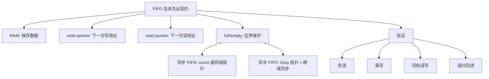

# 任务22：同步 FIFO / 异步 FIFO 的设计

## 本章知识全景图

### 一眼看懂这讲在讲什么

FIFO 的核心不是“有一块 RAM”，而是用读写指针和空满标志维护一个严格契约：先写入的数据必须先读出，满了不能覆盖未读数据，空了不能读出假数据。同步 FIFO 的难点在边界条件；异步 FIFO 的难点在跨时钟域指针不能直接比较。

核心概念：FIFO、RAM、depth、data width、write pointer、read pointer、write allow、read allow、occupancy counter、full、empty、同步 FIFO、异步 FIFO、CDC。

逻辑主线：

1. FIFO 是顺序缓存，验收目标是数据顺序和边界保护。
2. RAM 存数据，读写指针给地址，空满标志决定请求能否执行。
3. 同步 FIFO 可以用同一时钟域里的 count 或指针比较判断 full/empty。
4. 写请求和真实写入不是一回事，必须用 `write_allow = write_enable && !full`。
5. 异步 FIFO 的读写时钟不同，满空判断需要跨域信息，所以不能直接搬用同步 FIFO 的二进制指针。

### 概念地图



### 最短学习路径

1. 先记住 FIFO 的验收句：写入顺序必须等于读出顺序。
2. 再把接口分成请求信号、允许信号、数据端口和状态 flag。
3. 用 count 方法理解 `empty == count==0`、`full == count==DEPTH`。
4. 用四种读写组合检查 count 和指针怎么变。
5. 最后区分同步 FIFO 和异步 FIFO：同域可以直接比较，跨域必须处理 CDC。

## 1. FIFO 的本质是顺序契约

FIFO 是 First In First Out。它不是普通存储器，而是带顺序规则的缓存：先写入的数据必须先被读出。只要顺序错了，即使 RAM 里每个 bit 都没坏，FIFO 也失败。

视觉核对：02:20-02:50，画面展示 FIFO 基本概念；重点看“先进先出”而不是只看方框。


可以把 FIFO 想成一个环形停车场：`write_ptr` 是入口闸机指向的下一个车位，`read_ptr` 是出口闸机指向的下一个车位，`count` 是场内车辆数。`write_enable` 只是有车想进，`write_allow` 才是闸机真正放行；满场还让车进，就是覆盖未读数据，空场还让车出，就是读出假数据。

FIFO 常用在：

- 两个模块速率不完全一致，需要短时缓冲。
- pipeline 阶段之间要解耦。
- 总线或外设接口有突发传输。
- 跨时钟域传多 bit 数据，需要异步 FIFO。

最小验收句：

```text
写入序列 A0, A1, A2, A3
读出序列必须仍是 A0, A1, A2, A3
```

任何 full/empty、指针、计数器、RAM 代码都服务这句话。

## 2. 深度、位宽和地址位宽必须先算清

FIFO 的规格至少包含数据位宽和深度。`16x8` 表示 16 个存储位置，每个位置 8 bit；深度 16 需要 4 bit 地址，因为 `2^4 = 16`。

视觉核对：04:20-04:45，画面展示 FIFO memory depth，重点看 depth 与 address width 的关系。


基本参数：

```systemverilog
parameter int DATA_WIDTH = 8;
parameter int DEPTH      = 16;
localparam int ADDR_WIDTH = $clog2(DEPTH);
```

如果 `DEPTH` 不是 2 的幂，地址回绕、full/empty 判断和 Gray 指针都会更复杂。入门同步 FIFO 通常先用 2 的幂深度，避免把指针机制和非规则深度混在一起。

## 3. 请求信号不等于真实动作

外部给 `write_enable` 只表示“想写”，给 `read_enable` 只表示“想读”。FIFO 当前如果满了，写请求不能真正执行；如果空了，读请求不能真正执行。

视觉核对：12:40-13:05，画面展示读写端口，重点看 `write_enable/read_enable` 与 `full/empty` 的关系。


正确写法要先生成 allow：

```systemverilog
assign write_allow = write_enable && !full;
assign read_allow  = read_enable  && !empty;
```

后续状态更新都应该尽量基于 `write_allow/read_allow`：

- 写指针只在 `write_allow` 时推进。
- 读指针只在 `read_allow` 时推进。
- count 只在真实读写发生时变化。
- RAM 写入只在 `write_allow` 时发生。

如果直接用原始 enable，会出现满时覆盖旧数据、空时读出无效数据、指针越界推进等问题。

## 4. 双端口 RAM 让读写地址分开推进

FIFO 的数据存在 RAM 中。读写指针分别给出读地址和写地址，双端口 RAM 允许读写端相对独立；同步 FIFO 中读写同域，异步 FIFO 中读写分别属于两个时钟域。

视觉核对：24:50-25:20，画面展示 dual-port RAM 代码，重点看写端地址和读端地址分开。


抽象结构：

```systemverilog
logic [DATA_WIDTH-1:0] mem [DEPTH];

always_ff @(posedge clk) begin
  if (write_allow)
    mem[write_ptr] <= write_data;
end

always_ff @(posedge clk) begin
  if (read_allow)
    read_data <= mem[read_ptr];
end
```

同步读 RAM 的 `read_data` 常常晚一拍有效，testbench 不能按组合读的方式立刻比较，否则会把验证写错。读延迟属于 FIFO 规格的一部分，必须在文档和 testbench 里一致。

## 5. count 方法用占用量判断 full/empty

同步 FIFO 的直观方法是维护 occupancy counter：当前有多少个未读数据。`count == 0` 判空，`count == DEPTH` 判满。

视觉核对：28:25-28:55，画面展示 full/empty counter，重点看 count 与 full/empty 的直接关系。


典型写法：

```systemverilog
always_ff @(posedge clk or negedge rst_n) begin
  if (!rst_n) begin
    count <= '0;
  end else begin
    unique case ({write_allow, read_allow})
      2'b10: count <= count + 1'b1;
      2'b01: count <= count - 1'b1;
      default: count <= count;
    endcase
  end
end

assign empty = (count == 0);
assign full  = (count == DEPTH);
```

这里的关键是同拍读写：一进一出，占用量不变。如果写代码时先加再减，或在 full/empty 边界没有定义清楚同拍策略，就会出现一拍 flag 错误。

## 6. 四种读写组合必须逐项验收

FIFO 的状态更新不是“有写就加，有读就减”这么粗。要按 `{write_allow, read_allow}` 四种组合写清楚。

视觉核对：36:30-37:00，画面展示 read/write case，重点看四类动作对 count 的影响。


| `write_allow` | `read_allow` | count | 写指针 | 读指针 |
|---|---|---|---|---|
| 0 | 0 | 不变 | 不变 | 不变 |
| 1 | 0 | +1 | +1 | 不变 |
| 0 | 1 | -1 | 不变 | +1 |
| 1 | 1 | 不变 | +1 | +1 |

验证时必须覆盖这四类，尤其是边界处的同拍读写：

- FIFO 空时同时读写，是否允许读旧数据取决于设计规格。
- FIFO 满时同时读写，是否允许写入取决于是否把读出腾出的空间计入本拍。

课程入门阶段可以采用保守策略，但 RTL、testbench 和说明必须一致。

边界同拍策略不能靠读者猜：如果 `full=1` 时本拍同时读写，保守策略会先拒绝写，让写端下一拍再进；高吞吐策略会把本拍读出的空位立刻给写端使用。两种都能成立，但 `write_allow/read_allow`、指针推进、scoreboard 入队/出队必须采用同一套口径，否则波形看起来“差一拍”，本质是规格和验证没对齐。

## 7. 同步 FIFO 的结构可以拆成四块

同步 FIFO 的所有状态在同一个时钟边沿更新，所以它的结构相对清楚：RAM 保存数据，读写指针访问地址，count 或扩展指针生成 full/empty，allow 信号保护边界。

视觉核对：42:10-42:40，画面展示 sync FIFO architecture，重点看 RAM、指针和 flag 之间的连接。


看这张架构图只回答四件事：数据存在哪里，写指针何时加，读指针何时加，`full/empty` 从哪里来。它不是让你记方框位置，而是让你把每个 bug 归类：数据错查 RAM 和地址，边界错查 flag，吞吐错查 allow，顺序错查读写指针。

结构拆分：

```text
FIFO interface
  -> write/read allow generation
  -> RAM
  -> write pointer / read pointer
  -> full / empty generation
```

同步 FIFO 交付时要说明：

- reset 后 `empty=1`、`full=0`。
- 满时写请求如何处理。
- 空时读请求如何处理。
- 读数据是组合输出还是寄存器输出。
- 是否支持同拍读写。

这些不是附加说明，而是 testbench 和上游模块必须知道的接口契约。

## 8. 异步 FIFO 的分界是读写时钟不同

异步 FIFO 的写端和读端属于不同 clock domain。写指针在写时钟域推进，读指针在读时钟域推进。满判断需要知道读指针，空判断需要知道写指针，于是跨域指针同步成为真正难点。

视觉核对：47:00-47:30，画面引入 async FIFO，重点看写时钟域和读时钟域被分开。


异步 FIFO 的图要先用一刀切成写域和读域：写域只能相信写时钟下的寄存器，读域只能相信读时钟下的寄存器。跨域来的指针像“对方发来的延迟消息”，不能当成本域刚刚产生的实时状态直接比较。

不能直接做：

```systemverilog
assign full  = (write_ptr_next == read_ptr);  // 错：read_ptr 来自另一个时钟域
assign empty = (read_ptr_next  == write_ptr); // 错：write_ptr 来自另一个时钟域
```

原因：

- 跨域采样可能出现亚稳态。
- 多 bit 二进制指针可能同时多个 bit 变化，目标域可能采到一个源域从未存在过的中间值。
- full/empty 错误会直接导致覆盖未读数据或读出假数据。

完整异步 FIFO 通常要用 Gray 指针、两级同步器、本地 full/empty 判断和 CDC 约束。本章先把边界立住，后续再展开实现。

## 9. FIFO 验证的重点是边界，不是普通读写

FIFO 最容易在空、满、回绕和同拍读写处出错。只写一个数据再读一个数据，几乎不能证明设计正确。

视觉核对：50:50-51:20，画面展示 FIFO practice，重点看从 RAM、指针、flag 到 testbench 的练习顺序。


最小验证矩阵：

| 场景 | 必须检查 |
|---|---|
| reset | 指针、count 清零，`empty=1/full=0` |
| 连续写到满 | full 在正确边界拉高，不覆盖旧数据 |
| 满时继续写 | `write_allow=0`，写指针不推进 |
| 连续读到空 | empty 在正确边界拉高 |
| 空时继续读 | `read_allow=0`，读指针不推进 |
| 同拍读写 | 占用量和数据顺序符合规格 |
| 指针回绕 | 地址回到 0 后仍按顺序读回 |

推荐 testbench 用队列做 scoreboard：写入成功时 push，读出成功时 pop 并比较。波形用于定位错误，自检结果用于判定通过。

### 可直接照着写的同步 FIFO 自检口径

同步 FIFO 的 testbench 不要只打印波形，应当把“写成功”和“读成功”变成自检事件。下面是最小伪代码口径：

```systemverilog
if (write_enable && !full) begin
  ref_q.push_back(write_data);
end

if (read_enable && !empty) begin
  exp = ref_q.pop_front();
  if (read_data !== exp) begin
    $error("FIFO order error: got=%0h exp=%0h", read_data, exp);
  end
end
```

如果 RAM 是同步读，比较要延后一拍；如果 `read_data` 是组合读，可以在读允许后留一个 `#1` 再比较。这个延迟必须和 RTL 规格一致，否则 testbench 会把正确 FIFO 判错。

边界断言可以这样写成自然语言检查：

- reset 后第一拍：`empty` 必须为 1，`full` 必须为 0。
- `full=1` 且无读时：写指针不能推进，scoreboard 不能 push。
- `empty=1` 且无写时：读指针不能推进，scoreboard 不能 pop。
- 同拍读写：如果设计允许，push 和 pop 都发生；如果设计禁止边界同拍写/读，testbench 要按规格判断。

最小运行口径可以固定成三步：

```bash
vcs -full64 -sverilog -f filelist.f -debug_access+all -l compile.log
./simv +DEPTH=16 +WIDTH=8 +SEED=1 -l sim.log
verdi -f filelist.f -ssf sync_fifo.fsdb &
```

`filelist.f` 应包含 FIFO RTL、RAM 模块和 testbench。TB 要把 `DEPTH/WIDTH`、读延迟和随机种子写进 log；同步读 RAM 延后一拍时，scoreboard 比较也要延后一拍。合格日志至少应出现 reset、写满、满写阻塞、读空、空读阻塞、同拍读写、回绕这几类 PASS；如果只有 `finish`，不能证明 FIFO 正确。

## 本章速记

- FIFO 的验收核心是数据顺序和边界保护。
- 请求信号不是真实动作，真实动作要看 `write_allow/read_allow`。
- 同步 FIFO 可以用 count 直接生成 full/empty。
- 同拍读写要单独定义，不能靠“先加后减”糊过去。
- 异步 FIFO 的本质难点是 CDC，不能直接跨域比较二进制指针。

## 自测题与答案

1. **FIFO 的最小正确性要求是什么？**  
   答：先写入的数据必须先读出；满时不能覆盖未读数据，空时不能读出假数据。

2. **为什么写入条件要用 `write_enable && !full`？**  
   答：`write_enable` 只是外部请求，FIFO 满时继续写会覆盖未读数据，所以真实写入必须受 `full` 保护。

3. **同拍读写时 count 为什么通常不变？**  
   答：本拍写入一个数据同时读出一个数据，占用量一进一出，净变化为 0。

4. **同步 FIFO 和异步 FIFO 最大区别是什么？**  
   答：同步 FIFO 读写同 clock，可在同一时钟域直接维护 count 或比较指针；异步 FIFO 读写属于不同 clock domain，满空判断需要跨域同步对方指针。

5. **为什么 FIFO 验证必须覆盖指针回绕？**  
   答：FIFO 是环形缓存，地址回到 0 时最容易把空和满、旧数据和新数据混淆；不测回绕无法证明边界正确。

6. **异步 FIFO 为什么不能直接拿对方指针判断满空？**  
   答：对方指针属于另一个时钟域，直接采样可能亚稳态；二进制多 bit 同时变化时还可能采到错误中间值。

